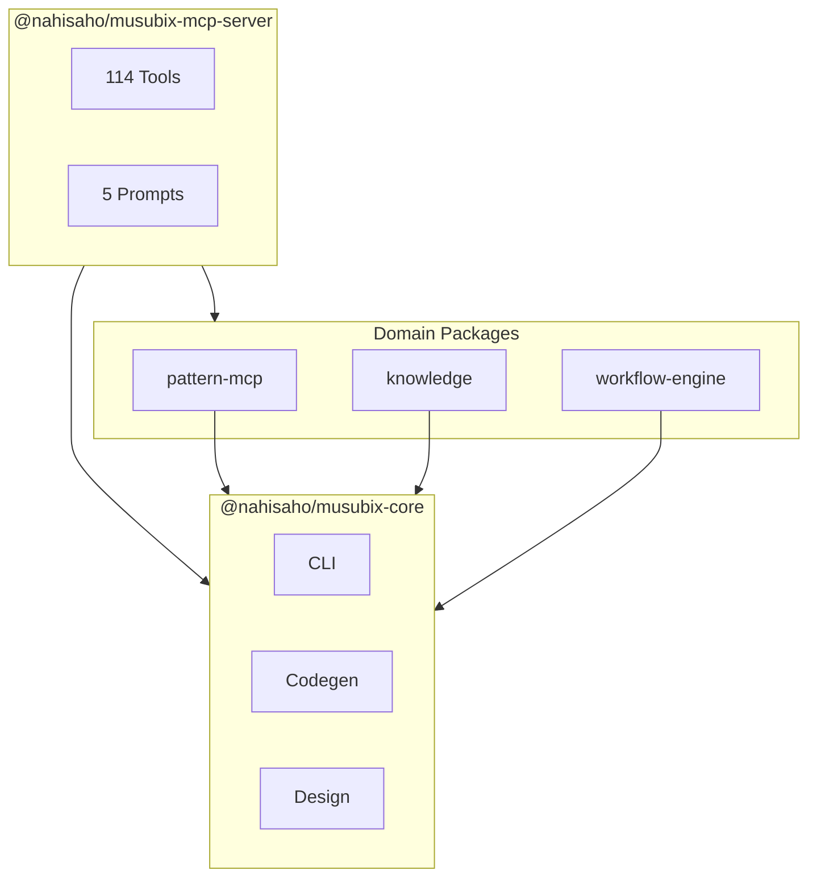

# Codemap Generation Skill

コードベースのアーキテクチャを自動的に分析し、ドキュメントを生成するスキルです。

## 概要

このスキルは以下の機能を提供します：

1. **リポジトリ構造分析** - ワークスペース、パッケージ、ディレクトリ構造の識別
2. **モジュール分析** - エクスポート、インポート、依存関係の抽出
3. **コードマップ生成** - 構造化されたドキュメントの自動生成
4. **差分検出** - 既存マップとの差分率計算

## コマンド

### `/codemap generate`

リポジトリ全体のコードマップを生成します。

```
/codemap generate [--output <dir>] [--format <md|json>]
```

**オプション**:
- `--output`: 出力ディレクトリ（デフォルト: `docs/CODEMAPS/`）
- `--format`: 出力形式（デフォルト: `md`）

### `/codemap analyze <path>`

特定のディレクトリまたはパッケージを分析します。

```
/codemap analyze packages/core
```

### `/codemap diff`

既存のコードマップと現在の状態の差分を表示します。

```
/codemap diff [--threshold <percent>]
```

**オプション**:
- `--threshold`: 承認を求める差分率閾値（デフォルト: 30%）

## 実行手順

### REQ-CM-001: リポジトリ構造分析

1. **ワークスペース検出**
   ```bash
   # package.jsonのworkspacesフィールドを確認
   cat package.json | jq '.workspaces'
   
   # または pnpm-workspace.yaml を確認
   cat pnpm-workspace.yaml
   ```

2. **ディレクトリ構造マッピング**
   ```bash
   # 主要ディレクトリの一覧
   find . -maxdepth 2 -type d -not -path '*/node_modules/*' -not -path '*/.git/*'
   ```

3. **エントリーポイント識別**
   - `src/index.ts` または `src/main.ts`
   - `bin/` 配下の実行ファイル
   - `package.json` の `main`, `exports` フィールド

4. **フレームワークパターン検出**
   - Next.js: `next.config.js`, `pages/` or `app/`
   - Express: `app.ts`, `routes/`
   - Fastify: `server.ts`, `plugins/`

### REQ-CM-002: モジュール分析

各モジュールについて以下を抽出してください：

1. **エクスポート（公開API）**
   ```bash
   # TypeScriptのエクスポートを検索
   grep -rn "^export" packages/*/src/index.ts
   ```

2. **インポート（依存関係）**
   ```bash
   # 外部依存関係
   grep -rn "from '[^.]" packages/*/src/*.ts | head -50
   
   # 内部依存関係
   grep -rn "from '\.\." packages/*/src/*.ts | head -50
   ```

3. **APIルート**（該当する場合）
   ```bash
   # Next.js API Routes
   ls -la pages/api/ app/api/
   
   # Express Routes
   grep -rn "router\." src/routes/
   ```

4. **データベースモデル**
   ```bash
   # Prismaモデル
   cat prisma/schema.prisma | grep -A5 "^model"
   
   # TypeORMエンティティ
   find . -name "*.entity.ts" -exec grep -l "Entity" {} \;
   ```

5. **バックグラウンドワーカー**
   ```bash
   # ワーカーファイルを検索
   find . -name "*worker*" -o -name "*job*" -o -name "*queue*"
   ```

### REQ-CM-003: コードマップ生成

以下の構造でドキュメントを生成してください：

```
docs/CODEMAPS/
├── INDEX.md              # 全体概要
├── frontend.md           # フロントエンド構造（該当する場合）
├── backend.md            # バックエンド/API構造
├── packages.md           # パッケージ一覧と依存関係
├── database.md           # データベーススキーマ（該当する場合）
├── integrations.md       # 外部サービス連携
└── workers.md            # バックグラウンドジョブ（該当する場合）
```

#### INDEX.md テンプレート

```markdown
# Code Map: [Project Name]

**Generated**: [Date]
**Version**: [Project Version]

## Architecture Overview

[Mermaid図またはASCII図でアーキテクチャを表現]

## Package Structure

| Package | Description | Dependencies |
|---------|-------------|--------------|
| @scope/pkg1 | 説明 | pkg2, pkg3 |
| @scope/pkg2 | 説明 | - |

## Entry Points

- **CLI**: `bin/musubix.js`
- **MCP Server**: `packages/mcp-server/src/index.ts`
- **Library**: `packages/core/src/index.ts`

## Key Flows

1. [主要フロー1の説明]
2. [主要フロー2の説明]

## Quick Links

- [Frontend](frontend.md)
- [Backend](backend.md)
- [Database](database.md)
```

### REQ-CM-004: 差分検出とレポート

既存のコードマップがある場合、更新前に差分を計算してください：

1. **差分率計算**
   ```
   diff% = (変更行数 / 総行数) × 100
   ```

2. **閾値チェック**
   - 差分率 > 30%の場合、ユーザーに承認を求める
   - 「大幅な構造変更が検出されました。更新を続行しますか？」

3. **レポート出力**
   `.reports/codemap-diff.txt` に以下を記録：
   ```
   Codemap Diff Report
   ===================
   Date: [timestamp]
   Previous: [old_commit_sha]
   Current: [current_commit_sha]
   
   Summary:
   - Files added: X
   - Files removed: Y
   - Files modified: Z
   - Diff percentage: XX.X%
   
   Major Changes:
   - [変更1の説明]
   - [変更2の説明]
   ```

## MCPツール統合

このスキルはMUSUBIX MCPサーバーの以下のツールと連携します：

- `codegraph_analyze`: コード構造解析
- `codegraph_dependencies`: 依存関係グラフ生成
- `codegraph_exports`: エクスポート一覧取得

MCPツールが利用可能な場合は、それらを優先的に使用してください。

```typescript
// MCP呼び出し例
const analysis = await mcp.call('codegraph_analyze', {
  path: 'packages/core',
  depth: 3,
  includeTests: false,
});
```

## 出力例

### パッケージ構造図（Mermaid）



## ベストプラクティス

1. **定期更新**: 主要なリリース前にコードマップを更新
2. **差分レビュー**: 大きな構造変更時は差分を確認
3. **チーム共有**: 新メンバーのオンボーディングに活用
4. **CI統合**: PRで構造変更がある場合は警告を表示

## 関連スキル

- `refactor-cleaner`: デッドコード検出後のクリーンアップ
- `session-manager`: セッション状態の追跡

---

**Traceability**: REQ-CM-001, REQ-CM-002, REQ-CM-003, REQ-CM-004
