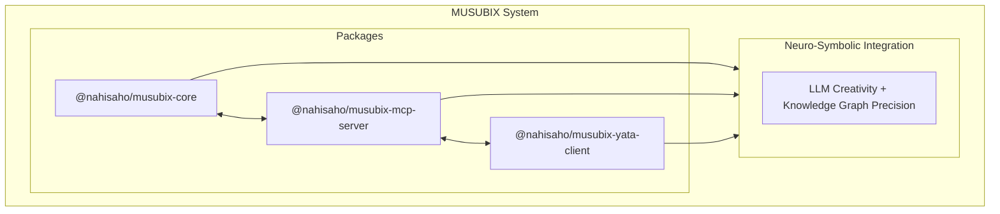

# MUSUBIX - ニューロシンボリックAI統合システム

[](https://www.npmjs.com/package/musubix)
[](https://www.npmjs.com/package/@nahisaho/musubix-core)
[](https://www.npmjs.com/package/@nahisaho/musubix-mcp-server)
[](https://nodejs.org/)
[](LICENSE)
[](https://www.typescriptlang.org/)
[](https://github.com/nahisaho/MUSUBIX)

> MUSUBI × YATA 統合による次世代AIコーディングシステム
>
> **v1.0.20** - IdGenerator・StatusWorkflowユーティリティ追加、10プロジェクト検証からの自己学習適用

## 概要

MUSUBIXは、**ニューラル（LLM）** と **シンボリック（知識グラフ）** 推論を統合した革新的なAIコーディングシステムです。MUSUBI SDDの方法論とYATAの知識グラフ推論を組み合わせ、高品質なソフトウェア開発を支援します。

### 特徴

- 🧠 **ニューロシンボリック統合** - LLMの創造性とYATA知識グラフの厳密性を融合
- 📋 **EARS形式要件分析** - 自然言語から正式な要件への変換・検証
- 🎨 **設計パターン推奨** - コンテキストに基づくC4モデル・ADR生成
- ✅ **テスト駆動開発** - Test-First原則による品質保証
- 🔗 **完全なトレーサビリティ** - 要件からコードまでの追跡可能性
- 💬 **一問一答形式ヒアリング** - 対話的な要件定義サポート
- 🌐 **多言語対応（i18n）** - 日本語・英語対応
- 🔒 **セキュリティスキャン** - 脆弱性検出・認証管理
- 📚 **自己学習システム** - フィードバック収集とパターン抽出による適応的改善
- 🏗️ **C4コード生成** - C4設計ドキュメントからTypeScriptスケルトン生成

## アーキテクチャ



## プロジェクト構造

| パス | 説明 |
|------|------|
| `packages/core/` | コアライブラリ（56モジュール） |
| `packages/core/auth/` | 認証・認可 |
| `packages/core/cli/` | CLIインターフェース |
| `packages/core/codegen/` | コード生成・解析 |
| `packages/core/design/` | 設計パターン・C4モデル |
| `packages/core/error/` | エラーハンドリング |
| `packages/core/explanation/` | 説明生成・可視化 |
| `packages/core/learning/` | 自己学習・パターン抽出 |
| `packages/core/requirements/` | 要件分析・分解 |
| `packages/core/traceability/` | トレーサビリティ |
| `packages/core/types/` | 型定義 |
| `packages/core/utils/` | ユーティリティ |
| `packages/core/validators/` | EARS検証 |
| `packages/mcp-server/` | MCPサーバー（34 tools, 3 prompts） |
| `packages/yata-client/` | YATA クライアント |
| `steering/` | プロジェクトメモリ |
| `storage/` | 仕様書・成果物 |
| `templates/` | テンプレート |
| `docs/` | ドキュメント |

## 要件

- Node.js >= 20.0.0
- npm >= 10.0.0
- TypeScript >= 5.3

## インストール

### npm/npx（推奨）

```bash
# グローバルインストール
npm install -g musubix

# npx で直接実行
npx musubix init
npx musubix --help

# MCPサーバー起動
npx @nahisaho/musubix-mcp-server
npx musubix-mcp --transport stdio
```

### スコープ付きパッケージ

```bash
# 個別パッケージのインストール
npm install @nahisaho/musubix-core
npm install @nahisaho/musubix-mcp-server
npm install @nahisaho/musubix-yata-client
```

### ソースからビルド

```bash
git clone https://github.com/nahisaho/MUSUBIX.git
cd MUSUBIX
npm install
npm run build
```

## 開発

\`\`\`bash
# ビルド
npm run build

# テスト実行
npm test

# リント
npm run lint

# 型チェック
npm run type-check
\`\`\`

## 主要機能

### 要件定義（Article II準拠）

- **EARS検証**: Easy Approach to Requirements Syntax パターン検証
- **一問一答ヒアリング**: 対話形式での要件収集
- **要件分解**: 大きな要件を実装単位に分解
- **関連要件検索**: 類似・依存要件の自動検出

### 設計生成（Article III準拠）

- **C4モデル生成**: Context/Container/Component/Code図
- **ADR生成**: Architecture Decision Records
- **パターン検出**: デザインパターンの自動検出・推奨
- **SOLID検証**: SOLID原則準拠チェック

### コード生成・検証

- **静的解析**: 品質メトリクス・複雑度計算
- **セキュリティスキャン**: 脆弱性検出
- **テスト生成**: ユニット・統合テスト生成
- **カバレッジレポート**: テストカバレッジ計測

### MCPサーバー

34個のツールと3つのプロンプトを提供:

\`\`\`bash
# MCPサーバー起動
npx @nahisaho/musubix-mcp-server
\`\`\`

## ドキュメント

| 文書 | 説明 |
|------|------|
| [要件定義書](storage/specs/REQ-MUSUBIX-001.md) | EARS形式の機能・非機能要件 |
| [設計書](storage/specs/DES-MUSUBIX-001.md) | C4モデル・ADRベースの設計 |
| [タスク定義書](storage/specs/TSK-MUSUBIX-001.md) | 56タスクのスプリント計画 |
| [APIリファレンス](docs/API-REFERENCE.md) | 公開API仕様 |

## 憲法（9条）

MUSUBIXは以下の9条の憲法に準拠しています：

1. **Specification First** - 要件が先、実装は後
2. **Design Before Code** - 設計が先、コードは後  
3. **Single Source of Truth** - プロジェクトメモリが正
4. **Traceability** - 要件〜コードの追跡可能性
5. **Incremental Progress** - 小さく頻繁にデリバリー
6. **Decision Documentation** - 決定はADRで記録
7. **Quality Gates** - フェーズ検証必須
8. **User-Centric** - ユーザー価値を文書化
9. **Continuous Learning** - 振り返りと改善

## ライセンス

MIT License - 詳細は [LICENSE](LICENSE) を参照

## 作者

nahisaho

## 変更履歴

[CHANGELOG.md](CHANGELOG.md) を参照

---

**文書ID**: README  
**バージョン**: 1.0.20  
**最終更新**: 2026-01-05
