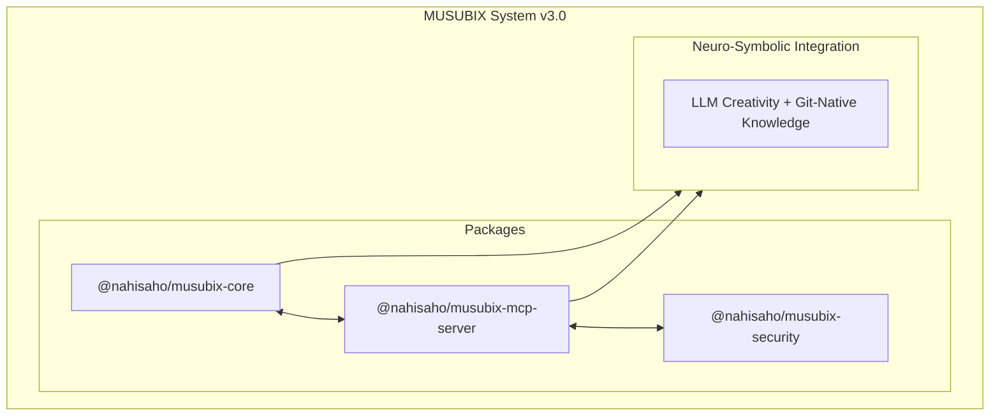

# MUSUBIX - ニューロシンボリックAI統合システム

[](https://www.npmjs.com/package/musubix)
[](https://www.npmjs.com/package/@nahisaho/musubix-core)
[](https://www.npmjs.com/package/@nahisaho/musubix-mcp-server)
[](https://nodejs.org/)
[](LICENSE)
[](https://www.typescriptlang.org/)
[](https://github.com/nahisaho/MUSUBIX)
[](https://www.npmjs.com/package/@nahisaho/musubix-security)

> Git-Native知識統合による次世代AIコーディングシステム
>
> **v3.0.0** - Git-Native Knowledge System

## 概要

MUSUBIXは、**ニューラル（LLM）** と **シンボリック（知識グラフ）** 推論を統合した革新的なAIコーディングシステムです。MUSUBI SDDの方法論とGit-Native知識管理を組み合わせ、高品質なソフトウェア開発を支援します。

### 特徴

- 🧠 **ニューロシンボリック統合** - LLMの創造性と知識グラフの厳密性を融合
- � **シンボリック推論** - 形式検証、幻覚検出、憲法強制
- 📝 **EARS形式要件分析** - 自然言語から正式な要件への変換・検証
- 🎨 **設計パターン推奨** - コンテキストに基づくC4モデル・ADR生成
- ✅ **テスト駆動開発** - Test-First原則による品質保証
- 🔗 **完全なトレーサビリティ** - 要件からコードまでの追跡可能性
- 💬 **一問一答形式ヒアリング** - 対話的な要件定義サポート
- 🌐 **多言語対応（i18n）** - 日本語・英語対応
- 🔒 **セキュリティスキャン** - 脆弱性検出、シークレットスキャン、OWASPパターン
- 📚 **自己学習システム** - フィードバック収集とパターン抽出による適応的改善
- 🏗️ **C4コード生成** - C4設計ドキュメントからTypeScriptスケルトン生成
- ⚙️ **品質ゲート** - フェーズ移行前の自動品質検証
- 🔮 **高度推論** - OWL 2 RL推論とDatalog評価 *(v1.4.5)*
- 🖥️ **対話的REPL** - コマンド補完、履歴管理、セッション変数 *(v1.6.0)*
- � **Git-Native知識** - ファイルベースの知識グラフ管理 *(v3.0.0)*
- 🔬 **形式検証** - Z3 SMTソルバー統合、Hoareトリプル検証、EARS→SMT変換 *(v1.7.5)*
- 🛡️ **セキュリティ分析** - 脆弱性スキャン、シークレット検出、テイント解析、依存関係監査 *(v1.8.0)*

## アーキテクチャ



## プロジェクト構造

| パス | 説明 |
|------|------|
| `packages/core/` | コアライブラリ（249モジュール） |
| `packages/core/auth/` | 認証・認可 |
| `packages/core/cli/` | CLIインターフェース |
| `packages/core/codegen/` | コード生成・解析 |
| `packages/core/design/` | 設計パターン・C4モデル |
| `packages/core/error/` | エラーハンドリング |
| `packages/core/explanation/` | 説明生成・可視化 |
| `packages/core/learning/` | 自己学習・パターン抽出 |
| `packages/core/requirements/` | 要件分析・分解 |
| `packages/core/symbolic/` | シンボリック推論 |
| `packages/core/traceability/` | トレーサビリティ |
| `packages/core/types/` | 型定義 |
| `packages/core/utils/` | ユーティリティ |
| `packages/core/validators/` | EARS検証 |
| `packages/mcp-server/` | MCPサーバー（35 tools, 5 prompts） |
| `packages/pattern-mcp/` | **パターン学習** |
| `packages/ontology-mcp/` | **オントロジーエンジン** |
| `packages/wake-sleep/` | **Wake-Sleep学習** |
| `packages/sdd-ontology/` | **SDDオントロジー** |
| `packages/security/` | **セキュリティ分析** |
| `packages/formal-verify/` | **形式検証** |
| `steering/` | プロジェクトメモリ |
| `storage/` | 仕様書・成果物 |
| `templates/` | テンプレート |
| `docs/` | ドキュメント |

## 要件

- Node.js >= 20.0.0
- npm >= 10.0.0
- TypeScript >= 5.3

## インストール

### npm/npx（推奨）

```bash
# グローバルインストール
npm install -g musubix

# npx で直接実行
npx musubix init
npx musubix --help

# MCPサーバー起動
npx @nahisaho/musubix-mcp-server
npx musubix-mcp --transport stdio
```

### スコープ付きパッケージ

```bash
# 個別パッケージのインストール
npm install @nahisaho/musubix-core
npm install @nahisaho/musubix-mcp-server
npm install @nahisaho/musubix-security
npm install @nahisaho/musubix-formal-verify
```

### ソースからビルド

```bash
git clone https://github.com/nahisaho/MUSUBIX.git
cd MUSUBIX
npm install
npm run build
```

## 開発

\`\`\`bash
# ビルド
npm run build

# テスト実行
npm test

# リント
npm run lint

# 型チェック
npm run type-check
\`\`\`

## 主要機能

### 要件定義（Article II準拠）

- **EARS検証**: Easy Approach to Requirements Syntax パターン検証
- **一問一答ヒアリング**: 対話形式での要件収集
- **要件分解**: 大きな要件を実装単位に分解
- **関連要件検索**: 類似・依存要件の自動検出

### 設計生成（Article III準拠）

- **C4モデル生成**: Context/Container/Component/Code図
- **ADR生成**: Architecture Decision Records
- **パターン検出**: デザインパターンの自動検出・推奨
- **SOLID検証**: SOLID原則準拠チェック

### コード生成・検証

- **静的解析**: 品質メトリクス・複雑度計算
- **セキュリティスキャン**: 脆弱性検出
- **テスト生成**: ユニット・統合テスト生成
- **カバレッジレポート**: テストカバレッジ計測

### MCPサーバー

16個のツール（SDD 9個 + パターン 7個）と3つのプロンプトを提供:

```bash
# MCPサーバー起動
npx @nahisaho/musubix-mcp-server
```

## ドキュメント

| 文書 | 説明 |
|------|------|
| [要件定義書](storage/specs/REQ-MUSUBIX-001.md) | EARS形式の機能・非機能要件 |
| [設計書](storage/specs/DES-MUSUBIX-001.md) | C4モデル・ADRベースの設計 |
| [タスク定義書](storage/specs/TSK-MUSUBIX-001.md) | 56タスクのスプリント計画 |
| [APIリファレンス](docs/API-REFERENCE.md) | 公開API仕様 |
| [シンボリック統合](storage/specs/REQ-SYMB-001.md) | Neuro-Symbolic要件（27要件） |

## シンボリック推論モジュール（v1.2.0）

新しいシンボリック推論モジュール:

### Phase 1: 基盤
- **SemanticCodeFilterPipeline** - LLM出力のセマンティック検証
- **HallucinationDetector** - 未定義シンボル・無効インポートの検出
- **ConstitutionRuleRegistry** - 9憲法条項の強制
- **ConfidenceEstimator** - AST複雑度、要件カバレッジのスコアリング
- **ConfidenceBasedRouter** - 信頼度ベースのルーティング決定
- **ErrorHandler** - グレースフルデグラデーション

### Phase 2: 形式検証
- **EarsToFormalSpecConverter** - EARS → SMT-LIB変換
- **VerificationConditionGenerator** - 検証条件（VC）生成
- **Z3Adapter** - Z3 SMTソルバー統合
- **SecurityScanner** - OWASPパターン、シークレット検出

### Phase 3: 高度機能
- **CandidateRanker** - 複数基準による候補スコアリング
- **ResultBlender** - Neural/Symbolic結果統合（3戦略）
- **ExtensibleRuleConfig** - YAML/JSONルール設定
- **AuditLogger** - SHA-256ハッシュチェーン改ざん検出
- **PerformanceBudget** - 段階別予算、SLOメトリクス
- **QualityGateValidator** - 自動品質ゲート検証

## Wake-Sleep学習サイクル（v1.3.0）

Wake-Sleepアルゴリズムに基づく継続的学習システム:

| フェーズ | 処理内容 |
|---------|----------|
| **Wake** | コード観察 → パターン抽出 → 知識グラフ更新 |
| **Sleep** | パターン統合 → 類似パターン圧縮 → メモリ最適化 |

### 主要コンポーネント
- **WakeSleepCycle** - 学習サイクルのオーケストレーション
- **PatternLibrary** - 学習済みパターンの永続化管理
- **PatternOntologyBridge** - パターン↔オントロジー相互変換
- **N3Store** - RDF/OWLベースの知識グラフストレージ

### 新MCPツール（7ツール）
- `pattern_extract` - コードからパターンを抽出
- `pattern_compress` - パターンの抽象化・圧縮
- `pattern_store` - パターンライブラリへの保存
- `pattern_query` - パターンの検索・取得
- `pattern_consolidate` - 類似パターンの統合
- `ontology_query` - オントロジーグラフへのクエリ
- `ontology_infer` - オントロジーによる推論実行

## 高度推論（v1.4.5）

OWL 2 RLプロファイル推論とDatalog評価エンジン:

### 推論コンポーネント
- **OWL2RLReasoner** - OWL 2 RLプロファイル準拠推論（20+ビルトインルール）
- **DatalogEngine** - ストラティファイドDatalog評価（否定サポート）
- **InferenceExplainer** - 人間可読な推論説明生成
- **ProgressReporter** - リアルタイム進捗フィードバック（500ms間隔）

### OWL 2 RLビルトインルール
| カテゴリ | ルール | 説明 |
|----------|-------|------|
| Class Axioms | cax-sco, cax-eqc | サブクラス、同値クラス推論 |
| Property | prp-dom, prp-rng | ドメイン、レンジ推論 |
| Property Characteristics | prp-symp, prp-trp, prp-inv | 対称、推移、逆プロパティ |
| Equality | eq-ref, eq-sym, eq-trans | sameAs推論 |

### 説明フォーマット
- `text` - プレーンテキスト説明
- `markdown` - Markdown形式
- `html` - HTML形式（エスケープ対応）

## 憲法（9条）

MUSUBIXは以下の9条の憲法に準拠しています：

1. **Specification First** - 要件が先、実装は後
2. **Design Before Code** - 設計が先、コードは後  
3. **Single Source of Truth** - プロジェクトメモリが正
4. **Traceability** - 要件〜コードの追跡可能性
5. **Incremental Progress** - 小さく頻繁にデリバリー
6. **Decision Documentation** - 決定はADRで記録
7. **Quality Gates** - フェーズ検証必須
8. **User-Centric** - ユーザー価値を文書化
9. **Continuous Learning** - 振り返りと改善

## ライセンス

MIT License - 詳細は [LICENSE](LICENSE) を参照

## 作者

nahisaho

## 変更履歴

[CHANGELOG.md](CHANGELOG.md) を参照

---

**文書ID**: README  
**バージョン**: 1.8.0  
**最終更新**: 2026-01-06
