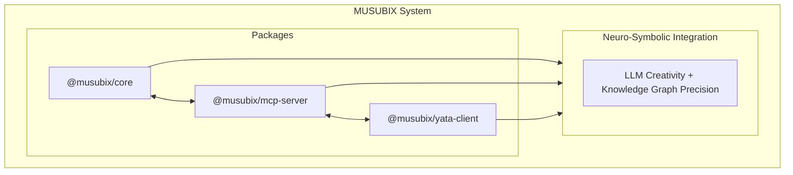

# MUSUBIX - Neuro-Symbolic AI Integration System

[](https://nodejs.org/)
[](LICENSE)
[](https://www.typescriptlang.org/)
[](https://github.com/nahisaho/MUSUBIX)
[](https://github.com/nahisaho/MUSUBIX)

> Next-generation AI Coding System powered by MUSUBI × YATA Integration

**[日本語版 README](README.ja.md)**

## Overview

MUSUBIX is an innovative AI coding system that integrates **Neural (LLM)** and **Symbolic (Knowledge Graph)** reasoning. It combines MUSUBI SDD methodology with YATA knowledge graph reasoning to support high-quality software development.

### Features

- 🧠 **Neuro-Symbolic Integration** - Fusion of LLM creativity and YATA knowledge graph precision
- 📋 **EARS Requirements Analysis** - Conversion and validation from natural language to formal requirements
- 🎨 **Design Pattern Recommendations** - Context-based C4 model and ADR generation
- ✅ **Test-Driven Development** - Quality assurance through Test-First principles
- 🔗 **Complete Traceability** - Tracking from requirements to code
- 💬 **Interactive Q&A Hearing** - Dialogue-based requirements gathering support
- 🌐 **Internationalization (i18n)** - Japanese and English support
- 🔒 **Security Scanning** - Vulnerability detection and authentication management

## Architecture



## Project Structure

| Path | Description |
|------|-------------|
| `packages/core/` | Core library (56 modules) |
| `packages/core/auth/` | Authentication & Authorization |
| `packages/core/cli/` | CLI Interface |
| `packages/core/codegen/` | Code Generation & Analysis |
| `packages/core/design/` | Design Patterns & C4 Models |
| `packages/core/error/` | Error Handling |
| `packages/core/explanation/` | Explanation Generation & Visualization |
| `packages/core/requirements/` | Requirements Analysis & Decomposition |
| `packages/core/traceability/` | Traceability |
| `packages/core/types/` | Type Definitions |
| `packages/core/utils/` | Utilities |
| `packages/core/validators/` | EARS Validation |
| `packages/mcp-server/` | MCP Server (34 tools, 3 prompts) |
| `packages/yata-client/` | YATA Client |
| `steering/` | Project Memory |
| `storage/` | Specifications & Artifacts |
| `templates/` | Templates |
| `docs/` | Documentation |

## Requirements

- Node.js >= 20.0.0
- npm >= 10.0.0
- TypeScript >= 5.3

## Installation

### npm/npx (Recommended)

```bash
# Global installation
npm install -g musubix

# Run directly with npx
npx musubix init
npx musubix --help

# Start MCP Server
npx @musubix/mcp-server
npx musubix-mcp --transport stdio
```

### Scoped Packages

```bash
# Install individual packages
npm install @musubix/core
npm install @musubix/mcp-server
npm install @musubix/yata-client
```

### Build from Source

```bash
git clone https://github.com/nahisaho/MUSUBIX.git
cd MUSUBIX
npm install
npm run build
```

## Development

```bash
# Build
npm run build

# Run tests
npm test

# Lint
npm run lint

# Type check
npm run type-check
```

## Key Features

### Requirements Definition (Article II Compliant)

- **EARS Validation**: Easy Approach to Requirements Syntax pattern validation
- **Interactive Q&A Hearing**: Dialogue-based requirements gathering
- **Requirements Decomposition**: Breaking down large requirements into implementation units
- **Related Requirements Search**: Automatic detection of similar and dependent requirements

### Design Generation (Article III Compliant)

- **C4 Model Generation**: Context/Container/Component/Code diagrams
- **ADR Generation**: Architecture Decision Records
- **Pattern Detection**: Automatic detection and recommendation of design patterns
- **SOLID Validation**: SOLID principle compliance checking

### Code Generation & Verification

- **Static Analysis**: Quality metrics and complexity calculation
- **Security Scanning**: Vulnerability detection
- **Test Generation**: Unit and integration test generation
- **Coverage Reporting**: Test coverage measurement

### MCP Server

Provides 34 tools and 3 prompts:

```bash
# Start MCP Server
npx @musubix/mcp-server
```

## Documentation

| Document | Description |
|----------|-------------|
| [Requirements Specification](storage/specs/REQ-MUSUBIX-001.md) | EARS format functional/non-functional requirements |
| [Design Document](storage/specs/DES-MUSUBIX-001.md) | C4 model and ADR-based design |
| [Task Definition](storage/specs/TSK-MUSUBIX-001.md) | 56 tasks sprint plan |
| [API Reference](docs/API-REFERENCE.md) | Public API specification |

## Constitutional Articles (9 Articles)

MUSUBIX adheres to the following 9 constitutional articles:

1. **Specification First** - Requirements before implementation
2. **Design Before Code** - Design before coding
3. **Single Source of Truth** - Project memory is authoritative
4. **Traceability** - Tracking from requirements to code
5. **Incremental Progress** - Small, frequent deliveries
6. **Decision Documentation** - Decisions recorded as ADRs
7. **Quality Gates** - Phase validation required
8. **User-Centric** - Document user value
9. **Continuous Learning** - Retrospectives and improvements

## License

MIT License - See [LICENSE](LICENSE) for details

## Author

nahisaho

## Changelog

See [CHANGELOG.md](CHANGELOG.md)

---

**Document ID**: README  
**Version**: 1.0.0  
**Last Updated**: 2026-01-02
