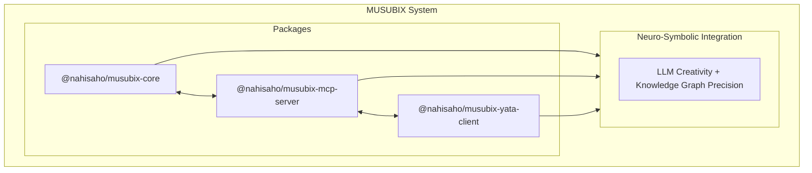

# MUSUBIX - Neuro-Symbolic AI Integration System

[](https://github.com/nahisaho/MUSUBIX/actions/workflows/ci.yml)
[](https://www.npmjs.com/package/musubix)
[](https://www.npmjs.com/package/@nahisaho/musubix-core)
[](https://www.npmjs.com/package/@nahisaho/musubix-mcp-server)
[](https://nodejs.org/)
[](LICENSE)
[](https://www.typescriptlang.org/)
[](https://github.com/nahisaho/MUSUBIX)
[](https://www.npmjs.com/package/@nahisaho/musubix-security)
[](https://www.npmjs.com/package/@nahisaho/musubix-dfg)
[](https://www.npmjs.com/package/@nahisaho/musubix-lean)
[](https://www.npmjs.com/package/@nahisaho/yata-scale)
[](https://www.npmjs.com/package/@nahisaho/musubix-synthesis)
[](https://www.npmjs.com/package/@nahisaho/musubix-library-learner)
[](https://www.npmjs.com/package/@nahisaho/musubix-neural-search)

> Next-generation AI Coding System powered by MUSUBI × YATA Integration
>
> **v2.0.0** - Deep Symbolic Integration & Advanced Learning Edition

**[日本語版 README](README.ja.md)**

## Overview

MUSUBIX is an innovative AI coding system that integrates **Neural (LLM)** and **Symbolic (Knowledge Graph)** reasoning. It combines MUSUBI SDD methodology with YATA knowledge graph reasoning to support high-quality software development.

### 🎉 v2.0.0 Highlights

- **Phase 1: Deep Symbolic Integration** - DFG/CFG analysis, Lean 4 theorem proving, distributed KG
- **Phase 2: Advanced Learning** - DreamCoder-style library learning, neural search, program synthesis
- **1600+ tests** passing across 19 packages

### Features

- 🧠 **Neuro-Symbolic Integration** - Fusion of LLM creativity and YATA knowledge graph precision
- 📊 **DFG/CFG Analysis** - Data flow and control flow graph extraction for TypeScript/JavaScript *(v2.0.0)*
- 🧮 **Lean 4 Integration** - Formal theorem proving with EARS-to-Lean conversion *(v2.0.0)*
- 📈 **YATA Scale** - Distributed knowledge graph with sharding and multi-tier caching *(v2.0.0)*
- 📚 **Library Learning** - DreamCoder-style hierarchical abstraction and pattern compression *(v2.0.0)*
- 🔍 **Neural Search** - Neural-guided program synthesis with beam search *(v2.0.0)*
- ⚗️ **Program Synthesis** - DSL-based PBE synthesis with witness functions *(v2.0.0)*
- 🔒 **Symbolic Reasoning** - Formal verification, hallucination detection, constitution enforcement
- 📝 **EARS Requirements Analysis** - Conversion and validation from natural language to formal requirements
- 🎨 **Design Pattern Recommendations** - Context-based C4 model and ADR generation
- ✅ **Test-Driven Development** - Quality assurance through Test-First principles
- 🔗 **Complete Traceability** - Tracking from requirements to code
- 🛡️ **Security Analysis** - Vulnerability scanning, secret detection, taint analysis *(v1.8.0)*
- 🔬 **Formal Verification** - Z3 SMT solver integration, Hoare triple verification *(v1.7.5)*
- 🖥️ **Interactive REPL** - Command completion, history, session variables *(v1.6.0)*
- 🔮 **Advanced Inference** - OWL 2 RL reasoning and Datalog evaluation *(v1.4.5)*

## Architecture



## Project Structure

| Path | Description |
|------|-------------|
| `packages/core/` | Core library (249 modules) |
| `packages/core/auth/` | Authentication & Authorization |
| `packages/core/cli/` | CLI Interface |
| `packages/core/codegen/` | Code Generation & Analysis |
| `packages/core/design/` | Design Patterns & C4 Models |
| `packages/core/error/` | Error Handling |
| `packages/core/explanation/` | Explanation Generation & Visualization |
| `packages/core/learning/` | Self-Learning & Pattern Extraction |
| `packages/core/requirements/` | Requirements Analysis & Decomposition |
| `packages/core/symbolic/` | Symbolic Reasoning |
| `packages/core/traceability/` | Traceability |
| `packages/core/types/` | Type Definitions |
| `packages/core/utils/` | Utilities |
| `packages/core/validators/` | EARS Validation |
| `packages/mcp-server/` | MCP Server (24 tools, 3 prompts) |
| `packages/yata-client/` | YATA Client |
| `packages/pattern-mcp/` | **Pattern Learning (NEW!)** |
| `packages/ontology-mcp/` | **Ontology Engine (NEW!)** |
| `packages/wake-sleep/` | **Wake-Sleep Learning (NEW!)** |
| `packages/sdd-ontology/` | **SDD Ontology (NEW!)** |
| `packages/yata-local/` | **YATA Local - SQLite Knowledge Graph** |
| `packages/yata-global/` | **YATA Global - Distributed Knowledge Platform** |
| `packages/security/` | **Security Analysis** |
| `packages/formal-verify/` | **Formal Verification** |
| `packages/dfg/` | **DFG/CFG Extraction - Data Flow Analysis (v2.0.0)** |
| `packages/lean/` | **Lean 4 Integration - Theorem Proving (v2.0.0)** |
| `packages/yata-scale/` | **YATA Scale - Distributed KG (v2.0.0)** |
| `packages/library-learner/` | **Library Learning - DreamCoder-style (v2.0.0)** |
| `packages/neural-search/` | **Neural Search - Guided Synthesis (v2.0.0)** |
| `packages/synthesis/` | **Program Synthesis - DSL/PBE (v2.0.0)** |
| `steering/` | Project Memory |
| `storage/` | Specifications & Artifacts |
| `templates/` | Templates |
| `docs/` | Documentation |

## Requirements

- Node.js >= 20.0.0
- npm >= 10.0.0
- TypeScript >= 5.3

## Installation

### npm/npx (Recommended)

```bash
# Global installation
npm install -g musubix

# Run directly with npx
npx musubix init
npx musubix --help

# Start MCP Server
npx @nahisaho/musubix-mcp-server
npx musubix-mcp --transport stdio
```

### Scoped Packages

```bash
# Install individual packages
npm install @nahisaho/musubix-core
npm install @nahisaho/musubix-mcp-server
npm install @nahisaho/musubix-yata-client
npm install @nahisaho/musubix-security
npm install @nahisaho/musubix-formal-verify

# Phase 1: Deep Symbolic Integration
npm install @nahisaho/musubix-dfg
npm install @nahisaho/musubix-lean
npm install @nahisaho/yata-scale

# Phase 2: Advanced Learning
npm install @nahisaho/musubix-library-learner
npm install @nahisaho/musubix-neural-search
npm install @nahisaho/musubix-synthesis
```

### Build from Source

```bash
git clone https://github.com/nahisaho/MUSUBIX.git
cd MUSUBIX
npm install
npm run build
```

## Development

```bash
# Build
npm run build

# Run tests
npm test

# Lint
npm run lint

# Type check
npm run type-check
```

## Key Features

### Requirements Definition (Article II Compliant)

- **EARS Validation**: Easy Approach to Requirements Syntax pattern validation
- **Interactive Q&A Hearing**: Dialogue-based requirements gathering
- **Requirements Decomposition**: Breaking down large requirements into implementation units
- **Related Requirements Search**: Automatic detection of similar and dependent requirements

### Design Generation (Article III Compliant)

- **C4 Model Generation**: Context/Container/Component/Code diagrams
- **ADR Generation**: Architecture Decision Records
- **Pattern Detection**: Automatic detection and recommendation of design patterns
- **SOLID Validation**: SOLID principle compliance checking

### Code Generation & Verification

- **Static Analysis**: Quality metrics and complexity calculation
- **Security Scanning**: Vulnerability detection
- **Test Generation**: Unit and integration test generation
- **Coverage Reporting**: Test coverage measurement

### MCP Server

Provides 24 tools (9 SDD + 7 Pattern + 3 Ontology + 5 KGPR) and 3 prompts:

```bash
# Start MCP Server
npx @nahisaho/musubix-mcp-server
```

## Documentation

| Document | Description |
|----------|-------------|
| [Requirements Specification](storage/specs/REQ-MUSUBIX-001.md) | EARS format functional/non-functional requirements |
| [Design Document](storage/specs/DES-MUSUBIX-001.md) | C4 model and ADR-based design |
| [Task Definition](storage/specs/TSK-MUSUBIX-001.md) | 56 tasks sprint plan |
| [API Reference](docs/API-REFERENCE.md) | Public API specification |
| [Symbolic Integration](storage/specs/REQ-SYMB-001.md) | Neuro-Symbolic requirements (27 requirements) |

## Symbolic Reasoning Module (v1.2.0)

The new symbolic reasoning module provides:

### Phase 1: Foundation
- **SemanticCodeFilterPipeline** - LLM output semantic validation
- **HallucinationDetector** - Undefined symbol/invalid import detection
- **ConstitutionRuleRegistry** - 9 Constitution articles enforcement
- **ConfidenceEstimator** - AST complexity, requirement coverage scoring
- **ConfidenceBasedRouter** - Confidence-based routing decisions
- **ErrorHandler** - Graceful degradation

### Phase 2: Formal Verification
- **EarsToFormalSpecConverter** - EARS → SMT-LIB conversion
- **VerificationConditionGenerator** - Verification condition (VC) generation
- **Z3Adapter** - Z3 SMT solver integration
- **SecurityScanner** - OWASP patterns, secret detection

### Phase 3: Advanced Features
- **CandidateRanker** - Multi-criteria candidate scoring
- **ResultBlender** - Neural/Symbolic result integration (3 strategies)
- **ExtensibleRuleConfig** - YAML/JSON rule configuration
- **AuditLogger** - SHA-256 hash-chain tamper detection
- **PerformanceBudget** - Step-level budgets, SLO metrics
- **QualityGateValidator** - Automated quality gate validation

## Wake-Sleep Learning Cycle (v1.3.0)

Continuous learning system based on the Wake-Sleep algorithm:

| Phase | Processing |
|-------|------------|
| **Wake** | Code observation → Pattern extraction → Knowledge graph update |
| **Sleep** | Pattern consolidation → Similar pattern compression → Memory optimization |

### Key Components
- **WakeSleepCycle** - Learning cycle orchestration
- **PatternLibrary** - Persistent pattern storage management
- **PatternOntologyBridge** - Pattern ↔ Ontology bidirectional conversion
- **N3Store** - RDF/OWL-based knowledge graph storage

### New MCP Tools (7 tools)
- `pattern_extract` - Extract patterns from code
- `pattern_compress` - Abstraction and compression of patterns
- `pattern_store` - Save to pattern library
- `pattern_query` - Search and retrieve patterns
- `pattern_consolidate` - Consolidate similar patterns
- `ontology_query` - Query ontology graph
- `ontology_infer` - Execute ontology-based inference

## Advanced Inference (v1.4.5)

OWL 2 RL profile reasoning and Datalog evaluation engine:

### Inference Components
- **OWL2RLReasoner** - OWL 2 RL profile compliant inference (20+ built-in rules)
- **DatalogEngine** - Stratified Datalog evaluation with negation support
- **InferenceExplainer** - Human-readable inference explanation generator
- **ProgressReporter** - Real-time progress feedback (500ms interval)

### OWL 2 RL Built-in Rules
| Category | Rules | Description |
|----------|-------|-------------|
| Class Axioms | cax-sco, cax-eqc | Subclass, Equivalent class inference |
| Property | prp-dom, prp-rng | Domain, Range inference |
| Property Characteristics | prp-symp, prp-trp, prp-inv | Symmetric, Transitive, Inverse |
| Equality | eq-ref, eq-sym, eq-trans | sameAs inference |

### Explanation Formats
- `text` - Plain text explanation
- `markdown` - Markdown format
- `html` - HTML format with escaping

## Constitutional Articles (9 Articles)

MUSUBIX adheres to the following 9 constitutional articles:

1. **Specification First** - Requirements before implementation
2. **Design Before Code** - Design before coding
3. **Single Source of Truth** - Project memory is authoritative
4. **Traceability** - Tracking from requirements to code
5. **Incremental Progress** - Small, frequent deliveries
6. **Decision Documentation** - Decisions recorded as ADRs
7. **Quality Gates** - Phase validation required
8. **User-Centric** - Document user value
9. **Continuous Learning** - Retrospectives and improvements

## License

MIT License - See [LICENSE](LICENSE) for details

## Author

nahisaho

## Changelog

See [CHANGELOG.md](CHANGELOG.md)

---

**Document ID**: README  
**Version**: 1.8.0  
**Last Updated**: 2026-01-06
