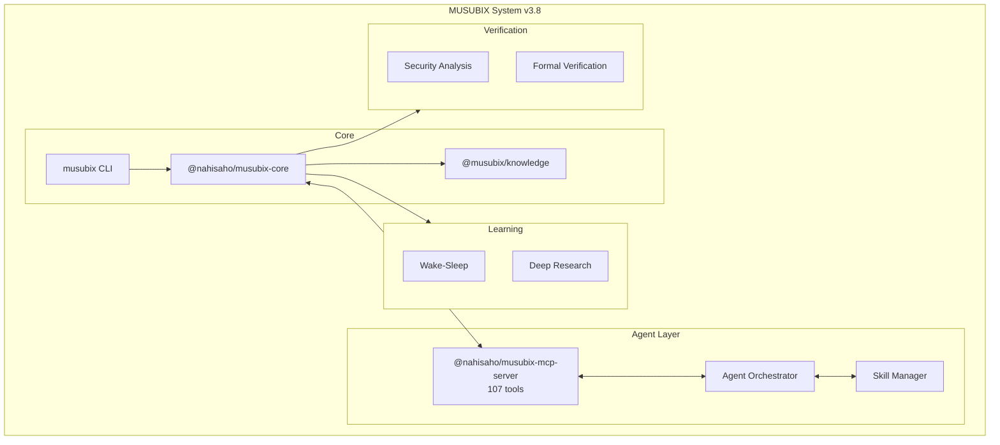

# MUSUBIX - Neuro-Symbolic AI Integration System

[](https://github.com/nahisaho/MUSUBIX/actions/workflows/ci.yml)
[](https://www.npmjs.com/package/musubix)
[](https://www.npmjs.com/package/@nahisaho/musubix-core)
[](https://www.npmjs.com/package/@nahisaho/musubix-mcp-server)
[](https://nodejs.org/)
[](LICENSE)
[](https://www.typescriptlang.org/)
[](https://github.com/nahisaho/MUSUBIX)
[](https://www.npmjs.com/package/@nahisaho/musubix-security)
[](https://www.npmjs.com/package/@nahisaho/musubix-dfg)
[](https://www.npmjs.com/package/@nahisaho/musubix-lean)
[](https://www.npmjs.com/package/@nahisaho/musubix-synthesis)
[](https://www.npmjs.com/package/@nahisaho/musubix-library-learner)
[](https://www.npmjs.com/package/@nahisaho/musubix-neural-search)

> Next-generation AI Coding System powered by Git-Native Knowledge Integration
>
> **v3.8.1** - 25 packages, 107 MCP tools, 5,738+ tests

**[日本語版 README](README.ja.md)**

## Overview

MUSUBIX is an innovative AI coding system that integrates **Neural (LLM)** and **Symbolic (Knowledge Graph)** reasoning. It combines MUSUBI SDD methodology with Git-native knowledge management to support high-quality software development.

### 🎉 v3.8 Highlights

- **25 packages** - Comprehensive neuro-symbolic AI development toolkit
- **107 MCP tools** - SDD, Pattern, Knowledge, Policy, Decision, Synthesis, Workflow, Agent, Skill tools
- **5,738+ tests** - All passing across 25 packages
- **13 Agent Skills** - Claude Code integration for SDD workflow automation
- **Monorepo optimizations** - Unified `tsc -b` builds, standardized dependencies, Prettier formatting
- **Deep Research** - AI-driven iterative research system with 6 integration modules
- **Git-Native Knowledge** - File-based knowledge graph in `.knowledge/` (zero dependencies)
- **Codegraph** - Code structure analysis supporting 16 languages

### Features

- 🧠 **Neuro-Symbolic Integration** - Fusion of LLM creativity and knowledge graph precision
- 📂 **Git-Native Knowledge** - File-based knowledge graph management *(v3.0.0)*
- 📊 **DFG/CFG Analysis** - Data flow and control flow graph extraction for TypeScript/JavaScript
- 🧮 **Lean 4 Integration** - Formal theorem proving with EARS-to-Lean conversion
- 📚 **Library Learning** - DreamCoder-style hierarchical abstraction and pattern compression
- 🔍 **Neural Search** - Neural-guided program synthesis with beam search
- ⚗️ **Program Synthesis** - DSL-based PBE synthesis with witness functions
- 🔒 **Symbolic Reasoning** - Formal verification, hallucination detection, constitution enforcement
- 📝 **EARS Requirements Analysis** - Conversion and validation from natural language to formal requirements
- 🎨 **Design Pattern Recommendations** - Context-based C4 model and ADR generation
- ✅ **Test-Driven Development** - Quality assurance through Test-First principles
- 🔗 **Complete Traceability** - Tracking from requirements to code
- 🛡️ **Security Analysis** - Vulnerability scanning, secret detection, taint analysis *(v1.8.0)*
- 🔬 **Formal Verification** - Z3 SMT solver integration, Hoare triple verification *(v1.7.5)*
- 🖥️ **Interactive REPL** - Command completion, history, session variables *(v1.6.0)*
- 🔮 **Advanced Inference** - OWL 2 RL reasoning and Datalog evaluation *(v1.4.5)*

## Architecture



## Project Structure

| Path | Description |
|------|-------------|
| `packages/core/` | Core library (249 modules) |
| `packages/core/auth/` | Authentication & Authorization |
| `packages/core/cli/` | CLI Interface |
| `packages/core/codegen/` | Code Generation & Analysis |
| `packages/core/design/` | Design Patterns & C4 Models |
| `packages/core/error/` | Error Handling |
| `packages/core/explanation/` | Explanation Generation & Visualization |
| `packages/core/learning/` | Self-Learning & Pattern Extraction |
| `packages/core/requirements/` | Requirements Analysis & Decomposition |
| `packages/core/symbolic/` | Symbolic Reasoning |
| `packages/core/traceability/` | Traceability |
| `packages/core/types/` | Type Definitions |
| `packages/core/utils/` | Utilities |
| `packages/core/validators/` | EARS Validation |
| `packages/mcp-server/` | MCP Server (107 tools, 5 prompts) |
| `packages/security/` | Security Analysis |
| `packages/formal-verify/` | Formal Verification |
| `packages/pattern-mcp/` | Pattern Learning |
| `packages/ontology-mcp/` | Ontology Engine |
| `packages/wake-sleep/` | Wake-Sleep Learning |
| `packages/sdd-ontology/` | SDD Ontology |
| `packages/dfg/` | DFG/CFG Extraction - Data Flow Analysis |
| `packages/lean/` | Lean 4 Integration - Theorem Proving |
| `packages/library-learner/` | Library Learning - DreamCoder-style |
| `packages/neural-search/` | Neural Search - Guided Synthesis |
| `packages/synthesis/` | Program Synthesis - DSL/PBE |
| `packages/agent-orchestrator/` | Agent Orchestrator - Sub-agent Distribution |
| `packages/workflow-engine/` | Workflow Engine - 5-Phase Control |
| `packages/skill-manager/` | Skill Manager - Dynamic Skill Loading |
| `packages/codegraph/` | Codegraph - Code Structure Analysis (16 languages) |
| `packages/expert-delegation/` | Expert Delegation - 7 AI Expert Types |
| `packages/deep-research/` | Deep Research - AI-driven Iterative Research |
| `packages/assistant-axis/` | Assistant Axis - Multimodal Integration |
| `packages/musubi/` | Musubi - AI Summarization |
| `packages/knowledge/` | Knowledge Store - Git-friendly JSON Graph |
| `packages/policy/` | Policy Engine - 9 Constitutional Articles |
| `packages/decisions/` | Decision Records - ADR Management |
| `steering/` | Project Memory |
| `storage/` | Specifications & Artifacts |
| `templates/` | Templates |
| `docs/` | Documentation |

## Requirements

- Node.js >= 20.0.0
- npm >= 10.0.0
- TypeScript >= 5.3

## Installation

### npm/npx (Recommended)

```bash
# Global installation
npm install -g musubix

# Run directly with npx
npx musubix init
npx musubix --help

# Start MCP Server
npx @nahisaho/musubix-mcp-server
npx musubix-mcp --transport stdio
```

### Scoped Packages

```bash
# Install individual packages
npm install @nahisaho/musubix-core
npm install @nahisaho/musubix-mcp-server
npm install @nahisaho/musubix-security
npm install @nahisaho/musubix-formal-verify
npm install @musubix/knowledge
npm install @musubix/decisions
npm install @musubix/policy
```

### Build from Source

```bash
git clone https://github.com/nahisaho/MUSUBIX.git
cd MUSUBIX
npm install
npm run build
```

## Development

```bash
# Build
npm run build

# Run tests
npm test

# Lint
npm run lint

# Type check
npm run type-check
```

## Key Features

### Requirements Definition (Article II Compliant)

- **EARS Validation**: Easy Approach to Requirements Syntax pattern validation
- **Interactive Q&A Hearing**: Dialogue-based requirements gathering
- **Requirements Decomposition**: Breaking down large requirements into implementation units
- **Related Requirements Search**: Automatic detection of similar and dependent requirements

### Design Generation (Article III Compliant)

- **C4 Model Generation**: Context/Container/Component/Code diagrams
- **ADR Generation**: Architecture Decision Records
- **Pattern Detection**: Automatic detection and recommendation of design patterns
- **SOLID Validation**: SOLID principle compliance checking

### Code Generation & Verification

- **Static Analysis**: Quality metrics and complexity calculation
- **Security Scanning**: Vulnerability detection
- **Test Generation**: Unit and integration test generation
- **Coverage Reporting**: Test coverage measurement

### MCP Server

Provides 107 tools and 5 prompts covering SDD, Pattern, Knowledge, Policy, Decision, Synthesis, Workflow, Agent, and Skill management:

```bash
# Start MCP Server
npx @nahisaho/musubix-mcp-server
```

## Documentation

| Document | Description |
|----------|-------------|
| [Requirements Specification](storage/specs/REQ-MUSUBIX-001.md) | EARS format functional/non-functional requirements |
| [Design Document](storage/specs/DES-MUSUBIX-001.md) | C4 model and ADR-based design |
| [Task Definition](storage/specs/TSK-MUSUBIX-001.md) | 56 tasks sprint plan |
| [API Reference](docs/API-REFERENCE.md) | Public API specification |
| [Symbolic Integration](storage/specs/REQ-SYMB-001.md) | Neuro-Symbolic requirements (27 requirements) |

## Symbolic Reasoning Module (v1.2.0)

The new symbolic reasoning module provides:

### Phase 1: Foundation
- **SemanticCodeFilterPipeline** - LLM output semantic validation
- **HallucinationDetector** - Undefined symbol/invalid import detection
- **ConstitutionRuleRegistry** - 9 Constitution articles enforcement
- **ConfidenceEstimator** - AST complexity, requirement coverage scoring
- **ConfidenceBasedRouter** - Confidence-based routing decisions
- **ErrorHandler** - Graceful degradation

### Phase 2: Formal Verification
- **EarsToFormalSpecConverter** - EARS → SMT-LIB conversion
- **VerificationConditionGenerator** - Verification condition (VC) generation
- **Z3Adapter** - Z3 SMT solver integration
- **SecurityScanner** - OWASP patterns, secret detection

### Phase 3: Advanced Features
- **CandidateRanker** - Multi-criteria candidate scoring
- **ResultBlender** - Neural/Symbolic result integration (3 strategies)
- **ExtensibleRuleConfig** - YAML/JSON rule configuration
- **AuditLogger** - SHA-256 hash-chain tamper detection
- **PerformanceBudget** - Step-level budgets, SLO metrics
- **QualityGateValidator** - Automated quality gate validation

## Wake-Sleep Learning Cycle (v1.3.0)

Continuous learning system based on the Wake-Sleep algorithm:

| Phase | Processing |
|-------|------------|
| **Wake** | Code observation → Pattern extraction → Knowledge graph update |
| **Sleep** | Pattern consolidation → Similar pattern compression → Memory optimization |

### Key Components
- **WakeSleepCycle** - Learning cycle orchestration
- **PatternLibrary** - Persistent pattern storage management
- **PatternOntologyBridge** - Pattern ↔ Ontology bidirectional conversion
- **N3Store** - RDF/OWL-based knowledge graph storage

### New MCP Tools (7 tools)
- `pattern_extract` - Extract patterns from code
- `pattern_compress` - Abstraction and compression of patterns
- `pattern_store` - Save to pattern library
- `pattern_query` - Search and retrieve patterns
- `pattern_consolidate` - Consolidate similar patterns
- `ontology_query` - Query ontology graph
- `ontology_infer` - Execute ontology-based inference

## Advanced Inference (v1.4.5)

OWL 2 RL profile reasoning and Datalog evaluation engine:

### Inference Components
- **OWL2RLReasoner** - OWL 2 RL profile compliant inference (20+ built-in rules)
- **DatalogEngine** - Stratified Datalog evaluation with negation support
- **InferenceExplainer** - Human-readable inference explanation generator
- **ProgressReporter** - Real-time progress feedback (500ms interval)

### OWL 2 RL Built-in Rules
| Category | Rules | Description |
|----------|-------|-------------|
| Class Axioms | cax-sco, cax-eqc | Subclass, Equivalent class inference |
| Property | prp-dom, prp-rng | Domain, Range inference |
| Property Characteristics | prp-symp, prp-trp, prp-inv | Symmetric, Transitive, Inverse |
| Equality | eq-ref, eq-sym, eq-trans | sameAs inference |

### Explanation Formats
- `text` - Plain text explanation
- `markdown` - Markdown format
- `html` - HTML format with escaping

## Constitutional Articles (9 Articles)

MUSUBIX adheres to the following 9 constitutional articles:

1. **Specification First** - Requirements before implementation
2. **Design Before Code** - Design before coding
3. **Single Source of Truth** - Project memory is authoritative
4. **Traceability** - Tracking from requirements to code
5. **Incremental Progress** - Small, frequent deliveries
6. **Decision Documentation** - Decisions recorded as ADRs
7. **Quality Gates** - Phase validation required
8. **User-Centric** - Document user value
9. **Continuous Learning** - Retrospectives and improvements

## License

MIT License - See [LICENSE](LICENSE) for details

## Author

nahisaho

## Changelog

See [CHANGELOG.md](CHANGELOG.md)

---

**Document ID**: README
**Version**: 3.8.1
**Last Updated**: 2026-02-08
