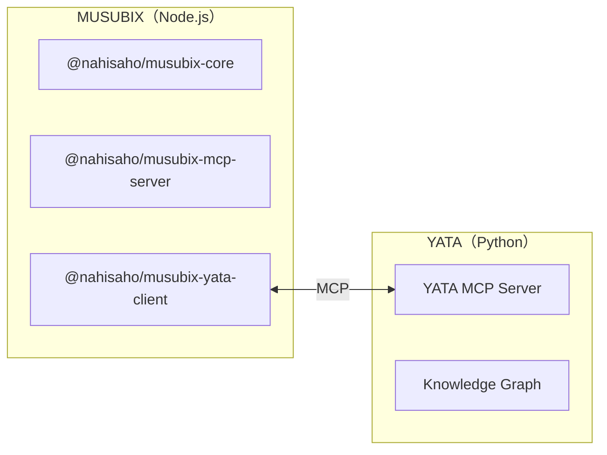

# MUSUBIX インストールガイド

**文書ID**: INSTALL-GUIDE  
**バージョン**: 1.0.0  
**最終更新**: 2026-01-02

---

## 目次

1. [概要](#概要)
2. [システム要件](#システム要件)
3. [インストール方法](#インストール方法)
4. [YATA のインストール](#yata-のインストール)
5. [AI プラットフォームとの連携](#ai-プラットフォームとの連携)
6. [動作確認](#動作確認)
7. [トラブルシューティング](#トラブルシューティング)

---

## 概要

MUSUBIX は以下の2つのコンポーネントで構成されています：



| コンポーネント | 言語 | 役割 | 必須 |
|--------------|------|------|------|
| **MUSUBIX** | Node.js | ニューロシンボリックAIコーディングシステム | ✅ |
| **YATA** | Python | 知識グラフMCPサーバー | オプション |

### 利用パターン

| パターン | インストール対象 | 利用可能機能 |
|---------|-----------------|-------------|
| **基本** | MUSUBIXのみ | EARS要件分析、C4設計生成、コード生成 |
| **フル** | MUSUBIX + YATA | 上記 + 知識グラフ連携、形式的検証、説明生成 |

---

## システム要件

### MUSUBIX（必須）

| 項目 | 要件 |
|------|------|
| **OS** | Windows 10+, macOS 12+, Linux (Ubuntu 20.04+) |
| **Node.js** | >= 20.0.0 |
| **npm** | >= 10.0.0 |
| **TypeScript** | >= 5.3（開発時） |
| **ディスク容量** | 約 100MB |

### YATA（オプション）

| 項目 | 要件 |
|------|------|
| **Python** | >= 3.11 |
| **uv** | 最新版（推奨）または pip |
| **ディスク容量** | 約 500MB（フレームワーク知識含む） |

---

## インストール方法

### 方法1: npm/npx（推奨）

```bash
# グローバルインストール
npm install -g musubix

# バージョン確認
musubix --version
musubix-mcp --version
```

### 方法2: npx で直接実行

```bash
# インストールなしで実行
npx musubix --help
npx musubix init

# MCP サーバー起動
npx @nahisaho/musubix-mcp-server
npx musubix-mcp --transport stdio
```

### 方法3: プロジェクトへのインストール

```bash
# 統合パッケージ（推奨）
npm install musubix

# または個別パッケージのインストール
npm install @nahisaho/musubix-core
npm install @nahisaho/musubix-mcp-server
npm install @nahisaho/musubix-yata-client  # YATA連携用
```

#### パッケージ比較

| パッケージ | 説明 | 用途 |
|-----------|------|------|
| `musubix` | 統合パッケージ | 全機能、簡単セットアップ |
| `@nahisaho/musubix-core` | コアライブラリのみ | 最小限のインストール |
| `@nahisaho/musubix-mcp-server` | MCPサーバーのみ | AIプラットフォーム連携 |
| `@nahisaho/musubix-yata-client` | YATAクライアントのみ | 知識グラフ機能 |

### 方法4: ソースからビルド

```bash
# リポジトリをクローン
git clone https://github.com/nahisaho/MUSUBIX.git
cd MUSUBIX

# 依存関係をインストール
npm install

# ビルド
npm run build

# CLIをリンク（開発用）
npm link
```

---

## YATA のインストール

YATA はニューロシンボリック機能（知識グラフ連携、形式的検証、説明生成）を使用する場合に必要です。

### 前提条件

```bash
# Python 3.11+ の確認
python --version  # Python 3.11.x 以上

# uv のインストール（推奨）
curl -LsSf https://astral.sh/uv/install.sh | sh
```

### YATA のインストール

```bash
# リポジトリをクローン
git clone https://github.com/nahisaho/YATA.git
cd YATA

# uv で依存関係をインストール
uv sync --all-packages

# インストール確認
uv run yata --version
uv run yata info
```

### YATA サーバーの起動

```bash
# stdio モード（MCP標準）
uv run yata serve

# SSE モード（HTTP経由）
uv run yata serve --transport sse --port 8080
```

### YATA の基本操作

```bash
# ソースコードを解析して知識グラフを構築
uv run yata parse ./src --pattern "**/*.ts" --output graph.json

# エンティティを検索
uv run yata query "function" --type function

# 統計情報を表示
uv run yata stats --graph graph.json

# グラフの整合性を検証
uv run yata validate --graph graph.json --repair
```

---

## AI プラットフォームとの連携

### GitHub Copilot (VS Code)

`.vscode/mcp.json` を作成：

```json
{
  "mcpServers": {
    "musubix": {
      "command": "npx",
      "args": ["@nahisaho/musubix-mcp-server"]
    },
    "yata": {
      "command": "uv",
      "args": ["run", "yata", "serve"],
      "cwd": "/path/to/YATA"
    }
  }
}
```

### Claude Desktop

設定ファイルの場所：
- **macOS**: `~/Library/Application Support/Claude/claude_desktop_config.json`
- **Windows**: `%APPDATA%\Claude\claude_desktop_config.json`
- **Linux**: `~/.config/Claude/claude_desktop_config.json`

```json
{
  "mcpServers": {
    "musubix": {
      "command": "npx",
      "args": ["@nahisaho/musubix-mcp-server"]
    },
    "yata": {
      "command": "uv",
      "args": ["run", "yata", "serve"],
      "cwd": "/path/to/YATA"
    }
  }
}
```

### Claude Code（CLI）

プロジェクトルートに `.mcp.json` を作成：

```json
{
  "mcpServers": {
    "musubix": {
      "command": "npx",
      "args": ["@nahisaho/musubix-mcp-server"]
    },
    "yata": {
      "command": "uv",
      "args": ["run", "yata", "serve"],
      "cwd": "/path/to/YATA"
    }
  }
}
```

または `claude mcp add` コマンドで設定：

```bash
# MUSUBIX MCP サーバーを追加
claude mcp add musubix -- npx @nahisaho/musubix-mcp-server

# YATA MCP サーバーを追加（オプション）
claude mcp add yata -- uv run yata serve

# 設定確認
claude mcp list
```

### Cursor IDE

`.cursor/mcp.json` を作成：

```json
{
  "mcpServers": {
    "musubix": {
      "command": "npx",
      "args": ["@nahisaho/musubix-mcp-server"]
    },
    "yata": {
      "command": "uv",
      "args": ["run", "yata", "serve"],
      "cwd": "/path/to/YATA"
    }
  }
}
```

---

## 動作確認

### MUSUBIX の確認

```bash
# CLI ヘルプ表示
musubix --help

# プロジェクト初期化
musubix init my-project

# MCP サーバー起動テスト
musubix-mcp --help
```

### YATA の確認

```bash
# サーバー情報表示
uv run yata info

# サンプルコードを解析
uv run yata parse ./sample --pattern "**/*.py"
```

### 統合テスト

```bash
# YATA サーバーを起動（別ターミナル）
cd /path/to/YATA
uv run yata serve

# MUSUBIX から YATA に接続確認
# （@nahisaho/musubix-yata-client を使用したアプリケーションで確認）
```

---

## トラブルシューティング

### Node.js のバージョンエラー

```
Error: MUSUBIX requires Node.js >= 20.0.0
```

**解決策**:
```bash
# nvm でバージョン切り替え
nvm install 20
nvm use 20

# または直接インストール
# https://nodejs.org/ から LTS 版をダウンロード
```

### Python のバージョンエラー

```
Error: Python 3.11+ is required
```

**解決策**:
```bash
# pyenv でバージョン切り替え
pyenv install 3.11
pyenv local 3.11

# または直接インストール
# https://www.python.org/ からダウンロード
```

### uv が見つからない

```
command not found: uv
```

**解決策**:
```bash
# uv をインストール
curl -LsSf https://astral.sh/uv/install.sh | sh

# PATH を更新
source ~/.bashrc  # または ~/.zshrc
```

### MCP サーバー接続エラー

```
Error: Failed to connect to MCP server
```

**解決策**:
1. サーバーが起動しているか確認
2. ポートが使用中でないか確認
3. ファイアウォール設定を確認

```bash
# ポート確認
lsof -i :3000

# プロセス確認
ps aux | grep musubix
ps aux | grep yata
```

### npm パッケージの権限エラー

```
EACCES: permission denied
```

**解決策**:
```bash
# npm のグローバルディレクトリを変更
mkdir ~/.npm-global
npm config set prefix '~/.npm-global'
echo 'export PATH=~/.npm-global/bin:$PATH' >> ~/.bashrc
source ~/.bashrc
```

---

## 次のステップ

インストールが完了したら、以下のドキュメントを参照してください：

| ドキュメント | 説明 |
|-------------|------|
| [USER-GUIDE.ja.md](USER-GUIDE.ja.md) | ユーザーガイド |
| [API-REFERENCE.md](API-REFERENCE.md) | API リファレンス |
| [evolution-from-musubi-to-musubix.md](evolution-from-musubi-to-musubix.md) | MUSUBI から MUSUBIX への進化 |

---

## 参考リンク

- [MUSUBIX GitHub](https://github.com/nahisaho/MUSUBIX)
- [YATA GitHub](https://github.com/nahisaho/YATA)
- [Node.js 公式サイト](https://nodejs.org/)
- [Python 公式サイト](https://www.python.org/)
- [uv 公式ドキュメント](https://docs.astral.sh/uv/)
- [MCP 仕様](https://modelcontextprotocol.io/)
