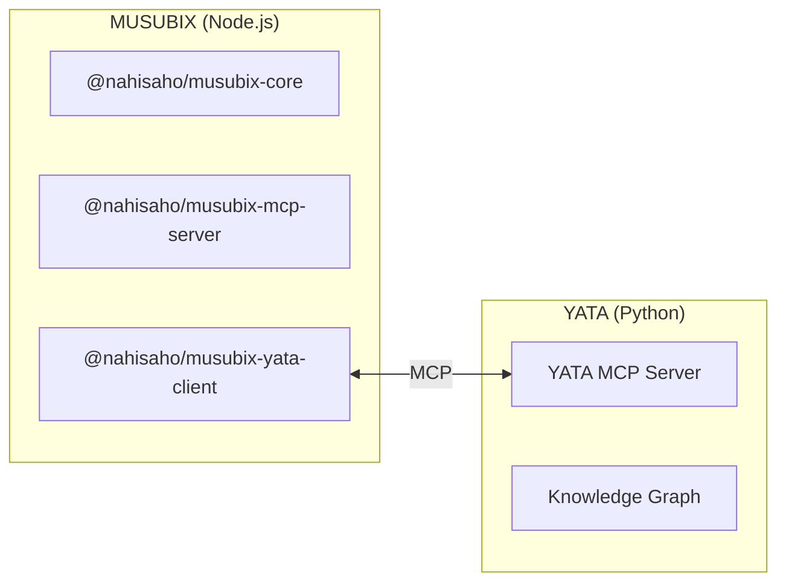

# MUSUBIX Installation Guide

**Document ID**: INSTALL-GUIDE  
**Version**: 1.6.0  
**Last Updated**: 2026-01-06

---

## Table of Contents

1. [Overview](#overview)
2. [System Requirements](#system-requirements)
3. [Installation Methods](#installation-methods)
4. [YATA Installation](#yata-installation)
5. [AI Platform Integration](#ai-platform-integration)
6. [Verification](#verification)
7. [Troubleshooting](#troubleshooting)

---

## Overview

MUSUBIX consists of two main components:



| Component | Language | Role | Required |
|-----------|----------|------|----------|
| **MUSUBIX** | Node.js | Neuro-Symbolic AI Coding System | ✅ |
| **YATA** | Python | Knowledge Graph MCP Server | Optional |

### Usage Patterns

| Pattern | Installation | Available Features |
|---------|--------------|-------------------|
| **Basic** | MUSUBIX only | EARS requirements, C4 design, code generation |
| **Symbolic** | MUSUBIX only | Above + symbolic reasoning, formal verification, quality gates |
| **Full** | MUSUBIX + YATA | Above + knowledge graph, external verification, explanations |

---

## System Requirements

### MUSUBIX (Required)

| Item | Requirement |
|------|-------------|
| **OS** | Windows 10+, macOS 12+, Linux (Ubuntu 20.04+) |
| **Node.js** | >= 20.0.0 |
| **npm** | >= 10.0.0 |
| **TypeScript** | >= 5.3 (for development) |
| **Disk Space** | ~100MB |

### YATA (Optional)

| Item | Requirement |
|------|-------------|
| **Python** | >= 3.11 |
| **uv** | Latest (recommended) or pip |
| **Disk Space** | ~500MB (including framework knowledge) |

---

## Installation Methods

### Method 1: npm/npx (Recommended)

```bash
# Global installation
npm install -g musubix

# Verify installation
musubix --version
musubix-mcp --version
```

### Method 2: Run directly with npx

```bash
# Run without installation
npx musubix --help
npx musubix init

# Start MCP server
npx @nahisaho/musubix-mcp-server
npx musubix-mcp --transport stdio
```

### Method 3: Install to project

```bash
# All-in-one package (recommended)
npm install musubix

# Show installation banner (npm v11+)
npm install musubix --foreground-scripts

# Or install individual packages
npm install @nahisaho/musubix-core
npm install @nahisaho/musubix-mcp-server
npm install @nahisaho/musubix-yata-client  # For YATA integration
```

#### Auto-Generated Files

When you run `npm install musubix`, the following files are automatically created:

| File/Directory | Purpose | Target Agent |
|----------------|---------|-------------|
| `AGENTS.md` | AI Agent guidelines | GitHub Copilot |
| `CLAUDE.md` | AI Agent guidelines (copy) | Claude Code |
| `.github/skills/` | 9 Agent Skills | GitHub Copilot |
| `.github/prompts/` | 9 SDD prompts | GitHub Copilot |
| `.claude/skills/` | 9 Agent Skills (copy) | Claude Code |
| `.claude/prompts/` | 9 SDD prompts (copy) | Claude Code |

#### Package Comparison

| Package | Description | Use Case |
|---------|-------------|----------|
| `musubix` | All-in-one bundle | Full features, quick setup |
| `@nahisaho/musubix-core` | Core library only | Minimal installation |
| `@nahisaho/musubix-mcp-server` | MCP server only | AI platform integration |
| `@nahisaho/musubix-yata-client` | YATA client only | Knowledge graph features |

### Method 4: Build from source

```bash
# Clone the repository
git clone https://github.com/nahisaho/MUSUBIX.git
cd MUSUBIX

# Install dependencies
npm install

# Build
npm run build

# Link CLI (for development)
npm link
```

---

## YATA Installation

YATA is required for neuro-symbolic features (knowledge graph integration, formal verification, explanation generation).

### Prerequisites

```bash
# Check Python 3.11+
python --version  # Python 3.11.x or higher

# Install uv (recommended)
curl -LsSf https://astral.sh/uv/install.sh | sh
```

### Install YATA

```bash
# Clone the repository
git clone https://github.com/nahisaho/YATA.git
cd YATA

# Install dependencies with uv
uv sync --all-packages

# Verify installation
uv run yata --version
uv run yata info
```

### Start YATA Server

```bash
# stdio mode (MCP standard)
uv run yata serve

# SSE mode (via HTTP)
uv run yata serve --transport sse --port 8080
```

### Basic YATA Operations

```bash
# Parse source code to build knowledge graph
uv run yata parse ./src --pattern "**/*.ts" --output graph.json

# Search entities
uv run yata query "function" --type function

# Show statistics
uv run yata stats --graph graph.json

# Validate graph integrity
uv run yata validate --graph graph.json --repair
```

---

## AI Platform Integration

### GitHub Copilot (VS Code)

Create `.vscode/mcp.json`:

```json
{
  "mcpServers": {
    "musubix": {
      "command": "npx",
      "args": ["@nahisaho/musubix-mcp-server"]
    },
    "yata": {
      "command": "uv",
      "args": ["run", "yata", "serve"],
      "cwd": "/path/to/YATA"
    }
  }
}
```

### Claude Desktop

Configuration file locations:
- **macOS**: `~/Library/Application Support/Claude/claude_desktop_config.json`
- **Windows**: `%APPDATA%\Claude\claude_desktop_config.json`
- **Linux**: `~/.config/Claude/claude_desktop_config.json`

```json
{
  "mcpServers": {
    "musubix": {
      "command": "npx",
      "args": ["@nahisaho/musubix-mcp-server"]
    },
    "yata": {
      "command": "uv",
      "args": ["run", "yata", "serve"],
      "cwd": "/path/to/YATA"
    }
  }
}
```

### Claude Code (CLI)

Create `.mcp.json` in your project root:

```json
{
  "mcpServers": {
    "musubix": {
      "command": "npx",
      "args": ["@nahisaho/musubix-mcp-server"]
    },
    "yata": {
      "command": "uv",
      "args": ["run", "yata", "serve"],
      "cwd": "/path/to/YATA"
    }
  }
}
```

Or configure via `claude mcp add`:

```bash
# Add MUSUBIX MCP server
claude mcp add musubix -- npx @nahisaho/musubix-mcp-server

# Add YATA MCP server (optional)
claude mcp add yata -- uv run yata serve

# Verify configuration
claude mcp list
```

### Cursor IDE

Create `.cursor/mcp.json`:

```json
{
  "mcpServers": {
    "musubix": {
      "command": "npx",
      "args": ["@nahisaho/musubix-mcp-server"]
    },
    "yata": {
      "command": "uv",
      "args": ["run", "yata", "serve"],
      "cwd": "/path/to/YATA"
    }
  }
}
```

---

## Verification

### Verify MUSUBIX

```bash
# Show CLI help
musubix --help

# Initialize a project
musubix init my-project

# Test MCP server
musubix-mcp --help
```

### Verify YATA

```bash
# Show server info
uv run yata info

# Parse sample code
uv run yata parse ./sample --pattern "**/*.py"
```

### Integration Test

```bash
# Start YATA server (in another terminal)
cd /path/to/YATA
uv run yata serve

# Verify MUSUBIX can connect to YATA
# (Use an application with @nahisaho/musubix-yata-client)
```

---

## Troubleshooting

### Node.js Version Error

```
Error: MUSUBIX requires Node.js >= 20.0.0
```

**Solution**:
```bash
# Switch version with nvm
nvm install 20
nvm use 20

# Or install directly from
# https://nodejs.org/
```

### Python Version Error

```
Error: Python 3.11+ is required
```

**Solution**:
```bash
# Switch version with pyenv
pyenv install 3.11
pyenv local 3.11

# Or install directly from
# https://www.python.org/
```

### uv Not Found

```
command not found: uv
```

**Solution**:
```bash
# Install uv
curl -LsSf https://astral.sh/uv/install.sh | sh

# Update PATH
source ~/.bashrc  # or ~/.zshrc
```

### MCP Server Connection Error

```
Error: Failed to connect to MCP server
```

**Solution**:
1. Check if the server is running
2. Check if the port is in use
3. Check firewall settings

```bash
# Check port
lsof -i :3000

# Check processes
ps aux | grep musubix
ps aux | grep yata
```

### npm Permission Error

```
EACCES: permission denied
```

**Solution**:
```bash
# Change npm global directory
mkdir ~/.npm-global
npm config set prefix '~/.npm-global'
echo 'export PATH=~/.npm-global/bin:$PATH' >> ~/.bashrc
source ~/.bashrc
```

---

## Next Steps

After installation, refer to the following documentation:

| Document | Description |
|----------|-------------|
| [USER-GUIDE.ja.md](USER-GUIDE.ja.md) | User Guide (Japanese) |
| [API-REFERENCE.md](API-REFERENCE.md) | API Reference |
| [evolution-from-musubi-to-musubix.md](evolution-from-musubi-to-musubix.md) | Evolution from MUSUBI to MUSUBIX |

---

## References

- [MUSUBIX GitHub](https://github.com/nahisaho/MUSUBIX)
- [YATA GitHub](https://github.com/nahisaho/YATA)
- [Node.js Official Site](https://nodejs.org/)
- [Python Official Site](https://www.python.org/)
- [uv Documentation](https://docs.astral.sh/uv/)
- [MCP Specification](https://modelcontextprotocol.io/)
