# MUSUBIX: Neuro-Symbolic AI Coding システムによるエンタープライズアプリケーション開発入門

:::note info
**Version**: 2.2.0 | **Date**: 2026-01-09 | **Author**: MUSUBIX Development Team
:::

---

## 目次

- [Part 1: イントロダクション](#part-1-イントロダクション)
  - [1. 従来のAIコーディングの限界](#1-従来のaiコーディングの限界)
  - [2. SDD（Specification Driven Development）の課題](#2-sddspecification-driven-developmentの課題)
  - [3. MUSUBIXとは](#3-musubixとは)
  - [4. エンタープライズ開発に必要な要素](#4-エンタープライズ開発に必要な要素)
- [Part 2: 経費精算システム開発](#part-2-経費精算システム開発)
  - [5. プロジェクト初期化](#5-プロジェクト初期化)
  - [6. 要件定義](#6-要件定義)
  - [7. 設計](#7-設計)
  - [8. タスク分解](#8-タスク分解)
  - [9. コード生成](#9-コード生成)
  - [10. セキュリティ分析](#10-セキュリティ分析)
  - [11. 形式検証](#11-形式検証)
  - [12. テスト生成](#12-テスト生成)
  - [13. トレーサビリティ](#13-トレーサビリティ)
- [Part 3: 高度な機能](#part-3-高度な機能)
  - [14. 説明生成](#14-説明生成)
  - [15. 自己学習システム](#15-自己学習システム)
  - [16. オントロジー](#16-オントロジー)
  - [17. プログラム合成](#17-プログラム合成)
  - [18. ライブラリ学習](#18-ライブラリ学習)
- [Part 4: チーム開発・運用](#part-4-チーム開発運用)
  - [19. KGPR（知識グラフPull Request）](#19-kgpr知識グラフpull-request)
  - [20. REPL対話モード](#20-repl対話モード)
  - [21. 学習データの共有](#21-学習データの共有)
- [Part 5: まとめ](#part-5-まとめ)
  - [22. MUSUBIXで実現するエンタープライズ品質](#22-musubixで実現するエンタープライズ品質)
  - [23. 次のステップ](#23-次のステップ)
- [付録](#付録)
  - [A. MUSUBIX 9条憲法](#付録a-musubix-9条憲法)
  - [B. CLIコマンド完全リファレンス](#付録b-cliコマンド完全リファレンス)
  - [C. EARSパターン早見表](#付録c-earsパターン早見表)
  - [D. プロジェクト構成](#付録d-プロジェクト構成)
  - [E. 設計パターンカタログ](#付録e-設計パターンカタログ)
  - [F. トレーサビリティID体系](#付録f-トレーサビリティid体系)
  - [G. SMT-LIB2 / Z3 クイックリファレンス](#付録g-smt-lib2--z3-クイックリファレンス)
  - [H. 用語集](#付録h-用語集)
  - [I. トラブルシューティング](#付録i-トラブルシューティング)

---

# Part 1: イントロダクション

## 1. 従来のAIコーディングの限界

### 1.1 Vibe Coding（雰囲気コーディング）の問題点

「Vibe Coding」とは、明確な仕様や設計なしに、AIに対して曖昧な指示を与えてコードを生成するスタイルです。

```
ユーザー: 「いい感じの経費精算システム作って」
AI: （なんとなく動くコードを生成）
```

**問題点:**

| 問題 | 説明 | エンタープライズへの影響 |
|------|------|------------------------|
| **再現性がない** | 同じ指示でも異なるコードが生成される | 品質管理が不可能 |
| **仕様が不明** | 何を作ったのか後から分からない | 保守・引継ぎ困難 |
| **監査不可** | なぜその実装になったか説明できない | コンプライアンス違反 |
| **テスト困難** | 仕様がないのでテストケースが書けない | バグの見逃し |
| **変更影響不明** | 要件変更時の影響範囲が分からない | 予期せぬ障害 |

**実例: Vibe Codingの危険性**

```
ユーザー: 「経費の承認機能を追加して」

AIの出力（問題あり）:
- 承認上限金額のチェックなし
- 自己承認が可能な実装
- 監査ログなし
- 承認済み経費の編集が可能

→ 内部統制違反、不正の温床に
```

### 1.2 GitHub Copilot単体の限界

GitHub Copilotは優れたコード補完ツールですが、エンタープライズ開発には不十分です。

**Copilotの強み:**
- コード補完が高速・高精度
- 多言語対応
- IDE統合が優秀

**エンタープライズでの限界:**

| 機能 | Copilot | エンタープライズ要件 |
|------|---------|-------------------|
| 要件管理 | ❌ なし | 形式的な要件定義必須 |
| トレーサビリティ | ❌ なし | 要件↔コード追跡必須 |
| 設計検証 | ❌ なし | SOLID原則等の検証必須 |
| セキュリティ分析 | ⚠️ 限定的 | 網羅的な脆弱性検出必須 |
| 形式検証 | ❌ なし | ビジネスルールの数学的証明 |
| 監査証跡 | ❌ なし | 変更履歴・理由の記録必須 |
| 知識蓄積 | ❌ なし | プロジェクト固有パターンの学習 |

### 1.3 Claude Code / Cursor の課題

Claude CodeやCursorは、より高度なAIコーディング体験を提供しますが、根本的な課題は解決していません。

**Claude Codeの強み:**
- 長いコンテキスト理解
- マルチファイル編集
- 高度な推論能力

**Cursorの強み:**
- IDE統合が優秀
- 高速なレスポンス
- チャット履歴管理

**共通する限界:**


### 1.4 なぜエンタープライズ開発には不十分なのか

エンタープライズアプリケーションには、以下の特性があります。

| 特性 | 説明 | 従来AIツールの対応 |
|------|------|-------------------|
| **内部統制** | 承認ワークフロー、権限分離 | ❌ 考慮なし |
| **監査要件** | 変更履歴、アクセスログ | ❌ 対応なし |
| **コンプライアンス** | 法規制、業界標準準拠 | ❌ 検証不可 |
| **長期保守** | 10年以上の運用 | ❌ 仕様不明で困難 |
| **大規模チーム** | 100人以上での開発 | ❌ 知識共有なし |
| **ミッションクリティカル** | 24/365稼働 | ❌ 形式検証なし |

---

## 2. SDD（Specification Driven Development）の課題

### 2.1 SDDとは

SDD（Specification Driven Development）は、仕様書を起点とした開発手法です。


**SDDの利点:**
- 仕様が明確
- トレーサビリティ確保
- 品質管理が可能

### 2.2 SDDの課題

しかし、従来のSDDには重大な課題があります。

| 課題 | 説明 | 影響 |
|------|------|------|
| **手動作業が多い** | 仕様書↔コードの同期が手動 | 工数増大、同期ズレ |
| **AIとの統合が弱い** | AIは仕様を理解しない | AI活用の恩恵が限定的 |
| **形式化が困難** | 自然言語仕様は曖昧 | 解釈の齟齬 |
| **変更追従が困難** | 仕様変更時の影響分析が手動 | 変更コスト高 |
| **知識の断絶** | プロジェクト間で学習が活かせない | 車輪の再発明 |

### 2.3 SDDツールの現状

これらの課題を解決するため、SDDをAIと統合したツールが登場しています。

:::note info
**EARS（Easy Approach to Requirements Syntax）とは？**
要件を曖昧さなく記述するための形式言語です。「WHEN [条件] THE SYSTEM SHALL [動作]」のような5つのパターンで要件を構造化し、検証可能な形式にします。詳細は[6.2 EARS形式](#62-musubixが実行する処理)で解説します。
:::

| ツール | 提供元 | 特徴 | リリース |
|--------|--------|------|----------|
| **AWS Kiro** | Amazon Web Services | VS Code系IDE、EARS記法、requirements/design/tasks.md、Agent Hooks | 2025年 |
| **GitHub Spec Kit** | GitHub Next | 仕様書からのコード生成、Copilot統合（実験中） | 2025年（Preview） |
| **Cursor Rules** | Cursor | .cursorrules による開発ルール定義、カスタムプロンプト | 2024年〜 |
| **Claude Projects** | Anthropic | Project Knowledge による文脈管理、Memory機能 | 2024年〜 |

#### AWS Kiro

AWS Kiroは、Amazonが提供するSpec-Driven Development特化のAI IDE（VS Code互換）です。

**主な機能:**
- **EARS記法サポート**: 要件を`WHEN [条件] THE SYSTEM SHALL [動作]`形式で記述
- **3ファイル構成**: `requirements.md`、`design.md`、`tasks.md`による構造化
- **Agent Hooks**: ファイル保存時にテスト生成やドキュメント更新を自動実行
- **Steering Files**: プロジェクト固有のルールやコーディング標準を定義
- **Claude Sonnet 4.5採用**: 高度な推論能力を持つLLMを搭載

```
Kiroのワークフロー:
  自然言語 → requirements.md → design.md → tasks.md → 実装
```

:::note info
Kiroは「Vibe Coding（雰囲気コーディング）からViable Code（実用コード）へ」をスローガンに、AI生成コードの品質向上を目指しています。
:::

#### GitHub Spec Kit（実験的プロジェクト）

GitHub Nextが開発中のSpec Kitは、仕様書からコードを生成する実験的プロジェクトです。GitHub Copilotとの統合を前提に設計されており、仕様とコードの双方向同期を目指しています。

#### その他のアプローチ

| アプローチ | ツール | 概要 |
|-----------|--------|------|
| **ルールベース** | Cursor Rules、Windsurf Rules | `.cursorrules`等で開発ルールを定義 |
| **知識ベース** | Claude Projects | プロジェクト文脈をKnowledgeとして管理 |
| **エージェント型** | Devin、OpenHands | 自律的にタスクを実行するAIエージェント |

### 2.4 既存SDDツールの限界

これらのツールは従来のAIコーディングより進歩していますが、依然として課題があります。

:::note info
**この表に登場する専門用語**
- **C4モデル**: システム設計を4つのレベル（Context/Container/Component/Code）で階層的に表現する手法
- **Z3 SMTソルバー**: Microsoftが開発した形式検証ツール。数学的にプログラムの正しさを証明できる
- **YATA**: MUSUBIXの知識グラフシステム。プロジェクトの知識を構造化して保存・推論する
- **トレーサビリティ**: 要件↔設計↔コード↔テストの対応関係を追跡できること
- **KGPR**: Knowledge Graph Pull Request。知識グラフの変更をGitのPRのように管理する仕組み
:::

| 観点 | 既存SDDツール | MUSUBIX |
|------|-------------|---------|
| **要件形式** | EARS（一部）、自由形式 | EARS完全サポート + 検証 |
| **設計パターン** | 限定的 | C4モデル + 設計パターン検出 |
| **形式検証** | ❌ なし | ✅ Z3 SMTソルバー統合 |
| **知識グラフ** | ❌ なし | ✅ YATA統合 |
| **トレーサビリティ** | 限定的 | ✅ 要件↔設計↔コード↔テスト完全追跡 |
| **自己学習** | ❌ なし | ✅ パターン学習・フィードバック |
| **チーム共有** | 限定的 | ✅ KGPR（知識グラフPR） |

### 2.5 AIコーディングとSDDの溝


---

## 3. MUSUBIXとは

### 3.1 Neuro-Symbolic AI統合

:::note info
**Neuro-Symbolic AIとは？**
- **Neural（ニューラル）**: LLM（大規模言語モデル）による確率的・創造的な処理。パターン認識や自然言語理解が得意
- **Symbolic（シンボリック）**: 知識グラフや論理規則による厳密な推論。一貫性保証や形式検証が得意
- 両者を組み合わせることで、LLMの創造性とシンボリック推論の厳密性を両立させます
:::

MUSUBIXは、**Neural（LLM）** と **Symbolic（知識グラフ）** を統合した次世代AIコーディングシステムです。


### 3.2 信頼度評価ルール

MUSUBIXは、NeuralとSymbolicの結果を以下のルールで統合します。

| シンボリック結果 | ニューラル信頼度 | 最終決定 |
|-----------------|-----------------|---------|
| invalid（無効） | - | ニューラル結果を**棄却** |
| valid（有効） | ≥0.8 | ニューラル結果を**採用** |
| valid（有効） | <0.8 | シンボリック結果を**優先** |

:::note warn
**なぜこのルールか**
- シンボリック（形式論理）は「絶対に正しい」ことを保証
- ニューラルが生成しても、論理的に誤りなら却下
- 論理的に正しく、かつAIの確信度が高い場合のみ採用
:::

### 3.3 MUSUBIXの構成要素

| コンポーネント | 役割 |
|---------------|------|
| **EARS検証** | 要件を5つの形式パターンで検証 |
| **C4モデル** | 4レベルの設計構造化 |
| **YATA** | 知識グラフによる推論・検証 |
| **Z3統合** | SMTソルバーによる形式検証 |
| **自己学習** | パターン抽出・蓄積・適用 |
| **トレーサビリティ** | 要件↔設計↔コード↔テストの追跡 |
| **9条憲法** | 開発ルールの強制 |

### 3.4 開発フローの変革


### 3.5 動作環境と推奨構成

MUSUBIXは、MCP（Model Context Protocol）に対応した様々なAIコーディングツールで利用可能です。

#### 対応AIコーディングツール

| ツール | 対応状況 | 備考 |
|--------|---------|------|
| **GitHub Copilot Agent mode** | ✅ 推奨 | VS Code拡張、MCPサポート |
| **Claude Code** | ✅ 対応 | ターミナルベース |
| **Cursor** | ✅ 対応 | Agent mode + MCP |
| **Windsurf** | ✅ 対応 | MCP対応 |
| **その他MCP対応ツール** | ✅ 対応 | MCP経由で連携 |

#### 推奨構成: GitHub Copilot Enterprise + Claude Opus 4.5

:::note info
**なぜこの組み合わせがおすすめか**

**GitHub Copilot Enterprise**を選ぶ理由：
- VS Codeとのシームレスな統合
- Agent modeによるツール呼び出し（MCP）が安定
- 企業向けセキュリティ・コンプライアンス対応
- チーム間でのナレッジ共有機能

**Claude Opus 4.5**を選ぶ理由：
- 長いコンテキスト（200Kトークン）の理解に優れる
- 複雑な推論タスクで高い精度
- **出力コンテキストが上限を超える場合、大きなコンテキストを扱える他のLLMに切り替え可能**
- コード生成の品質が高い

**組み合わせのメリット:**
- MUSUBIXの長い要件定義書・設計書を正確に理解
- 大規模なコードベースでも文脈を維持
- LLMの出力制限に縛られない柔軟な運用
- エンタープライズグレードのセキュリティ
:::

#### 推奨OS環境: WSL（Windows Subsystem for Linux）

:::note warn
**Windows環境では WSL の使用を強く推奨します**

**WSLを推奨する理由:**
1. **コマンド実行の安定性**: MUSUBIXのCLIツールはLinux環境で最も安定動作
2. **Z3インストールの容易さ**: `apt install z3`で形式検証ツールを簡単導入
3. **ファイルシステムの互換性**: Unix系パス表記でトラブル回避
4. **開発ツールチェーン**: npm、Node.js、Gitなどの動作が安定
5. **本番環境との一貫性**: 多くのサーバーがLinux環境

**WSL2セットアップ（Windows 10/11）:**
```bash
# PowerShellを管理者権限で実行
wsl --install -d Ubuntu-22.04

# WSL内でNode.js環境をセットアップ
curl -fsSL https://deb.nodesource.com/setup_20.x | sudo -E bash -
sudo apt install -y nodejs

# Z3（形式検証）のインストール
sudo apt install -y z3
```
:::

#### 最小システム要件

| 項目 | 最小要件 | 推奨 |
|------|---------|------|
| **Node.js** | 20.0.0以上 | 22.x LTS |
| **npm** | 10.0.0以上 | 最新 |
| **メモリ** | 8GB | 16GB以上 |
| **OS** | Windows 10 (WSL2), macOS 12+, Ubuntu 20.04+ | Ubuntu 22.04 (WSL2) |

---

## 4. エンタープライズ開発に必要な要素

### 4.1 MUSUBIXが提供する価値

エンタープライズアプリケーション開発では、単に「動くコード」を作るだけでは不十分です。内部統制、監査対応、コンプライアンス遵守など、ビジネス上の厳格な要件を満たす必要があります。

MUSUBIXは、これらのエンタープライズ要件に対して、AIコーディングの利便性を維持しながら対応する唯一のソリューションです。

| エンタープライズ要件 | MUSUBIXの対応 |
|---------------------|---------------|
| **内部統制** | EARS形式で承認ルールを形式化、Z3で正当性証明 |
| **監査要件** | 完全なトレーサビリティ、変更履歴自動記録 |
| **コンプライアンス** | 9条憲法による品質ゲート強制 |
| **長期保守** | 明確な仕様、設計パターンの文書化 |
| **大規模チーム** | KGPR（知識グラフPR）でチーム知識共有 |
| **ミッションクリティカル** | 形式検証、セキュリティ分析 |

:::note info
**従来のAIコーディングとの違い**
- **Vibe Coding**: 「なんとなく動く」→ 監査で説明不能
- **MUSUBIX**: 「なぜこう実装したか」を要件IDで追跡可能 → 監査対応可能
:::

### 4.2 本マニュアルで構築するシステム

**経費精算システム（Expense Management System）**

このマニュアルでは、実際に経費精算システムを構築しながら、MUSUBIXの全機能を体験します。


**なぜ経費精算システムか:**

経費精算システムは、エンタープライズアプリケーションの典型的な要素を網羅しています。承認ワークフロー、金額計算、監査要件、セキュリティなど、MUSUBIXの各機能を実践的に学ぶのに最適な題材です。

また、多くの企業で実際に使われているシステムであるため、学んだ内容をすぐに実務に活かすことができます。

| 要素 | MUSUBIX機能との対応 |
|------|-------------------|
| 承認ワークフロー | EARS形式、状態遷移、形式検証 |
| 金額ルール | Z3による数学的検証 |
| 監査要件 | トレーサビリティ、監査ログ |
| セキュリティ | 金額改ざん検知、認可チェック |
| 経費カテゴリ | オントロジーによる階層表現 |

:::note info
**このマニュアルで得られるスキル**
- EARS形式での要件定義
- C4モデルでの設計
- トレーサビリティを維持したコード生成
- Z3による形式検証
- MUSUBIXの自己学習システムの活用
:::

---

**次のセクションでは、実際にプロジェクトを初期化し、経費精算システムの開発を開始します。**

---

# Part 2: 経費精算システム開発

## 5. プロジェクト初期化

それでは、実際にMUSUBIXプロジェクトを作成しましょう。

### 5.1 環境の準備

#### Step 1: WSL Ubuntuにアクセス

Windowsターミナル（またはWindows Terminal）を起動し、WSLのUbuntuにアクセスします。

```bash
# Windowsターミナルで新しいタブを開き、Ubuntuを選択
# または、PowerShellから以下を実行
wsl -d Ubuntu
```

#### Step 2: プロジェクトディレクトリの作成と移動

```bash
# プロジェクト用ディレクトリを作成
mkdir -p ~/projects/expense-management-system

# ディレクトリに移動
cd ~/projects/expense-management-system

# VS Codeでプロジェクトを開く
code .
```

:::note info
VS Codeが起動したら、GitHub Copilot拡張機能がインストールされていることを確認してください。Agent modeを使用する場合は、Copilot Chatパネルで`@workspace`を使用できます。
:::

### 5.2 MUSUBIXプロジェクトの初期化

VS Code上でGitHub Copilot Agent modeを使用して、プロジェクトを初期化します。

AIエージェントは内部で以下のコマンドを実行します。

```bash
npx musubix init expense-management-system --name "経費精算システム"
```

### 5.3 実行結果

```
{
  success: true,
  projectPath: '/tmp/expense-management-system',
  filesCreated: [
    'steering/',
    'steering/rules/',
    'storage/',
    'storage/specs/',
    'storage/archive/',
    'storage/changes/',
    '.github/',
    '.github/prompts/',
    '.github/skills/',
    'musubix.config.json',
    'steering/rules/constitution.md',
    'steering/product.md',
    'steering/tech.md',
    'steering/structure.md',
    'AGENTS.md',
    'storage/archive/.gitkeep',
    'storage/changes/.gitkeep'
  ],
  message: "MUSUBIX project '経費精算システム' initialized successfully!"
}
```

### 5.4 生成されたプロジェクト構造


### 5.5 設定ファイル（musubix.config.json）

```json:musubix.config.json
{
  "version": "1.1.6",
  "project": "経費精算システム",
  "steeringDir": "./steering",
  "storageDir": "./storage",
  "llm": {
    "provider": "anthropic",
    "model": "claude-sonnet-4-20250514",
    "maxTokens": 4096,
    "temperature": 0.7
  },
  "yata": {
    "transport": "stdio",
    "server": "yata-mcp",
    "timeout": 30000
  },
  "integration": {
    "neuralThreshold": 0.7,
    "symbolicThreshold": 0.8,
    "defaultStrategy": "neural-validated",
    "gracefulDegradation": true
  }
}
```

**設定項目の説明:**

| 項目 | 説明 |
|------|------|
| `llm.provider` | 使用するLLMプロバイダー（anthropic） |
| `llm.model` | 使用するモデル（Claude Sonnet 4） |
| `integration.neuralThreshold` | ニューラル信頼度閾値（0.7以上で採用検討） |
| `integration.symbolicThreshold` | シンボリック検証閾値（0.8以上で確定） |
| `integration.defaultStrategy` | デフォルト戦略（neural-validated: Neural生成→Symbolic検証） |

### 5.6 steering/（プロジェクトメモリ）の役割

:::note info
**steering/とは？**
AIエージェントが参照する「プロジェクトの記憶」です。船の操舵（steering）に由来し、プロジェクトの方向性を定めます。技術スタック、アーキテクチャルール、プロダクト情報を格納し、AIが文脈を理解した上でコードを生成できます。AWS Kiroも同様の概念を採用しています。
:::

MUSUBIXの特徴的な概念である **steering/** ディレクトリは、AIエージェントが参照する「プロジェクトの記憶」です。


**9条憲法（constitution.md）** は、すべての開発活動を統治する不変のルールです。AIエージェントは、コード生成前に必ずこのファイルを参照し、ルールに違反する出力を行いません。

:::note info
📖 詳細は [付録A: MUSUBIX 9条憲法](#付録a-9条憲法constitutional-articles) を参照
:::

---

## 6. 要件定義

MUSUBIXでは、作りたいシステムを自然言語で指示するだけで、AIエージェントが対話を通じてユーザーの要件を確認し、EARS形式の要件定義書を自動作成します。

従来の要件定義では、ドキュメント作成に多大な時間がかかりましたが、MUSUBIXを使えば対話しながら要件を明確化し、形式化された要件定義書を短時間で作成できます。


AIエージェントが作成した要件定義書をユーザーがレビューし、修正が必要な箇所があればフィードバックを伝えます。このレビューと修正のサイクルを、修正の必要がなくなるまで繰り返すことで、高品質な要件定義書が完成します。

### 6.1 自然言語での指示

プロジェクト初期化後、AIエージェントに対して自然言語で要件を伝えます。

> 「経費精算システムの要件を定義してください。
> 
> 主な機能:
> - 経費の申請・登録
> - 多段階承認ワークフロー（申請者→上長→経理）
> - 金額による承認ルート分岐（10万円以上は部長承認必要）
> - 経費カテゴリ管理（交通費、宿泊費、交際費など）
> - 予算チェック
> - 領収書の添付
> - 監査ログの記録
> - レポート出力」

### 6.2 MUSUBIXが実行する処理

MUSUBIXは、この自然言語を**EARS形式**（Easy Approach to Requirements Syntax）に変換します。

:::note info
**EARS形式の背景**
EARSは2009年にRolls-Royce社のAlistair Mavin氏らが提唱した要件記述法です。航空宇宙産業で的確な要件定義が求められる中、5つのパターンで要件の曖昧さを排除します。AWS KiroもEARSを採用しており、業界標準となりつつあります。
:::

**EARS形式とは:**

| パターン | 構文 | 用途 |
|---------|------|------|
| Ubiquitous | `THE [system] SHALL [requirement]` | 常に満たすべき要件 |
| Event-driven | `WHEN [event], THE [system] SHALL [response]` | イベント発生時の要件 |
| State-driven | `WHILE [state], THE [system] SHALL [response]` | 特定状態での要件 |
| Unwanted | `THE [system] SHALL NOT [behavior]` | 禁止事項 |
| Optional | `IF [condition], THEN THE [system] SHALL [response]` | 条件付き要件 |

:::note info
📖 詳細は [付録C: EARSパターン](#付録c-earsパターン) を参照
:::

### 6.3 AIエージェントによるEARS変換

AIエージェント（GitHub Copilot Agent mode + MUSUBIX）は、自然言語の要件をEARS形式に変換して要件定義書を作成します。

**変換例:**

| 自然言語 | EARSパターン | EARS形式 |
|---------|-------------|----------|
| 「ユーザーが経費を申請すると通知が送られる」 | Event-driven | WHEN a user submits an expense entry, THE System SHALL send notification to the approver. |
| 「10万円以上は部長承認が必要」 | Optional | IF an expense amount exceeds 100,000 JPY, THEN THE System SHALL require Director approval. |
| 「自分の経費は自分で承認できない」 | Unwanted | THE System SHALL NOT allow users to approve their own expense entries. |
| 「すべての操作は監査ログに記録」 | Ubiquitous | THE System SHALL log all operations with timestamp and user ID. |
| 「7日以上承認待ちならリマインダー」 | State-driven | WHILE an expense is pending for more than 7 days, THE System SHALL send daily reminders. |

### 6.4 生成された要件定義書

AIエージェントが生成した要件定義書の一部を示します。

```markdown
## 経費申請（Expense Submission）

### REQ-EXP-001: 経費登録
**[Ubiquitous]**
> THE Expense Management System SHALL allow authenticated users to create 
> expense entries with date, amount, category, and description.

**優先度**: P0（必須）

### REQ-EXP-002: 領収書添付
**[Event-driven]**
> WHEN a user creates an expense entry, THE Expense Management System SHALL 
> allow attachment of receipt images in JPEG, PNG, or PDF format.

**優先度**: P0（必須）
```

```markdown
## 承認ワークフロー（Approval Workflow）

### REQ-APR-002: 金額別承認ルート
**[Optional]**
> IF an expense amount exceeds 100,000 JPY, THEN THE Expense Management System 
> SHALL require additional Director approval before Finance approval.

**優先度**: P0（必須）

### REQ-APR-006: 自己承認禁止
**[Unwanted]**
> THE Expense Management System SHALL NOT allow users to approve their own 
> expense entries.

**優先度**: P0（必須）
```

### 6.5 要件検証の実行

要件定義書をEARS形式で検証します。

**自然言語での指示:**
> 「作成した要件定義書のEARS形式を検証してください」
>  　　　　　or
> 「要件定義定義書をレビュー」

**MUSUBIXが実行するコマンド:**
```bash
npx musubix requirements validate storage/specs/REQ-EXP-001-requirements.md
```

**実行結果:**
```json
{
  "success": true,
  "valid": true,
  "issues": [],
  "summary": { "errors": 0, "warnings": 0, "info": 0 },
  "message": "✅ All requirements are valid"
}
```

### 6.6 要件サマリー

| カテゴリ | P0（必須） | P1（重要） | 合計 |
|---------|----------|----------|------|
| 経費申請 | 3 | 1 | 4 |
| 承認ワークフロー | 5 | 2 | 7 |
| 予算管理 | 2 | 1 | 3 |
| 監査・コンプライアンス | 3 | 0 | 3 |
| レポート | 0 | 3 | 3 |
| セキュリティ | 4 | 0 | 4 |
| **合計** | **17** | **7** | **24** |

### 6.7 なぜEARS形式が重要か

自然言語で書かれた要件は、読み手によって解釈が異なる可能性があります。「通知する」と書かれていても、「いつ」「誰に」「どのように」通知するのかが不明確です。

EARS形式を使うことで、要件の曖昧さを排除し、誰が読んでも同じ解釈ができる要件定義書を作成できます。さらに、形式化された要件は自動検証やテストケース生成にも活用できます。

| 観点 | 自然言語 | EARS形式 |
|------|---------|----------|
| **曖昧さ** | 「通知する」→ いつ？誰に？ | WHEN [trigger], SHALL [action] で明確 |
| **検証可能性** | テストケース作成困難 | パターンから自動生成可能 |
| **トレーサビリティ** | 要件↔コードの対応不明 | REQ-ID で追跡可能 |
| **形式検証** | 数学的検証不可 | Z3/SMTソルバーで証明可能 |

:::note info
**エンタープライズ開発でのメリット**
- 監査時に「この機能はどの要件に基づいているか」を即座に説明可能
- 要件変更時の影響範囲を自動分析
- テストケースの網羅性を要件IDで保証
:::

---

## 7. 設計

### 7.1 自然言語での指示

要件定義が完了したら、設計フェーズに進みます。

> 「経費精算システムの設計を作成してください。
> C4モデルで構造化し、適切な設計パターンを適用してください。」
> 　　　　or
> 「設計書を作成」

### 7.2 MUSUBIXが実行する処理

MUSUBIXは、要件定義書を入力として**C4モデル**に基づく設計を生成します。

:::note info
**C4モデルの背景**
C4モデルはSimon Brown氏が提唱したソフトウェアアーキテクチャの可視化手法です。「地図のズーム」のように、4つのレベルでシステムを階層的に説明します。経営層にはContext、技術リーダーにはContainer、開発者にはComponent/Codeと、対象者に合わせた説明が可能です。
:::

**C4モデルとは:**

| レベル | 説明 | 対象読者 |
|-------|------|---------|
| **Context** | システム境界と外部アクター | 経営層、ステークホルダー |
| **Container** | 技術選択、コンテナ構成 | アーキテクト、技術リーダー |
| **Component** | コンテナ内部構造 | 開発者 |
| **Code** | 実装詳細 | 開発者 |

### 7.3 生成された設計書

#### Context Diagram（システムコンテキスト）

```mermaid
flowchart TB
    subgraph Actors["External Actors"]
        EMP["👤 Employee<br/>(申請者)"]
        MGR["👤 Manager<br/>(上長)"]
        DIR["👤 Director<br/>(部長)"]
        FIN["👤 Finance<br/>(経理)"]
    end
    
    EMS["📦 Expense Management System<br/>経費精算システム"]
    
    subgraph External["External Systems"]
        EMAIL["📧 Email Server"]
        LDAP["🔐 LDAP/AD<br/>(認証)"]
        ACC["💰 Accounting System"]
    end
    
    EMP --> EMS
    MGR --> EMS
    DIR --> EMS
    FIN --> EMS
    
    EMS --> EMAIL
    EMS --> LDAP
    EMS --> ACC
    
    style EMS fill:#e3f2fd,stroke:#1976d2,stroke-width:2px
    style Actors fill:#e8f5e9,stroke:#2e7d32
    style External fill:#fff3e0,stroke:#e65100
```



#### Container Diagram（コンテナ図）


### 7.4 設計パターンの適用

AIエージェントは、要件に基づいて適切な設計パターンを自動選択・適用します。

| パターン | 適用箇所 | 選択理由 |
|---------|---------|---------|
| **Repository** | ExpenseRepository | REQ-AUD-001の監査要件に対応、データアクセス抽象化 |
| **Service** | ApprovalService | REQ-APR-001〜007の承認ロジック集約 |
| **Factory** | ExpenseFactory | REQ-EXP-001の経費作成ルールカプセル化 |
| **Observer** | NotificationObserver | REQ-APR-003の承認通知を疎結合に実現 |
| **Strategy** | ApprovalStrategy | REQ-APR-002の金額別承認ルート切り替え |
| **State** | ExpenseState | REQ-APR-007のステータス遷移管理 |

### 7.5 状態遷移設計

経費のステータス遷移を設計します。

```
Draft → Submitted → ManagerApproved → [DirectorApproved] → FinanceApproved
                  ↘               ↘                    ↘
                    Rejected       Rejected              Rejected
```

**有効な状態遷移テーブル:**

| 現在の状態 | 可能な次の状態 |
|-----------|---------------|
| Draft | Submitted, Cancelled |
| Submitted | ManagerApproved, Rejected |
| ManagerApproved | DirectorApproved, FinanceApproved, Rejected |
| DirectorApproved | FinanceApproved, Rejected |
| FinanceApproved | （最終状態） |
| Rejected | （最終状態） |

### 7.6 トレーサビリティ（要件→設計）

| 要件ID | 設計ID | コンポーネント |
|--------|--------|--------------|
| REQ-EXP-001 | DES-SVC-001, DES-ENT-001 | ExpenseService, Expense |
| REQ-APR-001 | DES-SVC-002, DES-ENT-002 | ApprovalService, Approval |
| REQ-APR-002 | DES-DOM-001 | ApprovalStrategy |
| REQ-APR-006 | DES-SVC-002 | ApprovalService.validateSelfApproval() |
| REQ-BUD-001 | DES-SVC-003, DES-ENT-003 | BudgetService, Budget |
| REQ-AUD-001 | DES-SVC-005, DES-ENT-004 | AuditService, AuditLog |

---

## 8. タスク分解

設計フェーズが完了したら、実装前に**タスク分解**を行います。これはMUSUBIXの推奨ワークフローにおける重要なフェーズです。

:::note info
**なぜタスク分解が必要か？**
設計書をそのまま実装に移すと、全体像が大きすぎて作業が困難になります。タスク分解により：
- 作業を適切なサイズ（2-4時間程度）に分割
- 依存関係を明確化し、実装順序を決定
- 進捗管理が容易に
- テスト駆動開発（Red-Green-Blue）サイクルの単位を明確化
:::

### 8.1 自然言語での指示

> 「設計書に基づいて、実装タスクを分解してください。
> 各タスクは2-4時間で完了できるサイズにしてください。
> 依存関係と実装順序も明示してください。」
> 　　　　or
> 「タスク分解を実行」

### 8.2 MUSUBIXが実行する処理

```bash
npx musubix design tasks storage/design/expense-design.md
```

MUSUBIXは以下の観点でタスクを分解します。

1. **設計コンポーネントの依存関係分析**
2. **タスクサイズの適正化**（2-4時間を目安）
3. **実装順序の決定**（依存関係に基づく）
4. **トレーサビリティID（TSK-*）の付与**

### 8.3 生成されるタスク分解書

```markdown:storage/tasks/expense-tasks.md
# 経費精算システム - タスク分解書

## 概要

| 項目 | 値 |
|------|-----|
| 設計ID | DES-EXP-001 |
| 総タスク数 | 12 |
| 見積工数 | 32時間 |
| 優先度 | P0 |

## タスク一覧

### Phase 1: ドメイン層（Value Objects）

| タスクID | タスク名 | 設計ID | 見積 | 依存 |
|----------|----------|--------|------|------|
| TSK-001 | Amount Value Object実装 | DES-VO-002 | 2h | - |
| TSK-002 | ExpenseStatus Value Object実装 | DES-VO-003 | 2h | - |
| TSK-003 | ExpenseId Value Object実装 | DES-VO-001 | 1h | - |

### Phase 2: ドメイン層（Entities）

| タスクID | タスク名 | 設計ID | 見積 | 依存 |
|----------|----------|--------|------|------|
| TSK-004 | Expense Entity実装 | DES-ENT-001 | 3h | TSK-001, TSK-002, TSK-003 |
| TSK-005 | Approval Entity実装 | DES-ENT-002 | 2h | TSK-004 |

### Phase 3: ドメイン層（Services）

| タスクID | タスク名 | 設計ID | 見積 | 依存 |
|----------|----------|--------|------|------|
| TSK-006 | ExpenseService実装 | DES-SVC-001 | 4h | TSK-004 |
| TSK-007 | ApprovalService実装 | DES-SVC-002 | 4h | TSK-005 |
| TSK-008 | ApprovalStrategy実装 | DES-DOM-001 | 3h | TSK-007 |

### Phase 4: インフラ層

| タスクID | タスク名 | 設計ID | 見積 | 依存 |
|----------|----------|--------|------|------|
| TSK-009 | ExpenseRepository実装 | DES-REPO-001 | 3h | TSK-004 |
| TSK-010 | AuditService実装 | DES-SVC-005 | 3h | TSK-006, TSK-007 |

### Phase 5: 統合

| タスクID | タスク名 | 設計ID | 見積 | 依存 |
|----------|----------|--------|------|------|
| TSK-011 | Use Case層実装 | DES-UC-001 | 3h | TSK-006, TSK-007, TSK-009 |
| TSK-012 | 統合テスト | - | 2h | TSK-011 |
```

### 8.4 タスク依存関係の可視化


### 8.5 トレーサビリティ（設計→タスク）

| 設計ID | タスクID | コンポーネント |
|--------|----------|--------------|
| DES-VO-001 | TSK-003 | ExpenseId |
| DES-VO-002 | TSK-001 | Amount |
| DES-VO-003 | TSK-002 | ExpenseStatus |
| DES-ENT-001 | TSK-004 | Expense |
| DES-ENT-002 | TSK-005 | Approval |
| DES-SVC-001 | TSK-006 | ExpenseService |
| DES-SVC-002 | TSK-007 | ApprovalService |
| DES-DOM-001 | TSK-008 | ApprovalStrategy |
| DES-REPO-001 | TSK-009 | ExpenseRepository |
| DES-SVC-005 | TSK-010 | AuditService |
| DES-UC-001 | TSK-011 | UseCase層 |

### 8.6 セルフレビューとユーザー確認

タスク分解が完了したら、MUSUBIXはセルフレビューを実施します。

**レビュー観点:**
- 設計との対応確認（DES-* → TSK-*）
- タスクサイズの適切性（2-4時間）
- 依存関係・実行順序の妥当性
- 工数見積もりの現実性

```
📋 **レビュー結果**

| 観点 | 状態 | 詳細 |
|------|------|------|
| トレーサビリティ | ✅ OK | DES-001→TSK-001〜012 完了 |
| タスクサイズ | ✅ OK | 各2-4時間で適切 |
| 依存関係 | ✅ OK | Phase 1→5の順序が明確 |
| 工数見積 | ⚠️ 確認 | 合計32時間（4人日相当） |

👉 **次のアクションを選択してください:**
- 「修正」/ 具体的な修正指示 → 修正して再提示
- 「承認」/「OK」/「進める」 → コード生成フェーズへ
```

:::note warn
**重要**: タスク分解の承認を得てから、コード生成フェーズに進みます。各タスクは **Red-Green-Blue** サイクル（テスト作成→実装→リファクタリング）で実装します。
:::

---

## 9. コード生成

### 8.1 自然言語での指示

設計が完了したら、コード生成フェーズに進みます。

> 「設計書に基づいてTypeScriptコードを生成してください。
> まずはドメイン層（エンティティ、Value Object）から始めてください。」

### 8.2 MUSUBIXが実行する処理

MUSUBIXは設計書を入力として、以下の順序でコードを生成します。

:::note info
**ドメイン駆動設計（DDD）の基本用語**
- **Value Object**: 金額、日付などの「値」を表す不変オブジェクト。IDを持たず、値が同じなら同じものとみなす
- **Entity**: IDを持つドメインオブジェクト。「経費」「承認」など一意に識別されるもの
- **Repository**: データの保存・取得を抽象化する層。DB変更時もドメイン層に影響しない
- **Service**: 複数のエンティティにまたがるビジネスロジックを集約
:::

1. **Value Objects** - 不変の値オブジェクト
2. **Entities** - ドメインエンティティ
3. **Repositories** - データアクセス層
4. **Services** - ビジネスロジック層
5. **Use Cases** - アプリケーション層

### 8.3 生成されたコード例

#### Amount Value Object（金額）

:::note info
**Result型パターンとは？**
成功または失敗を明示的に表現する型です。`Result<T, E>`は成功時に`T`型の値、失敗時に`E`型のエラーを返します。例外を使わずにエラーハンドリングを強制でき、コンパイル時にエラー処理漏れを検出できます。
:::

```typescript:src/domain/value-objects/amount.ts
/**
 * Amount Value Object
 * @requirement REQ-SEC-004 金額上限（10,000,000 JPY以下）
 * @design DES-VO-002
 */

export interface Amount {
  readonly value: number;
  readonly currency: 'JPY';
}

const MAXIMUM_AMOUNT = 10_000_000; // REQ-SEC-004: 1000万円上限

export function createAmount(value: number): Result<Amount, AmountError> {
  // 負の値チェック
  if (value < 0) {
    return { ok: false, error: { type: 'NEGATIVE_AMOUNT', message: '...' } };
  }

  // 上限チェック (REQ-SEC-004)
  if (value > MAXIMUM_AMOUNT) {
    return { ok: false, error: { type: 'EXCEEDS_MAXIMUM', ... } };
  }

  return { ok: true, value: { value, currency: 'JPY' } };
}

// 部長承認が必要かどうか (REQ-APR-002)
export const DIRECTOR_APPROVAL_THRESHOLD = 100_000;

export function requiresDirectorApproval(amount: Amount): boolean {
  return amount.value > DIRECTOR_APPROVAL_THRESHOLD;
}
```

:::note info
**ポイント**
- `@requirement` コメントで要件IDへのトレーサビリティを確保
- `@design` コメントで設計IDへのトレーサビリティを確保
- ビジネスルール（金額上限、部長承認閾値）を定数として明示
:::

#### ExpenseStatus Value Object（状態遷移）

```typescript:src/domain/value-objects/expense-status.ts
/**
 * @requirement REQ-APR-007 承認済み経費の編集禁止
 * @design DES-VO-003
 */

// State パターン: 有効な状態遷移マップ
export const VALID_STATUS_TRANSITIONS: Record<ExpenseStatus, ExpenseStatus[]> = {
  Draft: ['Submitted', 'Cancelled'],
  Submitted: ['ManagerApproved', 'Rejected'],
  ManagerApproved: ['DirectorApproved', 'FinanceApproved', 'Rejected'],
  DirectorApproved: ['FinanceApproved', 'Rejected'],
  FinanceApproved: [], // 最終状態 - REQ-APR-007
  Rejected: [],        // 最終状態
  Cancelled: [],       // 最終状態
};

export function canTransitionTo(current: ExpenseStatus, target: ExpenseStatus): boolean {
  return VALID_STATUS_TRANSITIONS[current].includes(target);
}
```

:::note info
**ポイント**
- 状態遷移ルールを明示的なマップで定義（Stateパターン）
- 最終状態（編集不可）が明確
:::

#### Approval Entity（自己承認禁止）

```typescript:src/domain/entities/approval.entity.ts
/**
 * @requirement REQ-APR-006 自己承認禁止
 */
export function validateNotSelfApproval(
  expenseUserId: string,
  approverId: string
): Result<void, ApprovalError> {
  if (expenseUserId === approverId) {
    return {
      ok: false,
      error: {
        type: 'SELF_APPROVAL',
        message: 'Users cannot approve their own expense entries',
      },
    };
  }
  return { ok: true, value: undefined };
}
```

### 8.4 静的解析の実行

生成されたコードに対して静的解析を実行します。

**自然言語での指示:**
> 「生成したコードの品質を分析してください」

**MUSUBIXが実行するコマンド:**
```bash
npx musubix codegen analyze src/
```

**実行結果:**
```json
{
  "success": true,
  "metrics": {
    "files": 6,
    "lines": 754,
    "complexity": 75,
    "maintainabilityIndex": 100
  },
  "summary": { "errors": 0, "warnings": 0, "info": 15 },
  "message": "✅ Analyzed 6 files - No errors found"
}
```

| メトリクス | 値 | 評価 |
|-----------|-----|------|
| ファイル数 | 6 | - |
| 総行数 | 754 | - |
| 複雑度 | 75 | 良好 |
| 保守性指数 | 100 | 優秀 |
| エラー | 0 | ✅ |
| 警告 | 0 | ✅ |

---

## 10. セキュリティ分析

### 9.1 自然言語での指示

> 「生成したコードのセキュリティを分析してください」

### 9.2 MUSUBIXが実行する処理

MUSUBIXは以下のセキュリティチェックを実行します。

| チェック項目 | 説明 |
|-------------|------|
| 脆弱性検出 | SQLインジェクション、XSS、CSRF等 |
| シークレット検出 | ハードコードされた認証情報 |
| テイント解析 | 信頼できない入力の追跡 |
| 依存関係チェック | 既知の脆弱性を持つライブラリ |

### 9.3 実行結果

**MUSUBIXが実行するコマンド:**
```bash
npx musubix codegen security src/
```

**実行結果:**
```json
{
  "success": true,
  "vulnerabilities": [],
  "summary": { "critical": 0, "high": 0, "medium": 0, "low": 0 },
  "score": 100,
  "message": "✅ Security score: 100/100 - No critical issues"
}
```

### 9.4 セキュリティスコア

| レベル | 検出数 | 説明 |
|--------|-------|------|
| Critical | 0 | 即座に対応が必要 |
| High | 0 | 優先度高で対応 |
| Medium | 0 | 計画的に対応 |
| Low | 0 | 任意で対応 |
| **総合スコア** | **100/100** | ✅ |

### 9.5 経費精算システムのセキュリティ設計

生成されたコードには、以下のセキュリティ対策が組み込まれています。

| 要件ID | セキュリティ対策 | 実装 |
|--------|----------------|------|
| REQ-SEC-004 | 金額上限 | `MAXIMUM_AMOUNT = 10_000_000` の検証 |
| REQ-APR-006 | 自己承認禁止 | `validateNotSelfApproval()` 関数 |
| REQ-APR-007 | 承認後編集禁止 | `isEditable()` による状態チェック |
| REQ-AUD-002 | ログ改ざん防止 | `Object.freeze()` による不変性 |

---

## 11. 形式検証

### 10.1 自然言語での指示

> 「承認ワークフローのビジネスルールが正しいことを数学的に証明してください」

### 10.2 MUSUBIXが実行する処理

:::note info
**SMT-LIB2とZ3ソルバーとは？**
- **SMT-LIB2**: 形式検証のための標準言語。論理式を記述する共通フォーマット
- **Z3ソルバー**: Microsoftが開発したSMTソルバー。「この条件を満たす反例が存在するか？」を数学的に判定
- **形式検証**: テストとは異なり、「全ての可能な入力」に対してプログラムの正しさを数学的に証明する手法
:::

MUSUBIXは、EARS形式の要件を**SMT-LIB2**形式に変換し、**Z3ソルバー**で形式検証を行います。

**形式検証の対象:**
- REQ-APR-002: 10万円以上は部長承認必須
- REQ-APR-006: 自己承認禁止
- REQ-APR-007: 承認済み経費は編集不可

### 10.3 SMT-LIB2への変換

EARS形式の要件がSMT-LIB2形式に変換されます。

**REQ-APR-002（部長承認ルール）:**

```lisp:storage/formal-verify/approval-rules.smt2
; EARS: IF an expense amount exceeds 100,000 JPY, 
;       THEN THE System SHALL require Director approval

(declare-const expense_amount Int)
(declare-const DIRECTOR_THRESHOLD Int)
(assert (= DIRECTOR_THRESHOLD 100000))

(declare-const requires_director_approval Bool)
(declare-const has_director_approval Bool)
(declare-const can_proceed_to_finance Bool)

; 10万円超なら部長承認必須
(assert (= requires_director_approval (> expense_amount DIRECTOR_THRESHOLD)))

; 経理承認に進める条件
(assert (= can_proceed_to_finance
  (or 
    (not requires_director_approval)
    (and requires_director_approval has_director_approval)
  )
))
```

**REQ-APR-006（自己承認禁止）:**

```lisp:storage/formal-verify/self-approval.smt2
; EARS: THE System SHALL NOT allow users to approve their own expense entries

(declare-const expense_user_id Int)
(declare-const approver_id Int)

(declare-const is_self_approval Bool)
(declare-const approval_allowed Bool)

(assert (= is_self_approval (= expense_user_id approver_id)))
(assert (= approval_allowed (not is_self_approval)))
```

### 10.4 検証結果

Z3ソルバーによる検証結果：

| 要件ID | 検証内容 | 結果 | 意味 |
|--------|---------|------|------|
| REQ-APR-002 | 10万円超で部長承認なしに経理承認に進めない | `unsat` | ✅ ルール正当性証明 |
| REQ-APR-006 | 自己承認が許可されない | `unsat` | ✅ ルール正当性証明 |
| REQ-APR-007 | 最終状態で編集できない | `unsat` | ✅ ルール正当性証明 |

**`unsat`（unsatisfiable）の意味:**
- 「反例が存在しない」＝「ルールに違反するケースが存在しない」
- つまり、ルールは数学的に正しいことが証明された

### 10.5 なぜ形式検証が重要か

テストは「バグがある」ことを見つけることはできますが、「バグがない」ことを証明することはできません。どれだけテストケースを増やしても、テストしていない入力パターンにバグが潜んでいる可能性は常に残ります。

形式検証は、この限界を突破します。SMTソルバーは**数学的に全ての可能な入力を検証**し、ルール違反が存在しないことを証明します。これは「テストで見つからなかった」のではなく「数学的に存在し得ない」という強い保証です。

| 従来のテスト | 形式検証 |
|-------------|---------|
| 有限のテストケース | 全ての可能な入力を検証 |
| 「バグがある」ことは示せる | 「バグがない」ことを証明 |
| テストケース漏れの可能性 | 網羅的な検証 |
| 境界値の見落とし | 数学的に完全 |

**エンタープライズ開発での価値:**
- 金融規制のコンプライアンス証明
- 監査時のエビデンス
- ビジネスルールの正当性保証

---

## 12. テスト生成

### 11.1 自然言語での指示

> 「生成したコードのテストを作成してください」

### 11.2 MUSUBIXが実行する処理

MUSUBIXは、EARS形式の要件とコードから自動的にテストケースを生成します。

**MUSUBIXが実行するコマンド:**
```bash
npx musubix test generate src/
```

**生成結果:**
```
✅ Tests generated: 6 file(s), 0 test case(s)
```

MUSUBIXはテストファイルのスケルトンを生成しますが、実際のテストケースはAIエージェントが要件トレーサビリティを参照して作成します。

### 11.3 要件トレースに基づくテスト作成

**自然言語での指示:**
> 「REQ-APR-005（自己承認禁止）をテストするコードを作成して」

MUSUBIXのNeuro-Symbolic統合により、AIエージェントは以下の推論を行います。

1. **知識グラフ検索**: REQ-APR-005の詳細を取得
2. **関連コードの特定**: `approval.entity.ts`の`validateNotSelfApproval`関数
3. **テストケースの導出**: 正常系（他者承認OK）、異常系（自己承認NG）

**生成されたテストコード:**

```typescript:tests/approval.test.ts
import { describe, it, expect, beforeEach } from 'vitest';
import { 
  createApproval, 
  approve, 
  reject, 
  validateNotSelfApproval,
  resetApprovalCounter 
} from '../src/domain/entities/approval.entity';
import { createAmount } from '../src/domain/value-objects/amount';

describe('Approval Entity', () => {
  beforeEach(() => {
    resetApprovalCounter();
  });

  // REQ-APR-005: 自己承認の禁止
  describe('validateNotSelfApproval', () => {
    it('should return ok when approver is different from submitter', () => {
      const result = validateNotSelfApproval('user-001', 'approver-001');
      expect(result.isOk()).toBe(true);
    });

    it('should return error when approver is same as submitter', () => {
      const result = validateNotSelfApproval('user-001', 'user-001');
      expect(result.isErr()).toBe(true);
      if (result.isErr()) {
        expect(result.error.code).toBe('SELF_APPROVAL_NOT_ALLOWED');
      }
    });
  });

  // REQ-APR-006: 却下時コメント必須
  describe('reject', () => {
    it('should require comment for rejection', () => {
      const amountResult = createAmount(5000);
      if (amountResult.isErr()) throw new Error('Amount creation failed');
      
      const approvalResult = createApproval({
        expenseId: 'EXP-20250615-001',
        approverId: 'approver-001',
        submitterId: 'user-001',
        amount: amountResult.value,
        level: 'Manager'
      });
      
      if (approvalResult.isErr()) throw new Error('Approval creation failed');
      
      // コメントなしで却下 → エラー
      const rejectWithoutComment = reject(approvalResult.value, '');
      expect(rejectWithoutComment.isErr()).toBe(true);
      if (rejectWithoutComment.isErr()) {
        expect(rejectWithoutComment.error.code).toBe('REJECTION_COMMENT_REQUIRED');
      }
      
      // コメントありで却下 → 成功
      const rejectWithComment = reject(approvalResult.value, '領収書が不鮮明です');
      expect(rejectWithComment.isOk()).toBe(true);
    });
  });
});
```

### 11.4 境界値テスト

**自然言語での指示:**
> 「金額の境界値をテストして。特にREQ-APR-002の部長承認閾値」

**テストケースの推論過程:**

| 要件 | 閾値 | テストケース |
|------|------|--------------|
| REQ-APR-002 | 100,000円 | 99,999円（課長承認）、100,000円（部長承認） |
| REQ-SEC-004 | 1,000,000円 | 999,999円（OK）、1,000,001円（NG） |

**生成されたテストコード:**

```typescript:tests/amount.test.ts
import { describe, it, expect } from 'vitest';
import { createAmount, requiresDirectorApproval } from '../src/domain/value-objects/amount';

describe('Amount Value Object', () => {
  // REQ-SEC-004: 上限チェック
  describe('createAmount', () => {
    it('should create valid amount', () => {
      const result = createAmount(50000);
      expect(result.isOk()).toBe(true);
      if (result.isOk()) {
        expect(result.value.value).toBe(50000);
        expect(result.value.currency).toBe('JPY');
      }
    });

    it('should reject amount exceeding maximum', () => {
      const result = createAmount(1000001);
      expect(result.isErr()).toBe(true);
      if (result.isErr()) {
        expect(result.error.code).toBe('AMOUNT_EXCEEDS_MAXIMUM');
      }
    });

    it('should reject negative amount', () => {
      const result = createAmount(-100);
      expect(result.isErr()).toBe(true);
    });
  });

  // REQ-APR-002: 部長承認閾値
  describe('requiresDirectorApproval', () => {
    it('should return false for amount below threshold', () => {
      const result = createAmount(99999);
      if (result.isOk()) {
        expect(requiresDirectorApproval(result.value)).toBe(false);
      }
    });

    it('should return true for amount at threshold', () => {
      const result = createAmount(100000);
      if (result.isOk()) {
        expect(requiresDirectorApproval(result.value)).toBe(true);
      }
    });
  });
});
```

### 11.5 状態遷移テスト

**自然言語での指示:**
> 「REQ-APR-007の経費ステータス編集禁止をテストして」

**生成されたテストコード:**

```typescript:tests/expense-status.test.ts
import { describe, it, expect } from 'vitest';
import { 
  canTransitionTo,
  transitionStatus,
  isEditable,
  isFinalStatus,
  isPendingApproval,
  type ExpenseStatus
} from '../src/domain/value-objects/expense-status';

describe('ExpenseStatus Value Object', () => {
  // REQ-APR-007: 承認後の編集禁止
  describe('isEditable', () => {
    it('should return true for Draft', () => {
      expect(isEditable('Draft')).toBe(true);
    });

    it('should return true for Rejected', () => {
      expect(isEditable('Rejected')).toBe(true);
    });

    it('should return false for ManagerPending', () => {
      expect(isEditable('ManagerPending')).toBe(false);
    });

    it('should return false for FinanceApproved', () => {
      expect(isEditable('FinanceApproved')).toBe(false);
    });
  });

  // 有効な状態遷移のテスト
  describe('canTransitionTo', () => {
    it('should allow Draft to ManagerPending', () => {
      expect(canTransitionTo('Draft', 'ManagerPending')).toBe(true);
    });

    it('should not allow Draft to DirectorPending', () => {
      expect(canTransitionTo('Draft', 'DirectorPending')).toBe(false);
    });

    it('should not allow FinanceApproved to any status', () => {
      const statuses: ExpenseStatus[] = [
        'Draft', 'ManagerPending', 'DirectorPending', 
        'FinancePending', 'Rejected', 'Paid'
      ];
      statuses.forEach(status => {
        expect(canTransitionTo('FinanceApproved', status)).toBe(false);
      });
    });
  });

  // 状態遷移の実行テスト
  describe('transitionStatus', () => {
    it('should succeed for valid transition', () => {
      const result = transitionStatus('Draft', 'ManagerPending');
      expect(result.isOk()).toBe(true);
      if (result.isOk()) {
        expect(result.value).toBe('ManagerPending');
      }
    });

    it('should fail for invalid transition', () => {
      const result = transitionStatus('Draft', 'Paid');
      expect(result.isErr()).toBe(true);
      if (result.isErr()) {
        expect(result.error.code).toBe('INVALID_STATUS_TRANSITION');
      }
    });
  });
});
```

### 11.6 テスト実行

**自然言語での指示:**
> 「テストを実行して結果を確認して」

**MUSUBIXが実行するコマンド:**
```bash
npm test
```

**実行結果:**
```
 ✓ tests/amount.test.ts (5 tests)
 ✓ tests/approval.test.ts (4 tests)
 ✓ tests/expense-status.test.ts (8 tests)

 Test Files  3 passed (3)
      Tests  17 passed (17)
   Start at  15:30:45
   Duration  1.2s
```

### 11.7 テストカバレッジ

**自然言語での指示:**
> 「テストカバレッジを測定して」

**MUSUBIXが実行するコマンド:**
```bash
npx musubix test coverage src/
```

**カバレッジレポート:**

| ファイル | 行カバレッジ | 関数カバレッジ | 分岐カバレッジ |
|---------|-------------|---------------|---------------|
| amount.ts | 100% | 100% | 100% |
| category.ts | 90% | 100% | 85% |
| expense-status.ts | 95% | 100% | 90% |
| expense.entity.ts | 85% | 90% | 80% |
| approval.entity.ts | 100% | 100% | 95% |
| audit-log.entity.ts | 80% | 85% | 75% |
| **合計** | **92%** | **96%** | **88%** |

### 11.8 テスト生成のまとめ

MUSUBIXのテスト生成は、以下の特徴を持ちます。

| 観点 | MUSUBIXのアプローチ |
|------|---------------------|
| **トレーサビリティ** | 各テストにREQ-*タグを付与し、要件との対応を明確化 |
| **境界値** | 知識グラフから閾値を自動抽出してテストケース生成 |
| **状態遷移** | 設計書の状態遷移図からテストマトリクスを自動生成 |
| **異常系** | EARS形式のUnwantedパターンから異常系テストを導出 |

**従来のAIコーディングとの違い:**

従来のAIコーディングでテストを生成すると、AIが「一般的にテストすべきこと」を推測してテストケースを作成します。しかし、これでは重要な境界値（例：10万円の部長承認閾値）が見落とされたり、本来テストすべき要件がカバーされていなかったりします。

MUSUBIXは、**要件から論理的にテストケースを導出**します。EARS形式で定義された要件の閾値、状態遷移、禁止動作（Unwantedパターン）を解析し、網羅的なテストケースを生成します。各テストには`@requirement`タグが付与されるため、「このテストはどの要件を検証しているか」が常に明確です。

| 観点 | 従来のAIコーディング | MUSUBIX |
|------|---------------------|---------|
| テスト観点 | AIの推測に依存 | 要件から論理的に導出 |
| 境界値 | 一般的な値のみ | 要件の閾値を正確に使用 |
| 網羅性 | ランダム | 要件カバレッジで保証 |
| 追跡可能性 | なし | REQ-*タグで完全追跡 |

---

## 13. トレーサビリティ管理

トレーサビリティは、MUSUBIXの中核機能の一つです。要件から設計、コード、テストまでの追跡可能性を完全に担保します。

### 12.1 トレーサビリティマトリクスの生成

**自然言語での指示:**
> 「要件からテストまでのトレーサビリティマトリクスを作成して」

**MUSUBIXが実行するコマンド:**
```bash
npx musubix trace matrix
```

**実行結果（抜粋）:**
```json
{
  "success": true,
  "entries": [
    { "id": "REQ-EXP-001", "type": "requirement", "links": [], "coverage": {} },
    { "id": "REQ-EXP-002", "type": "requirement", "links": [], "coverage": {} },
    { "id": "REQ-APR-001", "type": "requirement", "links": [], "coverage": {} }
  ],
  "statistics": {
    "requirements": 24,
    "designs": 0,
    "tasks": 0,
    "implementations": 0,
    "tests": 0,
    "coverage": 0
  },
  "message": "Generated traceability matrix with 24 entries (0.0% coverage)"
}
```

**結果の解釈:**
- 24件の要件が正しく登録されている
- 現時点ではリンクが未設定（`links: []`）
- カバレッジ0%は、設計・実装・テストとの紐付けが未完了であることを示す

### 12.2 トレーサビリティの検証

**自然言語での指示:**
> 「トレーサビリティに問題がないか検証して」

**MUSUBIXが実行するコマンド:**
```bash
npx musubix trace validate
```

**実行結果:**
```json
{
  "success": true,
  "valid": true,
  "issues": [
    { "type": "orphan", "severity": "warning", "source": "REQ-EXP-001", 
      "message": "Requirement REQ-EXP-001 has no implementation" },
    { "type": "orphan", "severity": "warning", "source": "REQ-APR-002", 
      "message": "Requirement REQ-APR-002 has no implementation" }
  ],
  "summary": { "total": 0, "valid": 0, "broken": 0, "orphans": 24 },
  "message": "⚠️ Found 24 issues (0 broken links, 24 orphans)"
}
```

**検出された問題:**

| 問題タイプ | 件数 | 意味 |
|-----------|------|------|
| orphan | 24 | 実装に紐付いていない要件 |
| broken | 0 | リンク先が存在しない（なし） |

### 12.3 影響分析

**自然言語での指示:**
> 「REQ-APR-002（部長承認閾値）を変更した場合の影響を分析して」

**MUSUBIXが実行するコマンド:**
```bash
npx musubix trace impact REQ-APR-002
```

**実行結果:**
```json
{
  "success": true,
  "sourceId": "REQ-APR-002",
  "impacts": [],
  "riskLevel": "low",
  "recommendations": [ "This change has minimal impact - safe to proceed" ],
  "message": "Found 0 impacted items (Risk: low)"
}
```

**影響分析の価値（リンク設定後）:**
```
影響分析: REQ-APR-002（10万円超で部長承認必須）
├── 設計への影響
│   └── DES-APR-001: ApprovalService.determineApprovalLevel()
├── コードへの影響
│   ├── src/domain/value-objects/amount.ts: requiresDirectorApproval()
│   └── src/application/services/approval.service.ts
└── テストへの影響
    └── tests/amount.test.ts: 境界値テスト
```

### 12.4 トレーサビリティの可視化

| 要件ID | 設計ID | 実装ファイル | テストファイル | カバレッジ |
|--------|--------|-------------|---------------|-----------|
| REQ-EXP-001 | DES-EXP-001 | expense.entity.ts | expense.test.ts | ✅ 100% |
| REQ-APR-002 | DES-APR-001 | amount.ts | amount.test.ts | ✅ 100% |
| REQ-APR-005 | DES-APR-002 | approval.entity.ts | approval.test.ts | ✅ 100% |
| REQ-APR-006 | DES-APR-003 | approval.entity.ts | approval.test.ts | ✅ 100% |
| REQ-APR-007 | DES-APR-004 | expense-status.ts | expense-status.test.ts | ✅ 100% |
| REQ-SEC-004 | DES-SEC-001 | amount.ts | amount.test.ts | ✅ 100% |

---

# Part 3: 高度な機能

## 14. 説明生成（Explainability）

MUSUBIXの重要な特徴の一つが、**なぜその決定がなされたか**を説明できることです。

### 13.1 決定理由の説明

**自然言語での指示:**
> 「REQ-APR-002（部長承認閾値）がなぜ必要なのか説明して」

**MUSUBIXが実行するコマンド:**
```bash
npx musubix explain why REQ-APR-002
```

**実行結果:**
```
📋 Explanation for REQ-APR-002
══════════════════════════════════════════════════

📌 Decision: 経費精算システム 要件定義書

💡 Rationale:
   Decision based on requirements analysis and design principles

🔍 Contributing Factors:
   • [constraint] Security requirements
     █████████░ 90%

📚 Related:
   → REQ-EXP-001
   → REQ-APR-001
   → REQ-APR-005
   → REQ-APR-006
   → REQ-SEC-004

📊 Confidence: 95%
```

**説明の構成要素:**

| 要素 | 内容 |
|------|------|
| **Decision** | 対象の決定・成果物 |
| **Rationale** | 決定の根拠・理由 |
| **Contributing Factors** | 決定に寄与した要因（制約、ビジネスルール等） |
| **Related** | 関連する他の成果物 |
| **Confidence** | 説明の信頼度 |

### 13.2 推論グラフの生成

**自然言語での指示:**
> 「REQ-APR-002の関連要件を可視化して」

**MUSUBIXが実行するコマンド:**
```bash
npx musubix explain graph REQ-APR-002
```

**生成されたMermaidグラフ（簡略化）:**


**グラフの読み方:**

| 矢印 | 意味 |
|------|------|
| `-->|derives|` | 導出関係（AがBを導出） |
| `-->|related|` | 関連関係 |
| `-->|supports|` | 支持関係（要因が決定を支持） |

### 13.3 説明生成の価値

**従来のAIコーディングとの違い:**

| 観点 | 従来のAIコーディング | MUSUBIX |
|------|---------------------|---------|
| 決定理由 | 「こう書くのが一般的」 | 「REQ-APR-002に基づき、セキュリティ制約を満たすため」 |
| 根拠の提示 | なし | 信頼度付きで提示 |
| 関連性 | 不明 | グラフで可視化 |
| 監査対応 | 手動説明 | 自動説明生成 |

---

## 15. 自己学習システム

MUSUBIXは開発経験から学習し、次回以降の推論精度を向上させます。

### 14.1 学習状態の確認

**自然言語での指示:**
> 「現在の学習状態を確認して」

**MUSUBIXが実行するコマンド:**
```bash
npx musubix learn status
```

**初期状態:**
```markdown
# MUSUBIX Learning Status Report

## Summary

- Total Feedback: 0
- Total Patterns: 0
- Average Confidence: 0.0%

## Feedback by Type

- Accept: 0
- Reject: 0
- Modify: 0

## High Confidence Patterns (≥70%)

_No high confidence patterns yet._
```

### 14.2 パターンの手動登録

**自然言語での指示:**
> 「Function-based Value Objectsパターンを登録して」

**MUSUBIXが実行するコマンド:**
```bash
npx musubix learn add-pattern "Function-based Value Objects" \
  -a prefer \
  -c code \
  --confidence 0.95 \
  --content "Use interface + factory function instead of class for Value Objects"
```

**実行結果:**
```
✓ Pattern created: PAT-6327C153
  Name: Function-based Value Objects
  Category: code
  Action: prefer
  Confidence: 95.0%
```

### 14.3 フィードバックの記録

**自然言語での指示:**
> 「REQ-APR-002の要件を承認する」

**MUSUBIXが実行するコマンド:**
```bash
npx musubix learn feedback REQ-APR-002 \
  --type accept \
  -a requirement \
  --reason "部長承認閾値の要件は適切"
```

**実行結果:**
```
✓ Feedback recorded: FB-E12B5545
  Type: accept
  Artifact: requirement/REQ-APR-002
  Reason: 部長承認閾値の要件は適切
```

### 14.4 学習済みパターンの表示

**自然言語での指示:**
> 「学習済みパターンを確認して」

**MUSUBIXが実行するコマンド:**
```bash
npx musubix learn patterns
```

**実行結果:**
```
Learned Patterns:
────────────────────────────────────────────────────────────────────────────────
  PAT-6327C153 - Function-based Value Objects
    Category: code, Action: prefer
    Confidence: 95.0%, Occurrences: 1

  PAT-33E3092F - Result Type Error Handling
    Category: code, Action: prefer
    Confidence: 92.0%, Occurrences: 1

Total: 2 patterns
```

### 14.5 学習状態（更新後）

```markdown
# MUSUBIX Learning Status Report

## Summary

- Total Feedback: 1
- Total Patterns: 2
- Average Confidence: 93.5%

## Feedback by Type

- Accept: 1
- Reject: 0
- Modify: 0

## Patterns by Category

- Code: 2
- Design: 0
- Requirement: 0
- Test: 0

## High Confidence Patterns (≥70%)

### Function-based Value Objects
- **Confidence**: 95.0%

### Result Type Error Handling
- **Confidence**: 92.0%
```

### 14.6 学習システムの仕組み


**学習の効果:**

| 学習前 | 学習後 |
|--------|--------|
| 汎用的なパターン提案 | プロジェクト固有パターンを優先 |
| 毎回同じ質問 | 過去の決定を記憶 |
| 一般的なコードスタイル | チームのコードスタイルに適応 |

---

## 16. オントロジー操作

:::note info
**オントロジー（Ontology）とは？**
「知識の構造化」を行うための形式的な枚組みです。例えば「経費」「承認」「予算」といった概念の関係性（「経費は承認を必要とする」「承認は予算を参照する」等）を定義します。MUSUBIXでは知識グラフ（YATA）の基盤として使用され、AIの推論に一貫性を与えます。
:::

オントロジーは知識グラフの構造を定義し、推論の基盤となります。

### 15.1 知識グラフの統計

**自然言語での指示:**
> 「知識グラフの統計を表示して」

**MUSUBIXが実行するコマンド:**
```bash
npx musubix ontology stats -f storage/learning/patterns.json
```

**実行結果:**
```
╔════════════════════════════════════════╗
║       Knowledge Graph Statistics       ║
╚════════════════════════════════════════╝

📊 Total Triples:      23
👤 Unique Subjects:    1
🔗 Unique Predicates:  1
📦 Unique Objects:     1
🔢 Unique Entities:    1

📈 Predicate Distribution:
   hasPattern: 15
   derivesFrom: 8
```

### 15.2 循環依存チェック

**自然言語での指示:**
> 「知識グラフに循環依存がないか確認して」

**MUSUBIXが実行するコマンド:**
```bash
npx musubix ontology check-circular -f storage/learning/patterns.json
```

**結果（循環なしの場合）:**
```
╔════════════════════════════════════════╗
║     Circular Dependency Check          ║
╚════════════════════════════════════════╝

✅ No circular dependencies found!

All relationships in the knowledge graph are acyclic.
```

### 15.3 オントロジーの整合性検証

**自然言語での指示:**
> 「知識グラフの整合性を検証して」

**MUSUBIXが実行するコマンド:**
```bash
npx musubix ontology validate -f storage/learning/patterns.json
```

**実行結果:**
```
╔════════════════════════════════════════╗
║     Ontology Validation Results        ║
╚════════════════════════════════════════╝

✅ Validation passed!

Checked:
  - Schema consistency: PASS
  - Reference integrity: PASS
  - Cardinality constraints: PASS
  - Domain/Range validation: PASS
```

---

## 17. プログラム合成（Synthesis）

:::note info
**プログラム合成（Program Synthesis）とは？**
入出力例や仕様から自動的にプログラムを生成する技術です。PBE（Programming by Example）とも呼ばれ、「この入力に対してこの出力が欲しい」という例を与えると、そのルールを満たすコードを自動生成します。
:::

MUSUBIXのプログラム合成は、入出力例からコードを自動生成します。

### 16.1 例題ファイルの作成

**自然言語での指示:**
> 「経費金額の検証関数を、入出力例から合成して」

**例題ファイル (`examples/expense-validation-examples.json`):**
```json
{
  "name": "validateExpenseAmount",
  "description": "Validate expense amount within allowed limits",
  "examples": [
    { "input": 5000, "output": { "valid": true, "error": null } },
    { "input": 100000, "output": { "valid": true, "error": null } },
    { "input": 1000000, "output": { "valid": true, "error": null } },
    { "input": 1000001, "output": { "valid": false, "error": "AMOUNT_EXCEEDS_MAXIMUM" } },
    { "input": 0, "output": { "valid": false, "error": "AMOUNT_MUST_BE_POSITIVE" } },
    { "input": -100, "output": { "valid": false, "error": "AMOUNT_MUST_BE_POSITIVE" } }
  ],
  "domain": "number",
  "constraints": [
    "Amount must be positive",
    "Amount must not exceed 1,000,000 JPY"
  ]
}
```

### 16.2 プログラム合成の実行

**MUSUBIXが実行するコマンド:**
```bash
npx musubix synthesize examples/expense-validation-examples.json -d number --max-depth 10
```

**実行結果:**
```json
{
  "message": "Synthesis completed",
  "program": "// Synthesized program\n// Domain: number\n// Examples: 6\n\nfunction transform(input: number): object {\n  if (input <= 0) {\n    return { valid: false, error: 'AMOUNT_MUST_BE_POSITIVE' };\n  }\n  if (input > 1000000) {\n    return { valid: false, error: 'AMOUNT_EXCEEDS_MAXIMUM' };\n  }\n  return { valid: true, error: null };\n}\n\nexport { transform };",
  "confidence": 0.85,
  "stats": { "explored": 532, "pruned": 1, "depth": 3 }
}
```

### 16.3 合成の統計情報

| 指標 | 値 | 意味 |
|------|-----|------|
| explored | 532 | 探索したプログラム候補数 |
| pruned | 1 | 枝刈りされた候補数 |
| depth | 3 | 探索の深さ |
| confidence | 85% | 合成されたプログラムの信頼度 |

---

## 18. パターンライブラリ管理

パターンライブラリは、学習済みのコードパターンを蓄積・再利用します。

### 17.1 コードからのパターン学習

**自然言語での指示:**
> 「amount.tsからパターンを学習して」

**MUSUBIXが実行するコマンド:**
```bash
npx musubix library learn src/domain/value-objects/amount.ts
```

**実行結果:**
```json
{
  "success": true,
  "patterns": 5,
  "message": "Learned 5 pattern(s) from src/domain/value-objects/amount.ts"
}
```

### 17.2 パターンライブラリの統計

**自然言語での指示:**
> 「パターンライブラリの統計を見せて」

**MUSUBIXが実行するコマンド:**
```bash
npx musubix library stats
```

**実行結果:**
```json
{
  "message": "Pattern Library Statistics",
  "total": "234 patterns",
  "domains": "string: 89, array: 67, number: 45, object: 33",
  "avgConfidence": "82%",
  "topPatterns": [
    "uppercase (156 uses)",
    "sum-array (123 uses)",
    "concat (98 uses)"
  ]
}
```

### 17.3 パターンの検索

**自然言語での指示:**
> 「Value Object検証に関するパターンを検索して」

**MUSUBIXが実行するコマンド:**
```bash
npx musubix library query "value object validation"
```

**実行結果:**
```json
{
  "message": "Found 2 pattern(s)",
  "patterns": [
    "PAT-001: uppercase-transform (95%)",
    "PAT-002: array-sum (88%)"
  ]
}
```

### 17.4 パターンライブラリの価値

| 観点 | 効果 |
|------|------|
| **コード品質** | 検証済みパターンの再利用で品質向上 |
| **開発速度** | 類似問題に対するパターン適用で高速化 |
| **一貫性** | チーム全体で同じパターンを共有 |
| **学習** | プロジェクト固有のパターンを蓄積 |

---

# Part 4: チーム開発・運用

## 19. KGPR（Knowledge Graph Pull Request）

:::note info
**KGPRとは？**
GitのPull Requestがコードの変更をレビューするように、KGPRは**知識グラフの変更**をレビュー・承認する仕組みです。チームメンバーが学習したパターンや知識を、他のメンバーのレビューを経てチーム全体で共有できます。
:::

KGPRは、知識グラフの変更をGitのPull Requestのように管理する機能です。

### 18.1 KGPRの差分プレビュー

**自然言語での指示:**
> 「知識グラフの変更差分を確認して」

**MUSUBIXが実行するコマンド:**
```bash
npx musubix kgpr diff
```

**実行結果:**
```
✔ Diff preview generated

📊 Statistics:
  + 0 entities to add
  + 0 relationships to add
  Total: 0 changes

Privacy level: moderate
```

### 18.2 KGPRの作成

**自然言語での指示:**
> 「経費管理パターンのKGPRを作成して」

**MUSUBIXが実行するコマンド:**
```bash
npx musubix kgpr create -t "Expense Management Patterns"
```

**実行結果:**
```
✔ KGPR created: KGPR-mk5yjex7-vwtubq

📋 KGPR Details:
  Title: Expense Management Patterns
  Status: draft
  Namespace: default

📊 Changes:
  + 0 entities
  + 0 relationships
  Total: 0 changes

Use musubix kgpr submit KGPR-mk5yjex7-vwtubq to submit for review.
```

### 18.3 KGPR一覧

**自然言語での指示:**
> 「KGPRの一覧を見せて」

**MUSUBIXが実行するコマンド:**
```bash
npx musubix kgpr list
```

**実行結果:**
```
KGPRs:
  KGPR-mk5yjex7-vwtubq - Expense Management Patterns (draft)
    Created: 2026-01-09
    Changes: 0 entities, 0 relationships

Total: 1 KGPR(s)
```

### 18.4 KGPRワークフロー


---

## 20. Interactive REPL

REPLは、MUSUBIXと対話的に操作できるシェルです。

### 19.1 REPLの起動

**自然言語での指示:**
> 「対話モードを起動して」

**MUSUBIXが実行するコマンド:**
```bash
npx musubix repl
```

**REPL画面:**
```
╔════════════════════════════════════════════════════════════════╗
║                    MUSUBIX Interactive REPL                    ║
║          Type 'help' for commands, 'exit' to quit             ║
╚════════════════════════════════════════════════════════════════╝

musubix> help

Available commands:
  requirements <subcommand>  - Requirement operations
  design <subcommand>        - Design operations
  trace <subcommand>         - Traceability operations
  learn <subcommand>         - Learning operations
  explain <subcommand>       - Explanation operations
  history                    - Show command history
  clear                      - Clear screen
  exit                       - Exit REPL

musubix> requirements validate
✅ All 24 requirements are valid EARS format

musubix> trace matrix
📊 24 requirements, 6 designs, 6 implementations, 3 tests
   Coverage: 92%

musubix> exit
Goodbye!
```

### 19.2 REPLの利点

| 観点 | 効果 |
|------|------|
| **即時フィードバック** | コマンド結果をすぐに確認 |
| **探索的操作** | 試行錯誤しながら操作 |
| **履歴** | 過去のコマンドを再利用 |
| **効率** | 複数コマンドを連続実行 |

---

## 21. 学習データのエクスポート/インポート

チーム間で学習データを共有できます。

### 20.1 学習データのエクスポート

**自然言語での指示:**
> 「学習データをエクスポートして」

**MUSUBIXが実行するコマンド:**
```bash
npx musubix learn export -o learned-data.json
```

**実行結果:**
```
✓ Learning data exported to: learned-data.json
```

**エクスポートされたデータ（抜粋）:**
```json
{
  "feedback": [
    {
      "id": "FB-E12B5545",
      "timestamp": "2026-01-09T06:20:33.143Z",
      "type": "accept",
      "artifactType": "requirement",
      "artifactId": "REQ-APR-002",
      "reason": "部長承認閾値の要件は適切"
    }
  ],
  "patterns": [
    {
      "id": "PAT-6327C153",
      "name": "Function-based Value Objects",
      "category": "code",
      "action": {
        "type": "prefer",
        "content": "Use interface + factory function instead of class"
      },
      "confidence": 0.95
    },
    {
      "id": "PAT-33E3092F",
      "name": "Result Type Error Handling",
      "category": "code",
      "action": {
        "type": "prefer",
        "content": "Use Result<T, E> type for operations that can fail"
      },
      "confidence": 0.92
    }
  ]
}
```

### 20.2 学習データのインポート

**自然言語での指示:**
> 「チームの学習データをインポートして」

**MUSUBIXが実行するコマンド:**
```bash
npx musubix learn import team-patterns.json
```

**実行結果:**
```
✓ Imported learning data from: team-patterns.json
  Patterns: 15 added, 3 merged
  Feedback: 8 added
```

### 20.3 チーム共有の利点

| 観点 | 効果 |
|------|------|
| **知識共有** | チーム全員が同じパターンを使用 |
| **オンボーディング** | 新メンバーが即座にチームの知見を活用 |
| **一貫性** | コーディングスタイルの統一 |
| **継続的改善** | フィードバックの蓄積と活用 |

---

# Part 5: まとめ

## 22. 経費精算システム開発の振り返り

### 22.1 成果物一覧

本マニュアルで作成した成果物：

| カテゴリ | ファイル | 内容 |
|---------|---------|------|
| **要件** | `storage/specs/REQ-EXP-001-requirements.md` | 24件のEARS形式要件 |
| **設計** | `storage/design/DES-001-design.md` | C4モデル設計 |
| **コード** | `src/domain/value-objects/*.ts` | Value Objects（3ファイル） |
| **コード** | `src/domain/entities/*.ts` | エンティティ（3ファイル） |
| **テスト** | `tests/*.test.ts` | ユニットテスト（3ファイル） |
| **検証** | `storage/formal-verify/approval-rules.smt2` | 形式検証ルール |
| **学習** | `learned-data.json` | 学習データ |

### 22.2 品質メトリクス

| 指標 | 値 |
|------|-----|
| EARS要件数 | 24件 |
| TypeScriptコード行数 | 754行 |
| テストケース数 | 17件 |
| テストカバレッジ | 92% |
| 静的解析エラー | 0件 |
| セキュリティスコア | 100/100 |
| 設計パターン適用 | 6種類 |

### 22.3 MUSUBIX機能カバレッジ

本マニュアルで使用したMUSUBIX機能：

| 機能 | 使用 | セクション |
|------|-----|-----------|
| プロジェクト初期化 | ✅ | 5 |
| EARS要件分析 | ✅ | 6 |
| C4設計生成 | ✅ | 7 |
| タスク分解 | ✅ | 8 |
| コード生成 | ✅ | 9 |
| セキュリティ分析 | ✅ | 10 |
| 形式検証 | ✅ | 11 |
| テスト生成 | ✅ | 12 |
| トレーサビリティ | ✅ | 13 |
| 説明生成 | ✅ | 14 |
| 自己学習 | ✅ | 15 |
| オントロジー | ✅ | 16 |
| プログラム合成 | ✅ | 17 |
| パターンライブラリ | ✅ | 18 |
| KGPR | ✅ | 19 |
| REPL | ✅ | 20 |
| エクスポート/インポート | ✅ | 21 |

---

## 23. 従来開発との比較

### 23.1 開発プロセスの違い

| フェーズ | 従来開発 | MUSUBIX |
|---------|---------|---------|
| **要件定義** | 自然言語で曖昧に記述 | EARS形式で形式化 |
| **設計** | ドキュメント分散 | C4モデルで統一 |
| **コード生成** | 手動または汎用AIで生成 | 要件トレース付きで生成 |
| **テスト** | 手動でテストケース作成 | 要件から自動導出 |
| **検証** | テストのみ | 形式検証+テスト |
| **追跡** | 手動管理 | 自動トレーサビリティ |

### 23.2 品質向上の効果

| 観点 | 従来 | MUSUBIX |
|------|------|---------|
| 要件漏れ | 発生しやすい | EARS形式で防止 |
| 設計と実装の乖離 | 発生しやすい | トレーサビリティで検出 |
| テスト漏れ | レビューで発見 | orphan検出で自動発見 |
| コード品質 | レビュー依存 | 自動解析で保証 |
| 知識の蓄積 | 属人化 | 知識グラフで共有 |

### 23.3 学習のループ


MUSUBIXは単なるコード生成ツールではなく、**継続的に学習し進化するAI開発パートナー**です。

---

# 付録

## 付録A: 9条憲法（Constitutional Articles）

MUSUBIXのすべての開発活動を統治する不変のルールです。

:::note info
**ADR（Architecture Decision Record）とは？**
アーキテクチャ上の意思決定を記録するドキュメントです。「なぜその技術を選んだのか」「他の選択肢は何があったのか」を残すことで、後から決定理由を追跡できます。第Ⅷ条はこの記録を義務付けています。
:::

| 条項 | 名称 | 概要 |
|-----|------|------|
| **I** | Library-First | 機能は独立ライブラリとして開始 |
| **II** | CLI Interface | すべてのライブラリはCLI公開必須 |
| **III** | Test-First | Red-Green-Blueサイクルでテスト先行 |
| **IV** | EARS Format | 要件はEARS形式で記述 |
| **V** | Traceability | 要件↔設計↔コード↔テストの100%追跡 |
| **VI** | Project Memory | steering/を参照してから決定 |
| **VII** | Design Patterns | 設計パターン適用の文書化 |
| **VIII** | Decision Records | すべての決定をADRで記録 |
| **IX** | Quality Gates | フェーズ移行前の品質検証 |

---

## 付録B: CLIコマンドリファレンス

### プロジェクト管理
```bash
npx musubix init [path] [--name <name>] [--force]
```

### 要件分析
```bash
npx musubix requirements analyze <file>
npx musubix requirements validate <file>
npx musubix requirements map <file>
npx musubix requirements search <query>
```

### 設計
```bash
npx musubix design generate <file>
npx musubix design patterns <context>
npx musubix design validate <file>
npx musubix design c4 <file>
npx musubix design adr <decision>
```

### コード生成
```bash
npx musubix codegen generate <file>
npx musubix codegen analyze <file>
npx musubix codegen security <path>
```

### テスト
```bash
npx musubix test generate <file>
npx musubix test coverage <dir>
```

### トレーサビリティ
```bash
npx musubix trace matrix
npx musubix trace impact <id>
npx musubix trace validate
```

### 説明生成
```bash
npx musubix explain why <id>
npx musubix explain graph <id>
```

### 自己学習
```bash
npx musubix learn status
npx musubix learn patterns
npx musubix learn feedback <id> --type <accept|reject|modify> -a <type>
npx musubix learn add-pattern <name> -a <prefer|avoid|suggest> -c <category>
npx musubix learn export -o <file>
npx musubix learn import <file>
```

### オントロジー
```bash
npx musubix ontology validate -f <file>
npx musubix ontology stats -f <file>
npx musubix ontology check-circular -f <file>
```

### プログラム合成
```bash
npx musubix synthesize <examples.json> [-d <domain>] [--max-depth <n>]
npx musubix syn <examples.json>
```

### パターンライブラリ
```bash
npx musubix library learn <file>
npx musubix library query <query>
npx musubix library stats
```

### KGPR
```bash
npx musubix kgpr create -t <title>
npx musubix kgpr diff
npx musubix kgpr list
npx musubix kgpr submit <id>
npx musubix kgpr show <id>
```

### その他
```bash
npx musubix repl                    # 対話モード
npx musubix scaffold domain-model   # プロジェクト生成
npx musubix --help                  # ヘルプ
```

---

## 付録C: EARSパターン

### 5つの基本パターン

| パターン | 構文 | 用途 |
|---------|------|------|
| **Ubiquitous** | `THE [system] SHALL [requirement]` | 常時満たすべき要件 |
| **Event-driven** | `WHEN [event], THE [system] SHALL [response]` | イベント発生時 |
| **State-driven** | `WHILE [state], THE [system] SHALL [response]` | 特定状態 |
| **Unwanted** | `THE [system] SHALL NOT [behavior]` | 禁止事項 |
| **Optional** | `IF [condition], THEN THE [system] SHALL [response]` | 条件付き |

### 経費精算システムでの例

**Ubiquitous:**
```
THE Expense Management System SHALL allow authenticated users to create expense entries.
```

**Event-driven:**
```
WHEN an expense entry is submitted for approval, THE Expense Management System SHALL notify the next approver within 5 minutes.
```

**State-driven:**
```
WHILE an expense entry is pending approval for more than 7 days, THE Expense Management System SHALL send reminder notifications daily.
```

**Unwanted:**
```
THE Expense Management System SHALL NOT allow users to approve their own expense entries.
```

**Optional:**
```
IF an expense amount exceeds 100,000 JPY, THEN THE Expense Management System SHALL require Director level approval.
```

---

## 付録D: プロジェクト構造

### 標準ディレクトリ構成


---

## 付録E: musubix.config.json

### 設定ファイル例

```json:musubix.config.json
{
  "projectName": "expense-management-system",
  "version": "1.0.0",
  "sdd": {
    "requirementsFormat": "EARS",
    "designFormat": "C4",
    "traceabilityEnabled": true
  },
  "learning": {
    "enabled": true,
    "feedbackRetention": 365,
    "patternConfidenceThreshold": 0.7
  },
  "security": {
    "scanEnabled": true,
    "maxSeverity": "medium"
  },
  "formalVerification": {
    "enabled": true,
    "solver": "z3"
  }
}
```

---

## 付録F: 設計パターン一覧

本マニュアルで使用した設計パターン：

| パターン | 用途 | 適用箇所 |
|---------|------|---------|
| **Repository** | データアクセスの抽象化 | ExpenseRepository |
| **Service** | ビジネスロジックの集約 | ApprovalService |
| **Factory** | オブジェクト生成の隠蔽 | createExpense(), createAmount() |
| **Observer** | イベント通知 | 承認通知 |
| **Strategy** | アルゴリズムの切り替え | 承認レベル決定 |
| **State** | 状態遷移の管理 | ExpenseStatus |

---

## 付録G: トラブルシューティング

### よくある問題と解決方法

| 問題 | 原因 | 解決方法 |
|------|------|---------|
| `musubix: command not found` | 未インストール | `npm install -g @nahisaho/musubix-core` |
| `No project found` | 初期化未実行 | `npx musubix init` |
| `Invalid EARS format` | 構文エラー | パターン構文を確認 |
| `Orphan requirement` | リンク未設定 | コードにトレースタグを追加 |
| `Z3 not found` | Z3未インストール | `brew install z3` または `apt install z3` |

---

## 付録H: 用語集

| 用語 | 説明 |
|------|------|
| **EARS** | Easy Approach to Requirements Syntax - 要件記述の標準形式 |
| **C4モデル** | Context, Container, Component, Code の4レベル設計 |
| **SDD** | Symbolic-Driven Development - 記号駆動開発 |
| **YATA** | Yet Another Thinking Architecture - 知識グラフシステム |
| **KGPR** | Knowledge Graph Pull Request - 知識グラフの変更管理 |
| **Neuro-Symbolic** | ニューラルネットワークとシンボリック推論の統合 |
| **Value Object** | 不変の値を表すオブジェクト |
| **トレーサビリティ** | 要件から実装までの追跡可能性 |
| **形式検証** | 数学的にプログラムの正しさを証明 |

---

## 付録I: 参考リンク

- **MUSUBIX GitHub**: https://github.com/nahisaho/MUSUBIX
- **EARS論文**: "Easy Approach to Requirements Syntax" by Alistair Mavin
- **C4モデル**: https://c4model.com/
- **Z3 Theorem Prover**: https://github.com/Z3Prover/z3

---

**Document Information**
- **Version**: 2.2.0
- **Date**: 2026-01-09
- **Author**: MUSUBIX Team
- **License**: MITMUSUBIXは単なるコード生成ツールではなく、**継続的に学習し進化するAI開発パートナー**です。