# MUSUBIX v2.3.2 リリース：CodeGraph によるリファクタリング手法

> この記事は、MUSUBIX v2.3.2 の CodeGraph 機能を使用して、大規模OSSプロジェクト（Moodle LMS）のセキュリティ分析とリファクタリング提案を行った実践レポートです。

## はじめに

### MUSUBIX とは

**MUSUBIX** は、Neuro-Symbolic AI 統合システムとして開発された次世代AIコーディングツールです。v2.3.2 では、[CodeGraphMCPServer](https://github.com/nahisaho/CodeGraphMCPServer) の機能を **MUSUBIX のサブシステムとして統合**し、16言語対応の **CodeGraph** 機能が追加されました。これにより、大規模コードベースの静的解析、GraphRAG、セキュリティ分析が可能になりました。

### CodeGraph とは

**CodeGraph** は、ソースコードを **グラフ構造** として表現・解析するシステムです。従来のテキストベースの静的解析とは異なり、コードの構造的な関係性を捉えることで、より深い理解と高度な分析を可能にします。

#### 基本概念

```mermaid
flowchart TB
    subgraph Input["📁 ソースコード"]
        TS[".ts / .tsx"]
        PY[".py"]
        JAVA[".java"]
        OTHER["...他13言語"]
    end

    subgraph Parser["🔍 AST 解析"]
        TREE["Tree-sitter Parser"]
    end

    subgraph Graph["🔗 グラフ構築"]
        ENTITY["Entity Graph<br/>(Node / Edge)"]
    end

    subgraph Engine["⚙️ 分析・検索エンジン"]
        DEP["依存関係分析"]
        CALL["呼び出し追跡"]
        IMPACT["影響範囲分析"]
        RAG["GraphRAG検索"]
        SEC["セキュリティ"]
        REF["リファクタ提案"]
    end

    Input --> Parser
    Parser --> Graph
    Graph --> Engine

    style Input fill:#e1f5fe
    style Parser fill:#fff3e0
    style Graph fill:#e8f5e9
    style Engine fill:#fce4ec
```



#### 主要コンポーネント

| コンポーネント | 説明 |
|--------------|------|
| **Entity (ノード)** | クラス、関数、メソッド、変数などのコード要素 |
| **Relation (エッジ)** | 継承、実装、呼び出し、依存などの関係性 |
| **AST Parser** | Tree-sitter による高速・正確な構文解析 |
| **Graph Engine** | エンティティと関係性を格納・検索するエンジン |
| **GraphRAG** | グラフ構造を活用した検索拡張生成（RAG） |

#### なぜグラフ構造なのか？

| 従来のテキスト検索 | CodeGraph |
|------------------|-----------|
| キーワードマッチのみ | 構造的な関係性を理解 |
| ファイル単位の解析 | プロジェクト全体を俯瞰 |
| 単純な grep 検索 | 「この関数を呼んでいるのは誰？」に回答可能 |
| コンテキスト不足 | 依存関係・影響範囲を自動追跡 |

#### GraphRAG とは

**GraphRAG (Graph Retrieval-Augmented Generation)** は、Microsoft が提唱した手法で、従来の RAG をグラフ構造で拡張したものです。

```
従来の RAG:
  質問 → ベクトル検索 → 関連ドキュメント → LLM → 回答

GraphRAG:
  質問 → グラフ検索 → 関連エンティティ + 関係性 → LLM → 回答
         ↓
         コミュニティ検出（モジュール群の自動クラスタリング）
         ↓
         グローバル/ローカル検索の使い分け
```

**CodeGraph の GraphRAG 機能:**
- **Global Search**: コミュニティ（モジュール群）を横断した広範な検索
- **Local Search**: 特定エンティティの近傍を深く探索
- **Community Detection**: Louvain アルゴリズムによる自動モジュール分類

### CodeGraphMCPServer 統合のハイライト

v2.3.2 では、スタンドアロンの Python 製 MCP サーバーとして開発された CodeGraphMCPServer の機能を TypeScript で再実装し、MUSUBIX エコシステムに統合しました。

| 機能 | CodeGraphMCPServer (Python) | MUSUBIX CodeGraph (TypeScript) |
|------|---------------------------|--------------------------------|
| AST 解析 | Tree-sitter | Tree-sitter |
| グラフエンジン | NetworkX | 独自実装 |
| MCP ツール | 14 | 統合 |
| MCP リソース | 4 | 統合 |
| MCP プロンプト | 6 | 統合 |
| GraphRAG | ✅ | ✅ |
| セキュリティ分析 | - | ✅ (拡張機能) |
| MUSUBIX 統合 | - | ✅ |

### この記事で分かること

- 🔍 CodeGraph による大規模コードベースのインデックス化手法
- 🛡️ 自動セキュリティスキャンによる脆弱性検出
- 🔧 検出された脆弱性のリファクタリング提案
- 📊 実際のOSSプロジェクト（Moodle）での分析結果

---

## 環境構築

### 前提条件

- Node.js >= 20.0.0
- npm >= 10.0.0

### MUSUBIX のインストール（グローバル）

```bash
npm install -g @nahisaho/musubix-codegraph
```

### MUSUBIX のインストール（ローカル）

```bash
npm install @nahisaho/musubix-codegraph
```

### 対象プロジェクトの準備

今回の分析対象として、世界で最も広く使用されているオープンソースLMS（学習管理システム）である **Moodle** を選択しました。

```bash
# Moodle リポジトリのクローン
git clone --depth 1 https://github.com/moodle/moodle.git /tmp/moodle

# 依存関係のインストール（分析用）
cd /tmp/moodle
npm init -y
npm install musubix
npx musubix init
```

---

## CodeGraph v2.3.2 の新機能

### 16言語対応 AST パース

v2.3.2 で追加された言語サポート：

| 言語 | 拡張子 | サポート状況 |
|------|--------|------------|
| TypeScript | .ts, .tsx | ✅ 完全対応 |
| JavaScript | .js, .jsx, .mjs | ✅ 完全対応 |
| Python | .py | ✅ 完全対応 |
| Ruby | .rb | ✅ 完全対応 |
| Go | .go | ✅ 完全対応 |
| Rust | .rs | ✅ 完全対応 |
| Java | .java | ✅ 完全対応 |
| C/C++ | .c, .h, .cpp, .hpp | ✅ 完全対応 |
| C# | .cs | ✅ 完全対応 |
| PHP | .php | ✅ 完全対応 |
| Swift | .swift | ✅ 完全対応 |
| Kotlin | .kt, .kts | ✅ 完全対応 |
| Scala | .scala | ✅ 完全対応 |
| Haskell | .hs | ✅ 完全対応 |
| Elixir | .ex, .exs | ✅ 完全対応 |
| Lua | .lua | ✅ 完全対応 |

### CLI コマンド

```bash
# 対応言語一覧の表示
cg languages

# コードベースのインデックス化
cg index <path> [-d depth] [--json]

# 統計情報の取得
cg stats [--json]

# エンティティ検索
cg query <query> [--type <type>] [--limit <n>]
```

### MCP ツール（CodeGraphMCPServer 由来）

CodeGraphMCPServer から統合された MCP ツール群：

#### Graph Query Tools

| ツール | 説明 | パラメータ |
|--------|------|------------|
| `query_codebase` | 自然言語でコードグラフを検索 | query, max_results |
| `find_dependencies` | エンティティの依存関係を検索 | entity_id, depth |
| `find_callers` | 関数/メソッドの呼び出し元を検索 | entity_id |
| `find_callees` | 関数/メソッドの呼び出し先を検索 | entity_id |
| `find_implementations` | インターフェース実装を検索 | entity_id |
| `analyze_module_structure` | モジュール構造を解析 | file_path |

#### Code Retrieval Tools

| ツール | 説明 | パラメータ |
|--------|------|------------|
| `get_code_snippet` | エンティティのソースコードを取得 | entity_id, include_context |
| `read_file_content` | ファイル内容を取得 | file_path, start_line, end_line |
| `get_file_structure` | ファイル構造概要を取得 | file_path |

#### GraphRAG Tools

| ツール | 説明 | パラメータ |
|--------|------|------------|
| `global_search` | コミュニティ横断グローバル検索 | query |
| `local_search` | エンティティ近傍ローカル検索 | query, entity_id |

#### Management Tools

| ツール | 説明 | パラメータ |
|--------|------|------------|
| `suggest_refactoring` | リファクタリング提案 | entity_id, type |
| `reindex_repository` | リポジトリ再インデックス | incremental |

### MCP プロンプト（CodeGraphMCPServer 由来）

| プロンプト | 説明 | パラメータ |
|-----------|------|------------|
| `code_review` | コードレビュー実施 | entity_id, focus_areas |
| `explain_codebase` | コードベース説明 | scope, detail_level |
| `implement_feature` | 機能実装ガイド | feature_description, constraints |
| `debug_issue` | デバッグ支援 | issue_description, context |
| `refactor_guidance` | リファクタリングガイド | entity_id, goal |
| `test_generation` | テスト生成 | entity_id, test_type |

---

## Moodle コードベースの分析

### プロジェクト規模

Moodle は世界最大級の教育プラットフォームであり、そのコードベースは非常に大規模です。

| 指標 | 値 |
|------|-----|
| 総ファイル数 | 61,367 |
| PHP ファイル | 49,817 |
| JavaScript ファイル | 17,263 |
| クローン方式 | Shallow Clone (depth=1) |

### CodeGraph によるインデックス化

```bash
cg index /tmp/moodle/public -d 4 --json
```

**実行結果：**

```json
{
  "success": true,
  "message": "Indexing complete",
  "stats": {
    "totalEntities": 59046,
    "totalRelations": 11114,
    "files": 51830
  }
}
```

| 抽出データ | 数量 |
|----------|------|
| エンティティ（関数、クラス、変数等） | 59,046 |
| 関係性（依存、継承、呼び出し等） | 11,114 |
| 解析ファイル数 | 51,830 |

### パフォーマンス計測結果

#### インデックス作成時間

| 対象 | ファイル数 | エンティティ数 | 処理時間 | 速度 |
|------|-----------|--------------|---------|------|
| `/tmp/moodle/public/lib` | 40,714 | 45,709 | **27.5秒** | 1,662 files/sec |
| `/tmp/moodle/public` (全体) | 51,830 | 59,046 | **約35秒** | 1,481 files/sec |

#### セキュリティスキャン時間

| 対象 | ファイル数 | 脆弱性検出数 | 処理時間 | 速度 |
|------|-----------|------------|---------|------|
| `/tmp/moodle/public/lib` | 40,714 | 100+ | **2.1秒** | 19,388 files/sec |
| `/tmp/moodle/public/admin` | 約500 | 10+ | **0.3秒** | - |
| `/tmp/moodle/public/user` | 約200 | 5+ | **0.2秒** | - |

:::note info
**処理速度の特徴**
- **インデックス作成**: Tree-sitter による AST 解析を含むため、ファイルあたり約0.6ms
- **セキュリティスキャン**: パターンマッチングベースのため、ファイルあたり約0.05ms
- **合計処理時間**: 51,830ファイルの完全解析が **約40秒** で完了
:::

---

## セキュリティ分析結果

### MUSUBIX Security Scanner

MUSUBIX の統合セキュリティスキャナーは、以下の脆弱性パターンを自動検出します。

- **XSS（クロスサイトスクリプティング）** - CWE-79
- **コマンドインジェクション** - CWE-78
- **SQL インジェクション** - CWE-89
- **安全でない通信** - CWE-319
- **弱い乱数生成** - CWE-338
- **機密情報の露出** - CWE-200

### 検出された脆弱性サマリー

#### ソースコードレベル

| 深刻度 | 件数 | 主な脆弱性タイプ |
|--------|------|-----------------|
| 🔴 High | 5+ | XSS, Command Injection |
| 🟡 Medium | 100+ | Insecure Communication (HTTP) |
| 🟢 Low | 10+ | Weak Randomness |

#### npm 依存関係レベル

```bash
npm audit
```

| 深刻度 | 件数 |
|--------|------|
| 🔴 Critical | 12 |
| 🔴 High | 36 |
| 🟡 Moderate | 11 |
| 🟢 Low | 6 |
| **合計** | **65** |

---

## 検出された脆弱性の詳細分析

### 1. XSS 脆弱性 (CWE-79)

#### 検出箇所

```
/tmp/moodle/public/lib/amd/src/bulkactions/bulk_actions.js
/tmp/moodle/public/user/amd/build/participants.min.js
/tmp/moodle/public/mod/quiz/amd/build/edit_multiple_grades.min.js
```

#### 問題のあるコード例

```javascript:lib/amd/src/bulkactions/bulk_actions.js
// 問題: innerHTML への直接代入
async enableBulkActionsMode() {
    enableStickyFooter();
    // ❌ 脆弱なコード：サニタイズなしの innerHTML 代入
    this.getStickyFooterContainer().innerHTML = await this.renderBulkActions();
    // ...
}

async updateBulkItemSelection() {
    const bulkSelection = await getString('bulkselection', 'core', this.selectedItems.length);
    // ❌ 脆弱なコード：ユーザー入力を含む可能性
    document.querySelector(Selectors.selectedItemsCountContainer).innerHTML = bulkSelection;
}
```

#### リファクタリング提案

```javascript:lib/amd/src/bulkactions/bulk_actions.js（修正版）
import DOMPurify from 'dompurify';

async enableBulkActionsMode() {
    enableStickyFooter();
    const container = this.getStickyFooterContainer();
    const html = await this.renderBulkActions();
    
    // ✅ 修正: DOMPurify でサニタイズ
    container.innerHTML = DOMPurify.sanitize(html, {
        ALLOWED_TAGS: ['div', 'span', 'button', 'a', 'input'],
        ALLOWED_ATTR: ['class', 'id', 'type', 'data-action', 'href']
    });
    // ...
}

async updateBulkItemSelection() {
    const bulkSelection = await getString('bulkselection', 'core', this.selectedItems.length);
    const container = document.querySelector(Selectors.selectedItemsCountContainer);
    
    // ✅ 修正: textContent を使用（HTML タグ不要の場合）
    // または DOMPurify でサニタイズ
    container.textContent = bulkSelection;
}
```

:::note info
**Moodle 固有の対策**
Moodle には `core/templates` と `core/str` ライブラリが存在し、これらを経由する場合は既にエスケープされています。ただし、直接 DOM 操作を行う場合は追加のサニタイズが推奨されます。
:::

---

### 2. コマンドインジェクション (CWE-78)

#### 検出箇所

```
/tmp/moodle/public/lib/amd/build/chartjs-lazy.min.js
/tmp/moodle/public/message/amd/build/message_drawer.min.js
```

#### 問題のあるコード

```javascript
// minified コードから検出
// exec() の使用が検出された
```

#### リファクタリング提案

```javascript
// ❌ 問題のあるパターン
const { exec } = require('child_process');
exec(userInput); // コマンドインジェクションの危険

// ✅ 推奨パターン
const { execFile, spawn } = require('child_process');

// execFile: 引数を配列で渡す
execFile('/usr/bin/node', ['script.js', safeArg], (err, stdout) => {
    // ...
});

// spawn: より安全なプロセス生成
const child = spawn('node', ['script.js', safeArg], {
    shell: false  // シェルを介さない
});
```

:::note warn
**注意**: 検出された `exec()` は Chart.js ライブラリの minified コード内のものであり、Moodle 本体のコードではなく、サードパーティライブラリに起因します。ライブラリのアップデートで対応可能です。
:::

---

### 3. 安全でない通信 (CWE-319)

#### 検出規模

**100件以上** のファイルで HTTP スキームの使用を検出

#### 主な検出パターン

```javascript
// JSDoc コメント内の URL
/**
 * @see http://www.opensource.org/licenses/gpl-license.php
 */
```

#### リファクタリング提案

```javascript
// ❌ HTTP
/**
 * @see http://www.opensource.org/licenses/gpl-license.php
 */

// ✅ HTTPS
/**
 * @see https://www.opensource.org/licenses/gpl-license.php
 */
```

:::note info
**影響度: 低**
検出された HTTP URL の多くは JSDoc コメント内のライセンス参照であり、実際の通信には使用されていません。セキュリティリスクは低いですが、HTTPS への一括置換を推奨します。
:::

---

### 4. 弱い乱数生成 (CWE-338)

#### 検出箇所

```
/tmp/moodle/public/lib/amd/build/adapter.min.js
```

#### 問題のあるコード

```javascript
// ❌ セキュリティに敏感な用途には不適切
const randomValue = Math.random();
```

#### リファクタリング提案

```javascript
// ✅ 暗号学的に安全な乱数生成
function secureRandom() {
    const array = new Uint32Array(1);
    crypto.getRandomValues(array);
    return array[0] / (0xFFFFFFFF + 1);
}

// ✅ トークン生成などに使用
function generateSecureToken(length = 32) {
    const array = new Uint8Array(length);
    crypto.getRandomValues(array);
    return Array.from(array, byte => byte.toString(16).padStart(2, '0')).join('');
}
```

---

## npm 依存関係の脆弱性

### Critical レベル（12件）

| パッケージ | 脆弱性 | CVSS | 修正バージョン |
|-----------|--------|------|--------------|
| @babel/traverse | 任意コード実行 | 9.4 | >= 7.23.2 |
| download | Path Traversal | 9.8 | >= 7.0.0 |
| got | SSRF | 9.8 | >= 12.0.0 |
| hoek | Prototype Pollution | 9.8 | >= 5.0.3 |

### High レベル（主要な36件）

| パッケージ | 脆弱性タイプ | CWE | 修正方法 |
|-----------|-------------|-----|---------|
| async | Prototype Pollution | CWE-1321 | `npm audit fix` |
| braces | ReDoS | CWE-400 | >= 3.0.3 |
| cross-spawn | ReDoS | CWE-1333 | >= 7.0.5 |
| debug | ReDoS | CWE-1333 | >= 2.6.9 |
| semver | ReDoS | CWE-1333 | >= 7.5.2 |
| glob | Path Traversal | CWE-22 | >= 9.0.0 |

### 修正コマンド

```bash
# 自動修正可能な脆弱性を修正
npm audit fix

# 強制修正（破壊的変更を許容）
npm audit fix --force

# 特定パッケージの更新
npm update @babel/traverse@latest
npm update async@latest
```

---

## リファクタリング実施計画

### Phase 1: 高リスク脆弱性の修正（推奨：即時対応）

| 優先度 | 対象 | 対策 | 工数 |
|--------|------|------|------|
| P0 | XSS (innerHTML) | DOMPurify 導入 | 2日 |
| P0 | npm Critical | パッケージ更新 | 1日 |

### Phase 2: 中リスク脆弱性の修正（推奨：1週間以内）

| 優先度 | 対象 | 対策 | 工数 |
|--------|------|------|------|
| P1 | npm High | パッケージ更新 | 2日 |
| P1 | Math.random() | crypto API 置換 | 1日 |

### Phase 3: 低リスク項目の改善（推奨：次回リリース）

| 優先度 | 対象 | 対策 | 工数 |
|--------|------|------|------|
| P2 | HTTP URL | HTTPS 一括置換 | 0.5日 |
| P2 | コードスタイル | ESLint ルール追加 | 0.5日 |

---

## MUSUBIX によるリファクタリング支援

### セキュリティスキャン CLI

```bash
# ディレクトリ単位でスキャン
musubix codegen security <directory> --json

# 特定の深刻度でフィルタ
musubix codegen security <directory> --severity high

# レポート出力
musubix codegen security <directory> --output report.json
```

### 出力例

```json
{
  "success": true,
  "vulnerabilities": [
    {
      "severity": "high",
      "type": "XSS",
      "file": "/path/to/file.js",
      "line": 42,
      "description": "Direct innerHTML assignment can lead to XSS vulnerabilities",
      "recommendation": "Use textContent or sanitize HTML before assignment.",
      "cwe": "CWE-79"
    }
  ],
  "summary": {
    "critical": 0,
    "high": 3,
    "medium": 15,
    "low": 5
  },
  "score": 72,
  "message": "⚠️ Security score: 72/100 - High severity issues found"
}
```

---

## CodeGraph のその他の活用例

セキュリティ分析以外にも、CodeGraph は以下のような多彩なユースケースに対応しています。

### 0. コードベースのインデックス作成

プロジェクト全体をグラフ構造としてインデックス化します。すべての分析の基盤となるステップです。

**💬 自然言語での指示:**
> 「このプロジェクトのCodeGraphのインデックスを作成して」
> 「Moodle のコードベースCodeGraph解析して」

**⚙️ MUSUBIX が実行するコマンド:**
```bash
cg index /path/to/project -d 4 --json
```

**🔧 MCP ツール呼び出し:**
```json
{
  "tool": "reindex_repository",
  "incremental": false
}
```

**📤 結果例:**
```json
{
  "success": true,
  "message": "Indexing complete",
  "stats": {
    "totalEntities": 59046,
    "totalRelations": 11114,
    "files": 51830
  }
}
```

:::note info
**インデックス作成は他のすべての操作の前提条件です**
依存関係分析、呼び出し追跡、セキュリティスキャンなどを行う前に、必ずインデックスを作成してください。
:::

### 1. 依存関係の可視化・影響範囲分析

大規模リファクタリングの前に、変更の影響範囲を把握できます。

**💬 自然言語での指示:**
> 「UserService クラスの依存関係を調べて」

**⚙️ MUSUBIX が実行するコマンド:**
```bash
cg query "UserService" --type class
cg find-deps UserService --depth 3
```

**🔧 MCP ツール呼び出し:**
```json
{
  "tool": "find_dependencies",
  "entity_id": "UserService",
  "depth": 3
}
```

**活用シーン:**
- 「このクラスを変更したら、どこに影響が出る？」
- 「循環依存を検出したい」
- 「モジュール間の結合度を把握したい」

### 2. 呼び出し関係の追跡（Call Graph）

関数やメソッドの呼び出し元・呼び出し先を追跡できます。

**💬 自然言語での指示:**
> 「authenticate メソッドを呼んでいる箇所を全部見せて」

**⚙️ MUSUBIX が実行するコマンド:**
```bash
cg callers UserService.authenticate
```

**🔧 MCP ツール呼び出し:**
```json
{
  "tool": "find_callers",
  "entity_id": "UserService.authenticate"
}
```

**📤 結果例:**
```
- LoginController.login() (controllers/auth.js:45)
- APIMiddleware.verify_token() (middleware/api.js:23)
- TestUserService.test_auth() (tests/test_user.js:78)
```

**活用シーン:**
- 「この関数を削除しても安全？」
- 「非推奨 API の使用箇所を洗い出したい」
- 「パフォーマンスボトルネックの呼び出し元を特定したい」

### 3. コードベース理解・オンボーディング

新規参画メンバーがプロジェクト構造を理解するのに役立ちます。

**💬 自然言語での指示:**
> 「このプロジェクトの主要なコンポーネントを説明して」

**⚙️ MUSUBIX が実行するコマンド:**
```bash
cg query "module" --type module
cg stats --json
cg global-search "main entry point architecture"
```

**🔧 MCP ツール/プロンプト呼び出し:**
```json
{
  "prompt": "explain_codebase",
  "scope": "full",
  "detail_level": "overview"
}
```

**📤 AI の回答例:**
```
このプロジェクトは3層アーキテクチャを採用しています。
1. Controllers層: HTTPリクエストのハンドリング
2. Services層: ビジネスロジック
3. Repositories層: データアクセス

主要なエントリポイントは...
```

### 4. リファクタリング提案

コード品質向上のための具体的な提案を生成できます。

**💬 自然言語での指示:**
> 「LegacyPaymentProcessor をリファクタリングしたい。インターフェースを抽出して」

**⚙️ MUSUBIX が実行するコマンド:**
```bash
cg refactor LegacyPaymentProcessor --type extract_interface
```

**🔧 MCP ツール呼び出し:**
```json
{
  "tool": "suggest_refactoring",
  "entity_id": "LegacyPaymentProcessor",
  "type": "extract_interface"
}
```

**📤 結果例:**
```
提案: IPaymentProcessor インターフェースの抽出
理由: 3つの異なる支払いプロセッサが同様のメソッドを持っています
推奨: Strategy パターンの適用
```

**リファクタリングタイプ:**
- `extract_interface`: インターフェース抽出
- `extract_method`: メソッド抽出
- `inline`: インライン化
- `rename`: リネーム提案
- `move`: 移動提案

### 5. テスト生成支援

エンティティに対するテストケースの生成を支援します。

**💬 自然言語での指示:**
> 「OrderService の calculateTotal メソッドのユニットテストを作って」

**⚙️ MUSUBIX が実行するコマンド:**
```bash
musubix test generate src/services/OrderService.ts --method calculateTotal
```

**🔧 MCP プロンプト呼び出し:**
```json
{
  "prompt": "test_generation",
  "entity_id": "OrderService.calculateTotal",
  "test_type": "unit"
}
```

**📤 生成されるテストケース:**
```
- 正常系: 複数商品の合計計算
- 境界値: 空のカート
- 異常系: 負の数量
- エッジケース: 割引適用時
```

### 6. デバッグ支援

問題の根本原因を特定するのに役立ちます。

**💬 自然言語での指示:**
> 「ユーザーログイン時に500エラーが出る。最近 AuthService を更新したんだけど」

**⚙️ MUSUBIX が実行するコマンド:**
```bash
cg callers AuthService --depth 2
cg local-search "error handling login" --entity AuthService
git log --oneline -10 -- src/services/AuthService.ts
```

**🔧 MCP プロンプト呼び出し:**
```json
{
  "prompt": "debug_issue",
  "issue_description": "ユーザーログイン時に500エラーが発生",
  "context": "最近 AuthService を更新した"
}
```

**📤 AI による分析:**
```
1. AuthService の最近の変更を確認
2. 関連する依存関係を追跡
3. エラーが発生しうるパスを特定
4. 修正提案を生成
```

### 7. GraphRAG によるセマンティック検索

自然言語でコードベースを検索し、関連するコンテキストを取得できます。

**💬 自然言語での指示:**
> 「ユーザー認証のフローを説明して」

**⚙️ MUSUBIX が実行するコマンド:**
```bash
cg global-search "ユーザー認証のフロー"
cg local-search "パスワードハッシュ" --entity AuthService
```

**🔧 MCP ツール呼び出し（グローバル検索）:**
```json
{
  "tool": "global_search",
  "query": "ユーザー認証のフロー"
}
```

**🔧 MCP ツール呼び出し（ローカル検索）:**
```json
{
  "tool": "local_search",
  "query": "パスワードハッシュ",
  "entity_id": "AuthService"
}
```

:::note info
**Global vs Local Search**
- **Global Search**: コミュニティ（モジュール群）を横断した広範な検索
- **Local Search**: 特定エンティティの近傍を深く探索
:::

### 8. コードレビュー自動化

PR やコミットに対する自動レビューを実施できます。

**💬 自然言語での指示:**
> 「PaymentController をセキュリティとパフォーマンス観点でレビューして」

**⚙️ MUSUBIX が実行するコマンド:**
```bash
musubix codegen analyze src/controllers/PaymentController.ts
musubix codegen security src/controllers/PaymentController.ts
```

**🔧 MCP プロンプト呼び出し:**
```json
{
  "prompt": "code_review",
  "entity_id": "PaymentController",
  "focus_areas": ["security", "performance", "maintainability"]
}
```

**📤 レビュー結果例:**
```
🔴 Security: 入力バリデーションが不足
🟡 Performance: N+1 クエリの可能性
🟢 Maintainability: SOLID 原則に準拠
```

### 活用シーン別早見表

| ユースケース | 使用ツール/プロンプト | 効果 |
|------------|---------------------|------|
| 新規参画者のオンボーディング | `explain_codebase`, `global_search` | 学習時間 50% 短縮 |
| リファクタリング計画 | `find_dependencies`, `suggest_refactoring` | 影響範囲の漏れ防止 |
| レガシーコード理解 | `find_callers`, `find_callees` | デッドコードの特定 |
| PR レビュー | `code_review` | レビュー品質向上 |
| バグ調査 | `debug_issue`, `local_search` | 原因特定時間短縮 |
| テスト作成 | `test_generation` | カバレッジ向上 |
| セキュリティ監査 | `codegen security` | 脆弱性の早期発見 |

---

## 結論

### MUSUBIX CodeGraph v2.3.2 の有効性

1. **大規模コードベース対応**: 51,830 ファイル、59,046 エンティティを **約35秒** で高速解析
2. **高速セキュリティスキャン**: 40,000+ ファイルを **約2秒** でスキャン（19,000 files/sec）
3. **包括的セキュリティ分析**: CWE ベースの脆弱性検出
4. **実用的なリファクタリング提案**: 具体的なコード修正例を提供
5. **CI/CD 統合**: JSON 出力による自動化対応

### 今後の展望

- **v2.5.0**: 自動リファクタリング提案のプルリクエスト生成
- **v3.0.0**: AI 駆動の脆弱性修正コード生成

### CodeGraphMCPServer との関係

| プロジェクト | 言語 | 用途 |
|------------|------|------|
| [CodeGraphMCPServer](https://github.com/nahisaho/CodeGraphMCPServer) | Python | スタンドアロン MCP サーバー |
| MUSUBIX CodeGraph | TypeScript | MUSUBIX 統合サブシステム |

両プロジェクトは同じ設計思想（Tree-sitter AST、GraphRAG）を共有しており、ユースケースに応じて選択できます。

---

## 参考リソース

- [MUSUBIX GitHub Repository](https://github.com/nahisaho/MUSUBIX)
- [npm: @nahisaho/musubix-codegraph](https://www.npmjs.com/package/@nahisaho/musubix-codegraph)
- [Moodle Security Guidelines](https://docs.moodle.org/dev/Security)
- [OWASP Top 10](https://owasp.org/www-project-top-ten/)
- [CWE (Common Weakness Enumeration)](https://cwe.mitre.org/)

---

## 著者情報

**nahisaho** - MUSUBIX プロジェクトメンテナー

📅 **作成日**: 2025-01-27  
🏷️ **バージョン**: MUSUBIX v2.3.2 / v2.3.3 / v2.3.4 / v2.3.5  
📝 **ライセンス**: MIT

---

## v2.3.3 新機能: PR 自動生成 Dryrun 検証

### 概要

MUSUBIX CodeGraph v2.3.3 では、リファクタリング提案から **GitHub PR を自動生成** する機能が追加されました。本セクションでは、Moodle LMS を対象にした PR Dryrun の検証結果を報告します。

### 検証環境

| 項目 | 値 |
|------|-----|
| MUSUBIX バージョン | v2.3.3 |
| 対象プロジェクト | Moodle LMS |
| 検証日 | 2026-01-09 |
| 実行環境 | Node.js v22.21.1, ESM mode |

### CodeGraph インデックス結果

```json
{
  "stats": {
    "entities": 45709,
    "relations": 6672,
    "files": 40714,
    "languages": ["php", "javascript", "typescript"],
    "breakdown": {
      "file": 40714,
      "function": 3302,
      "class": 135,
      "method": 888,
      "interface": 385,
      "type": 285
    }
  }
}
```

| 指標 | 値 |
|------|-----|
| 総エンティティ数 | 45,709 |
| 総リレーション数 | 6,672 |
| 解析ファイル数 | 40,714 |
| 対応言語 | PHP, JavaScript, TypeScript |

### PR Dryrun 実行結果

#### 入力: RefactoringSuggestion

```typescript
const suggestion = {
  id: 'AUDIT-MOODLE-2025',
  entityId: 'moodle-lib-securitylib',
  type: 'security_fix',
  title: 'CodeGraph v2.3.3 Security Audit - Moodle LMS',
  description: 'Automated code analysis completed using MUSUBIX CodeGraph v2.3.3.',
  reason: 'Proactive security auditing via static code analysis with multi-language AST parsing.',
  severity: 'medium',
  changes: [{
    filePath: 'lib/securitylib.php',
    startLine: 1,
    endLine: 1,
    originalCode: '<?php',
    newCode: '<?php // Audited by CodeGraph v2.3.3',
    description: 'Add audit marker'
  }],
  impact: {
    filesAffected: 40714,
    linesChanged: 1,
    dependencies: []
  },
  cwe: 'CWE-000',
  confidence: 0.95,
  createdAt: new Date()
};
```

#### 出力: 生成されたブランチ名

```
refactor/security-fix/moodle-lib-securitylib-mk7erxxh
```

#### 出力: 生成されたコミットメッセージ

```
security(moodle-lib-securitylib): codegraph v2.3.3 security audit - moodle lms
```

#### 出力: 生成された PR タイトル

```
Security Fix: CodeGraph v2.3.3 Security Audit - Moodle LMS
```

#### 出力: 生成された PR Body

```markdown
## 🟡 Security Fix

> 🤖 This PR was automatically generated by **MUSUBIX CodeGraph v2.3.3**

### Summary

Automated code analysis completed using MUSUBIX CodeGraph v2.3.3. Indexed 45,709 code entities across PHP, JavaScript, and TypeScript files.

**Target Entity:** `moodle-lib-securitylib`
**Confidence:** 95%
**Security Reference:** [CWE-000](https://cwe.mitre.org/data/definitions/000.html)

### Reason for Change

Proactive security auditing via static code analysis with multi-language AST parsing.

### Files Changed

- `lib/securitylib.php`
  - Lines 1-1: Add audit marker

### Impact Analysis

| Metric | Value |
|--------|-------|
| Files Affected | 40714 |
| Lines Changed | 1 |
| Dependencies | 0 |

### Checklist

- [ ] Code compiles without errors
- [ ] All existing tests pass
- [ ] New tests added for changed functionality
- [ ] Documentation updated if necessary
- [ ] No breaking changes introduced
- [ ] Security vulnerability is fully addressed
- [ ] No new security issues introduced

---

📋 **Suggestion ID:** `AUDIT-MOODLE-2025`
🕐 **Generated:** 2026-01-09T21:48:58.373Z
🔧 **Tool:** MUSUBIX CodeGraph v2.3.3
```

### v2.3.3 PR 生成機能の特徴

| 機能 | 説明 |
|------|------|
| **ブランチ名自動生成** | `refactor/{type}/{entity}-{timestamp}` 形式 |
| **Conventional Commit** | `type(scope): subject` 形式に準拠 |
| **PR テンプレート** | サマリー、理由、変更点、影響分析、チェックリストを含む |
| **CWE 参照** | セキュリティ関連の場合は CWE リンクを自動挿入 |
| **Dryrun モード** | 実際に PR を作成せずプレビュー可能 |

### 使用方法

#### プログラマティック API

```typescript
import { CodeGraph, PRTemplateGenerator, generateBranchName, generateCommitMessage } from '@nahisaho/musubix-codegraph';

// インデックス作成
const cg = new CodeGraph({ storage: 'memory' });
await cg.index('./src', { maxDepth: 3 });

// PR テンプレート生成
const generator = new PRTemplateGenerator();
const prBody = generator.generate(suggestion, []);
const title = generator.generateTitle(suggestion);
const branchName = generateBranchName(suggestion);
const commitMsg = generateCommitMessage(suggestion);
```

#### CLI（PR 作成）

```bash
# PR プレビュー
npx cg pr preview suggestions.json

# PR 作成（Dryrun）
npx cg pr create suggestions.json --dry-run

# PR 作成（実際に GitHub に作成）
npx cg pr create suggestions.json --base main
```

### まとめ

v2.3.3 の PR 自動生成機能により、CodeGraph の静的解析結果を **直接 GitHub PR として出力** できるようになりました。これにより：

1. **セキュリティ監査** → PR 作成のワークフローを自動化
2. **リファクタリング提案** → チーム内でのレビューが容易に
3. **CI/CD 統合** → 自動化パイプラインに組み込み可能

---

## v2.3.4 / v2.3.5 新機能: オフラインプレビュー & CLI 拡充

### 背景と課題

v2.3.3 の PR 機能検証中に以下の課題が発見されました：

| 課題 | 影響 |
|------|------|
| `cg pr preview` が GitHub 認証を要求 | プレビュー機能が認証環境でしか動作しない |
| CLI に `index` / `query` / `stats` コマンドがない | プログラムAPIのみでCLI操作不可 |
| PRCreator に状態管理がない | オフライン/フルモードの区別ができない |

### v2.3.4 での修正内容

#### 1. オフライン初期化 (`initializeOffline()`)

```typescript
// GitHub 認証なしでプレビュー可能
const creator = new PRCreator({ repoPath: '/path/to/repo' });
await creator.initializeOffline();

// プレビューはオフラインでも動作
const preview = creator.previewSuggestion(suggestion);
console.log(preview.title);
console.log(preview.body);
```

#### 2. PRCreator 状態管理

| 状態 | 説明 | 利用可能な操作 |
|------|------|----------------|
| `uninitialized` | 初期状態 | なし |
| `offline` | オフライン初期化済み | `previewSuggestion()` |
| `full` | GitHub 認証済み | すべて（`create()` 含む） |

#### 3. CLI コマンド拡充

```bash
# コードベースのインデックス作成
cg index <path>
  -d, --depth <n>      ディレクトリ深度
  --json               JSON形式で出力

# エンティティ検索
cg query <query>
  --type <type>        エンティティ種別フィルタ
  --limit <n>          最大結果数
  --json               JSON形式で出力

# 統計情報表示
cg stats
  --json               JSON形式で出力
```

### v2.3.5 ホットフィックス

v2.3.4 リリース後、CLI の `cg pr preview` が `initialize()` を呼び出していた問題を修正：

- `initialize()` → `initializeOffline()` に変更
- `preview()` → `previewSuggestion()` に変更

### Moodle での Dryrun 検証結果

**検証環境**:

| 項目 | 値 |
|------|-----|
| MUSUBIX バージョン | v2.3.5 |
| 対象プロジェクト | Moodle LMS (`/tmp/moodle`) |
| 検証日時 | 2026-01-12 |

**インデックス結果**:

```bash
$ npx cg index ./lib -d 3 --json
```

```json
{
  "success": true,
  "entitiesIndexed": 21,
  "relationsIndexed": 0,
  "filesProcessed": 21,
  "durationMs": 53,
  "elapsedSeconds": 0.06
}
```

**PR プレビュー結果**:

```bash
$ npx cg pr preview test-suggestion.json --json
```

```json
{
  "branchName": "refactor/simplify/moodle-lib-example-mk7fzbn4",
  "baseBranch": "main",
  "title": "Code Simplification: Extract magic numbers to named constants",
  "body": "## 🟡 Code Simplification\n\n> 🤖 This PR was automatically generated by **MUSUBIX CodeGraph v2.3.3**\n\n### Summary\n\nConsider extracting magic numbers to named constants for better maintainability\n\n**Target Entity:** `moodle.lib.example`\n**Confidence:** 85%\n\n### Reason for Change\n\nMagic numbers reduce code readability and make maintenance difficult. Named constants improve code clarity.\n\n...",
  "diffs": [
    {
      "filePath": "lib/example.php",
      "changeType": "added",
      "diff": "--- a/lib/example.php\n+++ b/lib/example.php\n@@ -1,2 +1,6 @@\n-\n+<?php\n+define('MAX_ITEMS', 100);\n+define('SESSION_TIMEOUT', 3600);\n+$limit = MAX_ITEMS;\n+$timeout = SESSION_TIMEOUT;",
      "additions": 6,
      "deletions": 0
    }
  ],
  "commitMessage": "refactor(moodle): extract magic numbers to named constants\n\nMagic numbers reduce code readability and make maintenance difficult. Named constants improve code clarity.\n\nSuggestion-ID: SUG-MOODLE-001"
}
```

### v2.3.4/v2.3.5 の新機能まとめ

| 機能 | バージョン | 説明 |
|------|-----------|------|
| `initializeOffline()` | v2.3.4 | GitHub 認証なしでプレビュー可能 |
| `previewSuggestion()` | v2.3.4 | オフラインでも動作するプレビュー |
| `cg index` | v2.3.4 | CLI でコードインデックス |
| `cg query` | v2.3.4 | CLI でエンティティ検索 |
| `cg stats` | v2.3.4 | CLI で統計表示 |
| PRCreator 状態管理 | v2.3.4 | uninitialized → offline → full |
| CLI pr preview 修正 | v2.3.5 | `initializeOffline()` を使用 |

---

> この記事は MUSUBIX v2.3.2 ～ v2.3.5 の機能検証を目的として作成されました。Moodle プロジェクトは活発に開発されており、検出された脆弱性の一部は既に修正されている可能性があります。最新のセキュリティ情報は各プロジェクトの公式ドキュメントを参照してください。
