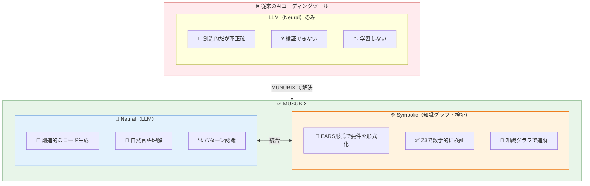
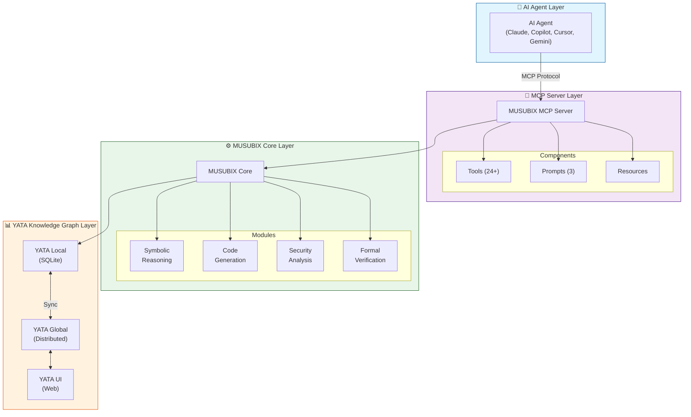
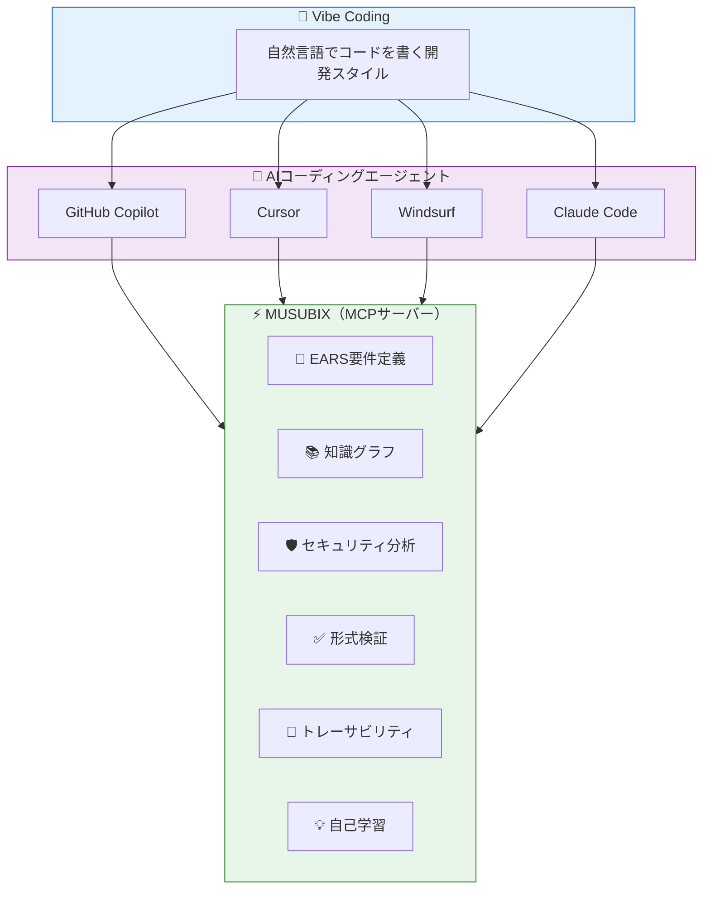
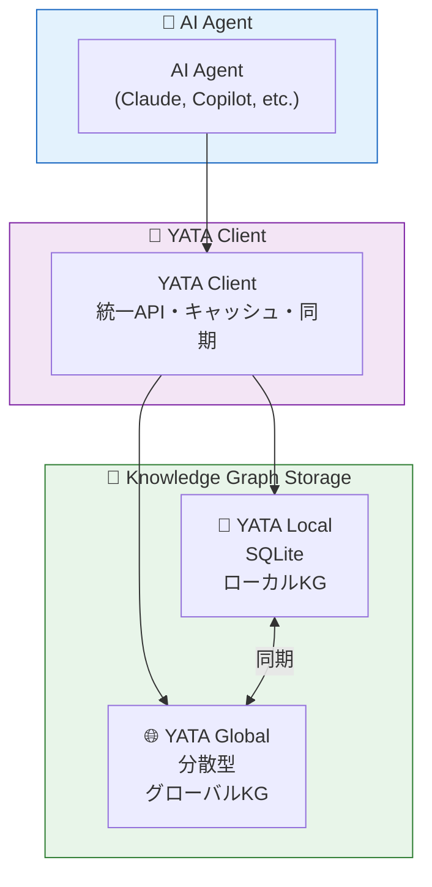
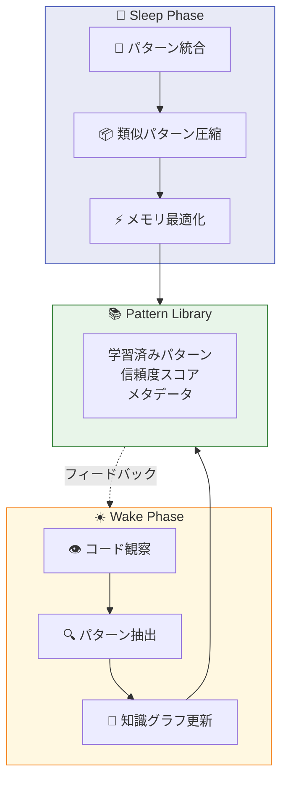

# Neuro-Symbolic AI Integration System - 次世代AIコーディング支援システム

💡 この記事は、MUSUBIXの最新バージョン1.8.0（Security Analysis Edition）の導入から実践的な活用方法までを包括的に解説します。

# :book: 目次

1. [はじめに](#はじめに)
2. [MUSUBIXとは](#musubixとは)
3. [インストール](#インストール)
4. [クイックスタート](#クイックスタート)
5. [CLIコマンドリファレンス](#cliコマンドリファレンス)
6. [MCPサーバー連携](#mcpサーバー連携)
7. [セキュリティ分析（v1.8.0新機能）](#セキュリティ分析v180新機能)
   - [自動修復システム（Phase 5）](#自動修復システムphase-5)
   - [セキュリティインテリジェンス（Phase 6）](#セキュリティインテリジェンスphase-6)
8. [形式検証](#形式検証)
9. [知識グラフ（YATA）](#知識グラフyata)
10. [学習システム](#学習システム)
11. [ベストプラクティス](#ベストプラクティス)
12. [トラブルシューティング](#トラブルシューティング)


# はじめに

## AIコーディングツールの課題

2025年、GitHub Copilot、Cursor、Claude Codeなど、AIコーディングツールは急速に普及しました。しかし、これらのツールには共通の課題があります。

| 課題 | 詳細 |
|:-----|:-----|
| 🎲 **確率的な出力** | LLMは確率的に回答を生成するため、同じ質問でも異なる回答が返ることがある |
| 🔍 **検証が困難** | 生成されたコードが正しいかどうかは、人間がレビューするしかない |
| 📝 **要件の曖昧さ** | 自然言語の曖昧さがそのままコードに反映され、意図と異なる実装になることがある |
| 🔗 **追跡不能** | なぜそのコードが生成されたのか、どの要件に基づいているのか追跡できない |
| 🧠 **学習しない** | フィードバックを与えても、次回の提案に反映されない |

## Neuro-Symbolic AIという解決策

**MUSUBIX**は、これらの課題を**Neuro-Symbolic AI**（ニューロシンボリックAI）で解決します。



## 従来ツールとの違い

| 観点 | 従来のAIコーディングツール | MUSUBIX |
|:-----|:---------------------------|:--------|
| **出力の信頼性** | LLMの確率的出力をそのまま使用 | シンボリック推論で検証してから採用 |
| **要件定義** | 自然言語のまま（曖昧） | EARS形式で形式化（テスト可能） |
| **検証** | 人間によるレビューのみ | Z3 SMTソルバで数学的に証明 |
| **トレーサビリティ** | なし | 要件→設計→コード→テストを100%追跡 |
| **セキュリティ** | 事後的なスキャン | 生成時にOWASP/CWEパターンをチェック |
| **学習** | しない | フィードバックからパターンを学習・蓄積 |

:::note info
💡 **MUSUBIXの核心**

MUSUBIXは「AIの創造性」と「数学的な厳密性」を組み合わせます。

- **LLMが生成** → **シンボリック推論が検証** → **問題があれば却下・修正**

これにより、AIの強みを活かしながら、信頼性の高いソフトウェア開発を実現します。
:::

## 誰のためのツールか

| ユーザー | MUSUBIXのメリット |
|:---------|:------------------|
| **個人開発者** | 一人でも品質の高いコードを書ける。要件の漏れやセキュリティ問題を自動検出 |
| **スタートアップ** | 少人数でも大企業レベルの開発プロセスを実現。トレーサビリティでコンプライアンス対応 |
| **エンタープライズ** | 大規模プロジェクトの品質管理。形式検証で重大なバグを防止 |
| **規制産業** | 医療・金融・航空など、法的にトレーサビリティが求められる分野に最適 |


# MUSUBIXとは

**MUSUBIX**（ムスビックス）は、**GitHub Copilot**や**Claude Code**などのAIコーディングエージェントを**機能強化**するツールです。

**Neural（LLM）** と **Symbolic（Knowledge Graph）** 推論を統合し、AIエージェントに以下の能力を追加します。

- 🎯 **要件定義支援** - 対話形式でEARS形式の要件を自動生成
- 📐 **設計支援** - C4モデルによる設計書の自動生成
- 🛡️ **セキュリティ分析** - 脆弱性の自動検出と修正提案
- ✅ **形式検証** - Z3 SMTソルバによる数学的検証
- 🔗 **トレーサビリティ** - 要件→設計→コード→テストの100%追跡
- 📚 **知識グラフ** - プロジェクト知識の蓄積と再利用

:::note info
💡 **名前の由来**

**MUSUBIX（ムスビックス）**
- **M**odel **U**nified **S**ymbolic **U**nderstanding and **B**ehavior **I**ntegration e**X**tension の略
  - Model: AIモデル（LLM）
  - Unified: 統合された
  - Symbolic Understanding: シンボリック理解（知識グラフ・形式検証）
  - Behavior Integration: 振る舞いの統合（要件→設計→コード→テスト）
  - eXtension: 拡張（AIエージェントを拡張する）
- 日本語の「**結び**（むすび）」に由来
- 「結び」は「つなぐ」「統合する」という意味を持つ
- Neural（LLM）とSymbolic（知識グラフ）を**結び**つける
- 要件→設計→コード→テストを**結び**つける（トレーサビリティ）
- 人間とAIを**結び**つける


**YATA（ヤタ）**
- **Y**et **A**nother **T**raceability **A**rchitecture の略
- 日本神話の「**八咫鏡**（やたのかがみ）」にも通じる
- 八咫鏡は「真実を映し出す鏡」として知られる
- YATAは知識グラフとして、プロジェクトの**真実**（要件、設計、コード、テストの関係）を映し出す
:::

:::note info
💡 **MUSUBIXを導入すると、AIエージェントが...**
- 自然言語だけでソフトウェア開発の全工程を実行できるようになります
- 要件の漏れや設計の矛盾を自動的に検出できるようになります
- セキュリティ脆弱性をコード生成時に防止できるようになります
:::

:::note warn
📖 **専門用語の解説**

**🧠 Neuro-Symbolic統合とは？**
- **Neural（ニューラル）**: LLM（大規模言語モデル）による創造的な推論。自然言語理解、コード生成、パターン認識が得意
- **Symbolic（シンボリック）**: 知識グラフやルールベースの論理的推論。厳密な検証、一貫性チェック、トレーサビリティが得意
- **統合の利点**: LLMの「創造性」とシンボリック推論の「精密性」を組み合わせ、高品質なソフトウェア開発を実現

**📝 EARS形式とは？**
- **EARS** = Easy Approach to Requirements Syntax（要件構文への簡易アプローチ）
- 自然言語の曖昧さを排除し、テスト可能な要件を記述するための形式
- 5つのパターン: Ubiquitous（常時）、Event-driven（イベント駆動）、State-driven（状態駆動）、Unwanted（禁止）、Optional（条件付き）

**🛡️ OWASP / CWE とは？**
- **OWASP Top 10**: Webアプリケーションの最も危険なセキュリティリスク上位10項目（インジェクション、認証不備、XSSなど）
- **CWE Top 25**: 最も危険なソフトウェア脆弱性上位25項目（バッファオーバーフロー、SQLインジェクション、パストラバーサルなど）
- MUSUBIXはこれらの脆弱性パターンを自動検出し、修正を提案します

**✅ 形式検証（Formal Verification）とは？**
- **定義**: プログラムが仕様を満たすことを**数学的に証明**する手法
- **テストとの違い**:
  - テスト: 「いくつかの入力で正しく動いた」→ バグがないことは保証できない
  - 形式検証: 「すべての可能な入力で正しく動く」→ 数学的に証明
- **何ができるか**:
  - 🔢 「この関数は常に0以上の値を返す」を証明
  - 📏 「配列のインデックスは絶対に範囲外にならない」を証明
  - 🔄 「デッドロックは発生しない」を証明
  - 💰 「口座残高がマイナスになることはない」を証明
- **適用分野**: 航空宇宙、医療機器、金融システム、暗号通貨など、バグが許されない分野で必須
- **MUSUBIXでの活用**: EARS形式の要件を自動的にSMT式に変換し、Z3ソルバで検証

**🔧 Z3 SMTソルバとは？**
- **Z3**: Microsoft Researchが開発した世界最高水準の定理証明器（Theorem Prover）
- **SMT** = Satisfiability Modulo Theories（理論付き充足可能性問題）
- コードの性質を数学的に検証し、「この関数は常に正の値を返す」「配列のインデックスは範囲内」などを証明
- バグを実行前に数学的に発見できる強力なツール
- **具体例**:
  ```
  // この関数が「常に正の値を返す」ことをZ3で証明
  function calculatePrice(quantity: number, unitPrice: number): number {
    // 事前条件: quantity > 0 かつ unitPrice > 0
    // 事後条件: 戻り値 > 0
    return quantity * unitPrice;
  }
  ```

**📚 知識グラフとは？**
- エンティティ（概念）とリレーション（関係）で知識を構造化したデータベース
- MUSUBIXでは**YATA**（Yet Another Traceability Architecture）を使用
- プロジェクトの要件、設計、コード、テストの関係を記録し、影響分析やトレーサビリティに活用

**🔗 トレーサビリティとは？なぜ必要？**
- **定義**: 要件→設計→コード→テストの各成果物間の関連を追跡できる状態
- **なぜ必要か**:
  - 📋 **変更影響分析**: 「この要件を変更したら、どのコードとテストに影響する？」がすぐわかる
  - 🐛 **バグ原因追跡**: バグが発生したとき、どの要件の実装ミスかを特定できる
  - ✅ **テスト網羅性確認**: すべての要件がテストでカバーされているか検証できる
  - 📊 **進捗管理**: 要件ごとの実装・テスト状況を可視化できる
  - 🔒 **コンプライアンス**: 医療・金融・航空など規制産業では法的に必須
- **従来の問題**: Excelやドキュメントで手動管理→更新漏れ、整合性崩壊
- **MUSUBIXの解決策**: 知識グラフで自動追跡、AIエージェントが常に最新状態を維持

**🔄 Wake-Sleepサイクルとは？**
- **起源**: 神経科学のWake-Sleep学習アルゴリズムに着想を得た継続的学習システム
- **Wakeフェーズ（覚醒期）**: 
  - コードを観察し、パターンを抽出
  - 新しい知識を知識グラフに追加
  - リアルタイムで開発パターンを学習
- **Sleepフェーズ（睡眠期）**:
  - 蓄積したパターンを統合・圧縮
  - 類似パターンをマージして汎化
  - メモリを最適化し、ノイズを除去
- **なぜ必要か**:
  - 🧠 **継続的改善**: 使えば使うほど賢くなる
  - 📦 **知識の圧縮**: 冗長なパターンを統合し、効率的に保存
  - 🎯 **精度向上**: プロジェクト固有のパターンを学習し、より的確な提案が可能に
- **MUSUBIXでの動作**:
  ```
  Wake: コード観察 → パターン抽出 → 知識グラフ更新
  Sleep: パターン統合 → 圧縮 → メモリ最適化
  ```

**📐 C4モデルとは？**
- **C4** = Context, Container, Component, Code の4つのレベルで設計を表現
- Simon Brownが提唱したソフトウェアアーキテクチャの可視化手法
- **4つのレベル**:
  - **Context（コンテキスト）**: システム全体と外部アクター（ユーザー、外部システム）の関係
  - **Container（コンテナ）**: アプリケーション、データベース、マイクロサービスなどの技術的な構成要素
  - **Component（コンポーネント）**: コンテナ内部の論理的な構成要素（サービス、リポジトリ等）
  - **Code（コード）**: 実際のクラス、関数、モジュールレベルの設計
- **なぜ使うか**: 異なる関係者（経営層、開発者、運用）に適切な粒度で設計を説明できる

**🔌 MCP（Model Context Protocol）とは？**
- Anthropicが提唱したAIエージェントとツールを接続するためのオープンプロトコル
- **3つの要素**:
  - **Tools（ツール）**: AIエージェントが呼び出せる機能（例：`sdd_create_requirements`）
  - **Prompts（プロンプト）**: 事前定義されたプロンプトテンプレート
  - **Resources（リソース）**: AIエージェントがアクセスできるデータ
- **対応エージェント**: Claude Code、GitHub Copilot、Cursor、Windsurf、Gemini CLI
- **MUSUBIXでの活用**: MCPサーバーを通じて24のツールと3のプロンプトを提供

**🦉 OWL 2 RLとは？**
- **OWL** = Web Ontology Language（Webオントロジー言語）
- **OWL 2 RL**: OWL 2のサブセットで、ルールベースの推論に最適化されたプロファイル
- **特徴**:
  - 効率的な推論が可能（多項式時間）
  - Datalog（論理プログラミング言語）で実装可能
  - クラス階層、プロパティ継承、推移的関係などを推論
- **MUSUBIXでの活用**: 知識グラフの自動推論（「AがBのサブクラスで、BがCのサブクラスなら、AはCのサブクラス」など）

**📜 Hoare論理とは？**
- **定義**: プログラムの正しさを証明するための形式的手法（1969年、Tony Hoare提唱）
- **Hoareトリプル**: `{P} C {Q}` の形式で表現
  - **P（事前条件）**: プログラム実行前に成り立つべき条件
  - **C（コマンド）**: 実行するプログラム
  - **Q（事後条件）**: プログラム実行後に成り立つべき条件
- **例**:
  ```
  {x > 0}           // 事前条件: xは正
  y = x * 2;        // コマンド
  {y > 0 ∧ y > x}   // 事後条件: yは正かつxより大きい
  ```
- **MUSUBIXでの活用**: 関数の事前・事後条件を自動検証

**📋 ADR（Architecture Decision Record）とは？**
- **定義**: アーキテクチャ上の重要な決定を記録するドキュメント形式
- **なぜ必要か**:
  - 🤔 **Why**: なぜその技術を選んだのか？後から理由がわからなくなる問題を防ぐ
  - 🔄 **変更履歴**: 過去の決定を振り返り、同じ議論を繰り返さない
  - 👥 **チーム共有**: 新メンバーがプロジェクトの背景を理解できる
- **構成要素**: タイトル、ステータス、コンテキスト、決定、結果
- **MUSUBIXでの活用**: `npx musubix design adr <decision>` で自動生成

**🏗️ DDD（ドメイン駆動設計）関連用語**
- **Entity（エンティティ）**: 一意のIDを持つオブジェクト（例：ユーザー、注文）
- **Value Object（値オブジェクト）**: IDを持たず、値で同一性を判断するオブジェクト（例：住所、金額）
- **Aggregate（集約）**: 一貫性を保つべきEntityとValue Objectのグループ
- **Repository（リポジトリ）**: Aggregateの永続化・取得を担当
- **Service（サービス）**: 特定のEntityに属さないドメインロジック
- **MUSUBIXでの活用**: DDDパターンを自動検出し、適切な設計を提案

**🔒 テイント解析（Taint Analysis）とは？**
- **定義**: ユーザー入力（信頼できないデータ）がプログラム内をどう流れるかを追跡する静的解析手法
- **Source（ソース）**: テイントデータの発生源（例：`req.body`、`req.query`、`process.env`）
- **Sink（シンク）**: テイントデータが到達してはいけない危険な関数（例：`eval()`、`exec()`、SQL実行）
- **なぜ必要か**: インジェクション攻撃（SQL、コマンド、XSS）を防ぐ
- **MUSUBIXでの活用**: `@nahisaho/musubix-security`パッケージでテイント解析を実行

**🎯 Result型パターンとは？**
- **定義**: 処理の成功/失敗を明示的に表現する型パターン
- **従来の問題**: 例外（throw）は制御フローを分断し、型安全性を損なう
- **Result型の利点**:
  - ✅ 成功/失敗が型で明示される
  - 🔄 呼び出し側で必ずエラー処理が必要になる
  - 📝 どんなエラーが発生するか型で表現できる
- **例**:
  ```typescript
  type Result<T, E> = { ok: true; value: T } | { ok: false; error: E };
  
  function divide(a: number, b: number): Result<number, string> {
    if (b === 0) return { ok: false, error: 'Division by zero' };
    return { ok: true, value: a / b };
  }
  ```
- **MUSUBIXでの活用**: ベストプラクティスとしてResult型パターンを推奨
:::

## 主要な特徴

| 特徴 | 説明 |
|:-----|:-----|
| 🧠 **Neuro-Symbolic統合** | LLMの創造性とシンボリック推論の精密性を融合 |
| 📝 **EARS形式要件** | 5パターンの形式的要件記述 |
| 📜 **9条憲法** | 開発プロセスを統治する9つの不変ルール |
| 🔗 **完全トレーサビリティ** | 要件→設計→コード→テストの100%追跡 |
| 🛡️ **セキュリティ分析** | OWASP Top 10 / CWE Top 25対応の脆弱性検出 |
| ✅ **形式検証** | Z3 SMTソルバによる数学的正確性の検証 |
| 📚 **知識グラフ** | YATA - SQLiteベースのローカル知識グラフ |
| 💡 **自己学習** | フィードバックに基づくパターン学習と適応 |

## プロジェクト統計

| 項目 | 数値 | 説明 |
|:-----|:-----|:-----|
| **バージョン** | 1.8.0 | Security Analysis Edition |
| **テスト数** | 1,586 | 全テスト合格 |
| **MCPツール** | 24 | SDD(9) + Pattern(7) + Ontology(3) + KGPR(5) |
| **MCPプロンプト** | 3 | 要件分析、レビュー、設計生成 |
| **Agent Skills** | 12 | Claude Code対応 |
| **OWL 2 RLルール** | 20+ | 組み込み推論ルール |
| **パッケージ数** | 12 | モノレポ構成 |

## アーキテクチャ概要



## 他のAIコーディングツールとの比較

MUSUBIXは既存のAIコーディングツールとは異なるアプローチを取っています。

| ツール | カテゴリ | 特徴 | MUSUBIXとの違い |
|:-------|:---------|:-----|:----------------|
| **Vibe Coding** | 開発スタイル | 自然言語でコードを生成する開発スタイル（2025年提唱） | MUSUBIXは**Vibe Codingを実現するためのインフラ**。要件定義→設計→実装の全工程を自然言語で行える |
| **GitHub Copilot** | AIコード補完 | コード補完、チャット、エージェント機能 | **AGENTS.md経由で直接利用可能**。MCP設定不要でEARS要件、セキュリティ分析、形式検証を追加 |
| **Claude Code** | AIコーディング | Anthropicの自律コーディングエージェント | **CLAUDE.md経由で直接利用可能**。MCP設定不要で全機能を活用可能 |
| **Cursor** | AI統合IDE | AIネイティブなコードエディタ | MUSUBIXは**CursorのMCP機能で利用可能**。知識グラフとトレーサビリティを追加 |
| **Windsurf** | AI統合IDE | Codeiumが開発したAIエディタ | MUSUBIXは**WindsurfのMCP機能で利用可能**。シンボリック推論を追加 |
| **AWS Kiro** | 要件駆動開発 | Spec（仕様）から実装を生成（2025年発表） | MUSUBIXは**オープンソース**で**知識グラフによる学習機能**を持つ。クラウド非依存 |
| **GitHub SpecKit** | 仕様管理 | 仕様ファイルからコード生成（2025年発表） | MUSUBIXは**EARS形式**でより厳密な要件定義。**形式検証**で数学的に正確性を保証 |
| **Google Antigravity** | AIコード生成 | Geminiベースのコード生成（2025年発表） | MUSUBIXは**エージェント非依存**。どのLLMでも利用可能。**9条憲法**で品質を担保 |

:::note info
💡 **MUSUBIXのポジショニング**

MUSUBIXは「AIコーディングツール」ではなく、**「AIコーディングツールを強化するプラットフォーム」** です。

**🚀 GitHub Copilot / Claude Code ユーザーへ**
MCP設定は不要です！プロジェクトに`AGENTS.md`（GitHub Copilot用）または`CLAUDE.md`（Claude Code用）ファイルがあれば、自動的にMUSUBIXの機能を認識します。



**AWS KiroやGitHub SpecKitとの違い**:

2025年に登場したAWS KiroやGitHub SpecKitも「仕様駆動開発」を掲げていますが、MUSUBIXには以下の差別化ポイントがあります。

| 観点 | AWS Kiro / GitHub SpecKit | MUSUBIX |
|:-----|:--------------------------|:--------|
| **ライセンス** | プロプライエタリ | オープンソース（MIT） |
| **プラットフォーム** | 特定クラウド/サービスに依存 | クラウド非依存、ローカル実行可能 |
| **AIエージェント** | 専用エージェント | MCP対応の任意のエージェント |
| **要件形式** | 独自フォーマット | EARS形式（業界標準） |
| **検証方式** | ルールベース | Z3 SMTソルバ（数学的証明） |
| **知識管理** | セッション単位 | 知識グラフで永続化・学習 |
| **カスタマイズ** | 限定的 | 完全にカスタマイズ可能 |

- **オープンソース**: ベンダーロックインなし、カスタマイズ自由。コードを読んで動作を理解できる
- **エージェント非依存**: GitHub Copilot、Claude Code、Cursor、Windsurf、Gemini CLIなど、MCP対応の任意のAIエージェントで利用可能
- **知識グラフ（YATA）**: プロジェクト知識を構造化して蓄積。過去の決定理由、パターン、フィードバックを学習し、次のプロジェクトに活かせる
- **形式検証**: Z3 SMTソルバによる数学的な正確性保証。「この関数は常に正の値を返す」といった性質を証明できる
:::


# インストール

## システム要件

| 項目 | 要件 |
|:-----|:-----|
| **ランタイム** | Node.js >= 20.0.0 |
| **パッケージマネージャ** | npm >= 10.0.0 |
| **OS** | Windows / macOS / Linux |

## グローバルインストール

```bash
# CLIツールをグローバルにインストール
npm install -g musubix
```

## プロジェクトへのインストール

```bash
# プロジェクトの依存関係として追加
npm install musubix
```

:::note info
`musubix`パッケージをインストールすると、以下のサブパッケージがすべて自動的にインストールされます。
- `@nahisaho/musubix-core` - コア機能
- `@nahisaho/musubix-mcp-server` - MCPサーバー
- `@nahisaho/musubix-security` - セキュリティ分析
- `@nahisaho/musubix-formal-verify` - 形式検証
- `@nahisaho/musubix-yata-client` - YATA知識グラフクライアント
- その他の依存パッケージ
:::

## インストール確認

```bash
# バージョン確認
npx musubix --version
# 出力: 1.8.0

# ヘルプ表示
npx musubix --help
```

## パッケージ構成

MUSUBIXはモノレポ構成で、以下の17パッケージで構成されています。

```
packages/
├── core/           # @nahisaho/musubix-core
├── mcp-server/     # @nahisaho/musubix-mcp-server  
├── security/       # @nahisaho/musubix-security (v1.8.0 NEW!)
├── formal-verify/  # @nahisaho/musubix-formal-verify
├── yata-client/    # @nahisaho/musubix-yata-client
├── yata-local/     # @nahisaho/yata-local
├── yata-global/    # @nahisaho/yata-global
├── yata-ui/        # @nahisaho/yata-ui
├── pattern-mcp/    # @nahisaho/musubix-pattern-mcp
├── ontology-mcp/   # @nahisaho/musubix-ontology-mcp
├── wake-sleep/     # @nahisaho/musubix-wake-sleep
└── sdd-ontology/   # @nahisaho/musubix-sdd-ontology
```

| パッケージ | npm名 | 役割 |
|:-----------|:------|:-----|
| **core** | `@nahisaho/musubix-core` | CLI、EARS検証、コード生成、設計パターン |
| **mcp-server** | `@nahisaho/musubix-mcp-server` | AIエージェント連携（MCP）- 24ツール・3プロンプト |
| **security** | `@nahisaho/musubix-security` | セキュリティ分析 - OWASP Top 10、CWE Top 25 (v1.8.0新機能) |
| **formal-verify** | `@nahisaho/musubix-formal-verify` | Z3統合、Hoare検証、EARS→SMT変換 |
| **yata-client** | `@nahisaho/musubix-yata-client` | YATA知識グラフクライアント |
| **yata-local** | `@nahisaho/yata-local` | SQLiteベースローカル知識グラフ |
| **yata-global** | `@nahisaho/yata-global` | 分散型知識グラフプラットフォーム |
| **yata-ui** | `@nahisaho/yata-ui` | Web可視化・管理インターフェース |
| **pattern-mcp** | `@nahisaho/musubix-pattern-mcp` | パターン抽出・圧縮・ライブラリ |
| **ontology-mcp** | `@nahisaho/musubix-ontology-mcp` | N3Store・OWL 2 RL推論エンジン |
| **wake-sleep** | `@nahisaho/musubix-wake-sleep` | Wake-Sleep学習サイクル |
| **sdd-ontology** | `@nahisaho/musubix-sdd-ontology` | SDD方法論オントロジー |


# クイックスタート

## 前提条件

- MUSUBIXがインストールされていること
- AIエージェント（Claude Code、GitHub Copilot、Cursor等）が利用可能であること

:::note info
💡 **GitHub CopilotとClaude Codeは設定不要！**

GitHub Copilotは`AGENTS.md`、Claude Codeは`CLAUDE.md`ファイルがあれば自動的にMUSUBIXの機能を認識します。MCP設定は不要です。

Cursor、Windsurf等の他のエージェントを使う場合は、[MCPサーバー連携](#mcpサーバー連携)を参照してMCPサーバーを設定してください。
:::

## 1. プロジェクトの初期化

CLIコマンドでプロジェクトを初期化します。

```bash
# 新しいプロジェクトを初期化
npx musubix init my-project

# または現在のディレクトリを初期化
npx musubix init
```

以下のファイルが生成されます：
- `steering/` - プロジェクトメモリ
- `storage/` - 要件・設計・トレーサビリティ
- `musubix.config.json` - 設定ファイル
- `AGENTS.md` - GitHub Copilot用設定
- `CLAUDE.md` - Claude Code用設定

## 2. 対話形式で要件定義を作成

MUSUBIXには**対話形式の要件定義機能**が備わっています。作りたいシステムを伝えて「要件定義を開始」と言うだけで、AIエージェントが質問を通じて要件を引き出してくれます。

```
💬 「ユーザー認証システムを作りたいので、要件定義を開始してください」
```

🤖 AIエージェントが対話形式で要件をヒアリングします。

```
🤖 「ユーザー認証システムの要件定義を開始します。
    いくつか質問させてください。

    Q1: 認証方式は何を使いますか？
        a) メールアドレス + パスワード
        b) ソーシャルログイン（Google, GitHub等）
        c) 多要素認証（MFA）
        d) 上記の組み合わせ」

💬 「aとcを組み合わせたいです。最初はメールとパスワードで、
    オプションでMFAを有効にできるようにしてください」

🤖 「了解しました。次の質問です。

    Q2: セッション管理について教えてください。
        - セッションの有効期限は何分ですか？
        - 同時ログインは許可しますか？
        - 自動ログアウト機能は必要ですか？」

💬 「有効期限は30分、同時ログインは許可しない、
    非アクティブ状態が続いたら自動ログアウトしてください」

🤖 「ありがとうございます。セキュリティ要件についてお聞きします。

    Q3: ログイン試行の制限は必要ですか？
        - 連続失敗時のアカウントロック
        - CAPTCHAの表示
        - IPアドレスによる制限」

💬 「5回連続で失敗したら30分ロック、3回目からCAPTCHAを表示してください」

🤖 「十分な情報が集まりました。要件定義書を生成します...

    【生成された要件定義書】
    
    ## REQ-AUTH-001: ユーザー認証
    WHEN a user submits email and password,
    THE system SHALL validate credentials
    AND return a JWT token within 2 seconds.

    ## REQ-AUTH-002: 多要素認証
    IF a user has MFA enabled,
    THEN THE system SHALL require a TOTP code after password validation.

    ## REQ-AUTH-003: セッション管理
    WHILE a user session is active,
    THE system SHALL maintain the session for 30 minutes of inactivity.
    THE system SHALL NOT allow concurrent sessions for the same user.

    ## REQ-AUTH-004: ログイン試行制限
    WHEN login attempts exceed 5 times within 10 minutes,
    THE system SHALL lock the account for 30 minutes.
    WHEN login attempts exceed 2 times,
    THE system SHALL display CAPTCHA verification.

    ...

    この要件定義書でよろしいですか？」
```

:::note info
💡 **対話形式のメリット**
- 要件の漏れを防げる（AIが適切な質問をしてくれる）
- 曖昧な点を明確化できる
- 非機能要件も自動的にヒアリングしてくれる
- EARS形式への変換を意識する必要がない
:::

## 3. 要件定義書のレビューと修正

生成された要件を確認し、必要に応じて修正を依頼します。

```
💬 「この要件定義書をレビューしてください。
    漏れている要件や曖昧な点があれば指摘してください」
```

🤖 AIエージェントが要件定義書をレビューし、以下の観点でフィードバックします。
- EARS形式の構文チェック
- 要件の網羅性・完全性
- 要件間の矛盾や重複
- 非機能要件（性能、セキュリティ等）の漏れ

```
💬 「いいですね。ただ、以下を追加・修正してください：
    - ログイン試行は5回までにして、超えたら30分アカウントをロック
    - パスワードの最小文字数は8文字以上
    - レスポンス時間の要件を2秒から1秒に変更」
```

🤖 AIエージェントが要件を追加・修正し、更新された要件定義書を提示します。

:::note warn
📝 **要件定義書のレビューポイント**
- すべての機能要件がEARS形式で記述されているか
- 非機能要件（性能、セキュリティ、可用性等）が含まれているか
- 各要件に一意のIDが付与されているか
- 曖昧な表現（「適切に」「できるだけ」等）がないか
:::

## 4. 設計の生成を依頼

要件が固まったら、設計を依頼します。

```
💬 「この要件でC4モデルの設計を作成してください」
```

🤖 AIエージェントがC4モデル（Context → Container → Component）の設計を生成します。

## 5. 設計書のレビューと修正

生成された設計をレビューします。

```
💬 「この設計書をレビューしてください。
    アーキテクチャの問題点やSOLID原則への違反があれば指摘してください」
```

🤖 AIエージェントが設計書をレビューし、以下の観点でフィードバックします。
- C4モデルの各レベルの整合性
- コンポーネント間の依存関係
- SOLID原則への準拠
- 設計パターンの適切な適用

```
💬 「設計を以下のように修正してください：
    - AuthServiceとTokenServiceを分離
    - キャッシュ層（Redis）を追加
    - 認証ログを記録するAuditServiceを追加」
```

🤖 AIエージェントが設計を修正し、更新された設計書を提示します。

:::note warn
📐 **設計書のレビューポイント**
- 各コンポーネントの責務が明確か（単一責任原則）
- 依存関係が適切か（依存性逆転原則）
- すべての要件がコンポーネントにマッピングされているか
- スケーラビリティ・保守性が考慮されているか
:::

## 6. 憲法準拠チェックを依頼

設計が9条憲法に準拠しているか確認します。

```
💬 「この設計が憲法に準拠しているか検証してください」
```

🤖 AIエージェントが各条項への準拠状況をレポートします。

## 7. コード生成を依頼

設計からコードを生成します。

```
💬 「この設計からTypeScriptのコードを生成してください。
    Repositoryパターンを使って、テストも一緒に作成してください」
```

🤖 AIエージェントがコードとテストを生成します。

## 8. セキュリティチェックを依頼

生成されたコードのセキュリティを確認します。

```
💬 「生成されたコードにセキュリティの問題がないか確認してください」
```

🤖 AIエージェントがセキュリティスキャンを実行し、問題があれば修正案を提示します。

## 9. トレーサビリティを確認

要件から実装までの追跡可能性を確認します。

```
💬 「要件からコードまでのトレーサビリティを確認してください」
```

🤖 AIエージェントがトレーサビリティマトリクスを生成し、リンクの整合性を検証します。


:::note info
🎉 **これで完了です！**

コードを一行も書かずに、自然言語だけでソフトウェア開発の一連のプロセスを実行できました。
:::


# CLIコマンドリファレンス

## 初期化コマンド

```bash
# プロジェクト初期化
npx musubix init [path] [--name <name>] [--force]

# オプション
#   path       : 初期化先のパス（デフォルト: カレントディレクトリ）
#   --name     : プロジェクト名
#   --force    : 既存ファイルを上書き
```

## 要件分析コマンド

```bash
# 自然言語 → EARS変換
npx musubix requirements analyze <file>

# EARS構文検証
npx musubix requirements validate <file>

# オントロジーマッピング
npx musubix requirements map <file>

# 関連要件検索
npx musubix requirements search <query>
```

## 設計生成コマンド

```bash
# 要件から設計生成
npx musubix design generate <file>

# パターン検出
npx musubix design patterns <context>

# SOLID準拠検証
npx musubix design validate <file>

# C4ダイアグラム生成
npx musubix design c4 <file> [--level <level>]
#   level: context | container | component | code

# ADR生成
npx musubix design adr <decision>
```

## コード生成コマンド

```bash
# 設計からコード生成
npx musubix codegen generate <file> [--output <dir>]

# 静的解析
npx musubix codegen analyze <file>

# セキュリティスキャン
npx musubix codegen security <path>
```

## テストコマンド

```bash
# テスト生成
npx musubix test generate <file>

# カバレッジ測定
npx musubix test coverage <dir>
```

## トレーサビリティコマンド

```bash
# トレーサビリティマトリクス
npx musubix trace matrix

# 影響分析
npx musubix trace impact <id>

# リンク検証
npx musubix trace validate

# 自動同期（v1.6.7+）
npx musubix trace sync [--dry-run]
```

## 学習システムコマンド

```bash
# 学習状態ダッシュボード
npx musubix learn status

# フィードバック記録
npx musubix learn feedback <id>

# パターン一覧
npx musubix learn patterns

# 推奨パターン
npx musubix learn recommend

# ベストプラクティス表示
npx musubix learn best-practices [--category <cat>] [--high-confidence]

# エクスポート
npx musubix learn export [--output <file>] [--privacy-filter]

# インポート
npx musubix learn import <file> [--merge-strategy <strategy>]
```

## KGPR（Knowledge Graph Pull Request）コマンド

```bash
# KGPR作成
npx musubix kgpr create -t "title"

# 差分プレビュー
npx musubix kgpr diff

# KGPR一覧
npx musubix kgpr list

# KGPR送信
npx musubix kgpr submit <id>
```

## REPLモード

```bash
# 対話的シェルを起動
npx musubix repl

# REPL内コマンド例
> requirements validate ./req.md
> design patterns authentication
> trace matrix
> exit
```

## グローバルオプション

| オプション | 説明 |
|:-----------|:-----|
| `--verbose, -v` | 詳細出力 |
| `--json` | JSON形式で出力 |
| `--config <file>` | 設定ファイル指定 |
| `--quiet, -q` | 静音モード |

## 終了コード

| コード | 意味 |
|:-------|:-----|
| 0 | 成功 |
| 1 | 一般エラー |
| 2 | 検証エラー |
| 3 | 設定エラー |
| 4 | 入出力エラー |
| 5 | 内部エラー |


# MCPサーバー連携

MUSUBIXは **Model Context Protocol（MCP）** を通じて、主要なAIコーディングエージェントと連携できます。

## 対応プラットフォーム

| プラットフォーム | 対応状況 |
|:----------------|:---------|
| Claude Code | :white_check_mark: 完全対応 |
| GitHub Copilot | :white_check_mark: 完全対応 |
| Cursor | :white_check_mark: 完全対応 |
| Gemini CLI | :white_check_mark: 完全対応 |
| Windsurf | :white_check_mark: 対応 |

## MCPサーバー起動

```bash
# 標準入出力（stdio）トランスポート
npx @nahisaho/musubix-mcp-server

# または
npx musubix-mcp --transport stdio

# HTTPトランスポート
npx musubix-mcp --transport http --port 3000
```

## Claude Code設定

`~/.config/claude/claude_desktop_config.json`:

```json
{
  "mcpServers": {
    "musubix": {
      "command": "npx",
      "args": ["@nahisaho/musubix-mcp-server"],
      "env": {}
    }
  }
}
```

## VS Code設定（GitHub Copilot）

`.vscode/settings.json`:

```json
{
  "mcp.servers": {
    "musubix": {
      "command": "npx",
      "args": ["@nahisaho/musubix-mcp-server"]
    }
  }
}
```

## Cursor設定

`.cursor/mcp.json`:

```json
{
  "mcpServers": {
    "musubix": {
      "command": "npx",
      "args": ["@nahisaho/musubix-mcp-server"]
    }
  }
}
```

## MCPツール一覧（24ツール）

### SDD基本ツール（9ツール）

| ツール名 | 説明 |
|:---------|:-----|
| `sdd_create_requirements` | EARS形式の要件ドキュメント作成 |
| `sdd_validate_requirements` | 要件のEARS検証・憲法準拠チェック |
| `sdd_create_design` | C4モデル設計ドキュメント作成 |
| `sdd_validate_design` | 設計の要件トレーサビリティ検証 |
| `sdd_create_tasks` | 設計から実装タスク生成 |
| `sdd_query_knowledge` | YATA知識グラフへのクエリ |
| `sdd_update_knowledge` | 知識グラフの更新 |
| `sdd_validate_constitution` | 9憲法条項への準拠検証 |
| `sdd_validate_traceability` | 要件↔設計↔タスクのトレーサビリティ検証 |

### シンボリックツール（5ツール）

| ツール名 | 説明 |
|:---------|:-----|
| `symbolic_filter_code` | LLM出力のセマンティック検証 |
| `symbolic_detect_hallucination` | ハルシネーション検出 |
| `symbolic_check_constitution` | 憲法ルールチェック |
| `symbolic_estimate_confidence` | 信頼度推定 |
| `symbolic_route_decision` | 信頼度ルーティング |

### パターン統合ツール（7ツール）

| ツール名 | 説明 |
|:---------|:-----|
| `pattern_extract` | コードからパターンを抽出 |
| `pattern_compress` | パターンの抽象化・圧縮 |
| `pattern_store` | パターンライブラリへの保存 |
| `pattern_query` | パターンの検索・取得 |
| `pattern_consolidate` | 類似パターンの統合 |
| `ontology_query` | オントロジーグラフへのクエリ |
| `ontology_infer` | オントロジーによる推論実行 |

### KGPRツール（5ツール）

| ツール名 | 説明 |
|:---------|:-----|
| `kgpr_create` | KGPR作成 |
| `kgpr_diff` | 差分プレビュー |
| `kgpr_list` | KGPR一覧表示 |
| `kgpr_submit` | KGPR送信 |
| `kgpr_review` | KGPRレビュー |

### 形式検証ツール（6ツール）

| ツール名 | 説明 |
|:---------|:-----|
| `verify_precondition` | 事前条件検証（Z3） |
| `verify_postcondition` | 事後条件検証（Hoare） |
| `ears_to_smt` | EARS→SMT-LIB2変換 |
| `trace_add_link` | トレースリンク追加 |
| `trace_query` | トレースクエリ |
| `trace_impact` | 影響分析 |


# セキュリティ分析（v1.8.0新機能）

v1.8.0で追加された`@nahisaho/musubix-security`パッケージは、包括的なセキュリティ分析機能を提供します。

## 機能概要

| 機能 | 説明 |
|:-----|:-----|
| :mag: **脆弱性スキャン** | SQLインジェクション、XSS、コマンドインジェクション等の検出 |
| :key: **シークレット検出** | APIキー、認証情報、秘密鍵のハードコード検出 |
| :droplet: **テイント解析** | ユーザー入力から危険な関数へのデータフロー追跡 |
| :package: **依存関係監査** | npm audit統合による脆弱な依存関係の検出 |
| :wrench: **自動修正生成** | 検出された脆弱性に対する修正コードの提案 |
| :hammer: **自動修復システム** | パッチ生成、修復計画、セキュアコード変換 (Phase 5) |
| :shield: **セキュリティインテリジェンス** | 脅威情報、リスクスコア、予測分析 (Phase 6) |

## 脆弱性スキャン

CLIからの実行：

```bash
# ディレクトリをスキャン
npx musubix codegen security ./src

# 詳細レポート
npx musubix codegen security ./src --verbose --json
```

プログラマティックな使用：

```typescript
import { VulnerabilityScanner } from '@nahisaho/musubix-security';

const scanner = new VulnerabilityScanner();
const result = await scanner.scanDirectory('./src');

console.log(result.vulnerabilities);  // 検出された脆弱性
console.log(result.summary);          // 重要度別サマリー
```

## 検出可能な脆弱性

| カテゴリ | CWE | 重要度 |
|:---------|:----|:-------|
| **SQLインジェクション** | CWE-89 | Critical |
| **コマンドインジェクション** | CWE-78 | Critical |
| **コードインジェクション** | CWE-94 | Critical |
| **XSS** | CWE-79 | High |
| **パストラバーサル** | CWE-22 | High |
| **NoSQLインジェクション** | CWE-943 | High |
| **XXE** | CWE-611 | High |
| **オープンリダイレクト** | CWE-601 | Medium |

## シークレット検出

```typescript
import { SecretDetector } from '@nahisaho/musubix-security';

const detector = new SecretDetector();
const result = await detector.scan('./src');

console.log(result.secrets);  // 検出されたシークレット
```

検出可能なシークレット：

- Azure Connection Strings
- AWS Access Key / Secret Key
- GitHub Token
- Private Keys (PEM)
- Database URLs
- JWT Secrets
- Stripe Keys
- Slack Webhooks


## テイント解析

ユーザー入力から危険な関数へのデータフローを追跡：

```typescript
import { TaintAnalyzer } from '@nahisaho/musubix-security';

const analyzer = new TaintAnalyzer();
const result = analyzer.analyze('./src');

console.log(result.paths);  // ソースからシンクへのパス
```

## 統合セキュリティスキャン

すべてのセキュリティ機能を一度に実行：

```typescript
import { createSecurityService } from '@nahisaho/musubix-security';

const service = createSecurityService();

const result = await service.scan({
  target: './src',
  vulnerabilities: true,
  taint: true,
  secrets: true,
  dependencies: true,
  generateFixes: true,  // 自動修正コードを生成
});

console.log(result.summary);
```

## レポート形式

```bash
# JSON形式
npx musubix codegen security ./src --format json

# Markdown形式
npx musubix codegen security ./src --format markdown

# SARIF形式（GitHub Code Scanning互換）
npx musubix codegen security ./src --format sarif
```

## 自動修復システム（Phase 5）

検出された脆弱性に対する自動修復機能を提供します。

### AutoFixer

```typescript
import { createAutoFixer } from '@nahisaho/musubix-security';

const fixer = createAutoFixer();

// 脆弱性に対する修正を生成
const fixes = fixer.generateFixes(vulnerability, {
  maxFixes: 3,
  minConfidence: 0.7,
  includeBreakingChanges: false,
  preferredStrategies: ['sanitization', 'parameterization'],
});

// 修正を適用
const result = fixer.applyFix(fixes[0], fileContent);
```

### PatchGenerator

```typescript
import { createPatchGenerator } from '@nahisaho/musubix-security';

const generator = createPatchGenerator();

// パッチ生成
const patch = generator.generatePatch(fix, originalContent, {
  format: 'unified', // unified | git | json | context
  contextLines: 3,
});

// パッチの適用
const applied = generator.applyPatch(patch, targetContent);
```

### RemediationPlanner

複数の脆弱性に対する修復計画を策定：

```typescript
import { createRemediationPlanner } from '@nahisaho/musubix-security';

const planner = createRemediationPlanner();

const plan = planner.createPlan(vulnerabilities, {
  strategy: 'risk-based', // severity-first | effort-first | risk-based
  maxParallelFixes: 3,
});

console.log(plan.phases);           // フェーズ分けされた修復順序
console.log(plan.estimatedEffort);  // 推定作業量
console.log(plan.riskReduction);    // リスク削減効果
```

### SecureCodeTransformer

セキュアなコードパターンへの変換：

```typescript
import { createSecureCodeTransformer } from '@nahisaho/musubix-security';

const transformer = createSecureCodeTransformer();

const result = transformer.transform(code, {
  categories: ['output-encoding', 'cryptography', 'error-handling'],
});

console.log(result.transformed);    // 変換後のコード
console.log(result.changes);        // 変更一覧
```

## セキュリティインテリジェンス（Phase 6）

脅威情報の統合とリスク分析機能を提供します。

### ThreatIntelligence

外部脅威フィードとの統合：

```typescript
import { createThreatIntelligence } from '@nahisaho/musubix-security';

const intel = createThreatIntelligence();

// フィードの追加
await intel.addFeed({
  id: 'custom-feed',
  name: 'Custom Threat Feed',
  url: 'https://threat-feed.example.com/iocs',
  type: 'stix',
  refreshInterval: 3600000,
});

// コードに対するIOCマッチング
const matches = intel.matchCode(sourceCode);
```

### AttackPatternMatcher

MITRE ATT&CKフレームワークとの統合：

```typescript
import { createAttackPatternMatcher } from '@nahisaho/musubix-security';

const matcher = createAttackPatternMatcher();

// コードに対するパターンマッチング
const matches = matcher.matchCode(sourceCode);

// 特定のテクニックの取得
const technique = matcher.getTechnique('T1059');

// タクティクス別のテクニック一覧
const techniques = matcher.getTechniquesByTactic('execution');
```

### RiskScorer

CVSS計算とビジネスインパクト評価：

```typescript
import { createRiskScorer } from '@nahisaho/musubix-security';

const scorer = createRiskScorer();

// CVSS計算
const cvss = scorer.calculateCVSS(vulnerability);
console.log(cvss.baseScore);        // 基本スコア
console.log(cvss.severity);         // 重要度ラベル

// ビジネスインパクト評価
const impact = scorer.assessBusinessImpact(vulnerability, {
  assetCriticality: 'high',
  dataClassification: 'confidential',
  serviceAvailability: 'critical',
});
```

### SecurityAnalytics

セキュリティメトリクスとダッシュボード：

```typescript
import { createSecurityAnalytics } from '@nahisaho/musubix-security';

const analytics = createSecurityAnalytics();

// イベントの記録
analytics.recordVulnerability(vulnerability);
analytics.recordFix(fix);
analytics.recordScan(scanResult);

// メトリクス計算
const mttr = analytics.calculateMetric('mean-time-to-remediation');

// ダッシュボード生成
const dashboard = analytics.generateDashboard();
console.log(dashboard.summary);     // サマリー
console.log(dashboard.kpis);        // KPI一覧
```

### PredictiveAnalyzer

セキュリティトレンドの予測と異常検出：

```typescript
import { createPredictiveAnalyzer } from '@nahisaho/musubix-security';

const analyzer = createPredictiveAnalyzer();

// データポイントの追加
analyzer.addDataPoints([
  { timestamp: new Date('2026-01-01'), value: 10, metric: 'vulnerabilities' },
  { timestamp: new Date('2026-01-02'), value: 12, metric: 'vulnerabilities' },
]);

// リスク予測（30日先）
const projection = analyzer.projectRisk(30);
console.log(projection.projectedRisk);  // 予測リスク値
console.log(projection.confidence);     // 信頼度
console.log(projection.trend);          // トレンド方向

// 異常検出
const anomalies = analyzer.detectAnomalies();
```


# 形式検証

`@nahisaho/musubix-formal-verify`パッケージは、Z3 SMTソルバを使用した形式検証機能を提供します。

## Z3統合

```typescript
import { Z3Adapter } from '@nahisaho/musubix-formal-verify';

const z3 = new Z3Adapter();
await z3.initialize();

const result = await z3.verify(`
  (declare-const x Int)
  (declare-const y Int)
  (assert (> x 0))
  (assert (> y 0))
  (assert (= (+ x y) 10))
  (check-sat)
`);

console.log(result.status);  // 'sat' | 'unsat' | 'unknown'
```

## 事前条件検証

```typescript
import { PreconditionVerifier } from '@nahisaho/musubix-formal-verify';

const verifier = new PreconditionVerifier();

const result = await verifier.verify({
  condition: {
    expression: 'amount > 0 && amount <= balance',
    format: 'javascript',
  },
  variables: [
    { name: 'amount', type: 'Int' },
    { name: 'balance', type: 'Int' },
  ],
});

console.log(result.status);  // 'valid' | 'invalid' | 'unknown'
```

## 事後条件検証（Hoareトリプル）

```typescript
import { PostconditionVerifier } from '@nahisaho/musubix-formal-verify';

const verifier = new PostconditionVerifier();

const result = await verifier.verify({
  precondition: {
    expression: 'balance >= amount && amount > 0',
    format: 'javascript',
  },
  postcondition: {
    expression: 'balance_new == balance - amount',
    format: 'javascript',
  },
  preVariables: [
    { name: 'balance', type: 'Int' },
    { name: 'amount', type: 'Int' },
  ],
  postVariables: [
    { name: 'balance_new', type: 'Int' },
  ],
  transition: 'balance_new := balance - amount',
});
```

## EARS→SMT変換

EARS形式の要件をSMT-LIB2形式に変換：

```typescript
import { EarsToSmtConverter } from '@nahisaho/musubix-formal-verify';

const converter = new EarsToSmtConverter();

const result = converter.convert(
  'WHEN a user submits login form, THE system SHALL validate credentials within 2 seconds.'
);

console.log(result.pattern);   // 'event-driven'
console.log(result.smtLib2);   // SMT-LIB2 コード
```


# 知識グラフ（YATA）

**YATA (Yet Another Triple Architecture)** は、MUSUBIXの知識グラフシステムです。

## アーキテクチャ



## YATA Local vs YATA Global

| 項目 | YATA Local | YATA Global |
|:-----|:-----------|:------------|
| **用途** | プロジェクト固有の知識管理 | チーム・組織横断の知識共有 |
| **ストレージ** | SQLite（ローカルファイル） | 分散型（P2Pネットワーク） |
| **同期** | オフラインでも動作 | リアルタイム同期 |
| **プライバシー** | 完全にローカル | プライバシーフィルタリング |
| **スケール** | 単一プロジェクト | 複数プロジェクト・チーム |

:::note info
💡 **どちらを使うべき？**
- **個人開発・プライベートプロジェクト**: YATA Local のみで十分
- **チーム開発**: YATA Local + YATA Global で知識を共有
- **オープンソースプロジェクト**: YATA Global で学習パターンをコミュニティと共有
:::

## YATA Local 詳細

**YATA Local**は、SQLiteベースの軽量な知識グラフです。プロジェクトごとに独立した知識を管理します。

### セットアップ

```bash
# プロジェクト初期化時に自動作成
npx musubix init

# または手動で作成
npx musubix yata init --local
```

初期化すると、以下のファイルが作成されます。
```
storage/
└── knowledge/
    └── local.db    # SQLiteデータベース
```

### 基本操作

```typescript
import { YataLocal } from '@nahisaho/yata-local';

// 初期化
const yata = new YataLocal({
  dbPath: './storage/knowledge/local.db',
});

// トリプル追加（主語-述語-目的語）
await yata.addTriple({
  subject: 'req:REQ-AUTH-001',      // 主語: 要件ID
  predicate: 'rdf:type',             // 述語: 型
  object: 'sdd:Requirement',         // 目的語: 要件クラス
});

// 関連付け
await yata.addTriple({
  subject: 'des:DES-AUTH-001',       // 設計ID
  predicate: 'sdd:implements',       // 実装する
  object: 'req:REQ-AUTH-001',        // 要件ID
});

// トリプル検索
const results = await yata.query({
  subject: 'req:REQ-AUTH-001',
});
// => [{subject, predicate, object}, ...]

// SPARQLクエリ（高度な検索）
const sparqlResults = await yata.sparql(`
  SELECT ?design ?requirement
  WHERE {
    ?design sdd:implements ?requirement .
    ?requirement rdf:type sdd:Requirement .
  }
`);
```

### CLIでの操作

```bash
# トリプル追加
npx musubix yata add --subject "req:REQ-001" --predicate "rdf:type" --object "sdd:Requirement"

# クエリ実行
npx musubix yata query --subject "req:REQ-001"

# SPARQLクエリ
npx musubix yata sparql "SELECT ?s ?p ?o WHERE { ?s ?p ?o } LIMIT 10"

# 統計表示
npx musubix yata stats
```

### AIエージェントからの利用

```
💬 「REQ-AUTH-001 に関連する設計を知識グラフから検索してください」

🤖 AIエージェント:
「[sdd_query_knowledge ツールを実行]

REQ-AUTH-001 に関連する設計を検索しました：

- DES-AUTH-001: 認証コンポーネント設計
- DES-AUTH-002: トークン管理設計
- DES-AUTH-003: セッション管理設計

これらの設計はすべて REQ-AUTH-001 を実装しています。」
```

## YATA Global 詳細

**YATA Global**は、分散型の知識グラフです。チーム・組織・コミュニティ間で知識を共有できます。

### セットアップ

```bash
# YATA Global ノードを初期化
npx musubix yata init --global --node-id "my-team-node"

# ピアに接続
npx musubix yata connect --peer "https://yata.example.com"
```

設定ファイル（`musubix.config.json`）:
```json
{
  "yata": {
    "global": {
      "enabled": true,
      "nodeId": "my-team-node",
      "peers": [
        "https://yata-peer-1.example.com",
        "https://yata-peer-2.example.com"
      ],
      "privacy": {
        "filter": "strict",
        "excludePatterns": ["password", "secret", "key"]
      }
    }
  }
}
```

### 基本操作

```typescript
import { YataGlobal } from '@nahisaho/yata-global';

// 初期化
const yataGlobal = new YataGlobal({
  nodeId: 'my-team-node',
  peers: ['https://yata-peer-1.example.com'],
  privacy: {
    filter: 'strict',
    excludePatterns: ['password', 'secret', 'api_key'],
  },
});

// ピアネットワークに接続
await yataGlobal.connect();

// グローバル知識を検索
const patterns = await yataGlobal.query({
  predicate: 'sdd:pattern',
  object: 'authentication',
});

// ローカル知識をグローバルに共有（プライバシーフィルタ適用）
await yataGlobal.publish({
  triples: localTriples,
  namespace: 'patterns',
  privacy: 'strict',
});
```

### KGPR（Knowledge Graph Pull Request）

GitのPull Requestのように、知識グラフへの変更をレビュー可能な形式で提案できます。

```bash
# KGPR作成
npx musubix kgpr create -t "認証パターンの追加"

# 差分プレビュー
npx musubix kgpr diff

# KGPR一覧
npx musubix kgpr list

# KGPR送信（レビュー依頼）
npx musubix kgpr submit <kgpr-id>
```

```typescript
// プログラムから KGPR を作成
const kgpr = await yataGlobal.createKGPR({
  title: 'Add authentication patterns',
  description: 'New patterns learned from Project-15',
  changes: [
    { operation: 'add', triple: { subject: 'pattern:jwt-auth', ... } },
    { operation: 'add', triple: { subject: 'pattern:oauth2', ... } },
  ],
});

// KGPR送信
await yataGlobal.submitKGPR(kgpr.id);

// KGPRレビュー
await yataGlobal.reviewKGPR(kgpr.id, {
  decision: 'approve',  // 'approve' | 'changes_requested' | 'commented'
  comment: 'LGTM! Great patterns.',
});
```

### プライバシー設定

YATA Globalは、機密情報を自動的にフィルタリングします。

| プライバシーレベル | フィルタリング内容 |
|:------------------|:-------------------|
| `strict` | パスワード、シークレット、API キー、個人情報をすべて除外 |
| `moderate` | シークレット、API キーのみ除外 |
| `none` | フィルタリングなし（プライベートネットワーク用） |

```typescript
// プライバシーフィルタの例
const filtered = yataGlobal.applyPrivacyFilter(triples, {
  level: 'strict',
  customPatterns: [
    /password/i,
    /secret/i,
    /api[_-]?key/i,
    /\b[A-Za-z0-9._%+-]+@[A-Za-z0-9.-]+\.[A-Z|a-z]{2,}\b/,  // メールアドレス
  ],
});
```

## Local ↔ Global 同期

YATA LocalとYATA Globalは自動的に同期できます。

```typescript
import { YataClient } from '@nahisaho/musubix-yata-client';

const client = new YataClient({
  local: { dbPath: './storage/knowledge/local.db' },
  global: { nodeId: 'my-node', peers: [...] },
  sync: {
    enabled: true,
    interval: 60000,  // 60秒ごとに同期
    direction: 'bidirectional',  // 双方向同期
  },
});

// 手動同期
await client.sync();

// 同期状態を確認
const status = await client.getSyncStatus();
// => { lastSync: Date, pending: 5, conflicts: 0 }
```

## 推論エンジン

```typescript
const yata = new YataLocal({
  inference: {
    enabled: true,
    rules: ['transitive', 'subclass', 'inverse'],
  },
});

// 推移的閉包クエリ
const ancestors = await yata.inferTransitive({
  subject: 'comp:UserService',
  predicate: 'sdd:dependsOn',
});
```

## KGPR（Knowledge Graph Pull Request）

知識グラフへの変更をレビュー可能な形式で提案：

```typescript
import { YataGlobal } from '@nahisaho/yata-global';

const yataGlobal = new YataGlobal({
  nodeId: 'node-001',
  peers: ['https://yata-peer-1.example.com'],
});

// KGPR作成
const kgpr = await yataGlobal.createKGPR({
  title: 'Add authentication patterns',
  description: 'New patterns learned from Project-15',
  changes: [{ operation: 'add', triple: {...} }],
});

// KGPR送信
await yataGlobal.submitKGPR(kgpr.id);

// KGPRレビュー
await yataGlobal.reviewKGPR(kgpr.id, {
  decision: 'approve',
  comment: 'LGTM',
});
```


# 学習システム

MUSUBIXは、Wake-Sleepサイクルに基づく自律学習機能を提供します。

## Wake-Sleepサイクル



## パターン抽出

```typescript
import { PatternExtractor } from '@nahisaho/musubix-pattern-mcp';

const extractor = new PatternExtractor();

const patterns = await extractor.extract(`
  class UserService {
    constructor(private readonly userRepo: UserRepository) {}
    
    async findUser(id: string): Promise<User | null> {
      return this.userRepo.findById(id);
    }
  }
`);
```

## パターンライブラリ

```typescript
import { PatternLibrary } from '@nahisaho/musubix-pattern-mcp';

const library = new PatternLibrary({
  storagePath: './patterns.db',
});

// パターン保存
await library.store(pattern);

// パターン検索
const matches = await library.search({
  type: 'design-pattern',
  domain: 'authentication',
  minConfidence: 0.9,
});

// パターン推奨
const recommendations = await library.recommend({
  context: 'user-service-implementation',
  maxResults: 5,
});
```

## フィードバック記録

```bash
# フィードバックを記録
npx musubix learn feedback <pattern-id>

# 学習状態を確認
npx musubix learn status
```


# ベストプラクティス

## 9条憲法（Constitutional Articles）

MUSUBIXのすべての開発活動を統治する**不変のルール**です。AIエージェントもこれらのルールに従って動作します。

| 条項 | 名称 | 概要 | 詳細 |
|:-----|:-----|:-----|:-----|
| **I** | Specification First | 要件を先に定義 | 実装の前に必ず要件を定義。曖昧なまま開発しない |
| **II** | Design Before Code | 設計を先に行う | コードを書く前に設計を完了。C4モデル必須 |
| **III** | Single Source of Truth | 唯一の真実の源 | `steering/`がプロジェクトの権威ある情報源 |
| **IV** | Traceability | 追跡可能性 | 要件→設計→コード→テストを100%追跡可能に |
| **V** | Incremental Progress | 漸進的な進歩 | 小さく頻繁にデリバリー。大きな変更は分割 |
| **VI** | Decision Documentation | 決定の文書化 | すべての決定はADR（Architecture Decision Record）で記録 |
| **VII** | Quality Gates | 品質ゲート | フェーズ移行前に品質検証を必須化 |
| **VIII** | User-Centric | ユーザー中心 | ユーザー価値を文書化。技術だけでなく価値を重視 |
| **IX** | Continuous Learning | 継続的学習 | レトロスペクティブと改善を継続 |

:::note info
💡 **憲法準拠チェック**

AIエージェントに「この設計が憲法に準拠しているか検証してください」と依頼すると、各条項への準拠状況を自動的にチェックします。

```
💬 「この設計が憲法に準拠しているか検証してください」

🤖 AIエージェント:
「[sdd_validate_constitution ツールを実行]

憲法準拠チェック結果：

✅ Article I (Specification First): 準拠 - 要件が定義済み
✅ Article II (Design Before Code): 準拠 - C4設計が存在
✅ Article III (Single Source of Truth): 準拠 - steering/参照済み
⚠️ Article IV (Traceability): 警告 - 2件の要件がリンクなし
...」
```
:::

## シンボリック推論モジュール

MUSUBIXのシンボリック推論は、3つのフェーズで構成されています。

### Phase 1: 基盤機能

| コンポーネント | 機能 |
|:--------------|:-----|
| **SemanticCodeFilterPipeline** | LLM出力の意味的検証 |
| **HallucinationDetector** | 未定義シンボル・無効なインポートの検出 |
| **ConstitutionRuleRegistry** | 9条憲法の強制 |
| **ConfidenceEstimator** | AST複雑度、要件カバレッジのスコアリング |
| **ConfidenceBasedRouter** | 信頼度に基づくルーティング決定 |

### Phase 2: 形式検証

| コンポーネント | 機能 |
|:--------------|:-----|
| **EarsToFormalSpecConverter** | EARS → SMT-LIB変換 |
| **VerificationConditionGenerator** | 検証条件（VC）生成 |
| **Z3Adapter** | Z3 SMTソルバ統合 |
| **SecurityScanner** | OWASPパターン、シークレット検出 |

### Phase 3: 高度な機能

| コンポーネント | 機能 |
|:--------------|:-----|
| **CandidateRanker** | マルチクライテリア候補スコアリング |
| **ResultBlender** | Neural/Symbolic結果統合（3戦略） |
| **AuditLogger** | SHA-256ハッシュチェーン改ざん検出 |
| **QualityGateValidator** | 自動品質ゲート検証 |

## OWL 2 RL推論エンジン

MUSUBIXは、OWL 2 RLプロファイルに準拠した推論エンジンを搭載しています。

### 組み込み推論ルール

| カテゴリ | ルール | 説明 |
|:--------|:-------|:-----|
| クラス公理 | cax-sco, cax-eqc | サブクラス、等価クラス推論 |
| プロパティ | prp-dom, prp-rng | ドメイン、レンジ推論 |
| プロパティ特性 | prp-symp, prp-trp, prp-inv | 対称、推移、逆関係 |
| 等価性 | eq-ref, eq-sym, eq-trans | sameAs推論 |

```typescript
import { OWL2RLReasoner } from '@nahisaho/musubix-ontology-mcp';

const reasoner = new OWL2RLReasoner();

// 推論実行
const inferred = await reasoner.infer(triples, {
  rules: ['cax-sco', 'prp-trp', 'prp-inv'],
  maxIterations: 100,
});

// 推論の説明を取得
const explanation = await reasoner.explain(inferredTriple, {
  format: 'markdown',
});
```

## EARS要件形式

5つのEARSパターンで要件を形式化します。

| パターン | 構文 | 用途 |
|:---------|:-----|:-----|
| **Ubiquitous** | `THE [system] SHALL [requirement]` | 常時満たすべき要件 |
| **Event-driven** | `WHEN [event], THE [system] SHALL [response]` | イベント発生時の要件 |
| **State-driven** | `WHILE [state], THE [system] SHALL [response]` | 特定状態での要件 |
| **Unwanted** | `THE [system] SHALL NOT [behavior]` | 禁止事項 |
| **Optional** | `IF [condition], THEN THE [system] SHALL [response]` | 条件付き要件 |

**例：**

```markdown
# Ubiquitous（常時）
THE system SHALL encrypt all user data at rest.

# Event-driven（イベント駆動）
WHEN a user submits a login form, THE system SHALL validate credentials within 2 seconds.

# State-driven（状態駆動）
WHILE the system is in maintenance mode, THE system SHALL reject all API requests.

# Unwanted（禁止）
THE system SHALL NOT store passwords in plain text.

# Optional（条件付き）
IF the user has admin privileges, THEN THE system SHALL display the admin dashboard.
```

## 学習済みベストプラクティス

MUSUBIXは過去のプロジェクトから学習したベストプラクティスを蓄積しています。CLIで表示できます。

```bash
# 全ベストプラクティス表示
npx musubix learn best-practices

# カテゴリ別フィルタ
npx musubix learn best-practices --category code
npx musubix learn best-practices --category design
npx musubix learn best-practices --category test

# 高信頼度パターンのみ
npx musubix learn best-practices --high-confidence
```

## コードパターン

| ID | 名称 | 概要 | 信頼度 |
|:---|:-----|:-----|:-------|
| BP-CODE-001 | Entity Input DTO | エンティティ作成にInput DTOを使用 | 95% |
| BP-CODE-002 | Date-based ID Format | PREFIX-YYYYMMDD-NNN形式でIDを生成 | 90% |
| BP-CODE-003 | Value Objects | ドメイン概念にValue Objectを使用 | 90% |
| BP-CODE-004 | Function-based Value Objects | interface+factory関数でVO実装 | 95% |
| BP-CODE-005 | Result Type | 失敗可能な操作にResult<T, E>を使用 | 95% |

**Function-based Value Object例：**

```typescript
// ✅ 推奨: Interface + Factory Function
interface Price {
  readonly amount: number;
  readonly currency: 'JPY';
}

function createPrice(amount: number): Result<Price, ValidationError> {
  if (amount < 100 || amount > 1_000_000) {
    return err(new ValidationError('Price must be between 100 and 1,000,000 JPY'));
  }
  return ok({ amount, currency: 'JPY' });
}
```

## 設計パターン

| ID | 名称 | 概要 | 信頼度 |
|:---|:-----|:-----|:-------|
| BP-DESIGN-001 | Status Transition Map | 有効なステータス遷移をMapで定義 | 95% |
| BP-DESIGN-002 | Repository Async Pattern | 将来のDB移行に備えてasync化 | 85% |
| BP-DESIGN-003 | Service Layer with DI | リポジトリをDIしたService層 | 90% |
| BP-DESIGN-004 | Optimistic Locking | 同時編集検出のためのversion管理 | 90% |
| BP-DESIGN-005 | AuditService | データ変更の監査ログ記録 | 85% |
| BP-DESIGN-006 | Entity Counter Reset | テスト用のresetXxxCounter()関数を提供 | 95% |
| BP-DESIGN-007 | Expiry Time Logic | 有効期限をexpiresAtフィールドで明示管理 | 90% |

**Status Transition Map例：**

```typescript
const validStatusTransitions: Record<Status, Status[]> = {
  draft: ['active', 'cancelled'],
  active: ['completed', 'cancelled'],
  completed: [],
  cancelled: [],
};
```

## テストパターン

| ID | 名称 | 概要 | 信頼度 |
|:---|:-----|:-----|:-------|
| BP-TEST-001 | Test Counter Reset | beforeEachでIDカウンターをリセット | 95% |
| BP-TEST-002 | Verify API Before Test | テスト前にAPIシグネチャを確認 | 80% |
| BP-TEST-003 | Vitest ESM Configuration | Vitest + TypeScript ESM構成 | 85% |
| BP-TEST-004 | Result Type Test Pattern | isOk()/isErr()で両方のケースをテスト | 95% |
| BP-TEST-005 | Status Transition Testing | 有効・無効な遷移を網羅的にテスト | 90% |

**Result Type Test例：**

```typescript
describe('createPrice', () => {
  it('should create valid price', () => {
    const result = createPrice(1000);
    expect(result.isOk()).toBe(true);
    if (result.isOk()) {
      expect(result.value.amount).toBe(1000);
    }
  });

  it('should reject price below minimum', () => {
    const result = createPrice(50);
    expect(result.isErr()).toBe(true);
    if (result.isErr()) {
      expect(result.error.message).toContain('100');
    }
  });
});
```

## Neuro-Symbolic信頼度評価

| シンボリック結果 | ニューラル信頼度 | 最終決定 |
|:-----------------|:-----------------|:---------|
| `invalid` | - | ニューラル結果を**棄却** |
| `valid` | ≥0.8 | ニューラル結果を**採用** |
| `valid` | <0.8 | シンボリック結果を**優先** |


# トラブルシューティング

## よくある問題と解決策

### Node.jsバージョンエラー

```
Error: MUSUBIX requires Node.js >= 20.0.0
```

**解決策：**

```bash
# Node.jsのバージョンを確認
node --version

# nvmを使用している場合
nvm install 20
nvm use 20
```

### MCPサーバー接続エラー

```
Error: Failed to connect to MCP server
```

**解決策：**

1. MCPサーバーが起動しているか確認
2. 設定ファイルのパスが正しいか確認
3. ファイアウォール設定を確認

```bash
# MCPサーバーを手動起動
npx @nahisaho/musubix-mcp-server --verbose
```

### Z3初期化エラー

```
Error: Z3 initialization failed
```

**解決策：**

```bash
# z3-solverパッケージを再インストール
npm install z3-solver

# または、プロセス版にフォールバック
export MUSUBIX_Z3_MODE=process
```

### トレーサビリティ検証エラー

```
Warning: Orphan requirement detected: REQ-XXX
```

**解決策：**

```bash
# トレーサビリティマトリクスを同期
npx musubix trace sync

# または、手動でリンクを追加
npx musubix trace link REQ-XXX DES-XXX
```

## ログ出力

詳細なログを出力するには：

```bash
# 詳細モード
npx musubix --verbose <command>

# デバッグログを有効化
DEBUG=musubix:* npx musubix <command>
```

## サポート

- **GitHub Issues**: [https://github.com/nahisaho/musubix/issues](https://github.com/nahisaho/musubix/issues)
- **ドキュメント**: [docs/](https://github.com/nahisaho/musubix/tree/main/docs)


# まとめ

## MUSUBIXが解決する課題

従来のAIコーディングツールには、以下の課題がありました。

| 課題 | 従来のツール | MUSUBIXの解決策 |
|:-----|:-------------|:----------------|
| 出力が不安定 | 同じ質問でも異なる回答 | シンボリック推論で検証・一貫性を担保 |
| 検証が困難 | 人間によるレビューのみ | Z3 SMTソルバで数学的に証明 |
| 要件が曖昧 | 自然言語のまま | EARS形式で形式化・テスト可能に |
| 追跡できない | どの要件の実装か不明 | 知識グラフで100%トレーサビリティ |
| 学習しない | フィードバックが活かされない | Wake-Sleepサイクルで継続的に学習 |

## MUSUBIXの主要機能

| 機能 | 説明 | 対象ユーザー |
|:-----|:-----|:-------------|
| 🧠 **Neuro-Symbolic統合** | LLMの創造性とシンボリック推論の精密性を融合 | すべてのユーザー |
| 📝 **EARS形式要件** | 5パターンの形式的要件記述で曖昧さを排除 | すべてのユーザー |
| 🛡️ **セキュリティ分析** | OWASP Top 10 / CWE Top 25の脆弱性を自動検出 | セキュリティ重視のプロジェクト |
| ✅ **形式検証** | Z3 SMTソルバによる数学的な正確性の証明 | ミッションクリティカルなシステム |
| 📚 **知識グラフ（YATA）** | ローカル/グローバルの知識管理と共有 | チーム開発・長期プロジェクト |
| 💡 **Wake-Sleep学習** | フィードバックからパターンを学習・蓄積 | 継続的な改善を求めるチーム |
| 🔗 **完全トレーサビリティ** | 要件→設計→コード→テストの追跡 | 規制産業・コンプライアンス対応 |

## 推奨ワークフロー

```mermaid
flowchart LR
    subgraph Prep["📋 準備"]
        P1["steering/を読む"]
    end
    
    subgraph Req["📝 要件"]
        R1["EARS形式で<br/>要件定義"]
        R2["要件レビュー"]
    end
    
    subgraph Design["📐 設計"]
        D1["C4モデルで<br/>設計"]
        D2["設計レビュー"]
        D3["憲法準拠<br/>チェック"]
    end
    
    subgraph Impl["💻 実装"]
        I1["テストを<br/>先に書く"]
        I2["最小限の<br/>コード実装"]
        I3["リファクタ<br/>リング"]
    end
    
    subgraph Verify["✅ 検証"]
        V1["セキュリティ<br/>スキャン"]
        V2["形式検証"]
        V3["トレーサビリティ<br/>確認"]
    end
    
    P1 --> R1 --> R2 --> D1 --> D2 --> D3 --> I1 --> I2 --> I3 --> V1 --> V2 --> V3
    
    style Prep fill:#e3f2fd,stroke:#1565c0
    style Req fill:#fff3e0,stroke:#ef6c00
    style Design fill:#f3e5f5,stroke:#7b1fa2
    style Impl fill:#e8f5e9,stroke:#2e7d32
    style Verify fill:#ffebee,stroke:#c62828
```



## 始め方（3ステップ）

:::note info
🚀 **今すぐ始める**

**Step 1: インストール**
```bash
npm install -g musubix
```

**Step 2: プロジェクト初期化**
```bash
npx musubix init
```

**Step 3: AIエージェントで開発開始**
```
💬 「ユーザー認証システムの要件定義を開始してください」
```

GitHub CopilotやClaude Codeなら、MCP設定不要で即座に利用できます！
:::

## 次のステップ

| レベル | 学ぶべきこと | 参照セクション |
|:-------|:-------------|:---------------|
| 🌱 **初級** | CLIコマンド、基本的な要件定義 | [クイックスタート](#クイックスタート) |
| 🌿 **中級** | MCPサーバー連携、セキュリティ分析 | [MCPサーバー連携](#mcpサーバー連携)、[セキュリティ分析](#セキュリティ分析v180新機能) |
| 🌳 **上級** | 形式検証、知識グラフ、学習システム | [形式検証](#形式検証)、[知識グラフ](#知識グラフyata)、[学習システム](#学習システム) |

## コミュニティ

- **GitHub**: [nahisaho/musubix](https://github.com/nahisaho/musubix) - Issue・PRをお待ちしています！
- **npm**: [@nahisaho/musubix-core](https://www.npmjs.com/package/@nahisaho/musubix-core)
- **ドキュメント**: [docs/](https://github.com/nahisaho/musubix/tree/main/docs)

:::note warn
🤝 **貢献をお待ちしています！**

MUSUBIXはオープンソースプロジェクトです。以下の形で貢献いただけます：
- 🐛 バグ報告・機能リクエスト（GitHub Issues）
- 📝 ドキュメントの改善
- 💻 プルリクエスト
- 🌟 GitHubスター（励みになります！）
:::


**© 2026 MUSUBIX Project - Neuro-Symbolic AI for Better Software Development**

⭐ この記事が参考になったら、**LGTM**と**GitHubスター**をお願いします！
