# はじめに

AIコーディング支援ツールは急速に進化しています。本記事では、仕様駆動開発（SDD）フレームワーク「**MUSUBI**」から、ニューロシンボリックAI統合システム「**MUSUBIX**」への進化について解説します。

# TL;DR

> **最新バージョン**: v1.1.0 | **62ドメイン対応** | **~400コンポーネント** | **439テスト**

| 項目 | MUSUBI | MUSUBIX |
|------|--------|---------||
| **コンセプト** | 仕様駆動開発（SDD） | ニューロシンボリックAI |
| **推論方式** | ニューラル（LLM）のみ | ニューラル + シンボリック |
| **知識基盤** | プロジェクトメモリ | 知識グラフ（YATA） |
| **信頼性** | LLMの確率的出力 | 形式的検証による確実性 |
| **統合対象** | 7つのAIエージェント | MUSUBI + YATA + 7エージェント |
| **ドメイン** | 汎用 | 62専門ドメイン対応 |
| **自己学習** | なし | フィードバックベースの適応学習 |

# 1. MUSUBIとは？

## 1.1 概要

**MUSUBI**（結び）は、AIコーディングエージェントのための仕様駆動開発（SDD）フレームワークです。

```
🤖 7つのAIエージェント × 📋 31の専門スキル × ⚖️ 憲法ガバナンス
```

## 1.2 主な特徴

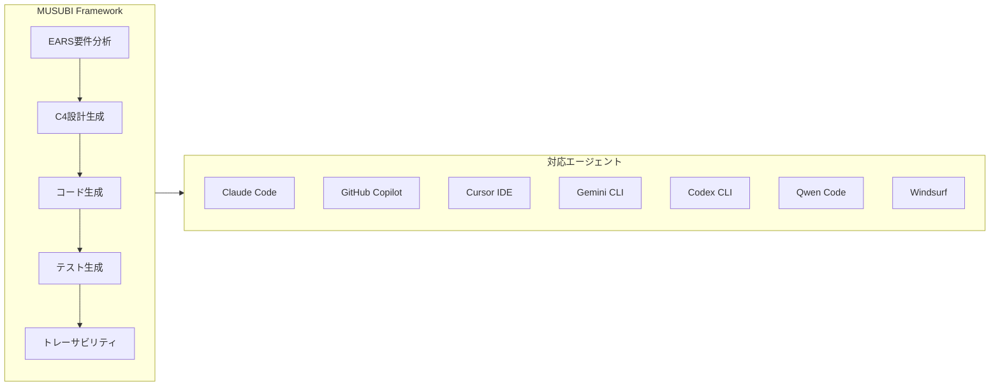
```mermaid
flowchart LR
    subgraph MUSUBI["MUSUBI Framework"]
        A[EARS要件分析] --> B[C4設計生成]
        B --> C[コード生成]
        C --> D[テスト生成]
        D --> E[トレーサビリティ]
    end
    
    subgraph Agents["対応エージェント"]
        F[Claude Code]
        G[GitHub Copilot]
        H[Cursor IDE]
        I[Gemini CLI]
        J[Codex CLI]
        K[Qwen Code]
        L[Windsurf]
    end
    
    MUSUBI --> Agents
```

| 機能 | 説明 |
|------|------|
| **EARS要件分析** | 5パターンで曖昧さのない要件定義 |
| **C4モデル生成** | Context/Container/Component/Codeの4階層設計 |
| **ADR生成** | アーキテクチャ決定記録の自動作成 |
| **憲法ガバナンス** | 9つの不変条項による品質保証 |
| **トレーサビリティ** | 要件→設計→コード→テストの完全追跡 |

## 1.3 MUSUBIの課題

MUSUBIは優れたフレームワークですが、以下の課題がありました。

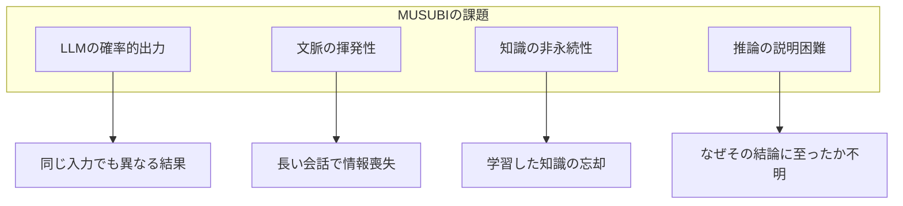
```mermaid
flowchart TB
    subgraph Challenges["MUSUBIの課題"]
        P1[LLMの確率的出力]
        P2[文脈の揮発性]
        P3[知識の非永続性]
        P4[推論の説明困難]
    end
    
    P1 --> I1[同じ入力でも異なる結果]
    P2 --> I2[長い会話で情報喪失]
    P3 --> I3[学習した知識の忘却]
    P4 --> I4[なぜその結論に至ったか不明]
```

| 課題 | 影響 |
|------|------|
| **確率的出力** | 同じ要件でも生成結果が毎回異なる |
| **文脈の揮発性** | 長いセッションで初期情報が失われる |
| **知識の非永続性** | 過去のプロジェクト知識を活用できない |
| **推論の説明困難** | AIの判断根拠が不透明 |

# 2. YATAとは？

## 2.1 概要

**YATA**（八咫）は、AIコーディング支援のための知識グラフMCPサーバーです。

## 2.2 主な特徴

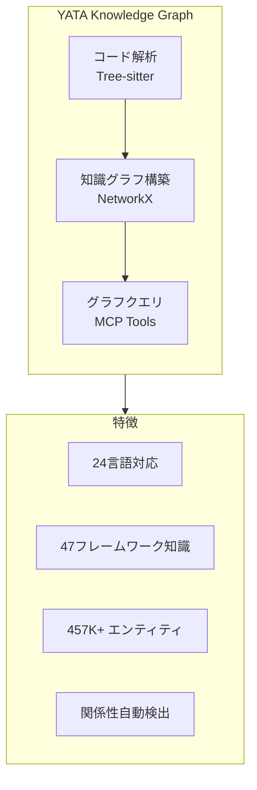
```mermaid
flowchart TB
    subgraph YATA["YATA Knowledge Graph"]
        direction TB
        Parse[コード解析<br/>Tree-sitter] --> Graph[知識グラフ構築<br/>NetworkX]
        Graph --> Query[グラフクエリ<br/>MCP Tools]
    end
    
    subgraph Features["特徴"]
        F1[24言語対応]
        F2[47フレームワーク知識]
        F3[457K+ エンティティ]
        F4[関係性自動検出]
    end
    
    YATA --> Features
```

| 機能 | 説明 |
|------|------|
| **コード解析** | Tree-sitterによる高速AST解析（24言語） |
| **知識グラフ** | NetworkXによるエンティティ・関係性グラフ |
| **関係性検出** | CALLS/IMPORTS/INHERITS/CONTAINSの自動検出 |
| **フレームワーク知識** | 47フレームワーク、457K+エンティティ |
| **永続化** | JSON/SQLiteへの保存・読み込み |

## 2.3 YATAの強み：シンボリック推論

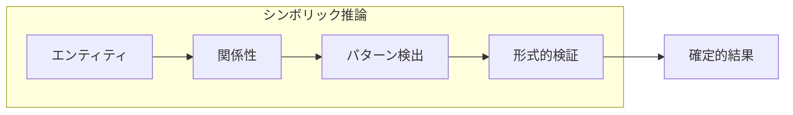
```mermaid
flowchart LR
    subgraph Symbolic["シンボリック推論"]
        E[エンティティ] --> R[関係性]
        R --> P[パターン検出]
        P --> V[形式的検証]
    end
    
    V --> Result[確定的結果]
```

YATAの知識グラフは**シンボリック推論**を実現します。

| 特性 | 説明 |
|------|------|
| **確定性** | 同じクエリには常に同じ結果 |
| **追跡可能性** | 結論に至った経路を完全追跡 |
| **形式的検証** | 論理的整合性を数学的に検証 |
| **永続性** | 知識は明示的に更新されるまで保持 |

# 3. MUSUBIXの誕生

## 3.1 ニューロシンボリックAIとは？

**ニューロシンボリックAI**（Neuro-Symbolic AI）は、第3次AIブームの次なる進化として注目されるパラダイムです。従来の深層学習（ニューラルネットワーク）と、古典的AIのシンボリック推論を融合し、両者の強みを活かしながら弱点を補完します。

### 3.1.1 なぜニューロシンボリックなのか？

現代のLLM（Large Language Model）は驚異的な能力を持ちますが、根本的な限界があります。

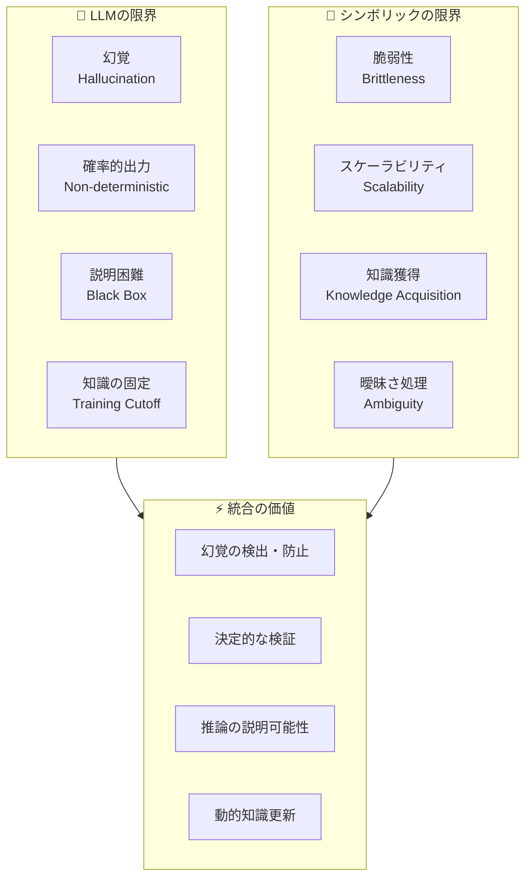
```mermaid
flowchart TB
    subgraph LLMの限界["🧠 LLMの限界"]
        L1[幻覚<br/>Hallucination]
        L2[確率的出力<br/>Non-deterministic]
        L3[説明困難<br/>Black Box]
        L4[知識の固定<br/>Training Cutoff]
    end
    
    subgraph シンボリックの限界["📐 シンボリックの限界"]
        S1[脆弱性<br/>Brittleness]
        S2[スケーラビリティ<br/>Scalability]
        S3[知識獲得<br/>Knowledge Acquisition]
        S4[曖昧さ処理<br/>Ambiguity]
    end
    
    subgraph 統合の価値["⚡ 統合の価値"]
        V1[幻覚の検出・防止]
        V2[決定的な検証]
        V3[推論の説明可能性]
        V4[動的知識更新]
    end
    
    LLMの限界 --> 統合の価値
    シンボリックの限界 --> 統合の価値
```

### 3.1.2 System 1 と System 2 思考

認知科学者ダニエル・カーネマンの「ファスト&スロー」理論に基づくと、人間の思考には2つのシステムがあります。

| システム | 特徴 | AI対応 |
|----------|------|--------|
| **System 1** | 直感的、高速、自動的、パターン認識 | ニューラル（LLM） |
| **System 2** | 論理的、低速、意図的、推論 | シンボリック（知識グラフ） |

MUSUBIXは、この2つのシステムを統合することで、人間の思考プロセスに近いAI推論を実現します。

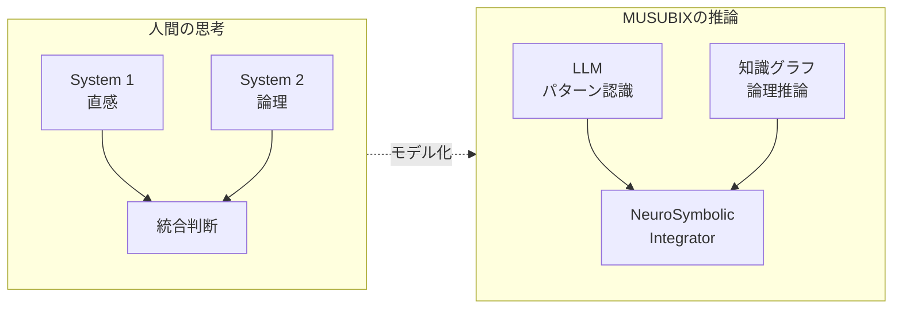
```mermaid
flowchart LR
    subgraph Human["人間の思考"]
        H1[System 1<br/>直感] --> H3[統合判断]
        H2[System 2<br/>論理] --> H3
    end
    
    subgraph MUSUBIX["MUSUBIXの推論"]
        M1[LLM<br/>パターン認識] --> M3[NeuroSymbolic<br/>Integrator]
        M2[知識グラフ<br/>論理推論] --> M3
    end
    
    Human -.->|モデル化| MUSUBIX
```

### 3.1.3 ニューロシンボリック統合パターン

ニューロシンボリックAIには複数の統合パターンがあります。MUSUBIXは**Symbolic→Neural→Symbolic**パターンを採用：

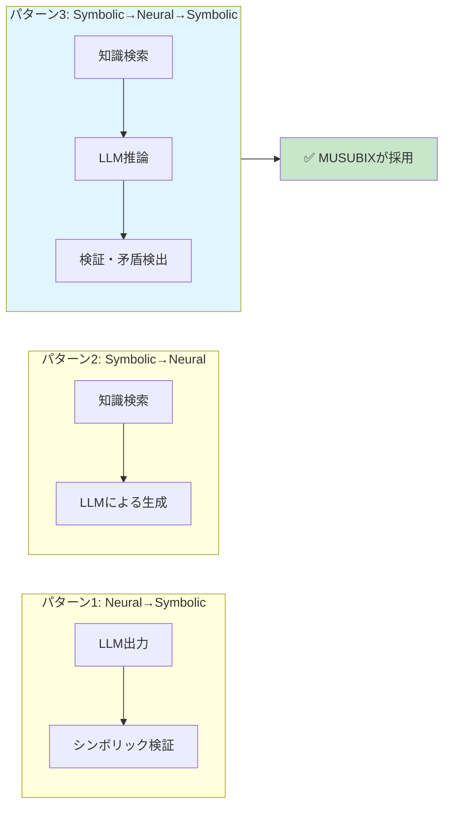
```mermaid
flowchart LR
    subgraph Pattern1["パターン1: Neural→Symbolic"]
        P1A[LLM出力] --> P1B[シンボリック検証]
    end
    
    subgraph Pattern2["パターン2: Symbolic→Neural"]
        P2A[知識検索] --> P2B[LLMによる生成]
    end
    
    subgraph Pattern3["パターン3: Symbolic→Neural→Symbolic"]
        P3A[知識検索] --> P3B[LLM推論] --> P3C[検証・矛盾検出]
    end
    
    Pattern3 --> Best["✅ MUSUBIXが採用"]
    
    style Pattern3 fill:#e1f5fe
    style Best fill:#c8e6c9
```

| 統合パターン | 説明 | 適用例 |
|-------------|------|--------|
| Neural→Symbolic | LLM出力をシンボリックで検証 | ファクトチェック |
| Symbolic→Neural | 知識を元にLLMが生成 | RAG（検索拡張生成） |
| **Symbolic→Neural→Symbolic** | 知識検索→LLM推論→検証 | **MUSUBIX** |

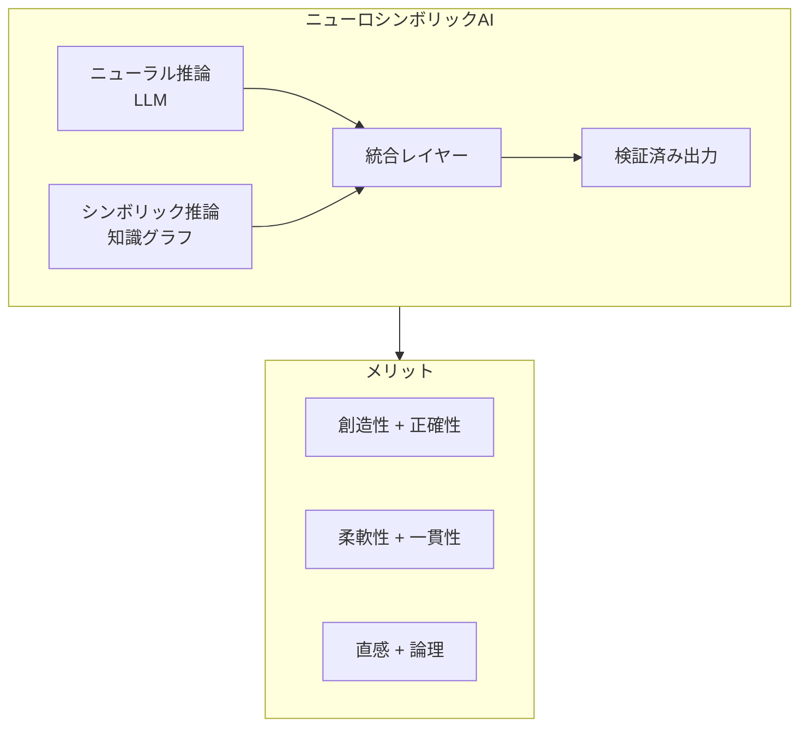
```mermaid
flowchart TB
    subgraph NeuroSymbolic["ニューロシンボリックAI"]
        Neural[ニューラル推論<br/>LLM] --> Integration[統合レイヤー]
        Symbolic[シンボリック推論<br/>知識グラフ] --> Integration
        Integration --> Output[検証済み出力]
    end
    
    subgraph Benefits["メリット"]
        B1[創造性 + 正確性]
        B2[柔軟性 + 一貫性]
        B3[直感 + 論理]
    end
    
    NeuroSymbolic --> Benefits
```

| 推論タイプ | 強み | 弱み |
|-----------|------|------|
| **ニューラル** | 創造性、柔軟性、自然言語理解 | 確率的、説明困難 |
| **シンボリック** | 正確性、説明可能性、一貫性 | 柔軟性に欠ける |
| **統合** | 両方の強みを活用 | 統合の複雑さ |

## 3.2 MUSUBIXのアーキテクチャ

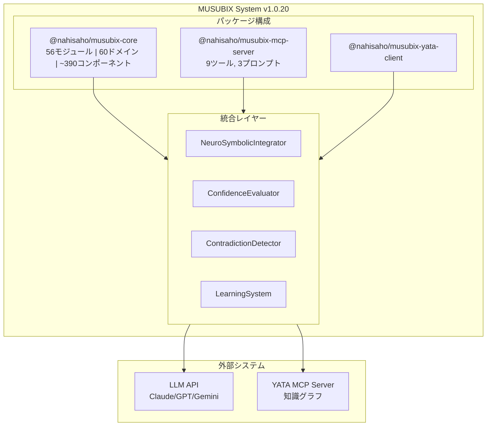
```mermaid
flowchart TB
    subgraph MUSUBIX["MUSUBIX System v1.0.20"]
        subgraph Packages["パッケージ構成"]
            Core["@nahisaho/musubix-core<br/>56モジュール | 60ドメイン | ~390コンポーネント"]
            MCP["@nahisaho/musubix-mcp-server<br/>9ツール, 3プロンプト"]
            YATA_Client["@nahisaho/musubix-yata-client"]
        end
        
        subgraph Integration["統合レイヤー"]
            NSI["NeuroSymbolicIntegrator"]
            CE["ConfidenceEvaluator"]
            CD["ContradictionDetector"]
            LS["LearningSystem"]
        end
        
        Core --> Integration
        MCP --> Integration
        YATA_Client --> Integration
    end
    
    subgraph External["外部システム"]
        LLM["LLM API<br/>Claude/GPT/Gemini"]
        YATA_Server["YATA MCP Server<br/>知識グラフ"]
    end
    
    Integration --> LLM
    Integration --> YATA_Server
```

## 3.3 信頼度評価アルゴリズム

MUSUBIXの核心は**信頼度評価**にあります。

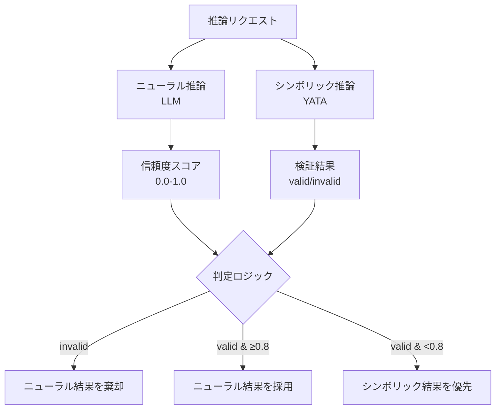
```mermaid
flowchart TD
    Start[推論リクエスト] --> Neural[ニューラル推論<br/>LLM]
    Start --> Symbolic[シンボリック推論<br/>YATA]
    
    Neural --> NC[信頼度スコア<br/>0.0-1.0]
    Symbolic --> SV[検証結果<br/>valid/invalid]
    
    NC --> Decision{判定ロジック}
    SV --> Decision
    
    Decision -->|invalid| Reject[ニューラル結果を棄却]
    Decision -->|valid & ≥0.8| AcceptNeural[ニューラル結果を採用]
    Decision -->|valid & <0.8| AcceptSymbolic[シンボリック結果を優先]
```

| シンボリック結果 | ニューラル信頼度 | 最終決定 |
|-----------------|-----------------|---------|
| invalid | - | ニューラル結果を棄却 |
| valid | ≥0.8 | ニューラル結果を採用 |
| valid | <0.8 | シンボリック結果を優先 |

# 4. MUSUBIからMUSUBIXへの進化ポイント

## 4.1 機能比較

MUSUBIとMUSUBIXの機能を比較すると、MUSUBIXではすべての機能が**知識グラフによる検証・補完**で強化されています。さらに、MUSUBIにはなかった「説明生成」「矛盾検出」機能が新たに追加され、ニューロシンボリックAIの特性を最大限に活用しています。

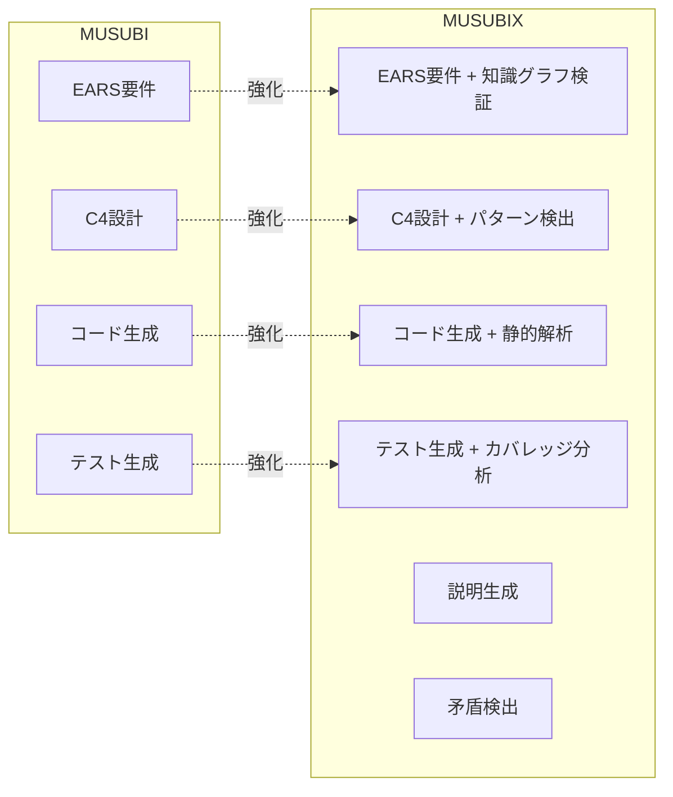
```mermaid
flowchart LR
    subgraph MUSUBI["MUSUBI"]
        M1[EARS要件]
        M2[C4設計]
        M3[コード生成]
        M4[テスト生成]
    end
    
    subgraph MUSUBIX["MUSUBIX"]
        X1[EARS要件 + 知識グラフ検証]
        X2[C4設計 + パターン検出]
        X3[コード生成 + 静的解析]
        X4[テスト生成 + カバレッジ分析]
        X5[説明生成]
        X6[矛盾検出]
    end
    
    M1 -.->|強化| X1
    M2 -.->|強化| X2
    M3 -.->|強化| X3
    M4 -.->|強化| X4
```

上図の通り、MUSUBIの4つの基本機能（要件・設計・コード・テスト）はすべてMUSUBIXで強化され、さらに2つの新機能（説明生成・矛盾検出）が追加されています。

| 強化ポイント | 説明 |
|-------------|------|
| **知識グラフ検証** | オントロジーに基づく要件の意味的検証 |
| **パターン検出** | 設計パターンの自動識別と推奨 |
| **静的解析** | コード品質・セキュリティの自動チェック |
| **カバレッジ分析** | テスト網羅性の可視化と改善提案 |
| **説明生成** | 推論過程の可視化と自然言語説明 |
| **矛盾検出** | 要件・設計間の論理的矛盾の自動検出 |

## 4.2 オントロジーとは？

MUSUBIXで重要な概念である**オントロジー**について解説します。

### 4.2.1 オントロジーの定義

**オントロジー**（Ontology）は、ある領域の概念とその関係性を形式的に定義した知識表現です。哲学の「存在論」から派生した用語で、AIでは「知識の構造化」を意味します。

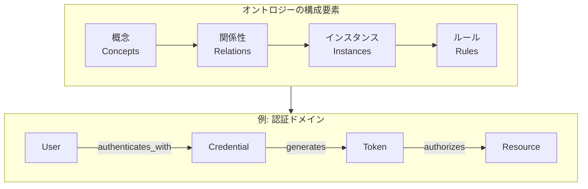
```mermaid
flowchart TB
    subgraph Ontology["オントロジーの構成要素"]
        Concepts[概念<br/>Concepts] --> Relations[関係性<br/>Relations]
        Relations --> Instances[インスタンス<br/>Instances]
        Instances --> Rules[ルール<br/>Rules]
    end
    
    subgraph Example["例: 認証ドメイン"]
        E1[User] -->|authenticates_with| E2[Credential]
        E2 -->|generates| E3[Token]
        E3 -->|authorizes| E4[Resource]
    end
    
    Ontology --> Example
```

### 4.2.2 なぜオントロジーが重要か？

| 観点 | 説明 |
|------|------|
| **共通語彙** | チーム・システム間で同じ用語を同じ意味で使用 |
| **推論可能性** | 明示されていない関係を論理的に導出 |
| **整合性検証** | 矛盾する定義を自動検出 |
| **再利用性** | 定義済み概念を他プロジェクトで活用 |

### 4.2.3 MUSUBIXでのオントロジー活用

MUSUBIXは以下のオントロジーを活用：

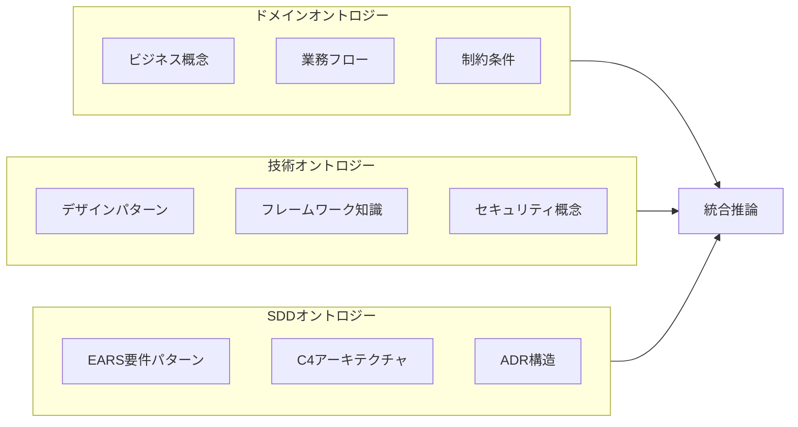
```mermaid
flowchart LR
    subgraph DomainOntology["ドメインオントロジー"]
        DO1[ビジネス概念]
        DO2[業務フロー]
        DO3[制約条件]
    end
    
    subgraph TechnicalOntology["技術オントロジー"]
        TO1[デザインパターン]
        TO2[フレームワーク知識]
        TO3[セキュリティ概念]
    end
    
    subgraph SDDOntology["SDDオントロジー"]
        SO1[EARS要件パターン]
        SO2[C4アーキテクチャ]
        SO3[ADR構造]
    end
    
    DomainOntology --> Integration[統合推論]
    TechnicalOntology --> Integration
    SDDOntology --> Integration
```

| オントロジー種別 | 内容 | 用途 |
|-----------------|------|------|
| **ドメインオントロジー** | ビジネス領域の概念定義 | 要件の意味解析 |
| **技術オントロジー** | 設計パターン、フレームワーク | 設計の自動提案 |
| **SDDオントロジー** | EARS、C4、ADRの形式知識 | 成果物の検証 |

### 4.2.4 60ドメイン対応（v1.0.19）

MUSUBIXは**60の専門ドメイン**に対応し、各ドメインに最適化されたコンポーネント推論を提供します。

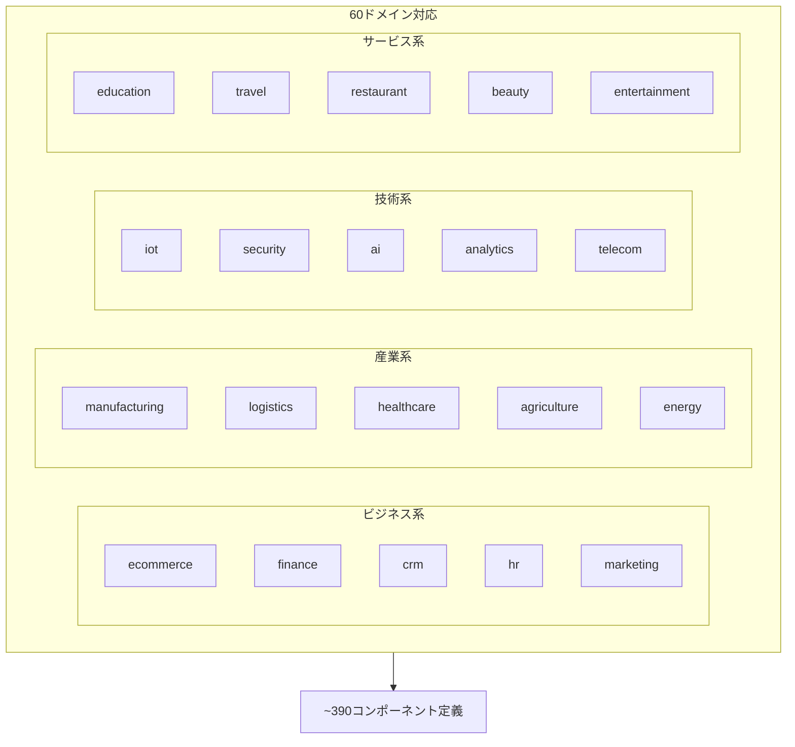
```mermaid
flowchart TB
    subgraph Domains["60ドメイン対応"]
        subgraph Business["ビジネス系"]
            B1[ecommerce]
            B2[finance]
            B3[crm]
            B4[hr]
            B5[marketing]
        end
        
        subgraph Industry["産業系"]
            I1[manufacturing]
            I2[logistics]
            I3[healthcare]
            I4[agriculture]
            I5[energy]
        end
        
        subgraph Tech["技術系"]
            T1[iot]
            T2[security]
            T3[ai]
            T4[analytics]
            T5[telecom]
        end
        
        subgraph Service["サービス系"]
            S1[education]
            S2[travel]
            S3[restaurant]
            S4[beauty]
            S5[entertainment]
        end
    end
    
    Domains --> Components["~390コンポーネント定義"]
```

| カテゴリ | ドメイン例 | コンポーネント例 |
|---------|-----------|-----------------|
| **ビジネス** | ecommerce, finance, crm | CartService, PaymentGateway, CustomerRepository |
| **産業** | manufacturing, logistics | ProductionLine, InventoryTracker, QualityControl |
| **ヘルスケア** | healthcare, pharmacy | PatientRecord, PrescriptionManager, DiagnosticService |
| **サービス** | restaurant, hotel, travel | ReservationService, MenuManager, BookingEngine |
| **技術** | iot, security, ai | DeviceManager, ThreatDetector, ModelInference |

**対応ドメイン一覧**（60ドメイン）:

<details>
<summary>クリックして全ドメインを表示</summary>

| # | ドメイン | 説明 |
|---|---------|------|
| 1 | general | 汎用 |
| 2 | ecommerce | EC・通販 |
| 3 | healthcare | ヘルスケア |
| 4 | finance | 金融 |
| 5 | education | 教育 |
| 6 | manufacturing | 製造 |
| 7 | logistics | 物流 |
| 8 | crm | 顧客管理 |
| 9 | hr | 人事 |
| 10 | iot | IoT |
| 11 | travel | 旅行 |
| 12 | restaurant | 飲食店 |
| 13 | realestate | 不動産 |
| 14 | insurance | 保険 |
| 15 | media | メディア |
| 16 | gaming | ゲーム |
| 17 | social | SNS |
| 18 | analytics | 分析 |
| 19 | booking | 予約 |
| 20 | inventory | 在庫管理 |
| 21 | auction | オークション |
| 22 | subscription | サブスク |
| 23 | marketplace | マーケットプレイス |
| 24 | delivery | 配送 |
| 25 | payment | 決済 |
| 26 | chat | チャット |
| 27 | document | 文書管理 |
| 28 | workflow | ワークフロー |
| 29 | notification | 通知 |
| 30 | search | 検索 |
| 31 | calendar | カレンダー |
| 32 | project | プロジェクト管理 |
| 33 | survey | アンケート |
| 34 | voting | 投票 |
| 35 | ticketing | チケット |
| 36 | hotel | ホテル |
| 37 | pharmacy | 薬局 |
| 38 | veterinary | 動物病院 |
| 39 | gym | フィットネス |
| 40 | library | 図書館 |
| 41 | museum | 美術館・博物館 |
| 42 | parking | 駐車場 |
| 43 | laundry | クリーニング |
| 44 | rental | レンタル |
| 45 | repair | 修理 |
| 46 | cleaning | 清掃 |
| 47 | catering | ケータリング |
| 48 | wedding | ブライダル |
| 49 | funeral | 葬儀 |
| 50 | agriculture | 農業 |
| 51 | energy | エネルギー |
| 52 | waste | 廃棄物 |
| 53 | recycling | リサイクル |
| 54 | warehouse | 倉庫 |
| 55 | vehicle | 車両管理 |
| 56 | sports | スポーツ |
| 57 | marketing | マーケティング |
| 58 | aviation | 航空 |
| 59 | shipping | 海運 |
| 60 | telecom | 通信 |

</details>

### 4.2.5 オントロジーマッピングの実例

```typescript
// MUSUBIXでのオントロジーマッピング例
const mapping = ontologyMapper.map({
  requirement: 'ユーザーがログインしたとき、システムは認証を行う',
  
  // 自動検出されるオントロジー概念
  concepts: {
    actor: 'User',
    action: 'login',
    system_behavior: 'authenticate',
    pattern: 'EARS_WHEN_THEN'
  },
  
  // 関連する技術概念
  technical_mappings: {
    patterns: ['Strategy', 'Factory'],
    security: ['OWASP A07:2021', 'RBAC'],
    frameworks: ['passport.js', 'bcrypt']
  }
});
```

## 4.3 新規追加モジュール（56モジュール）

MUSUBIXは以下の新規モジュールを追加：

| カテゴリ | モジュール | 説明 |
|----------|-----------|------|
| **統合** | NeuroSymbolicIntegrator | 統合制御 |
| | ConfidenceEvaluator | 信頼度評価 |
| | ContradictionDetector | 矛盾検出 |
| **要件** | EARSValidator | EARS検証 |
| | OntologyMapper | オントロジーマッピング |
| | RelatedRequirementsFinder | 関連要件検索 |
| | RequirementsDecomposer | 要件分解 |
| | InteractiveHearingManager | 対話的ヒアリング |
| **設計** | PatternDetector | パターン検出 |
| | SOLIDValidator | SOLID検証 |
| | C4ModelGenerator | C4モデル生成 |
| | ADRGenerator | ADR生成 |
| | DomainDetector | ドメイン自動検出（60ドメイン） |
| | ComponentInference | コンポーネント推論（~390定義） |
| **コード** | StaticAnalyzer | 静的解析 |
| | SecurityScanner | セキュリティスキャン |
| | QualityMetricsCalculator | 品質メトリクス |
| **説明** | ReasoningChainRecorder | 推論チェーン記録 |
| | ExplanationGenerator | 説明生成 |
| | VisualExplanationGenerator | 視覚的説明生成 |
| **学習** | FeedbackCollector | フィードバック収集 |
| | PatternExtractor | パターン抽出 |
| | AdaptiveReasoner | 適応的推論 |
| | PrivacyFilter | プライバシー保護フィルター |
| **ユーティリティ** | IdGenerator | ユニークID生成（カウンター方式） |
| | StatusWorkflow | ステータス遷移管理 |

### 4.3.1 新規ユーティリティ（v1.0.20）

v1.0.20では、10プロジェクト検証から学んだパターンを基に2つの新しいユーティリティを追加：

#### IdGenerator - ユニークID生成

```typescript
import { IdGenerator, idGenerators } from '@nahisaho/musubix-core';

// インスタンス利用（同一ミリ秒内でも重複なし）
const petIdGen = new IdGenerator('PET');
const id1 = petIdGen.generate(); // 'PET-1704326400000-1'
const id2 = petIdGen.generate(); // 'PET-1704326400000-2'

// 事前設定ジェネレーター
idGenerators.requirement.generate(); // 'REQ-...'
idGenerators.design.generate();      // 'DES-...'
idGenerators.task.generate();        // 'TSK-...'

// UUID v4生成
IdGenerator.uuid(); // 'xxxxxxxx-xxxx-4xxx-yxxx-xxxxxxxxxxxx'
```

#### StatusWorkflow - ステータス遷移管理

```typescript
import { taskWorkflow, approvalWorkflow, reservationWorkflow } from '@nahisaho/musubix-core';

// タスクワークフロー: pending → confirmed → in_progress → completed
let status = taskWorkflow.transition('pending', 'confirm');  // 'confirmed'
status = taskWorkflow.transition(status, 'start');           // 'in_progress'
status = taskWorkflow.transition(status, 'complete');        // 'completed'

// 承認ワークフロー: draft → pending → approved/rejected
approvalWorkflow.transition('draft', 'submit');   // 'pending'
approvalWorkflow.transition('pending', 'approve'); // 'approved'

// 予約ワークフロー: tentative → confirmed → active → completed
reservationWorkflow.transition('tentative', 'confirm'); // 'confirmed'
```

## 4.4 MCPサーバー（9ツール、3プロンプト）

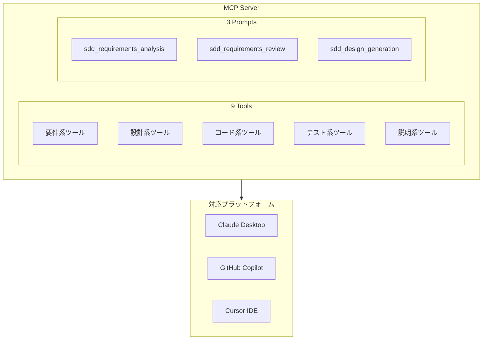
```mermaid
flowchart TB
    subgraph MCPServer["MCP Server"]
        subgraph Tools["9 Tools"]
            T1[要件系ツール]
            T2[設計系ツール]
            T3[コード系ツール]
            T4[テスト系ツール]
            T5[説明系ツール]
        end
        
        subgraph Prompts["3 Prompts"]
            P1[sdd_requirements_analysis]
            P2[sdd_requirements_review]
            P3[sdd_design_generation]
        end
    end
    
    subgraph Platforms["対応プラットフォーム"]
        Claude[Claude Desktop]
        Copilot[GitHub Copilot]
        Cursor[Cursor IDE]
    end
    
    MCPServer --> Platforms
```

## 4.5 自己学習システム（v1.0.12〜）

MUSUBIXは**自己学習システム**を搭載し、フィードバックに基づいて推論を継続的に改善します。

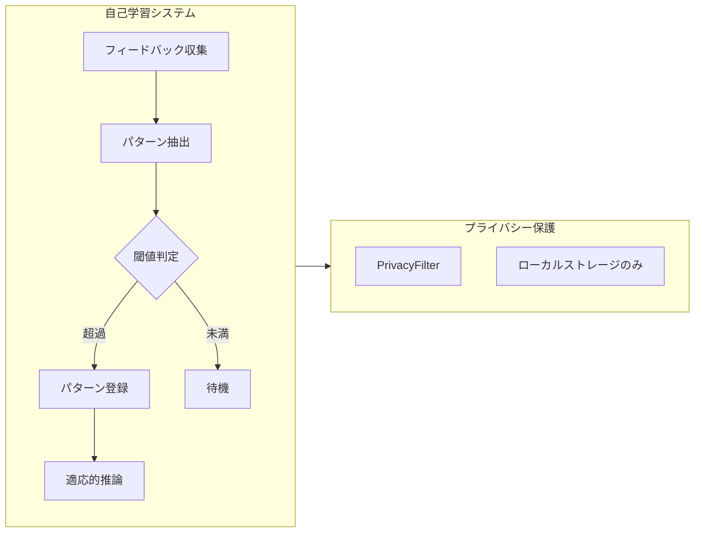
```mermaid
flowchart LR
    subgraph Learning["自己学習システム"]
        F[フィードバック収集] --> P[パターン抽出]
        P --> T{閾値判定}
        T -->|超過| R[パターン登録]
        T -->|未満| W[待機]
        R --> A[適応的推論]
    end
    
    subgraph Privacy["プライバシー保護"]
        PF[PrivacyFilter]
        LS[ローカルストレージのみ]
    end
    
    Learning --> Privacy
```

| 機能 | 説明 | CLIコマンド |
|------|------|------------|
| **状態確認** | 学習状態ダッシュボード表示 | `npx musubix learn status` |
| **フィードバック** | accept/reject/modifyの記録 | `npx musubix learn feedback <id>` |
| **パターン一覧** | 学習済みパターン表示 | `npx musubix learn patterns` |
| **パターン追加** | 手動パターン登録 | `npx musubix learn add-pattern <name>` |
| **推奨取得** | コンテキストベースの推奨 | `npx musubix learn recommend` |
| **データ移行** | エクスポート/インポート | `npx musubix learn export/import` |

**プライバシー保護**:
- すべての学習データはローカルストレージのみに保存
- 機密情報の自動フィルタリング
- 外部サーバーへのデータ送信なし

# 5. 9つの憲法条項

MUSUBIXは、MUSUBIから継承した **9つの憲法条項（Constitutional Articles）** を遵守します。これらは開発プロセス全体を統治する不変の原則であり、AIコーディングエージェントが従うべきガバナンスフレームワークです。

ニューロシンボリックAIへの進化により、各条項の実装がより強力になりました。LLMの創造性と知識グラフの厳密性を組み合わせることで、これらの原則を **自動的かつ一貫して** 適用できるようになっています。

| Article | 原則 | MUSUBIXでの実装 |
|---------|------|-----------------|
| I | **Specification First** | EARS検証 + オントロジーマッピング |
| II | **Design Before Code** | C4モデル + パターン検出 |
| III | **Single Source of Truth** | 知識グラフによる一元管理 |
| IV | **Traceability** | トレーサビリティマトリクス |
| V | **Incremental Progress** | 要件分解 + スプリント計画 |
| VI | **Decision Documentation** | ADR自動生成 |
| VII | **Quality Gates** | 信頼度評価 + 矛盾検出 |
| VIII | **User-Centric** | 対話的ヒアリング |
| IX | **Continuous Learning** | 知識グラフ更新 |

各条項は相互に関連し、開発ライフサイクル全体をカバーしています。MUSUBIXでは、これらの原則違反を知識グラフで自動検出し、開発者にフィードバックを提供します。

# 6. 実践例：要件定義の強化

## 6.1 MUSUBIでの要件定義

```markdown
# 従来のMUSUBI
WHEN ユーザーがログインフォームを送信する
THE システム SHALL 認証を実行する
AND THE システム SHALL セッションを作成する
```

## 6.2 MUSUBIXでの要件定義

```markdown
# MUSUBIXによる強化
WHEN ユーザーがログインフォームを送信する
THE システム SHALL 認証を実行する
AND THE システム SHALL セッションを作成する

# 知識グラフによる補完
- 関連要件: REQ-AUTH-001, REQ-SESSION-001
- 影響コンポーネント: AuthService, SessionManager
- セキュリティ考慮: OWASP A07:2021対応
- 推奨パターン: Strategy Pattern for Auth Providers
```

# 7. まとめ

## 7.1 ニューロシンボリックAIの価値

MUSUBIXが採用するニューロシンボリックAIは、従来のAIコーディング支援の限界を突破する価値を提供します。

LLM単体では、「幻覚（Hallucination）」や「確率的出力」といった問題が避けられません。しかし、知識グラフによるシンボリック推論を組み合わせることで、これらの問題を検出・防止できます。

以下の図は、4つの主要な価値と、それが開発にもたらす具体的な効果を示しています。

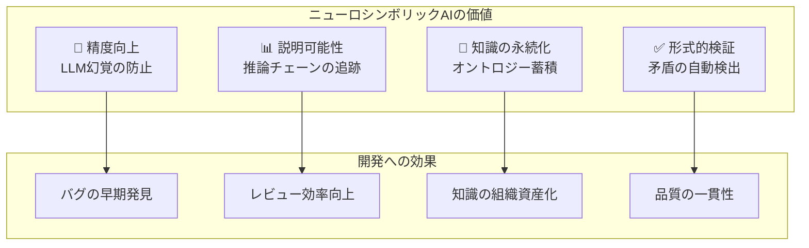
```mermaid
flowchart TB
    subgraph Value["ニューロシンボリックAIの価値"]
        V1[🎯 精度向上<br/>LLM幻覚の防止]
        V2[📊 説明可能性<br/>推論チェーンの追跡]
        V3[🔄 知識の永続化<br/>オントロジー蓄積]
        V4[✅ 形式的検証<br/>矛盾の自動検出]
    end
    
    subgraph Outcome["開発への効果"]
        O1[バグの早期発見]
        O2[レビュー効率向上]
        O3[知識の組織資産化]
        O4[品質の一貫性]
    end
    
    V1 --> O1
    V2 --> O2
    V3 --> O3
    V4 --> O4
```

| 価値 | 従来のLLMの問題 | MUSUBIXによる解決 |
|------|------------------|--------------------|
| **精度向上** | 誤ったコード生成 | 知識グラフで事前検証 |
| **説明可能性** | なぜAIがその出力をしたか不明 | 推論チェーンで完全追跡 |
| **知識永続化** | セッションごとに忘却 | オントロジーとして蓄積 |
| **形式的検証** | 論理矛盾を見逃す | シンボリック推論で自動検出 |

## 7.2 進化の要点

MUSUBIからMUSUBIXへの進化は、単なる機能追加ではなく、**パラダイムシフト**です。以下の4つの軸で進化が起こりました。

1. **確率的 → 確定的**: LLMの「毎回異なる結果」から、知識グラフによる「再現可能な結果」へ
2. **揮発的 → 永続的**: セッション限定の記憶から、オントロジーとしての永続的知識へ
3. **不透明 → 説明可能**: ブラックボックスAIから、推論チェーンが追跡可能なAIへ
4. **孤立知識 → オントロジー統合**: 断片的な情報から、構造化された知識体系へ

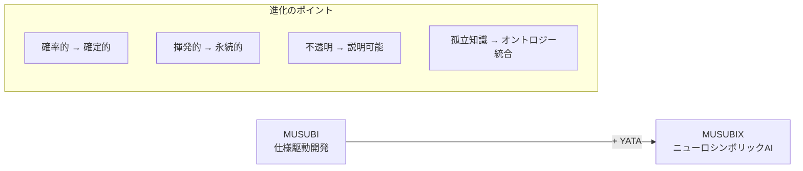
```mermaid
flowchart LR
    MUSUBI[MUSUBI<br/>仕様駆動開発] -->|+ YATA| MUSUBIX[MUSUBIX<br/>ニューロシンボリックAI]
    
    subgraph Evolution["進化のポイント"]
        E1[確率的 → 確定的]
        E2[揮発的 → 永続的]
        E3[不透明 → 説明可能]
        E4[孤立知識 → オントロジー統合]
    end
```

この進化により、MUSUBIXは単なる「AIコーディングツール」を超え、**知識駆動型の開発プラットフォーム**へと進化しました。

| 観点 | MUSUBI | MUSUBIX |
|------|--------|----------|
| **推論の信頼性** | LLMに依存 | 形式的検証で補完 |
| **知識の永続性** | セッション限定 | 知識グラフに蓄積 |
| **説明可能性** | 限定的 | 推論チェーンで完全追跡 |
| **開発効率** | 高い | さらに高い |
| **オントロジー** | なし | ドメイン・技術・SDDの3層オントロジー |

## 7.3 今後の展望

MUSUBIXは現在の機能に加え、さらなる進化を計画しています。ニューロシンボリックAIの可能性を最大限に引き出すため、以下の機能拡張を検討中です。

- **自動リファクタリング**: 知識グラフに蓄積されたパターンとベストプラクティスに基づき、コードの最適化を自動提案。技術的負債の検出と解消を支援します。
- **チーム知識共有（YATA Global / YATA Local）**: 組織横断的な知識グラフ統合により、チーム間でのノウハウ共有を実現。「車輪の再発明」を防ぎ、組織全体の開発効率を向上させます。

## YATA Global / YATA Local アーキテクチャ

チーム知識共有を実現するため、**2層の知識グラフアーキテクチャ**を計画しています。

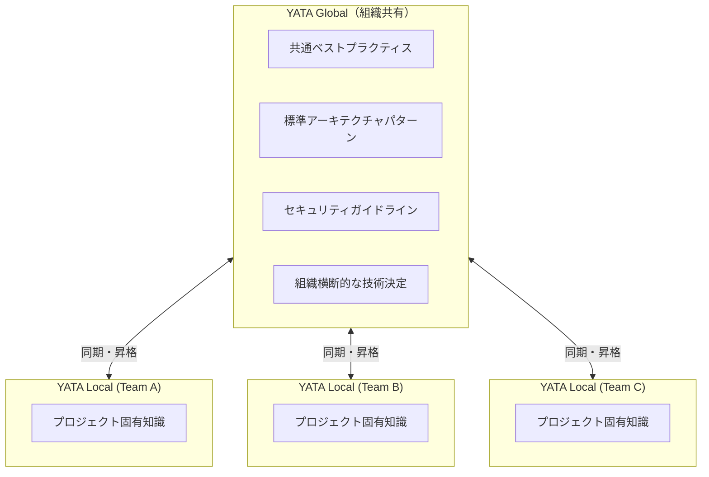
```mermaid
flowchart TB
    subgraph Global["YATA Global（組織共有）"]
        G1[共通ベストプラクティス]
        G2[標準アーキテクチャパターン]
        G3[セキュリティガイドライン]
        G4[組織横断的な技術決定]
    end
    
    Global <-->|同期・昇格| Local1
    Global <-->|同期・昇格| Local2
    Global <-->|同期・昇格| Local3
    
    subgraph Local1["YATA Local (Team A)"]
        L1A[プロジェクト固有知識]
    end
    
    subgraph Local2["YATA Local (Team B)"]
        L2A[プロジェクト固有知識]
    end
    
    subgraph Local3["YATA Local (Team C)"]
        L3A[プロジェクト固有知識]
    end
```

| レイヤー | 役割 | メリット |
|----------|------|----------|
| **YATA Global** | 組織共通知識の一元管理 | 標準化、重複排除、ガバナンス |
| **YATA Local** | チーム/プロジェクト固有知識 | 高速アクセス、プライバシー、カスタマイズ |

この2層アーキテクチャにより、以下を実現します。

1. **プライバシーとセキュリティ**: 機密性の高いプロジェクト知識はLocalに保持
2. **スケーラビリティ**: Localで高速処理、Globalで共有
3. **知識の昇格フロー**: Localで検証された知識をGlobalへ昇格
4. **オフライン対応**: Localがあれば接続なしでも動作

これらの機能は、MUSUBIXの核心である「知識の永続化」と「形式的検証」の強みを活かしたものであり、AIコーディング支援の次なるステージを切り開きます。

# 8. インストール方法

MUSUBIXはnpmで公開されており、簡単にインストールできます。

## 8.1 クイックスタート

```bash
# 統合パッケージ（推奨）
npm install musubix

# または npx で直接実行
npx musubix --help
npx musubix-mcp
```

## 8.2 パッケージ一覧

| パッケージ | インストールコマンド | 説明 |
|-----------|---------------------|------|
| **musubix** | `npm install musubix` | 統合パッケージ（全機能） |
| @nahisaho/musubix-core | `npm install @nahisaho/musubix-core` | コアライブラリ |
| @nahisaho/musubix-mcp-server | `npm install @nahisaho/musubix-mcp-server` | MCPサーバー |
| @nahisaho/musubix-yata-client | `npm install @nahisaho/musubix-yata-client` | YATAクライアント |

## 8.3 AI Platform連携

### Claude Code（CLI）

```bash
# MUSUBIX MCP サーバーを追加
claude mcp add musubix -- npx @nahisaho/musubix-mcp-server

# 設定確認
claude mcp list
```

または `.mcp.json` をプロジェクトルートに作成：

```json
{
  "mcpServers": {
    "musubix": {
      "command": "npx",
      "args": ["@nahisaho/musubix-mcp-server"]
    }
  }
}
```

### Claude Desktop / GitHub Copilot / Cursor IDE

`.vscode/mcp.json` を作成：

```json
{
  "mcpServers": {
    "musubix": {
      "command": "npx",
      "args": ["@nahisaho/musubix-mcp-server"]
    }
  }
}
```

詳細は [インストールガイド](https://github.com/nahisaho/MUSUBIX/blob/main/docs/INSTALL-GUIDE.ja.md) を参照してください。

# 参考リンク

- [MUSUBIX GitHub](https://github.com/nahisaho/MUSUBIX)
- [MUSUBIX npm](https://www.npmjs.com/package/musubix)
- [MUSUBI GitHub](https://github.com/nahisaho/MUSUBI)
- [YATA GitHub](https://github.com/nahisaho/YATA)

---

**著者**: nahisaho  
**公開日**: 2026-01-02  
**更新日**: 2026-01-04  
**バージョン**: v1.1.2
