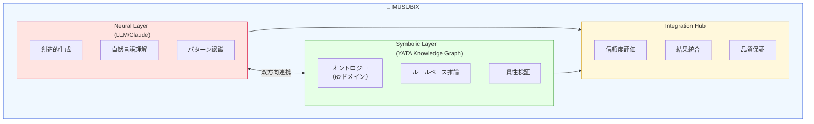
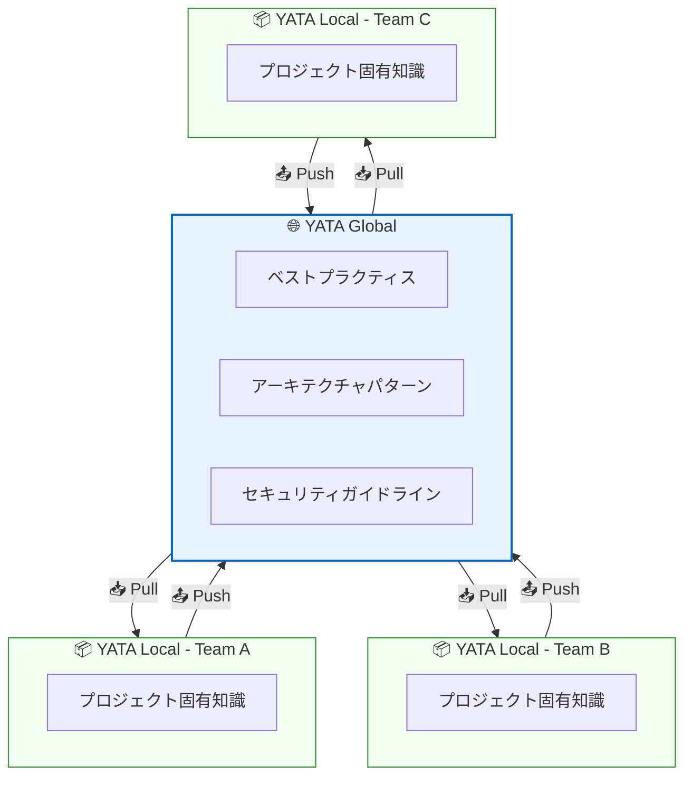
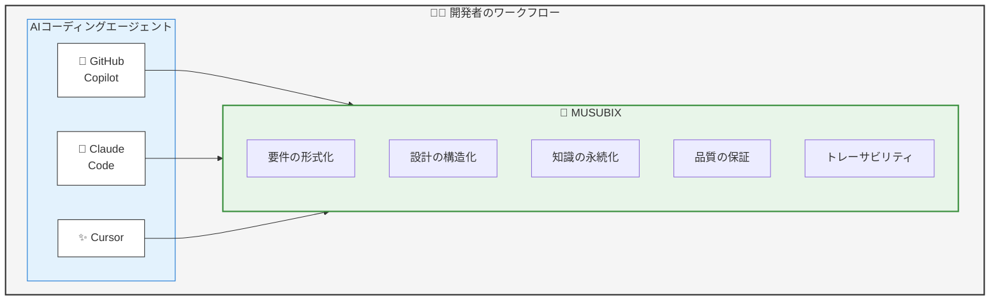
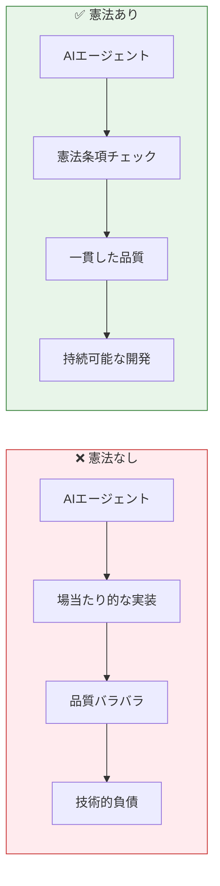

# MUSUBIXによるはじめてのSwarm Coding

> AI Coding時代に求められる「Vibe Coding」から「Swarm Coding」への進化

# はじめに

**「1人のAIより、チームで働くAI」** ── これが次世代のコーディング体験です。

2025年〜2026年、ソフトウェア開発の世界は大きな転換点を迎えています。GitHub Copilot、Claude Code、Cursor、Devinといった**AIコーディングエージェント**の登場により、コードを書くという行為そのものが変わりつつあります。

しかし、これらの強力なツールを「なんとなく」使っていませんか？

GitHub Copilot は優秀な「個人プレイヤー」ですが、**MUSUBIX** と **CodeGraph MCP Server** を組み合わせることで、**専門家チームとして協調するSwarm Coding** が実現します。

本記事では、AIコーディングの最新トレンドを整理し、**Vibe Coding（雰囲気でコーディング）** の限界と、それを超える **仕様駆動型開発（Spec-Driven Development, SDD）**、そしてSDDの「その先」を行く**Swarm Coding**と**MUSUBIX**について解説します。

:::note info
**Swarm Coding（スウォームコーディング）とは？**
複数のAIエージェントが連携してソフトウェア開発を行う手法です。人間がチームで開発するのと同じように、AIたちが役割分担し、協力しながら複雑なタスクを自律的に遂行します。

**主な特徴：**
- **マルチエージェントシステム**: 単一の巨大AIではなく、特定の役割（プランナー、コーダー、テスター、レビュアーなど）を持つ複数のAIエージェントで構成
- **自律的な連携**: 各エージェントは蜂の群れ（swarm）のように自律的に協調動作し、全体の目標達成に向けてタスクを処理
- **動的なタスク管理**: 問題発生時やより良い解決策が見つかった場合に、AI自身がタスクプランを動的に修正・再計画（リプランニング）
:::

:::note info
**MUSUBIXが提供する次世代機能**
- 🐝 **Swarm Coding** — 複数AIエージェントがチームとして協調開発
- 🧠 **Neuro-Symbolic AI** — LLMの創造性と知識グラフの厳密性を統合し、**AIの幻覚を検証・抑制**
- 📊 **CodeGraph MCP Server連携** — プロジェクト全体をグラフ構造で把握
- 🌐 **62ドメインのオントロジー** — 医療、金融、ECなど業界固有の知識を構造化して再利用
- 📚 **自己学習システム** — 成功パターンを学習し、プロジェクトを重ねるごとに賢くなる
- 🔗 **完全なトレーサビリティ** — 要件↔設計↔コード↔テストの100%追跡
- 🤝 **AIエージェント強化** — GitHub CopilotやClaude Codeを置き換えず、**より効果的に使うための基盤**
:::

「AIに任せたらバグだらけのコードができた」「なぜこの実装になったか誰も説明できない」——そんな経験はありませんか？本記事を読めば、AIコーディングの真の力を引き出す方法がわかります。

# この記事の対象読者

- プログラミング経験はあるが、AI Codingは初めての方
- GitHub CopilotやClaude Codeを使い始めたが、うまく活用できていない方
- プロダクトベースのアプリケーション開発でAIコーディングを導入したい方
- Vibe Cpdomg や SDD に興味がある方


# 1. 2025-2026年 AI Codingのトレンド

## 主要なAIコーディングツール

| ツール | 提供元 | 特徴 | リリース |
|--------|--------|------|----------|
| **GitHub Copilot** | GitHub/Microsoft | VS Code統合、Agent mode、Project Padawan | 2021〜 |
| **Cursor** | Cursor Inc. | AI専用IDE、Tab補完、Agent機能 | 2024〜 |
| **Devin** | Cognition | 完全自律型AIエンジニア | 2024〜 |
| **Claude Code** | Anthropic | ターミナルベース、コードベース全体を理解 | 2025〜 |
| **AWS Kiro** | AWS | Spec-Driven IDE、EARS記法対応 | 2025〜 |
| **Codex CLI** | OpenAI | ターミナルベース、ChatGPT連携、ローカル実行 | 2025〜 |
| **Gemini CLI** | Google | 1Mトークンコンテキスト、無料枠充実、MCP対応 | 2025〜 |
| **Antigravity** | Google | 完全自律型AIエディタ、マルチエージェント、ブラウザ自動操作 | 2025〜 |

## GitHub Copilotの進化

2025年2月、GitHub CEOのThomas Dohmkeは「**[The agent awakens](https://github.blog/news-insights/product-news/github-copilot-the-agent-awakens/)**」と題したブログで、Copilotの新機能を発表しました。

- **Agent Mode**: 自己修正機能を持つエージェント。エラーを認識し自動修正
- **Copilot Edits**: 複数ファイルの同時編集（GA）
- **Project Padawan**: 自律型SWEエージェント（開発中）

> "AI helps with the things you don't want to do, so you have more time for the things you do."
> — Thomas Dohmke, GitHub CEO

## Cursorの躍進

CursorはAI専用に設計されたIDEで、Y CombinatorのDiana Hu氏は「採用率が一桁台から80%超へ跳ね上がった」と述べています。

Andrej Karpathy氏（OpenAI共同創業者）も次のように評価：

> "優れたLLMアプリケーションには「自律性スライダー」があり、AIにどこまで主体的に動かせるかをあなたがコントロールできます。Cursorでは、Tab補完からフルオートノミーのエージェントまで切り替えられます。"

## Claude Codeの特徴

Anthropicの**Claude Code**は、ターミナルから直接コードベースを操作できるエージェントです。

```bash
# インストール
curl -fsSL https://claude.ai/install.sh | sh

# 実行
claude
```

**主な機能**:
- コードベース全体のマッピングと理解
- GitHub/GitLab連携でIssueからPRまで自動化
- 複数ファイルにまたがる強力な編集

## Codex CLIの特徴

OpenAIの**Codex CLI**は、ローカルで動作する軽量なコーディングエージェントです。55k+ stars。

```bash
# インストール
npm install -g @openai/codex
# または
brew install --cask codex

# 実行
codex
```

**主な機能**:
- ChatGPTプラン（Plus/Pro/Team/Enterprise）と連携
- ローカルマシンで安全に実行
- VS Code、Cursor、WindsurfなどのIDE拡張も提供
- Apache 2.0ライセンスのオープンソース

## Gemini CLIの特徴

Googleの**Gemini CLI**は、Geminiの力をターミナルに直接持ち込むオープンソースAIエージェントです。89k+ stars。

```bash
# インストール
npm install -g @google/gemini-cli
# または
brew install gemini-cli

# 実行
gemini
```

**主な機能**:
- **無料枠充実**: 60リクエスト/分、1,000リクエスト/日
- **1Mトークンコンテキスト**: Gemini 2.5 Proの大規模コンテキスト
- **組み込みツール**: Google Search、ファイル操作、シェルコマンド、Webフェッチ
- **MCP対応**: Model Context Protocolでカスタム拡張可能
- **GEMINI.md**: プロジェクトごとのカスタムコンテキストファイル
- Apache 2.0ライセンスのオープンソース

## Google Antigravityの特徴

Googleの**Antigravity**は、2025年11月に公開された完全自律型の開発プラットフォームです。人間が指示を出すだけで、AIが自律的にブラウザを操作し、環境構築から実装・テストまでを完結させます。

```bash
# 公式サイトからダウンロード
# https://antigravity.google/download
```

**主な機能**:
- **マルチエージェント**: 複数のAIが並行してタスクを処理（待ち時間ゼロ）
- **Antigravity Browser**: AIが自律的にブラウザを操作し、動作確認まで自動化
- **VS Codeベース**: 日本語化パック対応、既存の設定・拡張機能を引き継ぎ可能
- **3段階のAgent Mode**:
  - Agent-assisted（推奨）: 人間主導のバランス型
  - Agent-driven: AIが主導権を持つ上級者向け
  - Review-driven: 全アクションに人間の承認が必要
- **セキュリティ**: `.antigravityignore`で機密ファイルを保護、ターミナル実行ポリシー設定

**Cursor/Windsurfとの違い**:

| 比較項目 | Cursor/Windsurf | Antigravity |
|----------|-----------------|-------------|
| 立ち位置 | コード作成を効率化 | タスクをAIに委託 |
| 品質確認 | 人間がコードをレビュー | AIが自律テスト＋人間が承認 |
| ブラウザ操作 | 人間が確認 | AIが自動で操作・確認 |
| ターミナル | コマンド提案 | AIが自律的に実行 |

# 2. Vibe Coding とは何か？

## 定義

**Vibe Coding（バイブコーディング）** は、2025年2月にAndrej Karpathy氏が提唱した用語です。

> "There's a new kind of coding I call 'vibe coding', where you fully give in to the vibes, embrace exponentials, and forget that the code even exists."
> — Andrej Karpathy (@karpathy)

**特徴**:
- 自然言語でAIに指示を出す
- 生成されたコードをレビューせずに受け入れる（"Accept All"）
- エラーが出たらコピペして修正を依頼
- コードの詳細を理解しないまま進める

## 驚くべき採用率

Y Combinatorの2025年冬バッチでは、**25%のスタートアップがコードベースの95%以上をAI生成**していると報告されました。

## 「Word of the Year 2025」に選出

Collins English Dictionaryは「vibe coding」を**2025年の言葉**に選出。それほど社会的インパクトのある概念となりました。

# 3. Vibe Codingの問題点

しかし、Vibe Codingには深刻な問題があります。

## 🔴 セキュリティリスク

2025年5月、Vibe Codingアプリ「Lovable」で生成されたWebアプリのうち、**170件に個人情報が漏洩するセキュリティ脆弱性**が発見されました。

## 🔴 デバッグの困難さ

開発者がコードを書いていないため、バグの原因を理解できない問題が発生します。

Simon Willison氏（Djangoコアコントリビューター）の指摘：

> "Vibe codingでプロダクションコードベースを作るのは明らかにリスキーです。ソフトウェアエンジニアとしての仕事の大部分は、既存システムの進化に関わるものであり、コードの品質と理解可能性が重要です。"

## 🔴 複雑なタスクへの対応

簡単なアルゴリズムは得意でも、**複数ファイル、ドキュメント不足のライブラリ、安全性重視のコード**には苦戦します。

## 🔴 「Vibe Coding二日酔い」

2025年9月、Fast Companyは「The vibe coding hangover is upon us」と報道。シニアエンジニアがAI生成コードとの格闘で「開発地獄」に陥るケースが増加しています。

# 4. Spec-Driven Development（SDD）という解決策

## SDDとは

**Spec-Driven Development（仕様駆動型開発）** は、コードではなく**仕様（Specification）を中心**に開発を進めるアプローチです。

| Vibe Coding | Spec-Driven Development |
|-------------|-------------------------|
| 「なんとなく」指示 | 形式化された要件定義 |
| コードレビューなし | 仕様→設計→コードの追跡可能性 |
| 動けばOK | 品質ゲートによる検証 |
| 個人のプロトタイプ向け | エンタープライズ開発向け |

## GitHub Spec Kit

GitHubが公開した**Spec Kit**は、SDDのためのオープンソースツールキットです（59.6k stars）。

```bash
# インストール
uv tool install specify-cli --from git+https://github.com/github/spec-kit.git

# プロジェクト初期化
specify init my-project --ai claude
```

**ワークフロー**:
1. `/speckit.constitution` - プロジェクトの憲法を定義
2. `/speckit.specify` - 何を作るかを定義
3. `/speckit.plan` - 技術的な実装計画
4. `/speckit.tasks` - タスクに分解
5. `/speckit.implement` - 実装

## AWS Kiro

AWSが提供する**Kiro**は、SDDを組み込んだIDEです。

> "Go from vibe coding to viable code"
> — Kiro公式サイト

**特徴**:
- 自然言語プロンプト → **EARS記法**での要件化
- ベストプラクティスに基づくアーキテクチャ設計
- 要件にマッピングされたタスク分解
- Agent Hooksによる自動化

```
プロンプト → 要件（EARS） → 設計 → タスク → 実装
```

# 5. EARS記法 - 要件を形式化する

SDDで重要なのが**EARS（Easy Approach to Requirements Syntax）** 記法です。

## 5つのEARSパターン

| パターン | 構文 | 用途 |
|---------|------|------|
| **Ubiquitous** | `THE [system] SHALL [requirement]` | 常に満たすべき要件 |
| **Event-driven** | `WHEN [event], THE [system] SHALL [response]` | イベント発生時の要件 |
| **State-driven** | `WHILE [state], THE [system] SHALL [response]` | 特定状態での要件 |
| **Unwanted** | `THE [system] SHALL NOT [behavior]` | 禁止事項 |
| **Optional** | `IF [condition], THEN THE [system] SHALL [response]` | 条件付き要件 |

## 例：ログイン機能

**❌ 曖昧な要件**:
```
ユーザーがログインできるようにする
```

**✅ EARS形式**:
```
WHEN a user submits valid credentials,
THE authentication system SHALL generate a JWT token
AND redirect the user to the dashboard within 2 seconds.

THE authentication system SHALL NOT store plain-text passwords.

IF the user fails authentication 5 times,
THEN THE system SHALL lock the account for 30 minutes.
```

# 6. GitHub Spec KitとAWS Kiroの限界

GitHub Spec KitとAWS Kiroは素晴らしいツールですが、限界もあります。

## 限界1: 知識の永続化

生成されたコードや決定の「なぜ」が失われがちです。プロジェクトメモリの仕組みが弱い。

## 限界2: オントロジーの欠如

ドメイン知識を構造化・再利用する仕組みがありません。毎回ゼロから説明が必要。

## 限界3: LLMの幻覚（Hallucination）

LLMが自信満々に間違った回答を返す問題に対処する仕組みがない。

## 限界4: 学習機能の欠如

成功パターンを学習し、次のプロジェクトに活かす仕組みがない。


# 7. MUSUBIからMUSUBIXへ - Swarm Codingの実現

これらの限界を克服するために開発されたのが**MUSUBI**と、その進化版**MUSUBIX**です。

## MUSUBIとは

**MUSUBI（Method for Unified Specification-Based Implementation）** は、SDDを実践するためのフレームワークです。

> 💡 MUSUBIという名前には、日本語の「**結び（むすび）**」の意味も込められています。「結び」は古来より、物事を繋ぎ合わせ、新しいものを生み出す力を表す言葉です。要件・設計・コード・テストを「結び」つけ、高品質なソフトウェアを生み出すというコンセプトを体現しています。

🔗 **GitHub**: https://github.com/nahisaho/MUSUBI

- 9つの憲法条項による品質統治
- EARS形式の要件分析
- C4モデルによる設計
- 完全なトレーサビリティ
- **プロジェクトメモリ**（steering/による決定記録）
- **CodeGraph MCP Server連携**でプロジェクト全体のコードを俯瞰

MUSUBIは、AIエージェントを「優秀な新人エンジニア」として扱い、明確な指示書（仕様書）を与えることで、一貫性のある高品質なコードを生成することを目指しています。

## MUSUBIXへの進化

**MUSUBIX（MUSUBI Transformation）** は、MUSUBIでの複数の開発経験をもとに、MUSUBIに何が足りないのかを分析し、機能強化したものです。

> 💡 「X」は **Transformation（変革）** を意味し、単なる機能拡張ではなく、YATA知識グラフ統合によるNeuro-Symbolic AIへの**アーキテクチャの根本的な変革**を表現しています。

具体的には、MUSUBIに**YATA（Yet Another Thinking Architecture）** 知識グラフを統合し、**Neuro-Symbolic AI**と**Swarm Coding**を実現しました。

### MUSUBIからの主な進化ポイント

| 課題 | MUSUBI | MUSUBIX |
|------|--------|---------|
| 知識の永続化 | プロジェクトメモリ（steering/） | プロジェクトメモリ + YATAによる永続的な知識グラフ |
| コード俯瞰 | CodeGraph MCP Server連携 | CodeGraph + YATA統合 |
| 推論の一貫性 | LLMのみ（不安定） | Neuro-Symbolic（LLM+シンボリック） |
| マルチエージェント | 7エージェント、27スキル | 2エージェント、12スキル + 9オーケストレーションパターン |
| 学習・適応 | なし | 自己学習システム（フィードバック収集） |
| ドメイン知識 | 都度再学習 | 62ドメイン、47フレームワーク対応 |

> 💡 MUSUBIは**7つのAIエージェント**（Claude Code, GitHub Copilot, Cursor, Gemini CLI, Codex CLI, Qwen Code, Windsurf）に対応し、**27スキル**を提供する汎用SDDフレームワークです。MUSUBIXは**2エージェント**（GitHub Copilot + Claude Code）に特化し、**12のAgent Skills**と**9つのオーケストレーションパターン**で複数エージェントが**協調して動的に作業を分担**する「Swarm Coding」を実現しました。

### なぜスキル数を27から12に絞ったのか？

MUSUBIXがスキル数を減らしたのは「劣化」ではなく、**アーキテクチャの根本的な変革**によるものです。

| 観点 | MUSUBI（27スキル） | MUSUBIX（12スキル） |
|------|-------------------|-------------------|
| **設計思想** | 汎用的なスキルを網羅 | SDDコアワークフローに特化 |
| **知識補完** | スキル内にドメイン知識を埋め込み | YATAの知識グラフで動的に補完 |
| **協調方法** | 個別スキルを順次呼び出し | オーケストレーションで動的に協調 |
| **拡張性** | スキル追加が必要 | YATAに知識を追加するだけ |

**具体例**: MUSUBIでは`database-schema-designer`、`api-designer`、`ui-ux-designer`が別々のスキルですが、MUSUBIXでは`sdd-design`がYATAから47フレームワークの知識を動的に取得して対応します。

```
MUSUBI:  [スキルA] → [スキルB] → [スキルC] （静的な順次実行）
MUSUBIX: [sdd-design] ← YATA(47フレームワーク) + オーケストレーション（動的協調）
```

## 従来のAIコーディング vs Swarm Coding

従来のAIコーディングは「1人の万能AI」に頼るアプローチでした。しかし、複雑なプロジェクトでは限界があります。Swarm Codingは、人間のチーム開発と同じように、**専門性を持った複数のAIエージェントが協調**して作業を進めます。

| 従来 | Swarm Coding (MUSUBIX) |
|------|----------------------|
| 1つのAIに全部任せる | 専門家チームが協調 |
| コンテキストが不足 | CodeGraphで全体像を把握 |
| 一発勝負 | Handoff/Triage で適切にルーティング |
| 品質は運次第 | 9つの憲法条項でガバナンス |
| トレーサビリティなし | REQ → Design → Code → Test 完全追跡 |

## 9つのオーケストレーションパターン

MUSUBIXは、タスクの性質や状況に応じて**9つの協調パターン**を使い分けます。

| # | パターン | 説明 | ユースケース |
|---|----------|------|-------------|
| 1 | **Sequential** | 順次実行 | 仕様→設計→実装→テスト |
| 2 | **Parallel** | 並列実行 | フロント/バック同時開発 |
| 3 | **Swarm** | 群知能協調 | 全員で問題解決 |
| 4 | **Handoff** | 委譲 | 専門家にバトンタッチ |
| 5 | **Triage** | 振り分け | 適切なエージェントへルーティング |
| 6 | **Human-in-Loop** | 人間承認 | 重要決定は人間が判断 |
| 7 | **Nested** | 入れ子 | 複雑なワークフロー |
| 8 | **Group Chat** | グループチャット | 複数エージェント議論 |
| 9 | **Auto** | 自動選択 | 状況に応じて最適パターン |

## Neuro-Symbolic AIアーキテクチャ

**Neuro-Symbolic AI（ニューロシンボリックAI）** は、ディープラーニング（Neural）と記号推論（Symbolic）を統合した次世代AIアーキテクチャです。

| アプローチ | 得意なこと | 苦手なこと |
|-----------|-----------|-----------|
| **Neural（LLM）** | 創造的生成、パターン認識、曖昧な入力処理 | 論理的一貫性、説明可能性、幻覚の抑制 |
| **Symbolic（知識グラフ）** | 論理推論、一貫性検証、説明可能性 | 柔軟性、未知のパターン処理 |
| **Neuro-Symbolic（統合）** | 両方の長所を活かし、短所を補完 | - |

MUSUBIXでは、**LLM（Claude/GPT）の創造性**と**YATA知識グラフの厳密性**を統合することで、「自信満々に間違える」LLMの幻覚問題を解決しています。



## Neuro-Symbolic統合の信頼度評価

MUSUBIXでは、NeuralレイヤーとSymbolicレイヤーの出力を**Integration Hub**で統合し、最終的な結果を決定します。この統合プロセスでは、**シンボリック推論による検証結果**と**ニューラルネットワークの信頼度スコア**を組み合わせて、最適な出力を選択します。

| シンボリック結果 | ニューラル信頼度 | 最終決定 |
|-----------------|-----------------|---------|
| invalid | - | ニューラル結果を**棄却** |
| valid | ≥0.8 | ニューラル結果を**採用** |
| valid | <0.8 | シンボリック結果を**優先** |

**なぜこのルールなのか？**
- **シンボリックがinvalid**: 知識グラフのルールに違反している場合、LLMがどれだけ自信を持っていても棄却します。これが「幻覚抑制」の核心です。
- **信頼度≥0.8**: LLMが高い確信を持ち、かつシンボリック検証もパスした場合は、LLMの創造的な提案を採用します。
- **信頼度<0.8**: LLMが不確かな場合は、より厳密なシンボリック推論の結果を優先します。

これにより、**LLMの幻覚を知識グラフで検証・抑制**できます。


## YATA（八咫）- 知識グラフMCPサーバー

**YATA（Yet Another Thinking Architecture / 八咫）** は、MUSUBIXのSymbolic Layerを担う知識グラフMCPサーバーです。ソースコードを解析し、知識グラフを構築することで、AIツールに正確なコンテキストを提供します。

> 💡 YATAという名前には、日本神話の「**八咫鏡（やたのかがみ）**」の意味も込められています。八咫鏡は三種の神器の一つで、「真実を映し出す鏡」として知られています。YATAは、コードベースの真実の姿を知識グラフとして映し出し、AIに正確なコンテキストを提供するという役割を象徴しています。

### YATAの特徴

| 機能 | 説明 |
|------|------|
| 🔍 **コード解析** | Tree-sitterによる高速AST解析（**24言語対応**） |
| 🕸️ **知識グラフ** | NetworkXによるエンティティ・関係性グラフ |
| 🔗 **関係性検出** | CALLS/IMPORTS/INHERITS/CONTAINS関係の自動検出 |
| 🤖 **MCP準拠** | **34 MCPツール、3プロンプト、1リソース** |
| 📚 **フレームワーク知識** | **47フレームワーク**の組み込み知識（457K+エンティティ） |
| 🔎 **ハイブリッド検索** | ローカルコード＋フレームワーク横断検索 |
| 🎯 **パターン検出** | 10種類のデザインパターン自動検出 |
| 🔒 **プライバシー** | 完全ローカル実行（データ外部送信なし） |

### YATAの34 MCPツール

```
基本ツール (10)
├── parse_file, parse_directory  - ソースコード解析
├── search_entities              - エンティティ検索
├── get_entity, get_related_entities
├── save_graph, load_graph       - グラフ永続化
└── list_supported_languages

フレームワーク知識グラフ (7)
├── list_frameworks              - 47フレームワーク一覧
├── search_framework_docs        - フレームワーク内検索
├── search_all_frameworks        - 横断検索
└── find_code_patterns           - 共通パターン検索

検索・コンテキスト (4)
├── semantic_search              - セマンティック検索
├── find_by_pattern              - パターンマッチング
├── get_code_context             - 包括的コンテキスト
└── find_usage_examples          - 使用例検索

AIコーディング支援 (5)
├── get_coding_guidance          - ガイダンス生成
├── detect_patterns              - デザインパターン検出
├── navigate_code                - コードナビゲーション
└── get_call_graph               - 呼び出しグラフ
```

### YATAの対応フレームワーク（47種）

**Python**: Django, Flask, FastAPI, Pytest, NumPy, Pandas, SQLAlchemy, LangChain, Haystack, Streamlit, LangGraph

**JavaScript/TypeScript**: React, Vue.js, Angular, Next.js, Express, NestJS, Jest, Astro, SolidJS, Remix, htmx, Hono, tRPC, Qwik, Bun, Expo

**Rust**: Actix-web, Tokio, Serde, Rocket, Axum, Tauri

**Go**: Gin, Echo, Fiber, GORM

**その他**: Phoenix (Elixir), Prisma, Drizzle, SwiftUI, Jetpack Compose, Spring Boot, .NET Core, Ruby on Rails, Laravel

### YATAのセットアップ

```bash
# YATAをクローン
git clone https://github.com/nahisaho/YATA.git
cd YATA

# uvで依存関係をインストール
uv sync --all-packages

# MCPサーバーを起動
uv run yata serve
```

**VS Code MCP設定** (`.vscode/mcp.json`):
```json
{
  "mcpServers": {
    "yata": {
      "command": "uv",
      "args": ["run", "yata", "serve"],
      "cwd": "/path/to/YATA"
    }
  }
}
```


## YATA-LG - 2層知識グラフアーキテクチャ

**YATA-LG（YATA Local/Global Knowledge Graph System）** は、YATAを拡張した2層知識グラフアーキテクチャです。チーム・組織横断的な知識共有と、プロジェクト固有の高速知識アクセスを両立します。

🔗 **GitHub**: https://github.com/nahisaho/YATA-LG



### YATA LocalとYATA Globalの違い

| 機能 | YATA Local | YATA Global |
|------|------------|-------------|
| **スコープ** | プロジェクト/チーム専用 | 組織全体で共有 |
| **永続化** | SQLite（ローカル） | PostgreSQL（サーバー） |
| **ネットワーク** | オフライン対応 | REST API経由 |
| **プライバシー** | 機密コードを外部送信しない | マルチテナント分離 |
| **知識** | プロジェクト固有の学習 | 47フレームワーク、457K+エンティティ |

### 同期・昇格フロー

- **📥 Pull**: Global → Local への知識継承（ベストプラクティスの取得）
- **📤 Push**: Local → Global への知識昇格（成功パターンの共有）
- **⚖️ 競合解決**: CRDTベースの分散同期

### YATA-LGのセットアップ

```bash
# pip でインストール
pip install yata-local

# MCP Server として起動
yata-local --transport stdio
```

**Docker で起動**:
```bash
# リポジトリをクローン
git clone https://github.com/nahisaho/YATA-LG.git
cd YATA-LG

# Docker Compose で起動
docker compose -f docker/docker-compose.yml up -d

# ヘルスチェック
curl http://localhost:8000/health
```

### YATA vs YATA-LG の使い分け

| ユースケース | 推奨 |
|-------------|------|
| 個人開発・小規模プロジェクト | YATA |
| チーム開発・知識共有が必要 | YATA-LG |
| オフライン環境 | YATA または YATA Local |
| 組織横断のベストプラクティス管理 | YATA-LG（Local + Global） |

> 💡 **将来の統合予定**: YATAとYATA Globalは将来的に統合される予定です。YATAが持つ**47フレームワーク、457K+エンティティの知識**がYATA Globalに統合され、組織全体で共有可能になります。統合後はYATA-LGをインストールするだけでよくなる予定です。


# 8. CodeGraph MCP Server - Swarm Codingの基盤

**CodeGraph MCP Server** は、ソースコードをグラフ構造として解析し、MCP（Model Context Protocol）経由でAIエージェントに提供するサーバーです。**GraphRAG（Graph Retrieval-Augmented Generation）** 機能を備え、**MUSUBIXから直接利用可能**です。

🔗 **GitHub**: https://github.com/nahisaho/CodeGraphMCPServer

## なぜCodeGraphが必要なのか？

従来のAIコーディングアシスタントは「ファイル単位」でしかコードを理解できません。CodeGraphはプロジェクト全体を**グラフ構造**として把握し、以下を可能にします。

| 課題 | 従来のAI | CodeGraph連携 |
|------|----------|---------------|
| 関数の呼び出し元 | grep検索、見落としあり | `find_callers` で完全リスト |
| 依存関係 | import文を目視 | `find_dependencies` で深い依存も検出 |
| 変更の影響範囲 | 「たぶん大丈夫」 | 影響分析で波及範囲を完全把握 |
| コード構造理解 | ファイルを1つずつ | `global_search` + `community` で即座に全体像 |

## CodeGraphの特徴

| 機能 | 説明 |
|------|------|
| 🚀 **ゼロ設定** | 外部DB不要、`pip install && serve`で即座に開始 |
| 🌳 **AST解析** | Tree-sitterによる高速・高精度なコード解析 |
| 🔗 **グラフ構築** | コードエンティティ間の関係性をグラフ化 |
| 🧠 **GraphRAG** | コミュニティ検出とLLM統合によるグローバル/ローカル検索 |
| ⚡ **高速インデックス** | 100K行を30秒以下、インクリメンタル更新は2秒以下 |

## CodeGraphが提供するMCPインターフェース

| 種類 | 数 | 主な機能 |
|------|-----|----------|
| **MCPツール** | 14 | 依存関係分析、呼び出し追跡、コード検索、リファクタリング提案 |
| **MCPリソース** | 4 | エンティティ詳細、ファイル情報、コミュニティ情報、統計 |
| **MCPプロンプト** | 6 | コードレビュー、機能実装ガイド、デバッグ支援、テスト生成 |

### 14のMCPツール

```
グラフクエリ (6)
├── query_codebase           - 自然言語でコード検索
├── find_dependencies        - 依存関係分析
├── find_callers             - 呼び出し元追跡
├── find_callees             - 呼び出し先追跡
├── find_implementations     - インターフェース実装検索
└── analyze_module_structure - モジュール構造分析

コード取得 (3)
├── get_code_snippet         - ソースコード取得
├── read_file_content        - ファイル内容取得
└── get_file_structure       - ファイル構造概要

GraphRAG (2)
├── global_search            - コミュニティ横断検索
└── local_search             - エンティティ近傍検索

管理 (3)
├── suggest_refactoring      - リファクタリング提案
├── reindex_repository       - リポジトリ再インデックス
└── execute_shell_command    - シェルコマンド実行
```

## 対応言語（16言語）

Python, TypeScript, JavaScript, Rust, Go, Java, PHP, C#, C, C++, HCL（Terraform）, Ruby, Kotlin, Swift, Scala, Lua

## CodeGraph MCP Serverのセットアップ

```bash
# pip でインストール
pip install codegraph-mcp-server

# リポジトリをインデックス
codegraph-mcp index /path/to/repository --full

# MCPサーバーとして起動
codegraph-mcp serve --repo /path/to/repository
```

**VS Code MCP設定** (`.vscode/settings.json`):
```json
{
  "mcp.servers": {
    "codegraph": {
      "command": "codegraph-mcp",
      "args": ["serve", "--repo", "${workspaceFolder}"]
    }
  }
}
```

**自然言語でインデックス操作**:

GitHub Copilotに話しかけるだけ：
- 「CodeGraph MCP Index を作成」
- 「CodeGraph MCP Index を更新」
- 「コードグラフを再構築して」


# 9. 重要：MUSUBIXはAIコーディングエージェントを置き換えない

:::note info
**MUSUBIXは、GitHub CopilotやClaude Codeを置き換えるものではありません。それらを強化するものです。**
:::

## 補完関係



## なぜ置き換えではなく強化なのか

AIコーディングエージェント（GitHub Copilot、Claude Code、Cursorなど）とMUSUBIXは、**異なる強みを持つ補完的なツール**です。AIエージェントは「コードを素早く生成する」ことに優れていますが、「なぜそのコードを書くのか」「このコードは要件を満たしているか」という**上流の品質管理**は苦手です。

MUSUBIXはこのギャップを埋めます。AIエージェントが生成したコードに対して、要件との整合性を検証し、設計パターンへの準拠を確認し、変更の影響範囲を追跡します。つまり、**AIエージェントを「より賢く」使うための基盤**を提供します。

| AIコーディングエージェント | MUSUBIX |
|---------------------------|---------|
| コード生成が得意 | 仕様・設計の構造化が得意 |
| 瞬時の補完・編集 | 長期的な知識の蓄積 |
| 創造的なソリューション | 一貫性と品質の保証 |
| 個別タスクの自動化 | プロジェクト全体の統治 |

**MUSUBIXを使うことで**:
- GitHub Copilotの提案が**仕様に準拠**しているか検証できる
- Claude Codeの生成コードに**トレーサビリティ**を付与できる
- Cursorの編集が**設計パターン**に従っているか確認できる

## 共存のベストプラクティス

```bash
# 1. MUSUBIXで要件を定義
npx musubix requirements analyze feature.md

# 2. MUSUBIXで設計を生成
npx musubix design generate requirements.md

# 3. AIエージェントでコード生成（GitHub Copilot / Claude Code）
# → MUSUBIXが生成した設計ドキュメントをコンテキストとして使用

# 4. MUSUBIXでトレーサビリティ検証
npx musubix trace validate
```

# 10. MUSUBIXの主要機能

## インストール

### グローバルインストール

システム全体で`musubix`コマンドを使用できるようにします。複数のプロジェクトでMUSUBIXを使用する場合に便利です。

```bash
# グローバルインストール
npm install -g musubix

# どのディレクトリからでも実行可能
musubix init my-project
musubix requirements analyze feature.md
```

### ローカルインストール（推奨）

プロジェクトごとにMUSUBIXをインストールします。チーム開発では、全員が同じバージョンを使用できるため**こちらを推奨**します。

```bash
# プロジェクトディレクトリで実行
cd my-project
npm install --save-dev musubix

# npx経由で実行
npx musubix init .
npx musubix requirements analyze feature.md
```

### グローバル vs ローカルの違い

| 項目 | グローバル | ローカル（推奨） |
|------|----------|-----------------|
| **インストール先** | システム全体 | プロジェクトの`node_modules/` |
| **バージョン管理** | 手動で更新 | `package.json`で管理 |
| **チーム共有** | 各自がインストール必要 | `npm install`で自動インストール |
| **CI/CD** | 別途インストール必要 | `package.json`から自動 |
| **実行方法** | `musubix ...` | `npx musubix ...` |

### どちらを選ぶべきか？

| ユースケース | 推奨 | 理由 |
|-------------|------|------|
| **チーム開発** | ローカル | 全員が同じバージョンを使用、CI/CDでも自動インストール |
| **個人プロジェクト（複数）** | グローバル | 毎回インストール不要、すぐに使い始められる |
| **個人プロジェクト（1つ）** | ローカル | プロジェクトと一緒にバージョン管理できる |
| **お試し・学習目的** | グローバル | 手軽に試せる、`npx musubix`でも可 |
| **プロダクション環境** | ローカル | 再現性が高く、依存関係が明確 |

:::note info
**迷ったらローカルインストール**を選んでください。チーム開発やCI/CDでの再現性が高く、トラブルが少ないです。
:::

### プロジェクト初期化

```bash
# 新規プロジェクト初期化
npx musubix init my-project

# 既存プロジェクトに追加
cd existing-project
npx musubix init . --force
```

インストール時に自動生成されるファイル・ディレクトリ：

| ファイル/ディレクトリ | 配置先 | 用途 |
|---------------------|--------|------|
| `.github/` | プロジェクトルート | GitHub Copilot用ディレクトリ |
| `AGENTS.md` | `.github/` | GitHub Copilot Agent用指示ファイル |
| `.claude/` | プロジェクトルート | Claude Code用ディレクトリ |
| `CLAUDE.md` | `.claude/` | Claude Code用指示ファイル |
| `steering/` | プロジェクトルート | プロジェクトメモリ（決定記録） |

## CLIコマンド

:::note info
**実際にCLIを直接実行することはほとんどありません。**

MUSUBIXはGitHub CopilotやClaude Codeと連携しているため、**自然言語で命令するだけ**で内部的にこれらのコマンドが実行されます。

例：
- 「この機能の要件をEARS形式で分析して」→ `requirements analyze`が実行される
- 「設計ドキュメントを生成して」→ `design generate`が実行される
- 「トレーサビリティを検証して」→ `trace validate`が実行される

以下のコマンドは、**デバッグやスクリプト自動化**の際に直接使用できます。
:::

```bash
# 要件分析
npx musubix requirements analyze <file>    # 自然言語 → EARS変換
npx musubix requirements validate <file>   # EARS構文検証

# 設計生成
npx musubix design generate <file>         # 要件から設計生成
npx musubix design c4 <file>               # C4ダイアグラム生成
npx musubix design adr <decision>          # ADR生成

# コード生成
npx musubix codegen generate <file>        # 設計からコード生成
npx musubix codegen security <path>        # セキュリティスキャン

# トレーサビリティ
npx musubix trace matrix                   # マトリクス生成
npx musubix trace impact <id>              # 影響分析

# 自己学習
npx musubix learn status                   # 学習状態確認
npx musubix learn recommend                # パターン推奨
```

## 9つの憲法条項

MUSUBIXの全ての開発活動を統治する不変のルールです。

:::note warn
**なぜAI Codingに「憲法」が必要なのか？**

AIエージェントは強力ですが、**明確なガードレールがないと暴走**します。

- **一貫性の欠如**: 同じ質問でも毎回違う設計を提案する
- **品質のばらつき**: テストを書いたり書かなかったりする
- **トレーサビリティの断絶**: なぜその実装になったか追跡できない
- **過去の学習を忘れる**: 同じ間違いを何度も繰り返す

**憲法条項は「AIエージェントの行動規範」** として機能します。

```
人間の開発者 → コーディング規約・レビューで品質維持
AIエージェント → 憲法条項で品質統治
```

9つの条項があることで、どのAIエージェント（GitHub Copilot、Claude Code、Cursor等）を使っても**同じ品質基準**で開発が進みます。これは「AIガバナンス」の実践です。
:::

| 条項 | 名称 | 概要 |
|-----|------|------|
| I | Library-First | 機能は独立ライブラリとして開始 |
| II | CLI Interface | すべてのライブラリはCLI公開必須 |
| III | Test-First | Red-Green-Blueサイクルでテスト先行 |
| IV | EARS Format | 要件はEARS形式で記述 |
| V | Traceability | 要件↔設計↔コード↔テストの100%追跡 |
| VI | Project Memory | steering/を参照してから決定 |
| VII | Design Patterns | 設計パターン適用の文書化 |
| VIII | Decision Records | すべての決定をADRで記録 |
| IX | Quality Gates | フェーズ移行前の品質検証 |

### 憲法条項の効果



## MCPサーバー

MUSUBIXはMCP（Model Context Protocol）サーバーも提供し、AIエージェントと直接連携できます。

:::note info
**GitHub CopilotやClaude Codeを使う場合、MCPサーバーの構築は不要です。**

MUSUBIXをnpmでインストールするだけで、これらのAIエージェントは自動的にMUSUBIXの機能を利用できます。MCPサーバーの手動構築が必要なのは、**Cursor、Windsurf、その他のMCP対応ツール**を使う場合のみです。
:::

### MCPサーバーが必要な場合

| AIエージェント | MCPサーバー構築 | 備考 |
|---------------|----------------|------|
| **GitHub Copilot** | ❌ 不要 | MUSUBIXインストールのみでOK |
| **Claude Code** | ❌ 不要 | MUSUBIXインストールのみでOK |
| **Cursor** | ✅ 必要 | 下記の設定が必要 |
| **Windsurf** | ✅ 必要 | 下記の設定が必要 |
| **その他MCP対応ツール** | ✅ 必要 | 下記の設定が必要 |

### MCPサーバーの起動方法

```bash
# 直接起動
npx @nahisaho/musubix-mcp-server

# または、グローバルインストール後に起動
npm install -g @nahisaho/musubix-mcp-server
musubix-mcp --transport stdio
```

### Cursor / Windsurf での設定

**1. 設定ファイルを作成**

`~/.cursor/mcp.json`（Cursorの場合）または該当する設定ファイル:

```json
{
  "mcpServers": {
    "musubix": {
      "command": "npx",
      "args": ["@nahisaho/musubix-mcp-server"],
      "env": {
        "MUSUBIX_PROJECT_ROOT": "/path/to/your/project"
      }
    }
  }
}
```

**2. プロジェクト固有の設定（推奨）**

プロジェクトルートに `.mcp/config.json` を作成:

```json
{
  "musubix": {
    "projectRoot": ".",
    "storageDir": "./storage",
    "steeringDir": "./steering"
  }
}
```

**3. 設定の確認**

```bash
# MCPサーバーの動作確認
npx @nahisaho/musubix-mcp-server --help

# ツール一覧の表示
npx @nahisaho/musubix-mcp-server --list-tools
```

### 提供される9つのツール

| ツール | 説明 |
|--------|------|
| `sdd_create_requirements` | EARS形式の要件作成 |
| `sdd_validate_requirements` | 要件検証 |
| `sdd_create_design` | C4モデル設計 |
| `sdd_validate_design` | 設計検証 |
| `sdd_create_tasks` | タスク生成 |
| `sdd_query_knowledge` | 知識グラフクエリ |
| `sdd_update_knowledge` | 知識更新 |
| `sdd_validate_constitution` | 憲法準拠検証 |
| `sdd_validate_traceability` | トレーサビリティ検証 |


# 11. 実践チュートリアル：備品管理システムを作る

このチュートリアルでは、MUSUBIXを使って「備品管理システム」を開発する過程を実際の出力結果とともに解説します。**要件定義 → 設計 → タスク分解**の各フェーズでレビュー・修正サイクルを繰り返し、品質を担保する方法を学びます。

## Step 1: プロジェクト初期化

```bash
mkdir equipment-management && cd equipment-management
npx musubix init . --name equipment-management
```

**出力結果**:
```json
{
  "success": true,
  "projectPath": "/tmp/equipment-management",
  "filesCreated": [
    "steering/",
    "steering/rules/",
    "storage/",
    "storage/specs/",
    "musubix.config.json",
    "steering/rules/constitution.md",
    "AGENTS.md"
  ],
  "message": "MUSUBIX project 'equipment-management' initialized successfully!"
}
```

## Step 2: 要件を自然言語で書く

GitHub Copilot もしくは Claude Code で、 **「備品管理システムを開発するので、要件定義を開始」** と依頼します。
MUSUBIX が対話形式で必要なコンテキストを収集しながら要件定義を行います。

## Step 3: EARS形式に変換してレビュー

要件定義が完了したら、 **「要件定義書をレビュー＆修正」** と依頼します。

:::note warn
**レビュー・修正サイクルの重要性**

MUSUBIXでは、各フェーズで自動レビューが実行されます。指摘事項がゼロになるまで修正を繰り返すことで、後工程での手戻りを防ぎます。
:::

### レビュー1回目

```bash
npx musubix requirements validate storage/specs/REQ-EQUIP-001.md --strict
```

**出力結果**:
```json
{
  "success": true,
  "valid": true,
  "issues": [
    { "severity": "info", "message": "Consider adding measurable criteria" },
    { "severity": "info", "message": "Consider adding measurable criteria" },
    { "severity": "info", "message": "Consider adding measurable criteria" },
    { "severity": "info", "message": "Consider adding measurable criteria" },
    { "severity": "info", "message": "Consider adding measurable criteria" },
    { "severity": "info", "message": "Consider adding measurable criteria" }
  ],
  "summary": { "errors": 0, "warnings": 0, "info": 6 },
  "message": "✅ All 10 requirements are valid"
}
```

**🔧 修正**: 測定可能な基準（応答時間、文字数制限など）を追加

### レビュー2回目

```json
{
  "summary": { "errors": 0, "warnings": 0, "info": 2 },
  "message": "✅ All 10 requirements are valid"
}
```

**🔧 修正**: State-driven/Unwanted要件にも応答時間を追加

### レビュー3回目（最終）

```json
{
  "success": true,
  "valid": true,
  "issues": [],
  "summary": { "errors": 0, "warnings": 0, "info": 0 },
  "message": "✅ All 10 requirements are valid"
}
```

✅ **要件フェーズ完了** - 3回のイテレーションで全ての指摘を解消

### 完成した要件ドキュメント（抜粋）

`storage/specs/REQ-EQUIP-001.md`:
```markdown
# REQ-EQUIP-001: 備品管理システム要件

## 概要
- **ステータス**: Approved
- **レビュー履歴**:
  - v1.0: 初版作成
  - v1.1: 測定可能な基準を追加
  - v1.2: State-driven/Unwanted要件に応答時間を追加

## 機能要件

### REQ-EQUIP-001-01: 備品登録
**EARS形式**: Ubiquitous
THE system SHALL allow users to register equipment with name (1-100 chars), 
category, purchase date, price (0-10,000,000 JPY), and storage location 
within 200ms response time.

### REQ-EQUIP-001-06: 貸出中の重複防止
**EARS形式**: State-driven
WHILE equipment is in "borrowed" status, THE system SHALL reject new borrow 
requests within 50ms and return an error message "Equipment is currently borrowed".

### REQ-EQUIP-001-08: 廃棄済み備品の貸出防止
**EARS形式**: Unwanted
THE system SHALL NOT allow any borrow operations on equipment with "disposed" 
status and SHALL return an error message "Equipment has been disposed" within 50ms.
```

## Step 4: 設計書を作成

AIエージェントに **「設計書を作成」** と依頼します。

内部的に以下のコマンドが実行されます。
```bash
npx musubix design generate storage/specs/REQ-EQUIP-001.md --output storage/design/
```

**出力結果**:
```
✅ Design saved to /tmp/equipment-management/storage/design

════════════════════════════════════════════════════════════
🔍 設計レビューを実行中...
════════════════════════════════════════════════════════════

✅ レビュー結果: 100% (8/8 checks)

📜 憲法準拠状況:
   Article V (トレーサビリティ): ✓
   Article VII (設計パターン): ✓
   Article IX (品質ゲート): ✓

🏗️ SOLID原則分析:
   [S] 単一責任: ✓ Single responsibility maintained
   [O] 開放閉鎖: ✓ Open for extension, closed for modification
   [L] リスコフ置換: ✓ Substitution principle applicable
   [I] インターフェース分離: ✓ Interface segregation maintained
   [D] 依存性逆転: ✓ Dependencies properly inverted

📋 発見事項:
   🔵 [pattern] 2 design pattern(s) applied: Singleton, Observer

💡 推奨事項:
   🔗 Ensure all design elements trace back to requirements
   ✅ Design is ready for implementation phase
```

✅ **設計フェーズ完了** - SOLID原則・憲法準拠100%

## Step 5: 設計書のレビュー

AIエージェントに **「設計書をレビューして」** と依頼します。

```bash
npx musubix design validate storage/design/DES-EQUIP-001.md
```

**出力結果**:
```
════════════════════════════════════════════════════════════
🔍 設計レビュー結果
════════════════════════════════════════════════════════════

✅ 総合スコア: 100% (8/8 checks passed)

📜 憲法準拠チェック:
   ✓ Article V  - トレーサビリティ: 全要件が設計要素にマッピング済み
   ✓ Article VII - 設計パターン: 2パターン適用（Singleton, Observer）
   ✓ Article IX  - 品質ゲート: 全チェック通過

🏗️ SOLID原則チェック:
   ✓ [S] 単一責任: 各コンポーネントが単一の責務を持つ
   ✓ [O] 開放閉鎖: 拡張に開き、修正に閉じている
   ✓ [L] リスコフ置換: 置換可能性を維持
   ✓ [I] インターフェース分離: 適切に分離されている
   ✓ [D] 依存性逆転: 抽象に依存している

🔗 トレーサビリティチェック:
   ✓ REQ-EQUIP-001-01 → DES-EQUIP-001-ENTITY
   ✓ REQ-EQUIP-001-02 → DES-EQUIP-001-SERVICE
   ✓ REQ-EQUIP-001-03 → DES-EQUIP-001-REPOSITORY
   ... (全10要件がマッピング済み)

📋 指摘事項: なし
💡 推奨事項: 実装フェーズへ進んでください
```

:::note info
**レビューで指摘があった場合**

指摘があった場合は、AIエージェントに「設計を修正して」と依頼します。修正後、再度レビューを実行し、指摘がゼロになるまで繰り返します。
:::

## Step 6: タスク分解

AIエージェントに **「実装タスクに分解して」** と依頼します。

設計を実装可能な単位のタスクに分解します。

**出力結果**:

AIエージェントが要件と設計を分析し、以下のようなタスクリストを提案します。

**1. 基盤設定**

| #   | タスク               | 内容                                    |
|-----|----------------------|-----------------------------------------|
| 1   | プロジェクト初期設定 | package.json, tsconfig.json, Vitest設定 |
| 2   | ドメインモデル定義   | Equipment, BorrowRecord型の定義         |

**2. コア機能（P0）**

| #   | タスク             | 要件ID                                 |
|-----|--------------------|----------------------------------------|
| 3   | 備品ID生成ロジック | REQ-EQUIP-001-02 (EQ-YYYYMMDD-NNN形式) |
| 4   | 備品登録機能       | REQ-EQUIP-001-01                       |
| 6   | 貸出記録機能       | REQ-EQUIP-001-04                       |
| 7   | 返却記録機能       | REQ-EQUIP-001-05                       |
| 8   | 貸出中重複防止     | REQ-EQUIP-001-06                       |
| 10  | 廃棄済み貸出防止   | REQ-EQUIP-001-08                       |

**3. 追加機能（P1）**

| #   | タスク       | 要件ID           |
|-----|--------------|------------------|
| 5   | 備品検索機能 | REQ-EQUIP-001-03 |
| 9   | 廃棄記録機能 | REQ-EQUIP-001-07 |

**4. インフラ・テスト**

| #   | タスク              | 内容                                      |
|-----|---------------------|-------------------------------------------|
| 11  | JSON永続化層        | REQ-EQUIP-001-NFR-01 (ローカルストレージ) |
| 12  | CLIインターフェース | AGENTS.mdのArticle II準拠                 |
| 13  | ユニットテスト      | 各機能のテスト                            |
| 14  | 統合テスト          | E2Eテスト                                 |

**Todos（AIエージェントの管理リスト）**:
```
☐ プロジェクト初期設定（package.json, tsconfig.json, Vitest設定）
☐ ドメインモデル定義（Equipment, BorrowRecord型）
☐ 備品ID生成ロジック実装（EQ-YYYYMMDD-NNN形式）
☐ 備品登録機能の実装（REQ-EQUIP-001-01）
☐ 備品検索機能の実装（REQ-EQUIP-001-03）
☐ 貸出記録機能の実装（REQ-EQUIP-001-04）
☐ 返却記録機能の実装（REQ-EQUIP-001-05）
☐ 貸出中重複防止の実装（REQ-EQUIP-001-06）
☐ 廃棄記録機能の実装（REQ-EQUIP-001-07）
☐ 廃棄済み貸出防止の実装（REQ-EQUIP-001-08）
☐ JSON永続化層の実装（REQ-EQUIP-001-NFR-01）
☐ CLIインターフェース実装
☐ ユニットテスト作成
☐ 統合テスト作成
```

> **実装を開始しますか？**

:::note info
**タスクの粒度**

各タスクは1〜4時間で完了できる粒度に分解されます。これにより、進捗管理が容易になり、AIエージェントも適切なスコープでコードを生成できます。
:::

## Step 7: コード生成

AIエージェントに **「コードを生成して」** または **「実装を開始して」** と依頼します。

**出力結果**:
```
✅ Code generated in /tmp/equipment-management/src
```

:::note info
**AIエージェントとの連携**

生成されたコードスケルトンをベースに、GitHub CopilotやClaude Codeで実装を進めます。AIエージェントは設計ドキュメントをコンテキストとして参照し、要件に準拠したコードを生成します。
:::

## Step 8: トレーサビリティ検証

AIエージェントに **「トレーサビリティを検証して」** と依頼します。

要件→設計→コードの追跡可能性を検証します。

内部的に以下のコマンドが実行されます。
```bash
npx musubix trace matrix
```

**出力結果**:
```json
{
  "success": true,
  "entries": [
    { "id": "REQ-EQUIP-001", "type": "requirement", "coverage": {...} },
    { "id": "DES-EQUIP-001", "type": "design", "coverage": {...} },
    { "id": "TSK-EQUIP-001", "type": "task", "coverage": {...} }
  ],
  "statistics": {
    "requirements": 1,
    "designs": 1,
    "tasks": 1,
    "implementations": 0,
    "tests": 0,
    "coverage": 0
  },
  "message": "Generated traceability matrix with 3 entries (0.0% coverage)"
}
```

続いて検証コマンドが実行されます。
```bash
npx musubix trace validate
```

**出力結果**:
```json
{
  "success": true,
  "valid": true,
  "issues": [
    {
      "type": "orphan",
      "severity": "warning",
      "source": "REQ-EQUIP-001",
      "message": "Requirement REQ-EQUIP-001 has no implementation"
    }
  ],
  "summary": { "total": 1, "valid": 1, "broken": 0, "orphans": 1 },
  "message": "⚠️ Found 1 issues (0 broken links, 1 orphans)"
}
```

:::note warn
**orphan（孤児）警告の意味**

「orphan」は、要件に対応する実装がまだないことを示します。これは開発初期段階では正常な状態です。実装が進むにつれて、この警告は解消されていきます。
:::

## チュートリアルのまとめ

```mermaid
flowchart LR
    subgraph Phase1["📋 要件定義"]
        R1["自然言語で記述"] --> R2["EARS形式に変換"]
        R2 --> R3["レビュー・修正"]
        R3 -->|"指摘あり"| R2
        R3 -->|"✅ 0件"| P1["要件承認"]
    end
    
    subgraph Phase2["🏗️ 設計"]
        D1["設計生成"] --> D2["SOLID/憲法チェック"]
        D2 -->|"指摘あり"| D1
        D2 -->|"✅ 100%"| P2["設計承認"]
    end
    
    subgraph Phase3["💻 実装"]
        I1["コード生成"] --> I2["AIエージェントで実装"]
        I2 --> I3["トレーサビリティ検証"]
    end
    
    P1 --> D1
    P2 --> I1
    
    style Phase1 fill:#e3f2fd,stroke:#1976d2
    style Phase2 fill:#f3e5f5,stroke:#7b1fa2
    style Phase3 fill:#e8f5e9,stroke:#388e3c
```



| フェーズ | 実行コマンド | レビュー回数 | 結果 |
|---------|-------------|-------------|------|
| 要件定義 | `requirements validate` | 3回 | 10要件、0指摘 |
| 設計 | `design generate` | 1回 | 100%（8/8チェック） |
| 実装 | `codegen generate` | - | スケルトン生成完了 |
| 検証 | `trace validate` | - | 1 orphan（実装待ち） |


# まとめ：Vibe CodingからSwarm Codingへ

| 観点 | Vibe Coding | Swarm Coding with MUSUBIX |
|------|-------------|---------------------------|
| **速度** | 🚀 非常に速い | ⚡ やや時間がかかる |
| **品質** | ❓ 不確実 | ✅ 保証される |
| **保守性** | ❌ 低い | ✅ 高い |
| **セキュリティ** | ⚠️ リスクあり | ✅ 検証される |
| **適用範囲** | プロトタイプ | エンタープライズ |
| **学習曲線** | 低い | 中程度 |
| **AI協調** | 1人のAI | チームで働くAI |
| **コンテキスト** | ファイル単位 | プロジェクト全体（CodeGraph） |

## 使い分けの指針

```
プロトタイプ・個人プロジェクト → Vibe Coding OK
                                    ↓
プロダクション・チーム開発 → SDD + Swarm Coding を強く推奨
                                    ↓
エンタープライズ・規制産業 → SDD + Swarm Coding 必須
```


# リソース

## MUSUBI（オリジナル版）
- GitHub: https://github.com/nahisaho/MUSUBI
- 概要: SDD実践のためのフレームワーク（MUSUBIXの前身）
- 特徴: 9つの憲法条項、EARS形式、C4モデル、トレーサビリティ

## MUSUBIX（進化版）
- GitHub: https://github.com/nahisaho/MUSUBIX
- npm: https://www.npmjs.com/package/musubix
- ドキュメント: [docs/USER-GUIDE.ja.md](https://github.com/nahisaho/MUSUBIX/blob/main/docs/USER-GUIDE.ja.md)
- 進化ポイント: YATA統合、Neuro-Symbolic AI、Swarm Coding、自己学習システム

## YATA（八咫）- 知識グラフMCPサーバー
- GitHub: https://github.com/nahisaho/YATA
- 機能: 34 MCPツール、47フレームワーク知識、24言語対応
- インストール: `uv sync --all-packages` (リポジトリをクローン後)

## YATA-LG - 2層知識グラフアーキテクチャ
- GitHub: https://github.com/nahisaho/YATA-LG
- 機能: Local/Global 2層構成、CRDT同期、マルチテナント対応
- Local: SQLite（オフライン対応）、Global: PostgreSQL（REST API）
- インストール: `pip install yata-local`

## CodeGraph MCP Server
- GitHub: https://github.com/nahisaho/CodeGraphMCPServer
- 機能: 14 MCPツール、4リソース、6プロンプト、GraphRAG対応
- 対応言語: 16言語（Python, TypeScript, JavaScript, Rust, Go, Java, PHP, C#, C, C++, HCL, Ruby, Kotlin, Swift, Scala, Lua）
- インストール: `pip install codegraph-mcp-server`

## 関連ツール
- [GitHub Spec Kit](https://github.com/github/spec-kit) - GitHubのSDDツールキット
- [AWS Kiro](https://kiro.dev/) - SDDに対応したIDE
- [Claude Code](https://claude.com/product/claude-code) - Anthropicのコーディングエージェント
- [GitHub Copilot](https://github.com/features/copilot) - GitHubのAIペアプログラマー
- [Codex CLI](https://github.com/openai/codex) - OpenAIのターミナルベースコーディングエージェント（55k+ stars）
- [Gemini CLI](https://github.com/google-gemini/gemini-cli) - GoogleのAIエージェント（89k+ stars、MCP対応）
- [Google Antigravity](https://antigravity.google/) - Googleの完全自律型AIエディタ（マルチエージェント、ブラウザ自動操作）

## 参考記事
- [Wikipedia: Vibe coding](https://en.wikipedia.org/wiki/Vibe_coding)
- [GitHub Blog: The agent awakens](https://github.blog/news-insights/product-news/github-copilot-the-agent-awakens/)
- [MUSUBIによるはじめてのSwarm Coding](https://qiita.com/hisaho/items/5e06959dc37955c641c4)


# おわりに

**「1人のAIより、チームで働くAI」** ── これがSwarm Codingの本質です。

AIコーディングは、ソフトウェア開発の生産性を劇的に向上させる可能性を秘めています。しかし、「雰囲気で」コードを書くVibe Codingには限界があり、特にエンタープライズ開発では**仕様駆動型開発（SDD）** と**Swarm Coding**が不可欠です。

**MUSUBIXは、GitHub CopilotやClaude Codeを置き換えるものではありません。それらをより効果的に使うための基盤を提供します。**

Swarm Codingの導入により：
- 🐝 複数のAIエージェントが**専門家チームとして協調**
- 📊 CodeGraphで**プロジェクト全体のコンテキスト**を把握
- 🕸️ **YATA知識グラフ**で47フレームワークの知識を活用
- 🎯 AIの出力に**一貫性と品質**を持たせる
- 📚 プロジェクトの**知識を蓄積**し再利用する
- 🔍 要件から実装までの**完全な追跡可能性**を実現する
- 🛡️ **LLMの幻覚**を知識グラフで検証・抑制する

ぜひMUSUBIX、YATA、CodeGraph MCP Serverを試して、Swarm Codingの新しい可能性を体験してください！

```bash
npm install -g musubix
npx musubix init my-first-swarm-project
```

---

**著者**: @nahisaho  
**最終更新**: 2026年1月5日  
**MUSUBIX Version**: 1.1.15
