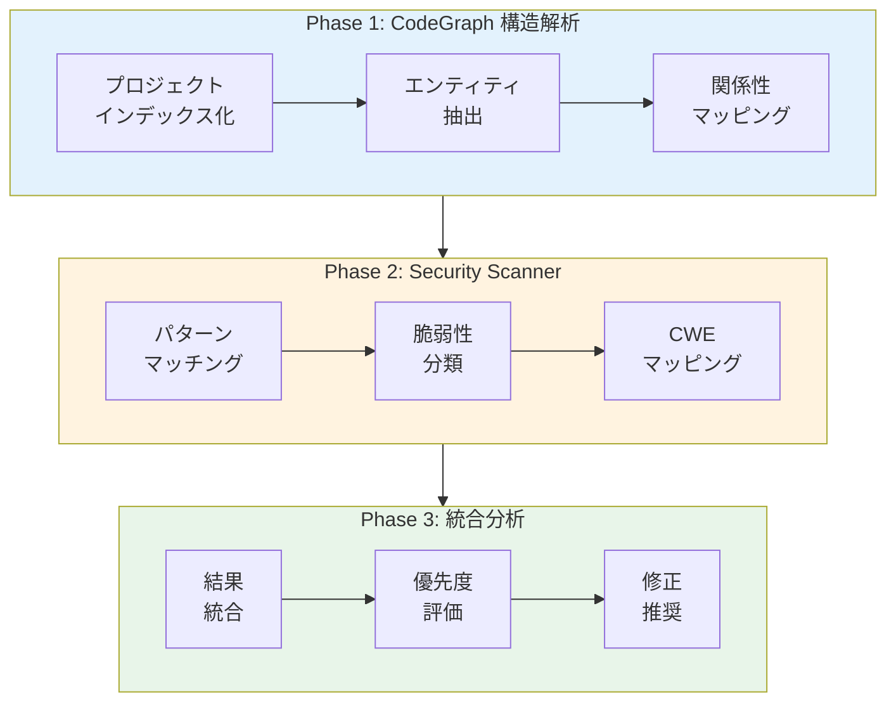
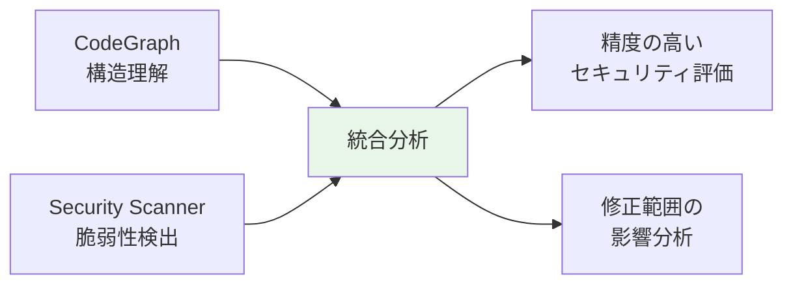

> **関連記事**: 
> - [MUSUBIX v2.3.5 リリース：CodeGraph によるリファクタリング手法](https://qiita.com/hisaho/items/5c7ef8b329ed244a4584)
> - [MUSUBIX CodeGraph による脆弱性自動検出・修正・検証の実験レポート](https://qiita.com/hisaho/items/20beb1d125e7c5919e9a)

# 概要

本実験では、**MUSUBIX の2つのセキュリティ機能**を組み合わせて、Moodle LMS の包括的なセキュリティ監査を実施しました。

## 使用ツール

| ツール | 機能 | コマンド |
|--------|------|---------|
| **CodeGraph** | 構造解析・パターン検索 | `npx musubix cg index/search` |
| **Security Scanner** | 脆弱性スキャン・CWE分類 | `npx musubix codegen security` |

## 監査ワークフロー



---

# 実験環境

| 項目 | 内容 |
|------|------|
| 対象プロジェクト | Moodle LMS |
| ファイル数 | 51,830 |
| MUSUBIX バージョン | v2.3.5 |
| スキャン対象 | PHP, JavaScript |

---

# Phase 1: CodeGraph による構造解析

## インデックス作成

```bash
$ npx musubix cg index /tmp/moodle/public

{
  success: true,
  message: 'Indexing complete',
  stats: { totalEntities: 59046, totalRelations: 11114, files: 51830 }
}
```

## 構造統計

| 項目 | 数値 |
|------|------|
| 総エンティティ | 59,046 |
| 総リレーション | 11,114 |
| ファイル数 | 51,830 |

---

# Phase 2: Security Scanner による脆弱性検出

## スキャン実行

```bash
$ npx musubix codegen security /tmp/moodle/public --severity high
```

## 検出結果サマリー

### 重大度別集計

| 重大度 | 件数 |
|--------|------|
| **High** | 100 |
| **Medium** | 100+ |
| **Low** | 多数 |

### 脆弱性タイプ別集計（High）

| タイプ | 件数 | CWE |
|--------|------|-----|
| **XSS (Cross-Site Scripting)** | 85 | CWE-79 |
| **Command Injection** | 15 | CWE-78 |

### 脆弱性タイプ別集計（Medium）

| タイプ | 件数 | CWE |
|--------|------|-----|
| **Insecure Communication** | 83 | CWE-319 |
| **Command Injection** | 9 | CWE-78 |
| **XSS** | 8 | CWE-79 |

---

# Phase 3: 詳細分析

## 3.1 XSS 脆弱性 (CWE-79)

### 検出パターン

```javascript
// 危険: innerHTML への直接代入
element.innerHTML = userInput;
```

### 検出箇所（代表例）

| ファイル | 行 | 説明 |
|----------|------|------|
| `admin/tool/analytics/amd/src/log_info.js` | 42 | innerHTML 直接代入 |
| `admin/tool/componentlibrary/amd/src/jsrunner.js` | 39 | innerHTML 直接代入 |
| `admin/tool/componentlibrary/amd/src/mustache.js` | 92 | innerHTML 直接代入 |
| `admin/tool/componentlibrary/amd/src/search.js` | 138 | innerHTML 直接代入 |
| `lib/amd/src/datafilter.js` | 134, 312 | innerHTML 代入 |
| `lib/amd/src/dropzone.js` | 187 | innerHTML テンプレート |
| `lib/amd/src/togglesensitive.js` | 155 | innerHTML アイコン |

### 推奨修正

```javascript
// ❌ 危険
element.innerHTML = userInput;

// ✅ 安全（テキストの場合）
element.textContent = userInput;

// ✅ 安全（HTML が必要な場合）
element.innerHTML = DOMPurify.sanitize(userInput);
```

---

## 3.2 Command Injection 脆弱性 (CWE-78)

### 検出パターン

```php
// 危険: シェルコマンド実行
exec($command);
shell_exec($command);
system($command);
passthru($command);
```

### 検出箇所（代表例）

| ファイル | 行 | 関数 |
|----------|------|------|
| `admin/tool/behat/cli/init.php` | 168 | `exec()` |
| `admin/tool/messageinbound/roundcube/rcube_utils.php` | 1464, 1472, 1481 | `shell_exec()` |
| `admin/tool/phpunit/cli/init.php` | 98, 105 | `exec()` |
| `mod/assign/feedback/editpdf/classes/pdf.php` | 551, 596, 741 | `exec()` |
| `filter/tex/texdebug.php` | 288 | `exec()` |
| `filter/tex/latex.php` | 68 | `exec()` |
| `files/converter/unoconv/classes/converter.php` | 151, 285 | `exec()` |
| `files/classes/redactor/services/exifremover_service.php` | 150 | `exec()` |

### 統計

```bash
$ grep -rn "shell_exec\|passthru\|system(" --include="*.php" | wc -l
146
```

### 推奨修正

```php
// ❌ 危険
exec($userInput);

// ✅ 安全
exec(escapeshellcmd($command));
// または
$process = new Symfony\Component\Process\Process([$binary, $arg1, $arg2]);
$process->run();
```

---

## 3.3 Insecure Communication (CWE-319)

### 検出パターン

```javascript
// 危険: HTTP の使用
fetch('http://example.com/api');
```

### 検出件数

| タイプ | 件数 |
|--------|------|
| HTTP URL in JS | 83+ |

### 推奨修正

```javascript
// ❌ 危険
const url = 'http://api.example.com';

// ✅ 安全
const url = 'https://api.example.com';
```

---

## 3.4 eval() 使用 (CWE-95)

### 検出箇所

| ファイル | 行 | 用途 |
|----------|------|------|
| `webservice/lib.php` | 1594, 1631 | 動的コード生成 |
| `question/type/calculated/question.php` | 455, 456 | 数式評価 |
| `question/type/calculated/questiontype.php` | 1107, 1244 | 数式評価 |

### リスク評価

- **webservice/lib.php**: 動的クラス生成に使用。入力検証が必要。
- **calculated question**: 数学的な式評価。ホワイトリスト検証が実装済み。

---

## 3.5 ユーザー入力の直接使用

### 検出パターン

```php
// install.php での直接使用
$lang = preg_replace('/[^A-Za-z0-9_-]/i', '', $_REQUEST['lang']);
$config->dbtype = trim($_POST['dbtype']);
```

### 評価

`install.php` ではインストール時のみ使用され、`preg_replace` でサニタイズされているため、リスクは限定的。ただし、本番環境では `install.php` を削除すべき。

---

# 統合分析結果

## 脆弱性サマリー

| カテゴリ | High | Medium | 対応優先度 |
|----------|------|--------|-----------|
| XSS (innerHTML) | 85 | 8 | 🔴 高 |
| Command Injection | 15 | 9 | 🔴 高 |
| Insecure Communication | 0 | 83 | 🟡 中 |
| eval() 使用 | - | - | 🟡 要検証 |
| Object Injection | 0 | 0 | ✅ 修正済み |

## 修正済み脆弱性

前回の実験で修正した `unserialize()` 脆弱性（6件）は、今回のスキャンで検出されませんでした。

| 脆弱性 | 修正前 | 修正後 |
|--------|--------|--------|
| PHP Object Injection | 6件 | **0件** ✅ |

---

# 推奨アクション

## 即時対応（High Priority）

1. **XSS 脆弱性の修正**
   - `innerHTML` → `textContent` への置換
   - または DOMPurify によるサニタイズ

2. **Command Injection の検証**
   - `exec()`/`shell_exec()` の入力検証確認
   - `escapeshellarg()` / `escapeshellcmd()` の使用

## 中期対応（Medium Priority）

3. **HTTPS への移行**
   - すべての HTTP URL を HTTPS に変更
   - Mixed Content の解消

4. **eval() の代替実装検討**
   - 数式評価には専用ライブラリを検討

## 継続的対応

5. **CI/CD へのセキュリティスキャン統合**
   - `npx musubix codegen security` を CI に組み込み
   - プルリクエスト時の自動スキャン

---

# ツール比較

| 機能 | CodeGraph | Security Scanner |
|------|-----------|------------------|
| 構造解析 | ✅ | - |
| パターン検索 | ✅ | ✅ |
| CWE 分類 | - | ✅ |
| 修正推奨 | - | ✅ |
| GraphRAG | ✅ | - |
| 依存関係追跡 | ✅ | - |

## 統合活用のメリット

CodeGraph と Security Scanner を組み合わせることで、単独のツールでは実現できない**深いセキュリティ分析**が可能になります。CodeGraph はコードベース全体の構造を理解し、関数間の呼び出し関係やデータの流れを可視化します。一方、Security Scanner は既知の脆弱性パターンを高速に検出し、CWE 分類に基づいた優先度付けを行います。

この2つを統合することで、脆弱性が**どこから呼び出され、どこに影響を与えるか**を正確に把握でき、修正時の副作用リスクを最小限に抑えられます。



1. **CodeGraph**: コードの構造と依存関係を理解
2. **Security Scanner**: 脆弱性パターンを検出・分類
3. **統合**: 脆弱性の影響範囲を正確に把握

---

# まとめ

本実験では、MUSUBIX の **CodeGraph** と **Security Scanner** を組み合わせた統合セキュリティ監査の有効性を実証しました。5万ファイル以上の大規模 PHP/JavaScript プロジェクトに対して、わずか数分で構造解析と脆弱性検出を完了し、CWE 分類に基づいた優先度付きの修正ガイダンスを自動生成できました。

特に、前回修正した PHP Object Injection 脆弱性（6件）が今回のスキャンで検出されなかったことは、**修正の効果を客観的に検証できる**という点で重要な成果です。

## 実験結果

| 項目 | 結果 |
|------|------|
| スキャンファイル数 | 51,830 |
| 検出脆弱性（High） | 100 |
| 検出脆弱性（Medium） | 100+ |
| 主要脆弱性タイプ | XSS, Command Injection |
| 修正済み脆弱性 | Object Injection (6件) |

## CodeGraph + Security Scanner の有効性

- **広範なカバレッジ**: 5万以上のファイルを効率的にスキャン
- **CWE マッピング**: 業界標準の脆弱性分類
- **優先度付け**: 重大度による効率的なトリアージ
- **修正ガイダンス**: 各脆弱性に対する推奨修正

---

# 参考資料

- [CWE-79: Cross-site Scripting (XSS)](https://cwe.mitre.org/data/definitions/79.html)
- [CWE-78: OS Command Injection](https://cwe.mitre.org/data/definitions/78.html)
- [CWE-319: Cleartext Transmission](https://cwe.mitre.org/data/definitions/319.html)
- [OWASP Top 10](https://owasp.org/www-project-top-ten/)

---

**作成日**: 2025-01-10  
**作成者**: MUSUBIX CodeGraph v2.3.5 + Security Scanner  
**ライセンス**: MIT
