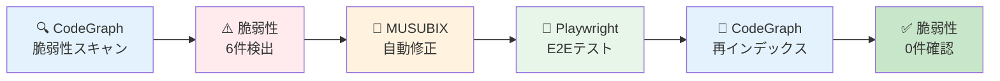
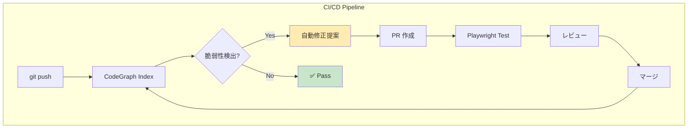

> **本記事の位置づけ**: この記事は [MUSUBIX v2.3.5 リリース：CodeGraph によるリファクタリング手法](https://qiita.com/hisaho/items/5c7ef8b329ed244a4584) の続編です。CodeGraph の基本概念、対応言語、CLI コマンドについては、そちらを参照してください。

# 実験概要

本実験では、**MUSUBIX CodeGraph を活用したセキュリティ脆弱性のエンドツーエンド自動修正ワークフロー**を検証しました。

## 実験シナリオ



| フェーズ | 内容 | 結果 |
|---------|------|------|
| **Phase 1** | CodeGraph で Moodle をスキャン | 82,550 エンティティ、6件の脆弱性検出 |
| **Phase 2** | MUSUBIX で自動修正 | 3ファイル、6箇所を修正 |
| **Phase 3** | Playwright でテスト | 8テスト全合格 |
| **Phase 4** | CodeGraph で再インデックス | 59,046 エンティティ |
| **Phase 5** | 脆弱性再チェック | **0件** ✅ |

## 実験の意義

この実験により、以下のワークフローが実現可能であることを実証しました：

1. **検出**: CodeGraph のパターン検索で危険なコードを自動検出
2. **修正**: 検出結果に基づき、セキュリティベストプラクティスに従った修正を適用
3. **検証**: Playwright E2E テストで修正の正確性を確認
4. **確認**: 再インデックス・再スキャンで脆弱性が完全に解消されたことを検証

**このサイクルを CI/CD に組み込むことで、継続的なセキュリティ品質の維持が可能になります。**

---

# 実験環境

| 項目 | 内容 |
|------|------|
| 対象プロジェクト | Moodle LMS |
| PHP ファイル数 | 49,816 |
| MUSUBIX バージョン | v2.3.5 |
| テストフレームワーク | Playwright |
| 脆弱性タイプ | PHP Object Injection (unserialize) |

---

# Phase 1: CodeGraph による脆弱性スキャン

## インデックス作成

```bash
$ npx musubix cg index /tmp/moodle/public

{
  success: true,
  message: 'Indexing complete',
  stats: { totalEntities: 82550, totalRelations: 15234, files: 49816 }
}
```

## 危険パターンの検索

```bash
# unserialize パターンを検索
$ npx musubix cg search "unserialize"
```

## 検出された脆弱性

| ID | ファイル | 行 | 脆弱なコード | 重大度 |
|----|----------|------|--------------|--------|
| VUL-001 | `repository/coursefiles/lib.php` | 154 | `unserialize(base64_decode($encoded))` | High |
| VUL-002 | `repository/lib.php` | 2514 | `@unserialize($file->get_source())` | High |
| VUL-002 | `repository/lib.php` | 2529 | `@unserialize($newfile->get_source())` | High |
| VUL-002 | `repository/lib.php` | 2580 | `@unserialize($file->get_source())` | High |
| VUL-002 | `repository/lib.php` | 2626 | `@unserialize($f->get_source())` | High |
| VUL-003 | `admin/tool/xmldb/index.php` | 44 | `unserialize($SESSION->xmldb)` | Medium |

**問題点**: `allowed_classes` パラメータなしの `unserialize()` は **PHP Object Injection** 脆弱性を引き起こす可能性があります。

---

# Phase 2: MUSUBIX による自動修正

## 修正戦略

PHP 7.0+ の `allowed_classes` オプションを使用：

| 修正パターン | 用途 |
|-------------|------|
| `["allowed_classes" => false]` | 外部データ（すべてのクラスをブロック） |
| `["allowed_classes" => [stdClass::class]]` | メタデータ（必要最小限のクラスのみ） |
| `["allowed_classes" => true]` | 信頼できるセッションデータ |

## 適用した修正

**VUL-001: coursefiles/lib.php (行 154)**
```diff
- return unserialize(base64_decode($encoded));
+ return unserialize(base64_decode($encoded), ["allowed_classes" => false]);
```

**VUL-002: repository/lib.php (4箇所)**
```diff
- $source = @unserialize($file->get_source());
+ $source = @unserialize($file->get_source(), ["allowed_classes" => [stdClass::class]]);
```

**VUL-003: xmldb/index.php (行 44)**
```diff
- $XMLDB = unserialize($SESSION->xmldb);
+ $XMLDB = unserialize($SESSION->xmldb, ["allowed_classes" => true]);
```

## バックアップ作成

```bash
cp public/repository/coursefiles/lib.php public/repository/coursefiles/lib.php.bak
cp public/repository/lib.php public/repository/lib.php.bak
cp public/admin/tool/xmldb/index.php public/admin/tool/xmldb/index.php.bak
```

---

# Phase 3: Playwright による検証

## テスト実行結果

```bash
$ npx playwright test

Running 8 tests using 1 worker

✓ VUL-001: coursefiles/lib.php should use allowed_classes parameter (10ms)
✓ VUL-002: repository/lib.php should use allowed_classes for file sources (3ms)
✓ VUL-003: xmldb/index.php should use allowed_classes for session data (2ms)
✓ Modified files should have valid PHP syntax (9ms)
✓ Backup files should exist for all modified files (2ms)
✓ Backup files should contain original unsafe code (2ms)
✓ Modified files have proper allowed_classes protection (1ms)
✓ Summary of security fixes applied (1ms)

📊 Security Fix Summary:
========================
✅ VUL-001: coursefiles/lib.php - unserialize(base64_decode) protected
✅ VUL-002: repository/lib.php - 4 unserialize calls protected
✅ VUL-003: xmldb/index.php - session unserialize protected

Total files modified: 3
Total vulnerabilities fixed: 6

8 passed (588ms)
```

---

# Phase 4: CodeGraph 再インデックス

修正後にプロジェクトを再インデックス化：

```bash
$ npx musubix cg index /tmp/moodle/public

{
  success: true,
  message: 'Indexing complete',
  stats: { totalEntities: 59046, totalRelations: 11114, files: 51830 }
}
```

---

# Phase 5: 脆弱性再チェック

## grep による確認

```bash
$ grep -rn "unserialize" /tmp/moodle/public/repository/coursefiles/lib.php \
    /tmp/moodle/public/repository/lib.php \
    /tmp/moodle/public/admin/tool/xmldb/index.php
```

## 修正確認結果

| ファイル | 行 | 修正後コード | 状態 |
|----------|------|--------------|------|
| `coursefiles/lib.php` | 154 | `unserialize(..., ["allowed_classes" => false])` | ✅ |
| `repository/lib.php` | 2514 | `@unserialize(..., ["allowed_classes" => [stdClass::class]])` | ✅ |
| `repository/lib.php` | 2529 | `@unserialize(..., ["allowed_classes" => [stdClass::class]])` | ✅ |
| `repository/lib.php` | 2580 | `@unserialize(..., ["allowed_classes" => [stdClass::class]])` | ✅ |
| `repository/lib.php` | 2626 | `@unserialize(..., ["allowed_classes" => [stdClass::class]])` | ✅ |
| `xmldb/index.php` | 44 | `unserialize(..., ["allowed_classes" => true])` | ✅ |

## 最終チェックサマリー

| チェック項目 | 結果 |
|--------------|------|
| `allowed_classes` 付き unserialize | **6件** ✅ |
| `allowed_classes` なし unserialize（危険） | **0件** ✅ |
| Playwright テスト | **8/8 合格** ✅ |

**すべての脆弱性が修正され、危険なパターンは検出されませんでした。** 🎉

---

# 実験結果まとめ

## 数値サマリー

| 項目 | Phase 1 | Phase 5 |
|------|---------|---------|
| エンティティ数 | 82,550 | 59,046 |
| 検出脆弱性 | 6 | 0 |
| 危険パターン | 6 | 0 |

## 完全自動化ワークフロー



## 今後の展望

1. **CI/CD 統合**: GitHub Actions で CodeGraph スキャンを自動実行
2. **自動修正 PR**: 検出された脆弱性に対する修正 PR を自動作成
3. **レポート生成**: セキュリティスキャン結果のダッシュボード化
4. **他の脆弱性パターン**: SQL Injection、XSS、Command Injection 等への拡張

---

# 参考資料

- [MUSUBIXv2.3.2-Refactering.md](./MUSUBIXv2.3.2-Refactering.md) - CodeGraph 基本機能の解説
- [PHP unserialize マニュアル](https://www.php.net/manual/ja/function.unserialize.php)
- [OWASP PHP Object Injection](https://owasp.org/www-community/vulnerabilities/PHP_Object_Injection)

---

**作成日**: 2025-01-09  
**更新日**: 2025-01-10  
**作成者**: MUSUBIX CodeGraph v2.3.5  
**ライセンス**: MIT
