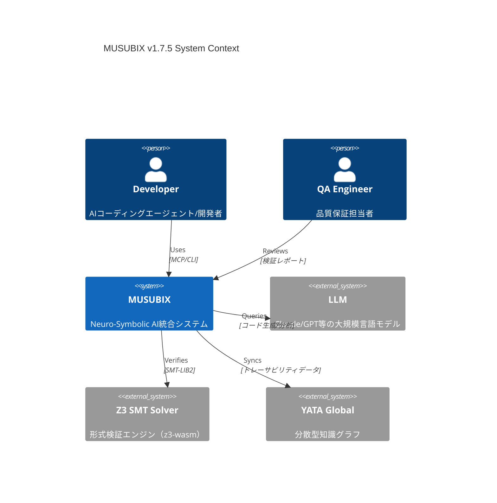
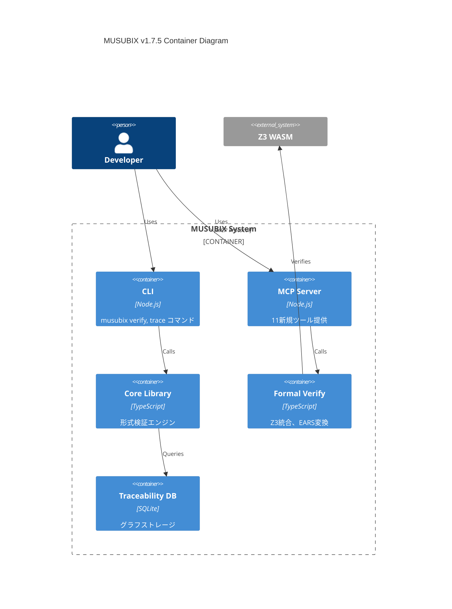
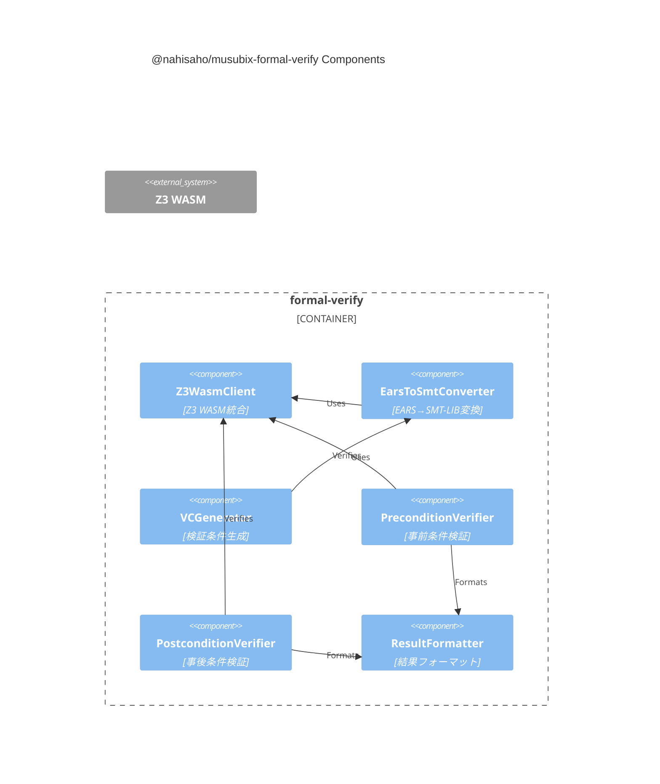
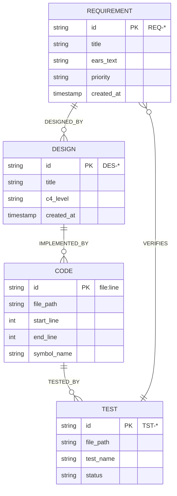
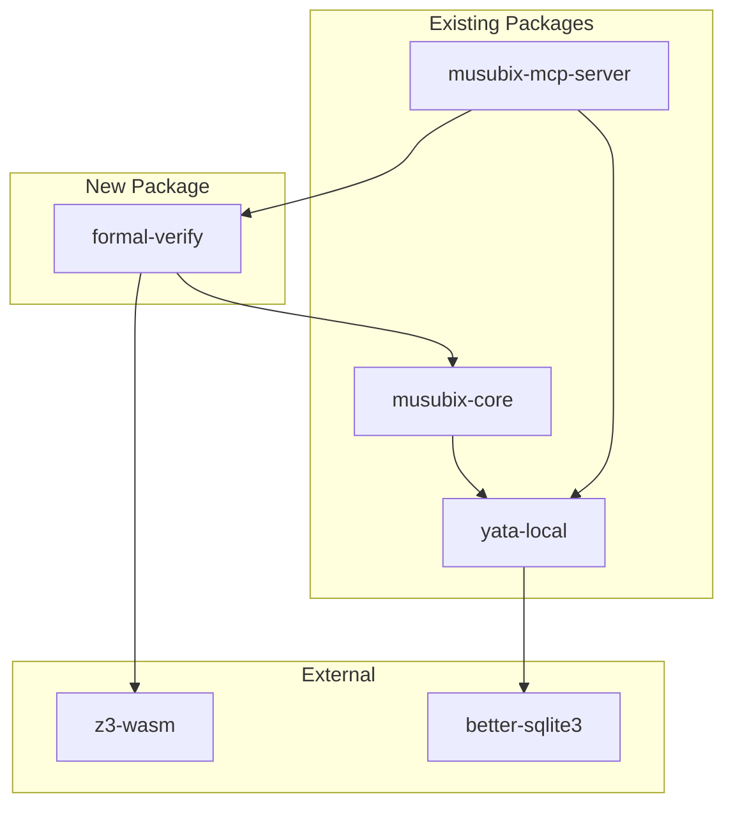
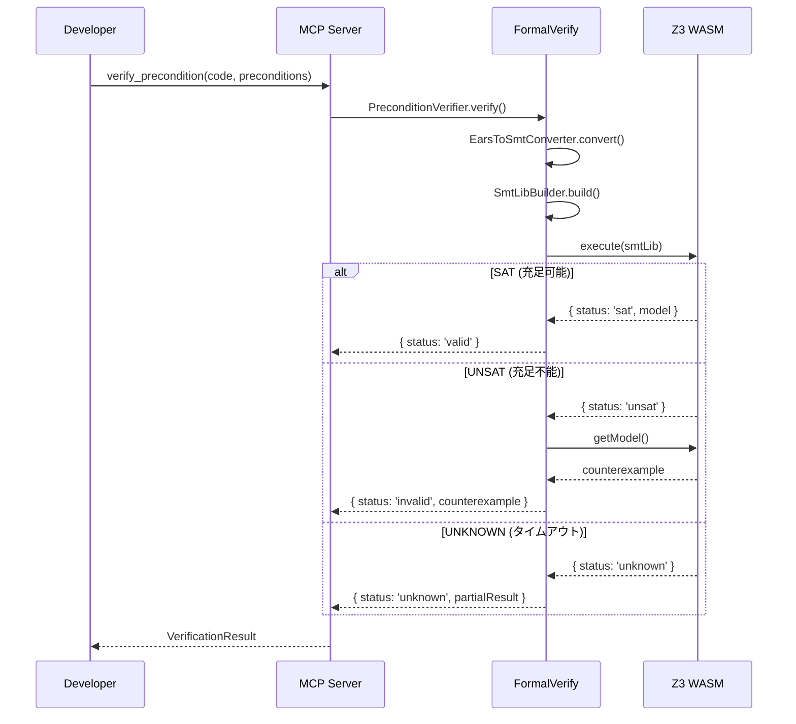
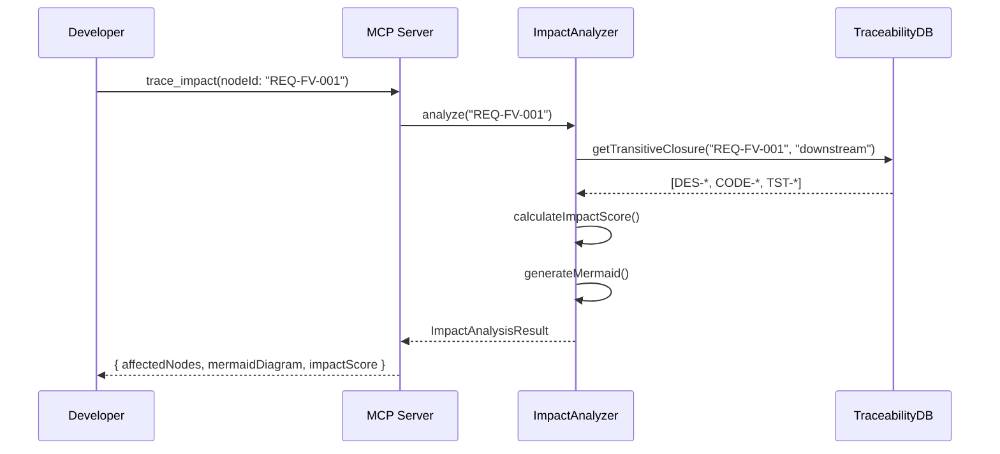

# MUSUBIX v1.7.5 設計書

**文書ID**: DES-MUSUBIX-175  
**バージョン**: 1.1.0  
**作成日**: 2026-01-06  
**ステータス**: Reviewed  
**トレーサビリティ**: ← REQ-MUSUBIX-175

---

## 1. 概要

### 1.1 目的

本設計書は、MUSUBIX v1.7.5「Formal Verification Edition」の技術設計を定義する。
C4モデルに基づき、Context → Container → Component → Code の4レベルで設計を記述する。

### 1.2 スコープ

| 項目 | 内容 |
|------|------|
| **対象要件** | REQ-MUSUBIX-175（P0要件: 9件） |
| **新規パッケージ** | `@nahisaho/musubix-formal-verify` |
| **変更パッケージ** | `@nahisaho/musubix-core`, `@nahisaho/yata-local`, `@nahisaho/musubix-mcp-server` |
| **新規MCPツール** | 6ツール（v1.7.5スコープ） |

### 1.3 既存クラスとの統合戦略

| 既存クラス | パッケージ | 統合方針 |
|-----------|------------|----------|
| `EarsToFormalSpecConverter` | core/symbolic | **拡張**: SMT-LIB完全対応を追加、既存LTL機能は維持 |
| `VerificationConditionGenerator` | core/symbolic | **拡張**: WP計算追加、既存VC生成と統合 |
| `Z3Adapter` | core/symbolic | **置換**: z3-wasm対応の新実装に置換、互換レイヤー提供 |
| `HallucinationDetector` | core/symbolic | **統合**: 検証結果をフィードバック、誤検出率改善 |

```typescript
// 互換レイヤー例
// packages/core/src/symbolic/Z3Adapter.ts
import { Z3WasmClient } from '@nahisaho/musubix-formal-verify';

/** @deprecated Use Z3WasmClient from formal-verify instead */
export class Z3Adapter {
  private client: Z3WasmClient;
  
  constructor() {
    console.warn('Z3Adapter is deprecated. Use Z3WasmClient from @nahisaho/musubix-formal-verify');
    this.client = new Z3WasmClient();
  }
  
  // 既存APIを維持しつつ内部実装を委譲
  async verify(spec: string): Promise<boolean> {
    const result = await this.client.execute(spec);
    return result.status === 'sat';
  }
}
```

### 1.4 CLI設計

#### 新規コマンド

```bash
# 形式検証コマンド
npx musubix verify precondition <file> [--preconditions <ears-file>]
npx musubix verify postcondition <file> [--pre <file>] [--post <file>]
npx musubix verify all <file> [--spec <ears-file>] [--timeout <ms>]

# EARS変換コマンド
npx musubix ears to-smt <ears-file> [--output <smt-file>]
npx musubix ears validate <ears-file>

# トレーサビリティコマンド（既存trace拡張）
npx musubix trace add <source> <target> [--type <edge-type>]
npx musubix trace impact <node-id> [--format mermaid|json]
npx musubix trace query <node-id> [--direction upstream|downstream|both]
```

#### CLI出力例

```
$ npx musubix verify precondition src/divide.ts --preconditions specs/divide.ears

🔍 Verifying preconditions for src/divide.ts...

┌─────────────────────────────────────────────────────────────┐
│ Precondition Verification Result                            │
├─────────────────────────────────────────────────────────────┤
│ Status: ✅ VALID                                            │
│ Preconditions checked: 2                                    │
│ Execution time: 1.23s                                       │
├─────────────────────────────────────────────────────────────┤
│ Precondition 1: THE b parameter SHALL NOT be zero           │
│   → ✅ Satisfiable                                          │
│                                                             │
│ Precondition 2: THE a parameter SHALL be a finite number    │
│   → ✅ Satisfiable                                          │
└─────────────────────────────────────────────────────────────┘

SMT-LIB generated: .musubix/verify/divide_preconditions.smt2
```

---

## 2. C4モデル: Context（システムコンテキスト）

### 2.1 システムコンテキスト図



### 2.2 外部システム

| システム | 役割 | インターフェース |
|----------|------|------------------|
| LLM | コード生成、自然言語処理 | REST API |
| Z3 SMT Solver | 形式検証、充足可能性判定 | z3-wasm（WASM） |
| YATA Global | 分散型知識グラフ同期 | WebSocket/REST |

---

## 3. C4モデル: Container（コンテナ）

### 3.1 コンテナ図



### 3.2 パッケージ構成

| パッケージ | 役割 | 変更種別 |
|-----------|------|----------|
| `@nahisaho/musubix-formal-verify` | Z3統合、EARS→SMT変換 | **新規** |
| `@nahisaho/musubix-core` | 形式検証統合、トレーサビリティDB | 変更 |
| `@nahisaho/musubix-mcp-server` | 11新規MCPツール | 変更 |
| `@nahisaho/yata-local` | グラフDBスキーマ拡張 | 変更 |

---

## 4. C4モデル: Component（コンポーネント）

### 4.1 formal-verify パッケージ



### 4.2 コンポーネント一覧

#### 4.2.1 Z3統合（REQ-FV-001）

| コンポーネント | 責務 | 依存 |
|---------------|------|------|
| `Z3WasmClient` | Z3 WASM初期化・実行 | z3-wasm |
| `Z3ProcessFallback` | 外部Z3プロセス起動（フォールバック） | child_process |
| `SmtLibBuilder` | SMT-LIB2構文生成 | - |
| `Z3ResultParser` | Z3出力解析 | - |

```typescript
// packages/formal-verify/src/z3/Z3WasmClient.ts
export interface Z3WasmClient {
  /** Z3 WASMを初期化 */
  initialize(): Promise<void>;
  
  /** SMT-LIB2スクリプトを実行 */
  execute(smtLib: string, timeout?: number): Promise<Z3Result>;
  
  /** 充足可能性を判定 */
  checkSat(assertions: string[]): Promise<SatResult>;
  
  /** モデル（反例）を取得 */
  getModel(): Promise<Model | null>;
  
  /** リソース解放 */
  dispose(): void;
}

export type SatResult = 'sat' | 'unsat' | 'unknown';

export interface Z3Result {
  status: SatResult;
  model?: Model;
  proof?: string;
  statistics?: Z3Statistics;
  error?: string;
}
```

#### 4.2.2 事前条件検証（REQ-FV-002）

| コンポーネント | 責務 | 依存 |
|---------------|------|------|
| `PreconditionVerifier` | 事前条件の充足可能性検証 | Z3WasmClient |
| `PreconditionExtractor` | コードから事前条件抽出 | TypeScript AST |

```typescript
// packages/formal-verify/src/verifiers/PreconditionVerifier.ts
export interface PreconditionVerifier {
  /** 事前条件を検証 */
  verify(
    code: string,
    preconditions: EarsRequirement[],
    options?: VerifyOptions
  ): Promise<VerificationResult>;
}

export interface VerificationResult {
  status: 'valid' | 'invalid' | 'unknown';
  counterexample?: Counterexample;
  proof?: ProofTree;
  executionTime: number;
  smtLibGenerated: string;
}

export interface Counterexample {
  inputs: Record<string, unknown>;
  trace: string[];
  violatedCondition: string;
}
```

#### 4.2.3 事後条件検証（REQ-FV-003）

| コンポーネント | 責務 | 依存 |
|---------------|------|------|
| `PostconditionVerifier` | Hoare論理に基づく事後条件検証 | Z3WasmClient, VCGenerator |
| `WeakestPreconditionCalculator` | 最弱事前条件（WP）計算 | TypeScript AST |

```typescript
// packages/formal-verify/src/verifiers/PostconditionVerifier.ts
export interface PostconditionVerifier {
  /** 事後条件を検証（Hoare論理: {P} code {Q}） */
  verify(
    code: string,
    preconditions: EarsRequirement[],
    postconditions: EarsRequirement[],
    options?: VerifyOptions
  ): Promise<HoareVerificationResult>;
}

export interface HoareVerificationResult extends VerificationResult {
  weakestPrecondition: string;
  verificationConditions: VerificationCondition[];
}
```

#### 4.2.4 EARS→SMT-LIB変換（REQ-E2F-001）

| コンポーネント | 責務 | 依存 |
|---------------|------|------|
| `EarsToSmtConverter` | EARS 5パターン→SMT-LIB2変換 | EarsParser |
| `EarsPatternHandler` | パターン別変換ロジック | - |
| `SmtLibBuilder` | SMT-LIB2構文生成 | - |

```typescript
// packages/formal-verify/src/converters/EarsToSmtConverter.ts
export interface EarsToSmtConverter {
  /** EARS要件をSMT-LIB2に変換 */
  convert(requirement: EarsRequirement): ConversionResult;
  
  /** 複数要件を一括変換 */
  convertAll(requirements: EarsRequirement[]): ConversionResult[];
}

export interface ConversionResult {
  success: boolean;
  smtLib: string;
  pattern: EarsPattern;
  variables: SmtVariable[];
  explanation: string;
  errors?: ConversionError[];
}

export type EarsPattern = 
  | 'ubiquitous'     // THE system SHALL
  | 'event-driven'   // WHEN event, THE system SHALL
  | 'state-driven'   // WHILE state, THE system SHALL
  | 'unwanted'       // THE system SHALL NOT
  | 'optional';      // IF condition, THEN THE system SHALL
```

### 4.3 トレーサビリティDB（REQ-TDB-001, 002）



#### 4.3.1 グラフDBスキーマ

```typescript
// packages/yata-local/src/traceability/schema.ts
export interface TraceNode {
  id: string;
  type: 'requirement' | 'design' | 'code' | 'test';
  properties: Record<string, unknown>;
  createdAt: Date;
  updatedAt: Date;
}

export interface TraceEdge {
  id: string;
  type: TraceEdgeType;
  sourceId: string;
  targetId: string;
  properties?: Record<string, unknown>;
  createdAt: Date;
}

export type TraceEdgeType = 
  | 'DESIGNED_BY'      // Requirement → Design
  | 'IMPLEMENTED_BY'   // Design → Code
  | 'TESTED_BY'        // Code → Test
  | 'VERIFIES';        // Test → Requirement
```

#### 4.3.2 影響分析クエリ

```typescript
// packages/yata-local/src/traceability/ImpactAnalyzer.ts
export interface ImpactAnalyzer {
  /** 変更影響を分析 */
  analyze(nodeId: string): Promise<ImpactAnalysisResult>;
  
  /** 推移閉包クエリ */
  getTransitiveClosure(
    nodeId: string,
    direction: 'upstream' | 'downstream' | 'both'
  ): Promise<TraceNode[]>;
  
  /** Mermaid図を生成 */
  generateMermaid(nodeId: string): Promise<string>;
}

export interface ImpactAnalysisResult {
  affectedNodes: TraceNode[];
  affectedEdges: TraceEdge[];
  impactScore: number;
  mermaidDiagram: string;
}
```

### 4.4 MCPツール（REQ-MCP-001〜003）

#### 4.4.1 形式検証ツール（v1.7.5: 2ツール）

| ツール名 | 入力 | 出力 | 対応要件 | スコープ |
|----------|------|------|----------|--------|
| `verify_precondition` | code, preconditions[] | VerificationResult | REQ-FV-002 | **v1.7.5** |
| `verify_postcondition` | code, pre[], post[] | HoareVerificationResult | REQ-FV-003 | **v1.7.5** |
| `verify_invariant` | code, invariants[] | VerificationResult | REQ-FV-004 | v1.8.0 (P1) |
| `generate_vcs` | code, spec[] | VC[] | REQ-FV-005 | v1.8.0 (P1) |

```typescript
// packages/mcp-server/src/tools/formal/verifyPrecondition.ts
export const verifyPreconditionTool: Tool = {
  name: 'verify_precondition',
  description: 'Verify function preconditions using Z3 SMT solver',
  inputSchema: {
    type: 'object',
    properties: {
      code: { type: 'string', description: 'TypeScript/JavaScript code to verify' },
      preconditions: {
        type: 'array',
        items: { type: 'string' },
        description: 'EARS format preconditions'
      },
      timeout: { type: 'number', default: 10000, description: 'Timeout in ms' }
    },
    required: ['code', 'preconditions']
  },
  handler: async (input) => {
    const verifier = new PreconditionVerifier();
    return await verifier.verify(input.code, input.preconditions, {
      timeout: input.timeout
    });
  }
};
```

#### 4.4.2 EARS変換ツール（v1.7.5: 1ツール）

| ツール名 | 入力 | 出力 | 対応要件 | スコープ |
|----------|------|------|----------|--------|
| `ears_to_smt` | ears_requirement | smtLib, explanation | REQ-E2F-001 | **v1.7.5** |
| `ears_to_ltl` | ears_requirement | ltlFormula | REQ-E2F-002 | v1.8.0 (P1) |
| `extract_constraints` | ears_requirement | constraints[] | REQ-E2F-003 | v1.8.0 (P1) |

#### 4.4.3 トレーサビリティDBツール（v1.7.5: 3ツール）

| ツール名 | 入力 | 出力 | 対応要件 | スコープ |
|----------|------|------|----------|--------|
| `trace_add_link` | source, target, type | TraceEdge | REQ-TDB-001 | **v1.7.5** |
| `trace_query` | nodeId, direction | TraceNode[] | REQ-TDB-001 | **v1.7.5** |
| `trace_impact` | nodeId | ImpactAnalysisResult | REQ-TDB-002 | **v1.7.5** |
| `trace_coverage` | - | CoverageReport | REQ-TDB-003 | v1.8.0 (P1) |

#### 4.4.4 v1.7.5 MCPツールサマリ

| カテゴリ | v1.7.5 | v1.8.0 (P1) |
|----------|--------|-------------|
| 形式検証 | 2 | +2 |
| EARS変換 | 1 | +2 |
| トレーサビリティ | 3 | +1 |
| **合計** | **6** | +5 |

---

## 5. C4モデル: Code（コード）

### 5.1 ディレクトリ構造

```
packages/
├── formal-verify/                    # 新規パッケージ
│   ├── package.json
│   ├── tsconfig.json
│   ├── src/
│   │   ├── index.ts                  # 公開API
│   │   ├── z3/
│   │   │   ├── Z3WasmClient.ts       # REQ-FV-001
│   │   │   ├── Z3ProcessFallback.ts
│   │   │   ├── SmtLibBuilder.ts
│   │   │   └── Z3ResultParser.ts
│   │   ├── verifiers/
│   │   │   ├── PreconditionVerifier.ts   # REQ-FV-002
│   │   │   ├── PostconditionVerifier.ts  # REQ-FV-003
│   │   │   └── WeakestPreconditionCalculator.ts
│   │   ├── converters/
│   │   │   ├── EarsToSmtConverter.ts     # REQ-E2F-001
│   │   │   ├── EarsPatternHandler.ts
│   │   │   └── SmtVariable.ts
│   │   └── types/
│   │       ├── VerificationResult.ts
│   │       └── SmtLib.ts
│   └── __tests__/
│       ├── z3/
│       ├── verifiers/
│       └── converters/
│
├── yata-local/
│   └── src/
│       └── traceability/             # 新規ディレクトリ
│           ├── TraceabilityDB.ts     # REQ-TDB-001
│           ├── ImpactAnalyzer.ts     # REQ-TDB-002
│           ├── schema.ts
│           └── migrations/
│
└── mcp-server/
    └── src/
        └── tools/
            ├── formal/               # 新規ディレクトリ
            │   ├── verifyPrecondition.ts
            │   ├── verifyPostcondition.ts
            │   ├── verifyInvariant.ts
            │   └── generateVcs.ts
            ├── ears/                 # 新規ディレクトリ
            │   ├── earsToSmt.ts
            │   ├── earsToLtl.ts
            │   └── extractConstraints.ts
            └── trace/                # 新規ディレクトリ
                ├── traceAddLink.ts
                ├── traceQuery.ts
                ├── traceImpact.ts
                └── traceCoverage.ts
```

### 5.2 依存関係



### 5.3 公開API

```typescript
// packages/formal-verify/src/index.ts
export {
  // Z3統合
  Z3WasmClient,
  Z3ProcessFallback,
  SmtLibBuilder,
  
  // 検証器
  PreconditionVerifier,
  PostconditionVerifier,
  
  // EARS変換
  EarsToSmtConverter,
  
  // 型
  VerificationResult,
  HoareVerificationResult,
  SatResult,
  ConversionResult,
} from './internal';

// ファサード
export { FormalVerificationService } from './FormalVerificationService';
```

---

## 6. シーケンス図

### 6.1 事前条件検証フロー



### 6.2 影響分析フロー



---

## 7. エラーハンドリング

### 7.1 Z3エラー

| エラー種別 | 対応 | 戻り値 |
|-----------|------|--------|
| タイムアウト | フォールバックまたは`unknown`返却 | `{ status: 'unknown', reason: 'timeout' }` |
| WASM初期化失敗 | 外部Z3プロセスにフォールバック | 同上 |
| 構文エラー | エラーメッセージと修正提案 | `{ status: 'error', message, suggestion }` |

### 7.2 グレースフルデグラデーション

```typescript
// packages/formal-verify/src/z3/Z3ClientFactory.ts
export async function createZ3Client(): Promise<Z3Client> {
  try {
    // 第一候補: z3-wasm
    const wasmClient = new Z3WasmClient();
    await wasmClient.initialize();
    return wasmClient;
  } catch (wasmError) {
    console.warn('Z3 WASM initialization failed, falling back to process');
    
    try {
      // フォールバック: 外部プロセス
      const processClient = new Z3ProcessFallback();
      await processClient.initialize();
      return processClient;
    } catch (processError) {
      // 両方失敗: NoOpクライアント
      console.error('All Z3 backends failed');
      return new Z3NoOpClient();
    }
  }
}
```

---

## 8. 設計決定記録（ADR）

### ADR-175-001: Z3バインディング選択

| 項目 | 内容 |
|------|------|
| **ステータス** | Accepted |
| **コンテキスト** | Node.js 20環境でのZ3 SMTソルバー統合 |
| **決定** | z3-wasmを第一候補、外部プロセスをフォールバック |
| **理由** | npm z3-solverはNode 20未対応、z3-wasmは純JS |
| **結果** | 環境依存性低減、インストール簡素化 |

### ADR-175-002: トレーサビリティDBストレージ

| 項目 | 内容 |
|------|------|
| **ステータス** | Accepted |
| **コンテキスト** | グラフ構造のトレーサビリティデータ保存 |
| **決定** | SQLite（yata-local）にグラフテーブル追加 |
| **理由** | 外部DBサーバー不要、既存インフラ活用 |
| **結果** | デプロイ簡素化、yata-localとの統合 |

### ADR-175-003: MCPツール命名規則

| 項目 | 内容 |
|------|------|
| **ステータス** | Accepted |
| **コンテキスト** | 11新規MCPツールの命名 |
| **決定** | `{category}_{action}` 形式（verify_precondition, trace_impact等） |
| **理由** | 既存ツール（sdd_*）との一貫性 |
| **結果** | 発見可能性向上、自動補完対応 |

---

## 9. テスト設計

### 9.1 テストカテゴリ

| カテゴリ | ファイル | 目標テスト数 |
|----------|----------|-------------|
| Z3WasmClient | `__tests__/z3/Z3WasmClient.test.ts` | 15 |
| Z3ProcessFallback | `__tests__/z3/Z3ProcessFallback.test.ts` | 8 |
| PreconditionVerifier | `__tests__/verifiers/PreconditionVerifier.test.ts` | 12 |
| PostconditionVerifier | `__tests__/verifiers/PostconditionVerifier.test.ts` | 12 |
| EarsToSmtConverter | `__tests__/converters/EarsToSmtConverter.test.ts` | 25 |
| TraceabilityDB | `__tests__/traceability/TraceabilityDB.test.ts` | 15 |
| ImpactAnalyzer | `__tests__/traceability/ImpactAnalyzer.test.ts` | 10 |
| MCPツール（6ツール） | `__tests__/tools/*.test.ts` | 18 |
| **合計** | - | **115+** |

> 📊 要件書目標: 90+テスト → 設計書目標: 115+テスト（バッファ含む）

### 9.2 テストシナリオ例

```typescript
// __tests__/verifiers/PreconditionVerifier.test.ts
describe('PreconditionVerifier', () => {
  describe('verify', () => {
    it('should return valid when precondition is satisfiable', async () => {
      const code = `function divide(a: number, b: number) { return a / b; }`;
      const preconditions = ['THE b parameter SHALL NOT be zero'];
      
      const result = await verifier.verify(code, preconditions);
      
      expect(result.status).toBe('valid');
    });
    
    it('should return invalid with counterexample when precondition is unsatisfiable', async () => {
      const code = `function sqrt(x: number) { return Math.sqrt(x); }`;
      const preconditions = ['THE x parameter SHALL be negative'];
      
      const result = await verifier.verify(code, preconditions);
      
      expect(result.status).toBe('invalid');
      expect(result.counterexample).toBeDefined();
    });
    
    it('should return unknown on timeout', async () => {
      const result = await verifier.verify(complexCode, preconditions, {
        timeout: 1 // 1ms timeout
      });
      
      expect(result.status).toBe('unknown');
      expect(result.executionTime).toBeLessThan(100);
    });
  });
});
```

---

## 10. 実装計画

### 10.1 フェーズ分割

| フェーズ | タスク | 工数 | 依存 |
|---------|--------|------|------|
| **Phase 1** | Z3WasmClient実装 | 3日 | - |
| **Phase 2** | EarsToSmtConverter実装 | 2日 | Phase 1 |
| **Phase 3** | PreconditionVerifier実装 | 2日 | Phase 1, 2 |
| **Phase 4** | PostconditionVerifier実装 | 2日 | Phase 3 |
| **Phase 5** | TraceabilityDB実装 | 2日 | - |
| **Phase 6** | ImpactAnalyzer実装 | 1日 | Phase 5 |
| **Phase 7** | MCPツール統合 | 2日 | Phase 4, 6 |
| **Phase 8** | テスト・ドキュメント | 2日 | Phase 7 |

**合計工数**: 16日（約3週間）

### 10.2 マイルストーン

| マイルストーン | 完了条件 | 予定日 |
|---------------|----------|--------|
| M1: Z3統合完了 | Z3WasmClient動作確認 | Week 1 |
| M2: 検証器完了 | Precondition/Postcondition検証動作 | Week 2 |
| M3: トレーサビリティDB完了 | 影響分析動作 | Week 2 |
| M4: v1.7.5リリース | 全テスト合格、npm公開 | Week 3 |

---

## 11. 承認

| 役割 | 名前 | 日付 | 署名 |
|------|------|------|------|
| アーキテクト | | | |
| テックリード | | | |
| レビュアー | | | |

---

**Document ID**: DES-MUSUBIX-175  
**Traceability**: ← REQ-MUSUBIX-175 → TSK-MUSUBIX-175
