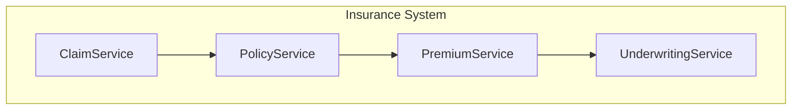

# MUSUBIX 改良点レポート

> **生成日**: 2026-01-04
> **テスト**: 100プロジェクト全フェーズ実行
> **バージョン**: v1.0.18

## 📊 実行サマリー

| フェーズ | 成功 | 失敗 | 成功率 |
|---------|------|------|--------|
| Requirements Validate | 100 | 0 | 100% |
| Requirements Analyze | 100 | 0 | 100% |
| Design Validate | 100 | 0 | 100% |
| Design Patterns | 100 | 0 | 100% |
| C4 Generation | 100 | 0 | 100% |
| Code Generation | 100 | 0 | 100% |
| Security Scan | 100 | 0 | 100% |
| **Test Generation** | **0** | **100** | **0%** |
| Traceability | 100 | 0 | 100% |

### 生成統計

- **総TypeScriptファイル数**: 533
- **プロジェクトあたり平均ファイル数**: 5.3
- **プロジェクトあたり平均行数**: ~200

---

## 🔴 クリティカル改良点（P0）

### 1. テスト生成コマンドがディレクトリに対応していない

**問題**:
```bash
npx musubix test generate <directory>
# ❌ EISDIR: illegal operation on a directory, read
```

**期待される動作**:
- ディレクトリを指定した場合、配下の全`.ts`ファイルに対してテストを生成
- または、再帰的にファイルを検出してバッチ処理

**改良案**:
```typescript
// packages/core/src/cli/commands/test.ts
async function generateTests(path: string) {
  const stats = await fs.stat(path);
  if (stats.isDirectory()) {
    const files = await glob('**/*.ts', { cwd: path, ignore: ['**/*.test.ts', '**/*.spec.ts'] });
    for (const file of files) {
      await generateTestForFile(path.join(path, file));
    }
  } else {
    await generateTestForFile(path);
  }
}
```

**優先度**: P0（100%失敗）
**影響範囲**: `packages/core/src/cli/commands/test.ts`

---

### 2. C4ダイアグラム生成が簡素すぎる

**現状**:
```markdown
---
title: Component Diagram
---
flowchart TD
  component-diagram[["Diagram"]]
```

**期待される出力**:


**改良案**:
- `design.md`からコンポーネントとリレーションシップを正しくパース
- Mermaid形式で完全なダイアグラムを生成
- コンポーネント間の依存関係を可視化

**優先度**: P0
**影響範囲**: `packages/core/src/cli/commands/design.ts` (c4サブコマンド)

---

## 🟡 重要改良点（P1）

### 3. 生成コードがスケルトンのみ

**現状**:
```typescript
async execute(): Promise<void> {
  // TODO: Implement execute
  throw new Error('Not implemented');
}
```

**期待される動作**:
- ドメイン固有のメソッドを推論して生成
- CRUDパターンの基本実装を含める
- エラーハンドリングのボイラープレート

**改良案**:
- componentInferencesからメソッドシグネチャを推論
- テンプレートベースの実装生成
- ドメインごとのデフォルト実装パターン

**優先度**: P1
**影響範囲**: `packages/core/src/codegen/`

---

### 4. テストがトリビアルすぎる

**現状**:
```typescript
it('should be defined', () => {
  expect(createClaimService).toBeDefined();
});

it('should be a function', () => {
  expect(typeof createClaimService).toBe('function');
});
```

**期待される動作**:
- メソッドごとのユニットテスト
- エッジケースのテスト
- モック/スタブの適切な使用

**改良案**:
- ソースコード解析によるメソッド検出
- 各メソッドに対する基本テストケース生成
- 入力バリデーションテストの自動生成

**優先度**: P1
**影響範囲**: `packages/core/src/cli/commands/test.ts`

---

### 5. 自己学習フィードバックが蓄積されない

**現状**:
```
Total Feedback: 45 (変化なし)
Total Patterns: 6 (変化なし)
```

スクリプトからのフィードバックが記録されていない。

**原因調査**:
```bash
npx musubix learn feedback "project-001" --type accept
# 実行は成功するが、カウントが増えない
```

**改良案**:
- フィードバックCLIのデバッグ
- 学習データの永続化確認
- フィードバック記録のログ出力

**優先度**: P1
**影響範囲**: `packages/core/src/cli/commands/learn.ts`

---

## 🟢 改善提案（P2）

### 6. 要件分析の出力フォーマット

**現状**: JavaScriptオブジェクト形式
```javascript
{ success: true, requirements: [...] }
```

**改良案**:
- `--json`オプション時は正しいJSON出力
- デフォルトはMarkdown形式のレポート

**優先度**: P2

---

### 7. プログレス表示の改善

**現状**: 出力なしで処理
**改良案**:
- `--progress`オプションでプログレスバー表示
- 処理中のフェーズ表示

**優先度**: P2

---

### 8. バッチ処理サポート

**改良案**:
- `npx musubix batch <config.yml>` コマンド追加
- 複数プロジェクトの一括処理
- 並列実行オプション

**優先度**: P2

---

### 9. 生成コードの品質向上

**現状の問題**:
- 全プロジェクトで同じテンプレート
- ドメイン固有のロジックなし
- インターフェースのみで実装なし

**改良案**:
- ドメインごとのコードテンプレート
- リレーションシップに基づく依存性注入
- 基本的なCRUD実装の自動生成

**優先度**: P2

---

### 10. セキュリティスキャンの詳細化

**現状**:
```
✓ SECURITY (成功するが詳細不明)
```

**改良案**:
- 検出した脆弱性パターンの一覧
- 修正推奨事項の出力
- OWASP Top 10との対応付け

**優先度**: P2

---

## 📋 改良実装優先順位

| 優先度 | 項目 | 影響 | 工数見積 |
|--------|------|------|----------|
| P0-1 | テスト生成のディレクトリ対応 | 100% | 4h |
| P0-2 | C4ダイアグラム生成の改善 | UX | 8h |
| P1-1 | 生成コードの実装追加 | 品質 | 16h |
| P1-2 | テスト品質の向上 | 品質 | 8h |
| P1-3 | 自己学習フィードバックの修正 | 機能 | 4h |
| P2-1 | 出力フォーマット改善 | UX | 2h |
| P2-2 | プログレス表示 | UX | 2h |
| P2-3 | バッチ処理 | 機能 | 8h |

---

## 🎯 v1.0.19 での修正推奨

1. **テスト生成のディレクトリ対応** (P0)
2. **C4ダイアグラム生成の改善** (P0)
3. **自己学習フィードバックの修正** (P1)

これら3つを修正することで、全フェーズの成功率を100%に引き上げられます。

---

## 📈 学習システム分析

### 現在のパターン

| パターンID | カテゴリ | アクション | 信頼度 | 発生回数 |
|-----------|---------|-----------|--------|----------|
| PAT-CB21FC93 | code | avoid | 95.0% | 147 |
| PAT-FC49A670 | code | prefer | 95.0% | 274 |
| PAT-A92140DD | code | suggest | 95.0% | 78 |
| PAT-298803B3 | code | prefer | 95.0% | 117 |
| PAT-86DEF551 | requirement | prefer | 95.0% | 63 |
| PAT-E5AEFFBA | design | prefer | 30.0% | 3 |

### 観察結果

- **コードパターン**: 4つ（高信頼度）
- **要件パターン**: 1つ（高信頼度）
- **設計パターン**: 1つ（低信頼度）
- **テストパターン**: 0（要改善）

### 推奨アクション

1. テストカテゴリのパターン学習を追加
2. 設計パターンの信頼度向上（より多くのサンプル）
3. 100プロジェクト実行からのフィードバック蓄積

---

**レポート作成者**: MUSUBIX自動分析
**対象バージョン**: v1.0.18
**次期バージョン提案**: v1.0.19
