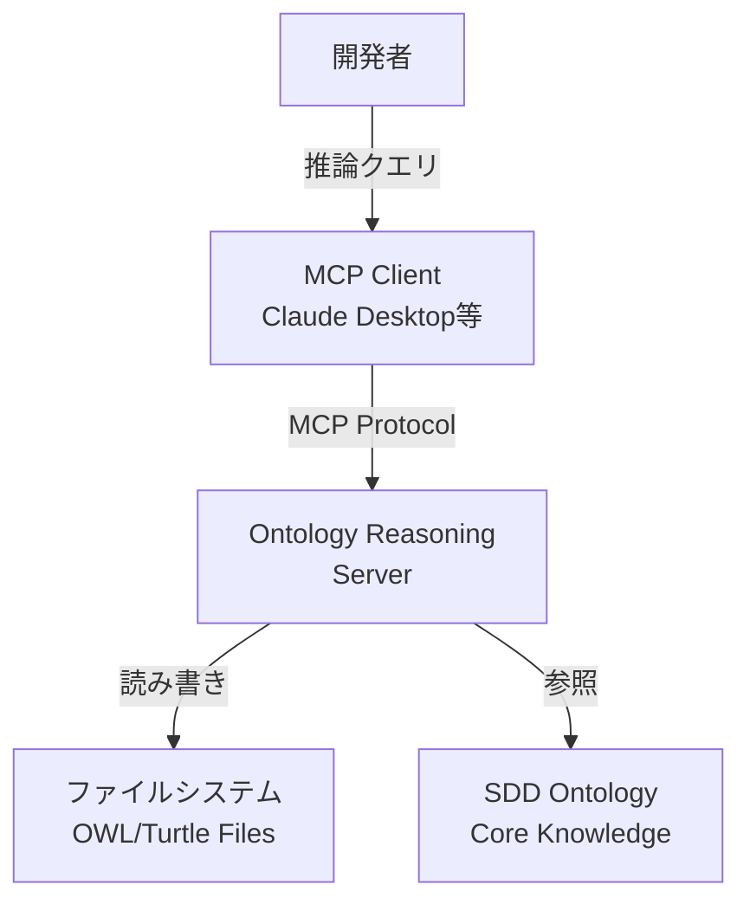
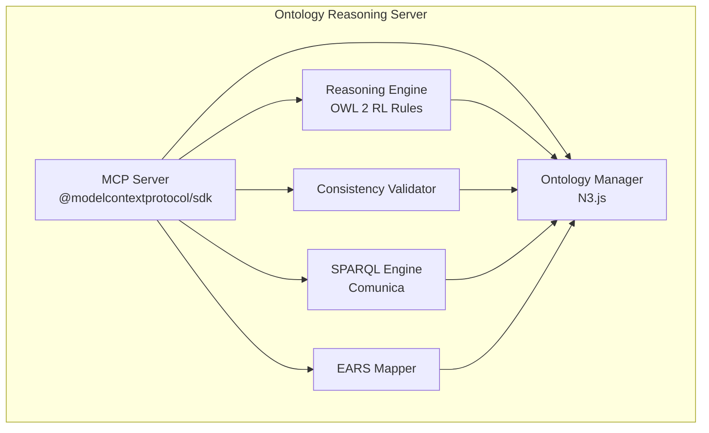
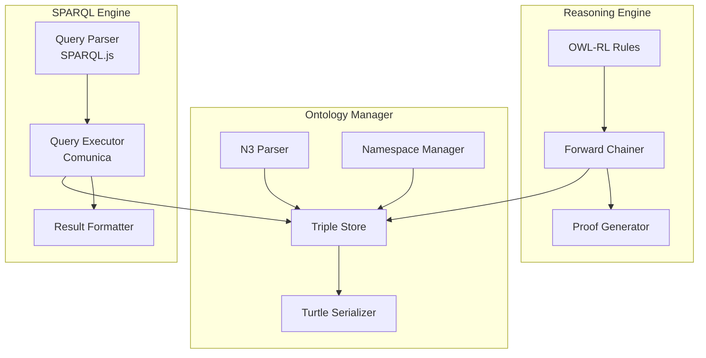

# MUSUBIX Ontology Reasoning MCP 設計書

**文書ID**: DES-ONTO-001  
**プロジェクト**: MUSUBIX  
**バージョン**: 1.0  
**作成日**: 2026-01-05  
**ステータス**: Draft  
**準拠要件**: REQ-ONTO-001

---

## 1. 概要

### 1.1 目的

OWL/RDFベースの形式オントロジーによる深い意味推論を実現するOntology Reasoning MCPサーバーの設計を定義する。

### 1.2 スコープ

本設計書は以下のコンポーネントを対象とする：
- オントロジー管理モジュール
- 推論エンジン
- 一貫性検証モジュール
- SPARQLクエリエンジン
- EARS要件マッピング
- MCPサーバー実装

### 1.3 設計原則

| 原則 | 説明 |
|------|------|
| OWL 2 RL準拠 | ルールベース推論が可能なサブセットを使用 |
| モジュラー設計 | 推論エンジンは交換可能 |
| ローカルファースト | すべてのデータはローカルに保持 |
| 拡張性 | カスタムオントロジーのインポートをサポート |

---

## 2. C4アーキテクチャ

### 2.1 Context図



### 2.2 Container図



### 2.3 Component図



---

## 3. 詳細設計

### 3.1 オントロジー管理モジュール（REQ-ONTO-001-F001, F006）

#### 3.1.1 型定義

```typescript
// packages/ontology-mcp/src/ontology/types.ts

interface OntologyManager {
  load(source: string | Buffer): Promise<Ontology>;
  save(ontology: Ontology, path: string): Promise<void>;
  merge(base: Ontology, imported: Ontology): Promise<Ontology>;
  getNamespaces(): NamespaceMap;
}

interface Ontology {
  iri: string;
  version: string;
  imports: string[];
  classes: OWLClass[];
  properties: OWLProperty[];
  individuals: OWLIndividual[];
  axioms: OWLAxiom[];
}

interface OWLClass {
  iri: string;
  label: string;
  comment?: string;
  superClasses: string[];
  disjointWith?: string[];
}

interface OWLProperty {
  iri: string;
  type: 'object' | 'data';
  domain?: string;
  range?: string;
  characteristics: PropertyCharacteristic[];
  inverseOf?: string;
}

type PropertyCharacteristic = 
  | 'functional'
  | 'inverseFunctional'
  | 'transitive'
  | 'symmetric'
  | 'asymmetric'
  | 'reflexive'
  | 'irreflexive';

interface Triple {
  subject: RDFTerm;
  predicate: RDFTerm;
  object: RDFTerm;
}

type RDFTerm = NamedNode | BlankNode | Literal;
```

#### 3.1.2 N3.js統合

```typescript
// packages/ontology-mcp/src/ontology/n3-manager.ts

import { Parser, Store, Writer } from 'n3';

class N3OntologyManager implements OntologyManager {
  private store: Store;
  private namespaces: Map<string, string>;
  
  constructor() {
    this.store = new Store();
    this.namespaces = new Map([
      ['owl', 'http://www.w3.org/2002/07/owl#'],
      ['rdfs', 'http://www.w3.org/2000/01/rdf-schema#'],
      ['rdf', 'http://www.w3.org/1999/02/22-rdf-syntax-ns#'],
      ['xsd', 'http://www.w3.org/2001/XMLSchema#'],
      ['sdd', 'http://musubix.dev/ontology/sdd#'],
      ['ears', 'http://musubix.dev/ontology/ears#'],
      ['const', 'http://musubix.dev/ontology/constitution#'],
    ]);
  }
  
  async load(source: string | Buffer): Promise<Ontology> {
    const parser = new Parser();
    const quads = parser.parse(source.toString());
    
    this.store.addQuads(quads);
    
    return this.buildOntologyFromStore();
  }
  
  async save(ontology: Ontology, path: string): Promise<void> {
    const writer = new Writer({
      prefixes: Object.fromEntries(this.namespaces)
    });
    
    for (const quad of this.store.getQuads(null, null, null, null)) {
      writer.addQuad(quad);
    }
    
    const output = await new Promise<string>((resolve, reject) => {
      writer.end((error, result) => {
        if (error) reject(error);
        else resolve(result);
      });
    });
    
    await fs.writeFile(path, output, 'utf-8');
  }
  
  async merge(base: Ontology, imported: Ontology): Promise<Ontology> {
    // 名前空間の衝突チェック
    const conflicts = this.detectNamespaceConflicts(base, imported);
    if (conflicts.length > 0) {
      throw new NamespaceConflictError(conflicts);
    }
    
    // トリプルをマージ
    const importedStore = new Store();
    // ... imported ontologyからトリプルを追加
    
    for (const quad of importedStore.getQuads(null, null, null, null)) {
      this.store.addQuad(quad);
    }
    
    return this.buildOntologyFromStore();
  }
  
  private buildOntologyFromStore(): Ontology {
    const classes = this.extractClasses();
    const properties = this.extractProperties();
    const individuals = this.extractIndividuals();
    const axioms = this.extractAxioms();
    
    return {
      iri: this.extractOntologyIRI(),
      version: this.extractVersion(),
      imports: this.extractImports(),
      classes,
      properties,
      individuals,
      axioms
    };
  }
}
```

---

### 3.2 推論エンジン（REQ-ONTO-001-F002）

#### 3.2.1 OWL 2 RLルール実装

```typescript
// packages/ontology-mcp/src/reasoning/owl-rl-rules.ts

interface ReasoningRule {
  name: string;
  description: string;
  apply(store: Store): InferredTriple[];
}

// OWL 2 RL ルール実装
const OWL_RL_RULES: ReasoningRule[] = [
  // prp-dom: プロパティのドメイン推論
  {
    name: 'prp-dom',
    description: 'Property domain inference',
    apply(store: Store): InferredTriple[] {
      const inferred: InferredTriple[] = [];
      
      // ?p rdfs:domain ?c, ?x ?p ?y → ?x rdf:type ?c
      for (const domainQuad of store.getQuads(null, RDFS.domain, null, null)) {
        const property = domainQuad.subject;
        const domainClass = domainQuad.object;
        
        for (const propQuad of store.getQuads(null, property, null, null)) {
          inferred.push({
            triple: {
              subject: propQuad.subject,
              predicate: RDF.type,
              object: domainClass
            },
            rule: 'prp-dom',
            premises: [domainQuad, propQuad]
          });
        }
      }
      
      return inferred;
    }
  },
  
  // prp-rng: プロパティのレンジ推論
  {
    name: 'prp-rng',
    description: 'Property range inference',
    apply(store: Store): InferredTriple[] {
      const inferred: InferredTriple[] = [];
      
      // ?p rdfs:range ?c, ?x ?p ?y → ?y rdf:type ?c
      for (const rangeQuad of store.getQuads(null, RDFS.range, null, null)) {
        const property = rangeQuad.subject;
        const rangeClass = rangeQuad.object;
        
        for (const propQuad of store.getQuads(null, property, null, null)) {
          if (propQuad.object.termType === 'NamedNode') {
            inferred.push({
              triple: {
                subject: propQuad.object,
                predicate: RDF.type,
                object: rangeClass
              },
              rule: 'prp-rng',
              premises: [rangeQuad, propQuad]
            });
          }
        }
      }
      
      return inferred;
    }
  },
  
  // prp-trp: 推移的プロパティ
  {
    name: 'prp-trp',
    description: 'Transitive property inference',
    apply(store: Store): InferredTriple[] {
      const inferred: InferredTriple[] = [];
      
      // ?p rdf:type owl:TransitiveProperty, ?x ?p ?y, ?y ?p ?z → ?x ?p ?z
      for (const transQuad of store.getQuads(null, RDF.type, OWL.TransitiveProperty, null)) {
        const property = transQuad.subject;
        
        for (const q1 of store.getQuads(null, property, null, null)) {
          for (const q2 of store.getQuads(q1.object, property, null, null)) {
            inferred.push({
              triple: {
                subject: q1.subject,
                predicate: property,
                object: q2.object
              },
              rule: 'prp-trp',
              premises: [transQuad, q1, q2]
            });
          }
        }
      }
      
      return inferred;
    }
  },
  
  // prp-inv: 逆関係
  {
    name: 'prp-inv',
    description: 'Inverse property inference',
    apply(store: Store): InferredTriple[] {
      const inferred: InferredTriple[] = [];
      
      // ?p1 owl:inverseOf ?p2, ?x ?p1 ?y → ?y ?p2 ?x
      for (const invQuad of store.getQuads(null, OWL.inverseOf, null, null)) {
        const p1 = invQuad.subject;
        const p2 = invQuad.object;
        
        for (const propQuad of store.getQuads(null, p1, null, null)) {
          inferred.push({
            triple: {
              subject: propQuad.object,
              predicate: p2,
              object: propQuad.subject
            },
            rule: 'prp-inv',
            premises: [invQuad, propQuad]
          });
        }
      }
      
      return inferred;
    }
  },
  
  // cax-sco: サブクラス推論
  {
    name: 'cax-sco',
    description: 'Subclass inference',
    apply(store: Store): InferredTriple[] {
      const inferred: InferredTriple[] = [];
      
      // ?c1 rdfs:subClassOf ?c2, ?x rdf:type ?c1 → ?x rdf:type ?c2
      for (const subQuad of store.getQuads(null, RDFS.subClassOf, null, null)) {
        const subClass = subQuad.subject;
        const superClass = subQuad.object;
        
        for (const typeQuad of store.getQuads(null, RDF.type, subClass, null)) {
          inferred.push({
            triple: {
              subject: typeQuad.subject,
              predicate: RDF.type,
              object: superClass
            },
            rule: 'cax-sco',
            premises: [subQuad, typeQuad]
          });
        }
      }
      
      return inferred;
    }
  }
];
```

#### 3.2.2 前向き連鎖推論器

```typescript
// packages/ontology-mcp/src/reasoning/forward-chainer.ts

interface ForwardChainer {
  infer(store: Store, maxIterations?: number): InferenceResult;
}

interface InferenceResult {
  inferred: InferredTriple[];
  iterations: number;
  proofTree: ProofTree;
}

class ForwardChainerImpl implements ForwardChainer {
  private rules: ReasoningRule[];
  
  constructor(rules: ReasoningRule[] = OWL_RL_RULES) {
    this.rules = rules;
  }
  
  infer(store: Store, maxIterations: number = 100): InferenceResult {
    const allInferred: InferredTriple[] = [];
    const proofTree = new ProofTree();
    let iterations = 0;
    let changed = true;
    
    while (changed && iterations < maxIterations) {
      changed = false;
      iterations++;
      
      for (const rule of this.rules) {
        const newTriples = rule.apply(store);
        
        for (const inferred of newTriples) {
          if (!this.tripleExists(store, inferred.triple)) {
            store.addQuad(this.tripleToQuad(inferred.triple));
            allInferred.push(inferred);
            proofTree.addNode(inferred);
            changed = true;
          }
        }
      }
    }
    
    return {
      inferred: allInferred,
      iterations,
      proofTree
    };
  }
  
  private tripleExists(store: Store, triple: Triple): boolean {
    return store.getQuads(
      triple.subject,
      triple.predicate,
      triple.object,
      null
    ).length > 0;
  }
}
```

#### 3.2.3 証明木生成

```typescript
// packages/ontology-mcp/src/reasoning/proof-tree.ts

interface ProofTree {
  addNode(inferred: InferredTriple): void;
  getExplanation(triple: Triple): ProofExplanation;
  toJSON(): ProofTreeJSON;
}

interface ProofExplanation {
  conclusion: Triple;
  rule: string;
  premises: ProofExplanation[];
  depth: number;
}

class ProofTreeImpl implements ProofTree {
  private nodes: Map<string, ProofNode>;
  
  constructor() {
    this.nodes = new Map();
  }
  
  addNode(inferred: InferredTriple): void {
    const key = this.tripleToKey(inferred.triple);
    this.nodes.set(key, {
      triple: inferred.triple,
      rule: inferred.rule,
      premises: inferred.premises.map(p => this.tripleToKey(p))
    });
  }
  
  getExplanation(triple: Triple): ProofExplanation {
    const key = this.tripleToKey(triple);
    return this.buildExplanation(key, 0);
  }
  
  private buildExplanation(key: string, depth: number): ProofExplanation {
    const node = this.nodes.get(key);
    
    if (!node) {
      // 前提（推論されていないトリプル）
      return {
        conclusion: this.keyToTriple(key),
        rule: 'asserted',
        premises: [],
        depth
      };
    }
    
    return {
      conclusion: node.triple,
      rule: node.rule,
      premises: node.premises.map(p => this.buildExplanation(p, depth + 1)),
      depth
    };
  }
}
```

---

### 3.3 一貫性検証モジュール（REQ-ONTO-001-F003）

```typescript
// packages/ontology-mcp/src/validation/consistency-validator.ts

interface ConsistencyValidator {
  validate(store: Store): ConsistencyResult;
}

interface ConsistencyResult {
  isConsistent: boolean;
  violations: Violation[];
  suggestions: Suggestion[];
}

interface Violation {
  type: ViolationType;
  triples: Triple[];
  message: string;
  severity: 'error' | 'warning';
}

type ViolationType = 
  | 'disjoint-class-membership'
  | 'functional-property-violation'
  | 'inverse-functional-violation'
  | 'asymmetric-violation'
  | 'irreflexive-violation';

class ConsistencyValidatorImpl implements ConsistencyValidator {
  validate(store: Store): ConsistencyResult {
    const violations: Violation[] = [];
    
    // 1. Disjointクラスのメンバーシップチェック
    violations.push(...this.checkDisjointClasses(store));
    
    // 2. 関数型プロパティの制約チェック
    violations.push(...this.checkFunctionalProperties(store));
    
    // 3. 非対称性チェック
    violations.push(...this.checkAsymmetricProperties(store));
    
    // 4. 非反射性チェック
    violations.push(...this.checkIrreflexiveProperties(store));
    
    const suggestions = this.generateSuggestions(violations);
    
    return {
      isConsistent: violations.filter(v => v.severity === 'error').length === 0,
      violations,
      suggestions
    };
  }
  
  private checkDisjointClasses(store: Store): Violation[] {
    const violations: Violation[] = [];
    
    // owl:disjointWith で宣言されたクラスの両方に属するインスタンスを検出
    for (const disjointQuad of store.getQuads(null, OWL.disjointWith, null, null)) {
      const class1 = disjointQuad.subject;
      const class2 = disjointQuad.object;
      
      const members1 = store.getQuads(null, RDF.type, class1, null)
        .map(q => q.subject.value);
      const members2 = store.getQuads(null, RDF.type, class2, null)
        .map(q => q.subject.value);
      
      const intersection = members1.filter(m => members2.includes(m));
      
      for (const member of intersection) {
        violations.push({
          type: 'disjoint-class-membership',
          triples: [
            { subject: member, predicate: RDF.type, object: class1 },
            { subject: member, predicate: RDF.type, object: class2 }
          ],
          message: `Individual ${member} is member of disjoint classes ${class1.value} and ${class2.value}`,
          severity: 'error'
        });
      }
    }
    
    return violations;
  }
  
  private checkFunctionalProperties(store: Store): Violation[] {
    const violations: Violation[] = [];
    
    // owl:FunctionalProperty の複数値チェック
    for (const funcQuad of store.getQuads(null, RDF.type, OWL.FunctionalProperty, null)) {
      const property = funcQuad.subject;
      
      const subjects = new Set(
        store.getQuads(null, property, null, null).map(q => q.subject.value)
      );
      
      for (const subject of subjects) {
        const values = store.getQuads(subject, property, null, null);
        
        if (values.length > 1) {
          const distinctValues = new Set(values.map(v => v.object.value));
          
          if (distinctValues.size > 1) {
            violations.push({
              type: 'functional-property-violation',
              triples: values.map(v => ({
                subject: v.subject,
                predicate: property,
                object: v.object
              })),
              message: `Subject ${subject} has multiple distinct values for functional property ${property.value}`,
              severity: 'error'
            });
          }
        }
      }
    }
    
    return violations;
  }
  
  private generateSuggestions(violations: Violation[]): Suggestion[] {
    return violations.map(v => {
      switch (v.type) {
        case 'disjoint-class-membership':
          return {
            violation: v,
            suggestion: `Remove one of the class memberships or reconsider disjointness declaration`,
            autoFixable: false
          };
        case 'functional-property-violation':
          return {
            violation: v,
            suggestion: `Keep only one value for the functional property`,
            autoFixable: true,
            fix: () => this.keepFirstValue(v.triples)
          };
        default:
          return {
            violation: v,
            suggestion: `Review and fix the constraint violation`,
            autoFixable: false
          };
      }
    });
  }
}
```

---

### 3.4 SPARQLクエリエンジン（REQ-ONTO-001-F004, F007）

```typescript
// packages/ontology-mcp/src/sparql/sparql-engine.ts

import { QueryEngine } from '@comunica/query-sparql';
import { Parser as SparqlParser } from 'sparqljs';

interface SPARQLEngine {
  query(sparql: string, store: Store): Promise<QueryResult>;
  validate(sparql: string): ValidationResult;
}

interface QueryResult {
  type: 'select' | 'construct' | 'ask' | 'describe';
  bindings?: Binding[];
  triples?: Triple[];
  boolean?: boolean;
}

interface ValidationResult {
  valid: boolean;
  errors?: SPARQLError[];
  suggestions?: string[];
}

interface SPARQLError {
  message: string;
  line?: number;
  column?: number;
  token?: string;
}

class SPARQLEngineImpl implements SPARQLEngine {
  private engine: QueryEngine;
  private parser: SparqlParser;
  
  constructor() {
    this.engine = new QueryEngine();
    this.parser = new SparqlParser();
  }
  
  async query(sparql: string, store: Store): Promise<QueryResult> {
    // まず検証
    const validation = this.validate(sparql);
    if (!validation.valid) {
      throw new SPARQLValidationError(validation.errors!);
    }
    
    const parsed = this.parser.parse(sparql);
    
    switch (parsed.queryType) {
      case 'SELECT':
        return this.executeSelect(sparql, store);
      case 'CONSTRUCT':
        return this.executeConstruct(sparql, store);
      case 'ASK':
        return this.executeAsk(sparql, store);
      case 'DESCRIBE':
        return this.executeDescribe(sparql, store);
      default:
        throw new Error(`Unsupported query type: ${parsed.queryType}`);
    }
  }
  
  validate(sparql: string): ValidationResult {
    try {
      this.parser.parse(sparql);
      return { valid: true };
    } catch (error) {
      const parseError = error as Error;
      const errorInfo = this.extractErrorInfo(parseError);
      
      return {
        valid: false,
        errors: [errorInfo],
        suggestions: this.generateSuggestions(errorInfo)
      };
    }
  }
  
  private extractErrorInfo(error: Error): SPARQLError {
    // エラーメッセージからの情報抽出
    const lineMatch = error.message.match(/line (\d+)/i);
    const columnMatch = error.message.match(/column (\d+)/i);
    const tokenMatch = error.message.match(/token ['"]([^'"]+)['"]/i);
    
    return {
      message: error.message,
      line: lineMatch ? parseInt(lineMatch[1]) : undefined,
      column: columnMatch ? parseInt(columnMatch[1]) : undefined,
      token: tokenMatch ? tokenMatch[1] : undefined
    };
  }
  
  private generateSuggestions(error: SPARQLError): string[] {
    const suggestions: string[] = [];
    
    if (error.token) {
      // キーワードの修正提案
      const keywords = ['SELECT', 'WHERE', 'PREFIX', 'OPTIONAL', 'FILTER', 'UNION'];
      const similar = keywords.filter(k => 
        this.levenshteinDistance(error.token!.toUpperCase(), k) <= 2
      );
      
      if (similar.length > 0) {
        suggestions.push(`Did you mean: ${similar.join(' or ')}?`);
      }
    }
    
    if (error.message.includes('prefix')) {
      suggestions.push('Ensure all prefixes are declared at the beginning of the query');
    }
    
    return suggestions;
  }
  
  private async executeSelect(sparql: string, store: Store): Promise<QueryResult> {
    const bindingsStream = await this.engine.queryBindings(sparql, {
      sources: [store]
    });
    
    const bindings: Binding[] = [];
    for await (const binding of bindingsStream) {
      bindings.push(this.bindingToObject(binding));
    }
    
    return { type: 'select', bindings };
  }
}
```

---

### 3.5 EARS要件マッピング（REQ-ONTO-001-F005）

```typescript
// packages/ontology-mcp/src/mapping/ears-mapper.ts

interface EARSMapper {
  mapToOntology(earsRequirement: string): MappingResult;
  extractConcepts(requirement: EARSRequirement): Concept[];
}

interface MappingResult {
  requirement: EARSRequirement;
  mappedConcepts: MappedConcept[];
  unmappedTerms: string[];
  confidence: number;
}

interface MappedConcept {
  term: string;
  ontologyIRI: string;
  matchType: 'exact' | 'similar' | 'broader' | 'narrower';
  confidence: number;
}

class EARSMapperImpl implements EARSMapper {
  private ontologyManager: OntologyManager;
  private conceptIndex: Map<string, string[]>;  // term → IRI[]
  
  constructor(ontologyManager: OntologyManager) {
    this.ontologyManager = ontologyManager;
    this.conceptIndex = new Map();
  }
  
  async initialize(): Promise<void> {
    // オントロジーからラベルをインデックス化
    const ontology = await this.ontologyManager.load(SDD_ONTOLOGY_PATH);
    
    for (const cls of ontology.classes) {
      this.indexTerm(cls.label, cls.iri);
      if (cls.comment) {
        const keywords = this.extractKeywords(cls.comment);
        for (const kw of keywords) {
          this.indexTerm(kw, cls.iri);
        }
      }
    }
  }
  
  mapToOntology(earsText: string): MappingResult {
    const parsed = this.parseEARS(earsText);
    const mappedConcepts: MappedConcept[] = [];
    const unmappedTerms: string[] = [];
    
    // システム名をマッピング
    const systemMapping = this.findMapping(parsed.system);
    if (systemMapping) {
      mappedConcepts.push(systemMapping);
    } else {
      unmappedTerms.push(parsed.system);
    }
    
    // アクション/レスポンスの概念をマッピング
    const actionTerms = this.extractKeywords(parsed.response);
    for (const term of actionTerms) {
      const mapping = this.findMapping(term);
      if (mapping) {
        mappedConcepts.push(mapping);
      } else {
        unmappedTerms.push(term);
      }
    }
    
    // トリガー/状態/条件のマッピング（パターンによる）
    if (parsed.pattern === 'event-driven' && parsed.trigger) {
      const triggerTerms = this.extractKeywords(parsed.trigger);
      for (const term of triggerTerms) {
        const mapping = this.findMapping(term);
        if (mapping) {
          mappedConcepts.push(mapping);
        } else {
          unmappedTerms.push(term);
        }
      }
    }
    
    return {
      requirement: parsed,
      mappedConcepts,
      unmappedTerms,
      confidence: this.calculateOverallConfidence(mappedConcepts, unmappedTerms)
    };
  }
  
  private parseEARS(text: string): EARSRequirement {
    // EARS形式のパース
    const patterns = [
      { pattern: 'ubiquitous', regex: /THE\s+(.+?)\s+SHALL\s+(.+)/i },
      { pattern: 'event-driven', regex: /WHEN\s+(.+?),\s+THE\s+(.+?)\s+SHALL\s+(.+)/i },
      { pattern: 'state-driven', regex: /WHILE\s+(.+?),\s+THE\s+(.+?)\s+SHALL\s+(.+)/i },
      { pattern: 'unwanted', regex: /THE\s+(.+?)\s+SHALL\s+NOT\s+(.+)/i },
      { pattern: 'optional', regex: /IF\s+(.+?),\s+THEN\s+THE\s+(.+?)\s+SHALL\s+(.+)/i }
    ];
    
    for (const { pattern, regex } of patterns) {
      const match = text.match(regex);
      if (match) {
        return this.buildRequirement(pattern, match);
      }
    }
    
    throw new EARSParseError(`Unable to parse EARS requirement: ${text}`);
  }
  
  private findMapping(term: string): MappedConcept | null {
    const normalizedTerm = term.toLowerCase();
    
    // 完全一致
    const exactMatch = this.conceptIndex.get(normalizedTerm);
    if (exactMatch && exactMatch.length > 0) {
      return {
        term,
        ontologyIRI: exactMatch[0],
        matchType: 'exact',
        confidence: 1.0
      };
    }
    
    // 類似検索
    for (const [indexedTerm, iris] of this.conceptIndex.entries()) {
      const similarity = this.calculateSimilarity(normalizedTerm, indexedTerm);
      if (similarity > 0.8) {
        return {
          term,
          ontologyIRI: iris[0],
          matchType: 'similar',
          confidence: similarity
        };
      }
    }
    
    return null;
  }
}
```

---

## 4. MCPサーバー実装

### 4.1 サーバー構成

```typescript
// packages/ontology-mcp/src/server/index.ts

import { Server } from '@modelcontextprotocol/sdk/server/index.js';

const server = new Server(
  {
    name: 'musubix-ontology-reasoning',
    version: '1.0.0',
  },
  {
    capabilities: {
      tools: {},
    },
  }
);

// ツール登録
server.setRequestHandler(ListToolsRequestSchema, async () => ({
  tools: [
    {
      name: 'define_ontology',
      description: 'ドメインオントロジーを定義',
      inputSchema: { /* ... */ }
    },
    {
      name: 'infer_entailments',
      description: 'ファクトからエンタイルメントを推論',
      inputSchema: { /* ... */ }
    },
    {
      name: 'check_consistency',
      description: '知識ベースの一貫性を検証',
      inputSchema: { /* ... */ }
    },
    {
      name: 'sparql_query',
      description: 'SPARQLクエリを実行',
      inputSchema: { /* ... */ }
    },
    {
      name: 'map_ears_requirement',
      description: 'EARS要件をオントロジーにマッピング',
      inputSchema: { /* ... */ }
    },
    {
      name: 'import_ontology',
      description: '外部オントロジーをインポート',
      inputSchema: { /* ... */ }
    }
  ]
}));
```

---

## 5. ディレクトリ構成

```
packages/ontology-mcp/
├── src/
│   ├── server/
│   │   └── index.ts
│   ├── ontology/
│   │   ├── types.ts
│   │   ├── n3-manager.ts
│   │   └── index.ts
│   ├── reasoning/
│   │   ├── owl-rl-rules.ts
│   │   ├── forward-chainer.ts
│   │   ├── proof-tree.ts
│   │   └── index.ts
│   ├── validation/
│   │   ├── consistency-validator.ts
│   │   └── index.ts
│   ├── sparql/
│   │   ├── sparql-engine.ts
│   │   └── index.ts
│   ├── mapping/
│   │   ├── ears-mapper.ts
│   │   └── index.ts
│   └── index.ts
├── ontologies/
│   ├── sdd-ontology.ttl
│   ├── ears-ontology.ttl
│   └── constitution-ontology.ttl
├── tests/
├── package.json
└── tsconfig.json
```

---

## 6. テスト戦略

| モジュール | テスト対象 | カバレッジ目標 |
|-----------|-----------|---------------|
| N3OntologyManager | ロード・保存・マージ | 90% |
| ForwardChainer | 推論ルール、収束 | 95% |
| ConsistencyValidator | 違反検出 | 90% |
| SPARQLEngine | クエリ実行、エラー処理 | 85% |
| EARSMapper | パース、マッピング | 90% |

---

## 7. 依存関係

```json
{
  "dependencies": {
    "@modelcontextprotocol/sdk": "^1.0.0",
    "n3": "^1.17.0",
    "sparqljs": "^3.7.0",
    "@comunica/query-sparql": "^3.0.0"
  }
}
```

---

## 8. トレーサビリティ

| 設計セクション | 要件 | タスク |
|---------------|------|--------|
| 3.1 オントロジー管理 | REQ-ONTO-001-F001, F006 | TSK-ONTO-001, TSK-ONTO-006 |
| 3.2 推論エンジン | REQ-ONTO-001-F002 | TSK-ONTO-002 |
| 3.3 一貫性検証 | REQ-ONTO-001-F003 | TSK-ONTO-003 |
| 3.4 SPARQLエンジン | REQ-ONTO-001-F004, F007 | TSK-ONTO-004, TSK-ONTO-007 |
| 3.5 EARSマッピング | REQ-ONTO-001-F005 | TSK-ONTO-005 |
| 4.1 プライバシー保護 | REQ-ONTO-001-F008 | TSK-ONTO-008 |

---

**文書履歴**:
| バージョン | 日付 | 変更内容 | 作成者 |
|-----------|------|---------|--------|
| 1.0 | 2026-01-05 | 初版作成 | Claude |
