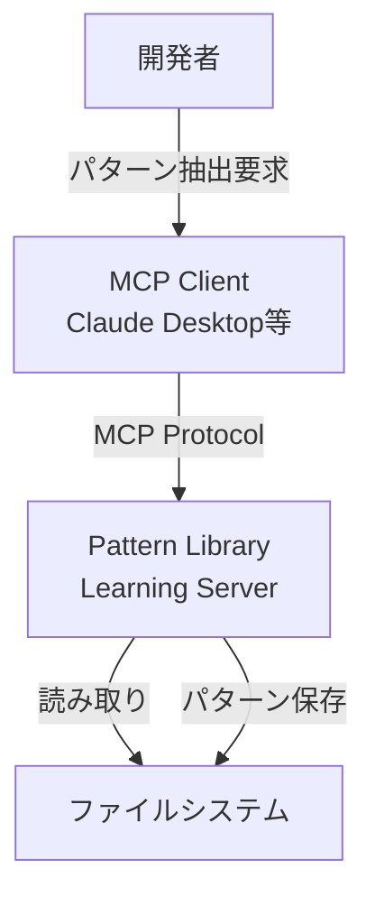
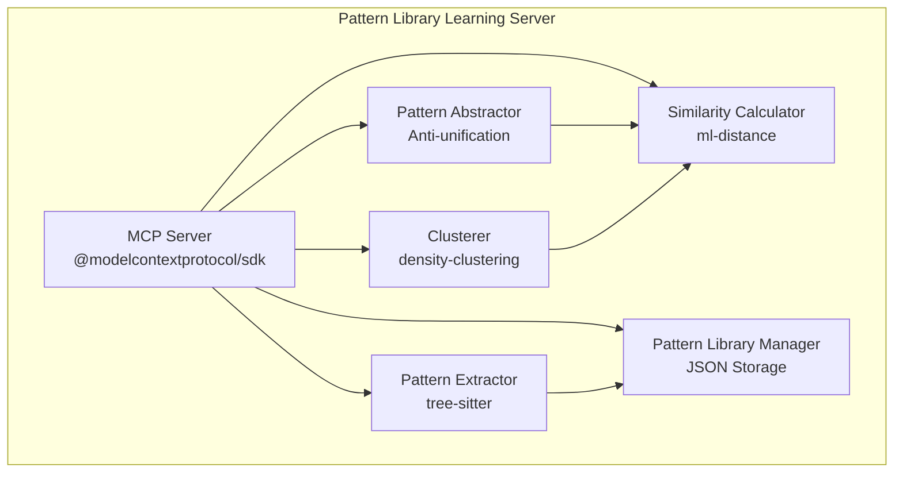

# MUSUBIX Pattern Library Learning MCP 設計書

**文書ID**: DES-PATTERN-001  
**プロジェクト**: MUSUBIX  
**バージョン**: 1.0  
**作成日**: 2026-01-05  
**ステータス**: Draft  
**準拠要件**: REQ-PATTERN-001

---

## 1. 概要

### 1.1 目的

DreamCoder型のWake-Sleep学習アーキテクチャを採用したPattern Library Learning MCPサーバーの設計を定義する。

### 1.2 スコープ

本設計書は以下のコンポーネントを対象とする：
- パターン抽出エンジン
- パターン抽象化エンジン
- 類似度計算モジュール
- クラスタリングモジュール
- パターンライブラリ管理
- MCPサーバー実装

### 1.3 設計原則

| 原則 | 説明 |
|------|------|
| 単一責任 | 各モジュールは1つの責務のみを持つ |
| 依存性逆転 | 抽象に依存し、具象に依存しない |
| 拡張性 | 新しい言語・パターンマッチャーの追加が容易 |
| テスト容易性 | すべてのコンポーネントが単体テスト可能 |

---

## 2. C4アーキテクチャ

### 2.1 Context図



### 2.2 Container図



### 2.3 Component図

```mermaid
graph TB
    subgraph "Pattern Extractor"
        TP[TreeSitterParser]
        AST[ASTTraverser]
        PM[PatternMatcher]
        PF[PatternFilter]
    end
    
    subgraph "Pattern Abstractor"
        AU[AntiUnifier]
        PG[ParameterGenerator]
        TV[TemplateValidator]
    end
    
    subgraph "Similarity Calculator"
        FE[FeatureExtractor]
        VE[VectorEncoder]
        CS[CosineSimilarity]
    end
    
    TP --> AST
    AST --> PM
    PM --> PF
    
    AU --> PG
    PG --> TV
    
    FE --> VE
    VE --> CS
```



---

## 3. 詳細設計

### 3.1 パターン抽出エンジン（REQ-PATTERN-001-F001）

#### 3.1.1 クラス図

```typescript
// packages/pattern-mcp/src/extractor/types.ts

interface PatternExtractor {
  extract(codebase: string, options: ExtractOptions): Promise<Pattern[]>;
}

interface ExtractOptions {
  language: SupportedLanguage;
  minOccurrences: number;
  maxPatternSize: number;
}

type SupportedLanguage = 'typescript' | 'javascript' | 'python' | 'go' | 'rust';

interface Pattern {
  id: string;
  abstraction: string;
  instances: PatternInstance[];
  frequency: number;
  confidence: number;
  metadata: PatternMetadata;
}

interface PatternInstance {
  file: string;
  startLine: number;
  endLine: number;
  code: string;
}

interface PatternMetadata {
  language: SupportedLanguage;
  category: PatternCategory;
  extractedAt: Date;
  version: string;
}

type PatternCategory = 
  | 'control-flow'
  | 'data-structure'
  | 'error-handling'
  | 'api-call'
  | 'initialization'
  | 'transformation';
```

#### 3.1.2 Tree-sitter統合

```typescript
// packages/pattern-mcp/src/extractor/tree-sitter-parser.ts

import Parser from 'tree-sitter';
import TypeScript from 'tree-sitter-typescript';

interface TreeSitterParser {
  parse(code: string, language: SupportedLanguage): SyntaxTree;
  query(tree: SyntaxTree, pattern: string): QueryMatch[];
}

class TreeSitterParserImpl implements TreeSitterParser {
  private parsers: Map<SupportedLanguage, Parser>;
  
  constructor() {
    this.parsers = new Map();
    this.initializeParsers();
  }
  
  private initializeParsers(): void {
    const tsParser = new Parser();
    tsParser.setLanguage(TypeScript.typescript);
    this.parsers.set('typescript', tsParser);
    // 他の言語も同様に初期化
  }
  
  parse(code: string, language: SupportedLanguage): SyntaxTree {
    const parser = this.parsers.get(language);
    if (!parser) {
      throw new Error(`Unsupported language: ${language}`);
    }
    return parser.parse(code);
  }
  
  query(tree: SyntaxTree, pattern: string): QueryMatch[] {
    // Tree-sitterクエリを実行
    const query = new Parser.Query(tree.language, pattern);
    return query.matches(tree.rootNode);
  }
}
```

#### 3.1.3 パターンマッチングアルゴリズム

```typescript
// packages/pattern-mcp/src/extractor/pattern-matcher.ts

interface PatternMatcher {
  findRepeatingStructures(trees: SyntaxTree[]): RawPattern[];
  filterByFrequency(patterns: RawPattern[], minOccurrences: number): RawPattern[];
}

class PatternMatcherImpl implements PatternMatcher {
  findRepeatingStructures(trees: SyntaxTree[]): RawPattern[] {
    const subtreeHashes = new Map<string, ASTNode[]>();
    
    for (const tree of trees) {
      this.traverseAndHash(tree.rootNode, subtreeHashes);
    }
    
    // 出現回数でフィルタリング
    return Array.from(subtreeHashes.entries())
      .filter(([_, nodes]) => nodes.length >= 2)
      .map(([hash, nodes]) => ({
        hash,
        nodes,
        frequency: nodes.length
      }));
  }
  
  private traverseAndHash(node: ASTNode, hashes: Map<string, ASTNode[]>): string {
    // 構造的ハッシュを計算（変数名を正規化）
    const normalizedHash = this.computeStructuralHash(node);
    
    const existing = hashes.get(normalizedHash) || [];
    existing.push(node);
    hashes.set(normalizedHash, existing);
    
    for (const child of node.children) {
      this.traverseAndHash(child, hashes);
    }
    
    return normalizedHash;
  }
  
  private computeStructuralHash(node: ASTNode): string {
    // 変数名・リテラルを正規化してハッシュ化
    const structure = this.normalizeNode(node);
    return crypto.createHash('sha256').update(structure).digest('hex').slice(0, 16);
  }
}
```

---

### 3.2 パターン抽象化エンジン（REQ-PATTERN-001-F002）

#### 3.2.1 Anti-unificationアルゴリズム

```typescript
// packages/pattern-mcp/src/abstractor/anti-unifier.ts

interface AntiUnifier {
  unify(snippets: string[]): AbstractionResult;
}

interface AbstractionResult {
  template: string;
  parameters: Parameter[];
  confidence: number;
}

interface Parameter {
  name: string;
  positions: number[];
  inferredType: string;
}

class AntiUnifierImpl implements AntiUnifier {
  unify(snippets: string[]): AbstractionResult {
    if (snippets.length < 2) {
      throw new Error('At least 2 snippets required for abstraction');
    }
    
    const trees = snippets.map(s => this.parseToTree(s));
    const lca = this.findLeastCommonAbstraction(trees);
    
    return {
      template: this.treeToTemplate(lca.tree),
      parameters: lca.parameters,
      confidence: this.calculateConfidence(lca, snippets)
    };
  }
  
  private findLeastCommonAbstraction(trees: ASTNode[]): LCAResult {
    // 最小共通抽象化を計算
    // 異なる部分をパラメータとして抽出
    const parameters: Parameter[] = [];
    let paramCounter = 0;
    
    const unifiedTree = this.unifyTrees(trees[0], trees.slice(1), (diff) => {
      const param: Parameter = {
        name: `$${paramCounter++}`,
        positions: diff.positions,
        inferredType: this.inferType(diff.values)
      };
      parameters.push(param);
      return param.name;
    });
    
    return { tree: unifiedTree, parameters };
  }
  
  private calculateConfidence(lca: LCAResult, original: string[]): number {
    // 抽象化の品質スコアを計算
    // - パラメータ数が少ないほど高い
    // - 元のコードとの類似度が高いほど高い
    const paramPenalty = Math.max(0, 1 - lca.parameters.length * 0.1);
    const coverageScore = this.calculateCoverage(lca.tree, original);
    return paramPenalty * coverageScore;
  }
}
```

---

### 3.3 類似度計算モジュール（REQ-PATTERN-001-F003）

#### 3.3.1 特徴抽出

```typescript
// packages/pattern-mcp/src/similarity/feature-extractor.ts

interface FeatureExtractor {
  extract(code: string): FeatureVector;
}

interface FeatureVector {
  structural: number[];    // AST構造特徴
  lexical: number[];       // 字句特徴
  semantic: number[];      // 意味特徴
}

class FeatureExtractorImpl implements FeatureExtractor {
  extract(code: string): FeatureVector {
    const tree = this.parse(code);
    
    return {
      structural: this.extractStructuralFeatures(tree),
      lexical: this.extractLexicalFeatures(code),
      semantic: this.extractSemanticFeatures(tree)
    };
  }
  
  private extractStructuralFeatures(tree: ASTNode): number[] {
    // ノードタイプのヒストグラム
    const nodeTypes = new Map<string, number>();
    this.traverseForNodeTypes(tree, nodeTypes);
    return this.normalizeHistogram(nodeTypes);
  }
  
  private extractLexicalFeatures(code: string): number[] {
    // トークン頻度、行数、複雑度など
    const tokens = this.tokenize(code);
    return [
      tokens.length,
      code.split('\n').length,
      this.calculateCyclomaticComplexity(code)
    ];
  }
  
  private extractSemanticFeatures(tree: ASTNode): number[] {
    // 関数呼び出し、変数使用パターンなど
    const calls = this.extractFunctionCalls(tree);
    const variables = this.extractVariableUsage(tree);
    return [...this.encodeCallPattern(calls), ...this.encodeVarPattern(variables)];
  }
}
```

#### 3.3.2 類似度計算

```typescript
// packages/pattern-mcp/src/similarity/similarity-calculator.ts

import { cosine } from 'ml-distance';

interface SimilarityCalculator {
  calculate(code1: string, code2: string): number;
  calculateBatch(codes: string[]): SimilarityMatrix;
}

interface SimilarityMatrix {
  codes: string[];        // 入力コードの配列
  matrix: number[][];     // N×N類似度行列（0〜1）
}

class SimilarityCalculatorImpl implements SimilarityCalculator {
  private featureExtractor: FeatureExtractor;
  
  constructor(featureExtractor: FeatureExtractor) {
    this.featureExtractor = featureExtractor;
  }
  
  calculate(code1: string, code2: string): number {
    const v1 = this.featureExtractor.extract(code1);
    const v2 = this.featureExtractor.extract(code2);
    
    const combined1 = [...v1.structural, ...v1.lexical, ...v1.semantic];
    const combined2 = [...v2.structural, ...v2.lexical, ...v2.semantic];
    
    // コサイン類似度（0〜1）
    return 1 - cosine(combined1, combined2);
  }
  
  calculateBatch(codes: string[]): SimilarityMatrix {
    const vectors = codes.map(c => this.featureExtractor.extract(c));
    const matrix: number[][] = [];
    
    for (let i = 0; i < codes.length; i++) {
      matrix[i] = [];
      for (let j = 0; j < codes.length; j++) {
        if (i === j) {
          matrix[i][j] = 1.0;
        } else if (j < i) {
          matrix[i][j] = matrix[j][i];
        } else {
          matrix[i][j] = this.calculateFromVectors(vectors[i], vectors[j]);
        }
      }
    }
    
    return { codes, matrix };
  }
}
```

---

### 3.4 クラスタリングモジュール（REQ-PATTERN-001-F004）

```typescript
// packages/pattern-mcp/src/clustering/pattern-clusterer.ts

import { DBSCAN } from 'density-clustering';

interface PatternClusterer {
  cluster(patterns: Pattern[], similarityMatrix: SimilarityMatrix): ClusterResult;
}

interface ClusterResult {
  clusters: Cluster[];
  noise: Pattern[];
}

interface Cluster {
  id: string;
  representative: Pattern;
  members: Pattern[];
  cohesion: number;
}

class PatternClustererImpl implements PatternClusterer {
  cluster(patterns: Pattern[], similarityMatrix: SimilarityMatrix): ClusterResult {
    // 類似度を距離に変換（1 - similarity）
    const distanceMatrix = similarityMatrix.matrix.map(row => 
      row.map(sim => 1 - sim)
    );
    
    const dbscan = new DBSCAN();
    const clusterIndices = dbscan.run(distanceMatrix, 0.3, 2);
    
    const clusters: Cluster[] = clusterIndices.map((indices, i) => {
      const members = indices.map(idx => patterns[idx]);
      const representative = this.selectRepresentative(members);
      
      return {
        id: `cluster-${i}`,
        representative,
        members,
        cohesion: this.calculateCohesion(members, similarityMatrix)
      };
    });
    
    // ノイズ（どのクラスタにも属さないパターン）
    const clusteredIndices = new Set(clusterIndices.flat());
    const noise = patterns.filter((_, i) => !clusteredIndices.has(i));
    
    return { clusters, noise };
  }
  
  private selectRepresentative(members: Pattern[]): Pattern {
    // 最も頻度が高く、かつ中心に近いパターンを選択
    return members.reduce((best, current) => 
      current.frequency > best.frequency ? current : best
    );
  }
}
```

---

### 3.5 パターンライブラリ管理（REQ-PATTERN-001-F005）

```typescript
// packages/pattern-mcp/src/library/pattern-library.ts

interface PatternLibrary {
  add(pattern: Pattern): Promise<void>;
  update(id: string, pattern: Partial<Pattern>): Promise<void>;
  delete(id: string): Promise<void>;
  get(id: string): Promise<Pattern | null>;
  list(filter?: PatternFilter): Promise<Pattern[]>;
  export(path: string): Promise<void>;
  import(path: string): Promise<void>;
}

interface PatternFilter {
  category?: PatternCategory;
  language?: SupportedLanguage;
  minFrequency?: number;
  minConfidence?: number;
}

class PatternLibraryImpl implements PatternLibrary {
  private storagePath: string;
  private patterns: Map<string, Pattern>;
  private versionHistory: Map<string, PatternVersion[]>;
  
  constructor(storagePath: string) {
    this.storagePath = storagePath;
    this.patterns = new Map();
    this.versionHistory = new Map();
  }
  
  async add(pattern: Pattern): Promise<void> {
    // 重複チェック
    if (this.patterns.has(pattern.id)) {
      throw new Error(`Pattern ${pattern.id} already exists`);
    }
    
    // 機密情報フィルタリング（REQ-PATTERN-001-F007）
    const sanitized = this.sanitizePattern(pattern);
    
    this.patterns.set(pattern.id, sanitized);
    await this.persist();
  }
  
  async update(id: string, updates: Partial<Pattern>): Promise<void> {
    const existing = this.patterns.get(id);
    if (!existing) {
      throw new Error(`Pattern ${id} not found`);
    }
    
    // バージョン履歴に追加
    const history = this.versionHistory.get(id) || [];
    history.push({
      version: history.length + 1,
      pattern: { ...existing },
      updatedAt: new Date()
    });
    this.versionHistory.set(id, history);
    
    // 更新
    const updated = { ...existing, ...updates };
    this.patterns.set(id, this.sanitizePattern(updated));
    await this.persist();
  }
  
  private sanitizePattern(pattern: Pattern): Pattern {
    // 機密情報をフィルタリング
    const sensitivePatterns = [
      /api[_-]?key/i,
      /password/i,
      /secret/i,
      /token/i,
      /credential/i
    ];
    
    let sanitizedAbstraction = pattern.abstraction;
    for (const regex of sensitivePatterns) {
      sanitizedAbstraction = sanitizedAbstraction.replace(regex, '[REDACTED]');
    }
    
    return {
      ...pattern,
      abstraction: sanitizedAbstraction,
      instances: pattern.instances.map(inst => ({
        ...inst,
        code: this.sanitizeCode(inst.code)
      }))
    };
  }
  
  private async persist(): Promise<void> {
    const data = {
      version: '1.0',
      patterns: Array.from(this.patterns.values()),
      metadata: {
        updatedAt: new Date().toISOString(),
        count: this.patterns.size
      }
    };
    
    await fs.writeFile(
      this.storagePath,
      JSON.stringify(data, null, 2),
      'utf-8'
    );
  }
}
```

---

### 3.6 ライブラリ圧縮（REQ-PATTERN-001-F006）

```typescript
// packages/pattern-mcp/src/library/library-compressor.ts

interface LibraryCompressor {
  compress(library: PatternLibrary): Promise<CompressionResult>;
}

interface CompressionResult {
  originalCount: number;
  compressedCount: number;
  removedRedundant: number;
  mergedCount: number;
  compressionRatio: number;
}

class LibraryCompressorImpl implements LibraryCompressor {
  private similarityCalculator: SimilarityCalculator;
  private antiUnifier: AntiUnifier;
  
  async compress(library: PatternLibrary): Promise<CompressionResult> {
    const patterns = await library.list();
    const originalCount = patterns.length;
    
    // 1. 冗長パターンを検出
    const redundant = this.detectRedundant(patterns);
    
    // 2. 類似パターンをマージ
    const merged = this.mergeSimilar(patterns, redundant);
    
    // 3. ライブラリを更新
    for (const pattern of redundant) {
      await library.delete(pattern.id);
    }
    
    for (const mergedPattern of merged.newPatterns) {
      await library.add(mergedPattern);
    }
    
    const compressedCount = originalCount - redundant.length + merged.newPatterns.length;
    
    return {
      originalCount,
      compressedCount,
      removedRedundant: redundant.length,
      mergedCount: merged.mergedGroups,
      compressionRatio: compressedCount / originalCount
    };
  }
  
  private detectRedundant(patterns: Pattern[]): Pattern[] {
    // 完全に包含されるパターンを検出
    const redundant: Pattern[] = [];
    
    for (const p1 of patterns) {
      for (const p2 of patterns) {
        if (p1.id !== p2.id && this.isSubsumed(p1, p2)) {
          redundant.push(p1);
          break;
        }
      }
    }
    
    return redundant;
  }
  
  private mergeSimilar(patterns: Pattern[], exclude: Pattern[]): MergeResult {
    const remaining = patterns.filter(p => !exclude.includes(p));
    const similarity = this.similarityCalculator.calculateBatch(
      remaining.map(p => p.abstraction)
    );
    
    const groups = this.findMergeGroups(remaining, similarity, 0.9);
    const newPatterns: Pattern[] = [];
    
    for (const group of groups) {
      if (group.length > 1) {
        const merged = this.antiUnifier.unify(group.map(p => p.abstraction));
        newPatterns.push({
          id: `merged-${Date.now()}`,
          abstraction: merged.template,
          instances: group.flatMap(p => p.instances),
          frequency: group.reduce((sum, p) => sum + p.frequency, 0),
          confidence: merged.confidence,
          metadata: group[0].metadata
        });
      }
    }
    
    return { newPatterns, mergedGroups: groups.filter(g => g.length > 1).length };
  }
}
```

---

## 4. MCPサーバー実装

### 4.1 サーバー構成

```typescript
// packages/pattern-mcp/src/server/index.ts

import { Server } from '@modelcontextprotocol/sdk/server/index.js';
import { StdioServerTransport } from '@modelcontextprotocol/sdk/server/stdio.js';

const server = new Server(
  {
    name: 'musubix-pattern-library',
    version: '1.0.0',
  },
  {
    capabilities: {
      tools: {},
    },
  }
);

// ツール登録
server.setRequestHandler(ListToolsRequestSchema, async () => ({
  tools: [
    {
      name: 'extract_patterns',
      description: 'コードベースから再利用可能なパターンを抽出',
      inputSchema: { /* ... */ }
    },
    {
      name: 'suggest_abstraction',
      description: '類似コードから抽象化を提案',
      inputSchema: { /* ... */ }
    },
    {
      name: 'compress_library',
      description: 'パターンライブラリを圧縮・最適化',
      inputSchema: { /* ... */ }
    }
  ]
}));

// ツール実行ハンドラ
server.setRequestHandler(CallToolRequestSchema, async (request) => {
  switch (request.params.name) {
    case 'extract_patterns':
      return handleExtractPatterns(request.params.arguments);
    case 'suggest_abstraction':
      return handleSuggestAbstraction(request.params.arguments);
    case 'compress_library':
      return handleCompressLibrary(request.params.arguments);
    default:
      throw new Error(`Unknown tool: ${request.params.name}`);
  }
});
```

---

## 5. ディレクトリ構成

```
packages/pattern-mcp/
├── src/
│   ├── server/
│   │   └── index.ts
│   ├── extractor/
│   │   ├── types.ts
│   │   ├── tree-sitter-parser.ts
│   │   ├── pattern-matcher.ts
│   │   └── index.ts
│   ├── abstractor/
│   │   ├── anti-unifier.ts
│   │   ├── parameter-generator.ts
│   │   └── index.ts
│   ├── similarity/
│   │   ├── feature-extractor.ts
│   │   ├── similarity-calculator.ts
│   │   └── index.ts
│   ├── clustering/
│   │   ├── pattern-clusterer.ts
│   │   └── index.ts
│   ├── library/
│   │   ├── pattern-library.ts
│   │   ├── library-compressor.ts
│   │   └── index.ts
│   └── index.ts
├── tests/
│   ├── extractor/
│   ├── abstractor/
│   ├── similarity/
│   ├── clustering/
│   └── library/
├── package.json
└── tsconfig.json
```

---

## 6. テスト戦略

### 6.1 ユニットテスト

| モジュール | テスト対象 | カバレッジ目標 |
|-----------|-----------|---------------|
| TreeSitterParser | AST生成、クエリ実行 | 90% |
| PatternMatcher | 構造ハッシュ、繰り返し検出 | 85% |
| AntiUnifier | 抽象化、パラメータ抽出 | 90% |
| SimilarityCalculator | 類似度計算 | 95% |
| PatternLibrary | CRUD操作、永続化 | 90% |

### 6.2 統合テスト

| シナリオ | 検証内容 |
|---------|---------|
| E2E抽出 | コードベース → パターン抽出 → ライブラリ保存 |
| 抽象化提案 | 類似コード入力 → 抽象化生成 |
| ライブラリ圧縮 | 冗長除去 → マージ → 最適化 |

---

## 7. 依存関係

```json
{
  "dependencies": {
    "@modelcontextprotocol/sdk": "^1.0.0",
    "tree-sitter": "^0.21.0",
    "tree-sitter-typescript": "^0.21.0",
    "tree-sitter-javascript": "^0.21.0",
    "tree-sitter-python": "^0.21.0",
    "tree-sitter-go": "^0.21.0",
    "tree-sitter-rust": "^0.21.0",
    "ml-distance": "^4.0.0",
    "density-clustering": "^1.3.0"
  }
}
```

---

## 8. トレーサビリティ

| 設計セクション | 要件 | タスク |
|---------------|------|--------|
| 3.1 パターン抽出 | REQ-PATTERN-001-F001 | TSK-PATTERN-001 |
| 3.2 パターン抽象化 | REQ-PATTERN-001-F002 | TSK-PATTERN-002 |
| 3.3 類似度計算 | REQ-PATTERN-001-F003 | TSK-PATTERN-003 |
| 3.4 クラスタリング | REQ-PATTERN-001-F004 | TSK-PATTERN-004 |
| 3.5 ライブラリ管理 | REQ-PATTERN-001-F005 | TSK-PATTERN-005 |
| 3.6 ライブラリ圧縮 | REQ-PATTERN-001-F006 | TSK-PATTERN-006 |
| 3.5 プライバシー保護 | REQ-PATTERN-001-F007 | TSK-PATTERN-007 |

---

**文書履歴**:
| バージョン | 日付 | 変更内容 | 作成者 |
|-----------|------|---------|--------|
| 1.0 | 2026-01-05 | 初版作成 | Claude |
