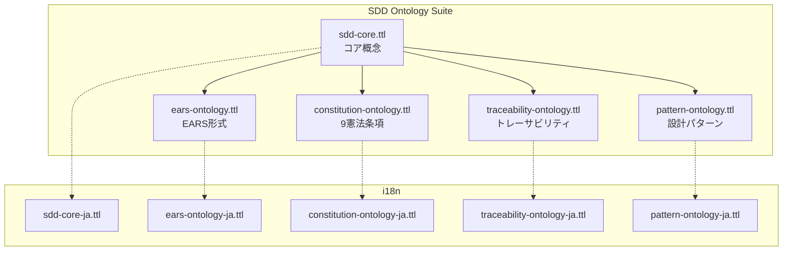

# MUSUBIX SDDオントロジー構築 設計書

**文書ID**: DES-SDD-ONTO-001  
**プロジェクト**: MUSUBIX  
**バージョン**: 1.0  
**作成日**: 2026-01-05  
**ステータス**: Draft  
**準拠要件**: REQ-SDD-ONTO-001

---

## 1. 概要

### 1.1 目的

Software-Driven Development（SDD）ドメインの形式オントロジーの設計を定義する。要件・設計・コード・テストの概念と関係を形式的に表現し、知識ベースの推論と一貫性検証を可能にする。

### 1.2 スコープ

本設計書は以下のコンポーネントを対象とする：
- SDDコアオントロジー（4大概念）
- EARSオントロジー（5パターン）
- 憲法条項オントロジー（9条項）
- 設計パターンオントロジー
- トレーサビリティ関係定義
- OWL 2 RL推論ルール

### 1.3 設計原則

| 原則 | 説明 |
|------|------|
| OWL 2 RL準拠 | ルールベース推論が可能なサブセット |
| モジュラー設計 | 概念ごとに独立したファイル |
| セマンティックバージョニング | MAJOR.MINOR.PATCH |
| i18n対応 | 日本語ラベルは別ファイル管理 |

---

## 2. オントロジーアーキテクチャ

### 2.1 モジュール構成



### 2.2 名前空間設計

| プレフィックス | IRI | 用途 |
|--------------|-----|------|
| `sdd:` | `http://musubix.dev/ontology/sdd#` | SDDコア概念 |
| `ears:` | `http://musubix.dev/ontology/ears#` | EARS形式 |
| `const:` | `http://musubix.dev/ontology/constitution#` | 9憲法条項 |
| `pattern:` | `http://musubix.dev/ontology/pattern#` | 設計パターン |
| `trace:` | `http://musubix.dev/ontology/traceability#` | トレーサビリティ |

---

## 3. 詳細設計

### 3.1 SDDコアオントロジー（REQ-SDD-ONTO-001-F001）

#### 3.1.1 概念階層

```turtle
# sdd-core.ttl

@prefix sdd: <http://musubix.dev/ontology/sdd#> .
@prefix owl: <http://www.w3.org/2002/07/owl#> .
@prefix rdfs: <http://www.w3.org/2000/01/rdf-schema#> .
@prefix xsd: <http://www.w3.org/2001/XMLSchema#> .

# オントロジーメタデータ
<http://musubix.dev/ontology/sdd> a owl:Ontology ;
    rdfs:label "MUSUBIX SDD Core Ontology"@en ;
    rdfs:comment "Software-Driven Development core concepts"@en ;
    owl:versionInfo "1.0.0" ;
    owl:priorVersion <http://musubix.dev/ontology/sdd/0.9.0> .

# ===================
# 抽象基底クラス
# ===================

sdd:Artifact a owl:Class ;
    rdfs:label "Artifact"@en ;
    rdfs:comment "Abstract base class for all SDD artifacts"@en .

# ===================
# 4大概念
# ===================

sdd:Requirement a owl:Class ;
    rdfs:subClassOf sdd:Artifact ;
    rdfs:label "Requirement"@en ;
    rdfs:comment "A statement of need or expectation"@en ;
    owl:disjointWith sdd:Design, sdd:Code, sdd:Test .

sdd:Design a owl:Class ;
    rdfs:subClassOf sdd:Artifact ;
    rdfs:label "Design"@en ;
    rdfs:comment "A specification of how to implement requirements"@en ;
    owl:disjointWith sdd:Requirement, sdd:Code, sdd:Test .

sdd:Code a owl:Class ;
    rdfs:subClassOf sdd:Artifact ;
    rdfs:label "Code"@en ;
    rdfs:comment "Source code implementing a design"@en ;
    owl:disjointWith sdd:Requirement, sdd:Design, sdd:Test .

sdd:Test a owl:Class ;
    rdfs:subClassOf sdd:Artifact ;
    rdfs:label "Test"@en ;
    rdfs:comment "Verification artifact for code"@en ;
    owl:disjointWith sdd:Requirement, sdd:Design, sdd:Code .

# ===================
# Requirementサブクラス
# ===================

sdd:FunctionalRequirement a owl:Class ;
    rdfs:subClassOf sdd:Requirement ;
    rdfs:label "Functional Requirement"@en .

sdd:NonFunctionalRequirement a owl:Class ;
    rdfs:subClassOf sdd:Requirement ;
    rdfs:label "Non-Functional Requirement"@en ;
    owl:disjointWith sdd:FunctionalRequirement .

sdd:PerformanceRequirement a owl:Class ;
    rdfs:subClassOf sdd:NonFunctionalRequirement ;
    rdfs:label "Performance Requirement"@en .

sdd:SecurityRequirement a owl:Class ;
    rdfs:subClassOf sdd:NonFunctionalRequirement ;
    rdfs:label "Security Requirement"@en .

sdd:UsabilityRequirement a owl:Class ;
    rdfs:subClassOf sdd:NonFunctionalRequirement ;
    rdfs:label "Usability Requirement"@en .

# ===================
# Designサブクラス
# ===================

sdd:ArchitectureDesign a owl:Class ;
    rdfs:subClassOf sdd:Design ;
    rdfs:label "Architecture Design"@en .

sdd:DetailedDesign a owl:Class ;
    rdfs:subClassOf sdd:Design ;
    rdfs:label "Detailed Design"@en .

# C4モデル
sdd:C4Context a owl:Class ;
    rdfs:subClassOf sdd:ArchitectureDesign ;
    rdfs:label "C4 Context Diagram"@en .

sdd:C4Container a owl:Class ;
    rdfs:subClassOf sdd:ArchitectureDesign ;
    rdfs:label "C4 Container Diagram"@en .

sdd:C4Component a owl:Class ;
    rdfs:subClassOf sdd:ArchitectureDesign ;
    rdfs:label "C4 Component Diagram"@en .

sdd:C4Code a owl:Class ;
    rdfs:subClassOf sdd:DetailedDesign ;
    rdfs:label "C4 Code Diagram"@en .

# ===================
# Codeサブクラス
# ===================

sdd:Module a owl:Class ;
    rdfs:subClassOf sdd:Code ;
    rdfs:label "Module"@en .

sdd:Class a owl:Class ;
    rdfs:subClassOf sdd:Code ;
    rdfs:label "Class"@en .

sdd:Function a owl:Class ;
    rdfs:subClassOf sdd:Code ;
    rdfs:label "Function"@en .

sdd:Variable a owl:Class ;
    rdfs:subClassOf sdd:Code ;
    rdfs:label "Variable"@en .

# ===================
# Testサブクラス
# ===================

sdd:UnitTest a owl:Class ;
    rdfs:subClassOf sdd:Test ;
    rdfs:label "Unit Test"@en .

sdd:IntegrationTest a owl:Class ;
    rdfs:subClassOf sdd:Test ;
    rdfs:label "Integration Test"@en .

sdd:E2ETest a owl:Class ;
    rdfs:subClassOf sdd:Test ;
    rdfs:label "E2E Test"@en .

sdd:SecurityTest a owl:Class ;
    rdfs:subClassOf sdd:Test ;
    rdfs:label "Security Test"@en .

# ===================
# 共通データプロパティ
# ===================

sdd:hasId a owl:DatatypeProperty, owl:FunctionalProperty ;
    rdfs:domain sdd:Artifact ;
    rdfs:range xsd:string ;
    rdfs:label "has ID"@en .

sdd:hasVersion a owl:DatatypeProperty ;
    rdfs:domain sdd:Artifact ;
    rdfs:range xsd:string ;
    rdfs:label "has version"@en .

sdd:createdAt a owl:DatatypeProperty, owl:FunctionalProperty ;
    rdfs:domain sdd:Artifact ;
    rdfs:range xsd:dateTime ;
    rdfs:label "created at"@en .

sdd:modifiedAt a owl:DatatypeProperty ;
    rdfs:domain sdd:Artifact ;
    rdfs:range xsd:dateTime ;
    rdfs:label "modified at"@en .

sdd:hasPriority a owl:DatatypeProperty ;
    rdfs:domain sdd:Requirement ;
    rdfs:range xsd:string ;
    rdfs:label "has priority"@en ;
    rdfs:comment "P0 (必須), P1 (重要), P2 (任意)"@en .

sdd:hasStatus a owl:DatatypeProperty ;
    rdfs:domain sdd:Artifact ;
    rdfs:range xsd:string ;
    rdfs:label "has status"@en .
```

#### 3.1.2 日本語ラベルファイル

```turtle
# sdd-core-ja.ttl

@prefix sdd: <http://musubix.dev/ontology/sdd#> .
@prefix rdfs: <http://www.w3.org/2000/01/rdf-schema#> .

sdd:Artifact rdfs:label "成果物"@ja ;
    rdfs:comment "すべてのSDD成果物の抽象基底クラス"@ja .

sdd:Requirement rdfs:label "要件"@ja ;
    rdfs:comment "必要性や期待の表明"@ja .

sdd:Design rdfs:label "設計"@ja ;
    rdfs:comment "要件を実装する方法の仕様"@ja .

sdd:Code rdfs:label "コード"@ja ;
    rdfs:comment "設計を実装するソースコード"@ja .

sdd:Test rdfs:label "テスト"@ja ;
    rdfs:comment "コードの検証成果物"@ja .

sdd:FunctionalRequirement rdfs:label "機能要件"@ja .
sdd:NonFunctionalRequirement rdfs:label "非機能要件"@ja .
sdd:PerformanceRequirement rdfs:label "性能要件"@ja .
sdd:SecurityRequirement rdfs:label "セキュリティ要件"@ja .
sdd:UsabilityRequirement rdfs:label "ユーザビリティ要件"@ja .

sdd:ArchitectureDesign rdfs:label "アーキテクチャ設計"@ja .
sdd:DetailedDesign rdfs:label "詳細設計"@ja .
sdd:C4Context rdfs:label "C4コンテキスト図"@ja .
sdd:C4Container rdfs:label "C4コンテナ図"@ja .
sdd:C4Component rdfs:label "C4コンポーネント図"@ja .
sdd:C4Code rdfs:label "C4コード図"@ja .

sdd:Module rdfs:label "モジュール"@ja .
sdd:Class rdfs:label "クラス"@ja .
sdd:Function rdfs:label "関数"@ja .
sdd:Variable rdfs:label "変数"@ja .

sdd:UnitTest rdfs:label "ユニットテスト"@ja .
sdd:IntegrationTest rdfs:label "統合テスト"@ja .
sdd:E2ETest rdfs:label "E2Eテスト"@ja .
sdd:SecurityTest rdfs:label "セキュリティテスト"@ja .

sdd:hasId rdfs:label "ID"@ja .
sdd:hasVersion rdfs:label "バージョン"@ja .
sdd:createdAt rdfs:label "作成日時"@ja .
sdd:modifiedAt rdfs:label "更新日時"@ja .
sdd:hasPriority rdfs:label "優先度"@ja .
sdd:hasStatus rdfs:label "ステータス"@ja .
```

---

### 3.2 EARSオントロジー（REQ-SDD-ONTO-001-F002）

```turtle
# ears-ontology.ttl

@prefix ears: <http://musubix.dev/ontology/ears#> .
@prefix sdd: <http://musubix.dev/ontology/sdd#> .
@prefix owl: <http://www.w3.org/2002/07/owl#> .
@prefix rdfs: <http://www.w3.org/2000/01/rdf-schema#> .
@prefix xsd: <http://www.w3.org/2001/XMLSchema#> .

<http://musubix.dev/ontology/ears> a owl:Ontology ;
    rdfs:label "MUSUBIX EARS Ontology"@en ;
    owl:imports <http://musubix.dev/ontology/sdd> ;
    owl:versionInfo "1.0.0" .

# ===================
# EARS要件クラス
# ===================

ears:UbiquitousRequirement a owl:Class ;
    rdfs:subClassOf sdd:FunctionalRequirement ;
    rdfs:label "Ubiquitous Requirement"@en ;
    rdfs:comment "THE [system] SHALL [requirement]"@en .

ears:EventDrivenRequirement a owl:Class ;
    rdfs:subClassOf sdd:FunctionalRequirement ;
    rdfs:label "Event-Driven Requirement"@en ;
    rdfs:comment "WHEN [trigger], THE [system] SHALL [response]"@en .

ears:StateDrivenRequirement a owl:Class ;
    rdfs:subClassOf sdd:FunctionalRequirement ;
    rdfs:label "State-Driven Requirement"@en ;
    rdfs:comment "WHILE [state], THE [system] SHALL [response]"@en .

ears:OptionalRequirement a owl:Class ;
    rdfs:subClassOf sdd:FunctionalRequirement ;
    rdfs:label "Optional Requirement"@en ;
    rdfs:comment "IF [condition], THEN THE [system] SHALL [response]"@en .

ears:UnwantedRequirement a owl:Class ;
    rdfs:subClassOf sdd:NonFunctionalRequirement ;
    rdfs:label "Unwanted Requirement"@en ;
    rdfs:comment "THE [system] SHALL NOT [unwanted behavior]"@en .

# ===================
# EARS構成要素プロパティ
# ===================

ears:hasSystem a owl:DatatypeProperty ;
    rdfs:domain sdd:Requirement ;
    rdfs:range xsd:string ;
    rdfs:label "has system"@en ;
    rdfs:comment "The system name in EARS statement"@en .

ears:hasTrigger a owl:DatatypeProperty ;
    rdfs:domain ears:EventDrivenRequirement ;
    rdfs:range xsd:string ;
    rdfs:label "has trigger"@en ;
    rdfs:comment "The triggering event for Event-Driven requirements"@en .

ears:hasState a owl:DatatypeProperty ;
    rdfs:domain ears:StateDrivenRequirement ;
    rdfs:range xsd:string ;
    rdfs:label "has state"@en ;
    rdfs:comment "The state condition for State-Driven requirements"@en .

ears:hasCondition a owl:DatatypeProperty ;
    rdfs:domain ears:OptionalRequirement ;
    rdfs:range xsd:string ;
    rdfs:label "has condition"@en ;
    rdfs:comment "The condition for Optional requirements"@en .

ears:hasResponse a owl:DatatypeProperty ;
    rdfs:domain sdd:FunctionalRequirement ;
    rdfs:range xsd:string ;
    rdfs:label "has response"@en ;
    rdfs:comment "The expected system response"@en .

ears:hasUnwantedBehavior a owl:DatatypeProperty ;
    rdfs:domain ears:UnwantedRequirement ;
    rdfs:range xsd:string ;
    rdfs:label "has unwanted behavior"@en ;
    rdfs:comment "The behavior that must be avoided"@en .

# ===================
# EARS検証ルール（SHACL形式の概念）
# ===================

# Event-Driven要件はtriggerを持つ必要がある
ears:EventDrivenRequirementShape a owl:Class ;
    rdfs:subClassOf [
        a owl:Restriction ;
        owl:onProperty ears:hasTrigger ;
        owl:minCardinality 1
    ] .

# State-Driven要件はstateを持つ必要がある
ears:StateDrivenRequirementShape a owl:Class ;
    rdfs:subClassOf [
        a owl:Restriction ;
        owl:onProperty ears:hasState ;
        owl:minCardinality 1
    ] .
```

---

### 3.3 憲法条項オントロジー（REQ-SDD-ONTO-001-F004）

```turtle
# constitution-ontology.ttl

@prefix const: <http://musubix.dev/ontology/constitution#> .
@prefix sdd: <http://musubix.dev/ontology/sdd#> .
@prefix owl: <http://www.w3.org/2002/07/owl#> .
@prefix rdfs: <http://www.w3.org/2000/01/rdf-schema#> .
@prefix xsd: <http://www.w3.org/2001/XMLSchema#> .

<http://musubix.dev/ontology/constitution> a owl:Ontology ;
    rdfs:label "MUSUBIX Constitution Ontology"@en ;
    owl:imports <http://musubix.dev/ontology/sdd> ;
    owl:versionInfo "1.0.0" .

# ===================
# 憲法条項クラス
# ===================

const:ConstitutionArticle a owl:Class ;
    rdfs:label "Constitution Article"@en ;
    rdfs:comment "An article of the MUSUBIX constitution"@en .

# ===================
# 9条項インスタンス
# ===================

const:Article1_LibraryFirst a const:ConstitutionArticle ;
    const:articleNumber 1 ;
    const:name "Library-First Principle"@en ;
    const:description "機能は独立ライブラリとして開始"@ja ;
    const:shortCode "LIB-FIRST" .

const:Article2_CLIInterface a const:ConstitutionArticle ;
    const:articleNumber 2 ;
    const:name "CLI Interface Mandate"@en ;
    const:description "すべてのライブラリはCLI公開必須"@ja ;
    const:shortCode "CLI-MANDATE" .

const:Article3_TestFirst a const:ConstitutionArticle ;
    const:articleNumber 3 ;
    const:name "Test-First Imperative"@en ;
    const:description "Red-Green-Blueサイクルでテスト先行"@ja ;
    const:shortCode "TEST-FIRST" .

const:Article4_EARSFormat a const:ConstitutionArticle ;
    const:articleNumber 4 ;
    const:name "EARS Requirement Format"@en ;
    const:description "要件はEARS形式で記述"@ja ;
    const:shortCode "EARS-FORMAT" .

const:Article5_Traceability a const:ConstitutionArticle ;
    const:articleNumber 5 ;
    const:name "Complete Traceability"@en ;
    const:description "要件↔設計↔コード↔テストの100%追跡"@ja ;
    const:shortCode "FULL-TRACE" .

const:Article6_ProjectMemory a const:ConstitutionArticle ;
    const:articleNumber 6 ;
    const:name "Project Memory Reference"@en ;
    const:description "steering/を参照してから決定"@ja ;
    const:shortCode "PROJ-MEMORY" .

const:Article7_DesignPatterns a const:ConstitutionArticle ;
    const:articleNumber 7 ;
    const:name "Design Pattern Documentation"@en ;
    const:description "設計パターン適用の文書化"@ja ;
    const:shortCode "PATTERN-DOC" .

const:Article8_DecisionRecords a const:ConstitutionArticle ;
    const:articleNumber 8 ;
    const:name "ADR Requirement"@en ;
    const:description "すべての決定をADRで記録"@ja ;
    const:shortCode "ADR-REQ" .

const:Article9_QualityGates a const:ConstitutionArticle ;
    const:articleNumber 9 ;
    const:name "Quality Gate Enforcement"@en ;
    const:description "フェーズ移行前の品質検証"@ja ;
    const:shortCode "QUAL-GATE" .

# ===================
# 憲法条項プロパティ
# ===================

const:articleNumber a owl:DatatypeProperty, owl:FunctionalProperty ;
    rdfs:domain const:ConstitutionArticle ;
    rdfs:range xsd:integer ;
    rdfs:label "article number"@en .

const:name a owl:DatatypeProperty ;
    rdfs:domain const:ConstitutionArticle ;
    rdfs:range xsd:string ;
    rdfs:label "name"@en .

const:description a owl:DatatypeProperty ;
    rdfs:domain const:ConstitutionArticle ;
    rdfs:range xsd:string ;
    rdfs:label "description"@en .

const:shortCode a owl:DatatypeProperty ;
    rdfs:domain const:ConstitutionArticle ;
    rdfs:range xsd:string ;
    rdfs:label "short code"@en .

# ===================
# 違反関係
# ===================

const:violatesArticle a owl:ObjectProperty ;
    rdfs:domain sdd:Artifact ;
    rdfs:range const:ConstitutionArticle ;
    rdfs:label "violates article"@en ;
    rdfs:comment "Indicates that an artifact violates a constitution article"@en .

const:compliesWithArticle a owl:ObjectProperty ;
    rdfs:domain sdd:Artifact ;
    rdfs:range const:ConstitutionArticle ;
    rdfs:label "complies with article"@en ;
    rdfs:comment "Indicates that an artifact complies with a constitution article"@en .
```

---

### 3.4 トレーサビリティ関係（REQ-SDD-ONTO-001-F003）

```turtle
# traceability-ontology.ttl

@prefix trace: <http://musubix.dev/ontology/traceability#> .
@prefix sdd: <http://musubix.dev/ontology/sdd#> .
@prefix owl: <http://www.w3.org/2002/07/owl#> .
@prefix rdfs: <http://www.w3.org/2000/01/rdf-schema#> .

<http://musubix.dev/ontology/traceability> a owl:Ontology ;
    rdfs:label "MUSUBIX Traceability Ontology"@en ;
    owl:imports <http://musubix.dev/ontology/sdd> ;
    owl:versionInfo "1.0.0" .

# ===================
# 順方向トレーサビリティ
# ===================

# Requirement → Design
sdd:implementedBy a owl:ObjectProperty ;
    rdfs:domain sdd:Requirement ;
    rdfs:range sdd:Design ;
    owl:inverseOf sdd:implements ;
    rdfs:label "implemented by"@en .

sdd:implements a owl:ObjectProperty ;
    rdfs:domain sdd:Design ;
    rdfs:range sdd:Requirement ;
    rdfs:label "implements"@en .

# Design → Code
sdd:realizedBy a owl:ObjectProperty ;
    rdfs:domain sdd:Design ;
    rdfs:range sdd:Code ;
    owl:inverseOf sdd:realizes ;
    rdfs:label "realized by"@en .

sdd:realizes a owl:ObjectProperty ;
    rdfs:domain sdd:Code ;
    rdfs:range sdd:Design ;
    rdfs:label "realizes"@en .

# Code → Test
sdd:testedBy a owl:ObjectProperty ;
    rdfs:domain sdd:Code ;
    rdfs:range sdd:Test ;
    owl:inverseOf sdd:tests ;
    rdfs:label "tested by"@en .

sdd:tests a owl:ObjectProperty ;
    rdfs:domain sdd:Test ;
    rdfs:range sdd:Code ;
    rdfs:label "tests"@en .

# ===================
# 推論可能な関係
# ===================

# Test → Requirement (プロパティチェーンで推論)
sdd:verifies a owl:ObjectProperty ;
    rdfs:domain sdd:Test ;
    rdfs:range sdd:Requirement ;
    rdfs:label "verifies"@en ;
    rdfs:comment "Derived: Test verifies Requirement through Code and Design"@en ;
    owl:propertyChainAxiom (sdd:tests sdd:realizes sdd:implements) .

# ===================
# 推移的依存関係
# ===================

sdd:dependsOn a owl:ObjectProperty, owl:TransitiveProperty ;
    rdfs:domain sdd:Artifact ;
    rdfs:range sdd:Artifact ;
    rdfs:label "depends on"@en ;
    rdfs:comment "Transitive dependency between artifacts"@en .

# ===================
# 汎用トレーサビリティ
# ===================

trace:tracesTo a owl:ObjectProperty, owl:TransitiveProperty ;
    rdfs:domain sdd:Artifact ;
    rdfs:range sdd:Artifact ;
    rdfs:label "traces to"@en ;
    rdfs:comment "Generic traceability link between any artifacts"@en .

trace:traceType a owl:DatatypeProperty ;
    rdfs:domain trace:tracesTo ;
    rdfs:range xsd:string ;
    rdfs:label "trace type"@en ;
    rdfs:comment "Type of traceability: derives, refines, satisfies, validates"@en .
```

---

### 3.5 設計パターンオントロジー（REQ-SDD-ONTO-001-F005）

```turtle
# pattern-ontology.ttl

@prefix pattern: <http://musubix.dev/ontology/pattern#> .
@prefix sdd: <http://musubix.dev/ontology/sdd#> .
@prefix owl: <http://www.w3.org/2002/07/owl#> .
@prefix rdfs: <http://www.w3.org/2000/01/rdf-schema#> .

<http://musubix.dev/ontology/pattern> a owl:Ontology ;
    rdfs:label "MUSUBIX Design Pattern Ontology"@en ;
    owl:imports <http://musubix.dev/ontology/sdd> ;
    owl:versionInfo "1.0.0" .

# ===================
# パターンカテゴリ
# ===================

pattern:DesignPattern a owl:Class ;
    rdfs:label "Design Pattern"@en .

pattern:CreationalPattern a owl:Class ;
    rdfs:subClassOf pattern:DesignPattern ;
    rdfs:label "Creational Pattern"@en .

pattern:StructuralPattern a owl:Class ;
    rdfs:subClassOf pattern:DesignPattern ;
    rdfs:label "Structural Pattern"@en .

pattern:BehavioralPattern a owl:Class ;
    rdfs:subClassOf pattern:DesignPattern ;
    rdfs:label "Behavioral Pattern"@en .

# ===================
# 生成パターン
# ===================

pattern:Factory a owl:Class ;
    rdfs:subClassOf pattern:CreationalPattern ;
    rdfs:label "Factory Pattern"@en .

pattern:AbstractFactory a owl:Class ;
    rdfs:subClassOf pattern:CreationalPattern ;
    rdfs:label "Abstract Factory Pattern"@en .

pattern:Singleton a owl:Class ;
    rdfs:subClassOf pattern:CreationalPattern ;
    rdfs:label "Singleton Pattern"@en .

pattern:Builder a owl:Class ;
    rdfs:subClassOf pattern:CreationalPattern ;
    rdfs:label "Builder Pattern"@en .

pattern:Prototype a owl:Class ;
    rdfs:subClassOf pattern:CreationalPattern ;
    rdfs:label "Prototype Pattern"@en .

# ===================
# 構造パターン
# ===================

pattern:Adapter a owl:Class ;
    rdfs:subClassOf pattern:StructuralPattern ;
    rdfs:label "Adapter Pattern"@en .

pattern:Bridge a owl:Class ;
    rdfs:subClassOf pattern:StructuralPattern ;
    rdfs:label "Bridge Pattern"@en .

pattern:Composite a owl:Class ;
    rdfs:subClassOf pattern:StructuralPattern ;
    rdfs:label "Composite Pattern"@en .

pattern:Decorator a owl:Class ;
    rdfs:subClassOf pattern:StructuralPattern ;
    rdfs:label "Decorator Pattern"@en .

pattern:Facade a owl:Class ;
    rdfs:subClassOf pattern:StructuralPattern ;
    rdfs:label "Facade Pattern"@en .

pattern:Repository a owl:Class ;
    rdfs:subClassOf pattern:StructuralPattern ;
    rdfs:label "Repository Pattern"@en .

# ===================
# 振る舞いパターン
# ===================

pattern:Strategy a owl:Class ;
    rdfs:subClassOf pattern:BehavioralPattern ;
    rdfs:label "Strategy Pattern"@en .

pattern:Observer a owl:Class ;
    rdfs:subClassOf pattern:BehavioralPattern ;
    rdfs:label "Observer Pattern"@en .

pattern:Command a owl:Class ;
    rdfs:subClassOf pattern:BehavioralPattern ;
    rdfs:label "Command Pattern"@en .

pattern:State a owl:Class ;
    rdfs:subClassOf pattern:BehavioralPattern ;
    rdfs:label "State Pattern"@en .

pattern:Iterator a owl:Class ;
    rdfs:subClassOf pattern:BehavioralPattern ;
    rdfs:label "Iterator Pattern"@en .

# ===================
# パターン適用関係
# ===================

pattern:appliesPattern a owl:ObjectProperty ;
    rdfs:domain sdd:Design ;
    rdfs:range pattern:DesignPattern ;
    rdfs:label "applies pattern"@en .

pattern:hasParticipant a owl:ObjectProperty ;
    rdfs:domain pattern:DesignPattern ;
    rdfs:range sdd:Code ;
    rdfs:label "has participant"@en .

pattern:hasContext a owl:DatatypeProperty ;
    rdfs:domain pattern:DesignPattern ;
    rdfs:range xsd:string ;
    rdfs:label "has context"@en .

pattern:hasProblem a owl:DatatypeProperty ;
    rdfs:domain pattern:DesignPattern ;
    rdfs:range xsd:string ;
    rdfs:label "has problem"@en .

pattern:hasSolution a owl:DatatypeProperty ;
    rdfs:domain pattern:DesignPattern ;
    rdfs:range xsd:string ;
    rdfs:label "has solution"@en .
```

---

### 3.6 推論ルール（REQ-SDD-ONTO-001-F006）

```typescript
// packages/sdd-ontology/src/rules/inference-rules.ts

interface InferenceRule {
  name: string;
  description: string;
  sparqlPattern: string;  // SPARQL CONSTRUCTパターン
}

const SDD_INFERENCE_RULES: InferenceRule[] = [
  {
    name: 'verify-through-chain',
    description: 'Test verifies Requirement through Code and Design',
    sparqlPattern: `
      CONSTRUCT { ?test sdd:verifies ?req }
      WHERE {
        ?test sdd:tests ?code .
        ?code sdd:realizes ?design .
        ?design sdd:implements ?req .
      }
    `
  },
  {
    name: 'untested-code-detection',
    description: 'Detect code without tests',
    sparqlPattern: `
      CONSTRUCT { ?code sdd:hasStatus "UNTESTED" }
      WHERE {
        ?code a sdd:Code .
        FILTER NOT EXISTS { ?test sdd:tests ?code }
      }
    `
  },
  {
    name: 'unverified-requirement-detection',
    description: 'Detect requirements without verification',
    sparqlPattern: `
      CONSTRUCT { ?req sdd:hasStatus "UNVERIFIED" }
      WHERE {
        ?req a sdd:Requirement .
        FILTER NOT EXISTS { ?test sdd:verifies ?req }
      }
    `
  },
  {
    name: 'traceability-gap-detection',
    description: 'Detect requirements without design',
    sparqlPattern: `
      CONSTRUCT { ?req const:violatesArticle const:Article5_Traceability }
      WHERE {
        ?req a sdd:Requirement .
        FILTER NOT EXISTS { ?design sdd:implements ?req }
      }
    `
  },
  {
    name: 'test-first-violation',
    description: 'Detect code created before test',
    sparqlPattern: `
      CONSTRUCT { ?code const:violatesArticle const:Article3_TestFirst }
      WHERE {
        ?code a sdd:Code ;
              sdd:createdAt ?codeTime .
        ?test sdd:tests ?code ;
              sdd:createdAt ?testTime .
        FILTER (?codeTime < ?testTime)
      }
    `
  }
];
```

---

## 4. バリデーション設計（REQ-SDD-ONTO-001-NF006）

```typescript
// packages/sdd-ontology/src/validation/ontology-validator.ts

interface OntologyValidator {
  validate(ontologyPath: string): ValidationResult;
}

interface ValidationResult {
  valid: boolean;
  errors: ValidationError[];
  warnings: ValidationWarning[];
}

interface ValidationError {
  type: 'syntax' | 'consistency' | 'circular-reference' | 'undefined-reference';
  message: string;
  location?: string;
}

class OntologyValidatorImpl implements OntologyValidator {
  async validate(ontologyPath: string): Promise<ValidationResult> {
    const errors: ValidationError[] = [];
    const warnings: ValidationWarning[] = [];
    
    // 1. 構文検証（N3パーサーでロード）
    try {
      await this.loadOntology(ontologyPath);
    } catch (e) {
      errors.push({
        type: 'syntax',
        message: e.message
      });
      return { valid: false, errors, warnings };
    }
    
    // 2. 循環参照検出
    const circularRefs = await this.detectCircularReferences();
    for (const ref of circularRefs) {
      errors.push({
        type: 'circular-reference',
        message: `Circular reference detected: ${ref.path.join(' -> ')}`,
        location: ref.startClass
      });
    }
    
    // 3. 未定義参照検出
    const undefinedRefs = await this.detectUndefinedReferences();
    for (const ref of undefinedRefs) {
      errors.push({
        type: 'undefined-reference',
        message: `Reference to undefined concept: ${ref.iri}`,
        location: ref.usedIn
      });
    }
    
    // 4. 一貫性検証（矛盾する公理）
    const inconsistencies = await this.checkConsistency();
    for (const inc of inconsistencies) {
      errors.push({
        type: 'consistency',
        message: inc.message,
        location: inc.axiom
      });
    }
    
    return {
      valid: errors.length === 0,
      errors,
      warnings
    };
  }
  
  private async detectCircularReferences(): Promise<CircularRef[]> {
    // subClassOf関係の循環を検出
    const query = `
      SELECT ?class ?super
      WHERE {
        ?class rdfs:subClassOf+ ?super .
        ?super rdfs:subClassOf+ ?class .
      }
    `;
    
    const results = await this.sparqlEngine.query(query);
    return this.buildCircularPaths(results);
  }
  
  private async detectUndefinedReferences(): Promise<UndefinedRef[]> {
    // 定義されていないクラス/プロパティへの参照を検出
    const query = `
      SELECT DISTINCT ?ref ?usedIn
      WHERE {
        {
          ?usedIn rdfs:subClassOf ?ref .
          FILTER NOT EXISTS { ?ref a owl:Class }
        } UNION {
          ?usedIn rdfs:domain ?ref .
          FILTER NOT EXISTS { ?ref a owl:Class }
        } UNION {
          ?usedIn rdfs:range ?ref .
          FILTER NOT EXISTS { ?ref a owl:Class }
          FILTER NOT EXISTS { ?ref a rdfs:Datatype }
        }
      }
    `;
    
    return await this.sparqlEngine.query(query);
  }
}
```

---

## 5. ディレクトリ構成

```
packages/sdd-ontology/
├── ontologies/
│   ├── sdd-core.ttl
│   ├── sdd-core-ja.ttl
│   ├── ears-ontology.ttl
│   ├── ears-ontology-ja.ttl
│   ├── constitution-ontology.ttl
│   ├── constitution-ontology-ja.ttl
│   ├── traceability-ontology.ttl
│   ├── traceability-ontology-ja.ttl
│   ├── pattern-ontology.ttl
│   ├── pattern-ontology-ja.ttl
│   ├── sdd-full.ttl              # 全モジュール結合版
│   └── scripts/
│       └── build-full.sh         # sdd-full.ttl生成スクリプト
├── src/
│   ├── rules/
│   │   └── inference-rules.ts
│   ├── validation/
│   │   └── ontology-validator.ts
│   ├── queries/
│   │   ├── traceability-queries.ts
│   │   └── violation-queries.ts
│   └── index.ts
├── tests/
│   ├── ontology-syntax.test.ts
│   ├── inference-rules.test.ts
│   └── validation.test.ts
├── package.json
└── tsconfig.json
```

---

## 6. テスト戦略

| テスト対象 | 検証内容 | カバレッジ目標 |
|-----------|---------|---------------|
| 構文検証 | すべてのTurtleファイルがパース可能 | 100% |
| クラス階層 | 相互排他性、網羅性 | 100% |
| プロパティ推論 | 逆関係、推移性 | 95% |
| 違反検出 | 9憲法条項違反検出 | 90% |
| i18nラベル | 英語/日本語ラベルの完備 | 100% |

---

## 7. 依存関係

```json
{
  "dependencies": {
    "n3": "^1.17.0",
    "sparqljs": "^3.7.0"
  },
  "devDependencies": {
    "vitest": "^3.0.0"
  }
}
```

---

## 8. トレーサビリティ

| 設計セクション | 要件 | タスク |
|---------------|------|--------|
| 3.1 コアオントロジー | REQ-SDD-ONTO-001-F001 | TSK-SDD-ONTO-001 |
| 3.2 EARSオントロジー | REQ-SDD-ONTO-001-F002 | TSK-SDD-ONTO-002 |
| 3.4 トレーサビリティ | REQ-SDD-ONTO-001-F003 | TSK-SDD-ONTO-003 |
| 3.3 憲法条項 | REQ-SDD-ONTO-001-F004 | TSK-SDD-ONTO-004 |
| 3.5 設計パターン | REQ-SDD-ONTO-001-F005 | TSK-SDD-ONTO-005 |
| 3.6 推論ルール | REQ-SDD-ONTO-001-F006 | TSK-SDD-ONTO-006 |
| 4 バリデーション | REQ-SDD-ONTO-001-NF006 | TSK-SDD-ONTO-007 |

---

**文書履歴**:
| バージョン | 日付 | 変更内容 | 作成者 |
|-----------|------|---------|--------|
| 1.0 | 2026-01-05 | 初版作成 | Claude |
