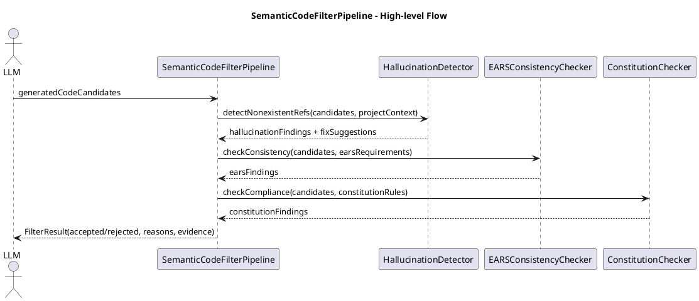
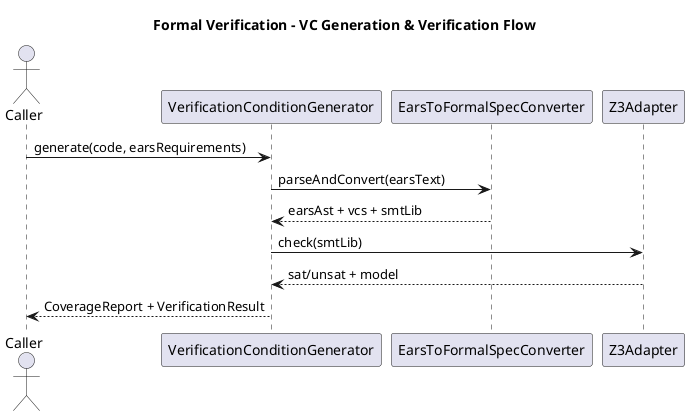
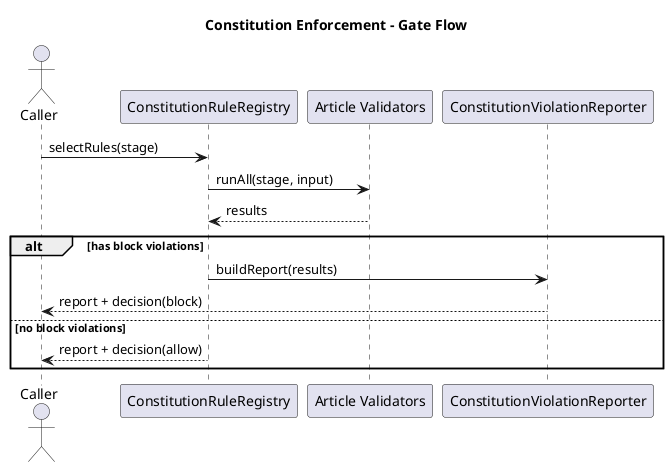

# MUSUBIX 記号的推論・形式検証・Constitution強制 設計書

**文書ID**: DES-SYMB-001  
**プロジェクト**: MUSUBIX  
**バージョン**: 0.8  
**作成日**: 2026-01-05  
**更新日**: 2026-01-05  
**ステータス**: Draft  
**要件定義書**: REQ-SYMB-001 v1.1  
**関連文書**: DES-MUSUBIX-001 v1.3, MUSUBI-enhancement_roadmap_20260105.md, TSK-SYMB-001 v0.1

---

## 1. 設計概要

### 1.1 目的

本設計書は、MUSUBIXに追加される以下のコンポーネント群のアーキテクチャおよび詳細設計を定義する：

1. セマンティックコードフィルター（Semantic Code Filter）
2. 形式検証エンジン（Formal Verification Engine）
3. Constitution強制エンジン（Constitution Enforcement Engine）
4. 信頼度ベースルーティングエンジン（Confidence-Based Routing Engine）

これにより、REQ-SYMB-001で定義された記号的推論強化・形式検証統合・Constitution検証機能を、MUSUBIXの既存アーキテクチャ（DES-MUSUBIX-001）と整合させつつ実現する。

### 1.2 スコープ

本設計のスコープは以下とする：

- `@nahisaho/musubix-core` におけるNeuro-Symbolic統合レイヤーの拡張
- `@nahisaho/musubix-mcp-server` への新規MCPツール追加
- `@nahisaho/musubix-yata-client` との連携ポイント設計
- SMTソルバー（Z3）および静的解析ツールとのインターフェイス
- 憲法（Constitution）ルールエンジンの設計
- 信頼度評価とルーティングロジックの設計

### 1.3 設計原則

本設計は [steering/rules/constitution.md](../../steering/rules/constitution.md) に定義された9条憲法に準拠する。とくに以下の条項を強く意識する：

| Article | 原則 | 本設計での適用観点 |
|---------|------|------------------|
| I | Library-First | すべての機能を`core`ライブラリとして実装し、CLI/MCPから利用 |
| II | CLI Interface | 主要機能をCLIおよびMCPツール経由で公開 |
| III | Test-First | テストを先に用意し、品質ゲートで検証（統合テスト優先はArticle IXに従う） |
| IV | EARS Format | すべての検証条件生成の起点としてEARS要件を使用 |
| V | Traceability | 要件⇔設計⇔コード⇔テストのリンクを100%維持 |
| VI | Project Memory | 憲法ルール・フィルター設定をsteering/およびstorage/に永続化 |
| VII | Simplicity Gate | 初期構成は3プロジェクト以内（Phase -1 Gate） |
| VIII | Anti-Abstraction Gate | フレームワークAPIを直接利用し、不要なラッパ抽象化を禁止（Phase -1 Gate） |
| IX | Integration-First Testing | 統合テストは実サービス優先（モックは原則抑制） |

### 1.4 対象要件

本設計は主に以下の要件群を対象とする（詳細マトリクスは後続セクションで定義）：

- セマンティックフィルター系: REQ-SF-001〜REQ-SF-003
- 形式検証系: REQ-FV-001〜REQ-FV-005
- Constitution強制系: REQ-CONST-001〜REQ-CONST-010
- 信頼度ルーティング系: REQ-ROUTE-001〜REQ-ROUTE-003
- 非機能要件系: REQ-NFR-001〜REQ-NFR-006

---

## 2. 要件カバレッジマトリクス

本マトリクスは、REQ-SYMB-001 v1.1（27要件）に対する設計カバレッジを定義する。

| 要件ID | 設計コンポーネント | 本文セクション | 優先度 |
|--------|------------------|----------------|--------|
| REQ-SF-001 | SemanticCodeFilterPipeline | 4.1 | P0 |
| REQ-SF-002 | HallucinationDetector | 4.2 | P0 |
| REQ-SF-003 | CandidateRanker | 4.3 | P1 |
| REQ-FV-001 | EarsToFormalSpecConverter | 4.4 | P0 |
| REQ-FV-002 | PreconditionVerifier + Z3Adapter | 4.5 | P0 |
| REQ-FV-003 | PostconditionVerifier + Z3Adapter | 4.6 | P0 |
| REQ-FV-004 | InvariantVerifier + Z3Adapter | 4.7 | P1 |
| REQ-FV-005 | VerificationConditionGenerator | 4.8 | P0 |
| REQ-CONST-001 | ConstitutionRuleRegistry | 4.9 | P0 |
| REQ-CONST-002 | ArticleIValidator | 4.10 | P0 |
| REQ-CONST-003 | ArticleIIIValidator | 4.11 | P0 |
| REQ-CONST-004 | ArticleVValidator | 4.12 | P0 |
| REQ-CONST-005 | ConstitutionViolationReporter | 4.13 | P1 |
| REQ-CONST-006 | ArticleIIValidator | 4.14 | P0 |
| REQ-CONST-007 | ArticleVIValidator | 4.15 | P0 |
| REQ-CONST-008 | ArticleVIIValidator | 4.16 | P1 |
| REQ-CONST-009 | ArticleVIIIValidator | 4.17 | P0 |
| REQ-CONST-010 | ArticleIXQualityGateRunner | 4.18 | P0 |
| REQ-ROUTE-001 | ConfidenceEstimator | 4.19 | P0 |
| REQ-ROUTE-002 | ConfidenceBasedRouter | 4.20 | P0 |
| REQ-ROUTE-003 | ResultBlender | 4.21 | P1 |
| REQ-NFR-001 | VerificationPerformanceBudget | 6.1 | P1 |
| REQ-NFR-002 | ExtensibleRuleConfig | 6.2 | P1 |
| REQ-NFR-003 | ExplanationModel | 6.3 | P0 |
| REQ-NFR-004 | ErrorHandlingStrategy | 6.4 | P0 |
| REQ-NFR-005 | SecuritySandbox + SecretScanner | 6.5 | P0 |
| REQ-NFR-006 | AuditLogger | 6.6 | P1 |

**注記**:
- 本設計書のセクション番号（4.x/5.x/6.x/7.x）は本文に反映済みであり、カバレッジ表の参照先は現行の章番号に従う。
- 既存のグローバル設計（DES-MUSUBIX-001）に対し、本設計は「追加コンポーネント」の設計詳細を担う。

### 2.1 実装タスクとの対応（トレーサビリティ）

本設計に基づく実装タスクは [storage/tasks/TSK-SYMB-001.md](../tasks/TSK-SYMB-001.md) に定義する。
要件→タスクの対応は以下のとおりとする。

| 要件ID | 実装タスク（TSK） |
|------|------------------|
| REQ-SF-001 | TSK-SYMB-001, TSK-SYMB-008 |
| REQ-SF-002 | TSK-SYMB-002 |
| REQ-SF-003 | TSK-SYMB-014 |
| REQ-FV-001 | TSK-SYMB-009, TSK-SYMB-012 |
| REQ-FV-002 | TSK-SYMB-011, TSK-SYMB-012 |
| REQ-FV-003 | TSK-SYMB-011, TSK-SYMB-012 |
| REQ-FV-004 | TSK-SYMB-011 |
| REQ-FV-005 | TSK-SYMB-010 |
| REQ-CONST-001 | TSK-SYMB-003, TSK-SYMB-016 |
| REQ-CONST-002 | TSK-SYMB-004 |
| REQ-CONST-003 | TSK-SYMB-004 |
| REQ-CONST-004 | TSK-SYMB-019 |
| REQ-CONST-005 | TSK-SYMB-003 |
| REQ-CONST-006 | TSK-SYMB-008, TSK-SYMB-012 |
| REQ-CONST-007 | TSK-SYMB-004 |
| REQ-CONST-008 | TSK-SYMB-004 |
| REQ-CONST-009 | TSK-SYMB-004 |
| REQ-CONST-010 | TSK-SYMB-004, TSK-SYMB-019 |
| REQ-ROUTE-001 | TSK-SYMB-005 |
| REQ-ROUTE-002 | TSK-SYMB-006, TSK-SYMB-008 |
| REQ-ROUTE-003 | TSK-SYMB-015 |
| REQ-NFR-001 | TSK-SYMB-011, TSK-SYMB-018 |
| REQ-NFR-002 | TSK-SYMB-016 |
| REQ-NFR-003 | TSK-SYMB-001, TSK-SYMB-003, TSK-SYMB-006, TSK-SYMB-008, TSK-SYMB-012, TSK-SYMB-019 |
| REQ-NFR-004 | TSK-SYMB-007 |
| REQ-NFR-005 | TSK-SYMB-013 |
| REQ-NFR-006 | TSK-SYMB-017 |

**タスク名一覧（TSK-SYMB-001）**:
- TSK-SYMB-001: SemanticCodeFilterPipeline基盤実装
- TSK-SYMB-002: HallucinationDetector+ProjectSymbolIndex実装
- TSK-SYMB-003: ConstitutionRuleRegistry+ViolationReporter（基盤）
- TSK-SYMB-004: ArticleValidator群（I〜IX）実装
- TSK-SYMB-005: ConfidenceEstimator実装
- TSK-SYMB-006: ConfidenceBasedRouter実装
- TSK-SYMB-007: ErrorHandlingStrategy+graceful degradation統合
- TSK-SYMB-008: MCPツール（Phase 1）追加
- TSK-SYMB-009: EarsToFormalSpecConverter（EARS→AST→SMT-LIB）
- TSK-SYMB-010: VerificationConditionGenerator実装
- TSK-SYMB-011: Z3Adapter+Pre/Post/InvariantVerifier実装
- TSK-SYMB-012: MCPツール（Phase 2）追加（sdd_formal_verify）
- TSK-SYMB-013: SecuritySandbox+SecretScanner統合
- TSK-SYMB-014: CandidateRanker実装
- TSK-SYMB-015: ResultBlender実装
- TSK-SYMB-016: ExtensibleRuleConfig（設定ロード/スキーマ検証）
- TSK-SYMB-017: AuditLogger（ハッシュチェーン/保持/アーカイブ）
- TSK-SYMB-018: PerformanceBudget（段階別予算/計測/部分結果）実装
- TSK-SYMB-019: 品質ゲート（承認条件）検証タスク

---

## 3. C4モデル

本セクションでは、本設計（DES-SYMB-001）が追加する「検証・強制・ルーティング」機能を、既存のMUSUBIX全体設計（DES-MUSUBIX-001）に対する拡張としてC4で表現する。

### 3.1 Level 1: System Context

```plantuml
@startuml C4_Context_SYMB
!include https://raw.githubusercontent.com/plantuml-stdlib/C4-PlantUML/master/C4_Context.puml

title MUSUBIX (SYMB Extensions) - System Context Diagram

Person(developer, "Developer", "AI Coding Agent/Human Developer")
Person(reviewer, "Code Reviewer", "Reviews outputs, violations, and proofs")

System(musubix, "MUSUBIX", "Neuro-Symbolic AI Coding System\n+ Semantic Filter + Formal Verification + Constitution Enforcement")

System_Ext(llm_api, "LLM API", "Neural inference")
System_Ext(yata_mcp, "YATA MCP Server", "Knowledge Graph\nSymbolic reasoning")
System_Ext(git, "Git Repository", "Source code repository")
System_Ext(z3, "SMT Solver (Z3)", "Formal verification\nSMT-LIB")
System_Ext(sandbox, "Sandbox Runtime", "Isolated execution/analysis\nfor untrusted code")
System_Ext(ai_platform, "AI Coding Platform", "Claude Code/Copilot/Cursor etc.")

Rel(developer, musubix, "Uses", "CLI/MCP")
Rel(reviewer, musubix, "Reviews via", "Explanation/Reports")
Rel(ai_platform, musubix, "Invokes tools", "MCP/stdio/SSE")

Rel(musubix, llm_api, "Neural inference", "HTTPS")
Rel(musubix, yata_mcp, "Symbolic query", "MCP")
Rel(musubix, git, "Reads/Writes", "Git protocol")
Rel(musubix, z3, "Discharges VCs", "SMT-LIB")
Rel(musubix, sandbox, "Executes/Analyzes", "OS sandbox")

@enduml
```

**トレーサビリティ**: REQ-SF-001〜003, REQ-FV-001〜005, REQ-CONST-001〜010, REQ-ROUTE-001〜003, REQ-NFR-003〜006

---

### 3.2 Level 2: Container

```plantuml
@startuml C4_Container_SYMB
!include https://raw.githubusercontent.com/plantuml-stdlib/C4-PlantUML/master/C4_Container.puml

title MUSUBIX (SYMB Extensions) - Container Diagram

Person(developer, "Developer")

System_Boundary(musubix, "MUSUBIX System") {
	Container(cli, "MUSUBIX CLI", "Node.js", "Command-line interface\nfor all operations")
	Container(mcp_server, "MCP Server", "Node.js", "Model Context Protocol\nserver for AI platforms")
	Container(core, "Core Library", "Node.js", "Neuro-Symbolic integration engine\n+ Verification/Enforcement/Router extensions")
	Container(yata_client, "YATA Client", "Node.js", "Knowledge graph\nclient library")
	ContainerDb(storage, "Local Storage", "JSON/SQLite", "Project data, cache, logs\npolicies/rules, audit trails")
}

System_Ext(yata_mcp, "YATA MCP Server", "Knowledge Graph\nSymbolic reasoning")
System_Ext(llm_api, "LLM API", "Neural inference")
System_Ext(z3, "SMT Solver (Z3)", "Formal verification\nSMT-LIB")
System_Ext(sandbox, "Sandbox Runtime", "Isolated execution/analysis\nfor untrusted code")

Rel(developer, cli, "Executes", "Shell")
Rel(developer, mcp_server, "Invokes via", "AI Platform")

Rel(cli, core, "Uses")
Rel(mcp_server, core, "Uses")

Rel(core, yata_client, "Queries")
Rel(yata_client, yata_mcp, "Queries", "MCP/stdio")
Rel(core, llm_api, "Infers", "HTTPS")

Rel(core, z3, "Verifies", "SMT-LIB")
Rel(core, sandbox, "Analyzes/Executes", "OS sandbox")

Rel(core, storage, "Reads/Writes")

@enduml
```

**トレーサビリティ**: REQ-FV-002〜005, REQ-NFR-005, REQ-NFR-006, REQ-CONST-006〜010

---

## 4. コンポーネント設計

本セクションでは、REQ-SYMB-001で定義された追加コンポーネント群の設計を記述する（セマンティックフィルター、形式検証、Constitution強制、信頼度ルーティング）。

### 4.1 SemanticCodeFilterPipeline（DES-SF-001）

**対応要件**: REQ-SF-001（P0）

**責務**:
- LLM生成コード（単一候補/複数候補）を入力として受け取り、記号ルールに基づきフィルタリングする。
- EARS要件との整合性（要件スコープ/禁止事項/制約）をチェックする。
- Constitution条項（本設計で対象とする検証群）への準拠性をチェックする。
- 結果を `accepted/rejected` と理由（根拠）として返却する。

**入出力（論理）**:
- Input:
	- `generatedCode`: LLM生成コード（候補1件以上）
	- `projectContext`: workspace構成（packages/、tsconfig、依存関係、既存API）
	- `earsRequirements`: 対象のEARS要件（REQ-* など）
	- `constitutionRules`: 憲法検証ルールセット
- Output:
	- `FilterDecision`: `accepted|rejected`
	- `reasons`: 拒否/採用に至った理由（人が読める説明 + 機械的根拠）
	- `evidence`: 検証結果の要約（例: 違反条項ID、EARSマッピング結果、検出された不存在参照）

**パイプライン構成（最小）**:
1. 正規化（コード断片→候補単位に整形、言語/ファイル種別の判定）
2. ハルシネーション検出（`HallucinationDetector`）
3. EARS整合性検証（EARS要件に対する逸脱/禁止事項/制約の検知）
4. Constitution準拠性検証（Constitutionルール群の適用）
5. 判定（accepted/rejected）と説明の構築

**設計パターン**:
- Pipeline（段階的な検証・集約）
- Strategy（検証器を差し替え可能にする）
- Result型（失敗可能操作の表現、理由/根拠の合成）

**例外/失敗時の扱い（概要）**:
- フィルター処理中に内部エラーが発生した場合でも、可能な範囲で「何ができなかったか」を理由に含める。
- セキュリティ/監査ログの詳細はセクション6で定義する（REQ-NFR-004〜006）。

**フロー（概略）**:



**トレーサビリティ**: REQ-SF-001 → DES-SF-001

---

### 4.2 HallucinationDetector（DES-SF-002）

**対応要件**: REQ-SF-002（P0）

**責務**:
- 存在しないAPI・関数・モジュール参照を検出する。
- プロジェクトコンテキスト（workspace内コード/依存関係/公開API）と照合して不整合を識別する。
- YATA知識グラフと照合して、妥当/不整合の根拠を補強する。
- 修正提案（代替API、正しいimport、既存関数への置換等）を生成する。

**検出対象（最小）**:
- import/requireされるモジュールの存在性（workspace内/依存関係）
- 名前解決できないシンボル参照（型/関数/クラス/定数）
- API形状不整合（引数数・必須引数・戻り値の期待）

**情報源**:
- `ProjectSymbolIndex`（workspace内のシンボル・公開API一覧）
- 依存関係解決（package.json + node_modules解決）
- `YataClient` による知識グラフ照会（既知API・推奨置換等）

**修正提案の原則**:
- 既存コードに存在するAPI/関数を優先して提案する（project context優先）。
- 外部依存の追加を伴う提案は、Constitution（Library-First/CLI）やセキュリティ設計（セクション6）と整合する場合のみ候補に含める。
- 「何を根拠に提案したか（参照先・一致条件）」を説明可能な形で残す（REQ-SF-002受入基準）。

**トレーサビリティ**: REQ-SF-002 → DES-SF-002

---

### 4.3 CandidateRanker（DES-SF-003）

**対応要件**: REQ-SF-003（P1）

**責務**:
- LLMが複数候補を生成した場合に、品質メトリクスで候補をスコアリング・ランキングする。
- スコア内訳（複雑度、保守性、要件カバレッジ）を提供する。
- 最高スコア候補を推奨する。

**スコアリング（最小）**:
- 複雑度: 既存の静的解析（または同等の解析器）から得られる複雑度指標
- 保守性: 静的解析が提供する保守性指標（例: lint/型エラー/構造的健全性の要約）
- 要件カバレッジ: 対象EARS要件とのマッピング結果（TraceabilityManagerのリンク情報を利用）

**出力**:
- `rankedCandidates`: 候補の降順リスト
- `breakdown`: 各候補の内訳（metric→score）
- `recommended`: 最高スコア候補

**透明性（説明可能性）**:
- 指標は固定のラベルで出力し、重み付けや正規化の有無を明示する。
- 結果は「なぜその候補を推奨したか」を説明できる粒度で返す（REQ-SF-003受入基準）。

**トレーサビリティ**: REQ-SF-003 → DES-SF-003

---

### 4.4 EarsToFormalSpecConverter（DES-FV-001）

**対応要件**: REQ-FV-001（P0）

**責務**:
- EARS形式の要件文をパースし、構造化表現（EARS AST）へ変換する。
- 構造化表現から検証条件（VC: Verification Condition）を生成する。
- VCをSMT-LIB形式として出力する。

**入力/出力（論理）**:
- Input:
	- `earsText`: EARS要件文
	- `requirementId`: 対象要件ID（例: `REQ-FV-001` のような識別子）
	- `domainModel`（任意）: 型/エンティティ/制約の補助情報
- Output:
	- `earsAst`: パース結果（EARSパターン、トリガー、制約、禁止事項など）
	- `vcs`: VC集合（EARS要件IDへのマッピング情報を含む）
	- `smtLib`: SMT-LIB文字列（Z3等で解釈可能な形式）

**EARSパターン対応（最小）**:
- Ubiquitous/Event-driven/State-driven/Unwanted/Optionalの5種類を受理し、共通の構造へ正規化する。

**変換方針**:
- EARS文のトリガー/条件を前件（premise）、要求動作/制約を後件（consequence）としてVCを構成する。
- 時間制約などの数値制約は、可能な範囲でSMTの算術制約として表現する。
- 生成物は必ず `requirementId` とリンクし、後続のカバレッジ算出に利用できる形にする（Traceability）。

**例（REQ-SYMB-001の変換例に準拠）**:

```text
Input EARS:
  WHEN user clicks login button, THE system SHALL authenticate user within 3 seconds

Output SMT-LIB（概念）:
  (assert (=> (click login_button) (and (authenticate) (<= response_time 3000))))
```

**トレーサビリティ**: REQ-FV-001 → DES-FV-001

---

### 4.5 PreconditionVerifier + Z3Adapter（DES-FV-002）

**対応要件**: REQ-FV-002（P0）

**責務**:
- コードと事前条件（precondition）を入力として受け取り、Z3で検証する。
- 検証結果（valid/invalid）を返却する。
- 違反時は反例（counterexample）を生成する。

**前提**:
- 事前条件は、入力変数に対する制約として表現される（例: `x > 0`）。
- コードそのものの完全な意味論展開は段階導入とし、最小構成では「事前条件の充足可能性」と「違反入力例の提示」に重点を置く。

**検証戦略（最小）**:
- `valid`: 事前条件が充足可能（SAT）であり、自己矛盾がない。
- `invalid`: 事前条件が充足不能（UNSAT）である、または型/領域制約と矛盾する。
- 反例生成: `not(precondition)` がSATとなるモデル（入力値例）を返す。

**入出力（論理）**:
- Input:
	- `code`: 対象コード（関数/メソッド）
	- `preconditions`: 事前条件（複数可）
	- `symbolTable`: 入力変数の型/範囲情報
- Output:
	- `result`: `valid|invalid`
	- `counterexample`（invalid時）: 具体的な入力値（Z3モデル）
	- `smtLib`（任意）: 実行したSMT-LIB（再現用）

**Z3Adapter**:
- SMT-LIBの生成/送信/結果パースを抽象化し、ソルバ実装の差し替えを可能にする。

**トレーサビリティ**: REQ-FV-002 → DES-FV-002

---

### 4.6 PostconditionVerifier + Z3Adapter（DES-FV-003）

**対応要件**: REQ-FV-003（P0）

**責務**:
- コードと事後条件（postcondition）を入力として受け取り、Z3で充足可能性/妥当性を検証する。
- 検証成功時は証明（proof）を生成する。
- 検証失敗時は修正提案を生成する。

**検証戦略（最小）**:
- 事後条件は、出力/状態変数に対する制約として表現する。
- 検証は「事後条件が矛盾なく満たせるか（SAT）」および「否定が成り立つ反例が存在するか（counterexample）」で判定する。
- `proof` は「否定がUNSATである」など、Z3が返した結論に基づく証跡（要約）として生成する。

**修正提案の生成（最小）**:
- 反例（入力/出力モデル）と、どの条件が破れているか（最小破綻集合の要約）を提示する。
- 修正提案は「事後条件を満たすための方針」を出す（例: 条件分岐の不足、戻り値計算の欠落など）。

**入出力（論理）**:
- Input:
	- `code`: 対象コード
	- `postconditions`: 事後条件（複数可）
	- `symbolTable`: 変数の型/範囲情報
- Output:
	- `result`: `valid|invalid`
	- `proof`（valid時）: 証跡（要約、実行したVC/SMTの参照）
	- `fixSuggestions`（invalid時）: 修正提案
	- `counterexample`（invalid時）: 入出力例（Z3モデル）

**トレーサビリティ**: REQ-FV-003 → DES-FV-003

---

### 4.7 InvariantVerifier + Z3Adapter（DES-FV-004）

**対応要件**: REQ-FV-004（P1）

**責務**:
- ループ/クラス不変条件（invariants）が維持されることを検証する。
- 違反箇所（Location）を特定する。
- 違反理由を説明する。

**検証戦略（最小）**:
- ループ不変条件:
	- Initiation（初期化で成り立つ）
	- Preservation（反復で保たれる）
- クラス不変条件:
	- メソッド境界（公開メソッドの入口/出口）で不変条件が成り立つことを検証する。

**Location特定**:
- VC生成時に「どの構文要素（ループ/メソッド/クラス）に対応するVCか」をタグ付けし、違反時に該当位置を返す。

**説明生成（最小）**:
- 違反した不変条件ID/式と、反例モデル（入力/状態）を提示する。

**トレーサビリティ**: REQ-FV-004 → DES-FV-004

---

### 4.8 VerificationConditionGenerator（DES-FV-005）

**対応要件**: REQ-FV-005（P0）

**責務**:
- コードとEARS仕様を入力として、検証条件（VC）を自動生成する。
- VCをEARS要件へマッピングする。
- 検証カバレッジを算出する。

**生成対象（最小）**:
- 事前条件/事後条件/不変条件に相当するVC
- EARSの構文要素（イベント、状態、禁止事項、条件分岐）に対応するVC

**マッピング**:
- 生成したVCには、必ず `requirementId` と `source`（どのEARS断片/どのコード要素由来か）を付与する。

**カバレッジ算出**:
- `coverage = (VCにマッピングされたEARS要件数 / 対象EARS要件総数) * 100`
- 目標は100%（要件に沿って到達目標として扱い、未達の場合は不足VCをレポートする）。

**フロー（概略）**:



**トレーサビリティ**: REQ-FV-005 → DES-FV-005

---

### 4.9 ConstitutionRuleRegistry（DES-CONST-001）

**対応要件**: REQ-CONST-001（P0）

**責務**:
- 9条憲法（[steering/rules/constitution.md](../../steering/rules/constitution.md)）を、実行可能なルールセットとして保持する。
- 各ルールに対してpredicate（検証関数）を定義し、enforcement（block/warn/log）を設定可能にする。
- ルールの実行対象（requirements/design/implementation/testing）を明示し、検証ステージと紐付けて実行できるようにする。

**データモデル（概念）**:

```typescript
export type ConstitutionEnforcement = 'block' | 'warn' | 'log';
export type ConstitutionStage = 'requirements' | 'design' | 'implementation' | 'testing';

export interface ConstitutionRule {
	article: 1 | 2 | 3 | 4 | 5 | 6 | 7 | 8 | 9;
	name: string;
	stages: ConstitutionStage[];
	enforcement: ConstitutionEnforcement;
	message: string;
	predicate: (input: ConstitutionCheckInput) => Promise<ConstitutionCheckResult>;
}

export interface ConstitutionCheckInput {
	stage: ConstitutionStage;
	projectContext: unknown;
	artifacts: {
		requirementsDoc?: unknown;
		designDoc?: unknown;
		codeChanges?: unknown;
		testPlanOrResults?: unknown;
		traceability?: unknown;
		steeringEvidence?: unknown;
	};
}

export interface ConstitutionCheckResult {
	ok: boolean;
	evidence?: Record<string, unknown>;
	violations?: Array<{ ruleId: string; details: string; location?: string }>;
}
```

**実行方針（最小）**:
- ルールは「ステージに応じて」起動し、結果を集約してゲート判定を行う。
- enforcementが `block` の違反が1つでもあれば、当該ステージの進行を停止（Quality Gate）する。

**トレーサビリティ**: REQ-CONST-001 → DES-CONST-001

---

### 4.10 ArticleIValidator（DES-CONST-002）

**対応要件**: REQ-CONST-002（P0）

**責務**:
- 新規機能が独立ライブラリとして実装されているか検証する（Library-First）。
- ライブラリが独自のテストスイートを持つことを検証する。
- アプリケーションコードへの依存がないことを検証する。

**検証観点（最小）**:
- `packages/` 配下に新規のパッケージまたはライブラリ境界が存在する
- ライブラリに対応するテストが存在する（Vitest等）
- import依存を解析し、アプリケーション層（例: CLIのみ）への逆依存がない

**出力**:
- ok/violations（どの観点が不足か、どのパスが該当か）

**トレーサビリティ**: REQ-CONST-002 → DES-CONST-002

---

### 4.11 ArticleIIIValidator（DES-CONST-003）

**対応要件**: REQ-CONST-003（P0）

**責務**:
- テストカバレッジを計算し、閾値（80%）未満の場合に警告する。
- EARS要件に対応するテストの存在を確認する。

**検証観点（最小）**:
- Vitestのカバレッジ出力（または同等の集計）を入力として受理する
- `describe/it` の説明やメタデータで `REQ-` を参照していることを検出し、要件↔テストリンクを構築する

**注意**:
- 本設計では「要件に対応するテストの存在」をConstitutionチェックの一部として扱うが、完全性の最終判定はTraceability（Article V）でも実施する。

**トレーサビリティ**: REQ-CONST-003 → DES-CONST-003

---

### 4.12 ArticleVValidator（DES-CONST-004）

**対応要件**: REQ-CONST-004（P0）

**責務**:
- 要件↔コードのトレーサビリティを検証し、カバレッジを計算する。
- 100%未満の場合は変更をブロックする（block）。

**入力**:
- `TraceabilityMatrix`（要件↔設計↔コード↔テストのリンク情報）

**検証観点（最小）**:
- 変更対象のコードが、いずれかの `REQ-*` に紐付いている
- DES/TSK/TESTへのリンクが欠落していない
- カバレッジ算出結果が100%である（不足分は違反として列挙）

**トレーサビリティ**: REQ-CONST-004 → DES-CONST-004

---

### 4.13 ConstitutionViolationReporter（DES-CONST-005）

**対応要件**: REQ-CONST-005（P1）

**責務**:
- Constitution違反の詳細レポートを生成する。
- 違反箇所（location）と修正提案（fix hints）を提示する。
- 違反履歴を永続化する（監査ログとの連携はセクション6で定義）。

**レポート内容（最小）**:
- 違反した条項/ルールID
- 発生ステージ（requirements/design/implementation/testing）
- 対象アーティファクト（ファイル/変更点）
- 具体的な修正提案（例: CLIエントリ追加、テスト追加、過剰抽象化の除去など）

**永続化（概要）**:
- `storage/` 配下に違反履歴を保存し、継続的に参照できるようにする（改ざん検出はREQ-NFR-006）。

**トレーサビリティ**: REQ-CONST-005 → DES-CONST-005

---

### 4.14 ArticleIIValidator（DES-CONST-006）

**対応要件**: REQ-CONST-006（P0）

**責務**:
- 新しいライブラリがCLIインターフェイスを公開していることを検証する。
- `--help` が実装されていることを検証する。
- 終了コード規約（0=成功、非0=エラー）に準拠していることを検証する。

**検証観点（最小）**:
- `bin/` エントリポイントやpackage.jsonの `bin` フィールドの存在
- `--help` 実行時にusageが表示され、成功終了（exit 0）する
- 既知のエラーケース（不正引数等）で非0終了する

**トレーサビリティ**: REQ-CONST-006 → DES-CONST-006

---

### 4.15 ArticleVIValidator（DES-CONST-007）

**対応要件**: REQ-CONST-007（P0）

**責務**:
- 設計決定時にsteering/が参照されたことを検証する。
- 決定がProject Memoryに記録されることを検証する。
- 過去の決定との整合性（矛盾）を検証する。

**検証の前提（最小）**:
- 参照証跡（evidence）を「ツール実行ログ」または「決定記録（ADR/レビュー文書）」として残す。

**検証観点（最小）**:
- steering/ の必須ファイル（structure/tech/product）が参照された証跡がある
- 主要決定がADRまたは同等の決定ログとして残っている
- 既存のADR/steeringの方針と矛盾する場合は違反として提示する

**トレーサビリティ**: REQ-CONST-007 → DES-CONST-007

---

### 4.16 ArticleVIIValidator（DES-CONST-008）

**対応要件**: REQ-CONST-008（P1）

**対象条項（正）**: Article VII = Simplicity Gate（Phase -1 Gate）

**責務**:
- 初期アーキテクチャが最大3プロジェクト以内であることを検証する。
- 3プロジェクトを超える提案/変更がある場合、Phase -1 Gateの承認記録（justification/approval）が存在することを検証する。

**検証観点（最小）**:
- 独立デプロイ単位（packagesやコンテナー定義等）を数え、初期構成が3以内である
- 超過時は、承認者・理由・代替案が記録された文書（ADR等）が存在する

**トレーサビリティ**: REQ-CONST-008 → DES-CONST-008

---

### 4.17 ArticleVIIIValidator（DES-CONST-009）

**対応要件**: REQ-CONST-009（P0）

**対象条項（正）**: Article VIII = Anti-Abstraction Gate（Phase -1 Gate）

**責務**:
- フレームワーク機能を直接利用し、不要なラッパ抽象化が導入されていないことを検証する。
- 抽象化（ラッパ層）が提案/導入される場合、Phase -1 Gateの承認記録（multi-framework必要性、移行計画等）が存在することを検証する。

**検証観点（最小）**:
- 代表的な「ラッパ抽象化」兆候を検出する（例: framework clientを単に包むだけの薄いクラス/関数）
- 例外として許容される抽象（multi-framework対応、ドメイン固有IF）に該当するか判定する
- 例外の場合でも、承認記録がないときは違反として扱う

**トレーサビリティ**: REQ-CONST-009 → DES-CONST-009

---

### 4.18 ArticleIXQualityGateRunner（DES-CONST-010）

**対応要件**: REQ-CONST-010（P0）

**対象条項（正）**: Article IX = Integration-First Testing

**責務**:
- フェーズ移行（requirements→design→tasks→implementation→testing等）において、品質ゲートの全項目をチェックする。
- 未達成項目がある場合は移行をブロックする（block）。
- 品質レポートを生成する。

**ゲートチェック（最小）**:
- Requirements stage: EARS形式（Article IV）とトレーサビリティ準備（Article V）
- Design stage: Library/CLI/Project Memory/Simplicity/Anti-Abstraction（Articles I, II, VI, VII, VIII）
- Implementation stage: Test-First/Traceability（Articles III, V）
- Testing stage: Integration-First（Article IX）およびTraceability（Article V）

**Integration-Firstの検証観点（最小）**:
- 統合テストが実サービス（DB/API等）を使用している（Docker/Testcontainers等の利用を許容）
- 外部APIはsandbox/test環境を使用
- モック使用は例外扱いとし、正当化（理由の記録）がある場合のみ許容

**フロー（概略）**:



**トレーサビリティ**: REQ-CONST-010 → DES-CONST-010

---

### 4.19 ConfidenceEstimator（DES-ROUTE-001）

**対応要件**: REQ-ROUTE-001（P0）

**責務**:
- LLM出力に対して信頼度（0.0〜1.0）を推定する。
- 信頼度を4観点（構文、意味、事実、一貫性）に分解して提供する。
- リスク要因（低信頼の原因）を識別し、説明に利用できる形で返す。

**入出力（論理）**:
- Input:
	- `candidate`: LLM出力（コード候補）
	- `projectContext`: workspace構成（依存関係、既存API、設定）
	- `analysisFindings`（任意）: フィルター/検証器が出した所見（例: ハルシネーション、型不整合）
- Output:
	- `score`: number（0.0〜1.0）
	- `breakdown`: { syntactic, semantic, factual, consistency }
	- `riskFactors`: string[]（例: "unknown_api_reference", "inconsistent_with_context"）
	- `rationale`: ルーティング理由に転用可能な説明要素

**スコア構成（最小）**:
- 構文（syntactic）: parse/typecheck/lint等の結果要約
- 意味（semantic）: EARS整合性・制約逸脱の有無（Semantic Filter所見を利用）
- 事実（factual）: API存在性・依存関係整合性（HallucinationDetector所見を利用）
- 一貫性（consistency）: projectContext/過去決定（steering/ADR）との矛盾

**注意**:
- 本設計ではConfidenceEstimatorは「決定の根拠（rationale）」も返し、REQ-ROUTE-002の説明要件に供給する。

**トレーサビリティ**: REQ-ROUTE-001 → DES-ROUTE-001

---

### 4.20 ConfidenceBasedRouter（DES-ROUTE-002）

**対応要件**: REQ-ROUTE-002（P0）

**責務**:
- ConfidenceEstimatorの結果に基づき、閾値ルールでルーティングを決定する。
- ルーティング理由を説明可能な形で記録する。
- 記号検証への委譲（symbolic_verify / symbolic_regenerate）を実行可能な依存（呼び出し）へ変換する。

**ルーティング規則（REQ-ROUTE-002準拠）**:

| 信頼度範囲 | decision | アクション |
|-----------|----------|-----------|
| ≥ 0.8 | accept | そのまま採用（REQ-INT-002準拠） |
| 0.5 ≤ x < 0.8 | symbolic_verify | 記号検証を実行 |
| < 0.5 | symbolic_regenerate | 記号的に再生成 |

**補足（REQ-INT-002整合）**:
- `accept` は「シンボリック検証がvalidの場合のみ適用される」。
- `symbolic_verify` 実行後にinvalidとなった場合は、ニューラル結果を棄却する（既存ルールに従う）。
- 区間は重複しないように定義し、`x = 0.8` は `accept` として扱う。

**入出力（論理）**:
- Input:
	- `confidence`: ConfidenceEstimatorの結果（score/breakdown/riskFactors）
	- `candidate`: LLM出力（コード候補）
	- `symbolicHooks`:
		- `verify(candidate) -> { valid|invalid, evidence }`
		- `regenerate(context) -> candidate`（必要時）
- Output:
	- `routingDecision`: `accept|symbolic_verify|symbolic_regenerate`
	- `routingReason`: 説明（閾値、根拠、リスク要因）
	- `executionPlan`: 実行計画（どの検証/再生成を走らせるか）

**記録**:
- ルーティングは「閾値」「breakdown」「riskFactors」「symbolic結果（実行した場合）」を含めて記録する。

**トレーサビリティ**: REQ-ROUTE-002 → DES-ROUTE-002

---

### 4.21 ResultBlender（DES-ROUTE-003）

**対応要件**: REQ-ROUTE-003（P1）

**責務**:
- ニューラル結果（LLM）と記号結果（検証/推論）を、選択された戦略でブレンドする。
- ブレンド結果を生成し、ソース帰属（neural: %, symbolic: %）を提供する。

**ブレンド戦略（REQ-ROUTE-003準拠）**:
- `neural_priority`: ニューラル結果を優先し、記号結果は補助/注釈として扱う
- `symbolic_priority`: 記号結果を優先し、ニューラル結果は補助/候補として扱う
- `confidence_weighted`: 信頼度と検証結果に基づき割合で統合する

**入出力（論理）**:
- Input:
	- `neuralResult`: LLM出力（候補/推奨）
	- `symbolicResult`: 記号結果（valid/invalid + evidence + corrections）
	- `strategy`: 上記3種
	- `confidence`（任意）: ConfidenceEstimatorの結果
- Output:
	- `blended`: 統合された結果（採用コード/推奨案/修正案のいずれか）
	- `attribution`: { neuralPct: number, symbolicPct: number }
	- `explanation`: どの戦略で、なぜその割合・結果になったか

**整合ルール（最小）**:
- symbolicがinvalidの場合、blendedはニューラル単独採用にならない（invalidを優先し、修正案/再生成へ誘導）。

**トレーサビリティ**: REQ-ROUTE-003 → DES-ROUTE-003

---

## 5. インターフェイス・データモデル

本セクションは、セクション4で定義した各コンポーネントの「実装契約（Interface/DTO）」を定義する。
既存コードベースの型と命名に合わせ、共通型は `@nahisaho/musubix-core` の `types/common` を再利用する。

### 5.1 共通型（musubix-core再利用）

**既存型（再利用）**:
- `ID`, `Timestamp`, `Confidence`
- `Result<T, E = Error>`（`success/data/error/metadata` 形式）
- `Violation`, `Location`, `DetectedPattern`, `ReasoningChain`

**Result形式（既存準拠）**:

```typescript
export interface Result<T, E = Error> {
	success: boolean;
	data?: T;
	error?: E;
	metadata?: {
		timestamp: string;
		duration: number;
		traceId?: string;
	};
}
```

本設計で追加する各エンジン/バリデーターは、基本的に `Result<Output, Error>` を返す（例外はセクション6で定義）。

**共通参照型（本設計で追加）**:

```typescript
export type ArtifactKind =
	| 'requirements'
	| 'design'
	| 'code'
	| 'tests'
	| 'traceability'
	| 'steering';

export interface ArtifactRef {
	kind: ArtifactKind;
	path: string;
	version?: string;
}

export type EvidenceKind = 'rule' | 'static-analysis' | 'solver' | 'traceability' | 'artifact';

export interface EvidenceItem {
	kind: EvidenceKind;
	summary: string;
	details?: Record<string, unknown>;
	artifacts?: ArtifactRef[];
}

export interface Explanation {
	summary: string;
	rationale?: string[];
	evidence?: EvidenceItem[];
}
```

### 5.2 セマンティックコードフィルター（Semantic Filter）

セクション4.1〜4.3の入出力契約を定義する。

```typescript
export type CodeLanguage = 'typescript' | 'javascript' | 'markdown' | 'unknown';

export interface CodeCandidate {
	id: string;
	language: CodeLanguage;
	content: string;
	source?: 'llm' | 'human' | 'tool';
	filesTouched?: string[];
}

export type FilterDecision = 'accepted' | 'rejected';

export interface FilterReason {
	code:
		| 'hallucination_detected'
		| 'ears_violation'
		| 'constitution_violation'
		| 'unknown_dependency'
		| 'type_mismatch'
		| 'other';
	message: string;
	severity: 'error' | 'warning' | 'info';
	evidence?: EvidenceItem[];
}

export interface FilterOutput {
	decision: FilterDecision;
	reasons: FilterReason[];
	violations: Array<{
		id: string;
		type: string;
		severity: 'error' | 'warning' | 'info';
		message: string;
		location?: unknown;
		suggestion?: string;
	}>;
	rankedCandidates?: Array<{ candidateId: string; score: number; rationale?: string }>;
}

export interface SemanticFilterRequest {
	candidates: CodeCandidate[];
	requirementsDoc?: ArtifactRef;
	designDoc?: ArtifactRef;
	steeringRefs?: ArtifactRef[];
	projectRoot?: string;
}

export type SemanticFilterResponse = Result<FilterOutput>;
```

**注記**:
- `violations` は既存の `Violation` を基本とする（上記は概念表現）。
- 候補ランキングは `CandidateRanker`（DES-SF-003）で算出し、`rankedCandidates` に反映する。

### 5.3 形式検証（Formal Verification）

セクション4.4〜4.8の入出力契約を定義する。

```typescript
export type VerificationVerdict = 'valid' | 'invalid' | 'unknown';

export interface EarsRequirementRef {
	id: string; // REQ-xxx
	text: string;
}

export type SymbolType = 'int' | 'real' | 'bool' | 'string' | 'unknown';

export interface SymbolDecl {
	name: string;
	type: SymbolType;
	domain?: { min?: number; max?: number; allowed?: Array<string | number | boolean> };
}

export interface SymbolTable {
	symbols: SymbolDecl[];
}

export interface VerificationCondition {
	id: string;
	requirementId: string;
	description: string;
	smtLib: string;
	tags?: string[];
}

export interface SolverModel {
	assignments: Record<string, string | number | boolean>;
}

export interface VerificationEvidence {
	vcs?: VerificationCondition[];
	smtLib?: string;
	model?: SolverModel;
	proofSummary?: string;
}

export interface VerificationOutput {
	verdict: VerificationVerdict;
	explanation?: Explanation;
	evidence?: VerificationEvidence;
	fixSuggestions?: string[];
}

export interface FormalVerifyRequest {
	code: { language: CodeLanguage; content: string };
	requirements: EarsRequirementRef[];
	symbolTable?: SymbolTable;
}

export type FormalVerifyResponse = Result<VerificationOutput>;
```

### 5.4 Constitution強制（Constitution Enforcement）

セクション4.9〜4.18の入出力契約を定義する。

```typescript
export type ConstitutionEnforcement = 'block' | 'warn' | 'log';
export type ConstitutionStage = 'requirements' | 'design' | 'implementation' | 'testing';

export interface ConstitutionViolation {
	article: 1 | 2 | 3 | 4 | 5 | 6 | 7 | 8 | 9;
	enforcement: ConstitutionEnforcement;
	stage: ConstitutionStage;
	message: string;
	location?: { path?: string; detail?: string };
	suggestion?: string;
	evidence?: EvidenceItem[];
}

export interface ConstitutionCheckInput {
	stage: ConstitutionStage;
	projectRoot?: string;
	artifacts: {
		requirementsDoc?: ArtifactRef;
		designDoc?: ArtifactRef;
		codeChanges?: ArtifactRef[];
		testPlanOrResults?: ArtifactRef;
		traceability?: ArtifactRef;
		steeringEvidence?: ArtifactRef[];
	};
}

export interface ConstitutionReport {
	ok: boolean;
	violations: ConstitutionViolation[];
	explanation?: Explanation;
}

export type ConstitutionCheckResponse = Result<ConstitutionReport>;
```

**品質ゲート（Article IX）**:

```typescript
export type GateDecision = 'allow' | 'block';

export interface QualityGateReport {
	stage: ConstitutionStage;
	decision: GateDecision;
	blockingViolations: ConstitutionViolation[];
	nonBlockingViolations: ConstitutionViolation[];
	explanation?: Explanation;
}

export type QualityGateResponse = Result<QualityGateReport>;
```

### 5.5 信頼度ベースルーティング（Confidence Routing）

セクション4.19〜4.21の入出力契約を定義する。

```typescript
export interface ConfidenceBreakdown {
	syntactic: number;
	semantic: number;
	factual: number;
	consistency: number;
}

export interface ConfidenceAssessment {
	score: number; // 0.0 - 1.0
	breakdown: ConfidenceBreakdown;
	riskFactors: string[];
	rationale?: string[];
}

export type RoutingDecision = 'accept' | 'symbolic_verify' | 'symbolic_regenerate';

export interface RoutingExecutionPlan {
	decision: RoutingDecision;
	steps: Array<{
		kind: 'filter' | 'formal_verify' | 'constitution_check' | 'regenerate';
		description: string;
	}>;
}

export interface RoutingOutput {
	routingDecision: RoutingDecision;
	routingReason: Explanation;
	executionPlan: RoutingExecutionPlan;
}

export type RoutingResponse = Result<RoutingOutput>;
```

### 5.6 MCPツールインターフェイス（mcp-server）

`@nahisaho/musubix-mcp-server`の`ToolDefinition`はJSON Schema入力を受け取り、返却は`ToolResult`（テキスト）として返す。
現状実装は `success({...})` で「整形済みJSON文字列」を返すため、本設計でも同形式を前提とする。

**既存ツール（参考）**:
- `sdd_validate_constitution`
- `sdd_validate_traceability`

**追加予定ツール（本設計での提案）**:

1) `sdd_semantic_filter`
- Input（概念）:
	- `candidates`: `[{ id, language, content, filesTouched? }]`
	- `requirementsPath?`, `designPath?`, `projectRoot?`
- Output（成功時）:
	- `{ action: 'semantic_filter', decision, reasons, violations, rankedCandidates? }`

2) `sdd_formal_verify`
- Input（概念）:
	- `code`: `{ language, content }`
	- `requirements`: `[{ id, text }]`
	- `symbolTable?`
- Output（成功時）:
	- `{ action: 'formal_verify', verdict, evidence?, fixSuggestions? }`

3) `sdd_route_candidate`
- Input（概念）:
	- `candidate`: `{ id, language, content }`
	- `projectRoot?`
- Output（成功時）:
	- `{ action: 'route_candidate', confidence: { score, breakdown, riskFactors }, routingDecision, executionPlan }`

---

## 6. エラーハンドリング・セキュリティ設計

※REQ-NFR-001〜006に基づき、非機能要件（性能/拡張性/説明可能性/エラーハンドリング/セキュリティ/監査）を定義する。

### 6.1 VerificationPerformanceBudget（DES-NFR-001）

**対応要件**: REQ-NFR-001（P1）

**設計目標**:
- 形式検証（とくにZ3呼び出しを伴う検証）を「単一関数あたり5秒以内」に収める（95%のケース）。
- 期限内に完了できない場合でも、可能な範囲で部分結果を返し、タイムアウトの事実と未実行の検証を説明に含める。

**基本方針（最小）**:
- 予算は「全体予算（5,000ms）」と「段階別予算（例: 解析/VC生成/Z3/整形）」の2層で扱う。
- タイムアウトは例外で落とさず、`Result<T, E>`の`metadata`にタイムアウト情報（`PartialResultMetadata`）を付与して返す。
- 計測は `StructuredLogger.timedAsync` を用いて、段階別の所要時間を常に記録する。

**タイムアウト/部分結果の扱い（最小）**:
- Z3がタイムアウトした場合:
	- `FormalVerifyResponse` は `verdict: 'unknown'` を許容し、`evidence.smtLib` と「Z3タイムアウト」を説明に含める。
	- `PartialResultMetadata.unavailableChecks` に `z3` を含める。
- 形式検証がタイムアウトした場合でも、セマンティックフィルター/Constitution検証が完了していれば、その結果は返す。

**性能予算I/F（概念）**:

```typescript
export interface PerformanceBudgetConfig {
	/** 単一関数の検証に割り当てる全体予算（ms） */
	perFunctionBudgetMs: number; // default: 5000

	/** 段階別の上限（ms）。未指定は全体予算内で動的配分 */
	stepBudgetsMs?: Partial<Record<'parse' | 'vc_gen' | 'z3' | 'explain' | 'audit', number>>;

	/** 95%達成などのSLO評価に利用するサンプル数/集計窓 */
	metricsWindowSize?: number;
}

export interface TimeoutInfo {
	kind: 'z3_timeout' | 'overall_timeout';
	budgetMs: number;
	elapsedMs: number;
	step?: string;
}
```

**受入条件（設計）**:
- 95%のケースで `perFunctionBudgetMs=5000` に収まる計測が取れる。
- タイムアウト時に、部分結果とタイムアウト情報が返却される。

**トレーサビリティ**: REQ-NFR-001 → DES-NFR-001

---

### 6.2 ExtensibleRuleConfig（DES-NFR-002）

**対応要件**: REQ-NFR-002（P1）

**設計目標**:
- 新しいConstitution条項（または検証ルール）の追加を「設定変更のみ」で可能にする。
- 新しいフィルタールールの追加をYAML設定で可能にする。

**基本方針（最小）**:
- Constitutionは「条項の定義（constitution.md）」と「検証ルールの実装（Validator）」を分離する。
	- 定義の追加・変更は設定（文書）側で行い、ルール実装は既存のバリデーターの組み合わせ（閾値/対象/ enforcement）で吸収する。
- フィルタールールはYAMLで定義し、`SemanticCodeFilterPipeline` が読み取って適用する（ルールのオン/オフ、重大度、対象言語）。

**設定の配置（最小）**:
- Constitution定義: `steering/rules/constitution.md`
- ルール設定（YAML/JSON）: `storage/` 配下（例: `storage/rules/semantic-filter.yml`, `storage/rules/constitution-rules.yml`）
	- 参照元は `ArtifactRef` として説明/監査ログに残す（Article V/VI）。

**設定スキーマI/F（概念）**:

```typescript
export type RuleSeverity = 'error' | 'warning' | 'info';

export interface SemanticFilterRuleConfig {
	id: string;
	enabled: boolean;
	severity: RuleSeverity;
	description: string;
	/** 対象言語。未指定は全言語 */
	languages?: CodeLanguage[];
	/** 実装側で解釈するタグ（例: 'owasp', 'secrets', 'project-api'） */
	tags?: string[];
}

export interface ConstitutionRuleConfig {
	article: 1 | 2 | 3 | 4 | 5 | 6 | 7 | 8 | 9;
	enforcement: ConstitutionEnforcement;
	/** バリデーション対象フェーズ */
	stages: ConstitutionStage[];
	/** 閾値などのパラメータ */
	params?: Record<string, string | number | boolean>;
}

export interface RuleConfigBundle {
	version: 1;
	semanticFilterRules?: SemanticFilterRuleConfig[];
	constitutionRules?: ConstitutionRuleConfig[];
}
```

**受入条件（設計）**:
- Constitution条項/ルールの追加が設定変更のみで反映できる。
- フィルタールールの追加/変更がYAMLで可能である。

**トレーサビリティ**: REQ-NFR-002 → DES-NFR-002

---

### 6.3 ExplanationModel（DES-NFR-003）

**対応要件**: REQ-NFR-003（P0）

**設計目標**:
- フィルタリング、形式検証、Constitution検証、ルーティングの「すべての決定」に説明を付与する。
- 説明はユーザーに提示可能な形式（CLI/MCP出力）で返す。

**最低保証（最小）**:
- すべての主要出力（`FilterOutput`/`VerificationOutput`/`ConstitutionReport`/`RoutingOutput`）に `Explanation` を含められる形にする（I/Fは5.1で定義済み）。
- `Explanation.summary` は必須（1〜3文）。
- `evidence` は「検証の根拠（ルールID/静的解析/ソルバ/トレーサビリティ/参照文書）」を `EvidenceItem` として列挙できる。

**機密対策（最小）**:
- 説明本文/証跡はredact済みであることを前提とし、機密（APIキー等）が含まれる可能性がある場合は `SecuritySandbox + SecretScanner` の結果にしたがってマスク/省略する。

**出力整形（最小）**:
- CLI: `summary` を先頭に、必要に応じて `rationale` と `evidence.summary` のみを箇条書きで表示する。
- MCP: `success({...})` のJSONに `explanation` を含め、AIプラットフォームがそのまま表示/追跡できる形にする。

**説明生成I/F（概念）**:

```typescript
export interface ExplainableDecision {
	explanation: Explanation;
	/** 省略可能な証跡（詳細）。必要時にArtifactRefで辿れること */
	evidence?: EvidenceItem[];
}

export interface ExplainConfig {
	maxRationaleItems: number; // default: 5
	includeArtifacts: boolean; // default: true
}
```

**受入条件（設計）**:
- すべての決定に `Explanation.summary` が付与される。
- 説明が人間に理解可能であり、根拠（Evidence/Artifact）が追跡できる。

**トレーサビリティ**: REQ-NFR-003 → DES-NFR-003

---

### 6.4 ErrorHandlingStrategy（DES-NFR-004）

**対応要件**: REQ-NFR-004（P0）

**設計目標**:
- 外部依存（Z3/YATA等）の失敗を分類し、再試行/縮退/中断を一貫した契約で扱う。
- 可能な限り「部分結果」を返し、何が実行できなかったかを説明可能にする（REQ-NFR-003と整合）。
- 失敗がConstitution準拠の検証を無効化しない（必要に応じて`block`できる）。

**実装根拠（既存資産）**:
- `packages/core/src/error/graceful-degradation.ts`: 縮退レベル、フォールバック戦略、ヘルスチェック、`DegradedResult`の枠組み
- `packages/core/src/utils/structured-logger.ts`: 相関ID/リクエストID、redact、スコープ付きログ（timedAsync）
- `packages/core/src/types/common.ts`: `Result<T, E>`による成功/失敗/メタデータの表現

**エラー分類（最小）**:
- `Z3_TIMEOUT`: Z3呼び出しのタイムアウト
- `Z3_FAILURE`: Z3の異常終了/出力パース失敗
- `YATA_UNAVAILABLE`: YATA接続不可/タイムアウト
- `CONSTITUTION_CHECK_FAILED`: 憲法検証器の内部エラー
- `SECURITY_VIOLATION`: 機密/脆弱性の検出（6.5）

**戦略I/F（概念）**:

```typescript
export type ErrorAction =
  | 'return_partial'
  | 'fallback_to_symbolic'
  | 'retry'
  | 'use_cached'
  | 'degrade_gracefully'
  | 'log_and_continue'
  | 'block'
  | 'abort';

export interface ErrorHandlingStrategy {
	z3Timeout: Extract<ErrorAction, 'return_partial' | 'fallback_to_symbolic' | 'abort'>;
	z3Failure: Extract<ErrorAction, 'return_partial' | 'fallback_to_symbolic' | 'abort'>;
	yataConnectionError: Extract<ErrorAction, 'retry' | 'use_cached' | 'degrade_gracefully'>;
	constitutionCheckError: Extract<ErrorAction, 'log_and_continue' | 'block'>;
	maxRetries: number;
	retryDelayMs: number;
	maxTotalMs?: number;
}

export interface PartialResultMetadata {
	partial: boolean;
	unavailableChecks?: Array<'z3' | 'yata' | 'constitution' | 'security'>;
	fallbacksApplied?: string[];
}
```

**縮退（graceful degradation）方針**:
- Z3が失敗した場合でも、EARS→VC生成や静的検査（セマンティックフィルター/Constitution）で得られる結果を返す。
- YATAが失敗した場合は、キャッシュ（存在する場合）を利用し、なければ「YATA照会ができなかった」ことを理由に含めて縮退する。

**ログ/証跡**:
- すべての外部呼び出し（Z3/YATA）を`StructuredLogger.timedAsync`で計測し、`correlationId`で関連付ける。
- エラー時はスタックトレースを保持するが、ユーザー向け出力ではredact済みの要約を優先する（機密混入対策は6.5）。

**トレーサビリティ**: REQ-NFR-004 → DES-NFR-004

---

### 6.5 SecuritySandbox + SecretScanner（DES-NFR-005）

**対応要件**: REQ-NFR-005（P0）

**設計目標**:
- 入力コードの解析/検証を安全な境界で実行し、ホスト環境への影響（任意コード実行、情報漏洩）を最小化する。
- 機密情報（APIキー、パスワード、トークン等）を検出し、ログや学習データに混入しないようにする。
- OWASP Top 10相当の脆弱性パターン検出を、フィルタリング/検証の共通ルールとして提供する。

**実装根拠（既存資産）**:
- `packages/core/src/codegen/security-scanner.ts`: secrets/OWASPカテゴリを含むルールベース検出（`SecurityScanner`）
- `packages/core/src/utils/structured-logger.ts`: redact（`redactFields`）による機密フィールドのマスキング

**Sandbox境界（最小）**:
- 原則として「解析」を優先し、入力コードの実行は必須時のみ（例: 計測や限定的な評価）に限定する。
- 実行が必要な場合は別プロセスで隔離し、以下を必須とする：
	- タイムアウト（CPU/実行時間）
	- `shell: false` 相当（シェル経由の実行を禁止）
	- 環境変数の最小化（シークレットを渡さない）
	- 作業ディレクトリを一時領域に限定
	- 出力サイズ上限（ログ汚染/DoS対策）

**SecretScanner/OWASP検出（最小）**:
- `SecurityScanner`の`scan()`/`scanFiles()`を共通ユーティリティとして利用し、検出結果を以下の2系統へ分配する：
	1) フィルタリング（拒否/警告の判定材料）
	2) 監査ログ（6.6）

**保存データ保護（最小）**:
- 学習データ/検証結果の永続化は「機密を含まないこと」が前提（保存前に機密検出→redact/拒否）。
- 必要に応じて暗号化を適用できるよう、保存時に暗号化フック（鍵は環境変数/OSキーストア）を設ける。

**セキュリティ設定I/F（概念）**:

```typescript
export type SandboxMode = 'analyze_only' | 'isolated_execute';

export interface SecurityConfig {
	sandboxMode: SandboxMode;
	executionTimeoutMs: number;
	maxOutputBytes: number;
	secretDetection: {
		enabled: boolean;
		minSeverity: 'low' | 'medium' | 'high' | 'critical';
	};
	owasp: {
		enabled: boolean;
		minSeverity: 'low' | 'medium' | 'high' | 'critical';
	};
	redactFields: string[];
	storageEncryption: {
		enabled: boolean;
		keyEnvVar?: string;
	};
}
```

**トレーサビリティ**: REQ-NFR-005 → DES-NFR-005

---

### 6.6 AuditLogger（DES-NFR-006）

**対応要件**: REQ-NFR-006（P1）

**設計目標**:
- Constitution検証結果（合否/違反/適用ルール/証跡）を改ざん検出可能な形式で記録する。
- 保持期間と自動アーカイブを設定可能とする。
- 監査ログはアプリケーションログ（通常ログ）と分離し、検索/検証（整合性チェック）ができるようにする。

**実装根拠（既存資産）**:
- `packages/core/src/error/data-persistence.ts`: チェックポイント、整合性チェック（チェックサム）を持つ永続化の枠組み
- `packages/core/src/utils/structured-logger.ts`: 相関ID付与、操作単位のイベント記録

**監査ログデータモデル（最小）**:

```typescript
export type AuditEventType =
	| 'constitution_check'
	| 'semantic_filter'
	| 'formal_verify'
	| 'route_decision'
	| 'security_scan';

export interface AuditLogEntry {
	version: 1;
	timestamp: string;
	correlationId: string;
	eventType: AuditEventType;
	artifactIds: string[];
	result: 'pass' | 'fail' | 'warn' | 'error';
	summary: string;
	evidenceRef?: string;
	prevHash?: string;
	hash: string;
}
```

**改ざん検出（最小）**:
- 監査ログは「ハッシュチェーン」（`prevHash`→`hash`）で連結し、途中改ざんを検出可能にする。
- チェックポイント（例: 日次/セッション単位）を作成し、整合性検証を高速化する。

**保持/アーカイブ（最小）**:
- `retentionDays` にしたがって古いログを `storage/archive/` へ移動する。
- アーカイブは圧縮（任意）し、整合性ハッシュを併記する。

**トレーサビリティ**: REQ-NFR-006 → DES-NFR-006

---

## 7. 実装ガイドライン・承認

本セクションは、DES-SYMB-001を実装へ落とし込む際の最小ガイドラインと、承認（品質ゲート）条件を定義する。

### 7.1 実装ガイドライン（最小）

**境界と依存（最小）**:
- 新規の中核ロジックは `packages/core/` に実装し、CLI/MCPから呼び出す（Article I/II）。
- 外部依存（Z3/YATA等）はアダプター越しに扱い、エラー/タイムアウトは6章の戦略で統一する。

**データ契約（最小）**:
- 主要I/Fは5章の型を入口/出口の契約とし、返却は `Result<T, E>` を基本とする。
- 決定系の出力には `Explanation.summary` を必須で付与する（6.3）。

**計測と監査（最小）**:
- 外部呼び出しは `StructuredLogger.timedAsync` で計測し、`correlationId` で関連付ける。
- Constitution/フィルター/検証/ルーティングの主要イベントは監査ログに残す（6.6）。

**設定の扱い（最小）**:
- Constitution定義は `steering/rules/constitution.md` を正とする。
- ルール設定は6.2のスキーマに従い、`storage/` 配下へ配置する（Article VI）。

### 7.2 承認条件（品質ゲート）

承認は「実装フェーズに移行してよい」ことを意味し、以下の条件を満たす必要がある。

**要件/トレーサビリティ**:
- REQ-SYMB-001の対象要件（27件）に対し、設計カバレッジが100%である（対象: REQ-SF-001〜003 / REQ-FV-001〜005 / REQ-CONST-001〜010 / REQ-ROUTE-001〜003 / REQ-NFR-001〜006）。
- 主要I/F（5章）が要件IDへトレーサブルであり、実装タスクへ落とし込める粒度である（対象: REQ-CONST-004）。

**非機能（最小）**:
- 性能予算（6.1）が定義され、タイムアウト時の部分結果が契約として成立している（対象: REQ-NFR-001）。
- 拡張性（6.2）が「設定変更のみで可能」である前提を満たす（スキーマ/配置/検証が定義済み、対象: REQ-NFR-002 / REQ-CONST-001）。
- 説明可能性（6.3）が「すべての決定に説明を付与」で成立している（対象: REQ-NFR-003 / REQ-CONST-005）。

**セキュリティ/監査（最小）**:
- 機密検出/マスキング方針（6.5）と監査ログ改ざん検出（6.6）が設計上成立している（対象: REQ-NFR-005 / REQ-NFR-006）。

**Constitution準拠（最小）**:
- CLI公開、Project Memory参照、統合テスト優先を含むConstitution強制が、設計として成立している（対象: REQ-CONST-001〜010）。

### 7.3 承認記録

| 役割 | 名前 | 日付 | 署名 |
|------|------|------|------|
| 設計者 | AI Agent | 2026-01-05 | |
| レビュアー | | | |
| 承認者 | | | |

---

**文書ID**: DES-SYMB-001  
**バージョン**: 0.8  
**作成日**: 2026-01-05  
**更新日**: 2026-01-05  
**ステータス**: Draft
