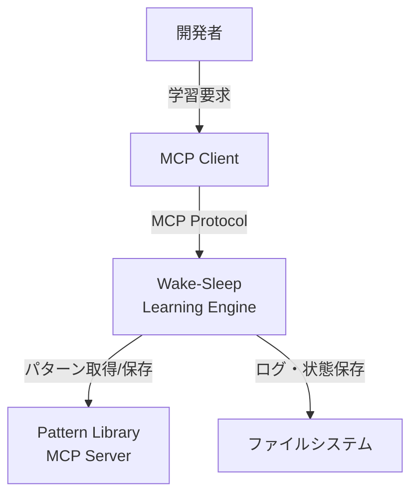
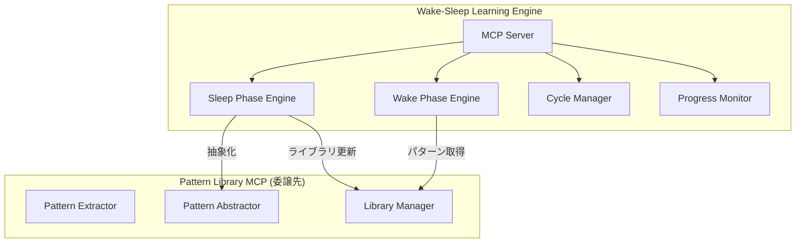

# MUSUBIX Wake-Sleep学習エンジン 設計書

**文書ID**: DES-WAKE-001  
**プロジェクト**: MUSUBIX  
**バージョン**: 1.0  
**作成日**: 2026-01-05  
**ステータス**: Draft  
**準拠要件**: REQ-WAKE-001

---

## 1. 概要

### 1.1 目的

DreamCoderアーキテクチャに基づくWake-Sleep学習エンジンの設計を定義する。タスク解決（Wake Phase）と抽象化学習（Sleep Phase）の交互サイクルにより、プログラム合成の効率を継続的に向上させる。

### 1.2 スコープ

本設計書は以下のコンポーネントを対象とする：
- Wake Phase（タスク解決）エンジン
- Sleep Phase（パターン抽象化）エンジン
- 学習サイクル管理
- パターンライブラリ連携（REQ-PATTERN-001への委譲）
- 進捗追跡・可視化

### 1.3 設計原則

| 原則 | 説明 |
|------|------|
| 関心の分離 | Wake/Sleepは独立モジュール |
| 機能委譲 | パターン抽出・類似度計算はPattern Library MCPに委譲 |
| リソース制約 | メモリ2GB、CPU 10分連続上限 |
| 収束保証 | 無限ループを検出・回避 |

### 1.4 DreamCoderアーキテクチャ概要

```
┌─────────────────────────────────────────────────────────┐
│                  Wake-Sleep Learning                     │
├──────────────────────┬──────────────────────────────────┤
│    Wake Phase        │       Sleep Phase                │
│  ┌─────────────┐    │    ┌─────────────┐               │
│  │ Task Input  │    │    │ Solutions   │               │
│  └──────┬──────┘    │    └──────┬──────┘               │
│         ▼           │           ▼                       │
│  ┌─────────────┐    │    ┌─────────────┐               │
│  │  Enumerate  │    │    │  Extract    │               │
│  │  Programs   │◄───┼────│  Abstractions│              │
│  └──────┬──────┘    │    └──────┬──────┘               │
│         ▼           │           ▼                       │
│  ┌─────────────┐    │    ┌─────────────┐               │
│  │  Evaluate   │    │    │  Compress   │               │
│  │  Solutions  │────┼────►  Library    │               │
│  └─────────────┘    │    └─────────────┘               │
└──────────────────────┴──────────────────────────────────┘
              Pattern Library (REQ-PATTERN-001)
```

---

## 2. C4アーキテクチャ

### 2.1 Context図



### 2.2 Container図



### 2.3 Component図


---

## 3. 詳細設計

### 3.1 Wake Phase エンジン（REQ-WAKE-001-F001, F004）

#### 3.1.1 型定義

```typescript
// packages/wake-sleep/src/wake/types.ts

interface WakePhaseEngine {
  solve(
    tasks: TaskExample[],
    library: PatternLibrary,
    options: WakeOptions
  ): Promise<WakeResult>;
}

interface TaskExample {
  input: unknown;
  expectedOutput: unknown;
  id?: string;
}

interface WakeOptions {
  maxDepth: number;          // 探索深度上限（デフォルト: 5）
  timeoutMs: number;         // タイムアウト（デフォルト: 30000）
  beamWidth: number;         // ビーム幅（デフォルト: 10）
  maxMemoryMB: number;       // メモリ上限（デフォルト: 2048）
}

interface WakeResult {
  solutions: Solution[];
  successRate: number;
  patternUsageStats: PatternUsageStats;
  searchStats: SearchStats;
}

interface Solution {
  taskId: string;
  program: Program;
  mdlScore: number;
  patternsUsed: string[];
  executionTime: number;
}

interface Program {
  ast: ProgramAST;
  source: string;
  complexity: number;
}

interface PatternUsageStats {
  usageCounts: Map<string, number>;
  unusedPatterns: string[];
  mostUseful: string[];
}
```

#### 3.1.2 列挙的探索

```typescript
// packages/wake-sleep/src/wake/enumerative-search.ts

interface EnumerativeSearch {
  enumerate(
    library: PatternLibrary,
    maxDepth: number,
    timeout: number
  ): AsyncGenerator<Program>;
}

class EnumerativeSearchImpl implements EnumerativeSearch {
  private resourceLimiter: ResourceLimiter;
  
  async *enumerate(
    library: PatternLibrary,
    maxDepth: number,
    timeout: number
  ): AsyncGenerator<Program> {
    const startTime = Date.now();
    const patterns = await library.list();
    
    // 深さ優先で列挙（短いプログラムを優先）
    for (let depth = 1; depth <= maxDepth; depth++) {
      // タイムアウトチェック
      if (Date.now() - startTime > timeout) {
        return;
      }
      
      // リソース制限チェック
      await this.resourceLimiter.checkAndWait();
      
      // 深さdのプログラムを列挙
      yield* this.enumerateAtDepth(patterns, depth);
    }
  }
  
  private async *enumerateAtDepth(
    patterns: Pattern[],
    depth: number
  ): AsyncGenerator<Program> {
    if (depth === 1) {
      // 基本パターンのみ
      for (const pattern of patterns) {
        yield this.patternToProgram(pattern);
      }
    } else {
      // パターンの組み合わせ
      for (const pattern of patterns) {
        for await (const subProgram of this.enumerateAtDepth(patterns, depth - 1)) {
          yield this.composePrograms(pattern, subProgram);
        }
      }
    }
  }
  
  private composePrograms(outer: Pattern, inner: Program): Program {
    // パターンの合成
    // outer のパラメータ位置に inner を埋め込む
    const paramSlots = this.findParameterSlots(outer);
    
    if (paramSlots.length === 0) {
      return this.patternToProgram(outer);
    }
    
    const composedAST = this.substituteParameter(
      outer.ast,
      paramSlots[0],
      inner.ast
    );
    
    return {
      ast: composedAST,
      source: this.astToSource(composedAST),
      complexity: outer.complexity + inner.complexity
    };
  }
}
```

#### 3.1.3 MDLスコアリング

```typescript
// packages/wake-sleep/src/wake/mdl-scorer.ts

interface MDLScorer {
  score(program: Program, library: PatternLibrary): number;
}

class MDLScorerImpl implements MDLScorer {
  /**
   * Minimum Description Length (MDL) スコアを計算
   * 低いほど良い（短い記述＝より良い圧縮）
   */
  score(program: Program, library: PatternLibrary): number {
    // MDL = log P(program | library) + log P(library)
    // ≈ program_length + library_usage_cost
    
    const programLength = this.calculateProgramLength(program);
    const libraryUsageCost = this.calculateLibraryUsageCost(program, library);
    
    return programLength + libraryUsageCost;
  }
  
  private calculateProgramLength(program: Program): number {
    // ASTノード数に基づく長さ
    return this.countNodes(program.ast);
  }
  
  private calculateLibraryUsageCost(program: Program, library: PatternLibrary): number {
    // 使用されたパターンの「珍しさ」に基づくコスト
    // 頻繁に使われるパターンは低コスト
    let cost = 0;
    const usedPatterns = this.extractUsedPatterns(program);
    
    for (const patternId of usedPatterns) {
      const pattern = library.get(patternId);
      if (pattern) {
        // -log(frequency) に比例したコスト
        cost += -Math.log(pattern.frequency / library.totalFrequency);
      }
    }
    
    return cost;
  }
}
```

#### 3.1.4 ビームサーチ

```typescript
// packages/wake-sleep/src/wake/beam-search.ts

interface BeamSearch {
  search(
    task: TaskExample,
    candidates: AsyncGenerator<Program>,
    beamWidth: number
  ): Promise<Solution[]>;
}

class BeamSearchImpl implements BeamSearch {
  private evaluator: ProgramEvaluator;
  private scorer: MDLScorer;
  
  async search(
    task: TaskExample,
    candidates: AsyncGenerator<Program>,
    beamWidth: number
  ): Promise<Solution[]> {
    const beam: ScoredProgram[] = [];
    
    for await (const program of candidates) {
      // プログラムを評価
      const result = await this.evaluator.evaluate(program, task);
      
      if (result.correct) {
        const score = this.scorer.score(program, this.library);
        
        // ビームに追加
        beam.push({ program, score, result });
        
        // ビーム幅を超えたら最悪のものを削除
        if (beam.length > beamWidth) {
          beam.sort((a, b) => a.score - b.score);  // 低スコアほど良い
          beam.pop();
        }
      }
    }
    
    return beam.map(sp => ({
      taskId: task.id || 'unknown',
      program: sp.program,
      mdlScore: sp.score,
      patternsUsed: this.extractPatternIds(sp.program),
      executionTime: sp.result.executionTime
    }));
  }
}
```

---

### 3.2 Sleep Phase エンジン（REQ-WAKE-001-F002, F005）

#### 3.2.1 型定義

```typescript
// packages/wake-sleep/src/sleep/types.ts

interface SleepPhaseEngine {
  abstract(
    solutions: Solution[],
    library: PatternLibrary,
    options: SleepOptions
  ): Promise<SleepResult>;
}

interface SleepOptions {
  minAbstractionScore: number;  // 品質閾値（デフォルト: 0.5）
  maxNewPatterns: number;       // 新規パターン上限（デフォルト: 10）
}

interface SleepResult {
  newPatterns: NewPattern[];
  libraryCompression: CompressionStats;
  abstractionStats: AbstractionStats;
}

interface NewPattern {
  id: string;
  abstraction: string;
  generalityScore: number;
  derivedFrom: string[];  // 元になった解決策のID
}

interface AbstractionStats {
  candidatesEvaluated: number;
  accepted: number;
  rejected: number;
  avgGeneralityScore: number;
}
```

#### 3.2.2 共通サブ構造スキャナ

```typescript
// packages/wake-sleep/src/sleep/common-substructure-scanner.ts

interface CommonSubstructureScanner {
  scan(programs: Program[]): SubstructureCandidate[];
}

interface SubstructureCandidate {
  structure: ProgramAST;
  occurrences: Occurrence[];
  frequency: number;
}

class CommonSubstructureScannerImpl implements CommonSubstructureScanner {
  scan(programs: Program[]): SubstructureCandidate[] {
    const candidates: Map<string, SubstructureCandidate> = new Map();
    
    // 各プログラムからサブ構造を抽出
    for (const program of programs) {
      const subtrees = this.extractAllSubtrees(program.ast);
      
      for (const subtree of subtrees) {
        const hash = this.computeStructuralHash(subtree);
        
        const existing = candidates.get(hash);
        if (existing) {
          existing.occurrences.push({
            programId: program.id,
            position: subtree.position
          });
          existing.frequency++;
        } else {
          candidates.set(hash, {
            structure: subtree.ast,
            occurrences: [{
              programId: program.id,
              position: subtree.position
            }],
            frequency: 1
          });
        }
      }
    }
    
    // 頻度でフィルタリング（2回以上出現）
    return Array.from(candidates.values())
      .filter(c => c.frequency >= 2)
      .sort((a, b) => b.frequency - a.frequency);
  }
  
  private extractAllSubtrees(ast: ProgramAST): Subtree[] {
    const subtrees: Subtree[] = [];
    
    const traverse = (node: ASTNode, position: number[]) => {
      // このノードをルートとするサブツリーを追加
      subtrees.push({
        ast: node,
        position
      });
      
      // 子ノードを再帰的に処理
      for (let i = 0; i < node.children.length; i++) {
        traverse(node.children[i], [...position, i]);
      }
    };
    
    traverse(ast.root, []);
    return subtrees;
  }
}
```

#### 3.2.3 抽象化品質評価

```typescript
// packages/wake-sleep/src/sleep/quality-evaluator.ts

interface QualityEvaluator {
  evaluate(abstraction: AbstractionCandidate): QualityScore;
}

interface QualityScore {
  generalityScore: number;      // 汎用性（0-1）
  reusabilityScore: number;     // 再利用可能性（0-1）
  complexityPenalty: number;    // 複雑さペナルティ（0-1）
  overallScore: number;         // 総合スコア（0-1）
}

class QualityEvaluatorImpl implements QualityEvaluator {
  evaluate(abstraction: AbstractionCandidate): QualityScore {
    const generalityScore = this.calculateGenerality(abstraction);
    const reusabilityScore = this.calculateReusability(abstraction);
    const complexityPenalty = this.calculateComplexityPenalty(abstraction);
    
    // 重み付き平均
    const overallScore = 
      0.4 * generalityScore +
      0.4 * reusabilityScore -
      0.2 * complexityPenalty;
    
    return {
      generalityScore,
      reusabilityScore,
      complexityPenalty,
      overallScore: Math.max(0, Math.min(1, overallScore))
    };
  }
  
  private calculateGenerality(abstraction: AbstractionCandidate): number {
    // パラメータ数に基づく汎用性
    // パラメータが多いほど汎用的だが、多すぎると過度に抽象的
    const paramCount = abstraction.parameters.length;
    
    if (paramCount === 0) return 0.2;  // パラメータなし＝具体的すぎる
    if (paramCount <= 2) return 0.9;   // 適度なパラメータ数
    if (paramCount <= 4) return 0.7;
    return 0.4;  // パラメータ多すぎ
  }
  
  private calculateReusability(abstraction: AbstractionCandidate): number {
    // 出現頻度に基づく再利用可能性
    const frequency = abstraction.occurrences.length;
    
    // 対数スケールで正規化
    return Math.min(1, Math.log(frequency + 1) / Math.log(10));
  }
  
  private calculateComplexityPenalty(abstraction: AbstractionCandidate): number {
    // AST深さに基づく複雑さペナルティ
    const depth = this.calculateASTDepth(abstraction.structure);
    
    if (depth <= 3) return 0;
    if (depth <= 5) return 0.2;
    if (depth <= 7) return 0.4;
    return 0.6;
  }
}
```

---

### 3.3 学習サイクル管理（REQ-WAKE-001-F003）

#### 3.3.1 サイクルマネージャ

```typescript
// packages/wake-sleep/src/cycle/cycle-manager.ts

interface CycleManager {
  runCycle(
    tasks: TaskExample[],
    libraryPath: string,
    options: CycleOptions
  ): Promise<CycleResult>;
}

interface CycleOptions {
  numCycles: number;              // サイクル数（デフォルト: 3）
  convergenceThreshold: number;   // 収束判定閾値（デフォルト: 0.01）
  wakeOptions: WakeOptions;
  sleepOptions: SleepOptions;
}

interface CycleResult {
  updatedLibraryPath: string;
  cycleResults: SingleCycleResult[];
  converged: boolean;
  totalNewPatterns: number;
}

interface SingleCycleResult {
  cycle: number;
  successRate: number;
  newPatternsCount: number;
  librarySize: number;
  improvementRate: number;
}

class CycleManagerImpl implements CycleManager {
  private wakeEngine: WakePhaseEngine;
  private sleepEngine: SleepPhaseEngine;
  private convergenceDetector: ConvergenceDetector;
  private resourceLimiter: ResourceLimiter;
  
  async runCycle(
    tasks: TaskExample[],
    libraryPath: string,
    options: CycleOptions
  ): Promise<CycleResult> {
    const cycleResults: SingleCycleResult[] = [];
    let totalNewPatterns = 0;
    let previousSuccessRate = 0;
    
    for (let cycle = 1; cycle <= options.numCycles; cycle++) {
      // リソース制限チェック
      await this.resourceLimiter.checkMemory(options.wakeOptions.maxMemoryMB);
      
      // Wake Phase
      const library = await this.loadLibrary(libraryPath);
      const wakeResult = await this.wakeEngine.solve(
        tasks,
        library,
        options.wakeOptions
      );
      
      // Sleep Phase
      const sleepResult = await this.sleepEngine.abstract(
        wakeResult.solutions,
        library,
        options.sleepOptions
      );
      
      // ライブラリ更新
      await this.updateLibrary(library, sleepResult.newPatterns, libraryPath);
      
      // サイクル結果を記録
      const cycleResult: SingleCycleResult = {
        cycle,
        successRate: wakeResult.successRate,
        newPatternsCount: sleepResult.newPatterns.length,
        librarySize: library.size + sleepResult.newPatterns.length,
        improvementRate: wakeResult.successRate - previousSuccessRate
      };
      
      cycleResults.push(cycleResult);
      totalNewPatterns += sleepResult.newPatterns.length;
      
      // 収束判定
      if (this.convergenceDetector.hasConverged(
        cycleResults,
        options.convergenceThreshold
      )) {
        return {
          updatedLibraryPath: libraryPath,
          cycleResults,
          converged: true,
          totalNewPatterns
        };
      }
      
      previousSuccessRate = wakeResult.successRate;
    }
    
    return {
      updatedLibraryPath: libraryPath,
      cycleResults,
      converged: false,
      totalNewPatterns
    };
  }
}
```

#### 3.3.2 収束検出器

```typescript
// packages/wake-sleep/src/cycle/convergence-detector.ts

interface ConvergenceDetector {
  hasConverged(
    cycleResults: SingleCycleResult[],
    threshold: number
  ): boolean;
}

class ConvergenceDetectorImpl implements ConvergenceDetector {
  hasConverged(
    cycleResults: SingleCycleResult[],
    threshold: number
  ): boolean {
    if (cycleResults.length < 2) {
      return false;
    }
    
    // 直近2サイクルの改善率をチェック
    const lastTwo = cycleResults.slice(-2);
    const avgImprovement = 
      (lastTwo[0].improvementRate + lastTwo[1].improvementRate) / 2;
    
    // 改善が閾値以下なら収束
    if (Math.abs(avgImprovement) < threshold) {
      return true;
    }
    
    // 成功率が100%に達したら収束
    if (lastTwo[1].successRate >= 1.0) {
      return true;
    }
    
    // 新規パターンが生成されなくなったら収束
    if (lastTwo[0].newPatternsCount === 0 && lastTwo[1].newPatternsCount === 0) {
      return true;
    }
    
    return false;
  }
}
```

#### 3.3.3 リソース制限（REQ-WAKE-001-NF004）

```typescript
// packages/wake-sleep/src/cycle/resource-limiter.ts

interface ResourceLimiter {
  checkMemory(maxMB: number): Promise<void>;
  checkCPU(maxConsecutiveMinutes: number): Promise<void>;
  checkAndWait(): Promise<void>;
}

class ResourceLimiterImpl implements ResourceLimiter {
  private highCPUStartTime: number | null = null;
  private readonly MAX_CPU_CONSECUTIVE_MS = 10 * 60 * 1000;  // 10分
  
  async checkMemory(maxMB: number): Promise<void> {
    const used = process.memoryUsage().heapUsed / 1024 / 1024;
    
    if (used > maxMB) {
      // ガベージコレクションを促す
      if (global.gc) {
        global.gc();
      }
      
      // 再チェック
      const usedAfterGC = process.memoryUsage().heapUsed / 1024 / 1024;
      if (usedAfterGC > maxMB) {
        throw new ResourceLimitError(
          `Memory usage ${usedAfterGC.toFixed(0)}MB exceeds limit ${maxMB}MB`
        );
      }
    }
  }
  
  async checkCPU(maxConsecutiveMinutes: number): Promise<void> {
    const cpuUsage = process.cpuUsage();
    const cpuPercent = (cpuUsage.user + cpuUsage.system) / 1000000 * 100;
    
    if (cpuPercent > 95) {  // 95%以上を「高負荷」とみなす
      if (this.highCPUStartTime === null) {
        this.highCPUStartTime = Date.now();
      } else {
        const elapsed = Date.now() - this.highCPUStartTime;
        if (elapsed > maxConsecutiveMinutes * 60 * 1000) {
          throw new ResourceLimitError(
            `CPU usage has been at 100% for ${maxConsecutiveMinutes} minutes`
          );
        }
      }
    } else {
      this.highCPUStartTime = null;
    }
  }
  
  async checkAndWait(): Promise<void> {
    // メモリが80%を超えていたら少し待つ
    const used = process.memoryUsage().heapUsed / 1024 / 1024;
    const total = 2048;  // 2GB
    
    if (used / total > 0.8) {
      await new Promise(resolve => setTimeout(resolve, 100));
      if (global.gc) {
        global.gc();
      }
    }
  }
}
```

---

### 3.4 進捗追跡・可視化（REQ-WAKE-001-F006）

```typescript
// packages/wake-sleep/src/progress/progress-monitor.ts

interface ProgressMonitor {
  onCycleStart(cycle: number): void;
  onWakePhaseComplete(result: WakeResult): void;
  onSleepPhaseComplete(result: SleepResult): void;
  onCycleComplete(result: SingleCycleResult): void;
  getProgressReport(): ProgressReport;
}

interface ProgressReport {
  currentCycle: number;
  successRateHistory: number[];
  libraryGrowth: number[];
  estimatedCompletion: Date | null;
}

class ProgressMonitorImpl implements ProgressMonitor {
  private cycleHistory: SingleCycleResult[] = [];
  private currentCycle: number = 0;
  private logger: Logger;
  
  constructor(logger: Logger) {
    this.logger = logger;
  }
  
  onCycleStart(cycle: number): void {
    this.currentCycle = cycle;
    this.logger.info(`=== Wake-Sleep Cycle ${cycle} Started ===`);
  }
  
  onWakePhaseComplete(result: WakeResult): void {
    this.logger.info(`Wake Phase Complete:`);
    this.logger.info(`  - Success Rate: ${(result.successRate * 100).toFixed(1)}%`);
    this.logger.info(`  - Solutions Found: ${result.solutions.length}`);
    this.logger.info(`  - Pattern Usage:`);
    
    for (const [patternId, count] of result.patternUsageStats.usageCounts) {
      this.logger.debug(`    - ${patternId}: ${count} times`);
    }
  }
  
  onSleepPhaseComplete(result: SleepResult): void {
    this.logger.info(`Sleep Phase Complete:`);
    this.logger.info(`  - New Patterns: ${result.newPatterns.length}`);
    this.logger.info(`  - Library Compression: ${result.libraryCompression.compressionRatio.toFixed(2)}`);
    
    for (const pattern of result.newPatterns) {
      this.logger.debug(`    - ${pattern.id} (score: ${pattern.generalityScore.toFixed(2)})`);
    }
  }
  
  onCycleComplete(result: SingleCycleResult): void {
    this.cycleHistory.push(result);
    
    this.logger.info(`=== Cycle ${result.cycle} Complete ===`);
    this.logger.info(`  - Success Rate: ${(result.successRate * 100).toFixed(1)}%`);
    this.logger.info(`  - Improvement: ${(result.improvementRate * 100).toFixed(1)}%`);
    this.logger.info(`  - Library Size: ${result.librarySize}`);
  }
  
  getProgressReport(): ProgressReport {
    return {
      currentCycle: this.currentCycle,
      successRateHistory: this.cycleHistory.map(c => c.successRate),
      libraryGrowth: this.cycleHistory.map(c => c.librarySize),
      estimatedCompletion: this.estimateCompletion()
    };
  }
  
  private estimateCompletion(): Date | null {
    if (this.cycleHistory.length < 2) {
      return null;
    }
    
    // 改善率の傾向から収束時期を推定
    const improvements = this.cycleHistory.map(c => c.improvementRate);
    const avgImprovement = improvements.reduce((a, b) => a + b, 0) / improvements.length;
    
    if (avgImprovement <= 0.01) {
      return new Date();  // すでに収束
    }
    
    const currentRate = this.cycleHistory[this.cycleHistory.length - 1].successRate;
    const remainingImprovement = 1.0 - currentRate;
    const estimatedCycles = remainingImprovement / avgImprovement;
    
    // 1サイクルあたりの平均時間（仮定: 5分）
    const msPerCycle = 5 * 60 * 1000;
    return new Date(Date.now() + estimatedCycles * msPerCycle);
  }
}
```

---

## 4. MCPサーバー実装

```typescript
// packages/wake-sleep/src/server/index.ts

import { Server } from '@modelcontextprotocol/sdk/server/index.js';

const server = new Server(
  {
    name: 'musubix-wake-sleep',
    version: '1.0.0',
  },
  {
    capabilities: {
      tools: {},
    },
  }
);

server.setRequestHandler(ListToolsRequestSchema, async () => ({
  tools: [
    {
      name: 'wake_phase',
      description: 'Wake Phase: パターンライブラリを使用してタスクを解決',
      inputSchema: {
        type: 'object',
        properties: {
          task_examples: { type: 'array' },
          library_path: { type: 'string' },
          max_depth: { type: 'number', default: 5 },
          timeout_ms: { type: 'number', default: 30000 }
        },
        required: ['task_examples', 'library_path']
      }
    },
    {
      name: 'sleep_phase',
      description: 'Sleep Phase: 解決策から共通パターンを抽出・抽象化',
      inputSchema: {
        type: 'object',
        properties: {
          solutions: { type: 'array' },
          library_path: { type: 'string' },
          min_abstraction_score: { type: 'number', default: 0.5 }
        },
        required: ['solutions', 'library_path']
      }
    },
    {
      name: 'wake_sleep_cycle',
      description: 'Wake-Sleep学習サイクルを実行',
      inputSchema: {
        type: 'object',
        properties: {
          task_examples: { type: 'array' },
          library_path: { type: 'string' },
          num_cycles: { type: 'number', default: 3 },
          convergence_threshold: { type: 'number', default: 0.01 }
        },
        required: ['task_examples', 'library_path']
      }
    }
  ]
}));
```

---

## 5. ディレクトリ構成

```
packages/wake-sleep/
├── src/
│   ├── server/
│   │   └── index.ts
│   ├── wake/
│   │   ├── types.ts
│   │   ├── enumerative-search.ts
│   │   ├── mdl-scorer.ts
│   │   ├── beam-search.ts
│   │   ├── program-evaluator.ts
│   │   └── index.ts
│   ├── sleep/
│   │   ├── types.ts
│   │   ├── common-substructure-scanner.ts
│   │   ├── abstraction-generator.ts
│   │   ├── quality-evaluator.ts
│   │   └── index.ts
│   ├── cycle/
│   │   ├── cycle-manager.ts
│   │   ├── convergence-detector.ts
│   │   ├── resource-limiter.ts
│   │   └── index.ts
│   ├── progress/
│   │   ├── progress-monitor.ts
│   │   └── index.ts
│   └── index.ts
├── tests/
├── package.json
└── tsconfig.json
```

---

## 6. テスト戦略

| モジュール | テスト対象 | カバレッジ目標 |
|-----------|-----------|---------------|
| EnumerativeSearch | 列挙、深度制限 | 85% |
| MDLScorer | スコア計算 | 95% |
| BeamSearch | ビーム維持、解選択 | 90% |
| CommonSubstructureScanner | サブ構造抽出 | 85% |
| QualityEvaluator | 品質スコア | 90% |
| CycleManager | サイクル実行、収束 | 85% |
| ResourceLimiter | メモリ/CPU制限 | 95% |

---

## 7. 依存関係

```json
{
  "dependencies": {
    "@modelcontextprotocol/sdk": "^1.0.0",
    "@nahisaho/musubix-pattern-mcp": "^1.0.0"
  },
  "devDependencies": {
    "vitest": "^3.0.0"
  }
}
```

---

## 8. トレーサビリティ

| 設計セクション | 要件 | タスク |
|---------------|------|--------|
| 3.1 Wake Phase | REQ-WAKE-001-F001, F004 | TSK-WAKE-001, TSK-WAKE-004 |
| 3.2 Sleep Phase | REQ-WAKE-001-F002, F005 | TSK-WAKE-002, TSK-WAKE-005 |
| 3.3 サイクル管理 | REQ-WAKE-001-F003 | TSK-WAKE-003 |
| 3.4 進捗追跡 | REQ-WAKE-001-F006 | TSK-WAKE-006 |
| 3.3.3 リソース制限 | REQ-WAKE-001-NF004 | TSK-WAKE-007 |

---

**文書履歴**:
| バージョン | 日付 | 変更内容 | 作成者 |
|-----------|------|---------|--------|
| 1.0 | 2026-01-05 | 初版作成 | Claude |
