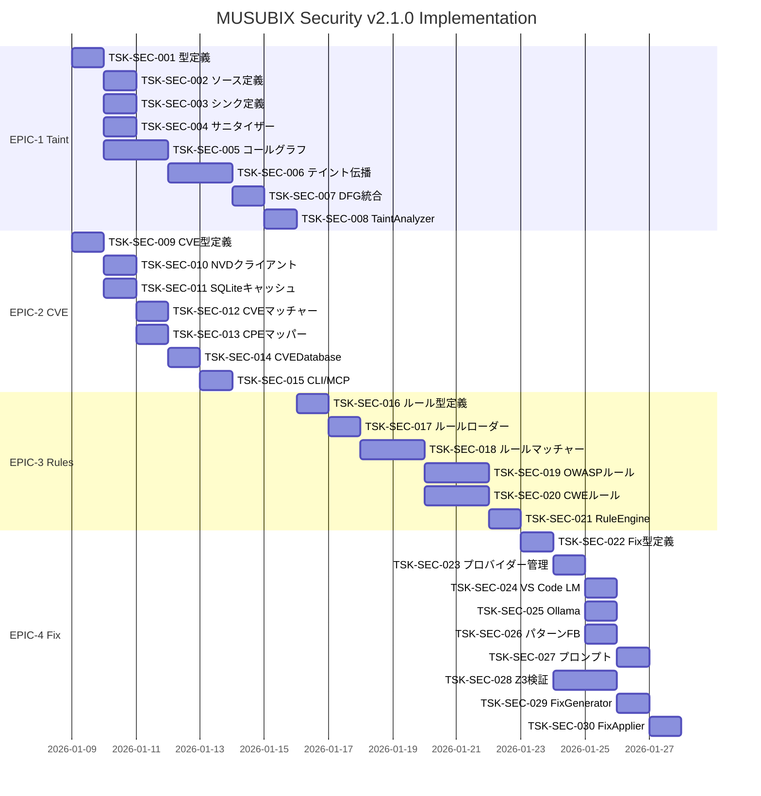

# MUSUBIX Security v2.1.0 タスク分解

**ドキュメントID**: TSK-SECURITY-2.1.0  
**バージョン**: 1.0.0  
**作成日**: 2026-01-08  
**関連設計**: DES-SECURITY-2.1.0  
**関連要件**: REQ-SECURITY-2.1.0

---

## 概要

v2.1.0 Security強化の実装タスクを以下の4つのエピックに分解：

| Epic | タスク数 | 見積もり |
|------|---------|---------|
| **EPIC-1**: テイント分析強化 | 8 | 1.5週 |
| **EPIC-2**: CVEデータベース連携 | 7 | 1週 |
| **EPIC-3**: OWASP/CWEルール実装 | 6 | 1.5週 |
| **EPIC-4**: 自動修正パイプライン | 9 | 2週 |
| **合計** | 30 | 6週 |

---

## EPIC-1: テイント分析強化

### TSK-SEC-001: 型定義の拡張

**優先度**: P0  
**見積もり**: 2h  
**依存**: なし  
**Trace**: REQ-SEC-TAINT-001, DES-SEC-TAINT-001

**内容**:
- [ ] `packages/security/src/types/taint.ts` を新規作成
- [ ] `TaintSource`, `TaintSink`, `Sanitizer` インターフェース定義
- [ ] `TaintPath`, `TaintNode` インターフェース定義
- [ ] `TaintAnalyzerOptions` インターフェース定義

**受け入れ基準**:
- TypeScript型チェックが通る
- 既存コードとの互換性維持

---

### TSK-SEC-002: ビルトインソース定義

**優先度**: P0  
**見積もり**: 3h  
**依存**: TSK-SEC-001  
**Trace**: REQ-SEC-TAINT-002, DES-SEC-TAINT-002

**内容**:
- [ ] `packages/security/src/analysis/sources/` ディレクトリ作成
- [ ] `source-registry.ts` - ソース登録・管理
- [ ] `builtin-sources.ts` - ビルトインソース定義
  - HTTP入力: `req.body`, `req.query`, `req.params`, `req.headers`
  - ユーザー入力: `document.getElementById().value`, `prompt()`
  - 環境変数: `process.env.*`
  - ファイル入力: `fs.readFile()`, `fs.readFileSync()`
  - データベース結果: `db.query()` 結果
  - 外部API: `fetch()`, `axios.get()` レスポンス

**受け入れ基準**:
- 6カテゴリのソースが登録可能
- カスタムソース追加API

---

### TSK-SEC-003: ビルトインシンク定義

**優先度**: P0  
**見積もり**: 3h  
**依存**: TSK-SEC-001  
**Trace**: REQ-SEC-TAINT-002, DES-SEC-TAINT-002

**内容**:
- [ ] `packages/security/src/analysis/sinks/` ディレクトリ作成
- [ ] `sink-registry.ts` - シンク登録・管理
- [ ] `builtin-sinks.ts` - ビルトインシンク定義
  - SQL (CWE-89): `db.query()`, `sequelize.query()`
  - コマンド (CWE-78): `exec()`, `spawn()`, `execSync()`
  - HTML (CWE-79): `innerHTML`, `document.write()`
  - パス (CWE-22): `fs.readFile(path)`, `path.join()`
  - コード (CWE-94): `eval()`, `new Function()`
  - リダイレクト (CWE-601): `res.redirect()`

**受け入れ基準**:
- 6カテゴリのシンクが登録可能
- CWEマッピング完備

---

### TSK-SEC-004: サニタイザー認識

**優先度**: P1  
**見積もり**: 3h  
**依存**: TSK-SEC-001  
**Trace**: REQ-SEC-TAINT-003, DES-SEC-TAINT-003

**内容**:
- [ ] `packages/security/src/analysis/sanitizers/` ディレクトリ作成
- [ ] `sanitizer-registry.ts` - サニタイザー登録・管理
- [ ] `builtin-sanitizers.ts` - ビルトインサニタイザー定義
  - SQL: パラメータ化クエリ, `escape()`, `sqlstring.escape()`
  - HTML: `DOMPurify.sanitize()`, `escapeHtml()`, `he.encode()`
  - URL: `encodeURIComponent()`, `encodeURI()`
  - パス: `path.normalize()` + 検証

**受け入れ基準**:
- サニタイザー適用後のテイントクリア
- 部分サニタイズの認識

---

### TSK-SEC-005: コールグラフビルダー

**優先度**: P0  
**見積もり**: 6h  
**依存**: TSK-SEC-001  
**Trace**: REQ-SEC-TAINT-001, DES-SEC-TAINT-001

**内容**:
- [ ] `packages/security/src/analysis/interprocedural/` ディレクトリ作成
- [ ] `call-graph-builder.ts` - コールグラフ構築
  - 関数呼び出しの追跡
  - モジュール境界の認識
  - 動的呼び出しの近似

**受け入れ基準**:
- 単一ファイル内のコールグラフ構築
- 複数ファイル間のコールグラフ構築
- テスト: 10ファイル以上のプロジェクト

---

### TSK-SEC-006: テイント伝播エンジン

**優先度**: P0  
**見積もり**: 8h  
**依存**: TSK-SEC-002, TSK-SEC-003, TSK-SEC-005  
**Trace**: REQ-SEC-TAINT-001, DES-SEC-TAINT-001

**内容**:
- [ ] `packages/security/src/analysis/interprocedural/taint-propagator.ts`
  - ソースからシンクへのテイント伝播
  - 関数呼び出しを跨いだ伝播
  - 代入・演算を通じた伝播
  - async/await, Promise対応

**受け入れ基準**:
- インタープロシージャルテイント追跡
- 最大呼び出し深度の設定可能
- パス情報の完全な記録

---

### TSK-SEC-007: DFGパッケージ統合

**優先度**: P0  
**見積もり**: 4h  
**依存**: TSK-SEC-006  
**Trace**: REQ-SEC-TAINT-004, DES-SEC-TAINT-004

**内容**:
- [ ] `packages/security/src/analysis/dfg-adapter.ts`
  - `@nahisaho/musubix-dfg` との連携
  - DFGからテイントパス抽出
  - CFGとの統合

**受け入れ基準**:
- DFGパッケージからデータフロー取得
- パス感度解析の実行

---

### TSK-SEC-008: TaintAnalyzer統合

**優先度**: P0  
**見積もり**: 4h  
**依存**: TSK-SEC-002〜007  
**Trace**: REQ-SEC-TAINT-001〜004

**内容**:
- [ ] `packages/security/src/analysis/taint-analyzer.ts` の拡張
  - 新しいインターフェースの実装
  - インタープロシージャル解析の統合
  - 後方互換性の維持
- [ ] ユニットテスト作成

**受け入れ基準**:
- 既存テストが全て通る
- 新機能のテストカバレッジ 90%+

---

## EPIC-2: CVEデータベース連携

### TSK-SEC-009: CVE型定義

**優先度**: P0  
**見積もり**: 2h  
**依存**: なし  
**Trace**: REQ-SEC-CVE-001, DES-SEC-CVE-001

**内容**:
- [ ] `packages/security/src/types/cve.ts` を新規作成
- [ ] `CVE`, `CVSSScore`, `CPEMatch` インターフェース定義
- [ ] `CVEFinding`, `CVESearchQuery` インターフェース定義
- [ ] NVD API 2.0 レスポンス型定義

**受け入れ基準**:
- NVD API仕様との整合性
- 型安全なAPIクライアント

---

### TSK-SEC-010: NVD APIクライアント

**優先度**: P0  
**見積もり**: 4h  
**依存**: TSK-SEC-009  
**Trace**: REQ-SEC-CVE-001, DES-SEC-CVE-001

**内容**:
- [ ] `packages/security/src/databases/nvd-client.ts`
  - NVD API 2.0 クライアント実装
  - レートリミット対応 (5 req/30s without API key)
  - リトライ（指数バックオフ）
  - API Key対応

**受け入れ基準**:
- CVE ID検索
- CPE検索
- キーワード検索
- レートリミット遵守

---

### TSK-SEC-011: SQLiteキャッシュ

**優先度**: P0  
**見積もり**: 4h  
**依存**: TSK-SEC-009  
**Trace**: REQ-SEC-CVE-002, DES-SEC-CVE-002

**内容**:
- [ ] `packages/security/src/databases/local-cache.ts`
  - SQLiteスキーマ作成
  - CVEテーブル
  - CPEマッチテーブル
  - npm→CPEマッピングテーブル
  - TTL管理（デフォルト24時間）
  - LRU eviction

**受け入れ基準**:
- CVEの保存・取得
- TTL切れの自動削除
- 500MB上限遵守

---

### TSK-SEC-012: CVEマッチャー

**優先度**: P0  
**見積もり**: 4h  
**依存**: TSK-SEC-011  
**Trace**: REQ-SEC-CVE-003, DES-SEC-CVE-003

**内容**:
- [ ] `packages/security/src/databases/cve-matcher.ts`
  - semverバージョン比較
  - CPEバージョン範囲マッチング
  - 影響バージョンの特定

**受け入れ基準**:
- `versionStartIncluding` / `versionEndExcluding` 対応
- セマンティックバージョン比較

---

### TSK-SEC-013: npm→CPEマッパー

**優先度**: P0  
**見積もり**: 3h  
**依存**: TSK-SEC-011  
**Trace**: REQ-SEC-CVE-003, DES-SEC-CVE-003

**内容**:
- [ ] `packages/security/src/databases/cpe-mapper.ts`
  - npmパッケージ名 → CPE vendor/product 変換
  - 既知マッピングのキャッシュ
  - ヒューリスティック推定

**受け入れ基準**:
- 主要npmパッケージのCPEマッピング
- 未知パッケージの推定

---

### TSK-SEC-014: CVEDatabase統合

**優先度**: P0  
**見積もり**: 4h  
**依存**: TSK-SEC-010〜013  
**Trace**: REQ-SEC-CVE-001〜004

**内容**:
- [ ] `packages/security/src/databases/cve-database.ts`
  - CVEDatabase クラス実装
  - 初期化・同期
  - 依存関係チェック
  - パッケージチェック

**受け入れ基準**:
- `checkDependencies()` でpackage.json解析
- オフライン動作可能

---

### TSK-SEC-015: CVE CLI/MCPツール

**優先度**: P1  
**見積もり**: 3h  
**依存**: TSK-SEC-014  
**Trace**: REQ-SEC-CVE-001〜004

**内容**:
- [ ] `packages/security/src/cli/commands/cve-check.ts`
- [ ] `packages/security/src/mcp/tool-handlers/cve-tools.ts`
  - `security_cve_check` MCPツール

**受け入れ基準**:
- `npx musubix security cve-check` 動作
- MCPツールからのCVEチェック

---

## EPIC-3: OWASP/CWEルール実装

### TSK-SEC-016: ルール型定義

**優先度**: P0  
**見積もり**: 2h  
**依存**: なし  
**Trace**: REQ-SEC-RULES-003, DES-SEC-RULES-001

**内容**:
- [ ] `packages/security/src/types/rule.ts` を新規作成
- [ ] `Rule`, `ASTPattern`, `PatternConstraint` インターフェース
- [ ] `FixTemplate`, `RuleMatch` インターフェース

**受け入れ基準**:
- YAMLルール形式との整合性
- 型安全なルール定義

---

### TSK-SEC-017: ルールローダー

**優先度**: P0  
**見積もり**: 4h  
**依存**: TSK-SEC-016  
**Trace**: REQ-SEC-RULES-003, DES-SEC-RULES-003

**内容**:
- [ ] `packages/security/src/rules/rule-loader.ts`
  - YAMLルールファイルの読み込み
  - スキーマ検証
  - ルールオブジェクトへの変換

**受け入れ基準**:
- YAML/JSON両対応
- スキーマバリデーション

---

### TSK-SEC-018: ルールマッチャー

**優先度**: P0  
**見積もり**: 6h  
**依存**: TSK-SEC-017  
**Trace**: REQ-SEC-RULES-003, DES-SEC-RULES-003

**内容**:
- [ ] `packages/security/src/rules/rule-matcher.ts`
  - ASTパターンマッチング
  - テイント制約評価
  - 正規表現制約

**受け入れ基準**:
- 複雑なASTパターンのマッチング
- テイント状態の考慮

---

### TSK-SEC-019: OWASP Top 10ルール

**優先度**: P0  
**見積もり**: 8h  
**依存**: TSK-SEC-018  
**Trace**: REQ-SEC-RULES-001, DES-SEC-RULES-001

**内容**:
- [ ] `packages/security/src/rules/owasp/` ディレクトリ作成
- [ ] 10個のYAMLルールファイル作成:
  - `a01-broken-access.yaml`
  - `a02-crypto-failures.yaml`
  - `a03-injection.yaml`
  - `a04-insecure-design.yaml`
  - `a05-misconfiguration.yaml`
  - `a06-vulnerable-components.yaml`
  - `a07-auth-failures.yaml`
  - `a08-integrity-failures.yaml`
  - `a09-logging-failures.yaml`
  - `a10-ssrf.yaml`

**受け入れ基準**:
- 各カテゴリ最低3ルール
- リファレンスURL完備

---

### TSK-SEC-020: CWE Top 25ルール

**優先度**: P0  
**見積もり**: 6h  
**依存**: TSK-SEC-018  
**Trace**: REQ-SEC-RULES-002, DES-SEC-RULES-002

**内容**:
- [ ] `packages/security/src/rules/cwe/` ディレクトリ作成
- [ ] `cwe-top-25.yaml` 作成
  - 25個のCWEルール定義

**受け入れ基準**:
- CWE Top 25 (2023) 全項目
- 重複のOWASPルールとの整合性

---

### TSK-SEC-021: RuleEngine統合

**優先度**: P0  
**見積もり**: 4h  
**依存**: TSK-SEC-017〜020  
**Trace**: REQ-SEC-RULES-001〜004

**内容**:
- [ ] `packages/security/src/rules/rule-engine.ts`
  - ルール登録・管理
  - ルールセット切り替え
  - カスタムルール対応

**受け入れ基準**:
- ルールセット選択可能
- カスタムルール追加可能

---

## EPIC-4: 自動修正パイプライン

### TSK-SEC-022: Fix型定義

**優先度**: P0  
**見積もり**: 2h  
**依存**: なし  
**Trace**: REQ-SEC-FIX-001, DES-SEC-FIX-001

**内容**:
- [ ] `packages/security/src/types/fix.ts` を新規作成
- [ ] `FixCandidate`, `VerificationResult` インターフェース
- [ ] `LLMProvider`, `FixPrompt` インターフェース
- [ ] `ConfidenceFactors`, `ApplyResult` インターフェース

**受け入れ基準**:
- 全修正関連型の定義
- 信頼度スコア型

---

### TSK-SEC-023: LLMプロバイダーレジストリ

**優先度**: P0  
**見積もり**: 3h  
**依存**: TSK-SEC-022  
**Trace**: REQ-SEC-FIX-001, DES-SEC-FIX-001

**内容**:
- [ ] `packages/security/src/remediation/providers/provider-registry.ts`
  - プロバイダー登録・優先度管理
  - 利用可能プロバイダー検出
  - フォールバックロジック

**受け入れ基準**:
- 優先度順のプロバイダー選択
- 利用不可時のフォールバック

---

### TSK-SEC-024: VS Code LMプロバイダー

**優先度**: P0  
**見積もり**: 4h  
**依存**: TSK-SEC-023  
**Trace**: REQ-SEC-FIX-001, DES-SEC-FIX-LLM-001

**内容**:
- [ ] `packages/security/src/remediation/providers/vscode-lm-provider.ts`
  - VS Code Language Model API統合
  - プロンプト構築
  - レスポンス解析

**受け入れ基準**:
- VS Code拡張機能内で動作
- GitHub Copilot利用可能

---

### TSK-SEC-025: Ollamaプロバイダー

**優先度**: P1  
**見積もり**: 3h  
**依存**: TSK-SEC-023  
**Trace**: REQ-SEC-FIX-001

**内容**:
- [ ] `packages/security/src/remediation/providers/ollama-provider.ts`
  - Ollama REST API統合
  - ローカルLLMサポート

**受け入れ基準**:
- Ollama動作時に利用可能
- codellama, llama2対応

---

### TSK-SEC-026: パターンフォールバック

**優先度**: P1  
**見積もり**: 3h  
**依存**: TSK-SEC-023  
**Trace**: REQ-SEC-FIX-001

**内容**:
- [ ] `packages/security/src/remediation/providers/pattern-fallback.ts`
  - パターンベース修正生成
  - LLM不要の修正テンプレート

**受け入れ基準**:
- LLM利用不可時の代替
- 基本的な修正パターン

---

### TSK-SEC-027: 修正プロンプトビルダー

**優先度**: P0  
**見積もり**: 4h  
**依存**: TSK-SEC-024  
**Trace**: REQ-SEC-FIX-001, DES-SEC-FIX-001

**内容**:
- [ ] `packages/security/src/remediation/prompts/fix-prompt-builder.ts`
- [ ] `packages/security/src/remediation/prompts/templates/` ディレクトリ
  - CWE別プロンプトテンプレート

**受け入れ基準**:
- 脆弱性タイプ別最適化プロンプト
- コンテキスト情報の適切な含有

---

### TSK-SEC-028: Z3検証統合

**優先度**: P0  
**見積もり**: 6h  
**依存**: TSK-SEC-022  
**Trace**: REQ-SEC-FIX-002, DES-SEC-FIX-Z3-001

**内容**:
- [ ] `packages/security/src/remediation/verification/z3-verifier.ts`
  - `@nahisaho/musubix-formal-verify` 統合
  - セキュリティ制約のSMT式生成
  - 検証結果の解釈

**受け入れ基準**:
- SQL Injection修正の検証
- Command Injection修正の検証
- XSS修正の検証

---

### TSK-SEC-029: FixGenerator統合

**優先度**: P0  
**見積もり**: 4h  
**依存**: TSK-SEC-023〜028  
**Trace**: REQ-SEC-FIX-001〜003

**内容**:
- [ ] `packages/security/src/remediation/fix-generator.ts` の拡張
  - 新プロバイダーシステム統合
  - 信頼度スコア計算
  - 複数候補生成

**受け入れ基準**:
- 複数修正候補の生成
- 信頼度スコア付与
- 検証パイプライン連携

---

### TSK-SEC-030: FixApplier & Rollback

**優先度**: P1  
**見積もり**: 4h  
**依存**: TSK-SEC-029  
**Trace**: REQ-SEC-FIX-004, DES-SEC-FIX-004

**内容**:
- [ ] `packages/security/src/remediation/fix-applier.ts` の拡張
  - バックアップ管理
  - コードパッチ適用
  - テスト実行（オプション）
  - ロールバック

**受け入れ基準**:
- 適用前バックアップ
- テスト失敗時ロールバック
- git stash対応

---

## 実装順序

---

## チェックリスト

### 開始前確認
- [ ] 要件定義書レビュー完了
- [ ] 設計書レビュー完了
- [ ] 依存パッケージの確認（dfg, formal-verify）

### 完了条件
- [ ] 全タスクのユニットテスト作成
- [ ] 統合テスト作成
- [ ] ドキュメント更新
- [ ] CHANGELOG.md更新
- [ ] バージョン更新（2.1.0）

---

**© 2026 MUSUBIX Project**
