# MUSUBIX v3.7.0 タスク分解書
# Everything Claude Code Integration - Agent Skills実装

**文書ID**: TSK-v3.7.0  
**プロジェクト**: MUSUBIX  
**バージョン**: 1.0  
**作成日**: 2026-01-25  
**ステータス**: Draft  
**参照文書**: 
- REQ-v3.7.0-everything-claude-code-integration.md (要件定義書)
- DES-v3.7.0-everything-claude-code-integration.md (設計書)

---

## 1. 文書概要

### 1.1 目的

本文書は、MUSUBIX v3.7.0 Everything Claude Code統合機能の実装タスクを定義する。設計書（DES-v3.7.0）で定義された10のAgent Skillsを実装可能な単位に分解し、工数見積もり、依存関係、実装順序を明確化する。

### 1.2 タスク分類

| カテゴリ | タスク数 | 総工数見積 | 優先度 | 対応バージョン |
|---------|---------|-----------|--------|----------------|
| **Session Manager** | 4タスク | 8時間 | P0（必須） | v3.7.0 |
| **Context Optimizer** | 6タスク | 12時間 | P1-P2 | v3.7.0-v3.7.1 |
| **Learning Hooks** | 3タスク | 6時間 | P1（重要） | v3.7.0 |
| **Eval Harness** | 5タスク | 10時間 | P1（重要） | v3.7.1 |
| **Verification Loop** | 5タスク | 10時間 | P2 | v3.7.1 |
| **Checkpoint** | 5タスク | 10時間 | P2 | v3.7.1 |
| **Build Fix** | 3タスク | 6時間 | P2 | v3.7.1 |
| **Codemap** | 4タスク | 8時間 | P3 | v3.7.2 |
| **Refactor Cleaner** | 4タスク | 8時間 | P3 | v3.7.2 |
| **E2E Runner** | 3タスク | 6時間 | P3 | v3.7.2 |
| **Integration** | 5タスク | 15時間 | P1（重要） | v3.7.0-v3.7.1 |
| **Testing** | 5タスク | 12時間 | P0（必須） | v3.7.0-v3.7.2 |
| **Documentation** | 2タスク | 4時間 | P2（任意） | v3.7.2 |
| **合計** | **54タスク** | **115時間** | - | - |

注記: 54タスクのうち、**47タスク**が要件・設計（REQ/DES）に直接対応する実装タスク。残り**7タスク**（TSK-TEST-001〜005、TSK-DOC-001〜002）は品質保証・運用補助タスクとして位置付ける。

### 1.3 実装フェーズ

```
Phase 4-1: Foundation (v3.7.0) - 基盤スキル
  ├─ TSK-SM-001〜004: Session Manager (P0)
  ├─ TSK-CO-001〜003, TSK-CO-006: Context Optimizer (P1-P2)
  ├─ TSK-LH-001〜003: Learning Hooks (P1)
  ├─ TSK-INT-001: SkillWorkflowBridge (P1)
  └─ TSK-INT-004: SensitiveDataFilter (P1)
  ↓ 依存: Phase 4-1完了
  
Phase 4-2: Evaluation & Quality (v3.7.1) - 評価・品質スキル
  ├─ TSK-CO-004〜005: Context Optimizer (P2)
  ├─ TSK-EH-001〜005: Eval Harness (P1)
  ├─ TSK-VL-001〜005: Verification Loop (P2)
  ├─ TSK-CP-001〜005: Checkpoint (P2)
  ├─ TSK-BF-001〜003: Build Fix (P2)
  ├─ TSK-INT-002: SkillPatternBridge (P1)
  ├─ TSK-INT-003: SkillKnowledgeBridge (P1)
  └─ TSK-INT-005: QualityGateIntegration (P1)
  ↓ 依存: Phase 4-2完了
  
Phase 4-3: Code Intelligence (v3.7.2) - コード解析スキル
  ├─ TSK-CM-001〜004: Codemap (P3)
  ├─ TSK-RC-001〜004: Refactor Cleaner (P3)
  ├─ TSK-E2E-001〜003: E2E Runner (P3)
  └─ TSK-DOC-001〜002: Documentation (P2)
```

---

## 2. Session Manager スキル (P0)

### TSK-SM-001: session-manager SKILL.md作成

**優先度**: P0  
**工数**: 2時間  
**担当者**: -  
**依存**: なし  
**トレーサビリティ**: REQ-SM-001, REQ-SM-002, REQ-SM-003, REQ-SM-004, DES-SM-001, DES-SM-002, DES-SM-003, DES-SM-004

#### タスク詳細

session-managerスキルのSKILL.mdファイルを作成。

**実装ファイル**: `.github/skills/session-manager/SKILL.md`

**実装内容**:
```markdown
---
name: session-manager
description: |
  MUSUBIXセッション管理スキル。セッション開始時に過去のコンテキストを復元し、
  終了時に状態を永続化する。セッション間の継続性を提供する。
license: MIT
---

# Session Manager Skill

## 目的
セッション間でのコンテキスト継続性を提供し、開発作業の中断・再開をスムーズにする。

## セッション開始時の動作

セッションを開始したら、以下を実行してください：

1. `~/.musubix/sessions/`ディレクトリから過去7日間のセッションファイルを検索
2. 最新のセッションファイルから「Notes for Next Session」セクションを読み込み
3. 継続可能なコンテキストをユーザーに通知

[以下、REQ-SM-001〜004の指示内容を記述]
```

**成果物**:
- `.github/skills/session-manager/SKILL.md`
- YAML frontmatter完備
- セッション開始・終了・TodoWrite・Pre-Compact指示を含む

**テスト方法**:
- SKILL.mdファイルが`.github/skills/session-manager/`に配置されていること
- frontmatterが[Agent Skills標準](https://github.com/agentskills/agentskills)に準拠していること
- REQ-SM-001〜004の全要件が指示として記述されていること

**完了条件**:
- ✅ SKILL.mdがビルドエラーなく作成される
- ✅ frontmatterバリデーション合格
- ✅ 設計書DES-SM-001〜004との100%トレーサビリティ

---

### TSK-SM-002: session-start.shスクリプト作成

**優先度**: P0  
**工数**: 2時間  
**担当者**: -  
**依存**: TSK-SM-001  
**トレーサビリティ**: REQ-SM-001, DES-SM-001

#### タスク詳細

セッション開始時のコンテキスト復元スクリプトを作成。

**実装ファイル**: `.github/skills/session-manager/scripts/session-start.sh`

**実装内容**:
```bash
#!/usr/bin/env bash
# session-start.sh - セッション開始時コンテキスト復元

SESSION_DIR="${HOME}/.musubix/sessions"
DAYS_BACK=7

# 過去7日間のセッションファイルを検索
find "${SESSION_DIR}" -type f -name "*.md" -mtime -${DAYS_BACK} \
  | sort -r \
  | head -1 \
  | xargs -I {} cat {}

# Notes for Next Sessionセクションのみ抽出
sed -n '/^### Notes for Next Session/,/^##/p' | head -n -1
```

**成果物**:
- `.github/skills/session-manager/scripts/session-start.sh`
- 実行権限付き（chmod +x）
- DES-SM-001で定義された動作を実装

**テスト方法**:
```bash
# テストセッションファイルを作成
mkdir -p ~/.musubix/sessions
cat > ~/.musubix/sessions/test-session.md <<EOF
### Notes for Next Session
- Test context 1
- Test context 2
EOF

# スクリプト実行
bash .github/skills/session-manager/scripts/session-start.sh
# 期待: "Test context 1" と "Test context 2" が出力される
```

**完了条件**:
- ✅ スクリプトが正常に実行される
- ✅ 過去7日間のセッションファイルが検出される
- ✅ "Notes for Next Session"が正しく抽出される

---

### TSK-SM-003: session-end.shスクリプト作成

**優先度**: P0  
**工数**: 2時間  
**担当者**: -  
**依存**: TSK-SM-001  
**トレーサビリティ**: REQ-SM-002, DES-SM-002

#### タスク詳細

セッション終了時の状態保存スクリプトを作成。

**実装ファイル**: `.github/skills/session-manager/scripts/session-end.sh`

**実装内容**:
```bash
#!/usr/bin/env bash
# session-end.sh - セッション終了時状態保存

SESSION_DIR="${HOME}/.musubix/sessions"
SESSION_FILE="${SESSION_DIR}/$(date +%Y-%m-%d-%H%M).md"

mkdir -p "${SESSION_DIR}"

cat > "${SESSION_FILE}" <<EOF
# Session: $(date +%Y-%m-%d)
**Date:** $(date +%Y-%m-%d)
**Started:** ${SESSION_START_TIME}
**Last Updated:** $(date +%H:%M)

---

## Current State

### Completed
${COMPLETED_TASKS}

### In Progress
${IN_PROGRESS_TASKS}

### Notes for Next Session
${NEXT_SESSION_NOTES}

### Context to Load
\`\`\`
${CONTEXT_FILES}
\`\`\`
EOF

echo "Session saved to ${SESSION_FILE}"
```

**成果物**:
- `.github/skills/session-manager/scripts/session-end.sh`
- DES-SM-002で定義されたMarkdown形式で保存

**テスト方法**:
```bash
# 環境変数設定
export SESSION_START_TIME="14:30"
export COMPLETED_TASKS="- [x] Task 1"
export IN_PROGRESS_TASKS="- [ ] Task 2"
export NEXT_SESSION_NOTES="Important context"
export CONTEXT_FILES="src/main.ts"

# スクリプト実行
bash .github/skills/session-manager/scripts/session-end.sh

# 検証
ls -la ~/.musubix/sessions/
# 期待: YYYY-MM-DD-HHMM.md ファイルが作成されている
```

**完了条件**:
- ✅ セッションファイルが正しい形式で保存される
- ✅ DES-SM-002の保存形式に準拠
- ✅ タイムスタンプが正確に記録される

---

### TSK-SM-004: TodoWrite統合指示の追加

**優先度**: P0  
**工数**: 2時間  
**担当者**: -  
**依存**: TSK-SM-001  
**トレーサビリティ**: REQ-SM-004, DES-SM-004

#### タスク詳細

SKILL.mdにTodoWrite Best Practices指示を追加。

**実装ファイル**: `.github/skills/session-manager/SKILL.md`（TSK-SM-001で作成済み）

**追加内容**:
```markdown
## TodoWriteベストプラクティス

マルチステップタスクを実行する際は、必ずTodoWriteツールを使用してください：

### 使用タイミング
- タスクが3ステップ以上ある場合
- 実装順序が重要な場合
- 要件の理解が不確実な場合

### TodoWrite記録内容
1. **タスクリスト作成**: 各ステップを明示し、粒度を適切に保つ
2. **進捗チェック**: 完了したステップを即座にチェック
3. **順序検証**: ステップの順序が論理的か確認
4. **欠落検出**: 重要なステップが抜けていないか確認
5. **粒度チェック**: 各ステップが2-4時間で完了可能か

### セッション終了時
未完了のTodoをNotes for Next Sessionに記録し、次回セッションで継続可能にする。

### 例
\`\`\`markdown
**Todo List:**
- [x] Step 1: Requirements analysis
- [x] Step 2: Design document creation
- [ ] Step 3: Implementation (← 次回ここから)
- [ ] Step 4: Testing
\`\`\`
```

**完了条件**:
- ✅ SKILL.mdにTodoWrite指示が追加される
- ✅ DES-SM-004のベストプラクティスに準拠
- ✅ 例が具体的で理解しやすい

---

## 3. Context Optimizer スキル (P1-P2)

### TSK-CO-001: context-optimizer SKILL.md作成

**優先度**: P1  
**工数**: 2時間  
**担当者**: -  
**依存**: なし  
**トレーサビリティ**: REQ-CO-001, REQ-CO-002, REQ-CO-003, REQ-CO-004, REQ-CO-005, REQ-CO-006, DES-CO-001, DES-CO-002, DES-CO-003, DES-CO-004, DES-CO-005, DES-CO-006

#### タスク詳細

context-optimizerスキルのSKILL.mdファイルを作成。

**実装ファイル**: `.github/skills/context-optimizer/SKILL.md`

**実装内容**:
```markdown
---
name: context-optimizer
description: |
  コンテキストウィンドウ最適化スキル。ツール呼び出し回数を追跡し、
  戦略的なタイミングでコンテキスト圧縮を提案する。モードベースの
  コンテキスト注入もサポートする。
license: MIT
---

# Context Optimizer Skill

## 目的
コンテキストウィンドウを効率的に管理し、長時間セッションでの品質低下を防ぐ。

## ツール呼び出しカウンター

セッション中のツール呼び出し回数を内部で追跡してください：
- 50回到達時: 戦略的圧縮を提案
- 以降25回ごと: リマインダーを表示

[以下、REQ-CO-001〜006の指示内容を記述]
```

**完了条件**:
- ✅ SKILL.mdが作成される
- ✅ REQ-CO-001〜006の全要件が指示として記述される
- ✅ DES-CO-001〜006との100%トレーサビリティ

---

### TSK-CO-002: コンテキストモードファイル作成

**優先度**: P1  
**工数**: 2時間  
**担当者**: -  
**依存**: TSK-CO-001  
**トレーサビリティ**: REQ-CO-003, DES-CO-003

#### タスク詳細

dev/review/research各モードのコンテキストファイルを作成。

**実装ファイル**: 
- `.github/skills/context-optimizer/contexts/dev.md`
- `.github/skills/context-optimizer/contexts/review.md`
- `.github/skills/context-optimizer/contexts/research.md`

**dev.md 内容例**:
```markdown
# Development Mode

このモードでは、実装・コーディングにフォーカスしてください。

## 推奨ツール
- Edit, Write: ファイル編集
- Bash: ビルド・テスト実行
- Run: コード実行

## 避けるべき行動
- 過度な探索的コード読み取り
- 長時間のドキュメント作成
- 不要なリファクタリング

## チェックリスト
- [ ] 型チェックが通っているか（npx tsc --noEmit）
- [ ] テストが合格しているか
- [ ] console.logが残っていないか
```

**完了条件**:
- ✅ 3つのモードファイルが作成される
- ✅ DES-CO-003のモード定義に準拠
- ✅ 各モードの推奨ツールが明記される

---

### TSK-CO-003: PostToolUse Hooks指示追加

**優先度**: P1  
**工数**: 2時間  
**担当者**: -  
**依存**: TSK-CO-001  
**トレーサビリティ**: REQ-CO-004, DES-CO-004

#### タスク詳細

SKILL.mdにPostToolUse Hooks指示を追加。

**追加内容**:
```markdown
## PostToolUse Hooks（ファイル編集後の自動チェック）

TypeScript/JavaScriptファイルを編集した後は、以下を自動的に確認してください：

### 型チェック（.ts, .tsx）
\`\`\`bash
npx tsc --noEmit
\`\`\`
型エラーがある場合はユーザーに報告し、修正を提案する。

### フォーマットチェック（.js, .ts, .tsx）
\`\`\`bash
npx prettier --check <edited-files>
\`\`\`
フォーマットが乱れている場合は自動修正を提案する。

### console.log検出（.ts, .tsx, .js, .jsx）
\`\`\`bash
grep -n "console\\.log" <edited-files>
\`\`\`
console.logが残っている場合は警告を表示する。

### 自動実行条件
- Edit, Writeツールを使用した後
- 対象ファイルが.ts, .tsx, .js, .jsxのいずれか
- ユーザーが明示的に無効化していない場合
```

**完了条件**:
- ✅ PostToolUse Hooks指示が追加される
- ✅ DES-CO-004のチェック項目に準拠
- ✅ 自動実行条件が明確に定義される

---

### TSK-CO-004: PreToolUse Hooks指示追加

**優先度**: P2  
**工数**: 2時間  
**担当者**: -  
**依存**: TSK-CO-001  
**トレーサビリティ**: REQ-CO-005, DES-CO-005

#### タスク詳細

SKILL.mdにPreToolUse Hooks指示を追加。

**追加内容**:
```markdown
## PreToolUse Hooks（ツール実行前の検証）

以下のコマンドを実行する前に確認してください：

### 長時間コマンド
対象: `npm install`, `pnpm install`, `yarn install`, `npm run build`, `cargo build`

**アクション**: tmux内での実行を提案
\`\`\`
tmux new -s build "npm run build"
\`\`\`

### 破壊的操作
対象: `git push`, `rm -rf`, `git reset --hard`

**アクション**: 実行前に警告し、変更内容の確認を促す
- git push → git diffの再確認
- rm -rf → 削除対象の再確認
- git reset --hard → 未コミット変更のstash確認

### 自動実行条件
- Bashツールでコマンド実行時
- コマンドが対象パターンに一致する場合
```

**完了条件**:
- ✅ PreToolUse Hooks指示が追加される
- ✅ DES-CO-005のコマンドパターンに準拠
- ✅ 警告メッセージが適切に定義される

---

### TSK-CO-005: Doc Blocker指示追加

**優先度**: P2  
**工数**: 2時間  
**担当者**: -  
**依存**: TSK-CO-001  
**トレーサビリティ**: REQ-CO-006, DES-CO-006

#### タスク詳細

SKILL.mdにDoc Blocker指示を追加。

**追加内容**:
```markdown
## Doc Blocker（不要なドキュメント作成の防止）

以下のファイル作成時、本当に必要か確認してください：

### ブロック対象
- README.md以外の.mdファイル（ルートディレクトリ）
- .txtファイル
- 一時的なメモファイル

### 除外対象（ブロックしない）
- README.md
- CHANGELOG.md
- LICENSE
- docs/配下のファイル
- .github/配下のファイル

### 確認メッセージ例
\`\`\`
このMarkdownファイルは本当に必要ですか？
一時的なメモであれば、セッションファイルに記録することを推奨します。

継続しますか？ (y/n)
\`\`\`
```

**完了条件**:
- ✅ Doc Blocker指示が追加される
- ✅ DES-CO-006の除外対象に準拠
- ✅ 確認メッセージが適切に定義される

---

### TSK-CO-006: Strategic Compact提案ロジック

**優先度**: P1  
**工数**: 2時間  
**担当者**: -  
**依存**: TSK-CO-001  
**トレーサビリティ**: REQ-CO-001, DES-CO-001

#### タスク詳細

SKILL.mdに戦略的圧縮提案のロジックを追加。

**追加内容**:
```markdown
## Strategic Compact（戦略的圧縮提案）

### 提案タイミング
ツール呼び出し回数が以下の閾値に達したときに提案：
- 初回: 50回
- 以降: 25回ごと（75回, 100回, ...）

### 提案内容
論理的なフェーズ遷移点での手動圧縮を推奨：

**計画フェーズ完了後**
\`\`\`
計画フェーズが完了しました。実装に進む前にコンテキストを圧縮することを推奨します。
以下のコマンドでセッション状態を保存してから圧縮してください：
/session save
\`\`\`

**デバッグ完了後**
\`\`\`
デバッグが完了しました。エラーログや試行錯誤の履歴をクリアして、
次のタスクに集中することを推奨します。
\`\`\`

**マイルストーン達成後**
\`\`\`
マイルストーンXXを達成しました。ここまでの成果をセッションファイルに記録し、
新しいフェーズに向けてコンテキストをリフレッシュすることを推奨します。
\`\`\`

### 圧縮を推奨しないタイミング
- 実装の途中（関数やクラスの実装が完了していない）
- デバッグ中（エラーの原因を追跡中）
- 重要なコンテキストが失われる可能性がある場合
```

**完了条件**:
- ✅ Strategic Compact提案ロジックが追加される
- ✅ DES-CO-001の提案タイミングに準拠
- ✅ 具体的な提案メッセージが定義される

---

## 4. Learning Hooks スキル (P1)

### TSK-LH-001: learning-hooks SKILL.md作成

**優先度**: P1  
**工数**: 2時間  
**担当者**: -  
**依存**: なし  
**トレーサビリティ**: REQ-LH-001, REQ-LH-002, REQ-LH-003, DES-LH-001, DES-LH-002, DES-LH-003

#### タスク詳細

learning-hooksスキルのSKILL.mdファイルを作成。

**実装ファイル**: `.github/skills/learning-hooks/SKILL.md`

**実装内容**:
```markdown
---
name: learning-hooks
description: |
  継続的学習スキル。セッション終了時に再利用可能なパターンを自動抽出し、
  学習済みスキルとして保存する。エラー解決・デバッグ・回避策などを学習する。
license: MIT
---

# Learning Hooks Skill

## 目的
セッション中の問題解決パターンを学習し、将来のセッションで再利用可能にする。

## セッション終了時の評価

セッションが終了し、ユーザーメッセージが10件以上ある場合、以下を実行してください：

1. **パターン抽出対象の判定**
   - エラー解決パターン（error_resolution）
   - ユーザー修正パターン（user_corrections）
   - フレームワーク回避策（workarounds）
   - デバッグ技法（debugging_techniques）
   - プロジェクト固有パターン（project_specific）

[以下、REQ-LH-001〜003の指示内容を記述]
```

**完了条件**:
- ✅ SKILL.mdが作成される
- ✅ REQ-LH-001〜003の全要件が指示として記述される
- ✅ DES-LH-001〜003との100%トレーサビリティ

---

### TSK-LH-002: 学習済みスキルテンプレート作成

**優先度**: P1  
**工数**: 2時間  
**担当者**: -  
**依存**: TSK-LH-001  
**トレーサビリティ**: REQ-LH-002, DES-LH-002

#### タスク詳細

学習済みスキルのMarkdownテンプレートを作成。

**実装ファイル**: `.github/skills/learning-hooks/templates/learned-skill-template.md`

**実装内容**:
```markdown
# [Descriptive Pattern Name]

**Extracted:** [YYYY-MM-DD]  
**Category:** [error_resolution | user_corrections | workarounds | debugging_techniques | project_specific]  
**Context:** [When this applies]

---

## Problem

[What problem this solves - 具体的な問題の説明]

---

## Solution

[The pattern/technique/workaround - 解決方法の詳細]

---

## Example

\`\`\`typescript
// Code example if applicable
// 実際に使用したコード例
\`\`\`

---

## When to Use

[Trigger conditions - このパターンを適用すべき条件]

---

## Related Patterns

- [Related pattern 1]
- [Related pattern 2]

---

## Notes

[Additional notes or caveats - 追加の注意事項]
```

**完了条件**:
- ✅ テンプレートファイルが作成される
- ✅ DES-LH-002の形式に準拠
- ✅ 全セクションが明確に定義される

---

### TSK-LH-003: パターン除外ルール定義

**優先度**: P1  
**工数**: 2時間  
**担当者**: -  
**依存**: TSK-LH-001  
**トレーサビリティ**: REQ-LH-003, DES-LH-003

#### タスク詳細

SKILL.mdにパターン除外ルールを追加。

**追加内容**:
```markdown
## パターン抽出除外ルール

以下のパターンは学習対象としないでください：

### 除外対象
1. **単純なタイポ修正**
   - 変数名のスペルミス修正
   - インポート文の誤り修正
   - 構文エラーの単純修正

2. **一時的な問題の修正**
   - ネットワーク接続エラーのリトライ
   - タイムアウトエラーの対処
   - 環境依存の一時的問題

3. **外部API障害への対応**
   - サードパーティAPIのダウンタイム対応
   - レート制限エラーの対処
   - 一時的なサービス障害の回避

### 抽出すべきパターンの例
- 再現性のあるエラーの根本的解決方法
- フレームワークの制限を回避するテクニック
- パフォーマンス改善のための設計変更
- プロジェクト固有の開発プラクティス

### 判定基準
- **再利用性**: 他のセッションで再利用できるか？
- **一般性**: プロジェクト固有か、一般的なパターンか？
- **価値**: 学習する価値があるか？（単純すぎないか）
```

**完了条件**:
- ✅ 除外ルールが追加される
- ✅ DES-LH-003の除外対象に準拠
- ✅ 判定基準が明確に定義される

---

## 5. Eval Harness スキル (P1)

### TSK-EH-001: eval-harness SKILL.md作成

**優先度**: P1  
**工数**: 2時間  
**担当者**: -  
**依存**: なし  
**トレーサビリティ**: REQ-EH-001, REQ-EH-002, REQ-EH-003, REQ-EH-004, REQ-EH-005, DES-EH-001, DES-EH-002, DES-EH-003, DES-EH-004, DES-EH-005

#### タスク詳細

eval-harnessスキルのSKILL.mdファイルを作成。

**実装ファイル**: `.github/skills/eval-harness/SKILL.md`

**完了条件**:
- ✅ SKILL.mdが作成される
- ✅ REQ-EH-001〜005の全要件が指示として記述される

---

### TSK-EH-002: Capability Eval例ファイル作成

**優先度**: P1  
**工数**: 2時間  
**担当者**: -  
**依存**: TSK-EH-001  
**トレーサビリティ**: REQ-EH-001, DES-EH-001

**実装ファイル**: `.github/skills/eval-harness/examples/capability-eval.md`

---

### TSK-EH-003: Regression Eval例ファイル作成

**優先度**: P1  
**工数**: 2時間  
**担当者**: -  
**依存**: TSK-EH-001  
**トレーサビリティ**: REQ-EH-002, DES-EH-002

**実装ファイル**: `.github/skills/eval-harness/examples/regression-eval.md`

---

### TSK-EH-004: pass@kメトリクス計算指示追加

**優先度**: P1  
**工数**: 2時間  
**担当者**: -  
**依存**: TSK-EH-001  
**トレーサビリティ**: REQ-EH-003, DES-EH-003

---

### TSK-EH-005: Human Graderテンプレート作成

**優先度**: P1  
**工数**: 2時間  
**担当者**: -  
**依存**: TSK-EH-001  
**トレーサビリティ**: REQ-EH-005, DES-EH-005

**実装ファイル**: `.github/skills/eval-harness/examples/human-grader-template.md`

---

## 6. Verification Loop スキル (P2)

### TSK-VL-001: verification-loop SKILL.md作成

**優先度**: P2  
**工数**: 2時間  
**担当者**: -  
**依存**: なし  
**トレーサビリティ**: REQ-VL-001, REQ-VL-002, REQ-VL-003, REQ-VL-004, REQ-VL-005, DES-VL-001, DES-VL-002, DES-VL-003, DES-VL-004, DES-VL-005

---

### TSK-VL-002: verify.shスクリプト作成

**優先度**: P2  
**工数**: 2時間  
**担当者**: -  
**依存**: TSK-VL-001  
**トレーサビリティ**: REQ-VL-001, DES-VL-001

**実装ファイル**: `.github/skills/verification-loop/scripts/verify.sh`

---

### TSK-VL-003: Verification Report生成指示追加

**優先度**: P2  
**工数**: 2時間  
**担当者**: -  
**依存**: TSK-VL-001  
**トレーサビリティ**: REQ-VL-002, DES-VL-002

---

### TSK-VL-004: Continuous Verification指示追加

**優先度**: P2  
**工数**: 2時間  
**担当者**: -  
**依存**: TSK-VL-001  
**トレーサビリティ**: REQ-VL-003, DES-VL-003

---

### TSK-VL-005: Stop Hook監査指示追加

**優先度**: P2  
**工数**: 2時間  
**担当者**: -  
**依存**: TSK-VL-001  
**トレーサビリティ**: REQ-VL-005, DES-VL-005

---

## 7. Checkpoint スキル (P2)

### TSK-CP-001: checkpoint SKILL.md作成

**優先度**: P2  
**工数**: 2時間  
**担当者**: -  
**依存**: なし  
**トレーサビリティ**: REQ-CP-001, REQ-CP-002, REQ-CP-003, REQ-CP-004, REQ-CP-005, DES-CP-001, DES-CP-002, DES-CP-003, DES-CP-004, DES-CP-005

---

### TSK-CP-002: Checkpoint作成指示追加

**優先度**: P2  
**工数**: 2時間  
**担当者**: -  
**依存**: TSK-CP-001  
**トレーサビリティ**: REQ-CP-001, DES-CP-001

---

### TSK-CP-003: Checkpoint検証指示追加

**優先度**: P2  
**工数**: 2時間  
**担当者**: -  
**依存**: TSK-CP-001  
**トレーサビリティ**: REQ-CP-002, DES-CP-002

---

### TSK-CP-004: Checkpoint復元指示追加

**優先度**: P2  
**工数**: 2時間  
**担当者**: -  
**依存**: TSK-CP-001  
**トレーサビリティ**: REQ-CP-004, DES-CP-004

---

### TSK-CP-005: Checkpoint保持数管理指示追加

**優先度**: P2  
**工数**: 2時間  
**担当者**: -  
**依存**: TSK-CP-001  
**トレーサビリティ**: REQ-CP-005, DES-CP-005

---

## 8. Build Fix スキル (P2)

### TSK-BF-001: build-fix SKILL.md作成

**優先度**: P2  
**工数**: 2時間  
**担当者**: -  
**依存**: なし  
**トレーサビリティ**: REQ-BF-001, REQ-BF-002, REQ-BF-003, DES-BF-001, DES-BF-002, DES-BF-003

---

### TSK-BF-002: エラー分類・反復修正ロジック追加

**優先度**: P2  
**工数**: 2時間  
**担当者**: -  
**依存**: TSK-BF-001  
**トレーサビリティ**: REQ-BF-001, REQ-BF-002, DES-BF-001, DES-BF-002

---

### TSK-BF-003: Fix Report生成指示追加

**優先度**: P2  
**工数**: 2時間  
**担当者**: -  
**依存**: TSK-BF-001  
**トレーサビリティ**: REQ-BF-003, DES-BF-003

---

## 9. Codemap スキル (P3)

### TSK-CM-001: codemap SKILL.md作成

**優先度**: P3  
**工数**: 2時間  
**担当者**: -  
**依存**: なし  
**トレーサビリティ**: REQ-CM-001, REQ-CM-002, REQ-CM-003, REQ-CM-004, DES-CM-001, DES-CM-002, DES-CM-003, DES-CM-004

---

### TSK-CM-002: コードマップテンプレート作成

**優先度**: P3  
**工数**: 2時間  
**担当者**: -  
**依存**: TSK-CM-001  
**トレーサビリティ**: REQ-CM-003, DES-CM-003

**実装ファイル**: `.github/skills/codemap/templates/codemap-index.md`

---

### TSK-CM-003: Repository構造解析指示追加

**優先度**: P3  
**工数**: 2時間  
**担当者**: -  
**依存**: TSK-CM-001  
**トレーサビリティ**: REQ-CM-001, DES-CM-001

---

### TSK-CM-004: Codemap Diff閾値管理指示追加

**優先度**: P3  
**工数**: 2時間  
**担当者**: -  
**依存**: TSK-CM-001  
**トレーサビリティ**: REQ-CM-004, DES-CM-004

---

## 10. Refactor Cleaner スキル (P3)

### TSK-RC-001: refactor-cleaner SKILL.md作成

**優先度**: P3  
**工数**: 2時間  
**担当者**: -  
**依存**: なし  
**トレーサビリティ**: REQ-RC-001, REQ-RC-002, REQ-RC-003, REQ-RC-004, DES-RC-001, DES-RC-002, DES-RC-003, DES-RC-004

---

### TSK-RC-002: Dead Code検出指示追加

**優先度**: P3  
**工数**: 2時間  
**担当者**: -  
**依存**: TSK-RC-001  
**トレーサビリティ**: REQ-RC-001, DES-RC-001

---

### TSK-RC-003: Safe Deletion検証指示追加

**優先度**: P3  
**工数**: 2時間  
**担当者**: -  
**依存**: TSK-RC-001  
**トレーサビリティ**: REQ-RC-002, DES-RC-002

---

### TSK-RC-004: Risk Classification & Report生成指示追加

**優先度**: P3  
**工数**: 2時間  
**担当者**: -  
**依存**: TSK-RC-001  
**トレーサビリティ**: REQ-RC-004, DES-RC-004

---

## 11. E2E Runner スキル (P3)

### TSK-E2E-001: e2e-runner SKILL.md作成

**優先度**: P3  
**工数**: 2時間  
**担当者**: -  
**依存**: なし  
**トレーサビリティ**: REQ-E2E-001, REQ-E2E-002, REQ-E2E-003, DES-E2E-001, DES-E2E-002, DES-E2E-003

---

### TSK-E2E-002: E2Eテスト生成指示追加

**優先度**: P3  
**工数**: 2時間  
**担当者**: -  
**依存**: TSK-E2E-001  
**トレーサビリティ**: REQ-E2E-001, DES-E2E-001

---

### TSK-E2E-003: E2E Report生成指示追加

**優先度**: P3  
**工数**: 2時間  
**担当者**: -  
**依存**: TSK-E2E-001  
**トレーサビリティ**: REQ-E2E-003, DES-E2E-003

---

## 12. Integration（統合タスク） (P1)

### TSK-INT-001: SkillWorkflowBridge実装

**優先度**: P1  
**工数**: 4時間  
**担当者**: -  
**依存**: TSK-SM-001  
**トレーサビリティ**: DES-v3.7.0 Section 9.3

#### タスク詳細

スキルとMUSUBIXワークフローエンジンを統合するブリッジを実装。

**実装ファイル**: `packages/workflow-engine/src/integration/skill-workflow-bridge.ts`

**実装内容**:
```typescript
export interface SkillWorkflowBridge {
  /**
   * フェーズ変更時にスキルへ通知
   */
  onPhaseChange(phase: Phase): Promise<void>;
  
  /**
   * スキルが推奨するフェーズ遷移を取得
   */
  getRecommendedTransition(): Promise<PhaseTransition | null>;
  
  /**
   * フェーズごとのスキル起動設定
   */
  PHASE_SKILL_ACTIONS: Record<Phase, SkillAction[]>;
}

const PHASE_SKILL_ACTIONS: Record<Phase, SkillAction[]> = {
  [Phase.Requirements]: [
    { skill: 'session-manager', action: 'start' },
    { skill: 'context-optimizer', action: 'mode:research' },
  ],
  [Phase.Design]: [
    { skill: 'context-optimizer', action: 'mode:dev' },
    { skill: 'learning-hooks', action: 'watch' },
  ],
  // ... 他フェーズ
};
```

**完了条件**:
- ✅ SkillWorkflowBridgeインターフェースが実装される
- ✅ PHASE_SKILL_ACTIONSマップが完全に定義される
- ✅ DES-v3.7.0 Section 9.3に準拠

---

### TSK-INT-002: SkillPatternBridge実装

**優先度**: P1  
**工数**: 3時間  
**担当者**: -  
**依存**: TSK-LH-001  
**トレーサビリティ**: DES-v3.7.0 Section 9.4

#### タスク詳細

learning-hooksとpattern-mcpを統合するブリッジを実装。

**実装ファイル**: `packages/pattern-mcp/src/integration/skill-pattern-bridge.ts`

**実装内容**:
```typescript
export interface SkillPatternBridge {
  /**
   * learning-hooksが抽出したパターンをpattern-mcpへ保存
   */
  storeLearnedPattern(pattern: LearnedPattern): Promise<void>;
  
  /**
   * pattern-mcpからパターンを検索し、learning-hooksへ提供
   */
  queryPatterns(context: string): Promise<LearnedPattern[]>;
}
```

**完了条件**:
- ✅ SkillPatternBridgeインターフェースが実装される
- ✅ DES-v3.7.0 Section 9.4に準拠
- ✅ learning-hooks ↔ pattern-mcp連携が動作する

---

### TSK-INT-003: SkillKnowledgeBridge実装

**優先度**: P1  
**工数**: 3時間  
**担当者**: -  
**依存**: TSK-LH-001  
**トレーサビリティ**: DES-v3.7.0 Section 9.5

#### タスク詳細

スキルとKnowledge Graphを統合するブリッジを実装。

**実装ファイル**: `packages/knowledge/src/integration/skill-knowledge-bridge.ts`

**完了条件**:
- ✅ SkillKnowledgeBridgeインターフェースが実装される
- ✅ DES-v3.7.0 Section 9.5に準拠

---

### TSK-INT-004: SensitiveDataFilter実装

**優先度**: P1  
**工数**: 3時間  
**担当者**: -  
**依存**: TSK-SM-001, TSK-LH-001  
**トレーサビリティ**: DES-v3.7.0 NFR-004

#### タスク詳細

セッションデータ・学習パターンから機密情報を自動除外するフィルタを実装。

**実装ファイル**: `packages/security/src/filters/sensitive-data-filter.ts`

**実装内容**:
```typescript
const SENSITIVE_PATTERNS: SensitivePattern[] = [
  { name: 'api_key', pattern: /(?:api[_-]?key|apikey)["\s:=]+([a-zA-Z0-9_-]{20,})/gi },
  { name: 'password', pattern: /(?:password|passwd|pwd)["\s:=]+([^\s"']+)/gi },
  { name: 'secret', pattern: /(?:secret|token)["\s:=]+([a-zA-Z0-9_-]{20,})/gi },
  { name: 'aws_key', pattern: /AKIA[0-9A-Z]{16}/gi },
  { name: 'private_key', pattern: /-----BEGIN (?:RSA )?PRIVATE KEY-----/gi },
  { name: 'oauth_token', pattern: /(?:access[_-]?token|bearer)["\s:=]+([a-zA-Z0-9_.-]{20,})/gi },
];

export class SensitiveDataFilter {
  filter(data: string): FilterResult {
    // パターンマッチング・マスキング処理
  }
}
```

**適用箇所**:
- SessionStore保存前
- PatternExtractor抽出前
- SkillWriter書き込み前

**完了条件**:
- ✅ SensitiveDataFilterクラスが実装される
- ✅ 6つのSENSITIVE_PATTERNSが定義される
- ✅ 3つの適用箇所で統合される

---

### TSK-INT-005: QualityGateIntegration実装

**優先度**: P1  
**工数**: 2時間  
**担当者**: -  
**依存**: TSK-VL-001  
**トレーサビリティ**: DES-v3.7.0 Section 9.7

#### タスク詳細

verification-loopとQualityGateを統合。

**実装ファイル**: `packages/workflow-engine/src/integration/quality-gate-integration.ts`

**完了条件**:
- ✅ QualityGateIntegrationクラスが実装される
- ✅ DES-v3.7.0 Section 9.7に準拠

---

## 13. Testing（テスト） (P0)

### TSK-TEST-001: Session Manager統合テスト

**優先度**: P0  
**工数**: 3時間  
**担当者**: -  
**依存**: TSK-SM-001〜004  
**トレーサビリティ**: REQ-SM-001, REQ-SM-002, REQ-SM-003, REQ-SM-004

#### テストケース
- ✅ セッション開始時に過去セッションが読み込まれる
- ✅ セッション終了時に状態が保存される
- ✅ TodoWriteが正しく統合される
- ✅ Pre-Compact時に状態が保存される

---

### TSK-TEST-002: Context Optimizer統合テスト

**優先度**: P0  
**工数**: 3時間  
**担当者**: -  
**依存**: TSK-CO-001〜006  
**トレーサビリティ**: REQ-CO-001, REQ-CO-002, REQ-CO-003, REQ-CO-004, REQ-CO-005, REQ-CO-006

---

### TSK-TEST-003: Learning Hooks統合テスト

**優先度**: P1  
**工数**: 2時間  
**担当者**: -  
**依存**: TSK-LH-001〜003  
**トレーサビリティ**: REQ-LH-001, REQ-LH-002, REQ-LH-003

---

### TSK-TEST-004: Verification Loop統合テスト

**優先度**: P1  
**工数**: 2時間  
**担当者**: -  
**依存**: TSK-VL-001〜005  
**トレーサビリティ**: REQ-VL-001, REQ-VL-002, REQ-VL-003, REQ-VL-004, REQ-VL-005

---

### TSK-TEST-005: Integration E2Eテスト

**優先度**: P1  
**工数**: 2時間  
**担当者**: -  
**依存**: TSK-INT-001〜005  
**トレーサビリティ**: DES-v3.7.0 Section 9

#### テストシナリオ
1. Phase 1 (要件定義) → session-manager起動 → context-optimizer mode:research
2. Phase 2 (設計) → learning-hooks監視開始 → パターン抽出
3. Phase 4 (実装) → verification-loop定期実行 → SensitiveDataFilter適用
4. Phase 5 (完了) → セッション保存 → 学習パターン永続化

---

## 14. Documentation（ドキュメント） (P2)

### TSK-DOC-001: Agent Skills利用ガイド作成

**優先度**: P2  
**工数**: 2時間  
**担当者**: -  
**依存**: TSK-SM-001, TSK-CO-001, TSK-LH-001

**実装ファイル**: `docs/agent-skills-guide.md`

---

### TSK-DOC-002: スキル間連携ドキュメント作成

**優先度**: P2  
**工数**: 2時間  
**担当者**: -  
**依存**: TSK-INT-001〜005

**実装ファイル**: `docs/skill-integration-guide.md`

---

## 15. タスク依存関係グラフ

```mermaid
graph TD
  %% Phase 4-1: Foundation (v3.7.0)
  SM1[TSK-SM-001] --> SM2[TSK-SM-002]
  SM1 --> SM3[TSK-SM-003]
  SM1 --> SM4[TSK-SM-004]
  
  CO1[TSK-CO-001] --> CO2[TSK-CO-002]
  CO1 --> CO3[TSK-CO-003]
  CO1 --> CO4[TSK-CO-004]
  CO1 --> CO5[TSK-CO-005]
  CO1 --> CO6[TSK-CO-006]
  
  LH1[TSK-LH-001] --> LH2[TSK-LH-002]
  LH1 --> LH3[TSK-LH-003]
  
  SM1 --> INT1[TSK-INT-001]
  SM1 --> INT4[TSK-INT-004]
  LH1 --> INT4
  
  %% Phase 4-2: Evaluation & Quality (v3.7.1)
  EH1[TSK-EH-001] --> EH2[TSK-EH-002]
  EH1 --> EH3[TSK-EH-003]
  EH1 --> EH4[TSK-EH-004]
  EH1 --> EH5[TSK-EH-005]
  
  VL1[TSK-VL-001] --> VL2[TSK-VL-002]
  VL1 --> VL3[TSK-VL-003]
  VL1 --> VL4[TSK-VL-004]
  VL1 --> VL5[TSK-VL-005]
  
  CP1[TSK-CP-001] --> CP2[TSK-CP-002]
  CP1 --> CP3[TSK-CP-003]
  CP1 --> CP4[TSK-CP-004]
  CP1 --> CP5[TSK-CP-005]
  
  BF1[TSK-BF-001] --> BF2[TSK-BF-002]
  BF1 --> BF3[TSK-BF-003]
  
  LH1 --> INT2[TSK-INT-002]
  LH1 --> INT3[TSK-INT-003]
  VL1 --> INT5[TSK-INT-005]
  
  %% Phase 4-3: Code Intelligence (v3.7.2)
  CM1[TSK-CM-001] --> CM2[TSK-CM-002]
  CM1 --> CM3[TSK-CM-003]
  CM1 --> CM4[TSK-CM-004]
  
  RC1[TSK-RC-001] --> RC2[TSK-RC-002]
  RC1 --> RC3[TSK-RC-003]
  RC1 --> RC4[TSK-RC-004]
  
  E2E1[TSK-E2E-001] --> E2E2[TSK-E2E-002]
  E2E1 --> E2E3[TSK-E2E-003]
  
  %% Testing依存
  SM4 --> TEST1[TSK-TEST-001]
  CO6 --> TEST2[TSK-TEST-002]
  LH3 --> TEST3[TSK-TEST-003]
  VL5 --> TEST4[TSK-TEST-004]
  INT5 --> TEST5[TSK-TEST-005]
  
  %% Documentation依存
  SM1 --> DOC1[TSK-DOC-001]
  CO1 --> DOC1
  LH1 --> DOC1
  INT5 --> DOC2[TSK-DOC-002]
```



---

## 16. リスクと軽減策

| リスク | 影響度 | 発生確率 | 軽減策 |
|--------|--------|---------|--------|
| **Agent Skills標準の変更** | 高 | 低 | 標準リポジトリをウォッチ、早期対応 |
| **GitHub Copilot/Claude Code API変更** | 高 | 中 | 公式ドキュメント定期確認、バージョン固定 |
| **SKILL.md解釈の揺れ** | 中 | 中 | 具体的な指示と例を充実させる |
| **スキル間の競合** | 中 | 低 | 優先度と実行順序を明確化 |
| **セッションファイル肥大化** | 低 | 中 | 自動クリーンアップ（30日保持） |
| **パターン誤抽出** | 低 | 中 | 除外ルールと信頼度閾値の設定 |

---

## 17. 成功基準

| メトリクス | 目標値 | 計測方法 |
|-----------|--------|---------|
| **SKILL.md作成完了率** | 100% (10スキル) | ファイル存在確認 |
| **トレーサビリティ** | 100% (42 REQ → 42 DES → 47 TSK + 7補助TSK) | トレーサビリティマトリクス |
| **統合テスト合格率** | 100% (5テストスイート) | CI/CD結果 |
| **Agent Skills標準準拠率** | 100% | フロントマターバリデーション |
| **セッション継続性** | 90%以上のコンテキスト保持 | ユーザーテスト |
| **パターン抽出率** | 1-3パターン/セッション | ログ分析 |

---

## 18. 次ステップ

### Phase 4 (実装) 開始条件
- ✅ タスク分解書（本文書）がレビュー・承認済み
- ✅ 要件定義書（REQ-v3.7.0）が承認済み
- ✅ 設計書（DES-v3.7.0）が承認済み

### 実装順序
1. **v3.7.0 (Foundation)**: TSK-SM-001〜004, TSK-CO-001〜003, TSK-CO-006, TSK-LH-001〜003, TSK-INT-001, TSK-INT-004
2. **v3.7.1 (Evaluation)**: TSK-CO-004〜005, TSK-EH-001〜005, TSK-VL-001〜005, TSK-CP-001〜005, TSK-BF-001〜003, TSK-INT-002〜003, TSK-INT-005
3. **v3.7.2 (Intelligence)**: TSK-CM-001〜004, TSK-RC-001〜004, TSK-E2E-001〜003, TSK-DOC-001〜002

---

**Author**: MUSUBIX Team  
**Version**: 3.7.0-draft  
**Date**: 2026-01-25
