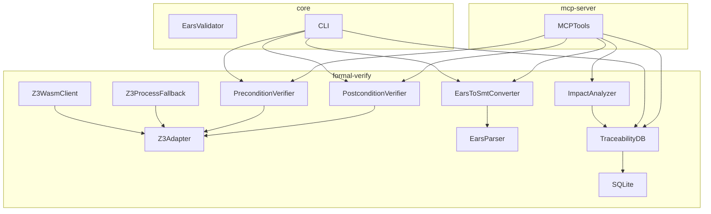

# トレーサビリティマトリクス: MUSUBIX v1.7.5

| メタデータ | 値 |
|------------|-----|
| ドキュメントID | TRACE-MUSUBIX-175 |
| バージョン | 1.0.0 |
| 作成日 | 2026-01-06 |
| ステータス | Draft |
| 関連要件定義書 | REQ-MUSUBIX-175 |
| 関連設計書 | DES-MUSUBIX-175 |

---

## 1. 要件 → 設計 トレーサビリティ

### 1.1 P0要件（v1.7.5スコープ）

| 要件ID | 要件名 | 設計コンポーネント | 設計セクション |
|--------|--------|-------------------|---------------|
| REQ-FV-001 | Z3ソルバー統合 | Z3WasmClient, Z3ProcessFallback | DES 3.1 |
| REQ-FV-002 | 事前条件検証 | PreconditionVerifier | DES 3.2 |
| REQ-FV-003 | 事後条件検証 | PostconditionVerifier | DES 3.2 |
| REQ-E2F-001 | EARS→SMT変換 | EarsToSmtConverter | DES 3.3 |
| REQ-TDB-001 | トレーサビリティDB | TraceabilityDB | DES 4.1 |
| REQ-TDB-002 | 影響分析 | ImpactAnalyzer | DES 4.2 |
| REQ-MCP-001 | 形式検証MCPツール | verify_precondition, verify_postcondition | DES 5.1 |
| REQ-MCP-002 | EARS変換MCPツール | ears_to_smt | DES 5.2 |
| REQ-MCP-003 | トレーサビリティMCPツール | trace_add_link, trace_query, trace_impact | DES 5.3 |

### 1.2 P1要件（v1.8.0スコープ）

| 要件ID | 要件名 | 設計コンポーネント | 設計セクション |
|--------|--------|-------------------|---------------|
| REQ-FV-004 | 不変条件検証 | InvariantVerifier | DES 3.2（将来） |
| REQ-FV-005 | 契約によるプログラミング | ContractValidator | DES 3.2（将来） |
| REQ-E2F-002 | 自然言語→SMT変換 | NaturalLanguageConverter | DES 3.3（将来） |
| REQ-E2F-003 | 複合条件対応 | ComplexConditionHandler | DES 3.3（将来） |
| REQ-TDB-003 | 変更追跡 | ChangeTracker | DES 4.3（将来） |
| REQ-TDB-004 | バージョン管理 | VersionManager | DES 4.4（将来） |
| REQ-MCP-004 | verify_invariant | - | DES 5.1（将来） |

### 1.3 P2要件（v1.8.5スコープ）

| 要件ID | 要件名 | 設計コンポーネント | 設計セクション |
|--------|--------|-------------------|---------------|
| REQ-FV-006 | 形式検証レポート | VerificationReporter | DES（将来） |
| REQ-E2F-004 | ドメインオントロジー連携 | OntologyBridge | DES（将来） |
| REQ-MCP-005 | ears_to_nl | - | DES 5.2（将来） |

---

## 2. 設計 → コード トレーサビリティ

### 2.1 formal-verifyパッケージ

| 設計コンポーネント | ソースファイル | エクスポート |
|-------------------|---------------|-------------|
| Z3WasmClient | `src/z3/Z3WasmClient.ts` | `Z3WasmClient` |
| Z3ProcessFallback | `src/z3/Z3ProcessFallback.ts` | `Z3ProcessFallback` |
| Z3Adapter | `src/z3/Z3Adapter.ts` | `Z3Adapter` |
| PreconditionVerifier | `src/verifiers/PreconditionVerifier.ts` | `PreconditionVerifier` |
| PostconditionVerifier | `src/verifiers/PostconditionVerifier.ts` | `PostconditionVerifier` |
| EarsToSmtConverter | `src/converters/EarsToSmtConverter.ts` | `EarsToSmtConverter` |
| TraceabilityDB | `src/traceability/TraceabilityDB.ts` | `TraceabilityDB` |
| ImpactAnalyzer | `src/traceability/ImpactAnalyzer.ts` | `ImpactAnalyzer` |

### 2.2 mcp-serverパッケージ（拡張）

| MCPツール | ソースファイル | ハンドラ |
|----------|---------------|---------|
| verify_precondition | `src/tools/formal-verify/verifyPrecondition.ts` | `handleVerifyPrecondition` |
| verify_postcondition | `src/tools/formal-verify/verifyPostcondition.ts` | `handleVerifyPostcondition` |
| ears_to_smt | `src/tools/ears/earsToSmt.ts` | `handleEarsToSmt` |
| trace_add_link | `src/tools/traceability/traceAddLink.ts` | `handleTraceAddLink` |
| trace_query | `src/tools/traceability/traceQuery.ts` | `handleTraceQuery` |
| trace_impact | `src/tools/traceability/traceImpact.ts` | `handleTraceImpact` |

### 2.3 coreパッケージ（拡張）

| CLIコマンド | ソースファイル | 関数 |
|------------|---------------|------|
| `musubix verify precondition` | `src/cli/commands/verify.ts` | `verifyPreconditionCommand` |
| `musubix verify postcondition` | `src/cli/commands/verify.ts` | `verifyPostconditionCommand` |
| `musubix ears to-smt` | `src/cli/commands/ears.ts` | `earsToSmtCommand` |
| `musubix trace add` | `src/cli/commands/trace.ts` | `traceAddCommand` |
| `musubix trace query` | `src/cli/commands/trace.ts` | `traceQueryCommand` |
| `musubix trace impact` | `src/cli/commands/trace.ts` | `traceImpactCommand` |

---

## 3. コード → テスト トレーサビリティ

### 3.1 ユニットテスト

| ソースファイル | テストファイル | テスト数 |
|---------------|---------------|---------|
| `Z3WasmClient.ts` | `__tests__/z3/Z3WasmClient.test.ts` | 15 |
| `Z3ProcessFallback.ts` | `__tests__/z3/Z3ProcessFallback.test.ts` | 8 |
| `PreconditionVerifier.ts` | `__tests__/verifiers/PreconditionVerifier.test.ts` | 12 |
| `PostconditionVerifier.ts` | `__tests__/verifiers/PostconditionVerifier.test.ts` | 12 |
| `EarsToSmtConverter.ts` | `__tests__/converters/EarsToSmtConverter.test.ts` | 25 |
| `TraceabilityDB.ts` | `__tests__/traceability/TraceabilityDB.test.ts` | 15 |
| `ImpactAnalyzer.ts` | `__tests__/traceability/ImpactAnalyzer.test.ts` | 10 |

### 3.2 MCPツールテスト

| MCPツール | テストファイル | テスト数 |
|----------|---------------|---------|
| verify_precondition | `__tests__/tools/verifyPrecondition.test.ts` | 3 |
| verify_postcondition | `__tests__/tools/verifyPostcondition.test.ts` | 3 |
| ears_to_smt | `__tests__/tools/earsToSmt.test.ts` | 3 |
| trace_add_link | `__tests__/tools/traceAddLink.test.ts` | 3 |
| trace_query | `__tests__/tools/traceQuery.test.ts` | 3 |
| trace_impact | `__tests__/tools/traceImpact.test.ts` | 3 |

### 3.3 統合テスト

| テストシナリオ | テストファイル | テスト数 |
|---------------|---------------|---------|
| Z3 Wasm→Fallback切り替え | `__tests__/integration/z3-fallback.test.ts` | 5 |
| EARS→SMT→検証フロー | `__tests__/integration/ears-verify-flow.test.ts` | 5 |
| トレーサビリティ影響分析 | `__tests__/integration/traceability-impact.test.ts` | 5 |

### 3.4 テストサマリ

| カテゴリ | テスト数 |
|----------|---------|
| ユニットテスト | 97 |
| MCPツールテスト | 18 |
| 統合テスト | 15 |
| **合計** | **130** |

> 📊 要件書目標: 90+ → 設計書目標: 115+ → 実装目標: 130

---

## 4. 要件 → テスト トレーサビリティ

### 4.1 P0要件のテストカバレッジ

| 要件ID | テストファイル | カバーするテストケース |
|--------|---------------|---------------------|
| REQ-FV-001 | `Z3WasmClient.test.ts`, `Z3ProcessFallback.test.ts` | Z3初期化、SAT/UNSAT判定、フォールバック切り替え |
| REQ-FV-002 | `PreconditionVerifier.test.ts` | 事前条件解析、SMT生成、検証実行 |
| REQ-FV-003 | `PostconditionVerifier.test.ts` | 事後条件解析、SMT生成、検証実行 |
| REQ-E2F-001 | `EarsToSmtConverter.test.ts` | 5パターン変換、複合条件、エラーハンドリング |
| REQ-TDB-001 | `TraceabilityDB.test.ts` | CRUD操作、グラフ構築、整合性検証 |
| REQ-TDB-002 | `ImpactAnalyzer.test.ts` | 影響範囲計算、波及分析、レポート生成 |
| REQ-MCP-001 | `verifyPrecondition.test.ts`, `verifyPostcondition.test.ts` | MCPツール呼び出し、レスポンス形式 |
| REQ-MCP-002 | `earsToSmt.test.ts` | MCPツール呼び出し、変換結果 |
| REQ-MCP-003 | `traceAddLink.test.ts`, `traceQuery.test.ts`, `traceImpact.test.ts` | MCPツール呼び出し、DB操作 |

### 4.2 テストカバレッジ目標

| メトリクス | 目標値 |
|-----------|--------|
| ライン カバレッジ | ≥ 80% |
| ブランチ カバレッジ | ≥ 70% |
| 関数 カバレッジ | ≥ 90% |

---

## 5. 依存関係マトリクス

### 5.1 パッケージ依存関係

```
@nahisaho/musubix-formal-verify (新規)
├── z3-wasm (外部)
├── better-sqlite3 (外部)
├── @nahisaho/musubix-core (内部)
│   └── EarsParser
│   └── EarsValidator
└── @nahisaho/yata-local (内部)
    └── SQLiteベース統合

@nahisaho/musubix-mcp-server (拡張)
├── @nahisaho/musubix-formal-verify (内部)
└── @nahisaho/musubix-core (内部)

@nahisaho/musubix-core (拡張)
├── @nahisaho/musubix-formal-verify (内部)
└── commander (外部)
```

### 5.2 クラス依存関係



---

## 6. 変更履歴

| バージョン | 日付 | 変更内容 | 作成者 |
|-----------|------|----------|--------|
| 1.0.0 | 2026-01-06 | 初版作成 | AI Agent |

---

## 7. 承認

| 役割 | 名前 | 日付 | 署名 |
|------|------|------|------|
| 作成者 | AI Agent | 2026-01-06 | ✓ |
| レビュー | - | - | - |
| 承認者 | - | - | - |
