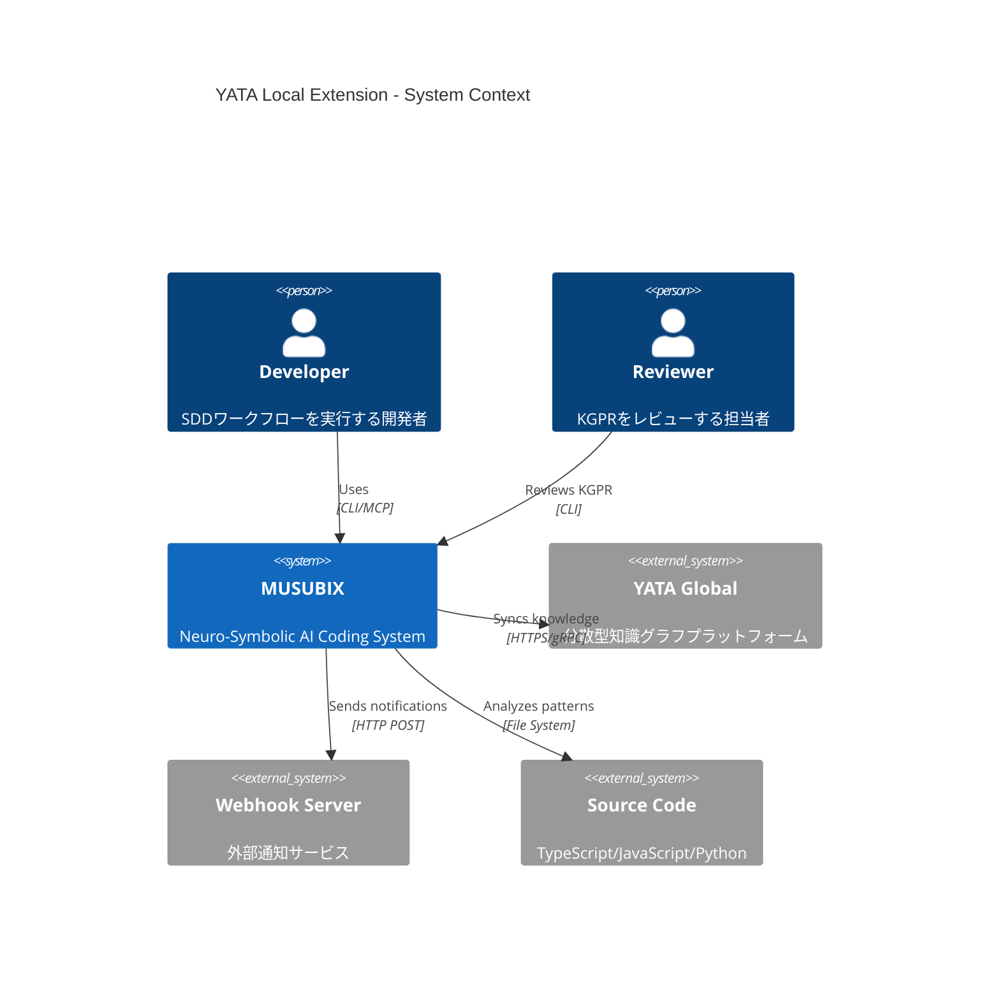
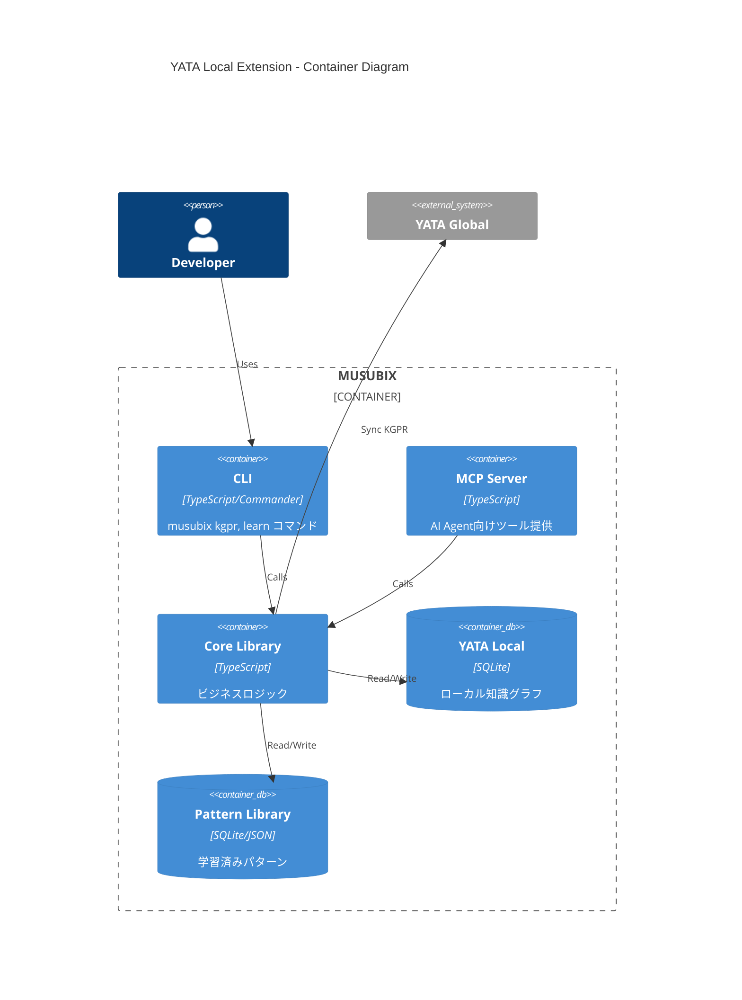
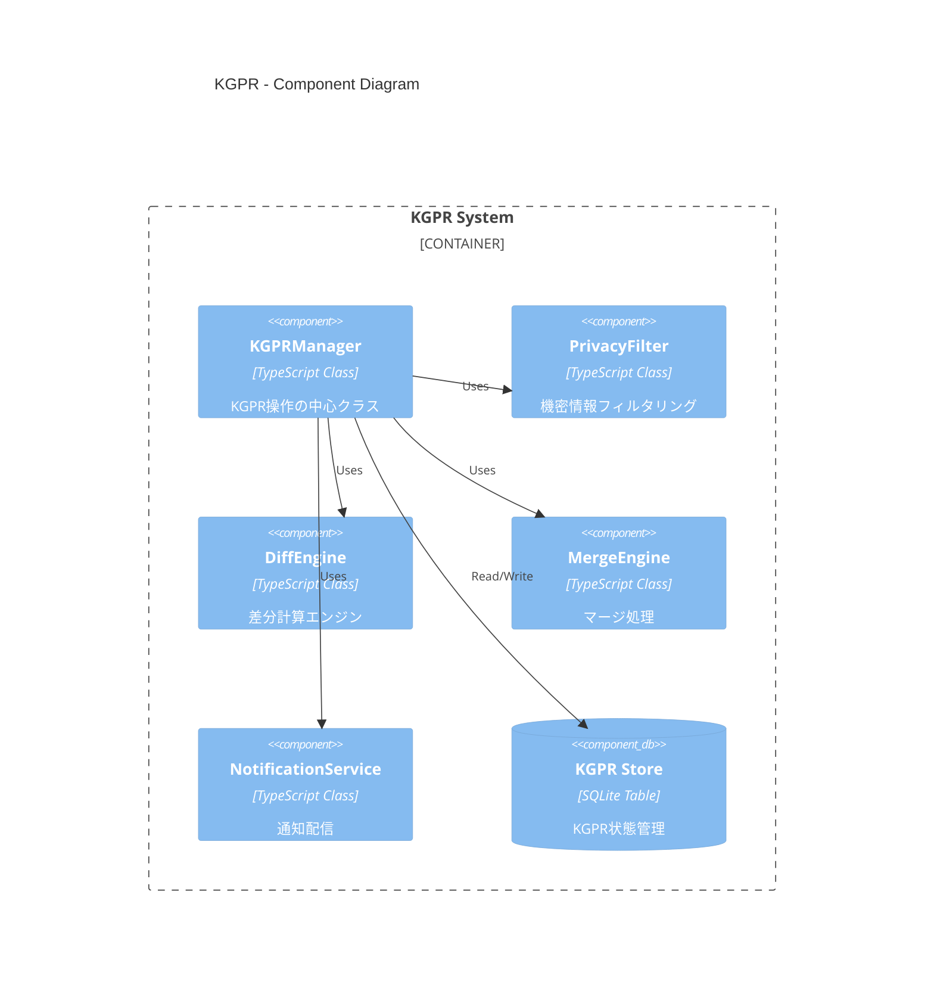
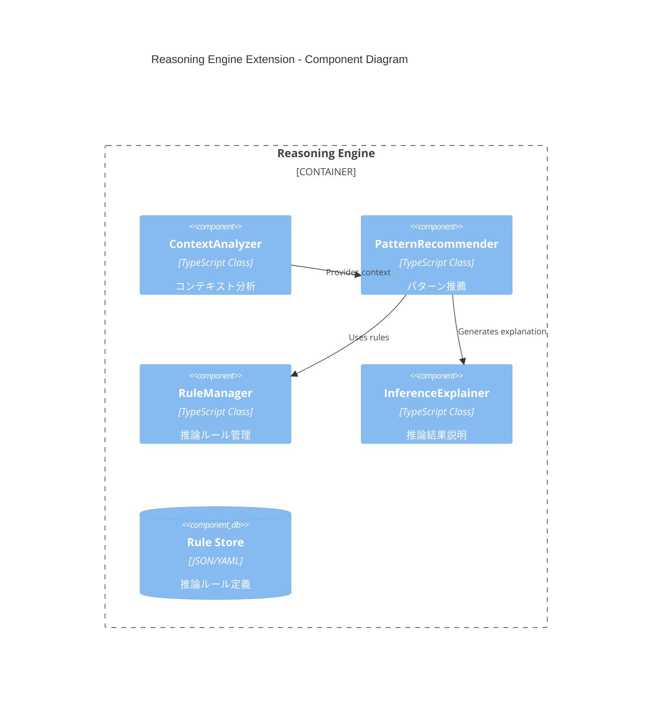
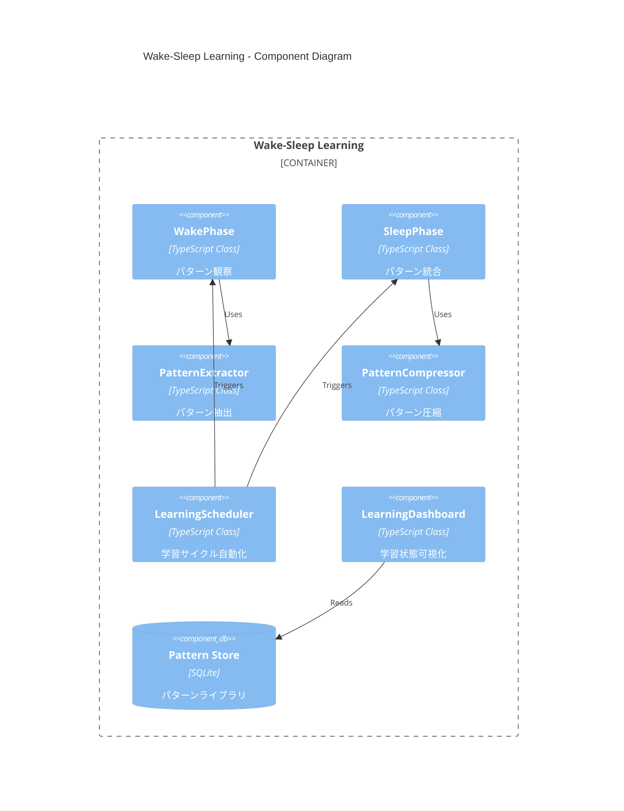
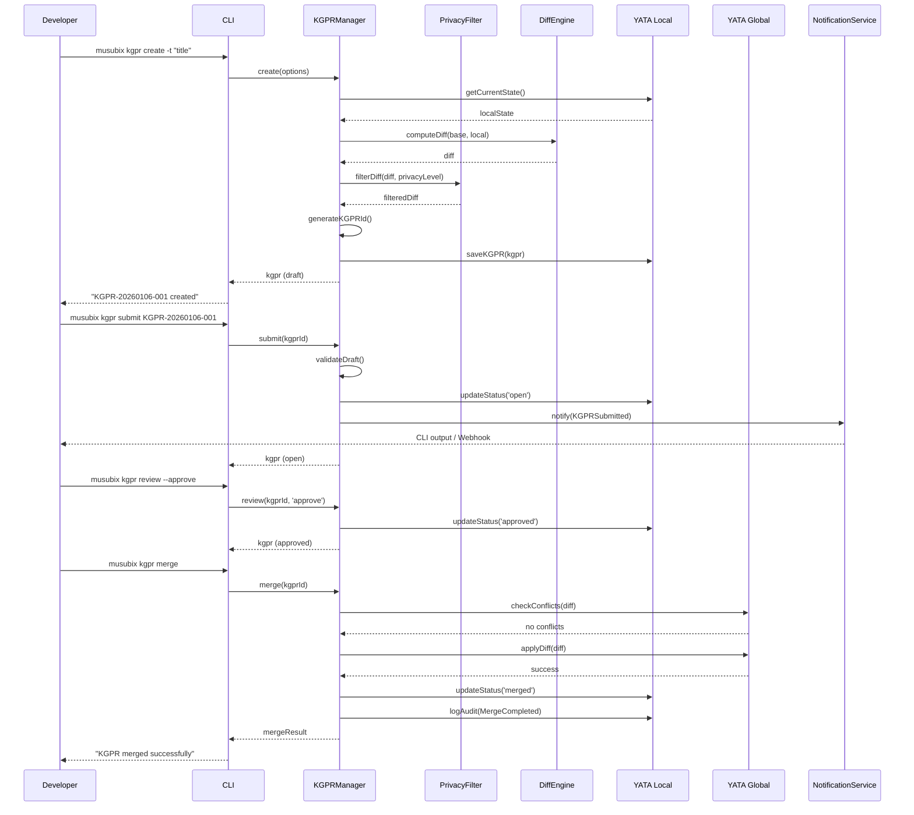
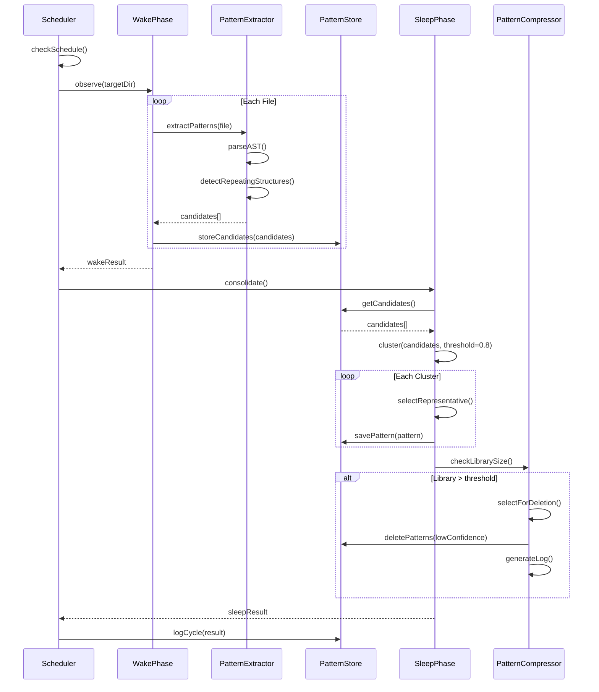

# YATA Local 拡張機能設計書

**Document ID**: DES-YL-EXT-001  
**Version**: 1.0.0  
**Status**: Draft  
**Created**: 2026-01-06  
**Author**: GitHub Copilot (Claude Opus 4.5)

---

## 1. 概要

本文書は、REQ-YL-EXT-001-v1.1（YATA Local拡張機能要件定義書）に基づく詳細設計を記述します。

### 1.1 設計対象

| 機能ID | 名称 | 要件数 |
|--------|------|--------|
| KGPR | Knowledge Graph Pull Request | 5要件 |
| REC | 推論エンジン拡張 | 4要件 |
| WSL | Wake-Sleep学習 | 5要件 |
| NFR | 非機能要件 | 4要件 |

### 1.2 関連ドキュメント

| ドキュメント | 説明 |
|-------------|------|
| REQ-YL-EXT-001-v1.1.md | 要件定義書（修正版） |
| REV-YL-EXT-001.md | 要件レビュー報告書 |
| BEST-PRACTICES.md | EntityType使用ガイドライン |

---

## 2. C4 Context Diagram

### 2.1 システムコンテキスト



### 2.2 外部インターフェース

| システム | プロトコル | 用途 |
|---------|----------|------|
| YATA Global | HTTPS/gRPC | 知識グラフ同期、KGPRマージ |
| Webhook Server | HTTP POST | KGPR通知 |
| Source Code | File System | パターン観察・抽出 |

---

## 3. C4 Container Diagram

### 3.1 コンテナ構成



### 3.2 パッケージ構成

| パッケージ | 責務 | 新規/既存 |
|-----------|------|----------|
| `@nahisaho/yata-local` | ローカル知識グラフ管理 | 既存（拡張） |
| `@nahisaho/yata-global` | グローバルKG連携、KGPR | 既存（拡張） |
| `@nahisaho/musubix-core` | CLI、ビジネスロジック | 既存（拡張） |
| `@nahisaho/musubix-wake-sleep` | Wake-Sleep学習 | 既存（拡張） |
| `@nahisaho/musubix-pattern-mcp` | パターン抽出・圧縮 | 既存（拡張） |

---

## 4. C4 Component Diagram

### 4.1 KGPR コンポーネント



#### DES-KGPR-001: KGPRManager クラス設計

**Trace**: REQ-KGPR-001, REQ-KGPR-003, REQ-KGPR-004

```typescript
/**
 * KGPRManager - Knowledge Graph Pull Request管理
 * @see REQ-KGPR-001 - KGPR作成
 * @see REQ-KGPR-003 - レビューワークフロー
 * @see REQ-KGPR-004 - マージ
 */
export class KGPRManager {
  constructor(
    private readonly localDb: YataLocal,
    private readonly globalClient: YataGlobalClient,
    private readonly notificationService: NotificationService,
  ) {}

  /**
   * KGPRを作成する
   * @see REQ-KGPR-001
   */
  async create(options: KGPRCreateOptions): Promise<KGPR>;

  /**
   * KGPRを送信する（draft → open）
   * @see REQ-KGPR-003
   */
  async submit(kgprId: string): Promise<KGPR>;

  /**
   * KGPRをレビューする
   * @see REQ-KGPR-003
   */
  async review(kgprId: string, action: ReviewAction, comment?: string): Promise<KGPR>;

  /**
   * KGPRをマージする
   * @see REQ-KGPR-004
   */
  async merge(kgprId: string): Promise<MergeResult>;

  /**
   * KGPRをクローズする
   */
  async close(kgprId: string, reason?: string): Promise<KGPR>;
}

interface KGPRCreateOptions {
  title: string;
  description?: string;
  namespace?: string;
  entityTypes?: EntityType[];
  privacyLevel: 'strict' | 'moderate' | 'none';
}

type ReviewAction = 'approve' | 'changes_requested' | 'commented';
```

#### DES-KGPR-002: PrivacyFilter クラス設計

**Trace**: REQ-KGPR-002

```typescript
/**
 * PrivacyFilter - 機密情報フィルタリング
 * @see REQ-KGPR-002
 */
export class PrivacyFilter {
  constructor(private readonly level: PrivacyLevel) {}

  /**
   * エンティティをフィルタリング
   */
  filterEntity(entity: Entity): Entity;

  /**
   * メタデータをフィルタリング
   */
  filterMetadata(metadata: Record<string, unknown>): Record<string, unknown>;

  /**
   * 値が機密情報かどうか判定
   */
  isSensitive(key: string, value: unknown): boolean;
}

type PrivacyLevel = 'strict' | 'moderate' | 'none';

const PRIVACY_RULES: Record<PrivacyLevel, FilterRule[]> = {
  strict: [
    { pattern: /filePath|file_path/i, action: 'redact' },
    { pattern: /url|uri|endpoint/i, action: 'redact' },
    { pattern: /password|secret|token|key|credential/i, action: 'redact' },
    { pattern: /.*/, scope: 'metadata', action: 'redact' }, // 全メタデータ
  ],
  moderate: [
    { pattern: /filePath|file_path/i, action: 'redact' },
    { pattern: /url|uri|endpoint/i, action: 'redact' },
    { pattern: /password|secret|token|key|credential/i, action: 'redact' },
  ],
  none: [],
};
```

#### DES-KGPR-003: NotificationService 設計

**Trace**: REQ-KGPR-003

```typescript
/**
 * NotificationService - 通知配信
 * @see REQ-KGPR-003
 */
export class NotificationService {
  private readonly channels: NotificationChannel[] = [];

  constructor(options: NotificationOptions) {
    // CLI出力は常に有効
    this.channels.push(new CLINotificationChannel());
    
    // Webhookが設定されている場合
    if (options.webhookUrl) {
      this.channels.push(new WebhookNotificationChannel(options.webhookUrl));
    }
    
    // ファイル出力が設定されている場合
    if (options.notifyFile) {
      this.channels.push(new FileNotificationChannel(options.notifyFile));
    }
  }

  async notify(event: KGPREvent): Promise<void> {
    await Promise.all(this.channels.map(ch => ch.send(event)));
  }
}

interface NotificationChannel {
  send(event: KGPREvent): Promise<void>;
}
```

#### DES-KGPR-005: DiffEngine 設計

**Trace**: REQ-KGPR-005

```typescript
/**
 * DiffEngine - 差分計算
 * @see REQ-KGPR-005
 */
export class DiffEngine {
  /**
   * 2つの知識グラフ状態の差分を計算
   */
  computeDiff(oldState: KGState, newState: KGState): KGDiff;

  /**
   * 差分をMermaid形式で出力
   */
  toMermaid(diff: KGDiff): string;

  /**
   * 差分をJSON形式で出力
   */
  toJson(diff: KGDiff): string;
}

interface KGDiff {
  added: { entities: Entity[]; relationships: Relationship[] };
  updated: { entities: Entity[]; relationships: Relationship[] };
  deleted: { entityIds: string[]; relationshipIds: string[] };
  summary: {
    addedCount: number;
    updatedCount: number;
    deletedCount: number;
  };
}
```

---

### 4.2 推論エンジン拡張コンポーネント



#### DES-REC-001: ContextAnalyzer 設計

**Trace**: REQ-REC-001

```typescript
/**
 * ContextAnalyzer - コンテキスト分析
 * @see REQ-REC-001
 */
export class ContextAnalyzer {
  constructor(private readonly yataLocal: YataLocal) {}

  /**
   * 新規エンティティに関連する既存エンティティを特定
   */
  async findRelatedEntities(newEntity: EntityInput): Promise<RelatedEntity[]>;

  /**
   * 関連度スコアを計算
   * @see REQ-REC-001 - Relevance Score Calculation
   */
  calculateRelevanceScore(entity: Entity, target: Entity): number;
}

interface RelatedEntity {
  entity: Entity;
  relevanceScore: number;
  matchReasons: MatchReason[];
}

interface MatchReason {
  type: 'namespace' | 'name_similarity' | 'kind' | 'relationship';
  weight: number;
  detail: string;
}

/**
 * 関連度スコア計算
 * score = w1 * namespace_match + w2 * name_similarity + w3 * kind_match + w4 * relationship_count
 */
const RELEVANCE_WEIGHTS = {
  namespace: 0.3,
  nameSimilarity: 0.3,
  kind: 0.2,
  relationship: 0.2,
};

function calculateLevenshteinSimilarity(a: string, b: string): number {
  const distance = levenshtein(a, b);
  const maxLength = Math.max(a.length, b.length);
  return 1 - distance / maxLength;
}
```

#### DES-REC-002: PatternRecommender 設計

**Trace**: REQ-REC-002

```typescript
/**
 * PatternRecommender - パターン推薦
 * @see REQ-REC-002
 */
export class PatternRecommender {
  constructor(
    private readonly patternLibrary: PatternLibrary,
    private readonly contextAnalyzer: ContextAnalyzer,
  ) {}

  /**
   * コンテキストに基づいてパターンを推薦
   */
  async recommend(context: RecommendationContext): Promise<PatternRecommendation[]>;

  /**
   * ユーザーフィードバックを記録
   */
  async recordFeedback(
    recommendationId: string,
    feedback: 'accept' | 'reject',
    reason?: string,
  ): Promise<void>;
}

interface PatternRecommendation {
  id: string;
  pattern: LearnedPattern;
  confidence: number;
  reason: string;
  similarContexts: string[];
}

const MAX_RECOMMENDATIONS = 5;
```

#### DES-REC-003: RuleManager 設計

**Trace**: REQ-REC-003

```typescript
/**
 * RuleManager - 推論ルール管理
 * @see REQ-REC-003
 */
export class RuleManager {
  private rules: Map<string, InferenceRule> = new Map();

  /**
   * ルールを追加
   */
  addRule(rule: InferenceRule): void;

  /**
   * ルールを削除
   */
  removeRule(ruleId: string): boolean;

  /**
   * ルール一覧を取得
   */
  listRules(filter?: { enabled?: boolean; priority?: number }): InferenceRule[];

  /**
   * ルールの有効/無効を切り替え
   */
  toggleRule(ruleId: string, enabled: boolean): void;

  /**
   * デフォルトルールセットをロード
   */
  loadDefaultRules(): void;

  /**
   * ルールをJSON/YAMLファイルからインポート
   */
  importRules(filePath: string): Promise<void>;

  /**
   * ルールをエクスポート
   */
  exportRules(filePath: string, format: 'json' | 'yaml'): Promise<void>;
}

interface InferenceRule {
  id: string;
  name: string;
  description?: string;
  priority: number;
  enabled: boolean;
  condition: RuleCondition;
  action: RuleAction;
}
```

#### DES-REC-004: InferenceExplainer 設計

**Trace**: REQ-REC-004

```typescript
/**
 * InferenceExplainer - 推論結果説明
 * @see REQ-REC-004
 */
export class InferenceExplainer {
  /**
   * 推論チェーンを生成
   */
  generateExplanation(result: InferenceResult): InferenceExplanation;

  /**
   * Mermaid形式で推論グラフを出力
   */
  toMermaid(explanation: InferenceExplanation): string;

  /**
   * 信頼度の計算根拠を説明
   */
  explainConfidence(result: InferenceResult): ConfidenceExplanation;
}

interface InferenceExplanation {
  chain: InferenceStep[];
  totalConfidence: number;
  appliedRules: string[];
}

interface InferenceStep {
  ruleId: string;
  ruleName: string;
  input: unknown;
  output: unknown;
  confidence: number;
}
```

---

### 4.3 Wake-Sleep学習コンポーネント



#### DES-WSL-001: WakePhase 設計

**Trace**: REQ-WSL-001

```typescript
/**
 * WakePhase - パターン観察フェーズ
 * @see REQ-WSL-001
 */
export class WakePhase {
  constructor(
    private readonly patternExtractor: PatternExtractor,
    private readonly patternStore: PatternStore,
  ) {}

  /**
   * ファイルを観察してパターンを抽出
   */
  async observe(filePath: string): Promise<PatternCandidate[]>;

  /**
   * ディレクトリ全体を観察
   */
  async observeDirectory(dirPath: string, options?: ObserveOptions): Promise<PatternCandidate[]>;

  /**
   * 抽出したパターン候補を一時保存
   */
  async storeCandidate(candidate: PatternCandidate): Promise<void>;
}

interface PatternCandidate {
  id: string;
  type: 'function_signature' | 'class_structure' | 'import_pattern' | 'code_block';
  content: string;
  ast: ASTNode;
  filePath: string;
  occurrences: number;
  extractedAt: Date;
}

interface ObserveOptions {
  extensions?: string[]; // デフォルト: ['.ts', '.js', '.py']
  exclude?: string[];
  maxFiles?: number;
}
```

#### DES-WSL-002: SleepPhase 設計

**Trace**: REQ-WSL-002

```typescript
/**
 * SleepPhase - パターン統合フェーズ
 * @see REQ-WSL-002
 */
export class SleepPhase {
  constructor(
    private readonly patternCompressor: PatternCompressor,
    private readonly patternStore: PatternStore,
  ) {}

  /**
   * パターン候補をクラスタリング
   */
  async cluster(candidates: PatternCandidate[]): Promise<PatternCluster[]>;

  /**
   * クラスタから代表パターンを選出
   */
  selectRepresentative(cluster: PatternCluster): LearnedPattern;

  /**
   * パターン信頼度を更新
   */
  async updateConfidence(patternId: string, factor: number): Promise<void>;

  /**
   * 低頻度パターンを減衰・削除
   */
  async decay(threshold: number): Promise<DecayResult>;
}

interface PatternCluster {
  id: string;
  members: PatternCandidate[];
  centroid: PatternCandidate;
  similarity: number;
}

const DEFAULT_SIMILARITY_THRESHOLD = 0.8;
```

#### DES-WSL-003: PatternCompressor 設計

**Trace**: REQ-WSL-003

```typescript
/**
 * PatternCompressor - パターン圧縮
 * @see REQ-WSL-003
 */
export class PatternCompressor {
  constructor(private readonly config: CompressionConfig) {}

  /**
   * パターンライブラリを圧縮
   */
  async compress(library: PatternLibrary): Promise<CompressionResult>;

  /**
   * 削除候補を選定
   */
  selectForDeletion(patterns: LearnedPattern[]): LearnedPattern[];

  /**
   * lastUsedAtに基づく減衰を適用
   */
  applyDecay(pattern: LearnedPattern): LearnedPattern;

  /**
   * 圧縮ログを生成
   */
  generateLog(result: CompressionResult): CompressionLog;
}

interface CompressionConfig {
  maxPatterns: number;        // デフォルト: 1000
  confidenceThreshold: number; // デフォルト: 0.3
  decayPeriodMonths: number;  // デフォルト: 6
  requireConfirmation: boolean; // デフォルト: true
}

interface CompressionResult {
  deletedCount: number;
  compressedCount: number;
  remainingCount: number;
  deletedPatterns: LearnedPattern[];
}
```

#### DES-WSL-004: LearningScheduler 設計

**Trace**: REQ-WSL-004

```typescript
/**
 * LearningScheduler - 学習サイクル自動化
 * @see REQ-WSL-004
 */
export class LearningScheduler {
  private intervalId: NodeJS.Timeout | null = null;

  constructor(
    private readonly wakePhase: WakePhase,
    private readonly sleepPhase: SleepPhase,
    private readonly config: SchedulerConfig,
  ) {}

  /**
   * 自動学習を開始
   */
  start(): void;

  /**
   * 自動学習を停止
   */
  stop(): void;

  /**
   * 手動でサイクルを実行
   */
  async runCycle(): Promise<CycleResult>;

  /**
   * 次回実行時刻を取得
   */
  getNextRunTime(): Date | null;
}

interface SchedulerConfig {
  enabled: boolean;
  intervalMs: number;        // デフォルト: 3600000 (1時間)
  cronExpression?: string;   // cron形式（intervalMsより優先）
  notifyOnComplete: boolean;
}

interface CycleResult {
  wakeResult: { extractedPatterns: number; observedFiles: number };
  sleepResult: { clusteredPatterns: number; decayedPatterns: number };
  duration: number;
  completedAt: Date;
}
```

#### DES-WSL-005: LearningDashboard 設計

**Trace**: REQ-WSL-005

```typescript
/**
 * LearningDashboard - 学習状態可視化
 * @see REQ-WSL-005
 */
export class LearningDashboard {
  constructor(private readonly patternStore: PatternStore) {}

  /**
   * ダッシュボードデータを取得
   */
  async getData(): Promise<DashboardData>;

  /**
   * JSON形式で出力
   */
  toJson(data: DashboardData): string;

  /**
   * Markdown形式で出力
   */
  toMarkdown(data: DashboardData): string;

  /**
   * CLIテーブル形式で出力
   */
  toCLI(data: DashboardData): string;
}

interface DashboardData {
  totalPatterns: number;
  patternsByCategory: Record<string, number>;
  confidenceDistribution: ConfidenceHistogram;
  recentCycles: CycleResult[];
  lastUpdated: Date;
}

interface ConfidenceHistogram {
  buckets: Array<{ min: number; max: number; count: number }>;
}
```

---

## 5. データモデル

### 5.1 KGPR データモデル

```typescript
/**
 * KGPR エンティティ
 */
interface KGPR {
  id: string;                  // KGPR-YYYYMMDD-NNN
  title: string;
  description?: string;
  status: KGPRStatus;
  author: string;
  
  // 差分データ
  diff: KGDiff;
  
  // プライバシー設定
  privacyLevel: PrivacyLevel;
  
  // タイムスタンプ
  createdAt: Date;
  submittedAt?: Date;
  reviewedAt?: Date;
  mergedAt?: Date;
  closedAt?: Date;
  
  // レビュー
  reviews: KGPRReview[];
  
  // 監査ログ
  auditLog: AuditEntry[];
}

type KGPRStatus = 
  | 'draft' 
  | 'open' 
  | 'reviewing' 
  | 'approved' 
  | 'changes_requested' 
  | 'merged' 
  | 'closed';

interface KGPRReview {
  id: string;
  reviewer: string;
  action: ReviewAction;
  comment?: string;
  createdAt: Date;
}
```

### 5.2 Pattern データモデル

```typescript
/**
 * 学習済みパターン
 */
interface LearnedPattern {
  id: string;
  name: string;
  category: PatternCategory;
  content: string;
  ast?: ASTNode;
  
  // 統計
  confidence: number;
  occurrences: number;
  
  // 使用追跡
  lastUsedAt: Date;
  usageCount: number;
  
  // メタデータ
  createdAt: Date;
  updatedAt: Date;
  source: string;
}

type PatternCategory = 
  | 'code' 
  | 'design' 
  | 'requirement' 
  | 'test' 
  | 'architecture';
```

### 5.3 SQLiteスキーマ拡張

```sql
-- KGPR テーブル
CREATE TABLE IF NOT EXISTS kgprs (
  id TEXT PRIMARY KEY,
  title TEXT NOT NULL,
  description TEXT,
  status TEXT NOT NULL DEFAULT 'draft',
  author TEXT NOT NULL,
  diff_json TEXT NOT NULL,
  privacy_level TEXT NOT NULL DEFAULT 'strict',
  created_at TEXT NOT NULL,
  submitted_at TEXT,
  reviewed_at TEXT,
  merged_at TEXT,
  closed_at TEXT
);

-- KGPR レビューテーブル
CREATE TABLE IF NOT EXISTS kgpr_reviews (
  id TEXT PRIMARY KEY,
  kgpr_id TEXT NOT NULL REFERENCES kgprs(id),
  reviewer TEXT NOT NULL,
  action TEXT NOT NULL,
  comment TEXT,
  created_at TEXT NOT NULL
);

-- パターン lastUsedAt カラム追加
ALTER TABLE patterns ADD COLUMN last_used_at TEXT;
ALTER TABLE patterns ADD COLUMN usage_count INTEGER DEFAULT 0;

-- 学習サイクル履歴テーブル
CREATE TABLE IF NOT EXISTS learning_cycles (
  id TEXT PRIMARY KEY,
  wake_extracted INTEGER NOT NULL,
  wake_observed_files INTEGER NOT NULL,
  sleep_clustered INTEGER NOT NULL,
  sleep_decayed INTEGER NOT NULL,
  duration_ms INTEGER NOT NULL,
  completed_at TEXT NOT NULL
);
```

---

## 6. シーケンス図

### 6.1 KGPR作成〜マージフロー



### 6.2 Wake-Sleep学習サイクル



---

## 7. エラーハンドリング

### 7.1 エラー分類

| エラーコード | カテゴリ | 説明 |
|-------------|---------|------|
| `KGPR_001` | KGPR | KGPR ID not found |
| `KGPR_002` | KGPR | Invalid status transition |
| `KGPR_003` | KGPR | Merge conflict detected |
| `KGPR_004` | KGPR | Privacy filter error |
| `REC_001` | Reasoning | Rule not found |
| `REC_002` | Reasoning | Invalid rule format |
| `WSL_001` | Wake-Sleep | Parse error |
| `WSL_002` | Wake-Sleep | Pattern store full |
| `WSL_003` | Wake-Sleep | Compression failed |

### 7.2 エラーハンドリング戦略

```typescript
/**
 * Result型によるエラーハンドリング
 */
type Result<T, E extends Error = Error> = 
  | { ok: true; value: T }
  | { ok: false; error: E };

class KGPRError extends Error {
  constructor(
    public readonly code: string,
    message: string,
    public readonly details?: unknown,
  ) {
    super(message);
    this.name = 'KGPRError';
  }
}

// 使用例
async function mergeKGPR(id: string): Promise<Result<MergeResult, KGPRError>> {
  const conflicts = await checkConflicts(id);
  if (conflicts.length > 0) {
    return {
      ok: false,
      error: new KGPRError('KGPR_003', 'Merge conflict detected', { conflicts }),
    };
  }
  // ...
}
```

---

## 8. 非機能要件対応

### 8.1 パフォーマンス（REQ-NFR-001）

| 対策 | 実装 |
|------|------|
| インデックス | `namespace`, `entityKind`, `lastUsedAt`にインデックス追加 |
| キャッシュ | 頻繁にアクセスされるパターンをメモリキャッシュ |
| バッチ処理 | 大量パターン操作はバッチで実行 |

```sql
-- パフォーマンス用インデックス
CREATE INDEX IF NOT EXISTS idx_entities_namespace ON entities(namespace);
CREATE INDEX IF NOT EXISTS idx_entities_kind ON entities(metadata->>'entityKind');
CREATE INDEX IF NOT EXISTS idx_patterns_last_used ON patterns(last_used_at);
CREATE INDEX IF NOT EXISTS idx_patterns_confidence ON patterns(confidence);
```

### 8.2 データ整合性（REQ-NFR-002）

```typescript
/**
 * トランザクション管理
 */
async function withTransaction<T>(
  db: Database,
  fn: () => Promise<T>,
): Promise<T> {
  db.exec('BEGIN TRANSACTION');
  try {
    const result = await fn();
    db.exec('COMMIT');
    return result;
  } catch (error) {
    db.exec('ROLLBACK');
    throw error;
  }
}
```

### 8.3 後方互換性（REQ-NFR-004）

```typescript
/**
 * マイグレーション管理
 */
const MIGRATIONS: Migration[] = [
  {
    version: '0.1.0',
    up: (db) => { /* 初期スキーマ */ },
    down: (db) => { /* ロールバック */ },
  },
  {
    version: '0.2.0',
    up: (db) => {
      // lastUsedAt カラム追加
      db.exec('ALTER TABLE patterns ADD COLUMN last_used_at TEXT');
    },
    down: (db) => { /* ロールバック */ },
  },
];

async function migrate(db: Database, targetVersion: string): Promise<void>;
```

---

## 9. 要件トレーサビリティマトリクス

| 要件ID | 設計ID | コンポーネント | テストID |
|--------|--------|---------------|---------|
| REQ-KGPR-001 | DES-KGPR-001 | KGPRManager | TST-KGPR-001, TST-KGPR-002 |
| REQ-KGPR-002 | DES-KGPR-002 | PrivacyFilter | TST-KGPR-003〜005 |
| REQ-KGPR-003 | DES-KGPR-001, DES-KGPR-003 | KGPRManager, NotificationService | TST-KGPR-006〜008 |
| REQ-KGPR-004 | DES-KGPR-001 | KGPRManager, MergeEngine | TST-KGPR-009〜011 |
| REQ-KGPR-005 | DES-KGPR-005 | DiffEngine | TST-KGPR-012, TST-KGPR-013 |
| REQ-REC-001 | DES-REC-001 | ContextAnalyzer | TST-REC-001〜003 |
| REQ-REC-002 | DES-REC-002 | PatternRecommender | TST-REC-004, TST-REC-005 |
| REQ-REC-003 | DES-REC-003 | RuleManager | TST-REC-006, TST-REC-007 |
| REQ-REC-004 | DES-REC-004 | InferenceExplainer | TST-REC-008, TST-REC-009 |
| REQ-WSL-001 | DES-WSL-001 | WakePhase, PatternExtractor | TST-WSL-001〜003 |
| REQ-WSL-002 | DES-WSL-002 | SleepPhase | TST-WSL-004, TST-WSL-005 |
| REQ-WSL-003 | DES-WSL-003 | PatternCompressor | TST-WSL-006〜008 |
| REQ-WSL-004 | DES-WSL-004 | LearningScheduler | TST-WSL-009, TST-WSL-010 |
| REQ-WSL-005 | DES-WSL-005 | LearningDashboard | TST-WSL-011, TST-WSL-012 |
| REQ-NFR-001 | 8.1 | インデックス, キャッシュ | TST-NFR-001, TST-NFR-002 |
| REQ-NFR-002 | 8.2 | トランザクション管理 | TST-NFR-003, TST-NFR-004 |
| REQ-NFR-003 | DES-KGPR-002 | PrivacyFilter | TST-NFR-005, TST-NFR-006 |
| REQ-NFR-004 | 8.3 | Migration | TST-NFR-007, TST-NFR-008 |

---

## 10. 次のステップ

1. [ ] 本設計書のレビュー実施
2. [ ] タスク分解（TSK-YL-EXT-001）の作成
3. [ ] 実装フェーズへの移行

---

**Document End**
