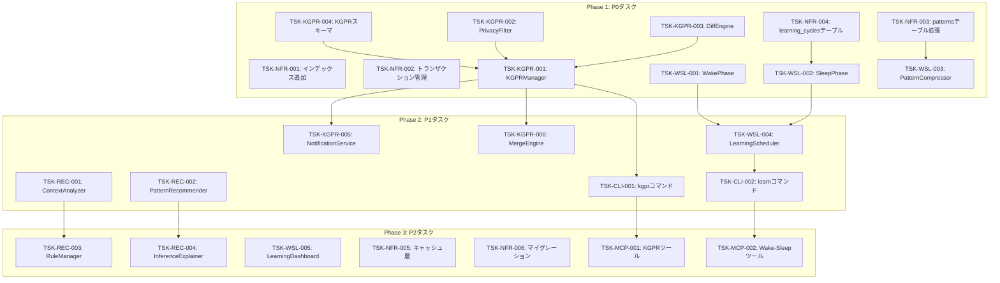

# YATA Local 拡張機能タスク分解

**Document ID**: TSK-YL-EXT-001  
**Version**: 1.0.0  
**Status**: Draft  
**Created**: 2026-01-06  
**Author**: GitHub Copilot (Claude Opus 4.5)

---

## 1. 概要

本文書は、DES-YL-EXT-001（設計書）に基づくタスク分解を記述します。

### 1.1 関連ドキュメント

| ドキュメント | ID | 説明 |
|-------------|-----|------|
| 要件定義書 | REQ-YL-EXT-001-v1.1 | 18要件、42テストケース |
| 設計書 | DES-YL-EXT-001 | 14コンポーネント設計 |
| レビュー報告書 | REV-DES-YL-EXT-001 | 設計承認 |

### 1.2 タスクサマリー

| 優先度 | タスク数 | 見積工数 |
|--------|---------|----------|
| P0（必須） | 12 | 24h |
| P1（重要） | 10 | 16h |
| P2（任意） | 8 | 12h |
| **合計** | **30** | **52h** |

---

## 2. 実装フェーズ

```
Phase 1: P0タスク（KGPR基盤、WSL基盤、NFR基盤）
    ↓
Phase 2: P1タスク（REC拡張、KGPR拡張、WSL拡張）
    ↓
Phase 3: P2タスク（高度な推論、ダッシュボード、最適化）
    ↓
Phase 4: 統合テスト・リリース
```

---

## 3. P0タスク（必須）

### 3.1 KGPR基盤

#### TSK-KGPR-001: KGPRManagerクラス実装

| 項目 | 内容 |
|------|------|
| **Trace** | REQ-KGPR-001, DES-KGPR-001 |
| **優先度** | P0 |
| **見積** | 3h |
| **担当パッケージ** | `@nahisaho/yata-global` |

**タスク内容**:
- [ ] `KGPRManager`クラスの作成
- [ ] `create()`, `submit()`, `review()`, `merge()`, `close()`メソッド実装
- [ ] KGPR IDジェネレーター（KGPR-YYYYMMDD-NNN形式）
- [ ] ステータス遷移バリデーション

**テストID**: TST-KGPR-001, TST-KGPR-002

**受入基準**:
```typescript
// KGPRを作成できること
const kgpr = await manager.create({ title: 'Add patterns', privacyLevel: 'strict' });
expect(kgpr.status).toBe('draft');
expect(kgpr.id).toMatch(/^KGPR-\d{8}-\d{3}$/);
```

---

#### TSK-KGPR-002: PrivacyFilterクラス実装

| 項目 | 内容 |
|------|------|
| **Trace** | REQ-KGPR-002, DES-KGPR-002 |
| **優先度** | P0 |
| **見積** | 2h |
| **担当パッケージ** | `@nahisaho/yata-global` |

**タスク内容**:
- [ ] `PrivacyFilter`クラスの作成
- [ ] 3レベルのフィルタリング（strict/moderate/none）
- [ ] `PRIVACY_RULES`定数定義
- [ ] エンティティ・メタデータのフィルタリング

**テストID**: TST-KGPR-003, TST-KGPR-004, TST-KGPR-005

**受入基準**:
```typescript
// strictモードでファイルパスが除外されること
const filter = new PrivacyFilter('strict');
const filtered = filter.filterEntity(entity);
expect(filtered.metadata.filePath).toBeUndefined();
```

---

#### TSK-KGPR-003: DiffEngineクラス実装

| 項目 | 内容 |
|------|------|
| **Trace** | REQ-KGPR-005, DES-KGPR-005 |
| **優先度** | P0 |
| **見積** | 2h |
| **担当パッケージ** | `@nahisaho/yata-global` |

**タスク内容**:
- [ ] `DiffEngine`クラスの作成
- [ ] `computeDiff()`メソッド実装
- [ ] `toMermaid()`, `toJson()`出力メソッド
- [ ] added/updated/deleted分類ロジック

**テストID**: TST-KGPR-012, TST-KGPR-013

**受入基準**:
```typescript
// 差分が正しく計算されること
const diff = engine.computeDiff(oldState, newState);
expect(diff.added.entities.length).toBe(5);
expect(diff.summary.addedCount).toBe(5);
```

---

#### TSK-KGPR-004: KGPRデータベーススキーマ実装

| 項目 | 内容 |
|------|------|
| **Trace** | REQ-KGPR-001, DES-YL-EXT-001 Section 5.3 |
| **優先度** | P0 |
| **見積** | 1h |
| **担当パッケージ** | `@nahisaho/yata-global` |

**タスク内容**:
- [ ] `kgprs`テーブル作成
- [ ] `kgpr_reviews`テーブル作成
- [ ] インデックス追加
- [ ] マイグレーションスクリプト

**テストID**: TST-NFR-007

**受入基準**:
```sql
-- テーブルが存在すること
SELECT name FROM sqlite_master WHERE type='table' AND name='kgprs';
```

---

### 3.2 Wake-Sleep基盤

#### TSK-WSL-001: WakePhaseクラス実装

| 項目 | 内容 |
|------|------|
| **Trace** | REQ-WSL-001, DES-WSL-001 |
| **優先度** | P0 |
| **見積** | 3h |
| **担当パッケージ** | `@nahisaho/musubix-wake-sleep` |

**タスク内容**:
- [ ] `WakePhase`クラスの作成
- [ ] `observe()`, `observeDirectory()`メソッド実装
- [ ] TypeScript/JavaScript/PythonのAST解析連携
- [ ] パターン候補の一時保存

**テストID**: TST-WSL-001, TST-WSL-002, TST-WSL-003

**受入基準**:
```typescript
// ファイルからパターン候補を抽出できること
const candidates = await wakePhase.observe('src/sample.ts');
expect(candidates.length).toBeGreaterThan(0);
expect(candidates[0].type).toBe('function_signature');
```

---

#### TSK-WSL-002: SleepPhaseクラス実装

| 項目 | 内容 |
|------|------|
| **Trace** | REQ-WSL-002, DES-WSL-002 |
| **優先度** | P0 |
| **見積** | 3h |
| **担当パッケージ** | `@nahisaho/musubix-wake-sleep` |

**タスク内容**:
- [ ] `SleepPhase`クラスの作成
- [ ] `cluster()`メソッド実装（類似度閾値0.8）
- [ ] `selectRepresentative()`メソッド実装
- [ ] `updateConfidence()`, `decay()`メソッド実装

**テストID**: TST-WSL-004, TST-WSL-005

**受入基準**:
```typescript
// パターン候補がクラスタリングされること
const clusters = await sleepPhase.cluster(candidates);
expect(clusters.every(c => c.similarity >= 0.8)).toBe(true);
```

---

#### TSK-WSL-003: PatternCompressorクラス実装

| 項目 | 内容 |
|------|------|
| **Trace** | REQ-WSL-003, DES-WSL-003 |
| **優先度** | P0 |
| **見積** | 2h |
| **担当パッケージ** | `@nahisaho/musubix-wake-sleep` |

**タスク内容**:
- [ ] `PatternCompressor`クラスの作成
- [ ] `compress()`メソッド実装
- [ ] `selectForDeletion()`（lastUsedAt基準）
- [ ] `generateLog()`メソッド実装

**テストID**: TST-WSL-006, TST-WSL-007, TST-WSL-008

**受入基準**:
```typescript
// 6ヶ月未使用のパターンが削除対象になること
const toDelete = compressor.selectForDeletion(patterns);
toDelete.forEach(p => {
  const monthsAgo = (Date.now() - p.lastUsedAt.getTime()) / (30 * 24 * 60 * 60 * 1000);
  expect(monthsAgo).toBeGreaterThanOrEqual(6);
});
```

---

### 3.3 NFR基盤

#### TSK-NFR-001: パフォーマンスインデックス追加

| 項目 | 内容 |
|------|------|
| **Trace** | REQ-NFR-001, DES-YL-EXT-001 Section 8.1 |
| **優先度** | P0 |
| **見積** | 1h |
| **担当パッケージ** | `@nahisaho/yata-local` |

**タスク内容**:
- [ ] `idx_entities_namespace`インデックス追加
- [ ] `idx_entities_kind`インデックス追加
- [ ] `idx_patterns_last_used`インデックス追加
- [ ] `idx_patterns_confidence`インデックス追加

**テストID**: TST-NFR-001, TST-NFR-002

**受入基準**:
```typescript
// 1000エンティティのクエリが100ms未満で完了すること
const start = Date.now();
await yataLocal.query({ namespace: 'test' });
expect(Date.now() - start).toBeLessThan(100);
```

---

#### TSK-NFR-002: トランザクション管理実装

| 項目 | 内容 |
|------|------|
| **Trace** | REQ-NFR-002, DES-YL-EXT-001 Section 8.2 |
| **優先度** | P0 |
| **見積** | 2h |
| **担当パッケージ** | `@nahisaho/yata-local` |

**タスク内容**:
- [ ] `withTransaction()`ヘルパー関数実装
- [ ] KGPRマージ時のトランザクション適用
- [ ] パターン圧縮時のトランザクション適用
- [ ] ロールバックテスト

**テストID**: TST-NFR-003, TST-NFR-004

**受入基準**:
```typescript
// エラー時にロールバックされること
try {
  await withTransaction(db, async () => {
    await db.insert(entity1);
    throw new Error('test error');
  });
} catch {}
expect(await db.count()).toBe(0); // ロールバック済み
```

---

#### TSK-NFR-003: patternsテーブル拡張

| 項目 | 内容 |
|------|------|
| **Trace** | REQ-WSL-003, DES-YL-EXT-001 Section 5.3 |
| **優先度** | P0 |
| **見積** | 1h |
| **担当パッケージ** | `@nahisaho/yata-local` |

**タスク内容**:
- [ ] `last_used_at`カラム追加
- [ ] `usage_count`カラム追加
- [ ] マイグレーションスクリプト
- [ ] 既存データのデフォルト値設定

**テストID**: TST-WSL-006

**受入基準**:
```sql
-- カラムが存在すること
PRAGMA table_info(patterns);
-- last_used_at, usage_count が含まれる
```

---

#### TSK-NFR-004: learning_cyclesテーブル作成

| 項目 | 内容 |
|------|------|
| **Trace** | REQ-WSL-005, DES-YL-EXT-001 Section 5.3 |
| **優先度** | P0 |
| **見積** | 1h |
| **担当パッケージ** | `@nahisaho/yata-local` |

**タスク内容**:
- [ ] `learning_cycles`テーブル作成
- [ ] サイクル履歴の保存機能
- [ ] 直近N件の取得クエリ

**テストID**: TST-WSL-011

**受入基準**:
```typescript
// 学習サイクル履歴が保存・取得できること
await store.logCycle(cycleResult);
const history = await store.getRecentCycles(10);
expect(history.length).toBe(1);
```

---

## 4. P1タスク（重要）

### 4.1 KGPR拡張

#### TSK-KGPR-005: NotificationServiceクラス実装

| 項目 | 内容 |
|------|------|
| **Trace** | REQ-KGPR-003, DES-KGPR-003 |
| **優先度** | P1 |
| **見積** | 2h |
| **担当パッケージ** | `@nahisaho/yata-global` |

**タスク内容**:
- [ ] `NotificationService`クラスの作成
- [ ] `CLINotificationChannel`実装
- [ ] `WebhookNotificationChannel`実装
- [ ] `FileNotificationChannel`実装

**テストID**: TST-KGPR-006, TST-KGPR-007, TST-KGPR-008

**受入基準**:
```typescript
// 通知が送信されること
const service = new NotificationService({ webhookUrl: 'https://example.com' });
await service.notify({ type: 'KGPR_SUBMITTED', kgprId: 'KGPR-20260106-001' });
```

---

#### TSK-KGPR-006: MergeEngineクラス実装

| 項目 | 内容 |
|------|------|
| **Trace** | REQ-KGPR-004, DES-KGPR-001 |
| **優先度** | P1 |
| **見積** | 2h |
| **担当パッケージ** | `@nahisaho/yata-global` |

**タスク内容**:
- [ ] `MergeEngine`クラスの作成
- [ ] コンフリクト検出ロジック
- [ ] 差分適用ロジック
- [ ] マージ監査ログ記録

**テストID**: TST-KGPR-009, TST-KGPR-010, TST-KGPR-011

**受入基準**:
```typescript
// コンフリクトが検出されること
const conflicts = await mergeEngine.checkConflicts(diff);
expect(conflicts.length).toBeGreaterThan(0);
```

---

### 4.2 推論エンジン拡張

#### TSK-REC-001: ContextAnalyzerクラス実装

| 項目 | 内容 |
|------|------|
| **Trace** | REQ-REC-001, DES-REC-001 |
| **優先度** | P1 |
| **見積** | 2h |
| **担当パッケージ** | `@nahisaho/musubix-core` |

**タスク内容**:
- [ ] `ContextAnalyzer`クラスの作成
- [ ] `findRelatedEntities()`メソッド実装
- [ ] 関連度スコア計算（4要素重み付け）
- [ ] Levenshtein類似度計算

**テストID**: TST-REC-001, TST-REC-002, TST-REC-003

**受入基準**:
```typescript
// 関連エンティティが関連度スコア降順で返ること
const related = await analyzer.findRelatedEntities(newEntity);
expect(related[0].relevanceScore).toBeGreaterThanOrEqual(related[1].relevanceScore);
```

---

#### TSK-REC-002: PatternRecommenderクラス実装

| 項目 | 内容 |
|------|------|
| **Trace** | REQ-REC-002, DES-REC-002 |
| **優先度** | P1 |
| **見積** | 2h |
| **担当パッケージ** | `@nahisaho/musubix-core` |

**タスク内容**:
- [ ] `PatternRecommender`クラスの作成
- [ ] `recommend()`メソッド実装（最大5件）
- [ ] `recordFeedback()`メソッド実装
- [ ] フィードバック学習ロジック

**テストID**: TST-REC-004, TST-REC-005

**受入基準**:
```typescript
// 推薦が信頼度降順で返ること
const recommendations = await recommender.recommend(context);
expect(recommendations.length).toBeLessThanOrEqual(5);
expect(recommendations[0].confidence).toBeGreaterThanOrEqual(recommendations[1].confidence);
```

---

### 4.3 Wake-Sleep拡張

#### TSK-WSL-004: LearningSchedulerクラス実装

| 項目 | 内容 |
|------|------|
| **Trace** | REQ-WSL-004, DES-WSL-004 |
| **優先度** | P1 |
| **見積** | 2h |
| **担当パッケージ** | `@nahisaho/musubix-wake-sleep` |

**タスク内容**:
- [ ] `LearningScheduler`クラスの作成
- [ ] `start()`, `stop()`メソッド実装
- [ ] `runCycle()`手動実行メソッド
- [ ] cron式サポート（オプション）

**テストID**: TST-WSL-009, TST-WSL-010

**受入基準**:
```typescript
// 学習サイクルが手動実行できること
const result = await scheduler.runCycle();
expect(result.wakeResult.extractedPatterns).toBeGreaterThanOrEqual(0);
expect(result.sleepResult.clusteredPatterns).toBeGreaterThanOrEqual(0);
```

---

### 4.4 CLI統合

#### TSK-CLI-001: kgprコマンド拡張

| 項目 | 内容 |
|------|------|
| **Trace** | REQ-KGPR-001〜005, DES-KGPR-001 |
| **優先度** | P1 |
| **見積** | 2h |
| **担当パッケージ** | `@nahisaho/musubix-core` |

**タスク内容**:
- [ ] `musubix kgpr create`コマンド実装
- [ ] `musubix kgpr submit`コマンド実装
- [ ] `musubix kgpr review`コマンド実装
- [ ] `musubix kgpr merge`コマンド実装
- [ ] `musubix kgpr diff`コマンド実装
- [ ] `musubix kgpr list`コマンド実装

**テストID**: TST-KGPR-001（CLI経由）

**受入基準**:
```bash
# コマンドが正常に動作すること
musubix kgpr create -t "Test KGPR"
# → KGPR-20260106-001 created (draft)
```

---

#### TSK-CLI-002: learnコマンド拡張

| 項目 | 内容 |
|------|------|
| **Trace** | REQ-WSL-001〜005, DES-WSL-001〜005 |
| **優先度** | P1 |
| **見積** | 2h |
| **担当パッケージ** | `@nahisaho/musubix-core` |

**タスク内容**:
- [ ] `musubix learn wake`コマンド実装
- [ ] `musubix learn sleep`コマンド実装
- [ ] `musubix learn cycle`コマンド実装
- [ ] `musubix learn compress`コマンド実装

**テストID**: TST-WSL-001（CLI経由）

**受入基準**:
```bash
# Wake-Sleepサイクルが実行できること
musubix learn cycle --target src/
# → Extracted: 15 patterns, Clustered: 8 patterns
```

---

## 5. P2タスク（任意）

### 5.1 高度な推論

#### TSK-REC-003: RuleManagerクラス実装

| 項目 | 内容 |
|------|------|
| **Trace** | REQ-REC-003, DES-REC-003 |
| **優先度** | P2 |
| **見積** | 2h |
| **担当パッケージ** | `@nahisaho/musubix-core` |

**タスク内容**:
- [ ] `RuleManager`クラスの作成
- [ ] ルールのCRUD操作
- [ ] JSON/YAMLインポート/エクスポート
- [ ] デフォルトルールセット

**テストID**: TST-REC-006, TST-REC-007

---

#### TSK-REC-004: InferenceExplainerクラス実装

| 項目 | 内容 |
|------|------|
| **Trace** | REQ-REC-004, DES-REC-004 |
| **優先度** | P2 |
| **見積** | 2h |
| **担当パッケージ** | `@nahisaho/musubix-core` |

**タスク内容**:
- [ ] `InferenceExplainer`クラスの作成
- [ ] 推論チェーン生成
- [ ] Mermaid出力
- [ ] 信頼度計算根拠説明

**テストID**: TST-REC-008, TST-REC-009

---

### 5.2 ダッシュボード

#### TSK-WSL-005: LearningDashboardクラス実装

| 項目 | 内容 |
|------|------|
| **Trace** | REQ-WSL-005, DES-WSL-005 |
| **優先度** | P2 |
| **見積** | 2h |
| **担当パッケージ** | `@nahisaho/musubix-wake-sleep` |

**タスク内容**:
- [ ] `LearningDashboard`クラスの作成
- [ ] `getData()`メソッド実装
- [ ] JSON/Markdown/CLI出力
- [ ] 信頼度ヒストグラム生成

**テストID**: TST-WSL-011, TST-WSL-012

---

### 5.3 最適化

#### TSK-NFR-005: キャッシュ層実装

| 項目 | 内容 |
|------|------|
| **Trace** | REQ-NFR-001, DES-YL-EXT-001 Section 8.1 |
| **優先度** | P2 |
| **見積** | 2h |
| **担当パッケージ** | `@nahisaho/yata-local` |

**タスク内容**:
- [ ] メモリキャッシュ層の実装
- [ ] LRUキャッシュ戦略
- [ ] キャッシュ無効化ロジック
- [ ] キャッシュヒット率計測

**テストID**: TST-NFR-001

---

#### TSK-NFR-006: マイグレーション管理実装

| 項目 | 内容 |
|------|------|
| **Trace** | REQ-NFR-004, DES-YL-EXT-001 Section 8.3 |
| **優先度** | P2 |
| **見積** | 2h |
| **担当パッケージ** | `@nahisaho/yata-local` |

**タスク内容**:
- [ ] `Migration`インターフェース定義
- [ ] `migrate()`関数実装
- [ ] バージョン追跡テーブル
- [ ] ロールバック機能

**テストID**: TST-NFR-007, TST-NFR-008

---

### 5.4 MCP統合

#### TSK-MCP-001: KGPRツール追加

| 項目 | 内容 |
|------|------|
| **Trace** | REQ-KGPR-001〜005 |
| **優先度** | P2 |
| **見積** | 2h |
| **担当パッケージ** | `@nahisaho/musubix-mcp-server` |

**タスク内容**:
- [ ] `kgpr_create`ツール実装
- [ ] `kgpr_submit`ツール実装
- [ ] `kgpr_review`ツール実装
- [ ] `kgpr_diff`ツール実装

**テストID**: TST-KGPR-001（MCP経由）

---

#### TSK-MCP-002: Wake-Sleepツール追加

| 項目 | 内容 |
|------|------|
| **Trace** | REQ-WSL-001〜005 |
| **優先度** | P2 |
| **見積** | 2h |
| **担当パッケージ** | `@nahisaho/musubix-mcp-server` |

**タスク内容**:
- [ ] `wake_observe`ツール実装
- [ ] `sleep_consolidate`ツール実装
- [ ] `learning_cycle`ツール実装
- [ ] `learning_dashboard`ツール実装

**テストID**: TST-WSL-001（MCP経由）

---

## 6. タスク依存関係



---

## 7. 実装順序（推奨）

### Phase 1: P0タスク（24h）

| 順序 | タスクID | 名称 | 見積 | 依存 |
|------|---------|------|------|------|
| 1 | TSK-NFR-003 | patternsテーブル拡張 | 1h | - |
| 2 | TSK-NFR-004 | learning_cyclesテーブル | 1h | - |
| 3 | TSK-NFR-001 | インデックス追加 | 1h | - |
| 4 | TSK-NFR-002 | トランザクション管理 | 2h | - |
| 5 | TSK-KGPR-004 | KGPRスキーマ | 1h | - |
| 6 | TSK-KGPR-002 | PrivacyFilter | 2h | - |
| 7 | TSK-KGPR-003 | DiffEngine | 2h | - |
| 8 | TSK-KGPR-001 | KGPRManager | 3h | 5, 6, 7 |
| 9 | TSK-WSL-001 | WakePhase | 3h | - |
| 10 | TSK-WSL-002 | SleepPhase | 3h | 2 |
| 11 | TSK-WSL-003 | PatternCompressor | 2h | 1 |

### Phase 2: P1タスク（16h）

| 順序 | タスクID | 名称 | 見積 | 依存 |
|------|---------|------|------|------|
| 12 | TSK-KGPR-005 | NotificationService | 2h | 8 |
| 13 | TSK-KGPR-006 | MergeEngine | 2h | 8 |
| 14 | TSK-REC-001 | ContextAnalyzer | 2h | - |
| 15 | TSK-REC-002 | PatternRecommender | 2h | - |
| 16 | TSK-WSL-004 | LearningScheduler | 2h | 9, 10 |
| 17 | TSK-CLI-001 | kgprコマンド | 2h | 8 |
| 18 | TSK-CLI-002 | learnコマンド | 2h | 16 |

### Phase 3: P2タスク（12h）

| 順序 | タスクID | 名称 | 見積 | 依存 |
|------|---------|------|------|------|
| 19 | TSK-REC-003 | RuleManager | 2h | 14 |
| 20 | TSK-REC-004 | InferenceExplainer | 2h | 15 |
| 21 | TSK-WSL-005 | LearningDashboard | 2h | - |
| 22 | TSK-NFR-005 | キャッシュ層 | 2h | - |
| 23 | TSK-NFR-006 | マイグレーション | 2h | - |
| 24 | TSK-MCP-001 | KGPRツール | 2h | 17 |
| 25 | TSK-MCP-002 | Wake-Sleepツール | 2h | 18 |

---

## 8. トレーサビリティマトリクス

| 要件ID | 設計ID | タスクID | テストID |
|--------|--------|---------|---------|
| REQ-KGPR-001 | DES-KGPR-001 | TSK-KGPR-001, TSK-KGPR-004 | TST-KGPR-001, TST-KGPR-002 |
| REQ-KGPR-002 | DES-KGPR-002 | TSK-KGPR-002 | TST-KGPR-003〜005 |
| REQ-KGPR-003 | DES-KGPR-001, DES-KGPR-003 | TSK-KGPR-001, TSK-KGPR-005 | TST-KGPR-006〜008 |
| REQ-KGPR-004 | DES-KGPR-001 | TSK-KGPR-001, TSK-KGPR-006 | TST-KGPR-009〜011 |
| REQ-KGPR-005 | DES-KGPR-005 | TSK-KGPR-003 | TST-KGPR-012, TST-KGPR-013 |
| REQ-REC-001 | DES-REC-001 | TSK-REC-001 | TST-REC-001〜003 |
| REQ-REC-002 | DES-REC-002 | TSK-REC-002 | TST-REC-004, TST-REC-005 |
| REQ-REC-003 | DES-REC-003 | TSK-REC-003 | TST-REC-006, TST-REC-007 |
| REQ-REC-004 | DES-REC-004 | TSK-REC-004 | TST-REC-008, TST-REC-009 |
| REQ-WSL-001 | DES-WSL-001 | TSK-WSL-001 | TST-WSL-001〜003 |
| REQ-WSL-002 | DES-WSL-002 | TSK-WSL-002 | TST-WSL-004, TST-WSL-005 |
| REQ-WSL-003 | DES-WSL-003 | TSK-WSL-003 | TST-WSL-006〜008 |
| REQ-WSL-004 | DES-WSL-004 | TSK-WSL-004 | TST-WSL-009, TST-WSL-010 |
| REQ-WSL-005 | DES-WSL-005 | TSK-WSL-005 | TST-WSL-011, TST-WSL-012 |
| REQ-NFR-001 | Section 8.1 | TSK-NFR-001, TSK-NFR-005 | TST-NFR-001, TST-NFR-002 |
| REQ-NFR-002 | Section 8.2 | TSK-NFR-002 | TST-NFR-003, TST-NFR-004 |
| REQ-NFR-003 | DES-KGPR-002 | TSK-KGPR-002 | TST-NFR-005, TST-NFR-006 |
| REQ-NFR-004 | Section 8.3 | TSK-NFR-006 | TST-NFR-007, TST-NFR-008 |

---

## 9. リスクと対策

| リスク | 影響度 | 発生確率 | 対策 |
|--------|--------|---------|------|
| YATA Global API変更 | 高 | 低 | インターフェース抽象化、バージョン固定 |
| パターン抽出精度 | 中 | 中 | 閾値パラメータ化、チューニング可能に |
| パフォーマンス劣化 | 中 | 低 | ベンチマークテスト追加、インデックス最適化 |
| 後方互換性破壊 | 高 | 低 | セマンティックバージョニング遵守 |

---

## 10. 承認

| 役割 | 名前 | 日付 | 署名 |
|------|------|------|------|
| 作成者 | GitHub Copilot | 2026-01-06 | ✅ |
| レビュアー | - | - | - |
| 承認者 | - | - | - |

---

**Document End**
