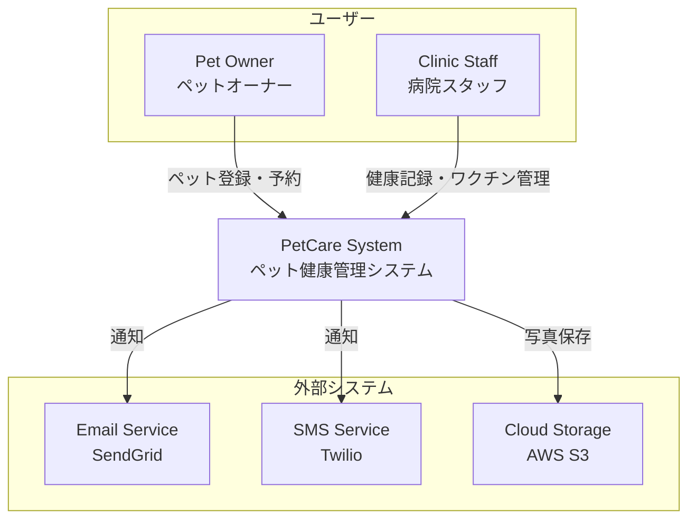
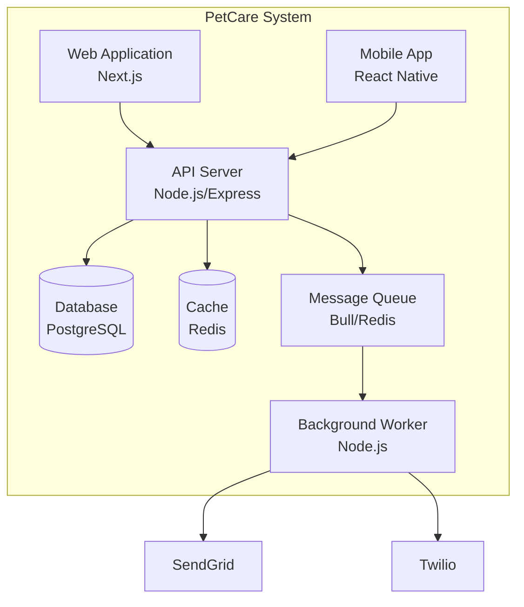
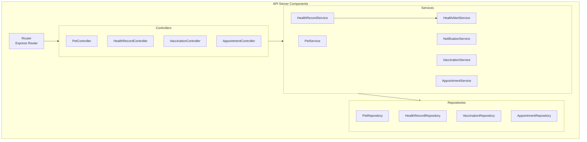
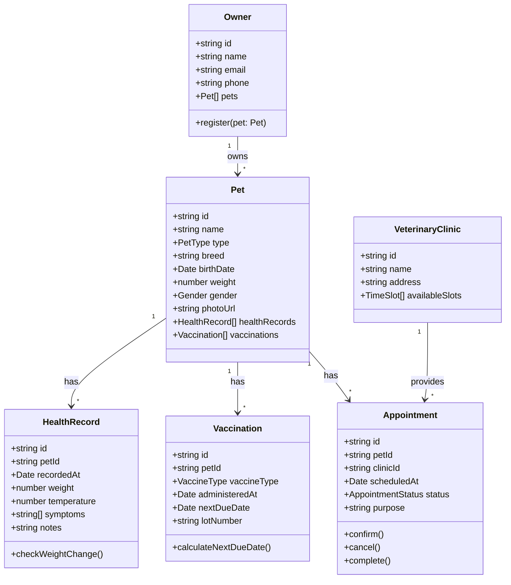
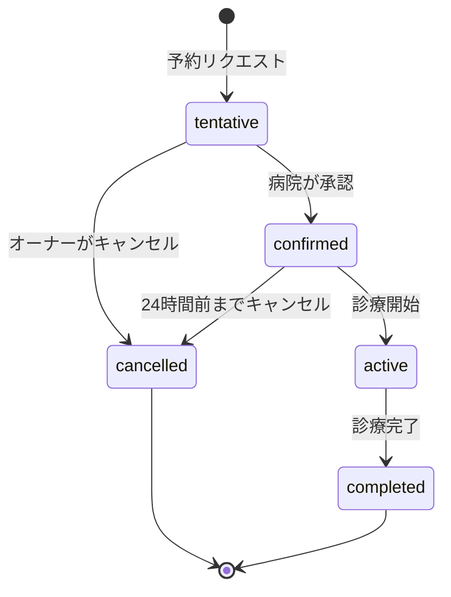

# DES-PET-001: ペット健康管理システム設計書

## 1. C4モデル

### Level 1: System Context



### Level 2: Container



### Level 3: Component（API Server）



## 2. ドメインモデル



## 3. 設計パターン適用

| パターン | 適用箇所 | 理由 |
|---------|---------|------|
| **Repository** | データアクセス層 | データ永続化の抽象化 |
| **Service** | ビジネスロジック層 | ドメインロジックの集約 |
| **Observer** | 健康アラート | 体重変動の監視・通知 |
| **Strategy** | 通知サービス | Email/SMS/Push切り替え |
| **Factory** | ID生成 | ユニークID生成の一元化 |
| **State** | 予約ステータス | 状態遷移の管理 |

## 4. コンポーネント詳細

### 4.1 PetService

```typescript
interface IPetService {
  register(ownerId: string, petData: PetInput): Promise<Pet>;
  update(petId: string, petData: Partial<PetInput>): Promise<Pet>;
  getByOwner(ownerId: string): Promise<Pet[]>;
  getById(petId: string): Promise<Pet | null>;
  delete(petId: string): Promise<void>;
}
```

### 4.2 HealthRecordService

```typescript
interface IHealthRecordService {
  create(petId: string, record: HealthRecordInput): Promise<HealthRecord>;
  getHistory(petId: string, options?: QueryOptions): Promise<HealthRecord[]>;
  checkWeightChange(petId: string): Promise<WeightAlert | null>;
}
```

### 4.3 VaccinationService

```typescript
interface IVaccinationService {
  record(petId: string, vaccination: VaccinationInput): Promise<Vaccination>;
  getUpcoming(petId: string): Promise<Vaccination[]>;
  getDueReminders(): Promise<VaccinationReminder[]>;
}
```

### 4.4 AppointmentService

```typescript
interface IAppointmentService {
  create(petId: string, clinicId: string, data: AppointmentInput): Promise<Appointment>;
  confirm(appointmentId: string): Promise<Appointment>;
  cancel(appointmentId: string, reason?: string): Promise<Appointment>;
  complete(appointmentId: string): Promise<Appointment>;
  getAvailableSlots(clinicId: string, date: Date): Promise<TimeSlot[]>;
}
```

## 5. 状態遷移（予約）



## 6. API設計

| Endpoint | Method | 説明 | 要件ID |
|----------|--------|------|--------|
| `/pets` | POST | ペット登録 | REQ-PET-001-01 |
| `/pets/:petId` | GET | ペット詳細取得 | REQ-PET-001-02 |
| `/owners/:ownerId/pets` | GET | オーナーのペット一覧 | REQ-PET-001-02 |
| `/pets/:petId/health-records` | POST | 健康記録作成 | REQ-PET-001-03 |
| `/pets/:petId/health-records` | GET | 健康記録履歴 | REQ-PET-001-03 |
| `/pets/:petId/vaccinations` | POST | ワクチン記録 | REQ-PET-001-05 |
| `/appointments` | POST | 予約作成 | REQ-PET-001-07 |
| `/appointments/:id/cancel` | PUT | 予約キャンセル | REQ-PET-001-08 |

## 7. 非機能設計

### 7.1 セキュリティ
- JWT認証
- RBAC（Owner/Staff/Admin）
- データ暗号化（AES-256）
- 監査ログ

### 7.2 パフォーマンス
- Redis キャッシュ（ペット情報）
- ページネーション（健康記録）
- 非同期通知処理

### 7.3 可用性
- データベースレプリケーション
- ヘルスチェックエンドポイント
- Graceful Shutdown

## 8. トレーサビリティ

| 設計要素 | 対応要件 |
|---------|---------|
| PetService.register | REQ-PET-001-01 |
| PetService.getByOwner | REQ-PET-001-02 |
| HealthRecordService.create | REQ-PET-001-03 |
| HealthAlertService.check | REQ-PET-001-04 |
| VaccinationService.record | REQ-PET-001-05 |
| NotificationService.sendReminder | REQ-PET-001-06 |
| AppointmentService.create | REQ-PET-001-07 |
| AppointmentService.cancel | REQ-PET-001-08 |

---
**作成日**: 2026-01-04  
**バージョン**: 1.0  
**ステータス**: Draft
