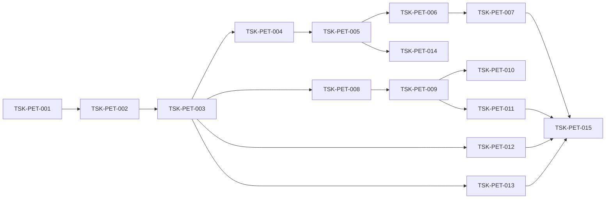

# TSK-PET-001: ペット健康管理システム実装タスク

## タスク一覧

### Sprint 1: 基盤構築

| ID | タスク | 優先度 | 見積 | 担当 | ステータス |
|----|--------|-------|------|------|-----------|
| TSK-PET-001 | プロジェクト初期化・技術スタック設定 | P0 | 2h | - | pending |
| TSK-PET-002 | ドメインモデル（型定義）作成 | P0 | 3h | - | pending |
| TSK-PET-003 | IdGenerator/StatusWorkflow統合 | P0 | 2h | - | pending |

### Sprint 2: ペット管理機能

| ID | タスク | 優先度 | 見積 | 担当 | ステータス |
|----|--------|-------|------|------|-----------|
| TSK-PET-004 | PetRepository実装 | P0 | 3h | - | pending |
| TSK-PET-005 | PetService実装 | P0 | 4h | - | pending |
| TSK-PET-006 | PetController実装 | P0 | 2h | - | pending |
| TSK-PET-007 | ペット登録APIテスト | P0 | 2h | - | pending |

### Sprint 3: 健康記録機能

| ID | タスク | 優先度 | 見積 | 担当 | ステータス |
|----|--------|-------|------|------|-----------|
| TSK-PET-008 | HealthRecordRepository実装 | P0 | 3h | - | pending |
| TSK-PET-009 | HealthRecordService実装 | P0 | 4h | - | pending |
| TSK-PET-010 | HealthAlertService実装 | P1 | 3h | - | pending |
| TSK-PET-011 | 健康記録APIテスト | P0 | 2h | - | pending |

### Sprint 4: ワクチン・予約機能

| ID | タスク | 優先度 | 見積 | 担当 | ステータス |
|----|--------|-------|------|------|-----------|
| TSK-PET-012 | VaccinationService実装 | P0 | 4h | - | pending |
| TSK-PET-013 | AppointmentService実装 | P0 | 5h | - | pending |
| TSK-PET-014 | NotificationService実装 | P0 | 4h | - | pending |
| TSK-PET-015 | 統合テスト | P0 | 4h | - | pending |

## 依存関係

## トレーサビリティ

| タスクID | 設計ID | 要件ID |
|---------|--------|--------|
| TSK-PET-004〜007 | DES-PET-001 | REQ-PET-001-01, 02 |
| TSK-PET-008〜011 | DES-PET-002 | REQ-PET-001-03, 04 |
| TSK-PET-012 | DES-PET-003 | REQ-PET-001-05, 06 |
| TSK-PET-013 | DES-PET-004 | REQ-PET-001-07, 08 |
| TSK-PET-014 | DES-PET-005 | REQ-PET-001-06 |
