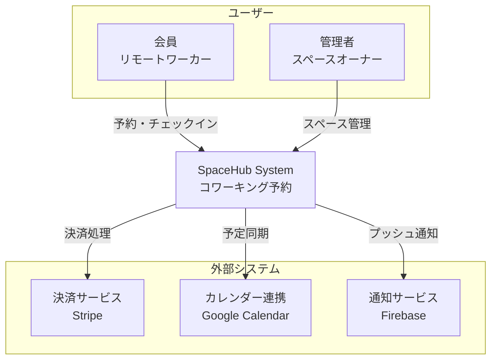
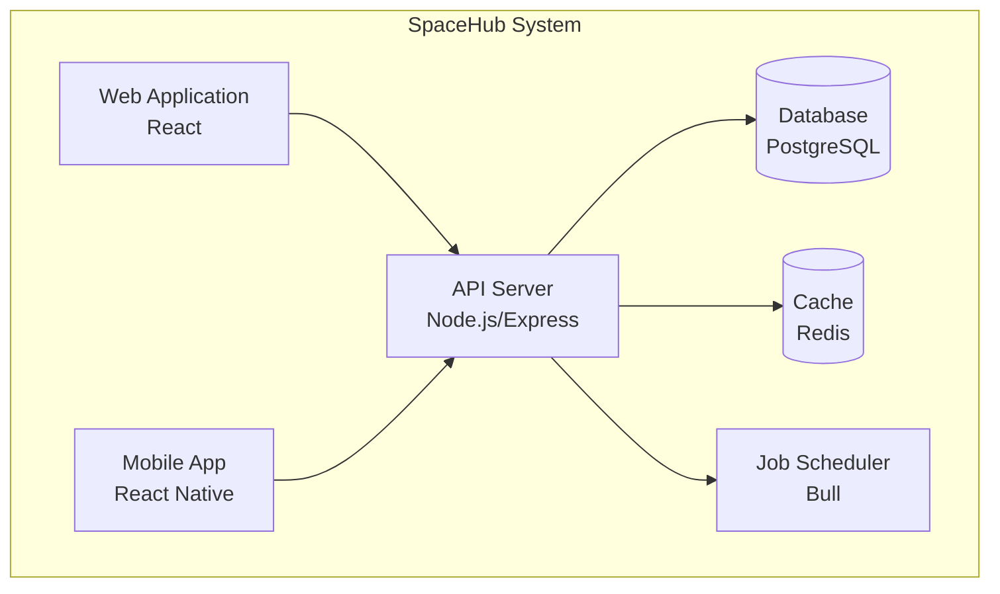
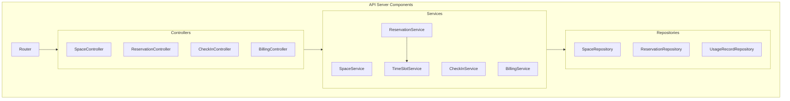
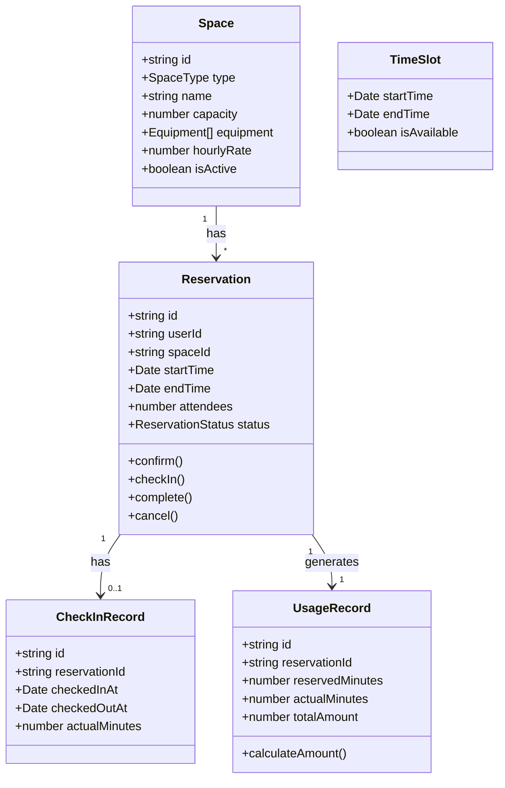
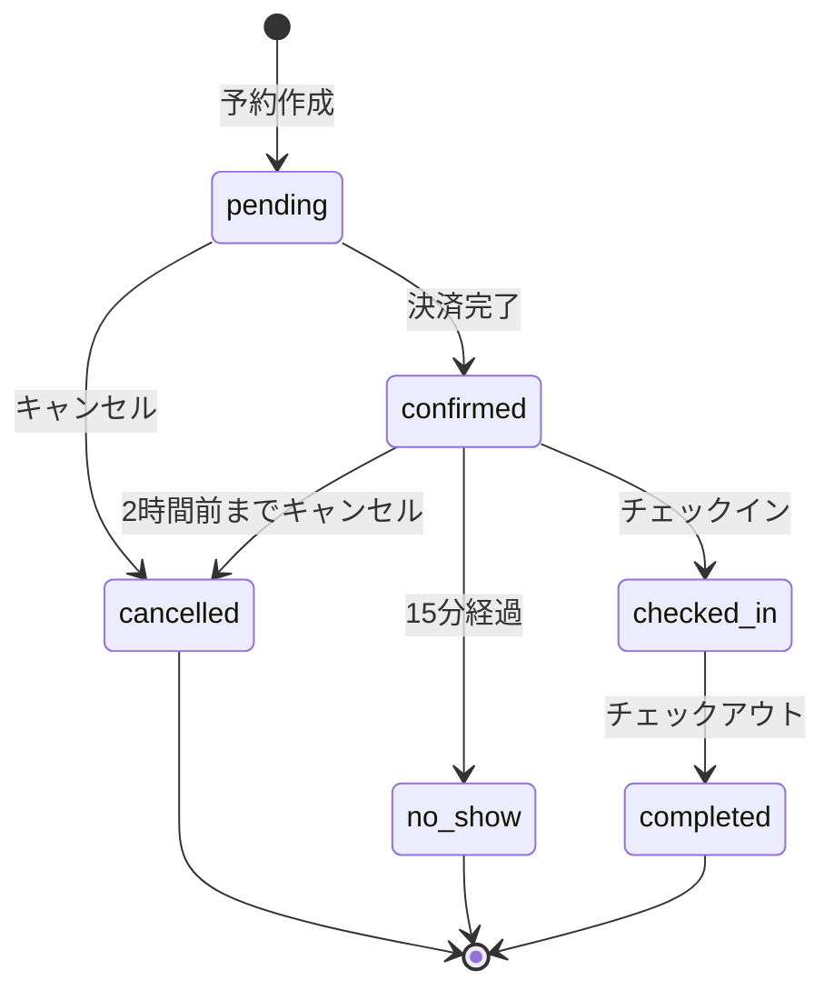

# DES-COWORK-001: コワーキングスペース予約システム設計書

## 1. C4モデル

### Level 1: System Context



### Level 2: Container



### Level 3: Component（API Server）



## 2. ドメインモデル



## 3. 状態遷移（予約）



## 4. 設計パターン適用

| パターン | 適用箇所 | 理由 |
|---------|---------|------|
| **Repository** | データアクセス | 永続化抽象化 |
| **State** | 予約ステータス | 複雑な状態遷移 |
| **Strategy** | 料金計算 | 料金体系の柔軟性 |
| **Factory** | ID生成 | 一意性保証 |
| **Observer** | 通知 | イベント駆動通知 |

## 5. TimeSlot計算ロジック

```typescript
interface ITimeSlotService {
  // 15分単位でスロットを生成
  generateSlots(date: Date, spaceId: string): TimeSlot[];
  
  // 空きスロットを検索
  findAvailableSlots(
    spaceId: string,
    date: Date,
    durationMinutes: number
  ): TimeSlot[];
  
  // 重複チェック（5分バッファ含む）
  hasConflict(
    spaceId: string,
    startTime: Date,
    endTime: Date,
    excludeReservationId?: string
  ): boolean;
}
```

## 6. 料金計算ロジック

```typescript
interface IBillingService {
  // 予約料金を計算
  calculateReservationFee(
    spaceId: string,
    startTime: Date,
    endTime: Date
  ): number;
  
  // キャンセル返金額を計算
  calculateRefund(
    reservationId: string,
    cancelTime: Date
  ): { amount: number; percentage: number };
  
  // 延長料金を計算
  calculateExtensionFee(
    reservationId: string,
    additionalMinutes: number
  ): number;
}
```

## 7. API設計

| Endpoint | Method | 説明 | 要件ID |
|----------|--------|------|--------|
| `/spaces` | GET | スペース検索 | REQ-COWORK-001-02 |
| `/spaces/:id/slots` | GET | 空きスロット取得 | REQ-COWORK-001-02 |
| `/reservations` | POST | 予約作成 | REQ-COWORK-001-03 |
| `/reservations/:id` | PUT | 予約変更 | REQ-COWORK-001-05 |
| `/reservations/:id/cancel` | PUT | 予約キャンセル | REQ-COWORK-001-06 |
| `/reservations/:id/check-in` | POST | チェックイン | REQ-COWORK-001-07 |
| `/reservations/:id/check-out` | POST | チェックアウト | REQ-COWORK-001-08 |
| `/users/:id/usage-history` | GET | 利用履歴 | REQ-COWORK-001-10 |

---
**作成日**: 2026-01-04  
**バージョン**: 1.0
