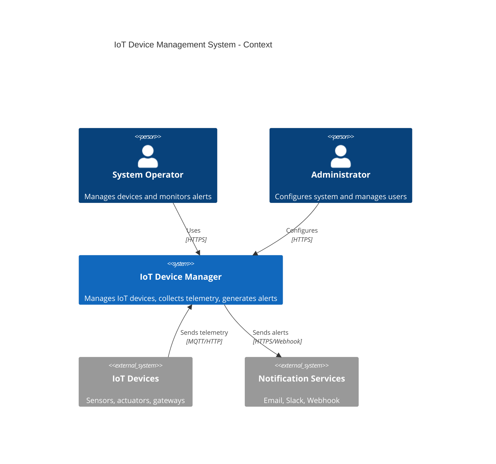
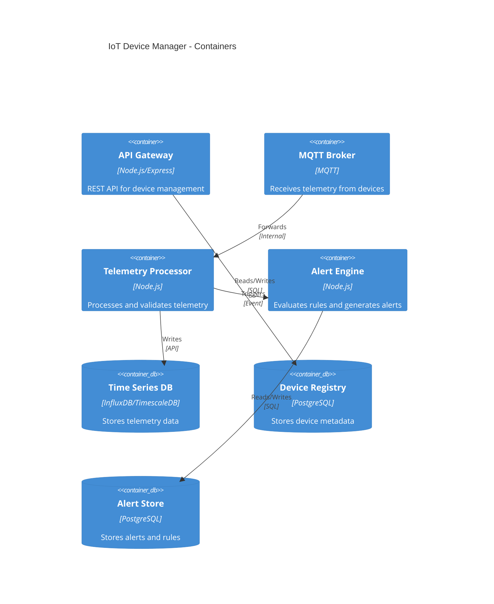

# IoT Device Management System - C4 Design

## Document Information

- **Project**: IoT Device Management System
- **Version**: 1.0.0
- **Date**: 2026-01-06
- **Level**: Component

---

## 1. Context Diagram



---

## 2. Container Diagram



---

## 3. Component Diagram

### 3.1 Domain Layer

| Component | Type | Responsibility | Traces To |
|-----------|------|----------------|-----------|
| Device | Entity | Represents an IoT device with metadata | REQ-DEV-001 |
| DeviceStatus | Value Object | Device status enumeration | REQ-DEV-002 |
| DeviceGroup | Entity | Logical grouping of devices | REQ-DEV-003 |
| Telemetry | Entity | Sensor reading with timestamp | REQ-DATA-001 |
| Alert | Entity | Generated alert from threshold violation | REQ-ALERT-001 |
| AlertRule | Entity | Threshold rule configuration | REQ-ALERT-001 |
| FirmwareVersion | Value Object | Semantic version of device firmware | REQ-LIFE-001 |

### 3.2 Application Layer

| Component | Type | Responsibility | Traces To |
|-----------|------|----------------|-----------|
| DeviceService | Service | Device CRUD operations | REQ-DEV-001, REQ-DEV-002 |
| DeviceGroupService | Service | Group management and batch operations | REQ-DEV-003 |
| TelemetryService | Service | Telemetry ingestion and validation | REQ-DATA-001, REQ-DATA-002 |
| DataQueryService | Service | Historical data retrieval | REQ-DATA-003 |
| AlertService | Service | Alert generation and management | REQ-ALERT-001, REQ-ALERT-003 |
| NotificationService | Service | Multi-channel notification delivery | REQ-ALERT-002 |
| DeviceStatsService | Service | Device health statistics | REQ-LIFE-002 |
| AuthenticationService | Service | Device authentication | REQ-SEC-001 |

### 3.3 Infrastructure Layer

| Component | Type | Responsibility | Traces To |
|-----------|------|----------------|-----------|
| DeviceRepository | Repository | Device persistence | REQ-DEV-001 |
| TelemetryRepository | Repository | Time-series data persistence | REQ-DATA-002 |
| AlertRepository | Repository | Alert persistence | REQ-ALERT-001 |
| MqttAdapter | Adapter | MQTT protocol handling | REQ-DATA-001 |
| HttpAdapter | Adapter | REST API handling | REQ-DEV-001 |
| EmailNotifier | Adapter | Email notification | REQ-ALERT-002 |
| SlackNotifier | Adapter | Slack notification | REQ-ALERT-002 |
| WebhookNotifier | Adapter | Webhook notification | REQ-ALERT-002 |

---

## 4. Design Patterns Applied

| Pattern | Category | Application | Rationale |
|---------|----------|-------------|-----------|
| Factory | Creational | DeviceFactory | Creates devices based on type |
| Repository | Structural | All repositories | Abstracts data persistence |
| Observer | Behavioral | AlertEngine | Telemetry triggers alert evaluation |
| Strategy | Behavioral | NotificationService | Multiple notification channels |
| Adapter | Structural | MqttAdapter, HttpAdapter | Protocol abstraction |
| Value Object | DDD | DeviceStatus, FirmwareVersion | Immutable domain concepts |

---

## 5. Data Models

### 5.1 Device Entity

```typescript
interface Device {
  readonly id: DeviceId;
  name: string;
  type: DeviceType; // 'sensor' | 'actuator' | 'gateway'
  status: DeviceStatus; // 'online' | 'offline' | 'maintenance' | 'error'
  location?: string;
  protocol: Protocol; // 'mqtt' | 'http' | 'coap'
  firmwareVersion: FirmwareVersion;
  registeredAt: Date;
  lastSeenAt?: Date;
}
```

### 5.2 Telemetry Entity

```typescript
interface Telemetry {
  readonly id: TelemetryId;
  deviceId: DeviceId;
  timestamp: Date;
  value: number;
  unit: string;
  metadata?: Record<string, unknown>;
}
```

### 5.3 Alert Entity

```typescript
interface Alert {
  readonly id: AlertId;
  deviceId: DeviceId;
  ruleId: RuleId;
  severity: AlertSeverity; // 'info' | 'warning' | 'critical'
  status: AlertStatus; // 'active' | 'acknowledged' | 'resolved'
  value: number;
  threshold: number;
  message: string;
  createdAt: Date;
  acknowledgedAt?: Date;
  acknowledgedBy?: UserId;
}
```

---

## 6. API Endpoints

| Method | Endpoint | Description | Traces To |
|--------|----------|-------------|-----------|
| POST | /api/devices | Register a new device | REQ-DEV-001 |
| GET | /api/devices | List all devices | REQ-DEV-001 |
| GET | /api/devices/:id | Get device details | REQ-DEV-001 |
| PATCH | /api/devices/:id/status | Update device status | REQ-DEV-002 |
| DELETE | /api/devices/:id | Unregister device | REQ-DEV-001 |
| POST | /api/groups | Create device group | REQ-DEV-003 |
| POST | /api/telemetry | Receive telemetry data | REQ-DATA-001 |
| GET | /api/telemetry/:deviceId | Query historical data | REQ-DATA-003 |
| GET | /api/alerts | List alerts | REQ-ALERT-001 |
| PATCH | /api/alerts/:id/acknowledge | Acknowledge alert | REQ-ALERT-003 |
| GET | /api/devices/:id/stats | Get device statistics | REQ-LIFE-002 |

---

## 7. Traceability Matrix

| Requirement | Design Component | Status |
|-------------|------------------|--------|
| REQ-DEV-001 | Device, DeviceService, DeviceRepository | ✅ |
| REQ-DEV-002 | DeviceStatus, DeviceService | ✅ |
| REQ-DEV-003 | DeviceGroup, DeviceGroupService | ✅ |
| REQ-DATA-001 | Telemetry, TelemetryService, MqttAdapter | ✅ |
| REQ-DATA-002 | TelemetryRepository | ✅ |
| REQ-DATA-003 | DataQueryService | ✅ |
| REQ-ALERT-001 | Alert, AlertRule, AlertService | ✅ |
| REQ-ALERT-002 | NotificationService, EmailNotifier, SlackNotifier | ✅ |
| REQ-ALERT-003 | AlertService | ✅ |
| REQ-LIFE-001 | FirmwareVersion, Device | ✅ |
| REQ-LIFE-002 | DeviceStatsService | ✅ |
| REQ-SEC-001 | AuthenticationService | ✅ |
| REQ-SEC-002 | TLS configuration | ✅ |
| REQ-PERF-001 | Connection pooling, async processing | ✅ |
